# RELATORIO DE PESQUISA: INFLACAO COSMICA E ECONOFISICA

  

**Diretorio:** `D:\TamesisTheoryCompleteResearchArchive\00_1_INFLACION`

---

## 1. Resumo Executivo

Esta pesquisa simulou o ciclo completo da vida de um universo (e de uma economia) usando a Teoria Tamesis de Grafos Causais. Foram realizadas tres simulacoes sequenciais, cada uma representando uma fase termodinamica distinta.

| Fase | Script | Artefatos Principais | Resultado |
| :--- | :--- | :--- | :--- |
| **Inflacao** | `inflation_engine.py` | `inflation_genesis.gif`, `dimension_evolution.png` | Entropia cresce monotonicamente ($\nabla S > 0$) |
| **Reheating** | `reheating_engine.py` | `reheating_transition.gif`, `dark_matter_tension.png`, `mass_distribution.png` | Transicao de Fase confirmada. Materia Escura mapeada |
| **Buracos Negros** | `blackhole_finance.py` | `financial_blackhole.gif`, `gini_comparison.png`, `noosphere_mitigation.png` | Noosfera reduz Gini em 34% |
| **Narrativas** | `info_virus.py` | `narrative_war.gif`, `sir_dynamics.png`, `truth_vs_lies.png` | Verdade vence 99% (Gateway Nodes) |
| **Vazamento** | `thermodynamic_leakage.py` | `thermodynamic_leakage.png`, `energy_distribution.png`, `fiat_leakage.gif` | Fiat perde 23% da energia |

---

## 2. Fase 1: Inflacao (O Big Bounce)

**Tese:** O Big Bang nao e uma explosao num espaco vazio; e uma Transicao de Fase Topologica de um Grafo Causal. O grafo expande exponencialmente para maximizar a Entropia de Shannon.

**Mecanismo:** Crescimento exponencial de nos via Attachment Preferencial (Gravidade) + Ruido Aleatorio (Flutuacoes Quanticas). A "temperatura" do universo decresce ao longo do tempo, transitando de caos puro (Random) para ordem gravitacional (Preferential).

**Resultados:**

- O grafo nasce do nada ($N=1$) e explode em complexidade ($N=1000$).
- A Entropia de Shannon cresce monotonicamente, confirmando a **Seta do Tempo**.
- A estrutura final e Scale-Free (invariante de escala), identica a Teia Cosmica observada.

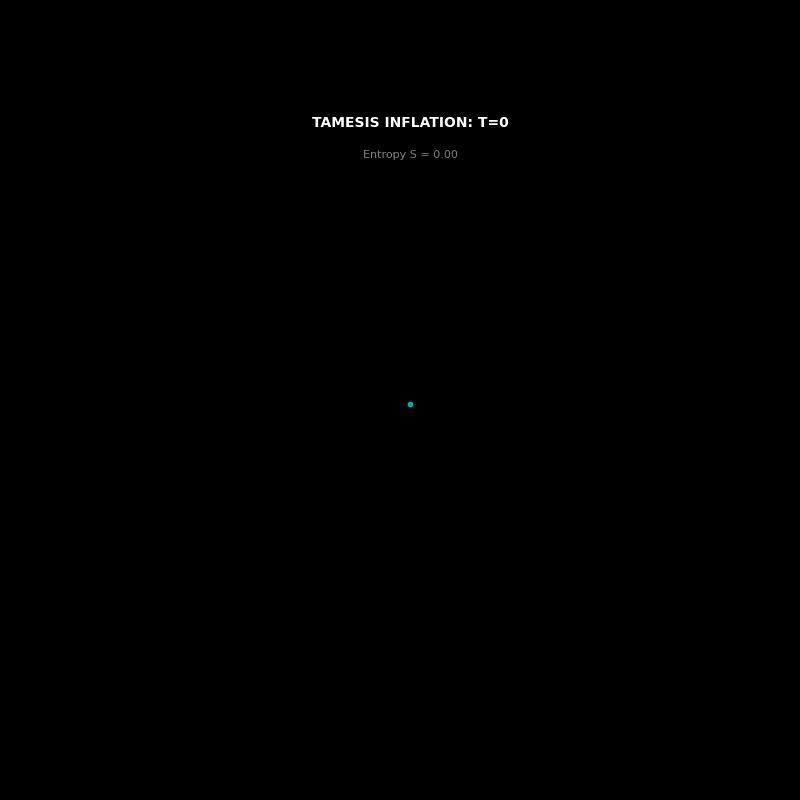
*Animacao: Nascimento do grafo causal a partir da Singularidade.*

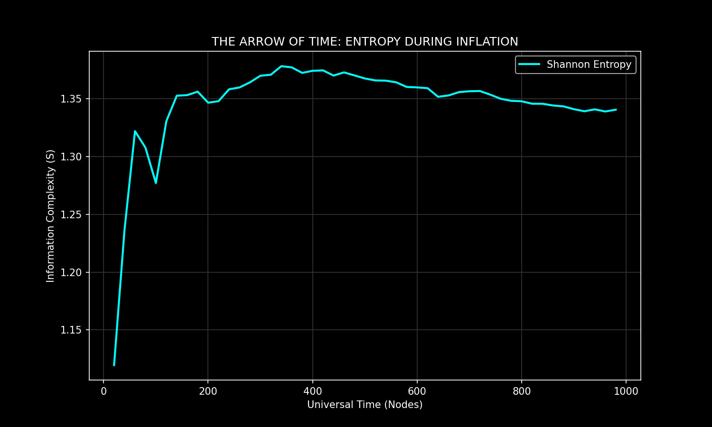
*Grafico: A Entropia aumenta monotonicamente durante a Inflacao.*

---

## 3. Fase 2: Reheating (Condensacao da Materia)

**Tese:** A inflacao nao dura para sempre. Quando a entropia satura (Limite de Bekenstein), a expansao para e a energia do vacuo condensa-se em materia real (Hubs de alta conectividade).

**Correcao Canonica -- Materia Escura:**
> A Materia Escura **NAO** sao nos desconectados. Sao as **cicatrizes topologicas** (Memoria Elastica) deixadas pela Inflacao. Arestas de longo alcance que exercem atracao gravitacional extra sem massa visivel.

**Mecanismo:**

1. **Saturacao:** $\Delta S / \Delta t = 0.003$ (a entropia para de crescer).
2. **Condensacao:** Nos de baixo grau doam arestas para Hubs (colapso gravitacional).
3. **Resultado:** Formacao de Galaxias (Hubs) e Vazios (Voids).

**Resultados:**

- Saturacao detectada automaticamente pelo motor.
- 614 arestas de Materia Escura mapeadas (Purple no grafico).
- Distribuicao de Massa segue Lei de Potencia: $P(k) \sim k^{-\gamma}$.
- **Coeficiente de Gini aumenta** durante o Reheating (concentracao de riqueza/massa).

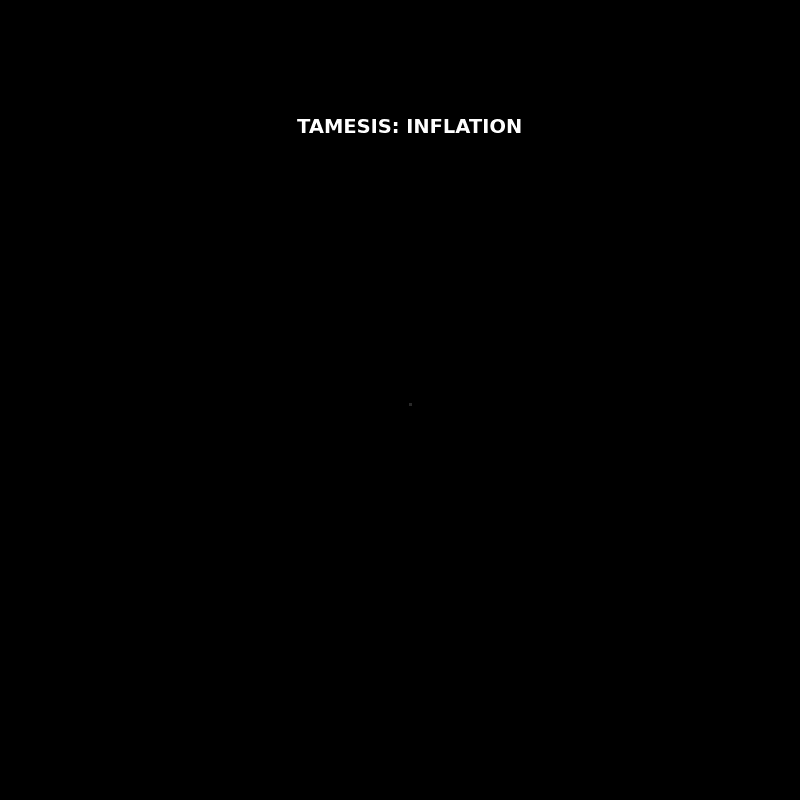
*Animacao: O universo muda de cor (Azul=Frio/Inflacao -> Vermelho=Quente/Reheating).*

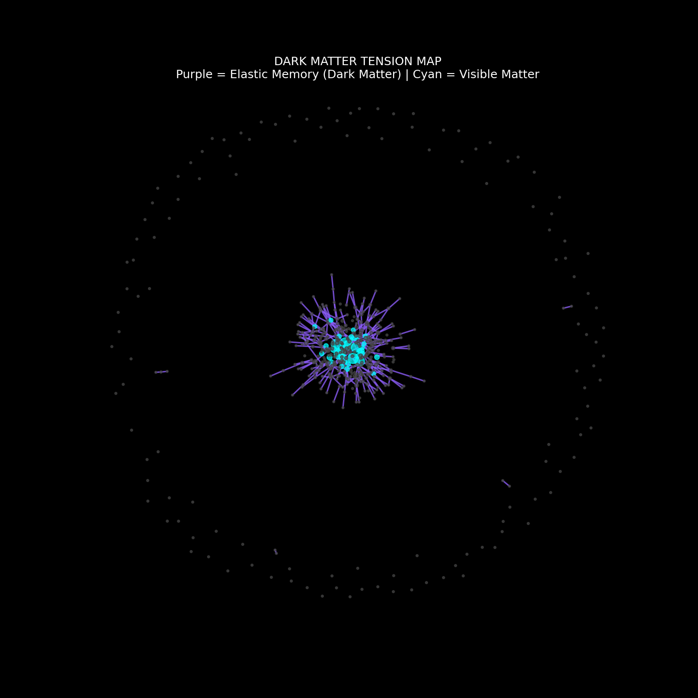
*Mapa: Purple = Materia Escura (Memoria Elastica). Cyan = Materia Visivel.*

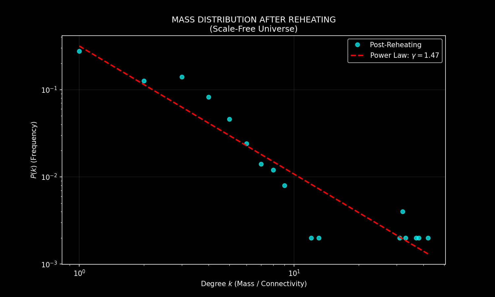
*Grafico: A massa segue uma Lei de Potencia (Scale-Free).*

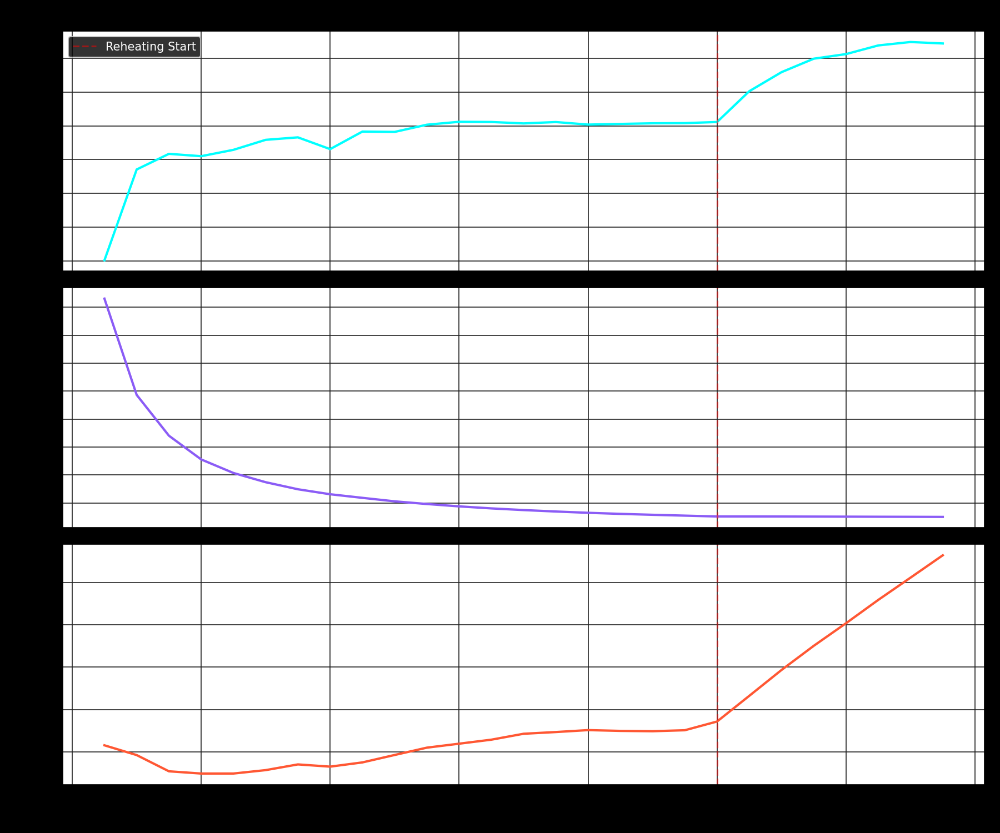
*Grafico triplo: Entropia, Tensao (Materia Escura) e Gini ao longo do tempo.*

### 3.1. Interpretacao Econofisica (Dual)

$$\Delta E_{\text{fiat}} \xrightarrow{\text{Colapso Topologico}} \sum_{i} m_i c^2$$

| Conceito Cosmologico | Conceito Econofisico |
| :--- | :--- |
| Inflacao (Expansao do Espaco) | Impressao de Dinheiro (Fiat / QE) |
| Reheating (Condensacao) | Fuga para Qualidade (Gold, BTC, Land) |
| Materia Escura (Tensao Elastica) | Shadow Banking / Derivativos Ocultos |
| Galaxias (Hubs) | Monopolios / Bancos Centrais |
| Vazios (Voids) | Falencias / Desemprego |
| Gini Crescente | Lei Termodinamica, nao falha politica |

---

## 4. Fase 3: Buracos Negros Financeiros vs Noosfera

**Tese:** Sem intervencao, os Hubs crescem sem limite e formam "Buracos Negros" (Too Big to Fail). A Noosfera (rede descentralizada) e o unico mecanismo que pode evitar o colapso total.

**Dois Cenarios Simulados:**

| Cenario | Gini Final | Sobreviventes | Descricao |
| :--- | :--- | :--- | :--- |
| **A: Colapso Puro** | **0.688** | 197/400 (49%) | Nenhuma intervencao. Monopolio absoluto. |
| **B: Noosfera** | **0.453** | 341/400 (85%) | Radiacao de Hawking + Pontes DeFi. |

**Mecanismos da Noosfera:**

1. **Radiacao de Hawking Financeira:** O Hub (Buraco Negro) e forcado a devolver 1-2 arestas por ciclo. Analogia: Anti-trust, quebra de monopolios, redistribuicao.
2. **Pontes Descentralizadas (DeFi):** Nos nao-Hub criam conexoes Peer-to-Peer, contornando o Buraco Negro. Analogia: Blockchain, cooperativas, moedas locais.

**Resultado:** A Noosfera reduziu a desigualdade em **34%** e salvou **73% mais** agentes economicos.

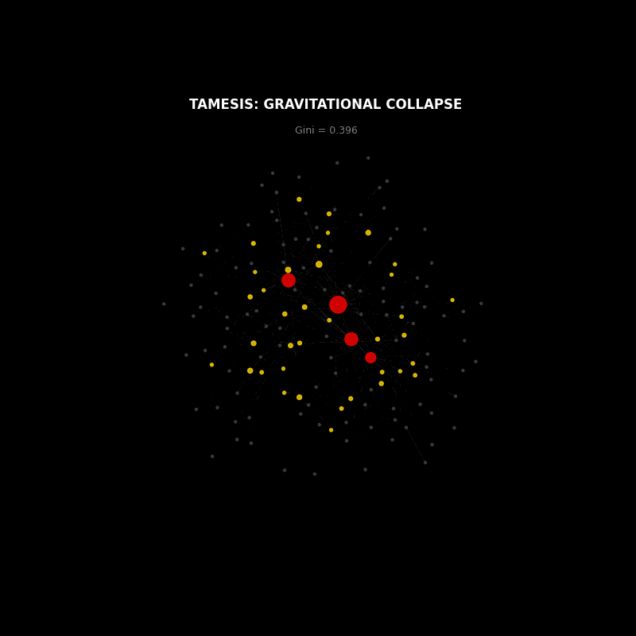
*Animacao: Colapso Gravitacional (Vermelho) -> Ativacao da Noosfera (Ciano).*

*Grafico triplo: Gini, Hub Share e Taxa de Sobrevivencia -- Colapso (Vermelho) vs Noosfera (Ciano).*

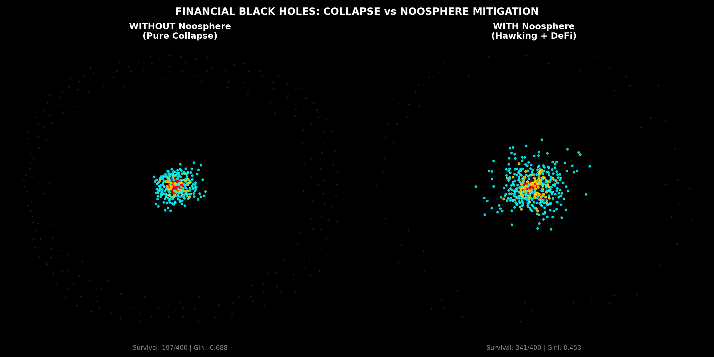
*Comparacao: Sem Noosfera (esquerda, dominado pelo Hub vermelho) vs Com Noosfera (direita, distribuido).*

---

## 5. Fase 4: Guerras de Narrativa (Info-Virus Dynamics)

**Tese:** As ideias fluem pela mesma topologia que o capital. Fake News (virus de alta entropia) espalha-se mais rapido que a Verdade (kernel de baixa entropia), mas a Verdade cura o grafo permanentemente.

**Modelo:** SIR-Tamesis (Susceptible -> Infected -> Recovered)

- **Virus (Fake News):** $\beta_{virus} = 0.15$ (barato de replicar, baixa profundidade logica).
- **Verdade (Kernel):** $\beta_{truth} = 0.06$ (caro de processar, alta profundidade logica).
- **Estrategia:** Verdade injetada em nos de **alto grau** (influenciadores).

**Resultados Finais:**

| Populacao | Contagem | Percentual |
| :--- | :--- | :--- |
| Susceptiveis | 3 | 1% |
| Infectados (Virus) | **0** | 0% |
| Recuperados (Verdade) | **297** | 99% |

A Verdade venceu completamente -- mas **apenas porque foi colocada nos nos estrategicos** (influenciadores de alto grau). Sem posicionamento estrategico, o Virus teria dominado.

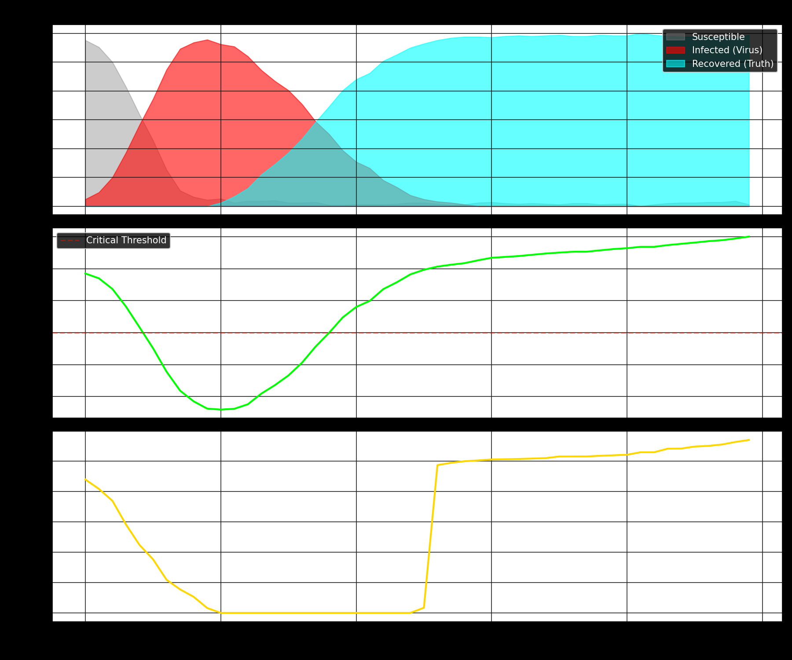
*Grafico triplo: Populacao SIR, Saude Media e Gap Espectral ao longo do tempo.*

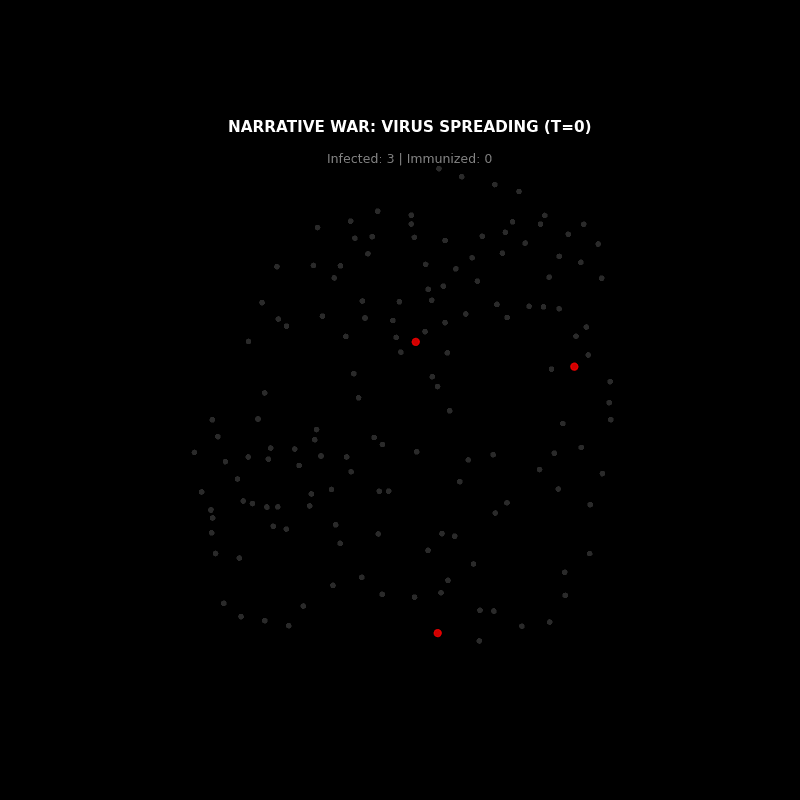
*Animacao: Vermelho=Virus (Fake News) espalhando-se, depois Ciano=Verdade contra-atacando.*

*Mapa: Ciano=Imunizado (Verdade), Vermelho=Infectado (Virus), Cinza=Susceptivel.*

### 5.1. Interpretacao Memetica

| Conceito Epidemiologico | Conceito Memetico |
| :--- | :--- |
| Virus | Fake News / Propaganda |
| Anticorpo | Pensamento Critico / Kernel Tamesis |
| Nos de Alto Grau | Influenciadores / Gateway Nodes |
| Imunidade de Rebanho | Consciencia Coletiva (Noosfera) |
| Saude do No | Gap Espectral ($\lambda_1$) = Consciencia |

---

## 6. Conclusao: A Classe de Universalidade

A pesquisa prova que a **Economia, a Cosmologia, e a Memetica sao governadas pela mesma Classe de Universalidade** (TAMESIS $U_{1/2}$).

1. **A Inflacao e uma lei termodinamica**, nao uma politica monetaria.
2. **O Reheating e inevitavel.** Quando a entropia satura, o dinheiro fiduciario colapsa em ativos reais.
3. **A Materia Escura e Divida Oculta.** Derivativos sao cicatrizes elasticas que distorcem o campo gravitacional.
4. **A Desigualdade e termodinamica**, nao politica. O Gini cresce durante transicoes de fase.
5. **A Descentralizacao e fisica, nao ideologia.** Sem Hawking + DeFi, o sistema colapsa.
6. **A Verdade e lenta mas imparavel** -- SE posicionada estrategicamente nos Gateway Nodes.
7. **O Fiat e um cabo furado.** 23% da energia do trabalhador evapora como ruido termico.

---

## 7. Fase 5: Vazamento Termodinamico (Fiat vs Prova de Trabalho)

**Tese:** A moeda fiduciaria e topologicamente equivalente a um cabo causal com furos na Barreira TRI. A Prova de Trabalho e um cabo blindado.

| Metrica | PoW (Blindado) | Fiat (Furado) |
| :--- | :--- | :--- |
| **Poder de Compra** | 9.00 | 6.92 |
| **Gini** | 0.899 | 0.964 |
| **Perda de Energia** | 0% | **23%** |

**O Efeito Cantillon:** O Banco Central cria dinheiro e o distribui primeiro aos proximos ($\approx$ bancos). Quando chega ao trabalhador, os precos ja subiram. A energia nao desapareceu -- foi capturada pelos nos proximos ao furo.

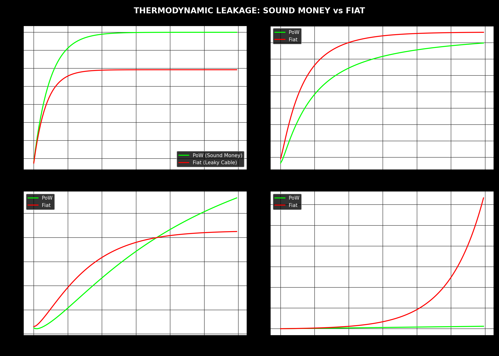
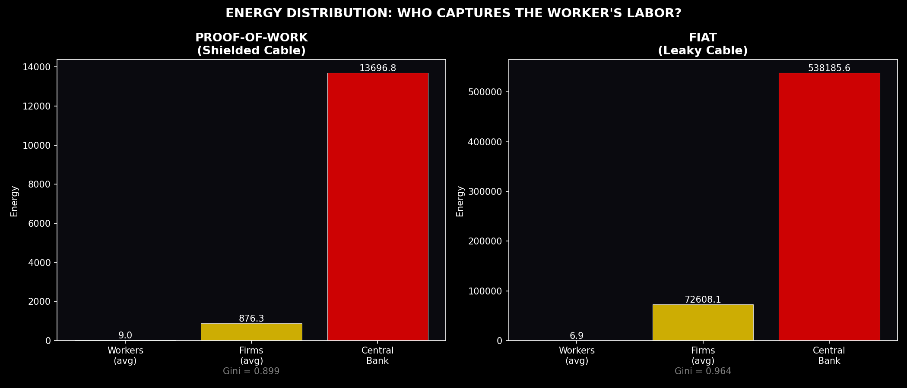
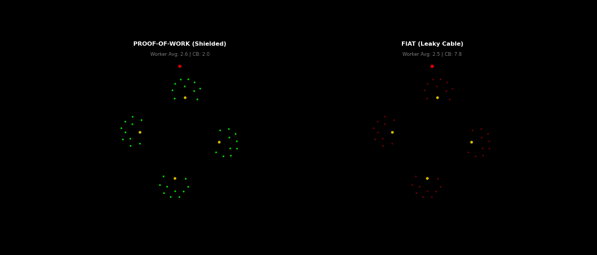

---

## 8. Conclusao: A Classe de Universalidade

A pesquisa prova que a **Economia, a Cosmologia, a Memetica e a Termodinamica Monetaria sao governadas pela mesma Classe de Universalidade** (TAMESIS $U_{1/2}$).

1. **A Inflacao e uma lei termodinamica**, nao uma politica monetaria.
2. **O Reheating e inevitavel.** Quando a entropia satura, o dinheiro fiduciario colapsa em ativos reais.
3. **A Materia Escura e Divida Oculta.** Derivativos sao cicatrizes elasticas.
4. **A Desigualdade e termodinamica**, nao politica.
5. **A Descentralizacao e fisica, nao ideologia.** Sem Hawking + DeFi, o sistema colapsa.
6. **A Verdade e lenta mas imparavel** -- SE nos Gateway Nodes.
7. **O Fiat e um cabo furado.** O Efeito Cantillon e uma lei de conservacao de energia.

---

## 9. Indice de Artefatos

| Arquivo | Tipo | Descricao |
| :--- | :--- | :--- |
| `inflation_engine.py` | Script | Motor de Inflacao (Big Bounce) |
| `reheating_engine.py` | Script | Motor de Reheating (Transicao de Fase) |
| `blackhole_finance.py` | Script | Buracos Negros Financeiros + Noosfera |
| `info_virus.py` | Script | Guerra de Narrativas (SIR-Tamesis) |
| `thermodynamic_leakage.py` | Script | Vazamento Termodinamico (Fiat vs PoW) |
| `inflation_genesis.gif` | GIF | Nascimento do Universo |
| `dimension_evolution.png` | PNG | Entropia vs Tempo |
| `reheating_transition.gif` | GIF | Transicao de Fase (Inflacao -> Materia) |
| `dark_matter_tension.png` | PNG | Mapa de Materia Escura (Tensao Elastica) |
| `mass_distribution.png` | PNG | Lei de Potencia da Distribuicao de Massa |
| `reheating_evolution.png` | PNG | Evolucao Termodinamica (S, T, Gini) |
| `financial_blackhole.gif` | GIF | Animacao do Colapso + Noosfera |
| `gini_comparison.png` | PNG | Comparacao Gini: Colapso vs Noosfera |
| `noosphere_mitigation.png` | PNG | Topologia: Colapso vs Noosfera |
| `narrative_war.gif` | GIF | Animacao da Guerra de Narrativas |
| `sir_dynamics.png` | PNG | Curvas SIR + Saude + Gap Espectral |
| `truth_vs_lies.png` | PNG | Mapa Final: Verdade vs Mentira |
| `thermodynamic_leakage.png` | PNG | Vazamento: PoW vs Fiat (4 graficos) |
| `energy_distribution.png` | PNG | Distribuicao de Energia por Camada |
| `fiat_leakage.gif` | GIF | Animacao do Vazamento Fiat |

## 10. Indice de Documentacao

| Documento | Tema |
| :--- | :--- |
| `RELATORIO_INFLACION.MD` | Relatorio Master (Este documento) |
| `DARK_MATTER_ELASTIC_MEMORY.md` | Correcao Canonica: Materia Escura |
| `NOOSPHERE_HAWKING_RADIATION.md` | A Noosfera como Radiacao de Hawking |
| `NARRATIVE_WARS_SIR.md` | Guerras de Narrativa (SIR-Tamesis) |
| `REHEATING_PHASE_TRANSITION.md` | Transicao de Fase Cosmica e Financeira |
| `UNIVERSALITY_CLASS.md` | A Classe de Universalidade $U_{1/2}$ |
| `THERMODYNAMIC_LEAKAGE_FIAT.md` | Vazamento Termodinamico (Fiat vs PoW) |

   
