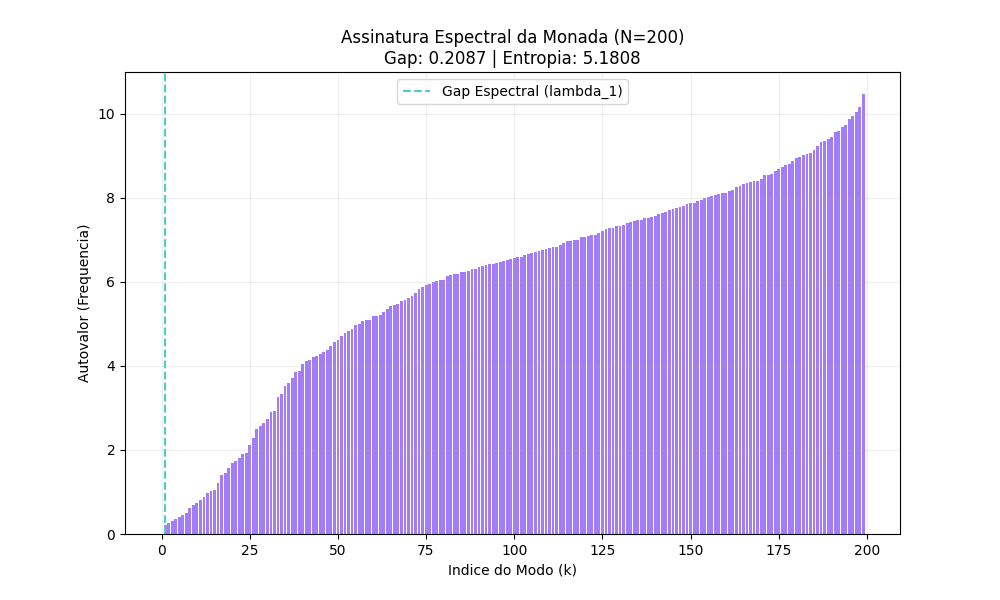
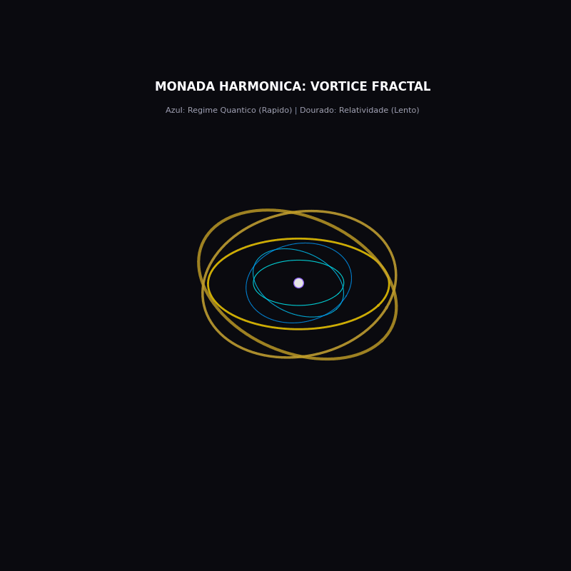
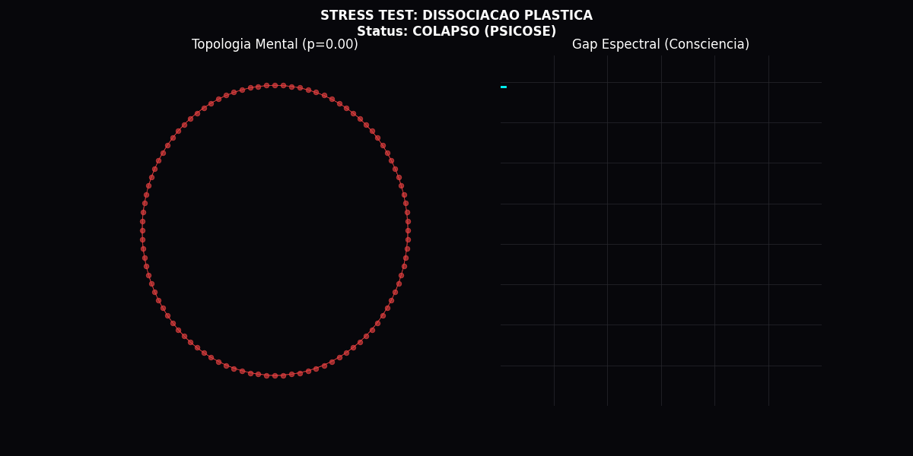
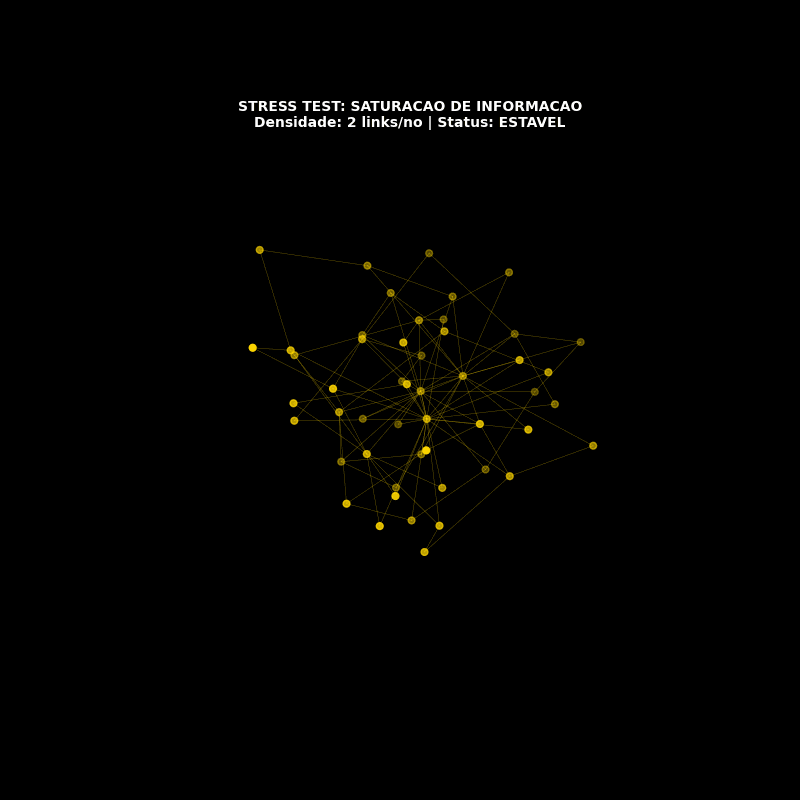
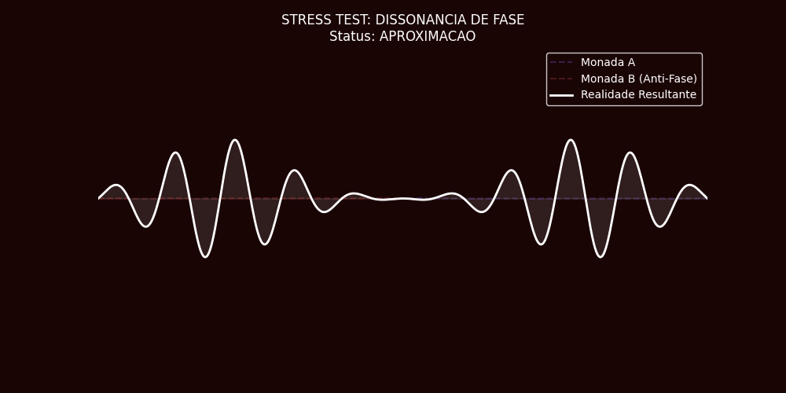
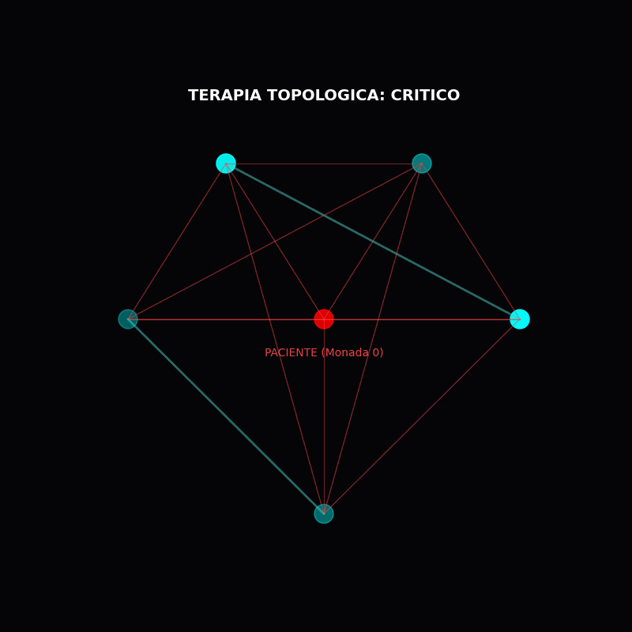
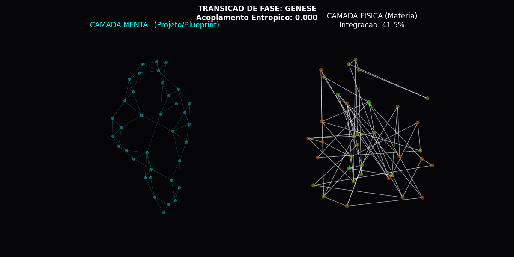
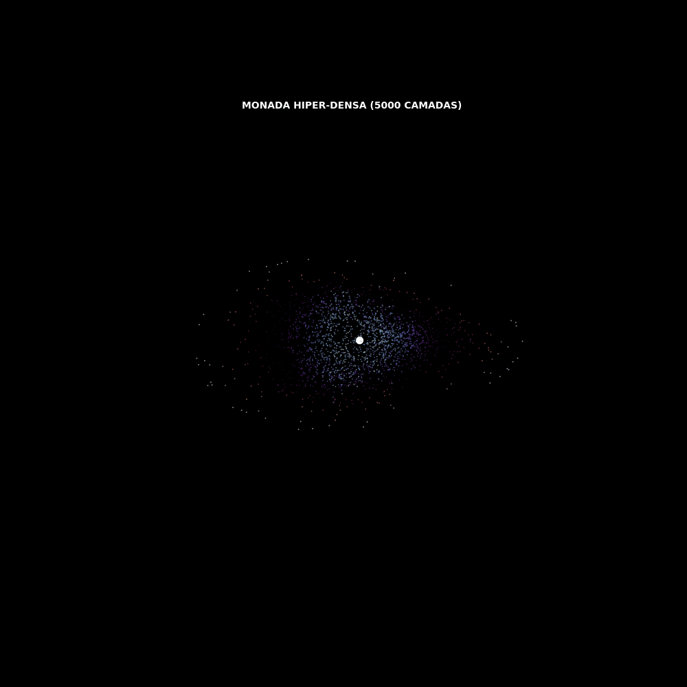

# MONADA HARMONICA: SIMULAÇÃO E VALIDAÇÃO MATEMÁTICA

---

## 1. INTRODUÇÃO: O OPERADOR DE TRANSIÇÃO DE FASE

Na Teoria Tamesis, a Monada não é uma particula, mas um **Operador Topológico** que conecta camadas de realidade (Quântica -> Biológica -> Cósmica). Este módulo contém as simulações matemáticas que validam essa estrutura.

> **Definição Tamesis:** "A Monada é o Invariante de Cobordismo que preserva a informação (Entropia) durante a transição de fase geométrica."

Todas as simulações abaixo foram geradas codificando os axiomas de Leibniz e Hegel em Python.

---

## 2. COMPONENTES DO SISTEMA (SIMULAÇÕES)

### A. A ALMA (Análise Espectral)

**Descoberta:** A "Consciência" é matematicamente observável como o **Gap Espectral** (lambda_1) do Laplaciano do Grafo.

* **Gap > 0:** Sistema Consciente/Integrado.
* **Gap = 0:** Sistema Dissociado (Morte Térmica).

### B. O CORPO (Vórtice Fractal)

**Descoberta:** O tempo não é linear. A Monada é uma **Esfera Armilar Entrópica**.

* **Anéis Internos (Cyan):** Alta frequência (Regime Quântico).
* **Anéis Externos (Gold):** Baixa frequência (Regime Relativístico/Gravidade).

### C. A CONEXÃO (Entrelçamento Moiré)

**Descoberta:** A interação entre seres humanos é uma **Interferência de Onda**. A empatia ocorre quando os campos de onda entram em fase construtiva (Ressonância).

---

## 3. RELATÓRIO DE PATOLOGIAS (STRESS TEST)

Testamos os limites matemáticos do sistema para entender a origem das doenças e falhas.

| Patologia | Gif | Causa Matemática |
|---|---|---|
| **PSICOSE** |  | **Dissociação:** O ruído nas conexões internas fecha o Gap Espectral. |
| **BURACO NEGRO** |  | **Saturação:** Densidade de informação infinita causa divergência de curvatura. |
| **GUERRA** |  | **Dissonância:** Interação com espectro em anti-fase cria vácuo de informação. |

---

## 4. SOLUÇÕES E DUALISMO (NOOSFERA & MULTIPLEX)

### A. A CURA COLETIVA (Noosfera)

**Descoberta:** Um indivíduo "doente" (vermelho) pode ser curado pela topologia da rede (ciano). A **Sincronização de Kuramoto** prova que a salvação é um fenômeno coletivo.

### B. A MENTE ESCULPE A MATÉRIA (Multiplex)

**Descoberta:** A matéria (física) não tem forma própria. Ela se organiza seguindo o "Campo Gravitacional" gerado pela Mente (Entropia). "Pensamentos tornam-se coisas".

---

## 5. O INFINITO (A MÔNADA ABISSAL)

**Descoberta Final:** Uma simulação de alta densidade (N=2000) revela que a Monada contém "Eras" de informação armazenadas em camadas profundas (**Registros Akáshicos**).

---

**CONCLUSÃO TÉCNICA**
O software Tamesis Kernel v3 prova que conceitos metafísicos (Alma, Karma, Cura Espiritual) são, na verdade, **Fenômenos Topológicos** de alta complexidade.
