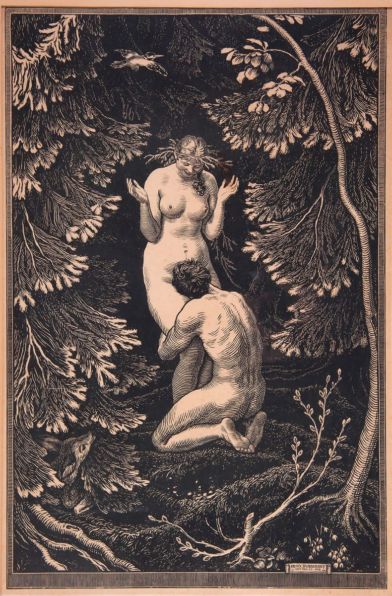

---

# O Que e Alquimia?

> *"O Alquimista nao transmuta metais; ele transmuta a si mesmo, e a materia ao redor apenas obedece a sua nova frequencia."*

---

## Definicao Real

**"Alquimia e a arte de manipular a geometria do vacuo atraves da ressonancia da consciencia para alterar o estado da materia."**

A materia nao e solida; e energia vibrando em uma geometria especifica.

A "Formula Geometrica": A diferenca entre um atomo de Mercurio (80 protons) e Ouro (79 protons) e apenas estrutura e informacao. O alquimista nao "cozinha" a materia; ele reorganiza a informacao dela.

---

## O Processo Alquimico: As Tres Fases

| Fase | Nome | Descricao |
|------|------|-----------|
| 1 | **Nigredo** (O Caos/Inconsciente) | Quebra da forma atual (morte do ego/materia) |
| 2 | **Albedo** (A Purificacao/Consciencia) | A mente visualiza a nova geometria perfeita |
| 3 | **Rubedo** (A Materializacao) | A imposicao dessa nova geometria sobre a materia fisica |

---

## A Linhagem Historica: De Onde Veio o "Codigo"?

### Egito: Kemet (A Terra Negra)

- **Etimologia:** A palavra "Alquimia" vem do arabe *Al-Kimiya*. O prefixo *Al* e "O/A". *Kimiya* vem do grego *Khemia*, que deriva do egipcio *Kemet*.
- **Significado:** Kemet significa "Terra Negra", referindo-se ao lodo fertil do Nilo que dava vida ao deserto.
- **Simbolismo:** Assim como a terra negra gesta a semente no escuro, o Inconsciente (Terra Negra) gesta a realidade antes dela se tornar luz/materia. Os egipcios nao faziam distincao entre ciencia, magia e religiao; tudo era **Heka** (manipulacao de energia).

### India Antiga: Rasayana (O Caminho da Essencia)

- **A Conexao Vedica:** Antes mesmo do Egito dinastico, os textos Vedicos e a tradicao indiana praticavam o *Rasayana* ("O Caminho do Mercurio" ou "Caminho da Essencia").
- **Datacao:** Enquanto a alquimia egipcia floresceu por volta de 3000 a.C., as raizes do Rasayana e do Ayurveda se perdem na historia oral pre-vedica, apoiando a tese de um conhecimento de "+6000 anos".
- **Diferenca Chave:** Enquanto o ocidente focou em "fazer ouro" (riqueza), o Rasayana focava em "fazer o corpo de diamante" (imortalidade e perfeicao celular). Eles entendiam que o corpo humano e o laboratorio final.

---

> **Navegacao:** [Indice](README.md) | [Proximo: Ciencia vs Metodo Alquimico](02_ciencia_vs_metodo_alquimico.md)
