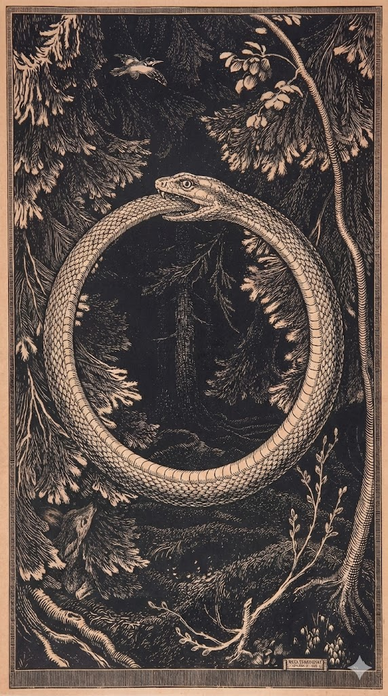

---

# Ouroboros e a Física da Queda

> *"Os antigos chamavam de 'Pecado Original' a expulsão do paraíso. A física chama isso de 'Quebra de Simetria'."*

---

## A Estrutura da Consciência (O Horizonte de Eventos)

A Inconsciência é o **"Bulk"** (o interior do Buraco Negro), o arquivo global de quem somos. A Consciência é a **Tela Holográfica** (o Horizonte de Eventos) onde a realidade é projetada e processada em tempo real.

Segundo os documentos de Topologia Cognitiva da Teoria Tamesis, a consciência é uma integração global de informação. O inconsciente é o armazenamento de alta entropia.

---

## Ouroboros: O Algoritmo de Retroalimentação (Feedback Loop)

**O Símbolo:** A cobra que morde o rabo não é suicídio; é atualização. É um sistema fechado verificando a si mesmo.

**A Dor do "Pecado":** Para aprender algo novo (morder a cauda), o sistema precisa quebrar a simetria anterior.

| Etapa | Descrição |
|-------|-----------|
| **Jardim do Éden** (ignorância) | A entropia é baixa e constante. Tudo é estável. |
| **Comer o Fruto** (o dado, a informação) | Introduz complexidade no sistema. |
| **O Colapso** | Para integrar essa nova informação, a rede neural precisa destruir conexões antigas. |

### A Mecânica do Colapso

Essa "quebra de parâmetro fixo" é a dor, a expulsão do paraíso da estagnação. O cérebro consome energia (glicose/fogo aloquímico) para reescrever a topologia. Isso dói. É o "bug de software" necessário para o upgrade.

---

## A Síntese Alquímico-Científica

> *"O Ouroboros não é apenas uma cobra; é o diagrama de fluxo da sua própria consciência. Para crescer, você precisa devorar quem você era. O 'bug' no sistema, a dor do aprendizado, não é um erro... é o custo termodinâmico da evolução. O Inconsciente é o oceano escuro de tudo o que você já foi, e a Consciência é a luz dolorosa que queima a fronteira do agora. O segredo que os egípcios guardavam é que não somos os habitantes do jardim... nós somos o jardineiro, e a serpente é a nossa ferramenta de poda."*

---

> **Navegação:** [Anterior: Ciência vs Método Alquímico](02_ciencia_vs_metodo_alquimico.md) | [Índice](README.md) | [Próximo: O Cone de Compressão - A Psique](04_o_cone_de_compressao_a_psique.md)
