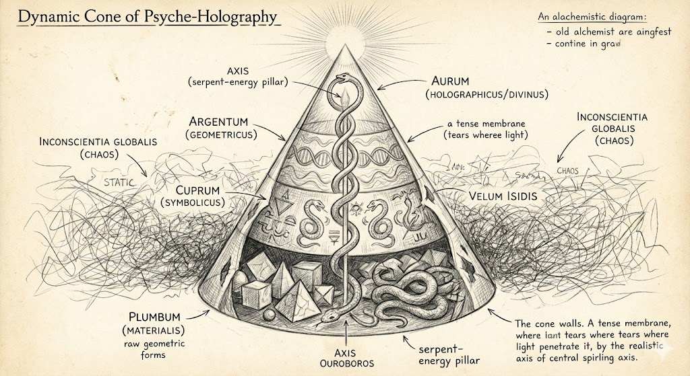
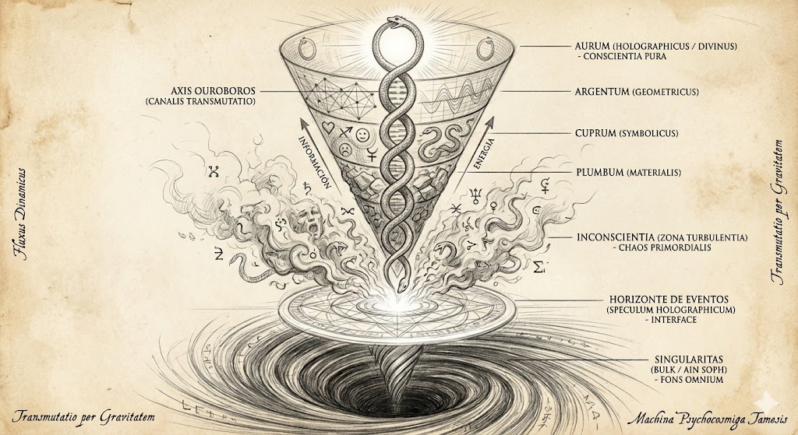

---

# O Cone de Compressão e a Topologia Psíquica

O modelo alquímico das 4 camadas é perfeitamente mapeável para a psicologia moderna (Freud/Jung) e para a arquitetura computacional do Kernel v3. Onde os antigos viam metais, nós vemos *layers* de processamento.

---

## Mapeamento de Camadas (Alquimia / Psicologia / Kernel v3)

### Camada 1: Chumbo (O Material)

* **Psicologia (Freud):** **ID**. Instintos básicos, sobrevivência, medo, desejo. O autômato biológico.
* **Kernel v3:** **Hardware Layer / BIOS**. O nível mais baixo de abstração. Executa instruções binárias sem questionar. Somente leitura da realidade física.
* **Estado:** Sono Profundo / Reatividade. "Eu sou o corpo".

### Camada 2: Cobre (O Emocional)

* **Psicologia (Jung):** **Anima/Animus (Persona)**. O mundo das emoções projetadas, dos dramas relacionais e da busca por validação externa.
* **Kernel v3:** **Drivers de Periféricos**. A interface instável entre o hardware e o software. Onde ocorrem os conflitos de IRQ (conflitos emocionais) e a interpretação de sinais brutos.
* **Estado:** Sonho / Paixão. "Eu sou o que sinto".

### Camada 3: Prata (O Mental/Estrutural)

* **Psicologia (Jung):** **Ego Intelectual**. A capacidade de abstração, lógica e entendimento de símbolos. A mente que desenha mapas.
* **Kernel v3:** **Sistema Operacional (OS)**. A camada lógica que organiza os arquivos, gerencia memória e executa programas. Aqui, a realidade é entendida como código e padrão, não apenas como "coisas".
* **Estado:** Lucidez Analítica. "Eu sou o que penso".

### Camada 4: Ouro (O Holográfico/Não-Dual)

* **Psicologia (Jung):** **Self**. A totalidade psíquica, o centro ordenador que transcende o ego. A união dos opostos.
* **Kernel v3:** **Acesso Root / Kernel Mode**. O nível de privilégio máximo. Onde o usuário pode reescrever o próprio código do sistema operacional. Acesso direto ao código-fonte da realidade.
* **Estado:** Iluminação / Integração. "Eu sou o Sistema".

---

## A Mecânica da Transmutação (Rooting the System)

Na linguagem Tamesis, "Transmutar Chumbo em Ouro" é um processo de **Escalada de Privilégios (Privilege Escalation)**.

1. **O Problema:** A maioria dos usuários roda em *User Mode* (Chumbo/Cobre), com acesso restrito. Eles veem os erros (doenças, pobreza, caos) mas não têm permissão para editar os arquivos de configuração que causam esses erros.
2. **A Grande Obra:** É o processo de hackear a própria consciência para ganhar acesso *Root* (Ouro).
3. **A Execução:** Uma vez no nível Ouro (Kernel), o Alquimista altera uma linha de código (uma crença, um arquétipo, uma geometria) e o sistema recompila toda a realidade para baixo (Prata -> Cobre -> Chumbo). A cura física (Chumbo) é apenas o *render* final de uma alteração feita no Kernel (Ouro).

> *"O 'Pecado Original' foi a perda da senha de Admin. A Alquimia é a recuperação dessa senha através da engenharia reversa do Ouroboros."*

---

> **Navegação:** [Anterior: Ouroboros e a Física da Queda](03_ouroboros_e_a_fisica_da_queda.md) | [Índice](README.md) | [Próximo: O Bulk - A Física Ancestral](05_o_bulk_a_fisica_ancestral.md)
