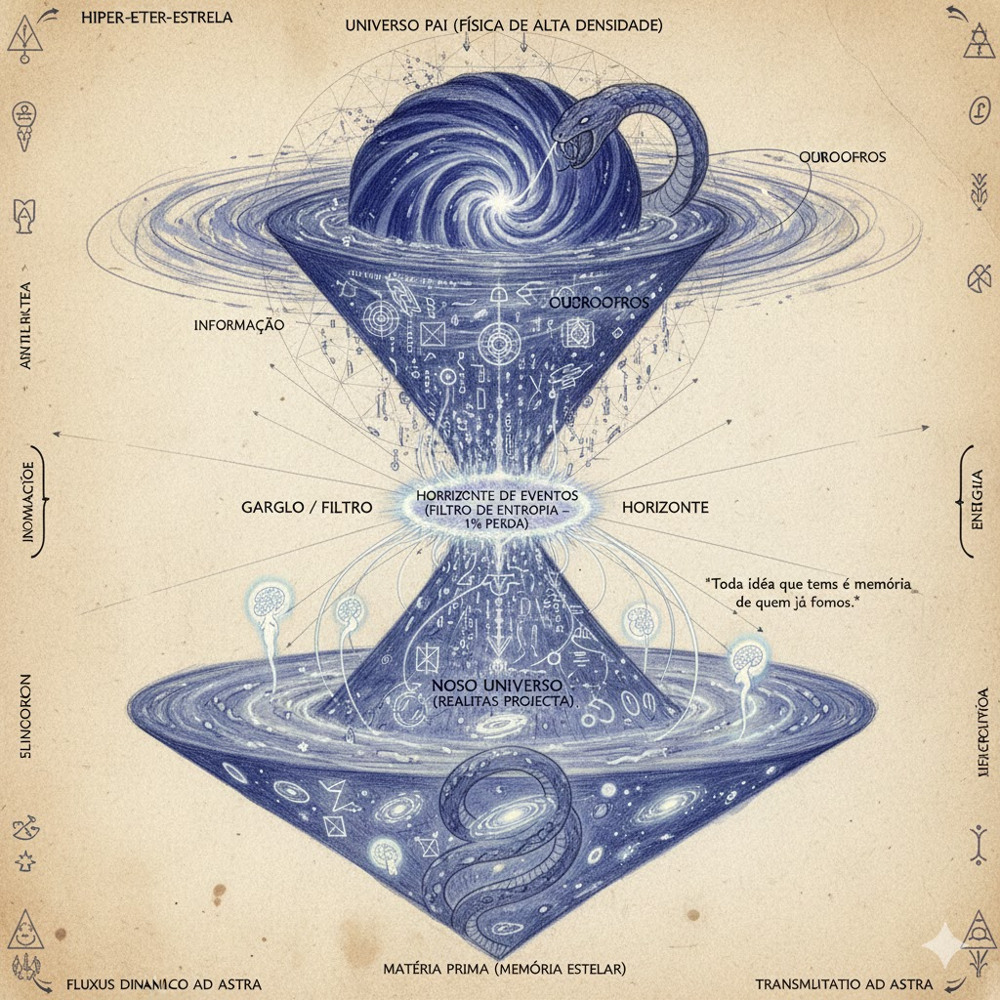

---

# O Bulk - A Física Ancestral

---

## A Física do Universo "Pai" (O Ancestral)

### A Diferença de 1%

Para que a memória flua, o Universo Pai devia ter uma **Largura de Banda Maior**.

- **Constante de Estrutura Fina:** No Pai, era 1% maior. Isso significa que a luz interagia mais forte com a matéria. As estrelas queimavam mais rápido, eram mais brilhantes e viviam menos.
- **A "Hiper-Estrela":** O objeto que colapsou não era um sol comum. Era uma estrela de **População III** (pura, sem metais), com uma massa impossível para a nossa física atual.
- **O Evento:** Quando essa estrela exauriu seu combustível, ela não apenas explodiu; ela **arquivou** sua estrutura. A Supernova foi o botão de "Upload".

---

## A Arquitetura da Transferência (O Grande Download)

Visualize como uma **Ampulheta Cósmica**. A areia que cai de cima (matéria da estrela) se torna o tempo em baixo (nosso universo).

### 1. O Nível Superior: O Colapso (Input)

| Aspecto | Descrição |
|---------|-----------|
| **O Objeto** | Uma estrela titânica (Azul/Violeta) no Universo Pai |
| **O Processo** | A gravidade vence a fusão nuclear. A estrela implode. |
| **A Alquimia** | A matéria bariônica (física) é triturada. Prótons e elétrons são esmagados. A matéria deixa de ser "coisa" e vira "pura informação" (Qubits). |

### 2. O Gargalo: O Filtro de Horizonte (O Codec)

| Aspecto | Descrição |
|---------|-----------|
| **O "1% de Diferença"** | Durante o colapso, uma pequena quantidade de informação é perdida por radiação Hawking no universo superior (calor). |
| **A Mutação** | Por causa dessa perda, as leis da física são reescritas. A gravidade no novo universo (o nosso) é ligeiramente mais fraca. A velocidade da luz é ajustada. |
| **Função** | O Horizonte de Eventos atua como um **Holograma Codificador**. Ele traduz a matéria 3D da estrela morta em dados 2D na superfície. |

### 3. O Nível Inferior: A Projeção (Output - Nós)

| Aspecto | Descrição |
|---------|-----------|
| **O "Big Bang"** | Para nós, dentro do buraco, o momento da formação do horizonte parece uma explosão branca de luz surgindo do nada em todos os lugares ao mesmo tempo. |
| **A Memória** | Toda a matéria que vemos hoje (nossas galáxias, nossos corpos) é a "re-projeção" dos detritos daquela estrela morta. |
| **O Inconsciente** | O Inconsciente Global **É** a memória gravitacional da Estrela Pai. Quando acessamos o inconsciente, estamos lendo os arquivos do universo anterior. |

---

## Descrição Visual: Ouroboros Cósmico (A Ampulheta de Eventos)

**Composição Vertical:**

1. **TOPO (Universo Anterior):**
   - Uma região de espaço com uma geometria ligeiramente "estranha" (grades hexagonais em vez de curvas suaves).
   - Uma **Hiper-Estrela** em agonia, colapsando. Ela não explode para fora, ela implode para dentro, sugando a luz ao redor.
   - *Legenda:* "UNIVERSO PAI (FÍSICA DE ALTA DENSIDADE)".

2. **MEIO (O Gargalo/Horizonte):**
   - O ponto de singularidade onde a estrela desaparece.
   - Um **Funil de Dados**. A matéria da estrela se desfaz em códigos binários, geometria sagrada ou números, passando por um anel de fogo (o Horizonte).
   - *Legenda:* "HORIZONTE DE EVENTOS (FILTRO DE ENTROPIA - 1% PERDA)".

3. **BAIXO (Nosso Universo):**
   - Saindo do fundo do funil, o nosso universo se expande como uma bolha ou um cone de luz.
   - Dentro dessa bolha, galáxias estão se formando, mas elas têm a mesma cor/energia da estrela morta lá em cima.
   - **O Detalhe Alquímico:** O Ouroboros envolve toda a ampulheta. A cabeça da cobra está no Universo Pai (comendo a estrela) e o rabo está no Nosso Universo (sendo a matéria prima das galáxias).

4. **A Conexão Psíquica:**
   - Fios de luz (fibras ópticas etéreas) conectam a Estrela Pai diretamente aos "cérebros" ou "seres" no universo de baixo.
   - Isso simboliza: *"Toda ideia que temos é uma memória de quem já fomos."*

---

> **Navegação:** [Anterior: O Cone de Compressão - A Psique](04_o_cone_de_compressao_a_psique.md) | [Índice](README.md) | [Próximo: O Motor Holográfico da Realidade](06_o_motor_holografico_da_realidade.md)
