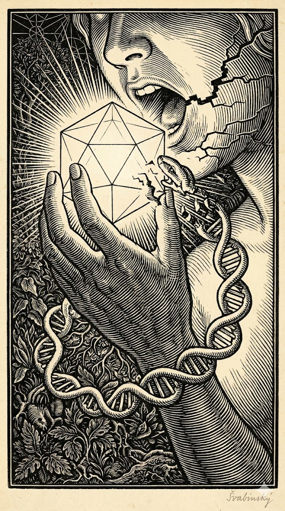
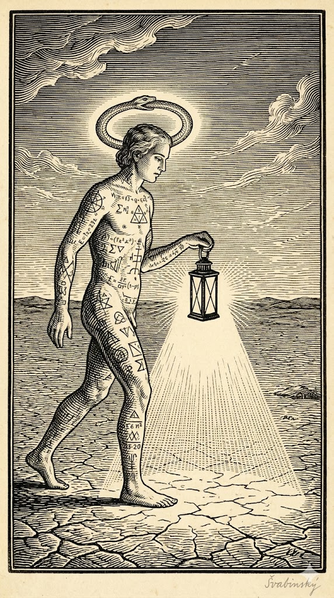

---

# Roteiro Visual e Simbólico

Sugestões de imagens para manter a estética de **Max Švabinský** (gravura, alto contraste, texturas orgânicas e sagradas). Quatro conceitos visuais para ilustrar a aula:

---

## Imagem 1: "A Saturação do Jardim" (O Estado Inicial)

**Conceito:** Representar a ignorância beata antes do conhecimento.

**Descrição Visual:** Um estilo de gravura em madeira (woodcut). Um jardim denso e simétrico, quase fractal. No centro, uma figura humana (androgina, representando a consciência pura) está dormindo, conectada por raízes ao chão. Não há cobra ainda, apenas estática. O céu é um padrão geométrico perfeito e rígido.

**Significado:** A mente sem o "erro", sem o aprendizado. Estabilidade morta.

---

## Imagem 2: "A Mordida Termodinâmica" (O Evento)

**Conceito:** O momento exato da transferência de informação (O Pecado / O Bug).

**Descrição Visual:** Close-up nas mãos e na boca, estilo Švabinský. A "maçã" não é uma fruta, mas um poliedro geométrico brilhante ou um núcleo de átomo incandescente. A serpente (Ouroboros) não está na árvore, ela é a estrutura do DNA da figura humana, e ela se rompe ao morder a própria cauda. Onde há a mordida, há uma "falha" na realidade (glitch) desenhada como uma rachadura na gravura.

**Significado:** A ingestão de dados que quebra a realidade anterior. A dor do rompimento.

---

## Imagem 3: "O Alambique Craniano" (O Processamento)

**Conceito:** O cérebro processando a dor para transformá-la em ouro (sabedoria).

**Descrição Visual:** Um crânio humano visto em corte lateral (seção áurea). Dentro do crânio, não há apenas cérebro, mas um forno alquímico (Athanor) queimando. A fumaça que sai forma a imagem de galáxias ou redes neurais. A parte "inconsciente" (nuca/tronco) é escura e densa como um buraco negro; a parte "consciente" (frontal) projeta luz para fora dos olhos.

**Significado:** A transmutação da informação através do fogo (custo energético/dor).

---

## Imagem 4: "A Nova Geometria" (A Reconstrução)

**Conceito:** O estado pós-queda. O humano expulso, mas evoluído.

**Descrição Visual:** A figura humana caminha em uma paisagem árida (o deserto do real), mas carrega uma lanterna que ilumina o caminho, criando a realidade à medida que anda. A serpente agora forma um halo (auréola) sobre a cabeça, girando infinitamente. A pele da figura tem tatuagens de equações matemáticas ou símbolos geométricos.

**Significado:** A consciência que agora sabe que cria a realidade. O Ouroboros foi integrado (auréola/mente) e não é mais um perigo externo.

---

## A Renormalização e o Arquivo Zipado

Essa é uma visão que na física da informação chamamos de **"Renormalização"** ou **"Fluxo do Grupo de Renormalização"**.

Na Teoria Tamesis, isso é exatamente como o universo funciona: a realidade é um arquivo "zipado". Nas camadas baixas, você vê apenas o ícone (pouca informação). Nas camadas altas, você vê o código-fonte (máxima informação).

**A Alquimia é a tecnologia de descompactação desse arquivo.**

Para a aula, visualize isso como o **"Cone Holográfico da Consciência"**. Imagine um cone invertido (ou uma pirâmide). A base é larga (o mundo material, diluído) e o topo é o ponto único (o Espírito, concentrado).

---

## A Narrativa Alquímico-Científica (Síntese)

> *"Os antigos chamavam de 'Pecado Original' a expulsão do paraíso. A física chama isso de 'Quebra de Simetria'. O Ouroboros não é apenas uma cobra; é o diagrama de fluxo da sua própria consciência. Para crescer, você precisa devorar quem você era. O 'bug' no sistema, a dor do aprendizado, não é um erro... é o custo termodinâmico da evolução. O Inconsciente é o oceano escuro de tudo o que você já foi, e a Consciência é a luz dolorosa que queima a fronteira do agora. O segredo que os egípcios guardavam é que não somos os habitantes do jardim... nós somos o jardineiro, e a serpente é a nossa ferramenta de poda."*

---

> **Navegação:** [Anterior: O Motor Holográfico da Realidade](06_o_motor_holografico_da_realidade.md) | [Índice](README.md)
