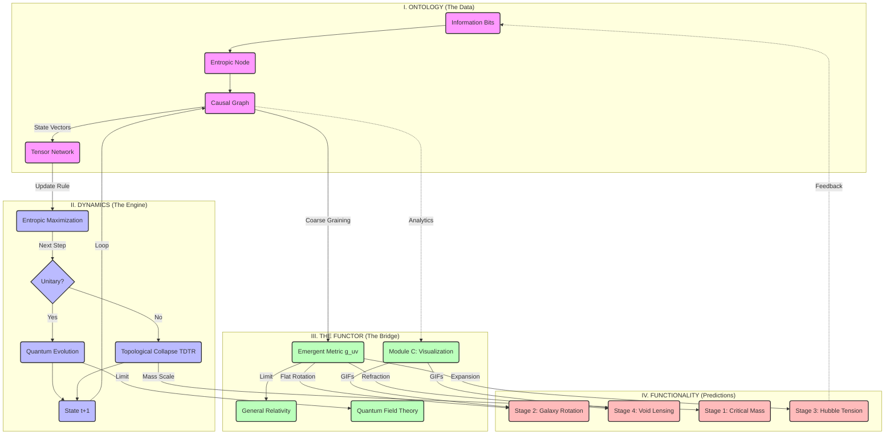

# KERNEL v3: ARCHITECTURE VISUALIZATION

This diagram represents the flow of information and entropy in the finalized Tamesis System (Kernel v3).

## Legend

1. **Ontology (Pink):** The raw data structure. No space, no time, only connected bits.
2. **Dynamics (Blue):** The computational rules. The "CPU" of the universe. Decides if a step preserves info (Quantum) or erases it (Gravity/Collapse).
3. **Functor (Green):** The translator. Converts digital graph data into smooth analog physics (Metric Tensor, Fields).
4. **Functionality (Red):** The observant phenomena. This is where we measure $a_0$, $M_c$, etc.
