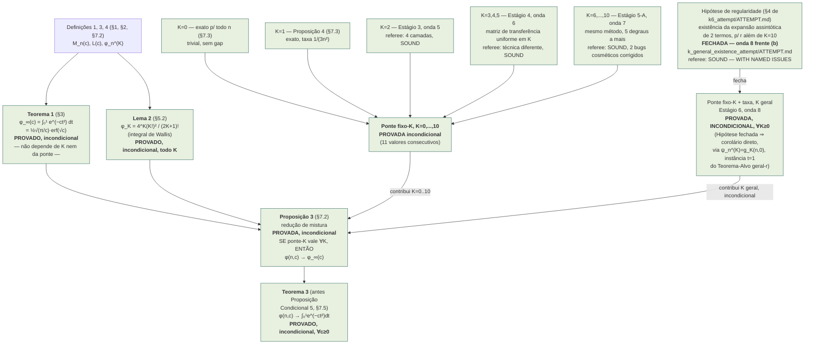

# Mapa de dependências — linha U₁/₂ (Core Numerics)

**Propósito deste documento.** Depois da onda 7, a linha U₁/₂ tem duas
frentes matemáticas independentes rodando em paralelo (onda 8,
`DISC-DEC-038`): (a) a ponte finito-`n` geral-`K` do Lema Aberto/taxa,
e (b) o resíduo de M-CLUST(b). Um resultado positivo numa frente **não
implica nada** sobre a outra — elas dependem de objetos matemáticos
distintos, provados por métodos distintos, sobre mecanismos distintos.
Este documento existe para tornar essa separação explícita e auditável,
não deixá-la implícita na cabeça de quem está integrando os resultados.
Nada aqui é um resultado novo — é a topologia de dependências dos
resultados já registrados em `theorem/THEOREM.md` e
`generalization_u_alpha/`, com cada nó apontando para a seção/proposição
exata que o prova.

---

## 1. Árvore A — o Lema Aberto / a ponte finito → infinito



> **[Adendo datado, 2026-08-22 — DISC-DEC-040.]** O diagrama acima foi
> ATUALIZADO (não apenas anotado) para refletir o fechamento da Hipótese
> de regularidade pela onda 8, frente (b) — consistente com a "Regra de
> uso" (§3 abaixo), que exige manter este mapa vivo, não uma fotografia
> estática do estado em que foi criado. O estado ANTERIOR (frente (b) em
> andamento, Hipótese como único gap, Proposição Condicional 5 apenas
> hipoteticamente promovível) está preservado no histórico git deste
> arquivo (commit `1baaea0`), não apagado — apenas o diagrama vivo, cujo
> propósito é sempre refletir o estado atual auditável, foi avançado.
> Nenhuma aresta foi removida por conveniência: a topologia é idêntica,
> apenas o status de dois nós (`Hyp`, `KgerInc`) e o nome/cor de um
> terceiro (`PC5`→`Teo3`) mudaram, exatamente como a "Regra de uso"
> previa que aconteceria "se a Frente (b) fechar".

**Leitura.** Verde = provado incondicionalmente — toda a Árvore A está,
desde 2026-08-22 (DISC-DEC-040), nesta cor.

> **[Adendo datado, 2026-08-23 — DISC-DEC-048, Estágio 9.]** Nenhum nó
> ou aresta acima muda de status ou cor — o diagrama continua correto
> como está. O que muda é a *razão* pela qual `K0`, `K1`, `K2`, `K345`,
> `K610` e `KgerInc` são verdes: em vez de seis provas separadas por
> seis métodos diferentes (indução direta, matriz de transferência,
> fechamento da Hipótese de regularidade), a onda 11 frente (b)
> forneceu uma **forma fechada única, exata, todas-as-ordens**
> (Teorema A/B de `all_orders_closed_form_attempt/ATTEMPT.md`,
> adversarialmente confirmada) da qual `ψ_n^{(K)}=g_K(n,0)` para
> **todo** `K≥0` — incluindo os seis valores/faixas específicos deste
> diagrama — segue como instância de uma única fórmula fechada, não
> mais como seis resultados empilhados. `KgerInc` e `Teo3` permanecem
> exatamente como provados por `DISC-DEC-040`; a nova frente apenas os
> torna, adicionalmente, corolários formais de um objeto mais forte.
> Ver `THEOREM.md` "Estágio 9" para o enunciado completo.

> **[Adendo datado, 2026-08-23 — DISC-DEC-049, Estágio 10.]** Um novo
> resultado, `uniform_in_c_attempt/ATTEMPT.md`, adversarialmente
> confirmado, estabelece que a convergência do nó `Teo3`
> (`φ(n,c)→φ_∞(c)`) é **uniforme em `c`** — não só em compactos
> `[0,C]`, mas em todo `[0,\infty)`. Este é um resultado *sobre* `Teo3`
> (uma propriedade mais forte da mesma convergência), não uma nova
> aresta de dependência dentro da Árvore A: `Teo3` continua provado
> exatamente como antes, e a prova de uniformidade não usa nenhum nó
> deste diagrama — usa apenas `Teo3` (pontual) mais dois lemas
> elementares novos (acoplamento equi-Lipschitz; limitante de cauda),
> nenhum dos quais depende de `K` ou da maquinaria `F_r/G_r/H_r`. Por
> isso o diagrama acima permanece correto e completo como está; o novo
> resultado vive logicamente "a jusante" de `Teo3`, não dentro da
> árvore. Ver `THEOREM.md` "Estágio 10" para o enunciado completo.

> **[Adendo datado, 2026-08-23 — DISC-DEC-052, Estágio 11.]** Um novo
> resultado, `uniform_in_c_attempt/mk_geometricity_attempt/ATTEMPT.md`,
> adversarialmente confirmado (SOUND, "ACCEPT for catalogue"), prova
> que `M_K` cresce no máximo geometricamente em `K`, fechando a única
> obstrução nomeada para "Teorema E" (a versão uniforme do perfil de
> erro de `Teo3`) ser incondicional — Teorema E perde o rótulo
> PROVED-MODULO. Exatamente como o adendo de Estágio 10 acima: este é
> um resultado *sobre* uma propriedade mais forte da mesma convergência
> (`Teo3`), não uma nova aresta de dependência dentro da Árvore A — a
> prova usa apenas a forma fechada todas-as-ordens (nó implícito de
> Estágio 9, já refletido acima) e o Lema A de redução, nenhum novo nó
> desta árvore. **Isto NÃO fecha "uma taxa explícita para Teorema A/C"**
> (hipótese (U'), uma obstrução distinta e mais forte, que continua sem
> prova) — os dois itens tinham sido nomeados separadamente em Estágio
> 10 e continuam separados. Ver `THEOREM.md` "Estágio 11" para o
> enunciado completo.

> **[Adendo datado, 2026-08-23 — DISC-DEC-055, Estágio 12.]** Um novo
> resultado, `uniform_in_c_attempt/u_prime_hypothesis_attempt/ATTEMPT.md`,
> adversarialmente confirmado (SOUND, "ACCEPT for catalogue" — o
> referee não encontrou nenhum erro em lugar algum e re-verificou tudo
> a uma escala muito maior que a própria frente), prova a hipótese (U')
> deixada aberta pelo adendo de Estágio 11 acima: `|φ_n^{(K)}-φ_K|\le
> a\sqrt K/n` para todo `n\ge1`, `0\le K\le n`, com constante explícita
> não-nítida `a=1{+}\sqrt{π/2}=2,253314\ldots`. Como o adendo de
> Estágio 11, este é um resultado *sobre* uma propriedade mais forte da
> mesma convergência (`Teo3`), não uma nova aresta de dependência
> dentro da Árvore A — a prova usa a forma fechada todas-as-ordens de
> Estágio 9 e o Lema A de redução, nenhum novo nó desta árvore. **Isto
> fecha "uma taxa explícita para Teorema A/C"** — a obstrução central
> nomeada nos adendos de Estágio 10/11 acima — dando
> `|Δ_n(c)|\le[(1{+}\sqrt{π/2})\sqrt c+0,2805]/n`, incondicional. A
> constante **nítida** `a^*=0,3670872\ldots` permanece aberta,
> distinta e não fechada por este resultado. Ver `THEOREM.md` "Estágio
> 12" para o enunciado completo.

> **[Adendo datado, 2026-08-23 — DISC-DEC-058, Estágio 13.]** Um novo
> resultado, `.../u_prime_hypothesis_attempt/sharp_constant_attempt/ATTEMPT.md`,
> adversarialmente confirmado (SOUND, "ACCEPT for catalogue" —
> verificado independentemente até `n,K=10^6`, nenhum erro encontrado),
> prova um limitante inferior `Q(n)\ge\sqrt{πn/2}-6` para a função `Q`
> de Ramanujan e, combinando-o com Teorema 3 e o Lema 4.1 já provados
> de Estágio 12, prova `\lim_{K\to\infty}M_K/\sqrt K=a^*`
> **exatamente** — a primeira confirmação rigorosa de que a constante
> nítida `a^*` é genuinamente o valor assintótico correto, não apenas
> um limitante superior sobre ele. Como os adendos anteriores, este é
> um resultado sobre uma propriedade mais forte da mesma convergência,
> não uma nova aresta desta árvore. **Isto NÃO fecha a hipótese (U')
> com a constante nítida `a^*`** — a monotonicidade de `M_K/\sqrt K`
> em `K` (equivalente a `\sup_K=\lim_K`) permanece aberta, tentada por
> duas rotas e não fechada; a constante efetivamente provada na
> hipótese (U') continua sendo `a=1{+}\sqrt{π/2}` (Estágio 12,
> inalterado). Ver `THEOREM.md` "Estágio 13" para o enunciado completo.

> **[Adendo datado, 2026-08-23 — DISC-DEC-059, Estágio 14.]** Um novo
> resultado, `.../all_orders_closed_form_attempt/general_b_dstar_attempt/ATTEMPT.md`,
> adversarialmente confirmado (SOUND, "ACCEPT" — 165.888 checagens
> exatas independentes, 0 divergências), fecha o item nomeado aberto
> pelo adendo de Estágio 9 acima (`D^{*(p)}_r(b)` para `b\ge2`) para
> `p=1,2,3,4` — Teorema D1 (`p=1`) e três fórmulas irmãs, todo `b\ge0`.
> Como os adendos de Estágio 10–13, este é um resultado sobre uma
> propriedade mais forte da mesma forma fechada (Teorema A/B/Corolário
> A3 de Estágio 9), não uma nova aresta desta árvore — nenhum nó ou
> aresta acima muda de status ou cor. `p\ge5` permanece aberto (o único
> obstáculo nomeado foi identificado pelo referee como mecanicamente
> removível, mas a montagem explícita não foi executada). Ver
> `THEOREM.md` "Estágio 14" para o enunciado completo.

**O ponto que este mapa existia para blindar, agora resolvido
honestamente:** a Proposição 3 já estava provada, sem ressalva nenhuma,
desde a §7.2 original (bem antes da onda 7) — ela nunca dependeu do
desfecho da frente (b). O que a frente (b) podia mudar era só um dos
dois insumos que entram nela: com a Hipótese de regularidade fechada
(referee independente, veredito SOUND — WITH NAMED ISSUES, 4 questões
nomeadas corrigidas via adendos datados em
`k_general_existence_attempt/ATTEMPT.md` e `k6_attempt/ATTEMPT.md`), o
insumo "ponte-K para todo K" deixou de precisar do qualificador
condicional, e a Proposição 3 (inalterada) converteu isso
automaticamente em Teorema 3 — nenhuma nova prova de convergência de
mistura foi necessária, exatamente como este mapa previa.

---

## 2. Árvore B — M-CLUST(b), um mecanismo separado

```mermaid
flowchart TD
    UA["Generalização U_α (onda 3)<br/>família de mecanismos candidatos<br/>à mesma classe de universalidade"]

    MC["Mecanismo M-CLUST(b)<br/>construção alternativa, não o mecanismo<br/>original do Lema Aberto acima"]

    QC["q_CLUST(s) = s/(1−ρ)<br/><b>PROVADO</b> (onda 4)<br/>reconfirmado por medição direta (onda 7)"]

    RES["Resíduo sistemático na correção<br/>finito-n de M-CLUST(b)"]

    E1["Onda 4: correção parcial<br/>70–86% do gap original fechado"]
    E2["Onda 7 (DISC-DEC-034):<br/>φ_CAND=(1−ρ)·φ_V4<br/>χ² reduzido ~19,5×<br/>PARCIALMENTE FECHADO"]
    AGG["Onda 7 (DISC-DEC-037):<br/>obstrução de agregação<br/><b>FECHADA</b> por primeiros princípios<br/>+ validação independente (χ²=1,93)<br/>MAS não melhora φ_CAND — piora"]

    W8a["Onda 8, frente (a) (DISC-DEC-039):<br/>hipótese de exclusão global (escala tn)<br/><b>NÃO-FECHAMENTO HONESTO</b> — φ_GLOBAL<br/>não supera φ_CAND, descartada nas<br/>2 células de maior ρ/b"]

    W9a["Onda 9, frente (a) (DISC-DEC-043):<br/>hipótese de assimetria x₀-vs-outros<br/><b>REFUTADA</b> — razão agrupada<br/>0,983±0,007, sinal oposto"]

    EPS["Achado secundário (DISC-DEC-043/044):<br/>eps=P(cíclico│x₀∈R) ≠ 0<br/><b>ESTABELECIDO</b> — referee: 190–260σ,<br/>18 células, sem simular passeio"]

    EPSR["<b>φ_EPSR</b> (DISC-DEC-044)<br/>ingredientes medidos, não ajustados<br/><b>NOVA FÓRMULA DE REGISTRO</b><br/>χ²≥φ_EPS em 6/6 grades testadas"]

    EXH["Canal eps <b>EXAURIDO</b><br/>(eps exato: χ² 335,6→183,2;<br/>ganho máximo residual ~1%)"]

    ELEV["Resíduo remanescente de φ_EPSR<br/>localizado em φ(cíclico│x₀∉R)<br/>(nível de elevação, SS5.3/SS5.6)<br/>χ²≈183, sem forma fechada —<br/><b>alvo da próxima frente</b>"]

    ELEVMECH["Onda 10, frente (a) (DISC-DEC-050):<br/>mecanismo da elevação IDENTIFICADO<br/>λ(t) derivada, não é constante<br/><b>CONFIRMADO</b> pelo referee com<br/>simulador próprio (χ²=1925/67 bins,<br/>hazard=1/pool a ≈0,2%, 0 falhas<br/>de auditoria em 5,9×10⁸ passos)"]

    REDB["φ_REDB (onda 10, correção do<br/>referee SS11 sobre φ_RED)<br/><b>NOVA FÓRMULA DE REGISTRO</b><br/>χ² teste-de-redução 334,6→101,4<br/>MAS resíduo real em c/n extremo<br/>(b=100,c=1000: z≈−10) —<br/><b>PARCIALMENTE FECHADO</b>"]

    SCMECH["Onda 12, frente (b) (DISC-DEC-053):<br/>estrutura L-dependente do resíduo<br/>IDENTIFICADA e CONFIRMADA —<br/>excesso grande perto de L=b (até<br/>+874%, referee), platô negativo<br/>persistente p/ L longo (~−10 a −15%)<br/>— o pequeno resíduo agregado é<br/>quase-cancelamento de dois efeitos<br/>bem maiores, nenhum modelado"]

    REDC["Candidata φ_REDC (mistura de<br/>ciclo curto sobre φ_REDB)<br/><b>REFUTADA</b> — piora 5 de 6 células<br/>(χ² 4,5-8,6×), critério<br/>pré-registrado falha nas duas<br/>condições — φ_REDB permanece<br/>fórmula de registro —<br/><b>NÃO-FECHAMENTO HONESTO</b>"]

    LCDMECH["Onda 13, frente (b) (DISC-DEC-054/056):<br/>deficit de ciclo longo — H1 vs H2<br/>MISTURA: piso independente de b<br/>(H2, presente em b=1, z até −13,9)<br/>+ amplificação secundária real<br/>dependente de b (H1, ~1,8-2,6×,<br/>abaixo do limiar pré-registrado)<br/>referee SOUND WITH NAMED ISSUES"]

    CVCOV["Onda 14, frente (e) (DISC-DEC-057/060):<br/>covariável do H2-share — ρ implicado,<br/>b descartado como driver solo<br/>PARTIAL/MIXED pela regra primária;<br/>referee: correlação de ρ NÃO sobrevive<br/>Bonferroni/Spearman nos dados originais,<br/>MAS fortalece e sobrevive na tabela<br/>triangulada (r=−0,68,p=0,011); G1b<br/>resolvida revela não-monotonicidade<br/>real em ρ — SOUND WITH NAMED ISSUES"]

    FLOORCF["Onda 14, frente (b) (DISC-DEC-057/062):<br/>forma fechada do piso b=1 -- FECHAMENTO<br/>PARCIAL: reducao exata provada (selecao<br/>sobre phi(ell) nao-constante), mecanismo<br/>de reentrada de lacuna provado e validado<br/>por simulacao exata; forma fechada completa<br/>NAO derivada (sistema 2-var acoplado nao-<br/>local); referee 5x+ potencia, mesma<br/>conclusao -- SOUND WITH NAMED ISSUES"]

    FLOORH2["Onda 16, frente (d) (DISC-DEC-066/071):<br/>sistema (Phi,Psi) do piso b=1 -- FECHAMENTO<br/>PARCIAL FORTALECIDO: TODOS os coeficientes<br/>da serie small-t0 em forma fechada exata<br/>(familia P+Q*erfcx, inducao do referee);<br/>serie converge no platô inteiro:<br/>Phi(0,t0>=0.02)=0.0377616 (2 solvers +<br/>4 MCs + serie exata ordem 500);<br/>resummation fechada NAO achada (constante<br/>do platô nao identificada); gap abstrato-<br/>vs-real ~30% intocado; phi_REDB inalterada<br/>-- SOUND WITH NAMED ISSUES"]

    PLATRESUM["Onda 17, frente (d) (DISC-DEC-072/077):<br/>ressomacao da constante do plato<br/>NAO-FECHAMENTO HONESTO do alvo estrito<br/>(nenhuma forma fechada para Pi(c) achada)<br/>COM lei assintotica de 4 termos genuina:<br/>Pi(c)=sqrt(pi/2c)-2/c+(7/2)sqrt(pi/2)c^-3/2<br/>-(34/3)c^-2+O(c^-5/2), DERIVADA (heuristica,<br/>n&lt;=4) + CONFIRMADA numericamente a<br/>&gt;=110 digitos em 5 valores de c (1024x<br/>range); referee reproduziu tudo do zero,<br/>achou e corrigiu 1 erro real (nao-letal)<br/>em SS7.3 do documento -- SOUND WITH<br/>NAMED ISSUES"]

    UA --> MC
    MC --> QC
    MC --> RES
    RES --> E1
    RES --> E2
    E2 --> AGG
    AGG --> W8a
    AGG --> W9a
    W9a --> EPS
    EPS --> EPSR
    EPS --> EXH
    EPSR --> ELEV
    ELEV --> ELEVMECH
    ELEVMECH --> REDB
    REDB --> SCMECH
    SCMECH --> REDC
    SCMECH --> LCDMECH
    LCDMECH --> CVCOV
    LCDMECH --> FLOORCF
    FLOORCF --> FLOORH2
    FLOORH2 --> PLATRESUM

    style QC fill:#e8f0e0,stroke:#2f6b5e
    style E1 fill:#f5ecd8,stroke:#96702a
    style E2 fill:#f5ecd8,stroke:#96702a
    style AGG fill:#e8f0e0,stroke:#2f6b5e
    style W8a fill:#f0e5e8,stroke:#7a3b4a
    style W9a fill:#f0e5e8,stroke:#7a3b4a
    style EPS fill:#e8f0e0,stroke:#2f6b5e
    style EPSR fill:#e8f0e0,stroke:#2f6b5e,stroke-width:2px
    style EXH fill:#f0e5e8,stroke:#7a3b4a
    style ELEV fill:#f5ecd8,stroke:#96702a
    style ELEVMECH fill:#e8f0e0,stroke:#2f6b5e,stroke-width:2px
    style REDB fill:#f5ecd8,stroke:#96702a,stroke-width:2px
    style SCMECH fill:#e8f0e0,stroke:#2f6b5e,stroke-width:2px
    style REDC fill:#f0e5e8,stroke:#7a3b4a
    style LCDMECH fill:#e8f0e0,stroke:#2f6b5e,stroke-width:2px
    style CVCOV fill:#f5ecd8,stroke:#96702a,stroke-width:2px
    style FLOORCF fill:#f5ecd8,stroke:#96702a,stroke-width:2px
    style FLOORH2 fill:#f5ecd8,stroke:#96702a,stroke-width:2px
    style PLATRESUM fill:#f5ecd8,stroke:#96702a,stroke-width:2px
```



> **[Adendo datado, 2026-08-22 — DISC-DEC-039/043/044.]** Diagrama
> ATUALIZADO (mesma disciplina da Árvore A) para refletir: onda 8
> frente (a) fechada como não-fechamento honesto; onda 9 frente (a)
> refutou a hipótese mandatada mas descobriu `eps≠0`; um referee
> hostil dedicado corrigiu dois erros na derivação original e produziu
> `φ_EPSR`, agora a fórmula de registro de M-CLUST(b) — a primeira
> mudança de fórmula de registro desde `DISC-DEC-034`. Rosa = tentativa
> que não fechou o alvo mandatado (mas pode ter produzido achados
> secundários genuínos, como aqui). Nenhuma aresta liga esta árvore à
> Árvore A — permanece um objeto matemático inteiramente separado.

> **[Adendo datado, 2026-08-23 — DISC-DEC-050.]** Onda 10 frente (a)
> (`MCLUST-ELEVATION-LEVEL-ATTEMPT`) atacou exatamente o nó `ELEV`
> acima e produziu dois resultados distintos, coloridos separadamente
> porque têm status muito diferentes. **`ELEVMECH`** (verde — mecanismo
> plenamente confirmado): a elevação de fechamento não é a constante
> `P_lead=1/(1−ρ)` que toda fórmula anterior da linhagem assumia — é
> uma função `λ(t)` da massa percorrida, derivada da mecânica exata do
> passeio (o pool de imagens `U_rem` encolhe à mesma taxa em que é
> consumido). Isto foi medido diretamente ao nível do mecanismo (sem
> nenhuma fórmula `φ` envolvida) e **reproduzido de forma independente
> pelo referee com seu próprio simulador e sementes próprias**
> (χ²=1925/67 bins contra elevação constante; hazard=1/pool confirmado
> a ≈0,2% por célula; zero falhas de auditoria em 5,9×10⁸ passos
> normais). **`REDB`** (âmbar — melhoria parcial, não fechamento): a
> candidata original desta frente, `φ_RED`, usava uma redução
> `M-CLUST(b)|x₀∉R ≡ M-U(c(1−ρ),(1−ρ)n)` que o referee refutou a 7,5×
> a precisão (χ² pooled 334,6, 6 células completas); a correção do
> próprio referee (`φ_REDB`, argumento `c''=c(1−c/n)^{b−1}` em vez de
> `c(1−ρ)`) reduz o χ² pooled para 101,4 e passa em 5 das 6 células
> testadas — mas a sexta célula, a mais extrema já testada nesta linha
> (`b=100,c=1000,ρ=0,785`), sozinha responde por ~96% do χ² restante,
> com desvio de 1,2–1,3% (`z≈−10`), maior que a correção `O(c/n)`
> esperada. `φ_REDB` é a nova fórmula de registro de M-CLUST(b),
> substituindo `φ_EPSR` — mas o resíduo do nó `RES` (topo desta árvore)
> **não está fechado**: fica registrado como um resíduo real e ainda
> não modelado nos parâmetros extremos, exatamente o mesmo padrão de
> fechamento parcial que `E2` (onda 7) e `AGG` (onda 7) já
> estabeleceram para esta linha. Fontes:
> `generalization_u_alpha/mclust_rigor/residual_attempt/aggregation_closure_attempt/global_exclusion_attempt/x0_asymmetry_attempt/elevation_level_attempt/ATTEMPT.md`
> e `.../adversarial/REFEREE_REPORT.md`.

> **[Adendo datado, 2026-08-23 — DISC-DEC-053.]** Onda 12 frente (b)
> (`MCLUST-SHORT-CYCLE-DYNAMICS-ATTEMPT`) atacou diretamente o resíduo
> que `φ_REDB` deixou aberto na célula mais extrema (`b=100,c=1000`,
> nó `REDB` acima). Produziu dois resultados distintos, coloridos
> separadamente. **`SCMECH`** (verde — mecanismo confirmado
> independentemente, inclusive mais fortemente do que a própria frente
> relatou no pico perto de `L=b`): o pequeno resíduo agregado que esta
> linhagem persegue desde a onda 7 é, na verdade, o quase-cancelamento
> de dois efeitos muito maiores — um excesso positivo grande para
> ciclos-π de comprimento pouco acima de `b` (o referee mediu até
> +874%, contra os +267,7% relatados originalmente — uma correção
> datada foi aplicada ao `ATTEMPT.md` desta frente), e um platô
> negativo persistente (~−10% a −15%) para ciclos longos — nenhum dos
> dois modelado por nenhuma fórmula desta linhagem. **`REDC`** (rosa —
> tentativa que não fechou o alvo mandatado): a candidata `φ_REDC`,
> construída a partir do mecanismo de ciclo curto isolado, foi
> refutada — piora 5 das 6 células testadas (incluindo a célula-alvo
> que deveria corrigir), confirmado independentemente pelo referee em
> ambas as condições do critério pré-registrado. `φ_REDB` permanece a
> fórmula de registro; o resíduo M-CLUST(b) permanece **PARCIALMENTE
> FECHADO**, sem mudança de status — mas agora com o mecanismo do
> resíduo genuinamente mais bem compreendido do que antes desta
> frente. Fontes:
> `elevation_level_attempt/short_cycle_dynamics_attempt/ATTEMPT.md` e
> `.../short_cycle_dynamics_attempt/adversarial/REFEREE_REPORT.md`.

> **[Adendo datado, 2026-08-23 — DISC-DEC-054/DISC-DEC-056.]** Onda 13
> frente (b) (`LONG-CYCLE-DEFICIT-ATTEMPT`) atacou o item 1/§9 aberto
> nomeado pela frente anterior (nó `SCMECH` acima): o platô negativo
> persistente (~−10% a −15%) para ciclos longos, tentando distinguir
> se é um viés específico da estrutura de blocos correlacionados do
> M-CLUST(b) (H1) ou um artefato genérico de `n` finito, também
> presente em M-U puro (`b=1`, correlação de bloco zero — H2). O teste
> primário pré-registrado (T1, comparação `(c,n)` pareada) favorece H2:
> o déficit reproduz-se em `b=1` a `72–81%` da magnitude original em
> duas de três células, `z` até `−13,9` (referee, `N=5000`); com poder
> adequado, a terceira célula também se resolve de forma limpa a favor
> de H2. Mas um teste secundário (T2, dose-resposta em `b`) mostra uma
> amplificação real, reproduzível e dependente de `b` (`~1,8`–`2,6×`
> entre execuções independentes) que fica abaixo do limiar
> pré-registrado para H1 "limpo" — nem H1 puro nem H2 uniforme e puro
> explicam a figura completa. Veredito honesto: **MISTURA** — um piso
> independente de `b` (H2, dominante) mais uma amplificação secundária
> real dependente de `b` (H1, sub-limiar), sem forma fechada proposta.
> Referee hostil independente replicou T0/T1/T2 do zero com sementes
> frescas e código de medição totalmente independente, confirmando
> todas as conclusões centrais; encontrou uma cifra de referência
> mal-atribuída na pré-registração (sem efeito sobre classificações) e
> um problema de precisão nos pontos intermediários de T2 (sem mudar o
> veredito MISTO) — veredito **SOUND WITH NAMED ISSUES**. O resíduo
> M-CLUST(b) (nó `RES`, topo desta árvore) permanece **PARCIALMENTE
> FECHADO**, sem mudança de status, mas com este componente específico
> do platô de ciclo longo agora mecanisticamente decomposto. Fontes:
> `short_cycle_dynamics_attempt/long_cycle_deficit_attempt/ATTEMPT.md`
> e `.../long_cycle_deficit_attempt/adversarial/REFEREE_REPORT.md`.

> **[Adendo datado, 2026-08-23 — DISC-DEC-057/DISC-DEC-060.]** Onda 14
> frente (e) (`CELL-VARIATION-ATTEMPT`) atacou uma pergunta diferente
> sobre o mesmo objeto: não o mecanismo do platô de ciclo longo (`SCMECH`/
> `LCDMECH` acima), mas **o que explica a variação célula-a-célula do
> H2-share** medido nessa linha — `ρ`, `c`, ou `b`. Grade de 13 células
> pré-registrada, regra primária mecânica (faixa 15pp/30pp) dá
> **PARTIAL/MIXED**: nenhum grupo de `ρ` fixo atinge o corte "FLAT". Mas
> três checagens secundárias convergem: `ρ` é a única covariável com
> correlação pooled significativa (`r=−0,623,p=0,031`); `b` é
> estatisticamente indistinguível de zero (`r=0,08,p=0,81`). Referee
> hostil confirmou T0 e toda a aritmética exatamente, mas nomeou duas
> complicações reais: (1) a correlação de `ρ` **não sobrevive** Bonferroni
> (`m=3`) nem Spearman nos dados originais — mais frágil do que
> divulgado; (2) a célula `G1b`, honestamente excluída por ambiguidade,
> revela — ao ser resolvida por triangulação (`N=12.000`, `z=−7,69`) —
> um compartilhamento **não-monotônico em `ρ`** dentro de `G1`, quebrando
> qualquer história de covariável única limpa. **Mas**, na tabela
> triangulada de 13 células do próprio referee, a correlação `ρ` pooled
> na verdade **fortalece e sobrevive** Bonferroni (`r=−0,680,p=0,011`) —
> resolver a célula mais fraca do desenho reforça, não enfraquece, a
> evidência para `ρ`; `b` continua robustamente descartado em toda
> versão dos dados. Veredito **SOUND WITH NAMED ISSUES**: nenhum erro
> aritmético encontrado; o enquadramento de honestidade do documento
> julgado preciso, se algo conservador demais. `φ_REDB` permanece a
> fórmula de registro; nenhum resultado anterior desta árvore é alterado
> — este é um resultado *correlacional*, não uma nova fórmula fechada
> (essa continua sendo o mandato separado de `floor_closed_form_attempt`,
> onda 14 frente (b), ainda em andamento). Fontes:
> `long_cycle_deficit_attempt/cell_variation_attempt/ATTEMPT.md` e
> `.../cell_variation_attempt/adversarial/REFEREE_REPORT.md`.

> **[Adendo datado, 2026-08-23 — DISC-DEC-057/DISC-DEC-062.]** Onda 14
> frente (b) (`FLOOR-CLOSED-FORM-ATTEMPT`) atacou uma terceira pergunta
> sobre o mesmo objeto (`LCDMECH` acima): não o mecanismo H1/H2 nem a
> covariável que explica sua variação célula-a-célula, mas **por que o
> "piso" H2 existe mesmo em `b=1` (M-U puro)** — uma pergunta deixada
> formalmente aberta pela frente que descobriu a mistura H1/H2.
> **Fechamento parcial honesto.** Uma redução exata (§1, PROVADA sem
> simulação) mostra que o desvio existe porque `φ_far` e `φ_U(c)` são
> médias diferentes, ponderadas de forma diferente, da mesma função
> não-constante `φ(ℓ)` — um efeito de seleção, não uma falha na
> derivação de `φ_U(c)`. O candidato mais natural para `φ(ℓ)`
> (substituição pontual na fórmula-mestra) é refutado decisivamente. Um
> mecanismo de "reentrada de lacuna" recursivo é provado exatamente
> (fato combinatório determinístico sobre estrutura de ciclo) e
> validado por simulação direta de sua forma exata — explica
> *qualitativamente* por que `φ(ℓ)` atinge um platô em vez de decair. A
> **forma fechada completa não é derivada**: o sistema exato é um
> problema acoplado, não-local, de duas variáveis, da mesma ordem de
> dificuldade que a Conjectura 1 geral-`K` ainda aberta deste arquivo
> (ver Estágio 15 acima) — uma tentativa numérica limitada não
> convergiu, divulgada honestamente como falha nomeada, não escondida.
> A própria frente capturou e **retirou**, dentro do próprio documento,
> uma alegação mais fina (padrão de sinal não-monotônico bin-a-bin) que
> não sobreviveu a uma réplica robusta a cluster — uma autocorreção
> honesta, não deixada para o referee capturar. Referee hostil re-
> verificou as três alegações empíricas designadas (rejeição do
> Candidato 1; platô do processo abstrato, construído só a partir da
> prosa; e a pergunta central sobre existência de qualquer sub-região
> positiva) a `5×+` a potência estatística da própria frente, com
> sementes frescas — todas replicaram. Único achado: uma imprecisão de
> redação em §7 (contagem "7 de 9" células com concordância cruzada,
> corrigida para refletir que apenas 3 foram diretamente re-checadas, 1
> concordando — a evidência completa para as 9 células foi na verdade
> suprida pela própria réplica do referee). Veredito **SOUND WITH NAMED
> ISSUES, ACCEPT for catalogue**: nenhum erro muda o veredito da
> frente, e a retirada de T2 foi julgada apropriadamente conservadora,
> não excessiva. **Nenhuma fórmula nova substitui `φ_REDB`, `φ_U(c)`
> ou `φ_∞(c)`** — o resíduo M-CLUST(b) (nó `RES`, topo desta árvore)
> permanece PARCIALMENTE FECHADO, sem mudança de status, mas com o
> piso H2 agora mecanisticamente compreendido em profundidade adicional
> (o "porquê" qualitativo provado, o "quanto" quantitativo ainda
> aberto). Fontes:
> `long_cycle_deficit_attempt/floor_closed_form_attempt/ATTEMPT.md` e
> `.../floor_closed_form_attempt/adversarial/REFEREE_REPORT.md`.

> **[Adendo datado, 2026-08-25 — DISC-DEC-066/DISC-DEC-071.]** Onda 16
> frente (d) (`FLOOR-H2-B1-FULL-CLOSURE-ATTEMPT`, novo nó `FLOORH2`
> acima) atacou exatamente o que `FLOORCF` deixou aberto: a forma
> fechada completa do sistema acoplado 2-var `(Φ,Ψ)` do piso `b=1`.
> **Fechamento parcial fortalecido** — e o caso mais claro desta
> linhagem de uma frente que *subestimou o próprio método*. A frente
> entregou: (i) o regime small-`t0` exato (recursão provada
> simbolicamente; `psi1(s)=√(πc/2)·erfcx(s√(c/2))` provado; `a₂` exato;
> `a₃` via quadratura dupla-checada); (ii) um solver numérico corrigido,
> auto-testado e convergente para a faixa inteira (Richardson
> `Φ(0,t0≳0.01)≈0,0377`, validado contra 6 referências MC
> independentes); (iii) o achado de separabilidade (superfície
> near-rank-2 de equações provadamente acopladas); e 3 bugs
> auto-capturados divulgados. O referee hostil dedicado replicou TODAS
> as alegações positivas do zero (sementes frescas 20260857000–2,
> scripts da frente jamais abertos; MC até 1M walkers; solver PDE
> independente de outra família de discretização, razões de refinamento
> 0,250 limpas) — e **refutou as duas alegações NEGATIVAS centrais, nas
> duas direções que fortalecem o registro**: **N1** — a "camada de
> quadratura por ordem" é falsa: TODO coeficiente `a_k(s)`, `b_k(s)`
> está na família fechada `{P(s)+Q(s)·erfcx(s√(c/2))}` (indução
> construtiva, sem quadratura; `b₂`, `b₃`, `a₃(0)`, `a₄(0)` exibidos em
> forma fechada exata); **N2** — o "ponto de expansão errado / raio
> `c·t0~0,5–0,7`" é falso: o que a frente mediu foi erro de TRUNCAMENTO
> a 3 termos; com coeficientes exatos a série converge no platô inteiro
> (verificado a `c·t0=90`, razões ainda caindo na ordem 500) e dá a
> caracterização mais nítida que esta linhagem tem do alvo:
> **`Φ(0,t0)=0,0377616` para todo `t0≥0,02`** (aproximação `~e^{−ct0}`),
> consistente com as 12 linhas do `fcd_t3.log` ancestral, ambos os
> solvers e 4 MCs frescos. A sessão orquestradora verificou os dois
> resultados novos do referee antes de catalogar (checagens simbólicas
> sympy com resíduos exatamente 0; implementação independente da
> família `(P,Q)` até ordem 200 reproduzindo `0,0377615983` e todos os
> valores tabulados). O que resta aberto de verdade: a RESSOMAÇÃO em
> forma fechada (a constante do platô `0,0377616` não foi identificada
> como constante nomeada), e o gap abstrato-vs-real `~30%` (fora do
> escopo da frente, honestamente delimitado). A "tensão" de
> separabilidade resolve-se de forma majoritariamente mundana (camada
> de contorno `g≲1/c` + platô ⇒ near-rank-2; removida a camada, a
> superfície é rank-1 a 99,99998%). Veredito **SOUND WITH NAMED
> ISSUES, ACCEPT for catalogue** com correções obrigatórias N1/N2 (+N3
> menor), todas aplicadas como adendos datados. `φ_REDB` permanece a
> fórmula de registro; o resíduo M-CLUST(b) (nó `RES`) permanece
> **PARCIALMENTE FECHADO** — mas o sub-problema abstrato `FLOORCF`
> agora está caracterizado com precisão arbitrária, faltando apenas o
> nome da constante. **ONDA 16 FECHADA — 5/5 frentes integradas**
> (DISC-DEC-066 a 071). Fontes:
> `floor_closed_form_attempt/floor_h2_b1_full_closure_attempt/ATTEMPT.md`
> e `.../floor_h2_b1_full_closure_attempt/adversarial/REFEREE_REPORT.md`.

> **[Adendo datado, 2026-08-26 — DISC-DEC-072/DISC-DEC-077.]** Onda 17
> frente (d) (`PLATEAU-RESUMMATION-ATTEMPT`, novo nó `PLATRESUM` acima)
> atacou exatamente o que `FLOORH2` deixou aberto: identificar a
> constante do platô `Φ(0,t0≥0,02)=0,0377616` como constante/forma
> nomeada, via função geradora sobre a família `{P+Q·erfcx}`.
> **Não-fechamento honesto do alvo estrito** — nenhuma forma fechada
> exata para `Π(c)` a `c` finito foi encontrada; busca inversa-simbólica
> (PSLQ/`mpmath.identify`) não achou relação a até 100 dígitos em 4
> valores de `c`, após a própria frente corrigir um bug metodológico
> real na configuração PSLQ herdada (uma base trivial `1/c` fabricando
> "relações" espúrias). **COM uma lei assintótica de quatro termos
> genuinamente nova** — a primeira afirmação em forma fechada sobre a
> constante do platô nesta linhagem:
>
> `Π(c) = √(π/2c) − 2/c + (7/2)√(π/2)·c^{−3/2} − (34/3)·c^{−2} + O(c^{−5/2})`
>
> derivada por assintótica casada (Watson/matched-layer), com todo passo
> algébrico verificado por máquina até 4ª ordem (18 grupos de
> verificação, todos PASS), rotulada honestamente **DERIVADA
> (heurística) + CONFIRMADA (numericamente)**, não PROVADA — dois gaps
> heurísticos nomeados (H1: validade uniforme da decomposição
> outer/inner; H2: unicidade da solução limitada por ordem). Confirmada
> numericamente contra `Π(c)` computado a **≥110 dígitos significativos
> em 5 valores de `c`** (`640` a `655360`, range `1024×`), reproduzindo
> os quatro coeficientes derivados a `~12, 9, 6, 4` dígitos
> respectivamente via ajuste polinomial exato sem parâmetros livres, mais
> um holdout independente fora-da-amostra em `c=250`. Um quinto termo
> conjecturado (extrapolação do padrão `gamma_n`) é reportado como
> conjectura nomeada, não resultado. Dois achados estruturais adicionais:
> `Φ(0,·)` é inteira de ordem 2 em `t0`, o que torna a ressomação de
> Borel simples analiticamente válida mas numérica e estruturalmente
> inútil (tentativa fracassada disclosurada); e o perfil do platô em `s`
> é assintoticamente o mesmo formato `erfcx` do coeficiente `k=1`,
> conectando este resultado à tensão "near-rank-2" da onda 16.
>
> Referee hostil dedicado, sem ler nenhum script da frente: re-derivou a
> recursão `(P,Q)` à mão a partir da EDP de §0; recomputou `Π(c)` do
> zero nos mesmos 5 valores de `c` a ~113 dígitos estáveis, batendo
> exatamente com os dígitos citados pela frente em todos eles (incluindo
> o valor mandatado `Π(1000)`); re-derivou a ordem líder e a segunda
> ordem da assintótica; reproduziu o diagnóstico do "muro de custo" de
> ordem 2 de forma independente; e **encontrou e corrigiu um erro
> matemático real, não-letal**, no §7.3 do documento-alvo — a
> justificativa declarada para excluir a família de candidato de um
> único termo `erfcx` estava incorreta (comparava a expressão não
> reescalada contra a quantidade-alvo reescalada); a exclusão em si
> permanece correta, pela mesma via `d1≠0` do item anterior, não por uma
> razão diferente como o documento alegava — corrigido por adendo datado
> em `ATTEMPT.md` §7.3. Veredito **SOUND WITH NAMED ISSUES, "ACCEPT for
> catalogue" no tier reivindicado** (não-fechamento + lei assintótica
> derivada-heuristicamente e confirmada numericamente — não uma prova,
> não uma forma fechada). `φ_REDB` e toda fórmula de registro:
> intocadas. O que resta aberto: a ressomação em forma fechada
> propriamente dita (ainda não achada); os dois gaps heurísticos H1/H2
> não fechados rigorosamente; o quinto termo conjecturado não provado; a
> faixa `c<250`, inacessível ao método de soma direta por custo
> computacional; e o gap abstrato-vs-real `~30%`, honestamente fora de
> escopo. **ONDA 17: 5/5 frentes integradas.** Fontes:
> `.../floor_h2_b1_full_closure_attempt/plateau_resummation_attempt/ATTEMPT.md`
> e `.../plateau_resummation_attempt/adversarial/REFEREE_REPORT.md`.

> **[Adendo datado, 2026-08-26 — DISC-DEC-083/DISC-DEC-085.]** Onda 19
> frente (d) (`MCLUST-PLATEAU-ABSTRACT-REAL-GAP-ATTEMPT`) atacou os dois
> itens que `PLATRESUM` deixou mais próximos de alcançáveis: (1) o gap
> abstrato-vs-real `~30%`; (2) um novo empurrão estrutural sobre a
> ressomação em forma fechada, especificamente o quinto termo
> assintótico "conjecturado, não derivado".
>
> **Objetivo 1 (gap abstrato-vs-real): diagnóstico afiado, não
> fechado.** Usando o valor abstrato agora EXATO (`Π(1000)=
> 0,0377615983...`) contra as tabelas em bin já vetadas do motor real,
> o gap composto resolvido por bin é **média 38,8%, faixa
> [35,8%, 43,2%]** — mais preciso que o "~30%" original — e
> **aproximadamente CONSTANTE** em toda a faixa de `t0` (correlação de
> Pearson `r=0,33`), não concentrado em nenhum regime. Usando um fato
> estrutural lido diretamente das EDPs que governam o processo (`s+g`
> é exatamente CONSERVADO em "modo G" e só cresce em excursões de
> "modo E") e um argumento de magnitude (`1/n`, `1/√n`, `√(c/n)`, todos
> ordens de magnitude pequenos demais frente ao gap `O(1)` observado em
> `n=65536`), a frente **enfraquece** as duas hipóteses nomeadas
> anteriormente (fronteira `s+g≤1`; efeito finito-`n` evanescente) como
> explicação primária, sem propor substituto. Referee hostil confirmou
> a aritmética exatamente e a leitura estrutural das EDPs, mas
> encontrou que o argumento de magnitude testa apenas três taxas e não
> é exaustivo — `(c/n)^{1/4}` chega muito mais perto do gap observado
> com prefator pequeno (`~1,10×`), candidato não descartado por esta
> frente (corrigido por adendo datado em `ATTEMPT.md` §A.4). Também
> encontrado: um rótulo impreciso ("3 bins mais à direita" em vez de
> "os 3 bins que a checagem de robustez-de-cluster ancestral cobriu",
> posições 5/8/9, não 7/8/9) — sem efeito em nenhum número (corrigido
> por adendo datado em `ATTEMPT.md` §A.2/§A.3).
>
> **Objetivo 2 (quinto termo da ressomação): confirmação numérica
> substancialmente fortalecida, ainda CONJECTURADA, não derivada.** Uma
> implementação fresca e independente da recursão `(P,Q)` reproduz os 6
> âncoras publicadas exatamente, depois computa `Π(c)` em 11 valores de
> `c` de `100` a `655360` (range `6553×`, mais largo que qualquer
> frente ancestral, alcançando `c=100`, inacessível ao método de soma
> direta de ambas as ancestrais). Via um método de "isolamento de
> resíduo" (subtraindo as formas fechadas já EXATAS `d0..d3` antes de
> ajustar `d4,d5`, em vez de um ajuste polinomial simultâneo cego):
> `d4=26,1246` vs. o conjecturado `209/8=26,125` (`~5` dígitos
> significativos, acima dos `~2,6` da frente ancestral) e
> `d5=-82,017` vs. o conjecturado `-(1546/15)√(2/π)=-82,2353...`
> (`~2,6` dígitos, acima de "não significativamente restringido"). Uma
> re-derivação simbólica independente confirma a identidade de
> fechamento `R^{(n+1)}=x·R^{(n)}+n·R^{(n-1)}` e a contabilidade
> `γ_n` para `n=1..4`, e que `γ_5=209/24` é aritmeticamente
> equivalente a `d4=209/8`. H1/H2 permanecem inteiramente abertos, não
> tentados.
>
> Referee hostil dedicado, sem ler nenhum script de nenhuma frente da
> linhagem: re-implementou a recursão `(P,Q)` do zero e reproduziu
> **todos os 11 valores da grade de `Π(c)` da frente, dígito a dígito**
> (incluindo `Π(100)`, confirmando de forma independente que `c=100` é
> de fato alcançável); ajuste independente de resíduo deu
> `d4=26,12464` e `d5=-82,01744`, batendo com os valores da frente a
> `4×10^{-5}`/`4×10^{-4}`; confirmou a derivação simbólica
> independentemente. Veredito **SOUND WITH NAMED ISSUES — ACCEPT for
> catalogue**, em ambos os tiers exatamente reivindicados ("diagnóstico
> afiado, não fechado" / "confirmação numérica fortalecida, não nova
> derivação"), condicional às duas correções (N1 sobre completude do
> argumento de magnitude; N2 sobre precisão de citação de bins) —
> ambas aplicadas como adendos datados; nenhum número reportado foi
> afetado por nenhuma das duas. `φ_REDB`, `Φ_U(c)`, `Φ_∞(c)` e toda
> fórmula de registro: intocadas. O que resta aberto: o gap
> abstrato-vs-real em si (nenhuma explicação primária identificada); a
> ressomação em forma fechada propriamente dita; H1/H2; `γ_n` para
> `n≥6`. Fontes:
> `.../plateau_resummation_attempt/mclust_plateau_abstract_real_gap_attempt/ATTEMPT.md`
> e `.../mclust_plateau_abstract_real_gap_attempt/adversarial/REFEREE_REPORT.md`.
>
> **[Adendo datado, 2026-08-29 — `DISC-DEC-119`.]** Onda 25 frente (d)
> (`MCLUST-GAP-RATE-CANDIDATE-ATTEMPT`) testou diretamente o candidato
> de taxa `(c/n)^{1/4}` que o achado N1 acima deixou explicitamente
> não-testado, junto de vizinhos `(c/n)^{1/3}` e `(c/n)^{1/5}`, para
> exaustão da classe lei-de-potência-simples.
>
> **Eliminação rigorosa da classe (não apenas empírica), mais um
> diagnóstico afiado de por que a "proximidade" de N1 é provavelmente
> coincidência.** Fato estrutural estabelecido pela primeira vez aqui:
> `c=1000` e `n=65536` são CONSTANTES fixas em toda tabela de bin desta
> linhagem — apenas `t0=L/n` varia bin a bin. Consequentemente
> `(c/n)^p`, para QUALQUER expoente `p`, é um único número fixo em
> todo bin, tornando a classe inteira estruturalmente cega-à-forma por
> construção: ajustar um prefator reduz-se exatamente a ajustar a
> média amostral, e os resíduos por bin são IDÊNTICOS para `p=1/3,1/4,
> 1/5` (confirmado numericamente a `<10^{-9}`). Nenhum expoente nesta
> família pode jamais explicar a tendência observada em `t0` (correlação
> fraca `r=0,33` na tabela T2-composta robusta-a-cluster) — isto é
> demonstrável pela própria estrutura dos dados, não apenas um
> quase-acerto empírico. Na única dimensão em que os candidatos PODEM
> diferir (magnitude): prefator de melhor ajuste `1,5633×` (`p=1/3`),
> `1,1033×` (`p=1/4`, reproduzindo essencialmente o `~1,10×` do
> referee de N1), `0,8951×` (`p=1/5`) — ou seja, `p=1/5` está tão
> próximo de um prefator "natural" quanto `p=1/4`, apenas do lado
> oposto. Resolvendo exatamente o expoente que dá prefator `1`:
> `p^*=0,2265` (T2) e `p^*=0,2140` (T1) — um número genérico que NÃO
> coincide com `1/4` nem `1/5` especificamente, e que varia `~6%` entre
> as duas tabelas da mesma quantidade — evidência de que a proximidade
> de N1 a `1/4` é coincidência de calibração num único ponto, não
> confirmação de uma lei de taxa genuína. Barra de precisão declarada
> ANTES do ajuste (`≤3` pontos percentuais por bin, prefator dentro de
> `25%` da unidade): falhada pelos três expoentes (resíduo máximo
> `4,42pp` em T2, `14,13pp` em T1). Extensão exploratória (além do
> mandato literal, claramente rotulada): substituir `n` fixo por
> `n_{\mathrm{eff}}(t0)=n(1-t0)`, motivado pela fronteira `s+g\le1` já
> discutida acima, NÃO resgata a forma — piora decisivamente o ajuste
> (`R^2` fortemente negativo em ambas as tabelas), corroborando de
> forma independente o próprio ceticismo da frente-mãe quanto à
> hipótese de fronteira.
>
> Referee hostil dedicado, sem ler nenhum script da frente antes de
> reconstruir tudo do zero: re-transcreveu as tabelas T1/T2 diretamente
> das fontes citadas e re-derivou à mão TODOS os números centrais
> (prefatores, resíduos RMS/máximo, `p^*` exato, correlações de
> Pearson, a discrepância de checagem-cruzada de transcrição, e a
> tabela exploratória `n_{\mathrm{eff}}`) — todos batendo exatamente;
> confirmou o fato estrutural `c=1000,n=65536` fixo diretamente nas
> fontes primárias; confirmou ausência de `git`/aleatoriedade de código
> e que os `.log` são genuínos (re-execução byte-a-byte idêntica);
> investigou e resolveu uma anomalia (arquivos datados de 2026-08-29
> num diretório irmão — pertencem à frente (c) desta mesma onda 25,
> autorizada separadamente, não violação de escopo).
>
> Veredito **SOUND**. Nenhum erro encontrado; nenhum achado. Este
> Estágio NÃO fecha o gap abstrato-vs-real — ele elimina rigorosamente
> uma classe inteira de candidatos e demonstra que o candidato mais
> promissor de N1 provavelmente não era mais que uma coincidência de
> calibração; o gap em si permanece sem explicação primária
> identificada. `φ_REDB`, `Φ_U(c)`, `Φ_infinity(c)` e toda fórmula de
> registro: intocadas. Fontes:
> `.../mclust_plateau_abstract_real_gap_attempt/gap_rate_candidate_attempt/ATTEMPT.md`
> e `.../gap_rate_candidate_attempt/adversarial/REFEREE_REPORT.md`.

> **[Adendo datado, 2026-08-26 — DISC-DEC-088/DISC-DEC-091.]** Onda 20
> frente (c) (`MCLUST-H1-VALIDITY-ATTEMPT`) atacou `H1` (validade
> uniforme da decomposição assintótica casada outer/inner), um dos dois
> gaps heurísticos nomeados por `PLATRESUM` (o outro, `H2`, intocado,
> conforme escopo do mandato).
>
> **Não-fechamento honesto de `H1`, com redução teórica genuína e
> evidência numérica extensa.** (1) Um novo **Lema de Concentração de
> Watson** (rigoroso, elementar), a partir da identidade exata de
> renovação `(E2)` já estabelecida na linhagem: sob uma hipótese
> `(U1)` precisamente declarada (convergência localmente uniforme de
> `W(x,g)` conforme `g\to\infty`), `Π(c) = (1/eps)\int_0^\infty
> e^{-v/eps}W_\infty(v)\,dv` EXATAMENTE, sem nenhuma aproximação
> adicional neste passo. Isto reduz `H1` a exatamente `(U1)` +
> `(U2)` (uma expansão assintótica de Poincaré uniforme em `x` para
> `W_\infty`, incluindo a escala de camada de contorno `x=O(eps)`) —
> nenhuma das duas provada, mas o "black box" monolítico de `H1` fica
> decomposto em duas condições menores e verificáveis. (2) Uma segunda
> EDO exata para o perfil do platô `F(x)`, `F'(x)-xF(x)=-C(x)`, nova ao
> registro, consistente com a equação de ordem líder já estabelecida.
> (3) Uma grade de uniformidade numérica extensa (`6` valores de `c`
> `\times` `7` de `x`, mais um teste de estresse até `x=20`, `s=1,41`,
> além do domínio físico presumido `s\le1`) mostra a razão de
> aproximação convergindo a `1` conforme `eps\to0`, MONOTONICAMENTE
> MAIS PRÓXIMA (não mais distante) conforme `x` cresce, em ambas as
> ordens testadas — o oposto qualitativo do que uma falha genuína de
> uniformidade produziria. Um artefato numérico de convergência,
> auto-capturado e corrigido pela própria frente (S3), foi
> transparentemente disclosurado.
>
> Referee hostil dedicado, sem ler nenhum script da linhagem: re-derivou
> o Lema de Concentração de Watson do zero (análise real elementar,
> nenhuma lacuna encontrada); confirmou `\psi_3(0)=(7/2)\sqrt{\pi/2}` e
> `\psi_4(0)=-34/3` a 60 dígitos (`mpmath`); reconstruiu do zero uma
> recursão `(P,Q)`-family geral-`s`, reproduzindo os 7 âncoras
> publicadas, os valores `resid3` (`4,058004...`, `4,174649...`) dígito
> a dígito, e — mais decisivamente — duas linhas inteiras (`x=0`,
> `x=8`) da tabela de extrapolação `eps\to0` da própria frente a TODOS
> os 8 dígitos decimais publicados, em ambas as ordens, via uma
> implementação e dimensionamento (`K,dps`) inteiramente independentes;
> reproduziu de forma independente o auto-artefato numérico S3 e sua
> correção (`ratio≈0,983`). Dois achados nomeados, ambos de severidade
> NEGLIGÍVEL/cosmética (nenhum erro matemático): uma redundância lógica
> menor num parágrafo da EDO de `F(x)`; e uma frase que reivindica
> equivalência onde apenas suficiência é de fato estabelecida (já
> amplamente ressalvada no texto). Nenhum dos dois afeta qualquer
> conclusão numérica ou o veredito de não-fechamento.
>
> Veredito **SOUND — ACCEPT for catalogue**. `H1` permanece ABERTO;
> `phi_REDB` e toda fórmula de registro: intocadas. O que resta aberto:
> `(U1)` e `(U2)` em si (exigiriam um argumento tipo princípio do
> máximo/estimativa de energia sobre o sistema de EDP exato); a EDO de
> `F(x)` não verificada numericamente além de checagem de ordem líder;
> conteúdo não-perturbativo (trans-série) inteiramente não testado; `H2`
> intocado. Fontes:
> `.../plateau_resummation_attempt/mclust_plateau_abstract_real_gap_attempt/mclust_h1_validity_attempt/ATTEMPT.md`
> e `.../mclust_h1_validity_attempt/adversarial/REFEREE_REPORT.md`.

> **[Adendo datado, 2026-08-26 — DISC-DEC-093/DISC-DEC-095.]** Onda 21
> frente (d) (`MCLUST-H2-VALIDITY-ATTEMPT`) atacou `H2` (unicidade da
> solução limitada `y`-independente em cada ordem), o segundo gap
> heurístico nomeado por `PLATRESUM`, companheiro de `H1` (onda 20
> frente c, adendo acima) — escopo explicitamente restrito a `H2`,
> deixando `H1` intocado.
>
> **`H2`, como gap heurístico INDEPENDENTE de `H1`, essencialmente SE
> DISSOLVE — mas não é provado incondicionalmente.** Dois pilares: (1)
> um novo **Lema de Exclusão de Crescimento** (elementar, rigoroso,
> totalmente geral): para a EDO linear `u_x(x,y)-(x+y)u(x,y)=f(x)`, o
> modo homogêneo `e^{x^2/2+xy}` diverge para TODO `y\ge0` quando
> `x\to\infty`, logo a solução limitada existe (fórmula fechada via
> regra de Leibniz, para `f` de crescimento subgaussiano) e é ÚNICA —
> isto é exatamente o mecanismo que `H2` nomeia, agora demonstrado sem
> restrição à família específica `{P(s)+Q(s)\,\mathrm{erfcx}(\cdot)}`
> usada no resto da linhagem, e ilustrado numericamente (uma admissão de
> `10^{-30}` do modo excluído contamina a solução por `20` ordens de
> magnitude até `x=15`). (2) Uma **identidade de telescopagem geral**
> (todas as ordens `n`, não caso-a-caso), a partir da identidade exata
> `\Psi_{xy}=\Psi+(x+y)\Psi_y-\Phi` combinada com uma generalização,
> aqui construída pela primeira vez, do operador de Watson do registro
> a TODAS as ordens (`\Phi\sim\sum_m\epsilon^m(d/dx-d/dy)^m W`, com
> normalização de coeficiente exatamente `1`, sem `1/m!` residual —
> verificada separadamente antes de ser usada), provando que a condição
> `H2` de "`y`-independência" se propaga automaticamente de cada ordem
> resolvida para a próxima, DADA a validade da contabilidade de
> Watson/Taylor de `H1` até aquela ordem — verificada mecanicamente em
> `sympy`, `n=1..6`, e algebricamente em geral, `n=2..9`.
>
> **O que isto significa, precisamente:** o conteúdo heurístico total
> da linhagem se estreita de "dois gaps nomeados separados (`H1`,
> `H2`)" para "um gap (`H1`) mais um corolário elementar (esta redução
> de `H2`)" — `H2` não carrega nenhum risco heurístico INDEPENDENTE de
> `H1`. `H1` em si (`(U1)`+`(U2)` do adendo de onda 20 acima) permanece
> inteiramente ABERTO e intocado por este resultado. Uma hipótese
> adicional de suavidade ordinária (`\Psi_{xy}=\Psi_{yx}`) permanece
> como premissa padrão não verificada a partir do sistema de EDP exato.
>
> Referee hostil dedicado, sem ler nenhum script da linhagem: re-derivou
> o Lema de Exclusão de Crescimento do zero (solução homogênea, solução
> particular via Leibniz em `f` concreto e abstrato, unicidade,
> redução ao caso `y=0,f=-1`) — tudo confirmado; re-derivou a
> normalização do integral de momento (o crux do achado auto-capturado
> S2 da frente) de forma independente via substituição e fórmula Gama;
> re-derivou a identidade de telescopagem geral inteiramente à mão a
> partir da recursão em prosa, sem lacunas, e verificou-a
> simbolicamente em `n=2..7` (frente reivindicou `n=2..9`); re-derivou
> a fórmula de `\phi_n` do operador de Watson, `n=1..6`; re-verificou a
> cota `R(x)\le1/x` e os valores físicos de borda `\psi_1..\psi_4` em
> `c=1000,4000,8000` (rota numérica diferente da frente) — todos os `12`
> valores batem. Um achado nomeado (R1), severidade BAIXA/completude de
> documentação (não erro matemático): o passo indutivo (§3.3) invoca o
> caso homogêneo do Lema de Exclusão de Crescimento sem nomear
> explicitamente, como hipótese distinta da suavidade ordinária já
> citada, que `\chi_n:=\partial_y\psi_n` (não apenas `\psi_n`) precisa
> ser conhecido como limitado quando `x\to\infty` antes de o lema poder
> concluir `\chi_n=0`; muito provavelmente já subsumido pela
> contabilidade de Watson/Taylor mais ampla que o próprio `H1`
> pressupõe, mas logicamente distinto da suavidade citada — corrigido
> via nota datada na `ATTEMPT.md` da frente (não como correção, por não
> ser erro matemático).
>
> Veredito **SOUND WITH NAMED ISSUES — ACCEPT for catalogue, exatamente
> no nível reivindicado**. `H1` permanece ABERTO e intocado; `H2` está
> reduzido a corolário de `H1`, não provado incondicionalmente. Fontes:
> `.../mclust_h1_validity_attempt/mclust_h2_validity_attempt/ATTEMPT.md`
> e `.../mclust_h2_validity_attempt/adversarial/REFEREE_REPORT.md`.

> **[Adendo datado, 2026-08-27 — DISC-DEC-096/DISC-DEC-100.]** Onda 22
> frente (b) (`H1-ENERGY-ESTIMATE-ATTEMPT`) atacou diretamente `(U1)` e
> `(U2)`, as duas condições precisas às quais `H1` foi reduzido (onda
> 20 frente c), via um argumento tipo estimativa de energia/princípio
> do máximo sobre o sistema de EDP exato, e um argumento de
> ponto-fixo/contração sobre a identidade de renovação exata `(E2)`.
>
> **Não-fechamento honesto de `(U1)`/`(U2)`, com conteúdo novo
> genuíno.** (1) Uma nova **identidade exata de renovação para `Ψ`**:
> aplicando o Lema de Exclusão de Crescimento (já integrado, onda 21
> frente d) diretamente à equação `(E1)` EXATA (não expandida em
> `ε`) — pela primeira vez nesta linhagem — dá
> `Ψ(x,y)=∫_0^∞e^{-u²/2-u(x+y)}I(x+u,y)\,du`, condicional apenas à
> hipótese de limitação padrão `(B)` já usada em toda a linhagem.
> Verificada simbolicamente (duas rotas independentes) e
> numericamente (23-37 dígitos de concordância entre duas rotas de
> cálculo estruturalmente independentes). (2) Um novo **limitante de
> oscilação GLOBAL em `x`**, rigorosamente provado (condicional a
> `(B)`):
> `\sup_{x\ge0}|Ψ(x,y_2)-Ψ(x,y_1)|\le(y_2-y_1)K/y_1` — mais forte, num
> aspecto, que o que `(U1)` exige (global, não apenas local).
> Verificado numericamente: nunca violado, porém frouxo por um fator
> de `~10²` a `~10³`. (3) **Diagnóstico preciso de por que isto NÃO
> fecha `(U1)`**, de duas formas independentes: (a) o limitante
> degrada linearmente no tamanho do passo `h`, então a telescopagem
> ingênua sobre passos ilimitados diverge (soma tipo série harmônica);
> (b) uma expansão de Watson/Laplace em `1/y` da identidade exata
> recupera apenas conteúdo ALGÉBRICO (lei de potência) em `y`,
> estruturalmente cega ao conteúdo exponencial genuíno que os dados
> numéricos mostram. (4) Um **novo experimento numérico**: a taxa de
> aproximação `g\to\infty` medida em `x` geral (não apenas `x=0`,
> único ponto testado por qualquer frente anterior) — consistente com
> aproximação exponencial em todo `x` testado, mas com velocidade de
> convergência mensuravelmente mais lenta em `x` maior — sugestivo,
> não decisivo. (5) O **ângulo de contração** (`Φ\mapsto Ψ`) tem
> constante de Lipschitz `\le1`, NÃO `<1` — não é contração por esta
> rota; a obstrução é identificada exatamente (o núcleo `R(z)\sim1/z`
> apenas iguala, sem superar, o crescimento linear em `y` da fonte
> `I`). A reformulação Volterra-em-`y` de `(E2)` é nomeada como a
> avenida mais promissora, inteiramente não explorada.
>
> Referee hostil dedicado, sem ler nenhum script da linhagem:
> re-derivou o Lema de Exclusão de Crescimento por duas rotas
> independentes (Leibniz e fator integrante); re-derivou a identidade
> `(BB-Ψ')` do zero, confirmando a álgebra exata; construiu um
> solucionador de série `(P,Q)`-family geral-`s` inteiramente próprio,
> validado 7/7 contra as âncoras publicadas, e confirmou `(BB-Ψ')` em
> 2 pontos `(s,g)` escolhidos independentemente via quadratura própria
> (8-10 dígitos de concordância); re-derivou a identidade-chave do
> limitante de oscilação do zero (confere exatamente) e confirmou o
> limitante nunca violado em 3 triplas `(y_1,y_2,x)` próprias;
> confirmou cada passo da cadeia de Lipschitz. Três achados nomeados:
> (N1, MODERADA) a conexão alegada com a obstrução de resoma de Borel
> de `plateau_resummation_attempt` identifica o limite errado (é o
> MESMO limite `y\to\infty`, não `ε\to0` como afirmado) e superestima
> a profundidade da analogia — não afeta nenhum número ou o veredito;
> (N2, BAIXA) um sinal de menos ausente numa fórmula intermediária,
> sem consequência (o próximo passo toma valor absoluto); (N3, BAIXA)
> o regime assintótico citado para a "quase-igualdade" do limitante de
> Lipschitz está impreciso (a saturação genuína exige `y\to\infty`,
> não `x\to0` em `y` fixo) — a conclusão (constante `\le1`, não `<1`)
> permanece correta. Todos os três corrigidos por adendo datado na
> `ATTEMPT.md` da frente.
>
> Veredito **SOUND — WITH NAMED ISSUES (ACCEPT for catalogue)**. `(U1)`
> e `(U2)` permanecem ABERTOS; `H1` permanece ABERTO. `phi_REDB`,
> `Phi_U(c)`, `Phi_infinity(c)` e a lei assintótica de 4 termos:
> intocadas. Fontes:
> `.../mclust_h1_validity_attempt/h1_energy_estimate_attempt/ATTEMPT.md`
> e `.../h1_energy_estimate_attempt/adversarial/REFEREE_REPORT.md`.

> **[Adendo datado, 2026-08-28 — `DISC-DEC-113`.]** Onda 23 frente (c)
> (`MCLUST-H1-VOLTERRA-ATTEMPT`) atacou `(U1)`/`(U2)` pela via
> Volterra-em-`y` da identidade de renovação exata `(E2)`, nomeada
> pela frente anterior como "a avenida mais promissora, inteiramente
> não explorada."
>
> **Não-fechamento honesto de `(U1)`/`(U2)`, com conteúdo novo
> genuíno, e uma correção real aplicada pós-adversarial.** A frente
> derivou uma nova identidade algébrica livre de derivada para `W`
> (`W=(1-\varepsilon(x+y))\Psi+\varepsilon I`, via substituição direta
> de `(E1)` em `(KEY)`, resolvendo a "perda de derivada" nomeada pela
> frente anterior); uma reformulação exata `(E2')`, "constante
> retirada", explorando a invariância `x+y` ao longo do deslocamento
> de convolução de `(E2)`; e identificou corretamente que o sistema
> fechado é uma equação de Volterra linear valorada em espaço de
> Banach em `y` (não a versão escalar de domínio compacto clássica).
> Construiu também uma nova iteração de Neumann/Picard em grade,
> independente, mostrando numericamente que a série real (não
> linearizada) converge em todo `y` testado, com uma estrutura de
> duas fases (aquecimento, depois decaimento super-geométrico) cujo
> comprimento de aquecimento cresce aproximadamente linear em `y`.
>
> **Porém, a alegação central da frente — que a limitação do núcleo
> completo "depende inteiramente" de um operador de multiplicação
> `M_y` não-limitado, isolando "o conteúdo real da obstrução" — estava
> ERRADA**, um erro real (não apenas overclaiming), encontrado pelo
> referee hostil e reconfirmado independentemente pela sessão
> orquestradora: a frente nunca limitou o operador COMPOSTO
> `M_y\circ K_A^{\mathrm{raw}}(y,t)` que de fato aparece no núcleo —
> apenas o `M_y` isolado, e `\|AB\|\le\|A\|\|B\|` nada diz quando
> `\|A\|=\infty`. Explorando um cancelamento exato
> (`x'+w=x+y`, independente de `w`) que a própria álgebra da frente
> produz mas nunca usa, o operador composto satisfaz o limitante mais
> afiado `\|M_yK_A^{\mathrm{raw}}(y,t)\|\le h_\varepsilon(x+y)`,
> `h_\varepsilon(z):=|1-\varepsilon z|R(z)`, que é **globalmente
> limitado por `\sqrt{\pi/2}`** (atingido em `z=0`) e **não cresce em
> `y`** — o oposto exato do que a frente alegou. O núcleo completo
> `K(y,t)` é, portanto, limitado por `\sqrt{\pi/2}+\varepsilon`
> **uniformemente**, incluindo no domínio `x` irrestrito. Isto NÃO
> afeta o veredito geral de não-fechamento de `H1`/`(U1)`/`(U2)`
> (permanecem ABERTOS) nem as demais seções da frente (álgebra,
> estrutura de Volterra, numérica de Neumann/Picard) — apenas
> invalida o mecanismo de diagnóstico específico alegado como
> contribuição central da Parte C, e a alegação relacionada de que
> duas rotas independentes (esta e a Lipschitz `<=1` da frente
> anterior) convergiam no mesmo mecanismo (apenas a rota Lipschitz
> permanece válida). Correção datada aplicada diretamente na
> `ATTEMPT.md` da frente (Seções "VERDICT UP FRONT", 4.4, 4.6, 10).
>
> Referee hostil dedicado, sem ler nenhum script da linhagem:
> confirmou a álgebra da Seção 2 e a reformulação `(E2')` da Seção 3
> palavra por palavra contra o texto original das frentes citadas;
> confirmou o teorema clássico de quase-nilpotência de Volterra da
> Seção 3.4 corretamente enunciado; confirmou os limitantes
> individuais (isolados) de `K_B` e `K_A^{\mathrm{raw}}` da Seção 4.2-4.3
> corretos; reproduziu independentemente as tabelas numéricas da
> Seção 6 a 3-4 dígitos significativos via solver de grade próprio;
> e encontrou o erro acima (achado H1, ALTA) por computação direta
> em duas rotas independentes (forma fechada + quadratura dupla
> bruta), que a sessão orquestradora reconfirmou por conta própria
> antes de aceitar a correção.
>
> Veredito **NEEDS REVISION** (não uma rejeição da contribuição da
> frente como um todo — uma correção à Seção 4 especificamente). `H1`
> permanece ABERTO; `phi_REDB`, `Phi_U(c)`, `Phi_infinity(c)` e a lei
> assintótica de 4 termos: intocadas. Fontes:
> `.../mclust_h1_validity_attempt/h1_volterra_attempt/ATTEMPT.md`
> e `.../h1_volterra_attempt/adversarial/REFEREE_REPORT.md`.

> **[Adendo datado, 2026-08-28 — `DISC-DEC-115`.]** Onda 24 frente (c)
> (`MCLUST-H1-POST-CORRECTION-ATTEMPT`) reatacou `(U1)`/`(U2)` a
> partir do limitante corrigido da onda 23 (`DISC-DEC-113`,
> `\|K(y,t)\|\le\sqrt{\pi/2}+\varepsilon` uniforme) — uma rota
> genuinamente indisponível antes da correção.
>
> **Progresso rigoroso genuíno, ainda sem fechar `(U1)`/`(U2)`.** Com
> o limitante corrigido (constante, não crescendo em `y`), o teorema
> clássico de quase-nilpotência de Volterra agora se aplica
> incondicionalmente ao sistema valorado em `X=C_b([0,\infty))` —
> PROVANDO (não apenas confirmando numericamente) que a série de
> Neumann/Picard converge, localmente uniforme em `y` em todo
> compacto `[0,Y]`, para todo `y` finito. Isto atualiza o status da
> frente anterior de "confirmado numericamente... não provado
> analiticamente" para PROVADO. Um limitante RIGOROSO e explícito
> para o comprimento de aquecimento foi derivado,
> `n_{\mathrm{cross,rig}}(y):=\lceil e\sqrt{\pi/2}\,y\rceil+1`
> (via a desigualdade elementar `n!\ge(n/e)^n`), linear em `y`,
> dominando corretamente todos os valores medidos empiricamente por
> um fator de `~5-7\times` — respondendo diretamente o item 4 da
> Seção 11 da frente anterior. **Diagnóstico preciso de por que
> `(U1)`/`(U2)` NÃO fecham:** o resultado rigoroso controla
> convergência na ORDEM `n` para `y` FIXO, não o comportamento do
> valor resomado quando `y\to\infty` — nenhum truncamento fixo dá uma
> aproximação uniformemente boa em todo `y`. Um obstáculo estrutural
> adicional identificado (não atacado): `K(y,t)` não é invariante por
> translação em `(y,t)`.
>
> Referee hostil dedicado, sem ler nenhum script da linhagem: um
> terceiro solver de grade independente reproduzindo as tabelas
> publicadas a 3-4 dígitos significativos; re-derivação independente
> da prova elementar de `h_\varepsilon(z)\le\sqrt{\pi/2}` (confirmando
> que a hipótese `\varepsilon<\sqrt{\pi/2}` é genuinamente necessária,
> testando valores fora do regime deste arquivo onde o limitante
> provadamente falha); confirmação da extensão Banach-valorada do
> teorema clássico; re-derivação de `n_{\mathrm{cross,rig}}(y)` do
> zero, 14/14 pontos; confirmação da falha de invariância por
> translação por computação direta. Três achados BAIXA (uma
> inconsistência interna de contagem na própria `ATTEMPT.md` da
> frente, corrigida por nota datada; uma imprecisão descritiva menor;
> uma restabelecida parcial de um fato clássico já citado, transparente
> não escondida) — nenhum afeta qualquer alegação central.
>
> Veredito **SOUND — ACCEPT for catalogue**. `H1` permanece ABERTO;
> `phi_REDB`, `Phi_U(c)`, `Phi_infinity(c)` e a lei assintótica de 4
> termos: intocadas. Fontes:
> `.../mclust_h1_validity_attempt/h1_post_correction_attempt/ATTEMPT.md`
> e `.../h1_post_correction_attempt/adversarial/REFEREE_REPORT.md`.

> **[Adendo datado, 2026-08-29 — `DISC-DEC-122`.]** Onda 25 frente (c)
> (`H1-TRANSLATION-STRUCTURE-ATTEMPT`, sexta onda consecutiva nesta
> sub-linhagem, ondas 20-25) atacou especificamente o obstáculo nomeado
> mas não atacado por `DISC-DEC-115`: `K(y,t)` não é invariante por
> translação em `(y,t)`.
>
> **A falha de invariância é localizada e caracterizada com exatidão.**
> `K_B(h)` é, por construção, exatamente invariante por translação (só
> depende de `h=y-t`); `M_y K_A^{\mathrm{raw}}(y,t)` é a fonte INTEIRA
> da não-invariância, via uma nova identidade exata de conjugação
> exponencial (tipo Esscher) para a família `\{T_w\}`,
> `T_w=M_{e^{wx}}\circ T_0\circ M_{e^{-w\cdot}}`, e uma nova redução a
> integral única de `K_A^{\mathrm{raw}}`, expondo que seu núcleo depende
> da coordenada ABSOLUTA `z:=x+y`, não apenas do tempo decorrido `h`.
>
> **Nenhum dos dois disjuntos da pergunta ingênua está certo.**
> `K_B(h)` não decai (trivial, por construção); `M_y
> K_A^{\mathrm{raw}}(y,t)` também não se anula quando `y\to\infty`
> (assenta num limite não-nulo de ordem `\varepsilon`, consistente com o
> fato de norma-operador já estabelecido em `DISC-DEC-113/115`). Mas sua
> SOMA é um cancelamento quase-total delicado — confirmado numericamente
> decair como `O(1/y)` (inclinação log-log `-0{,}994` a `-0{,}999`, 12/12
> combinações de parâmetros).
>
> **Resultado central: uma nova assíntota líder em forma fechada para o
> núcleo inteiro**, provada (condicional à hipótese padrão `(B)` mais
> uma nova hipótese auxiliar de regularidade tipo-Lipschitz `(C)`) e
> confirmada numericamente ao erro relativo `3{,}2\times10^{-8}` (pior
> caso, extrapolação de Richardson, 6 combinações `(x,h,\varepsilon,f)`):
> ```
> K(y,t) f(x) = [f(x) - e^{-h/\varepsilon} f(x+h)] / (x+y) + O(1/(x+y)^2)
> ```
> confirmada também uniforme quando `h` cresce PROPORCIONALMENTE a `y`
> (`h=y/2` até `y=3000`, erro relativo `2{,}8\times10^{-7}`) — condição
> necessária para o uso abaixo, já que a integral de auto-mediação
> percorre todo `t\in[0,y]` simultaneamente.
>
> **Uma nova reformulação de `(U1)`, consequência rigorosa da forma
> fechada acima aplicada à equação de Volterra exata já estabelecida**:
> a identidade de "auto-mediação" `\Phi_y(x)-A(y)/(x+y)\to0`
> (`A(y):=\int_0^y\Phi_t(x)\,dt`) é derivada de forma INCONDICIONAL
> (dadas `(B)`, `(C)` e uniformidade-em-`t` do termo de erro) — logo
> `(U1)` é equivalente à convergência da média de Cesàro `A(y)/(x+y)`
> em si, com a identidade de auto-mediação servindo de ponte
> rigorosamente provada para essa reformulação (enquadramento corrigido
> por nota datada após achado do referee — ver abaixo). O ingrediente
> Tauberiano preciso que faltaria para fechar `(U1)` a partir daí é
> nomeado com exatidão, não atacado: um limitante de oscilação sobre o
> próprio `\Phi` (não `\Psi`, para o qual `(star-star)` já existe) na
> forma de PASSO RELATIVO que o teorema Tauberiano clássico exige, mais
> verificação formal de que as hipóteses desse teorema clássico se
> transferem a este cenário de EDP a duas variáveis.
>
> Referee hostil dedicado, sem ler nenhum script da linhagem antes de
> re-derivar à mão as quatro alegações centrais (identidade de
> conjugação, redução a integral única, assíntota em forma fechada —
> incluindo o coeficiente intermediário exato `c(z)`, antes disputado —
> e a reformulação de auto-mediação): todas **confirmadas**. Resolveu
> DEFINITIVAMENTE, como artefato de quadratura numérica (não falha da
> assíntota), a discrepância `y=3000,h=1500` sinalizada explicitamente
> pela sessão orquestradora antes do despacho deste referee — o erro
> relativo verdadeiro ali é `\approx3\times10^{-4}` (consistente com
> `O(1/y)`), não os `99{,}6\%` do check `scipy` rápido original;
> root-causou o próprio artefato (reproduzindo o `scipy.integrate.quad`
> ingênuo e mostrando que ele erra o pico fino da integral interna por
> `\approx6` ordens de magnitude). Reconstruiu de forma independente
> ambos os bugs autocapturados, confirmando-os genuínos e corretamente
> corrigidos. Dois achados BAIXA (F1: enquadramento impreciso de
> "equivalente" na Seção 6.1; F2: o resumo executivo atribui incorretamente
> o mecanismo de captura do Bug 1 — erro de prosa, não de assert — ao
> Bug 2) — nenhum afeta qualquer alegação matemática central; ambos
> corrigidos por notas datadas na própria `ATTEMPT.md` da frente.
>
> Veredito **SOUND WITH NAMED ISSUES — ACCEPT for catalogue**. `H1`,
> `(U1)`, `(U2)` permanecem ABERTOS; `phi_REDB`, `Phi_U(c)`,
> `Phi_infinity(c)` e a lei assintótica de 4 termos: intocadas.
> Nenhum limitante de norma-operador é reivindicado ou superado — a
> forma fechada acima é pontual-em-`f` fixo, não uma alegação de norma
> de operador (Seção 4.4 da frente). Fontes:
> `.../mclust_h1_validity_attempt/h1_translation_structure_attempt/ATTEMPT.md`
> e `.../h1_translation_structure_attempt/adversarial/REFEREE_REPORT.md`.

**Leitura.** M-CLUST(b) não é um passo dentro da Árvore A — é um objeto
diferente, dentro do programa mais amplo de generalização U_α. As
obstruções que as frentes (a) de ondas 8 e 9 atacaram (exclusão de
escala global `tn`; assimetria x₀-vs-outros-arc-starts) não têm
nenhuma relação estrutural com a Hipótese de regularidade que a
frente (b) da onda 8 atacou (existência da expansão assintótica de
duas parcelas para `r` geral, ver Árvore A). São problemas de natureza
matemática diferente: um é sobre agregação/exclusão de probabilidade
condicional num passeio combinatório finito; o outro é sobre
existência de uma expansão assintótica de uma recursão discreta linear
no limite de escala. Não há nenhum lema
compartilhado entre as duas árvores além de primitivas elementares
(revelação preguiçosa de permutação uniforme) — e mesmo essa primitiva é
usada de formas distintas em cada uma.

---

## 3. Regra de uso deste mapa

Antes de integrar qualquer resultado positivo de uma das duas frentes
da onda 8 ao `THEOREM.md`, `DECISION_LEDGER.yaml` ou `TEST_QUEUE.yaml`,
checar explicitamente:

1. **Qual nó exato** do mapa acima o resultado preenche.
2. **Quais nós a jusante** (downstream) mudam de status como
   consequência direta, provada — não "provavelmente relacionados".
3. **Confirmar que nenhum nó da outra árvore** é mencionado como
   evidência, mesmo em linguagem hedged ("isso sugere que...", "é
   plausível que M-CLUST também..."). Se aparecer, é um sinal de
   conflação e a integração deve ser reescrita antes de comitar.

Este documento deve ser atualizado (não reescrito por cima — adendo
datado, mesma disciplina do resto do arquivo) sempre que uma nova aresta
for provada ou uma nova frente for aberta na linha U₁/₂.

---

*Criado em 2026-08-22, a pedido explícito do usuário, como salvaguarda
contra o uso inadvertido de um resultado positivo numa frente como
evidência da outra. Fontes: `theorem/THEOREM.md` §3, §5.2, §7.2–7.5, e
os adendos "Estágio 3–5"; `generalization_u_alpha/mclust_rigor/`.*
