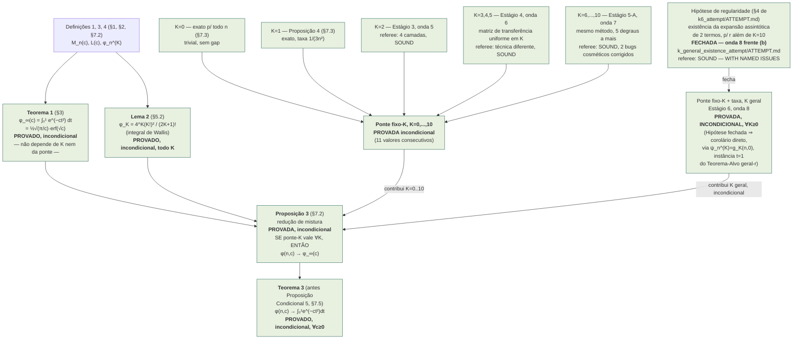
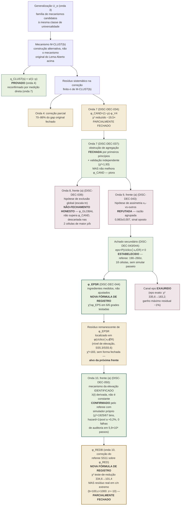

# Mapa de dependências — linha U₁/₂ (Core Numerics)

**Propósito deste documento.** Depois da onda 7, a linha U₁/₂ tem duas
frentes matemáticas independentes rodando em paralelo (onda 8,
`DISC-DEC-038`): (a) a ponte finito-`n` geral-`K` do Lema Aberto/taxa,
e (b) o resíduo de M-CLUST(b). Um resultado positivo numa frente **não
implica nada** sobre a outra — elas dependem de objetos matemáticos
distintos, provados por métodos distintos, sobre mecanismos distintos.
Este documento existe para tornar essa separação explícita e auditável,
não deixá-la implícita na cabeça de quem está integrando os resultados.
Nada aqui é um resultado novo — é a topologia de dependências dos
resultados já registrados em `theorem/THEOREM.md` e
`generalization_u_alpha/`, com cada nó apontando para a seção/proposição
exata que o prova.

---

## 1. Árvore A — o Lema Aberto / a ponte finito → infinito

> **[Adendo datado, 2026-08-22 — DISC-DEC-040.]** O diagrama acima foi
> ATUALIZADO (não apenas anotado) para refletir o fechamento da Hipótese
> de regularidade pela onda 8, frente (b) — consistente com a "Regra de
> uso" (§3 abaixo), que exige manter este mapa vivo, não uma fotografia
> estática do estado em que foi criado. O estado ANTERIOR (frente (b) em
> andamento, Hipótese como único gap, Proposição Condicional 5 apenas
> hipoteticamente promovível) está preservado no histórico git deste
> arquivo (commit `1baaea0`), não apagado — apenas o diagrama vivo, cujo
> propósito é sempre refletir o estado atual auditável, foi avançado.
> Nenhuma aresta foi removida por conveniência: a topologia é idêntica,
> apenas o status de dois nós (`Hyp`, `KgerInc`) e o nome/cor de um
> terceiro (`PC5`→`Teo3`) mudaram, exatamente como a "Regra de uso"
> previa que aconteceria "se a Frente (b) fechar".

**Leitura.** Verde = provado incondicionalmente — toda a Árvore A está,
desde 2026-08-22 (DISC-DEC-040), nesta cor.

> **[Adendo datado, 2026-08-23 — DISC-DEC-048, Estágio 9.]** Nenhum nó
> ou aresta acima muda de status ou cor — o diagrama continua correto
> como está. O que muda é a *razão* pela qual `K0`, `K1`, `K2`, `K345`,
> `K610` e `KgerInc` são verdes: em vez de seis provas separadas por
> seis métodos diferentes (indução direta, matriz de transferência,
> fechamento da Hipótese de regularidade), a onda 11 frente (b)
> forneceu uma **forma fechada única, exata, todas-as-ordens**
> (Teorema A/B de `all_orders_closed_form_attempt/ATTEMPT.md`,
> adversarialmente confirmada) da qual `ψ_n^{(K)}=g_K(n,0)` para
> **todo** `K≥0` — incluindo os seis valores/faixas específicos deste
> diagrama — segue como instância de uma única fórmula fechada, não
> mais como seis resultados empilhados. `KgerInc` e `Teo3` permanecem
> exatamente como provados por `DISC-DEC-040`; a nova frente apenas os
> torna, adicionalmente, corolários formais de um objeto mais forte.
> Ver `THEOREM.md` "Estágio 9" para o enunciado completo.

> **[Adendo datado, 2026-08-23 — DISC-DEC-049, Estágio 10.]** Um novo
> resultado, `uniform_in_c_attempt/ATTEMPT.md`, adversarialmente
> confirmado, estabelece que a convergência do nó `Teo3`
> (`φ(n,c)→φ_∞(c)`) é **uniforme em `c`** — não só em compactos
> `[0,C]`, mas em todo `[0,\infty)`. Este é um resultado *sobre* `Teo3`
> (uma propriedade mais forte da mesma convergência), não uma nova
> aresta de dependência dentro da Árvore A: `Teo3` continua provado
> exatamente como antes, e a prova de uniformidade não usa nenhum nó
> deste diagrama — usa apenas `Teo3` (pontual) mais dois lemas
> elementares novos (acoplamento equi-Lipschitz; limitante de cauda),
> nenhum dos quais depende de `K` ou da maquinaria `F_r/G_r/H_r`. Por
> isso o diagrama acima permanece correto e completo como está; o novo
> resultado vive logicamente "a jusante" de `Teo3`, não dentro da
> árvore. Ver `THEOREM.md` "Estágio 10" para o enunciado completo.

> **[Adendo datado, 2026-08-23 — DISC-DEC-052, Estágio 11.]** Um novo
> resultado, `uniform_in_c_attempt/mk_geometricity_attempt/ATTEMPT.md`,
> adversarialmente confirmado (SOUND, "ACCEPT for catalogue"), prova
> que `M_K` cresce no máximo geometricamente em `K`, fechando a única
> obstrução nomeada para "Teorema E" (a versão uniforme do perfil de
> erro de `Teo3`) ser incondicional — Teorema E perde o rótulo
> PROVED-MODULO. Exatamente como o adendo de Estágio 10 acima: este é
> um resultado *sobre* uma propriedade mais forte da mesma convergência
> (`Teo3`), não uma nova aresta de dependência dentro da Árvore A — a
> prova usa apenas a forma fechada todas-as-ordens (nó implícito de
> Estágio 9, já refletido acima) e o Lema A de redução, nenhum novo nó
> desta árvore. **Isto NÃO fecha "uma taxa explícita para Teorema A/C"**
> (hipótese (U'), uma obstrução distinta e mais forte, que continua sem
> prova) — os dois itens tinham sido nomeados separadamente em Estágio
> 10 e continuam separados. Ver `THEOREM.md` "Estágio 11" para o
> enunciado completo.

**O ponto que este mapa existia para blindar, agora resolvido
honestamente:** a Proposição 3 já estava provada, sem ressalva nenhuma,
desde a §7.2 original (bem antes da onda 7) — ela nunca dependeu do
desfecho da frente (b). O que a frente (b) podia mudar era só um dos
dois insumos que entram nela: com a Hipótese de regularidade fechada
(referee independente, veredito SOUND — WITH NAMED ISSUES, 4 questões
nomeadas corrigidas via adendos datados em
`k_general_existence_attempt/ATTEMPT.md` e `k6_attempt/ATTEMPT.md`), o
insumo "ponte-K para todo K" deixou de precisar do qualificador
condicional, e a Proposição 3 (inalterada) converteu isso
automaticamente em Teorema 3 — nenhuma nova prova de convergência de
mistura foi necessária, exatamente como este mapa previa.

---

## 2. Árvore B — M-CLUST(b), um mecanismo separado

> **[Adendo datado, 2026-08-22 — DISC-DEC-039/043/044.]** Diagrama
> ATUALIZADO (mesma disciplina da Árvore A) para refletir: onda 8
> frente (a) fechada como não-fechamento honesto; onda 9 frente (a)
> refutou a hipótese mandatada mas descobriu `eps≠0`; um referee
> hostil dedicado corrigiu dois erros na derivação original e produziu
> `φ_EPSR`, agora a fórmula de registro de M-CLUST(b) — a primeira
> mudança de fórmula de registro desde `DISC-DEC-034`. Rosa = tentativa
> que não fechou o alvo mandatado (mas pode ter produzido achados
> secundários genuínos, como aqui). Nenhuma aresta liga esta árvore à
> Árvore A — permanece um objeto matemático inteiramente separado.

> **[Adendo datado, 2026-08-23 — DISC-DEC-050.]** Onda 10 frente (a)
> (`MCLUST-ELEVATION-LEVEL-ATTEMPT`) atacou exatamente o nó `ELEV`
> acima e produziu dois resultados distintos, coloridos separadamente
> porque têm status muito diferentes. **`ELEVMECH`** (verde — mecanismo
> plenamente confirmado): a elevação de fechamento não é a constante
> `P_lead=1/(1−ρ)` que toda fórmula anterior da linhagem assumia — é
> uma função `λ(t)` da massa percorrida, derivada da mecânica exata do
> passeio (o pool de imagens `U_rem` encolhe à mesma taxa em que é
> consumido). Isto foi medido diretamente ao nível do mecanismo (sem
> nenhuma fórmula `φ` envolvida) e **reproduzido de forma independente
> pelo referee com seu próprio simulador e sementes próprias**
> (χ²=1925/67 bins contra elevação constante; hazard=1/pool confirmado
> a ≈0,2% por célula; zero falhas de auditoria em 5,9×10⁸ passos
> normais). **`REDB`** (âmbar — melhoria parcial, não fechamento): a
> candidata original desta frente, `φ_RED`, usava uma redução
> `M-CLUST(b)|x₀∉R ≡ M-U(c(1−ρ),(1−ρ)n)` que o referee refutou a 7,5×
> a precisão (χ² pooled 334,6, 6 células completas); a correção do
> próprio referee (`φ_REDB`, argumento `c''=c(1−c/n)^{b−1}` em vez de
> `c(1−ρ)`) reduz o χ² pooled para 101,4 e passa em 5 das 6 células
> testadas — mas a sexta célula, a mais extrema já testada nesta linha
> (`b=100,c=1000,ρ=0,785`), sozinha responde por ~96% do χ² restante,
> com desvio de 1,2–1,3% (`z≈−10`), maior que a correção `O(c/n)`
> esperada. `φ_REDB` é a nova fórmula de registro de M-CLUST(b),
> substituindo `φ_EPSR` — mas o resíduo do nó `RES` (topo desta árvore)
> **não está fechado**: fica registrado como um resíduo real e ainda
> não modelado nos parâmetros extremos, exatamente o mesmo padrão de
> fechamento parcial que `E2` (onda 7) e `AGG` (onda 7) já
> estabeleceram para esta linha. Fontes:
> `generalization_u_alpha/mclust_rigor/residual_attempt/aggregation_closure_attempt/global_exclusion_attempt/x0_asymmetry_attempt/elevation_level_attempt/ATTEMPT.md`
> e `.../adversarial/REFEREE_REPORT.md`.

**Leitura.** M-CLUST(b) não é um passo dentro da Árvore A — é um objeto
diferente, dentro do programa mais amplo de generalização U_α. As
obstruções que as frentes (a) de ondas 8 e 9 atacaram (exclusão de
escala global `tn`; assimetria x₀-vs-outros-arc-starts) não têm
nenhuma relação estrutural com a Hipótese de regularidade que a
frente (b) da onda 8 atacou (existência da expansão assintótica de
duas parcelas para `r` geral, ver Árvore A). São problemas de natureza
matemática diferente: um é sobre agregação/exclusão de probabilidade
condicional num passeio combinatório finito; o outro é sobre
existência de uma expansão assintótica de uma recursão discreta linear
no limite de escala. Não há nenhum lema
compartilhado entre as duas árvores além de primitivas elementares
(revelação preguiçosa de permutação uniforme) — e mesmo essa primitiva é
usada de formas distintas em cada uma.

---

## 3. Regra de uso deste mapa

Antes de integrar qualquer resultado positivo de uma das duas frentes
da onda 8 ao `THEOREM.md`, `DECISION_LEDGER.yaml` ou `TEST_QUEUE.yaml`,
checar explicitamente:

1. **Qual nó exato** do mapa acima o resultado preenche.
2. **Quais nós a jusante** (downstream) mudam de status como
   consequência direta, provada — não "provavelmente relacionados".
3. **Confirmar que nenhum nó da outra árvore** é mencionado como
   evidência, mesmo em linguagem hedged ("isso sugere que...", "é
   plausível que M-CLUST também..."). Se aparecer, é um sinal de
   conflação e a integração deve ser reescrita antes de comitar.

Este documento deve ser atualizado (não reescrito por cima — adendo
datado, mesma disciplina do resto do arquivo) sempre que uma nova aresta
for provada ou uma nova frente for aberta na linha U₁/₂.

---

*Criado em 2026-08-22, a pedido explícito do usuário, como salvaguarda
contra o uso inadvertido de um resultado positivo numa frente como
evidência da outra. Fontes: `theorem/THEOREM.md` §3, §5.2, §7.2–7.5, e
os adendos "Estágio 3–5"; `generalization_u_alpha/mclust_rigor/`.*
