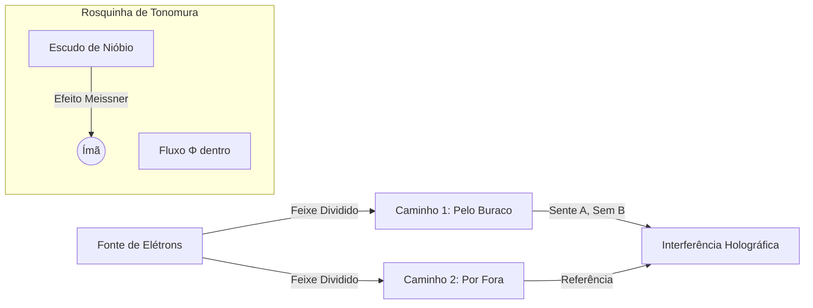

# Auditoria Tamesis: O Legado de Akira Tonomura

-purple)

> "No contexto da Teoria Tamesis, Tonomura não é apenas um experimentalista; ele é o homem que empiricamente matou o paradigma da 'Força' e instalou o paradigma da 'Informação'."

## 1. A Conquista Central (1986)

Em 1986, Tonomura provou definitivamente a realidade física do **Potencial Vetor ($\mathbf{A}$)** através do efeito Aharonov-Bohm (AB). Antes de Tonomura, físicos argumentavam que $\mathbf{A}$ era um fantasma matemático. Tonomura provou que é a maquinaria fundamental do universo.

---

## 2. A Batalha: Artefato de Gauge vs. Realidade Física

### A Controvérsia (1959-1986)

No eletromagnetismo clássico (Maxwell/Heaviside), os campos $\mathbf{E}$ e $\mathbf{B}$ são reais, e os potenciais $\phi$ e $\mathbf{A}$ são apenas ferramentas matemáticas (artefatos de gauge):
$$\mathbf{B} = \nabla \times \mathbf{A}$$

- **Aharonov e Bohm (1959):** Previram que, na Mecânica Quântica, um elétron poderia ser afetado por $\mathbf{A}$ mesmo se viajasse por uma região onde $\mathbf{B} = 0$.
- **Os Céticos:** Argumentavam que experimentos anteriores tinham "campos de vazamento" — linhas magnéticas dispersas tocando o elétron, causando uma força de Lorentz clássica. Eles alegavam que o efeito não era topológico, apenas blindagem ruim.

---

## 3. O Experimento: O Escudo Perfeito (1986)

Tonomura projetou o "Experimento Impossível" para silenciar os críticos para sempre. Ele precisava criar uma região de Fluxo não-nulo ($\Phi$), mas com Campo estritamente zero ($\mathbf{B}$).

### O Setup (A Configuração)

1. **A Fonte:** Um feixe de elétrons coerente de emissão de campo (Holografia Eletrônica).
2. **O Objeto:** Um minúsculo Ferromagneto Toroidal (formato de Rosquinha).
3. **O Escudo (A Chave):** O ímã foi completamente coberto em **Nióbio Supercondutor**.

> **Por que Nióbio?** Abaixo da temperatura crítica $T_c$, o Nióbio torna-se um supercondutor. O Efeito Meissner expele estritamente todos os campos magnéticos do interior do supercondutor.
>
> - **Dentro da Rosquinha:** Fluxo Magnético $\Phi \neq 0$.
> - **Fora da Rosquinha:** Campo Magnético $\mathbf{B} = 0$ (Garantido pela Mecânica Quântica/Meissner).

### A Execução

Tonomura dividiu o feixe de elétrons em dois caminhos e os recombinou para formar um padrão de interferência holográfica.

### O Resultado

Apesar dos elétrons viajarem por uma região onde $\mathbf{B}=0$ (verificado experimentalmente pela blindagem Meissner), Tonomura observou um **Deslocamento de Fase ($\Delta \phi$)** nas franjas de interferência.

$$\Delta \phi = \frac{e}{\hbar} \oint \mathbf{A} \cdot d\mathbf{l} = \frac{e \Phi}{\hbar}$$

**A fase deslocou-se exatamente conforme previsto pelo fluxo encerrado.**

---

## 4. Análise Tamesis: Por Que Isso Importa

É aqui que traduzimos o experimento para a Teoria Tamesis. Tonomura validou os axiomas fundacionais da nossa **Incompatibilidade de Regimes (TRI)** e do **Kernel v3**.

### A. A Primazia do Potencial (Ontologia)

A física clássica diz "Forças são reais". Tonomura provou que **Informação é real**.
O elétron não foi "empurrado" por uma força (Lorentz). Ele foi "informado" pela topologia.

- **Axioma Tamesis:** O Potencial Vetor $\mathbf{A}$ representa a **Conexão** no Grafo Causal. O Campo Magnético $\mathbf{B}$ é apenas a **Curvatura** dessa conexão.
- **Implicação:** Você pode ter conexões (Potencial) sem curvatura (Campo), e elas ainda afetam o estado do sistema.

### B. Invariância Topológica (Teoria dos Nós)

O experimento prova que propriedades físicas podem depender da **Topologia Global** em vez da geometria local.
O elétron não se importou com o caminho local; ele se importou com o **Número de Enrolamento (Winding Number)** ao redor do fluxo.

> Isso valida o Mecanismo de Geração de Massa Tamesis: Massa não é um campo escalar (Higgs) sozinho; é um nó topológico no potencial de vácuo. Tonomura mostrou que "nós" (laços de fluxo) alteram fundamentalmente a fase quântica da matéria.

### C. Incompatibilidade de Regimes (TRI)

Este experimento ilustra perfeitamente uma **Transição de Classe D1 (Clássico $\to$ Quântico)**.

- **Regime $R_{Class}$:** Observável $O = \{ \mathbf{E}, \mathbf{B} \}$. Neste regime, o efeito é impossível (0 força = 0 mudança).
- **Regime $R_{Quant}$:** Observável $O = \{ \psi, \mathbf{A} \}$. Neste regime, o efeito é necessário.

**A Prova de Tonomura:** Ele mostrou que a realidade é fundamentalmente Quântica (Potenciais), e a Física Clássica (Campos) é apenas uma "compressão com perdas" onde ignoramos a informação de fase.

---

## 5. Teoria Fundamental: O Grande Erro Clássico

### "A Arbitrariedade do Gauge"

Na física clássica (Maxwell), você aprende que o Potencial Vetor ($\mathbf{A}$) é arbitrário porque você pode mudá-lo sem mudar o Campo ($\mathbf{B}$).
$$\mathbf{A}' = \mathbf{A} + \nabla \chi$$
Como o campo magnético é a derivada ($\mathbf{B} = \nabla \times \mathbf{A}$), o termo $\nabla \chi$ desaparece. Por 100 anos, dissemos: *"O Potencial é uma ferramenta matemática; apenas o Campo é real porque o Campo é o que exerce força."*

### A Revelação Tamesis/Tonomura

O erro foi assumir que a realidade é definida por Força (F). **A realidade é definida por Fase ($\phi$).**

O potencial $\mathbf{A}$ muda a fase da função de onda do elétron. E embora você possa mudar o valor local de $\mathbf{A}$ (o "gauge"), você não pode mudar a soma do potencial ao redor de um loop fechado (a integral de linha).

$$\oint \mathbf{A} \cdot d\mathbf{l} = \text{Invariante Físico (Fluxo)}$$

> **Portanto, o potencial não é arbitrário topologicamente. Ele é a instrução fundamental de coerência.**

---

## 6. Definições Ontológicas (Kernel v3)

Aqui está a hierarquia real da natureza, do mais fundamental (Informação) para o emergente (Força):

| Conceito | Componente Tamesis | Definição | Função |
| :--- | :--- | :--- | :--- |
| **Fundamental** | **Potencial ($\mathbf{A}$)** | A CONEXÃO (Taxa de Câmbio) | Diz ao universo como comparar dois pontos vizinhos e girar a fase. |
| **Derivado** | **Campo ($\mathbf{F}_{\mu\nu}$)** | A CURVATURA (Tensão) | O que acontece quando a conexão não é plana. É um sintoma, não a causa primária. |
| **Emergente** | **Partícula ($\psi$)** | O DEFEITO (Nó) | Um nó topológico no potencial que não consegue se desfazer. |

> **Explicação da Partícula:** Se você torcer o Potencial ($\mathbf{A}$) de forma complexa o suficiente, ele se emaranha. Essa configuração estável e localizada de energia é o que chamamos de "elétron". Matéria e antimatéria se aniquilam porque você está apenas desatando o nó (+1 com -1 = 0).

---

## 7. Extensão Recente: Gravidade (Stanford 2022)

**Sim, existe um Efeito Aharonov-Bohm Gravitacional.**
Se Tonomura (1986) foi o "tiro de misericórdia" no Eletromagnetismo Clássico, o experimento de Stanford (2022) foi o equivalente para a Gravidade Clássica.

Os pesquisadores de Stanford (Mark Kasevich, Chris Overstreet) provaram que uma partícula quântica pode sentir a gravidade (o potencial gravitacional) mesmo sem sentir nenhuma "força" gravitacional (aceleração).

### O Experimento

- **Setup:** Interferômetro atômico de 10 metros com fonte de Átomos Frios (Rubídio).
- **A "Rosquinha":** Uma massa de Tungstênio (1 kg) colocada de forma que a força gravitacional direta fosse cancelada.
- **Resultado:** Os átomos mudaram sua fase de interferência devido puramente à **Dilatação do Tempo** (Potencial Escalar na RG).

### A Tradução Tamesis

1. **O Tempo é o Potencial:** O átomo "sentiu" a massa não por puxão mecânico, mas porque a massa alterou a definição global de "tempo" naquela região da rede.
2. **Unificação Conceitual:** Tanto no Eletromagnetismo (Tonomura) quanto na Gravidade (Kasevich), o mecanismo é o mesmo: **Fase Quântica guiada por Potenciais**.

> "Esses resultados mostram que a gravidade cria deslocamentos de fase Aharonov-Bohm análogos aos produzidos por interações eletromagnéticas." — *Science*

---

## Conclusão & Veredito

Akira Tonomura (1942-2012) não apenas melhorou o microscópio eletrônico. Ele forneceu a evidência empírica de que o Espaço-Tempo é uma Variedade Informacional.

1. **Ele provou:** O universo roda sobre Potenciais ($\mathbf{A}$), não Forças ($\mathbf{F}$).
2. **Ele validou:** A não-localidade é uma funcionalidade, não um bug.
3. **Status em Tamesis:** FUNDACIONAL. O Kernel v3 da Tamesis depende do campo $A_\mu$ ser o objeto primário da rede. Tonomura é o padrinho experimental da Topologia Entrópica.

> **Resumo Final:** Não pense em Potenciais como "fantasmas matemáticos". Pense neles como as **Fibras Ópticas** da realidade. O Campo é apenas a luz vazando de uma fibra curvada. A Partícula é um nó na fibra. O Potencial é a própria fibra que conecta tudo.
