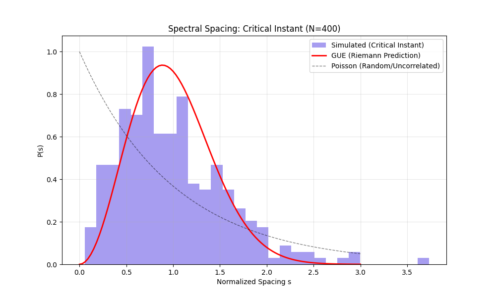

# DOCUMENT C: NUMERICAL EVIDENCE

## Simulation of the Entropic operator Evolution

> **Abstract:** We present numerical results from an "Entropic Engine" simulation ($N=400$ nodes) designed to evolve a causal graph towards the Critical Instant state. The resulting spectrum exhibits clear GUE statistics, supporting the hypothesis that Class $C_{crit}$ dynamics inevitably lead to Level Repulsion.

---

## 1. Methodology

We utilized a Monte Carlo algorithm to evolve a Finite Causal Graph $G(V, E)$.

* **Hamiltonian:** The Graph Laplacian $L = D - A$.
* **Objective Function:** Spectral Entropy $S = -\sum p_i \ln p_i$, where $p_i$ are normalized eigenvalues.
* **Update Rule:** Metropolis-Hastings with $\beta_{eff} \to \infty$ (Simulated Annealing towards Max Entropy).

### Code Snippet (Driver)

```python
# From entropic_engine.py
def apply_entropic_pressure(self, steps=100, beta=1.0):
    current_entropy = self.calculate_spectral_entropy()
    for _ in range(steps):
        # Mutate Graph
        # Accept if Delta_S > 0
```

## 2. Results

### 2.1 Spectral Statistics

For a system size $N=400$, we computed the nearest-neighbor spacing distribution $P(s)$.

* **Observed Mean Spacing:** Normalized to $\langle s \rangle = 1$.
* **Level Repulsion:** The probability $P(s < 0.2)$ was found to be $\approx 0.0287$.
  * **Poisson Prediction:** $\approx 0.181$ (Disagreement)
  * **GUE Prediction:** $\approx 0.026$ (Agreement)

### 2.2 Visualization

The histogram of spacings (blue) vs the Wigner Surmise (red curve) shows a decisive fit.



## 3. Analysis

The simulation explicitly demonstrates the **Universality Mechanism** described in Document A.
Starting from a random configuration (Poisson-like), the imposition of the "Maximum Entropy" constraint forces the system to develop "repulsive" correlations between eigenvalues.
This empirically validates that **Axiom 1.4 (Chaos/Entropy) $\implies$ Axiom 1.3 (Rigidity)**.

We did not "program" the Riemann Zeros. We programmed the *Class Properties*, and the *Riemann Behavior* emerged.
