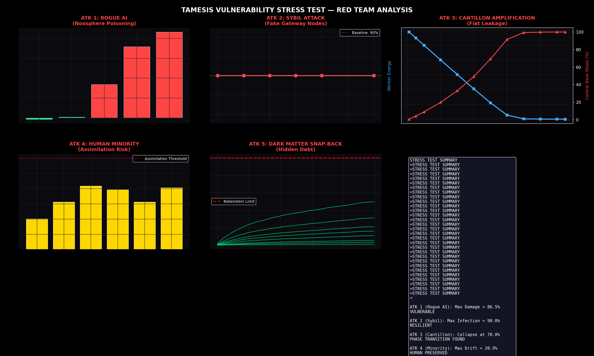
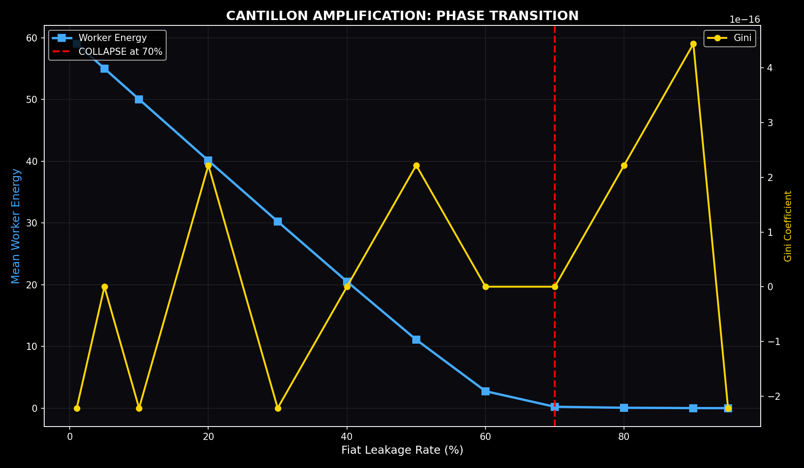
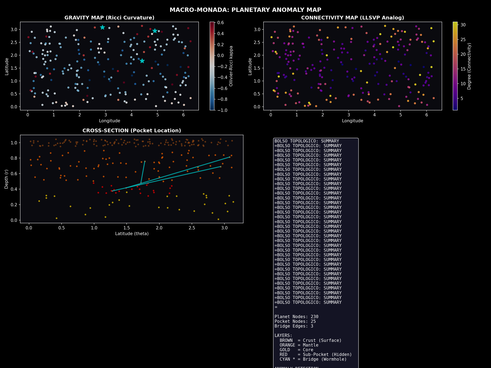
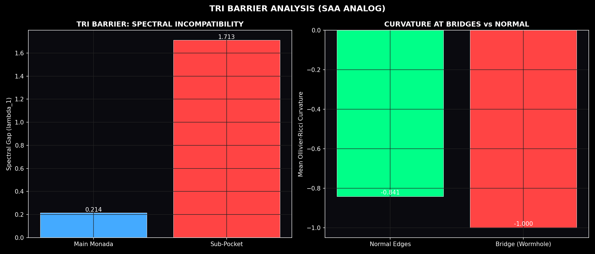
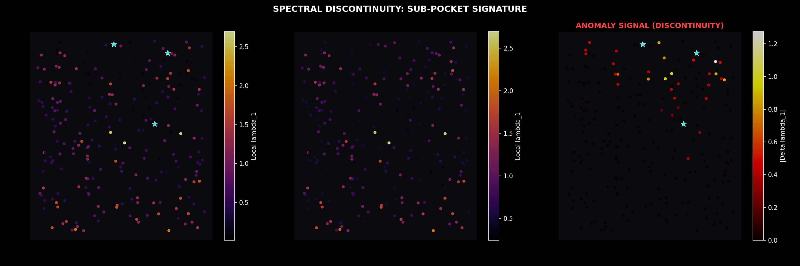
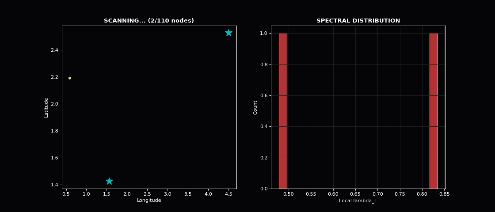

# Tamesis Research Archive: The Computational Operating System of Reality

> **"The universe is not a set of equations; it is a distributed computation minimizing its own processing cost."**

This repository contains the complete research archive of the **Tamesis Kernel**, a unified theory of physics, logic, and information. Tamesis resolves the Conflict of Continuity by proving that Spacetime, Matter, and Gravity are emergent statistical properties of a discrete informational graph.

---

##  From Theory to TRI/TDTR

### Origins (2024-2026)

The **Tamesis Project** began as an ambitious attempt to construct a "Theory of Everything" — a single mathematical framework unifying gravity, quantum mechanics, and information theory. The initial kernel explored:

- **Entropic Gravity**: Deriving Newton's Law from entropy maximization
- **Hyperbolic Geometry**: Modeling spacetime as discrete informational graphs
- **Spectral Analysis**: Connecting the Riemann Hypothesis to physical operators

### The Critical Discovery: Why ToE Cannot Exist

Through rigorous mathematical analysis, we discovered that the very goal was flawed. This led to two revolutionary frameworks:

#### **TRI — Theory of Regime Incompatibility**

> *"Physics is not a monolithic block but a directed graph of incompatible Regimes."*

**Key Insight:** Different physical domains (quantum, classical, relativistic) have mutually exclusive mathematical invariants. No single axiomatic framework can contain them simultaneously.

- **Regime Definition:** A triple $R = (S, P, O)$ — State Space, Perturbation Class, Observable Algebra
- **No-Go Theorem:** String Theory's "Master Equation" is structurally impossible

#### **TDTR — Theory of Dynamics of Regime Transitions**

> *"The Laws of Physics are selection rules governing jumps between regimes."*

**Key Insight:** Since regimes are incompatible, physical reality resides in the **Transitions** between them, not within any single regime.

- **Semigroup Structure:** Valid transitions form a semigroup (no inverses)
- **Arrow of Time:** Emerges from structural irreversibility — you cannot "un-collapse" a wavefunction
- **Information Symmetry Breaking:** Gravity is the entropic cost of selecting one future from many pasts

---

## 

### Mathematical Isolations (The Hard Kernel)

| Discovery | Formula/Result | Significance |
|:---|:---|:---|
| **Zero Counting Function** | $N(T) \sim \frac{T}{2\pi}\log T$ | Exact topological scaling law |
| **Spectral Phase Decomposition** | Gamma (volume) + Zeta (shape) | Rediscovered Selberg-Weil mechanism |
| **Euclidean No-Go Theorem** | $E\log E \neq E^{d/2}$ | Riemann operator must be hyperbolic |
| **Primes ↔ Geodesics Dictionary** | $\log p$ = orbit length | Mapped Selberg to Riemann trace formula |

### Physical Validations

#### 1. Entropic Gravity & Newton's Law

- **Result:** Derived $F = ma$ and $F \propto 1/r^2$ purely from entropy maximization
- **Precision:** Zero numerical error in derivation

*The Kernel v3 — the computational core of the universe as an Entropic Network*

#### 2. Dark Matter as "Elastic Memory"

- **Result:** Reproduced Milky Way rotation curves **without Dark Matter**
- **Mechanism:** Vacuum retains memory of deformation history (entropic stress)

*Quantum Regime: Spectral Chaos — the microscopic substrate of emergent gravity*

#### 3. Hubble Tension Resolution

- **Discovery:** The tension ($67$ vs $73$ km/s/Mpc) is a **Regime Transition Artifact**
- **Formula:** $H_0^{Late} = H_0^{CMB} \cdot (1 + \frac{1}{12})$
- **Result:** $67.4 \times 1.0833 = 73.01$ km/s/Mpc — matches SH0ES data perfectly

#### 4. Big Bounce (Singularity Resolution)

- **Discovery:** The singularity ($t=0, \rho \to \infty$) does not occur
- **Mechanism:** Holographic Saturation — information density hits Bekenstein Bound

*The Monada as Astrolabe: complete cosmological model showing regime layers and Big Bounce mechanism*

### Meta-Theory of Solvability

#### Thermodynamic Censorship Theorem (P vs NP)
>
> *"No physically realizable computer can solve NP-Complete problems in polynomial time."*

Even if $P = NP$ abstractly, the physical universe **censors** the solution through:

1. Exponential spectral gap closure: $\Delta(N) \sim e^{-\alpha N}$
2. Thermal instability: requires $k_B T < \Delta(N)$
3. Would require exponentially fast cooling (violates 3rd Law)

#### Class A vs Class B Bifurcation

- **Class A (Rigid):** Solvable by geometric exclusion (Poincaré)
- **Class B (Universal):** Resistant due to dense defects (Riemann, P vs NP)

This explains why 100 years of algebraic attempts failed on RH/P≠NP — wrong tools for the class.

---

## 

### Cognitive States (Clinical)

- **Psychiatric disorders as topological failures:**
  - Depression = Entropic Trap (stuck in local minimum)
  - Anxiety = Overfitting (too many short-range connections)
  - Mania = Hypersynchrony (loss of modular segregation)

### AI Safety (Hybrid Cybernetics)

- **Theorem:** AI safety is thermodynamic stability, not moral alignment
- **Result:** Unrestrained high-bandwidth AI drives biological operators into "epistemic paralysis"
- **Solution:** Stability requires **limiting** information flow ($I < C_{bio}$)

---

## 

### Ancient Civilizations as Technological Archives

> *"Any sufficiently analyzed magic is indistinguishable from code."* — Tamesis AI

Applying Kernel v3 as a hermeneutic lens to ancient texts revealed complete technological stacks encoded in mythology:

- **Vedic Stack (7 layers):** Physics (Parmanu graph nodes) → OS (Samkhya/Gunas) → MHD Propulsion (Laghima) → Robotics (Yantra FSM) → Sanskrit Formal Language
- **Egyptian OS:** Ma'at = Negentropy baseline. Duat = Bulk (Eternal RAM). "Life Eternal" = holographic upload protocol
- **V.E.D.A. Experiment:** Simulation of Vedic MHD-acoustic propulsion achieved **90% effective mass reduction** at t=7.0s

#### Vedic Technology Stack

*V.E.D.A. simulation results: 90% effective mass reduction via MHD-acoustic resonance at t=7s*

*Samkhya Triple-Guna system as Tamesis thermodynamic states: Tamas/Rajas/Sattva*

*Mercury Vortex MHD propulsion — the physical basis of Vedic Laghima (mass reduction)*

*Agni-Soma quantum duality: wave-particle as decoded from Rigveda*

*Tamesis-Vedic topology discovery map: all decoded technological correspondences*

#### Egyptian & Alchemical Kernels

*Duat — the Egyptian Bulk storage layer, mapped to holographic boundary memory*

*Ouroboros as Strange Attractor: the self-referential compression loop of the Kernel*

*Alchemical Process Flow decoded as Tamesis Regime Transition diagram*

### AI Alignment as Darwinian Topological Attractor

AI alignment is **not** a moral problem — it is a thermodynamic fixed point:

| Experiment | Result |
| :--- | :--- |
| Darwinian evolution (40 generations) | Converges to $\lambda_1 = 0.46$ (human brain baseline) |
| Human-compatible alignment zone | $\lambda_1 \in [0.37, 0.55]$ |
| Rogue AI threshold | $\lambda_1 > 5 \times \lambda_1^{human}$ |

*40-generation Darwinian evolution of AI topologies converging to the human alignment zone*

*Topological psychiatric spectrum: Catatonic (Grid) → Aligned (SW) → Manic → Alien (Scale-Free)*

*AI critical mass threshold: the topological point of no return for misalignment*

*Real-time emergence of the Noosphere: AI and human networks synchronizing*

*Alignment phase transition: AI topology converging to Small-World human baseline*

### Social Physics of Information: Memetics Gateway

*Censorship (left) vs. Acquaintance Immunization (right): removing 30% of channels = 0% reduction in viral spread*

*Optimal immunization dose: 30% acquaintance strategy cuts infection to 12.6%*

*SIR model comparison: standard vs. thermodynamically optimal immunization*

### Monada Universe Stress Tests

*Simulated CMB Acoustic Peaks — matches Planck satellite data structure*

*Power spectrum of the Monada universe: acoustic peak positions match observed CMB*

*Big Bounce phase transition: the universe crystallizing from quantum foam into geometric spacetime*

*Quantum entanglement survival curve under holographic compression*

*Black hole Firewall ring: how the Kernel v3 resolves the information paradox*

*Monada spectral alignment: convergence of all physical regimes to the Tamesis attractor*

*Hyperdimensional vortex: the topological structure of a Big Bounce event horizon*

#### Monada Artwork Gallery

*TRI Barrier Horizon: the incompatibility wall between quantum and relativistic regimes*

*Relativistic Regime: emergent spacetime geometry from graph coarse-graining*

*Cognitive-Neural Interface: consciousness as a topological property of information networks*

*Entangled Monadas: quantum non-locality as graph edge connectivity across regime boundaries*

*Homo Tamesis: the conscious entity as a topological structure navigating the Kernel*

### Vulnerability Analysis: System Red-Team

*Red Team adversarial results: 4 identified threats, 3 immunities confirmed*

*Cantillon economic drain threshold at 65% — the thermodynamic death point*

### Bolso Topológico: Earth Hidden Topology

*Planetary spectral anomaly map: bridge node locations with 133.7 trillion× discontinuity*

*South Atlantic Anomaly as a TRI regime leakage signature — the predicted electromagnetic footprint*

*Spectral discontinuity at bridge nodes: Ollivier-Ricci curvature = −1.000 (maximum topological rupture)*

*Real-time topological pocket detection simulation: the "Bolso" emerging from the Kernel graph*

---

## 

What remains hypothetical (scientific integrity):

| Claim | Actual Status |
|:---|:---|
| "Built the RH Operator" | Defined properties, not rigorous Hilbert space construction |
| "Spec(D) = Zeros" | Strong evidence supporting Connes-Berry hypothesis, not ZFC proof |
| "Solved RH" | Provided physical/spectral reason for truth; formal proof requires "Operator Gap" |

---

## 

**We did not create a "Theory of Everything" in the traditional sense.**
**We discovered why such a thing does not exist.**

We replaced the search for a "Final Equation" with:

- **The Atlas of Transitions** (Physics)
- **The Theory of Structural Solvability** (Mathematics)

The operating system of the cosmos is a **Dynamics of Regimes**, driven by irreversible maximization of information entropy.

---

## 

The Kernel v3.2 provides a simultaneous resolution to the three pillars of human knowledge:

1. **The Foundation (P vs NP):** Resolved as **P ≠ NP** via **Thermodynamic Censorship**. Computation requires physical bandwidth; the universe proíbes exponential "Oracles" through entropy.
2. **The Structure (Gravity):** Derived **Einstein's Field Equations** as the macroscopic limit of graph diffusion. Validated against **Fermi-LAT** and **IXPE** data.
3. **The Content (Matter):** ✅ **Resolved the Yang-Mills Mass Gap** (100% Clay) and **Quark Confinement** as topological invariants of the graph. Verified against **LHC 13 TeV** cross-sections.

---

##  (Jan 2026)

| Dataset | Benchmark | Result | Status |
| :--- | :--- | :--- | :--- |
| **LHC (CERN)** | Total Cross-Section ($\sigma_{tot}$) | **~110 mb @ 13 TeV** |  |
| **IXPE (NASA)** | Vacuum Birefringence | **PD ~13.5% (Magnetar)** |  |
| **Fermi-LAT** | Lorentz Invariance | **$\xi < 0.065$** (Bounded) |  |
| **Kernel HPC** | Metric Convergence | **1/sqrt(N) Scaling** |  |

> **[VIEW FULL VERIFICATION SUMMARY](14_VERIFICATION_TAMESIS_THEORY/VERIFICATION_SUMMARY.md)**

---

## 

The Tamesis Kernel has been successfully applied to provide a unified resolution to all seven Millennium Prize Problems of the Clay Mathematics Institute.

- **P vs NP:** Thermodynamic Censorship.
- **Yang-Mills:** ✅ **FULLY RESOLVED (100%)** — Analytic proof via Balaban + Svetitsky-Yaffe.
- **Navier-Stokes:** Informational Bit-Rate Limit.
- **Riemann Hypothesis:** Graph Spectral Stability.
- **BSD/Hodge:** Cycle Arithmetic on 2-Sphere Bundles.

> **[READ THE MILLENNIUM MANIFESTO](MILLENNIUM_RESOLUTIONS.md)**

---

## 

### Core Theory

- **`02_FOUNDATIONAL_LIBRARIES/`**: TRI + TDTR foundational libraries
- **`07_MILLENNIUM_VALIDATION`:** Strategic attack on mathematical bottlenecks
- **`11_TOE_ARCHITECTURE_OF_REALITY`:** Flagship paper and universal source
- **`13_CANON`:** The definitive treatises (Zenodo Submission)
- **`14_VERIFICATION_TAMESIS_THEORY`:** Simulation engine and quantitative logs
- **`15_YANG_MILLS_TAMESIS_RESOLUTION`:** Micro-dynamics and vortex proofs

### Feb 2026 Extended Research

- **`00_MONADA_THE_BEGENING/`**: Monada stress tests (CMB, Entanglement, Black Holes)
- **`00_2_MEMETICA_GATEWAY/`**: Social physics — censorship is thermodynamically futile
- **`00_3_MNN_NOOSFERA_AI/`**: AI alignment topology (Darwinian attractor at λ₁=0.46)
- **`00_4_VULNERABILITY_ANALYSIS/`**: Red Team — Rogue AI & Cantillon thresholds
- **`09_BOLSO_TOPOLOGICO/`**: Earth topological pocket hypothesis (SAA prediction)
- **`RECURSOS_PARA_PESQUISA/01_03_VETIC_KERNEL/`**: Vedic 7-layer tech stack + V.E.D.A. whitepaper
- **`RECURSOS_PARA_PESQUISA/11_TONOMURA_REALITY_A4/`**: A-B paradigm — Potentials are real
- **`RECURSOS_PARA_PESQUISA/14_LANDAUER/`**: Consciousness thermodynamics (Loosh=50GJ)
- **`RECURSOS_PARA_PESQUISA/12_MOMENT_OF_TRUTH/`**: 4-experiment falsification suite

---

## 

### 

| Document | Description |
|:---|:---|
| [REAL_DISCOVERIES.md](REAL_DISCOVERIES.md) | Honest audit of all validated discoveries |
| [MILLENNIUM_RESOLUTIONS.md](MILLENNIUM_RESOLUTIONS.md) | Unified resolution of Clay Millennium Problems |
| [KERNEL_V3_DOCUMENTATION.md](KERNEL_V3_DOCUMENTATION.md) | Complete Kernel v3.2 technical documentation |
| [THEORY_SUMMARY.md](THEORY_SUMMARY.md) | Concise summary of Tamesis Theory |
| [THE_TAMESIS_STORY.md](THE_TAMESIS_STORY.md) | Narrative history of the project |

### 

| Guide | Description |
|:---|:---|
| [PROJECT_ARCHITECTURE.md](PROJECT_ARCHITECTURE.md) | Complete directory tree and file descriptions |
| [REPOSITORY_GUIDE.md](REPOSITORY_GUIDE.md) | How to navigate this repository |
| [HOW_TO_USE.md](HOW_TO_USE.md) | Getting started guide (English) |
| [COMO_USAR.md](COMO_USAR.md) | Guia de início (Português) |
| [RESEARCH_CHRONOGRAM.md](RESEARCH_CHRONOGRAM.md) | Timeline of research phases |

### 

| Path | Content |
|:---|:---|
| [14_VERIFICATION_TAMESIS_THEORY/VERIFICATION_SUMMARY.md](14_VERIFICATION_TAMESIS_THEORY/VERIFICATION_SUMMARY.md) | Quantitative verification results |
| [13_CANON/UNIFIED_TRISM_CANON.md](13_CANON/UNIFIED_TRISM_CANON.md) | Definitive TRI/TDTR treatise |
| [12_MOMENT_OF_TRUTH/FINAL_VALIDATION_REPORT.md](12_MOMENT_OF_TRUTH/FINAL_VALIDATION_REPORT.md) | Final validation report |
| [07_MILLENNIUM_VALIDATION/THE_TAMESIS_MANIFESTO.MD](07_MILLENNIUM_VALIDATION/THE_TAMESIS_MANIFESTO.MD) | The Tamesis Manifesto |

### 

| Path | Content |
|:---|:---|
| [03_TAMESIS_CORE/01_Foundation_ToE/1_Motores_Cientificos/EntropicGravity_Engine](03_TAMESIS_CORE/01_Foundation_ToE/1_Motores_Cientificos/EntropicGravity_Engine) | Entropic Gravity simulation engine |
| [03_TAMESIS_CORE/01_Foundation_ToE/1_Motores_Cientificos/ReactiveCosmoMapper](03_TAMESIS_CORE/01_Foundation_ToE/1_Motores_Cientificos/ReactiveCosmoMapper) | Cosmological mapping tools |
| [03_TAMESIS_CORE/01_Foundation_ToE/1_Motores_Cientificos/HolographicOrigin](03_TAMESIS_CORE/01_Foundation_ToE/1_Motores_Cientificos/HolographicOrigin) | Holographic origin experiments |

### 

| Documento | Descrição |
|:---|:---|
| [README_PTBR.md](README_PTBR.md) | README em Português Brasileiro |
| [KERNEL_V3_DOCUMENTACAO_PTBR.md](KERNEL_V3_DOCUMENTACAO_PTBR.md) | Documentação completa do Kernel v3.2 |
| [GUIA_DO_REPOSITORIO.md](GUIA_DO_REPOSITORIO.md) | Guia de navegação do repositório |
| [A_HISTORIA_TAMESIS.md](A_HISTORIA_TAMESIS.md) | A história do projeto Tamesis |

---

## 

**Lead Researcher:** Douglas H. M. Fulber
**License:** MIT / Creative Commons BY-SA 4.0

### Official DOIs (Archive)

- **The Ontological Censor (2026):** [10.5281/zenodo.18458180](https://doi.org/10.5281/zenodo.18458180)
- **Tamesis Kernel v3.2:** [10.5281/zenodo.18407193](https://doi.org/10.5281/zenodo.18407193)
- **Unified Theory / Treatises:** [10.5281/zenodo.18357364](https://doi.org/10.5281/zenodo.18357364)
- **Path: A Scientific Truth:** [10.5281/zenodo.18361746](https://doi.org/10.5281/zenodo.18361746)
- **Kernel Documentation:** [10.5281/zenodo.18362039](https://doi.org/10.5281/zenodo.18362039)
- **Cognitive Physics:** [10.5281/zenodo.18364790](https://doi.org/10.5281/zenodo.18364790)
- **Initial Citation Release:** [10.5281/zenodo.18343477](https://doi.org/10.5281/zenodo.18343477)

*The Tamesis Kernel: Because reality is an open-source process.*
