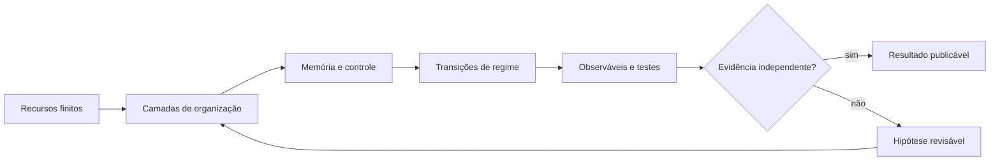
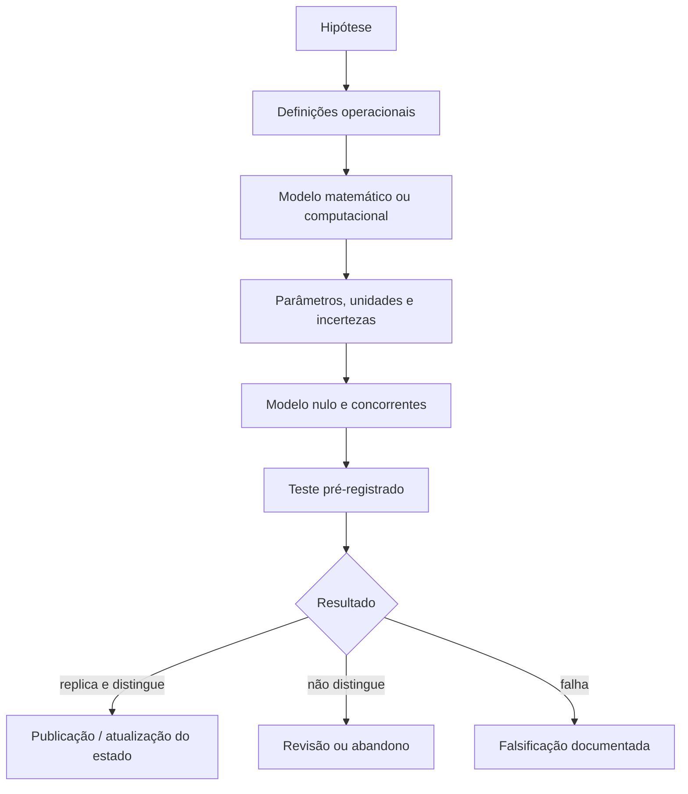

# Laboratório Tamesis — Research Archive

[](RELATORIO_PROGRESSO_AUDITORIA_ARTIGOS.md)
[](RELATORIO_PROGRESSO_AUDITORIA_ARTIGOS.md)
[](PROJECT_FREEZE.md)
[](PROJECT_STATE.json)
[](LICENSE)
[](#governança-autoria-e-responsabilidade)

> **Um arquivo interdisciplinar para investigar informação, geometria, transições, sistemas complexos e cognição — com hipóteses separadas de evidências.**

Este repositório preserva a trajetória completa do Laboratório Tamesis, seu ramo experimental atual e suas linhas históricas, matemáticas, físicas, computacionais e cognitivas. O arquivo contém **280 registros auditados**, organizados em **274 dossiês de auditoria**. A auditoria não transforma conjecturas em fatos: ela torna explícito o que é demonstração, modelo, simulação, ajuste, hipótese ou cenário especulativo.

Desde 2026, o arquivo também opera um **laboratório de adjudicação contínua** (`05_DISCOVERY_LAB`): as alegações quantitativas do próprio arquivo são fechadas, uma a uma, contra referências externas reais, com critérios pré-registrados e reprodução adversarial obrigatória. O desfecho — dezenas de fechamentos negativos catalogados com veredito final e um resultado matemático positivo derivado e verificado adversarialmente — está sintetizado no **[artigo científico do laboratório](index.html)** (página principal do repositório).

## Leitura rápida

O relatório institucional [Visão final do Laboratório Tamesis](RELATORIO_VISAO_FINAL_LABORATORIO_TAMESIS.md) apresenta as perguntas, respostas, impactos, aplicações e novas perguntas produzidas pelo conjunto da pesquisa. Há também uma versão [HTML pronta para impressão em PDF](RELATORIO_VISAO_FINAL_LABORATORIO_TAMESIS.html).

### Estado científico atual

| Camada | Estado | Interpretação correta |
|---|---|---|
| Arquivo e metodologia | **Concluído/auditado** | Inventário, classificação de alegações, fontes e critérios de falsificação registrados. |
| Modelos computacionais | **Congelados para auditoria** | Resultados reproduzíveis devem ser tratados como saídas de modelos, não como constantes medidas. |
| Tamesis `M_c v1` | **Hipótese testável** | O valor `M_c = 5.292674126388712e-16 kg` é um parâmetro do modelo, não uma medição. |
| Evidência física independente | **Ainda não estabelecida** | Não há, neste arquivo, confirmação experimental da ontologia Tamesis. |
| Problemas do Millennium e TOE | **Não resolvidos** | Os textos são conjecturas, reduções ou modelos restritos; não são soluções aceitas. |
| Adjudicação numérica do núcleo | **Consolidação matemática concluída, gap fechado incondicionalmente até K=10 (2026-08-22)** | Ver seção abaixo — 3 alegações fechadas negativas com veredito final; a 4ª (U₁/₂) tem núcleo provado, verificado por referee adversarial, com o Lema Aberto agora PROVADO incondicionalmente para K=0,...,10; para K geral existe uma prova condicional da conjectura de taxa (ressalva de regularidade julgada corretamente dimensionada por referee hostil), não um fechamento incondicional. |

### O programa de adjudicação (Discovery Lab, atualizado 2026-08-22)

O `05_DISCOVERY_LAB` mantém uma adjudicação contínua das alegações quantitativas
deste arquivo contra referências externas reais (PDG, CODATA, Planck, SPARC,
Gaia, Odlyzko), com metodologia fixada antes de cada cálculo, proveniência de
todo valor de referência e reprodução adversarial obrigatória para achados
positivos. Registro completo: `05_DISCOVERY_LAB/01_PORTFOLIO/TEST_QUEUE.yaml` e
`05_DISCOVERY_LAB/00_GOVERNANCE/DECISION_LEDGER.yaml`. Síntese em formato de
artigo: **[`index.html`](index.html)** (página principal do repositório).

**O funil de sobrevivência completo (2026):**

| Linha | Testado | Desfecho |
|---|---|---|
| Invariante cross-domain (TRI-RG) | 16 candidatos, 5 rodadas | `CLOSED_NULL` — 0 sobreviventes; 4 achados `p<0,05` refutados por reprodução adversarial (explicações mundanas demonstradas) |
| Cosmologia SPARC/MOND + binárias Gaia | 4 testes pré-registrados | 4/4 inconclusivos por confundidores reais demonstrados; 2 resultados legados de manchete descobertos como **dados fabricados** e refeitos com dado real |
| Zeros de ζ (RH-REAL) | 12/12 itens do levantamento com disposição final | 2 achados replicados (anti-clustering de gaps; escala GUE `N^(-1/3)`); FHK e variância do número fecharam `CLOSED_INCONCLUSIVE`, ambos com componente forte confirmado adversarialmente (exclusão do lado iid ≥8,8σ; exclusão de GUE ingênuo a até 203σ — reprodução adversarial ainda achou e corrigiu um 3º bug real no estimador primário) |
| Adjudicação do núcleo (onda 1) | 7 alegações | `M_c` inconsistente (~190× entre valores); quarks/nós reprovado no leave-one-out; `sin²θ_W=3/13` a 7,5σ com tuning hardcoded; `α⁻¹=Ω^{1.03}` com 0 g.l.; `n_s` bounce não-identificável; Λ holográfico ≡ ρ_crit por identidade algébrica |
| **Função-limite U₁/₂ (ondas 2–7, consolidada)** | 1 teorema + 1 generalização + casos K=2,...,10 do Lema Aberto + conjectura de taxa geral-K | **Provada, verificada por referee adversarial (3 rounds, técnicas distintas), publicada como paper + pacote reproduzível; K=2 provado na onda 5, K=3,4,5 provados na onda 6, K=6,...,10 provados na onda 7, todos por matriz de transferência; taxa geral-K PROVADA na onda 7 mas explicitamente condicional a uma ressalva de regularidade** (ver abaixo) |
| Levantamento arquivo-inteiro de candidatos (Fase 0, além de TRI-RG) | 19 candidatos, 7 áreas | `CLOSED_NULL` — 18/19 rejeitados com razão concreta citada; 1 lead imaturo (assinaturas espectrais de EEG cognitivo) promovido a nova linha, ver abaixo |
| Cognição — assinatura espectral EEG em depressão (Mumtaz, `DISC-COGNITIVE-EEG-SPECTRAL-001`) | 1 pré-registro travado, N=30 MDD/26 HC | `CLOSED_REFUTED` — entropia espectral **maior**, não menor, em MDD (`d=1,447`, `p=3,97×10⁻⁶`) — direção oposta à hipótese testada, confirmado por reprodução adversarial independente do zero (números batem a <10⁻⁹) |
| Cosmologia SPARC-004 — auto-calibração `f_multi` (Estágio 1→2) | pipeline validado + aplicado ao dado real de descoberta (30.203 sistemas) | `CLOSED_INCONCLUSIVE` — veredito mecânico `BOTH_FALSIFIED`, mas o debunker obrigatório encontrou um confundidor real: um subgrupo de 19% da amostra (RUWE alto) fica sistematicamente sub-corrigido pelo modelo de `f_multi` escalar único, com excesso estatisticamente robusto mesmo no bin usado como âncora da calibração |

**O resultado positivo principal:** a classe de universalidade U₁/₂ (permutação
aleatória com perturbação `c/n` para mapa aleatório) tem função-limite exata

> `φ_∞(c) = ∫₀¹ e^(−ct²) dt = ½·√(π/c)·erf(√c)` — zero parâmetros livres,

derivada analiticamente (não ajustada), corrigindo a conjectura original do
arquivo `(1+c)^(-1/2)` (excluída já no 1º coeficiente da série: `a₁ = 1/3 ≠ 1/2`,
confirmado por enumeração exata). Esse resultado é agora um **Teorema provado**
(não apenas conjecturado): um documento matemático autocontido
(`THEOREM.md`) prova a forma fechada em seis passos, incluindo o tratamento
correto do *size-biasing* dos arcos visitados, e foi revisado por um agente
independente atuando como *referee* hostil — **nenhum erro encontrado**. A
ponte entre o modelo finito e o objeto-limite está provada de forma exata para
`K=0,1` (com uma fórmula finita nova, `φ_n^{(1)} = 2/3 + 1/(3n²)`), para
`K=2` desde a onda 5 (2026-08-22) — `φ_n^{(2)} = 8/15 + 1/(30n) +
7/(10n²) + 1/(5n³)`, provado incondicionalmente (Lema da Redução A + lema do
co-ciclo, verificado por *referee* adversarial em 4 camadas independentes, sem
erros) — desde a onda 6 (2026-08-22), também para `K=3,4,5`, por uma
técnica genuinamente diferente: uma cadeia de Markov exata e uniforme em `K`
(estado `(a,b,r)`), resolvida por um algoritmo mecânico de telescopagem em
vez de análise de casos manual por `K`. `K=3`: `φ_n^{(3)} = 16/35 + 1/(14n)
+ 11/(10n²) + 23/(35n³) + 6/(35n⁴)`, também provada do zero (não ajustada);
`K=4,5` provados pela extensão do mesmo procedimento. Verificado por um
segundo *referee* hostil, com técnica de resolução distinta da usada na
derivação original, força bruta própria e reexecução dos scripts originais
— **nenhum erro encontrado**. E desde a onda 7 (2026-08-22), o mesmo
procedimento mecânico foi estendido até `K=10` — **`K=6,...,10` também
PROVADOS incondicionalmente**, verificados por um terceiro *referee* hostil
(rederivação completa do zero, substituição de todas as formas fechadas na
recursão exata, força bruta própria com estratégia de otimização diferente,
batendo bit a bit em dois pontos held-out independentes). A onda 7 também
foi além: tomando o limite `n→∞` da mesma cadeia `(a,b,r)` **antes** de
resolver (contornando a obstrução da onda 6), derivou uma **prova completa**
da conjectura de taxa `lim n(ψ_n^{(K)}-φ_K)=Kφ_K/4` **para todo `K`**,
explicitamente **condicional** a uma ressalva de regularidade
precisamente nomeada (a existência da expansão assintótica assumida, para
`K` além dos 11 valores concretamente verificados). O mesmo referee hostil
rederivou do zero cada EDO e forma fechada envolvida — **nenhum erro
encontrado** — e emitiu julgamento explícito sobre o escopo da própria
ressalva, adotado integralmente: **está corretamente dimensionada**, nem
otimista nem conservadora demais, reforçado por 45 novos pontos de teste
empírico (fora do único ponto que o documento original checava) com zero
discrepâncias encontradas. O único **Lema Aberto** que resta, declarado —
não escondido — como o gap real do documento, agora está PROVADO
incondicionalmente até `K=10`; para `K` geral, existe pela primeira vez uma
rota de prova completa e adversarialmente verificada, mas que permanece
explicitamente condicional, não um fechamento incondicional. A lei
condicional é o caso de parâmetro fixo de
Hansen & Jaworski (EJC, 2014); a mistura de Poisson com forma fechada `erf`
não foi encontrada em busca sistemática de literatura (35+ consultas
registradas), com a ressalva explícita de que isso não equivale a "inédito".
Uma segunda frente derivou **por que o expoente é exatamente 1/2**: para toda
uma família paramétrica de mecanismos de perturbação, `α ∈ [1/2, 1]` sempre —
`α < 1/2` é *provado impossível* (um efeito de aglomeração quadrático que
persiste mesmo sem qualquer "morte" de ciclicidade). A onda 5 também localizou
e confirmou um mecanismo natural (`M-WEIB(β)`, taxa de Weibull não-homogênea)
que atinge todo `α ∈ (1/2, 1)` intermediário — a verificação adversarial
mostrou que, para `β<1`, esse mecanismo é na verdade um membro explícito da
família `M-q` já classificada (não uma exceção a ela), o que torna a resposta
mais forte, não mais fraca; para `β>1` o mecanismo genuinamente sai de `M-q`,
confirmando por completo a quebra do piso `α≥1/2` fora dela. Nenhuma
implicação física é alegada — é matemática combinatória pura sobre um ensemble
específico.

**Onde encontrar tudo:** o teorema completo e o *referee report* estão em
`05_DISCOVERY_LAB/02_TESTS/CORE_NUMERICS/u12_universality/theorem/`; a
generalização e sua verificação adversarial em
`.../generalization_u_alpha/`; um **pacote standalone reproduzível**, com
paper em LaTeX compilado (PDF), provas autocontidas, simulações *clean-room*
e 49 testes automatizados, está em **[`tamesis-cycle-survival/`](tamesis-cycle-survival/)**.
E a tabela honesta de **tudo que este laboratório já tentou e não sobreviveu**
— para que este único resultado positivo seja lido no contexto certo — está em
**[`FAILED_HYPOTHESES.md`](FAILED_HYPOTHESES.md)**.

Um levantamento honesto de todo o arquivo Tamesis (não restrito a TRI-RG, 19
candidatos em 7 áreas) fechou `CLOSED_NULL` — 18/19 rejeitados com razão
concreta citada — e promoveu o único lead imaturo encontrado (assinaturas
espectrais de EEG cognitivo, depressão vs. ansiedade) a nova linha candidata.
Sua etapa de operacionalização já foi concluída (observável definido como
entropia espectral de Shannon normalizada, modelo concorrente nomeado,
poder estatístico calculado, acesso real por download verificado para o
braço de depressão) — o braço de ansiedade permanece bloqueado por exigir
login humano num provedor de dados, honestamente reportado como tal; nenhum
dado real ainda foi computado. Ver
`05_DISCOVERY_LAB/02_TESTS/ARCHIVE_PHASE0_SURVEY/SURVEY.md` e
`05_DISCOVERY_LAB/02_TESTS/COGNITIVE_EEG_SPECTRAL/OPERATIONALIZATION.md`.

## Visão do laboratório

O programa investiga se sistemas sujeitos a recursos finitos podem construir camadas adicionais de organização quando o custo dessa complexidade é compensado pela redução de erro, dissipação, instabilidade ou busca futura. Essa ideia é um **princípio de modelagem**, não uma finalidade atribuída à natureza.

O laboratório conecta quatro níveis:

1. **Matemática:** operadores, espectros, topologia, grafos, universalidade e regularidade.
2. **Física fundamental:** informação, geometria, holografia, gravidade, partículas e transições quântico-clássicas.
3. **Sistemas complexos:** termodinâmica, memória, irreversibilidade, redes, estabilidade e controle.
4. **Vida e cognição:** organismo integrado, cérebro-computador, consciência e ecossistemas cognitivos.


```mermaid
flowchart LR
    A[Recursos finitos] --> B[Camadas de organização]
    B --> C[Memória e controle]
    C --> D[Transições de regime]
    D --> E[Observáveis e testes]
    E --> F{Evidência independente?}
    F -->|sim| G[Resultado publicável]
    F -->|não| H[Hipótese revisável]
    H --> B
```


<p align="center"><sub>Figura 1 — Ilustração de trabalho do princípio holográfico. A figura representa uma hipótese de modelagem; não é evidência de que o universo seja holográfico ou simulado.</sub></p>

## Comece aqui

- **[Artigo científico do Discovery Lab (2026) — adjudicação adversarial e a função-limite U₁/₂](index.html)** (página principal do repositório)
- **[Pacote reproduzível `tamesis-cycle-survival/`](tamesis-cycle-survival/)** — paper LaTeX compilado, provas, simulações e testes automatizados do teorema U₁/₂
- **[`FAILED_HYPOTHESES.md`](FAILED_HYPOTHESES.md)** — a tabela honesta de toda hipótese testada e não sobrevivente neste laboratório
- [Relatório final de visão do laboratório](RELATORIO_VISAO_FINAL_LABORATORIO_TAMESIS.md)
- [Versão HTML para apresentação e PDF](RELATORIO_VISAO_FINAL_LABORATORIO_TAMESIS.html)
- [Relatório da auditoria dos 280 artigos](RELATORIO_PROGRESSO_AUDITORIA_ARTIGOS.md)
- [Protocolo de auditoria rigorosa](PROTOCOLO_AUDITORIA_RIGOROSA_DE_ARTIGOS.md)
- [Manifesto máquina-legível do inventário](ARTICLE_MANIFEST.csv)
- [Congelamento e condições de retomada](PROJECT_FREEZE.md)
- [Estado do projeto em JSON](PROJECT_STATE.json)
- [Linha do tempo](00_HOME/TIMELINE.md)
- [Mapa do arquivo](00_HOME/WORKSPACE_MAP.md)
- [Página inicial navegável](00_HOME/README.md)
- [Versão em português do README](README_PTBR.md)
- [Atlas interativo de hipóteses](atlas.html)

## As linhas de pesquisa

| Linha | Pergunta central | Estado atual | Aplicações potenciais |
|---|---|---|---|
| **A. Fundamentos e arquitetura da realidade** | Informação, geometria ou computação podem gerar espaço-tempo e leis efetivas? | Arquitetura conceitual e modelos candidatos. | Gravidade quântica, geometria informacional, modelagem de redes. |
| **B. Axiomas e pontes operacionais** | Um conjunto pequeno de axiomas reproduz equações observadas sem ajuste setor a setor? | Fechamento parcial e condicional. | Derivação de modelos, testes de consistência e redução de parâmetros. |
| **C. TDTR, TRI e irreversibilidade** | Como regimes mudam e por que certas transições são irreversíveis? | Vocabulário, bibliotecas e modelos de transição. | Termodinâmica, dinâmica dissipativa e setas do tempo. |
| **D. Universalidade** | Sistemas diferentes compartilham invariantes e leis de escala? | **Função-limite exata da classe U₁/₂ derivada e verificada adversarialmente (2026-08)**; busca por invariante cross-domain empírico fechada nula (16/16). | Detecção de transições, análise de falhas e controle adaptativo. |
| **E. Espectros e Riemann** | Existe um operador cujo espectro realize os zeros da zeta? | Rota matemática legítima; sem prova da Hipótese de Riemann. | Teoria espectral, caos quântico e análise numérica. |
| **F. Computação, grafos e primos** | Estruturas aritméticas podem ser codificadas em grafos e sistemas computacionais? | Algoritmos e correspondências exploratórias. | Graph learning, análise de redes e algoritmos espectrais. |
| **G. Cosmologia observacional** | Que observável distingue Tamesis de `ΛCDM`, MOND e modelos concorrentes? | Catálogo de testes; sem substituição empírica demonstrada. | CMB, BAO, supernovas, lentes, SPARC e ondas gravitacionais. |
| **H. Buracos negros e singularidades** | Como informação e geometria lidam com horizontes e singularidades? | Modelos termodinâmicos/holográficos especulativos. | Informação quântica, gravidade e termodinâmica de horizontes. |
| **I. Partículas e topologia** | Topologia pode explicar massas, famílias, mistura e acoplamentos? | Mecanismos candidatos e relações numéricas. | Fenomenologia de partículas e testes de precisão. |
| **J. Limite quântico-clássico** | Quando e por que uma dinâmica quântica se torna clássica? | Hipóteses concorrentes e desenhos experimentais. | Interferometria, optomecânica e metrologia quântica. |
| **K. Ecossistemas cognitivos** | Como organismos constroem controle, memória e perfis de consciência? | Agenda conceitual e programa empírico. | Neurociência de redes, fisiologia e interfaces cérebro-computador. |
| **L. Topologia cognitiva e cybernetics híbrida** | Estados cognitivos podem ser classificados por invariantes relacionais/espectrais? | Estrutura teórica e protótipos de controle. | Sistemas humano-máquina e robótica corporificada. |
| **M. Estabilidade e operadores** | Coercividade, dissipação e margens espectrais detectam regimes patológicos? | Métodos candidatos e teoremas restritos. | Controle de infraestrutura, anomalias e redes adaptativas. |
| **N. Problemas do Millennium** | Capacidade finita pode implicar teoremas sobre `P vs NP`, RH e EDPs? | Nenhuma solução aceita; argumentos restritos. | Novos lemas matemáticos, não alegações de resolução. |
| **O. Cosmologias especulativas e engenharia métrica** | Bounces, universos-pai ou métricas modificadas geram observáveis? | Cenários especulativos. | Apenas após solução covariante, estabilidade e causalidade. |
| **P. Infraestrutura científica** | Como manter pesquisa interdisciplinar reproduzível e honesta? | Inventário e auditoria rastreáveis. | Governança, revisão, preprints e colaboração externa. |

### Potencial de conclusão por linha (estimativa operacional, não uma métrica do arquivo)

A tabela abaixo estima, linha por linha, **quanto da lacuna identificada em cada pergunta central já foi caracterizado** — não a probabilidade de a hipótese estar certa, nem uma métrica calculada pelo laboratório. É uma leitura externa, calibrada contra o estado real documentado em cada linha (`RELATORIO_VISAO_FINAL_LABORATORIO_TAMESIS.md` §6 e `05_DISCOVERY_LAB/`), com uma correção importante em relação à versão original: **a Linha D precisa ser lida em duas partes.** O subconjunto `U₁/₂`, adjudicado rigorosamente pelo Discovery Lab, está muito adiantado; mas a Linha D como um todo — que no relatório original também inclui `U₀`, `U₂`/Lindblad, o atlas geral de classes e as aplicações topológicas — **não** avançou na mesma proporção: o próprio levantamento arquivo-inteiro do laboratório (`DISC-ARCHIVE-PHASE0-SURVEY-001`) registra que `U₀` e `U₂`, ao contrário de `U₁/₂`, nunca chegaram a uma forma fechada candidata. Tratar "Linha D" como 85% resolvida seria exatamente o tipo de conflação que a disciplina deste arquivo existe para evitar.

| Rank | Linha | Conclusão estimada | Situação | Para fechar |
|---:|---|---:|---|---|
| 🥇 | **D — U₁/₂** (subconjunto adjudicado, `DISC-CORE-NUMERICS-001`) | **~85%** | 🔥 Ativa — Lema Aberto provado incondicionalmente para `K=0,…,10`, taxa geral-`K` provada condicionalmente | Fechar a ressalva de regularidade geral-`K` **e** o resíduo de M-CLUST — as duas frentes rodando agora (ver [mapa de dependências](05_DISCOVERY_LAB/02_TESTS/CORE_NUMERICS/u12_universality/PROOF_DEPENDENCY_MAP.md)) |
| 🥈 | **P — Infraestrutura** | **~90%** | 🔧 Contínua — desde jul/2026 ganhou uma segunda camada: pré-registro + reprodução adversarial obrigatória + ledgers de decisão/claim (`05_DISCOVERY_LAB/00_GOVERNANCE/`) | Versionamento semântico, dados/código abertos, revisão externa |
| 🥉 | **B — Axiomas** | 35% | 🟡 Potencial | Provar que as pontes preservam simetrias/conservação sem ajuste setor a setor |
| 4 | **E — Riemann** | 30% | 🟡 Exploratória — desde jul/2026, 12 itens do levantamento `RH-REAL` todos com disposição final; 2 achados replicados (anti-clustering; escala GUE), nenhum sobre RH em si | Operador auto-adjunto cujo espectro realize os zeros, com controle de erro completo |
| 5 | **M — Estabilidade** | 30% | 🟡 Exploratória | Teorema pequeno, hipóteses completas, benchmark contra Lyapunov/LQR |
| 6 | **C — Irreversibilidade** | 25% | 🟡 | Monotone não trivial + classe de transição testável |
| 7 | **F — Grafos/primos** | 25% | 🟡 | Benchmarks e teoremas de correspondência formal |
| 8 | **J — Quântico-clássico** | 25% | 🟡 | Protocolo cego que separe decoerência, colapso e gravidade |
| 9 | **L — Topologia cognitiva** | 25% | 🟡 | Invariante definido + confiabilidade interavaliador + dados independentes |
| 10 | **A — Fundamentos** | 20% | ⚪ | Ação mínima com graus de liberdade, unidades e previsão nova |
| 11 | **G — Cosmologia** | 20% | ⚪ — desde jul/2026, 4 testes pré-registrados **executados** com dado real (SPARC-001…004), todos `CLOSED_INCONCLUSIVE`; achado honesto de confundidor RUWE, não apenas catálogo de testes pendentes | Observável que distinga Tamesis de `ΛCDM`/MOND e sobreviva fora da amostra |
| 12 | **I — Partículas** | 20% | ⚪ | Ação gauge completa + renormalização + previsão de collider |
| 13 | **H — Buracos negros** | 15% | ⚪ | Métrica/tensor de energia + causalidade + observável de horizonte |
| 14 | **K — Cognição** | 15% | ⚪ — desde jul/2026, 1 hipótese concreta testada e **refutada** adversarialmente (`DISC-COGNITIVE-EEG-SPECTRAL-001`: entropia espectral EEG em depressão, efeito real na direção oposta à prevista); a pergunta ampla (controle/memória/consciência) segue sem modelo único | Reduzir a um fenômeno mensurável com previsão reprodutível |
| 15 | **O — Cosmologias especulativas** | 10% | ⚪ | Solução covariante consistente antes de qualquer observável |
| 16 | **N — Millennium** | 5% | 🔴 — nenhuma solução; linha permanentemente fora de escopo para alegações de resolução | Teorema completo e verificável para o problema original, não uma heurística restrita |

**Como não usar esta tabela.** Um "85%" não significa 85% de chance de a classe `U₁/₂` estar correta, nem que a Linha D esteja perto do fim — significa que, das lacunas explicitamente nomeadas nessa pergunta específica, a maior parte já foi provada ou precisamente caracterizada. Se o critério for "onde concentrar esforço agora", a resposta é a mesma que já orienta o laboratório: a maior parte da capacidade de pesquisa disponível vai para `D — U₁/₂`, dividida exatamente entre as duas frentes já em execução — fechar o resíduo de M-CLUST e remover a ressalva de regularidade geral-`K`.

## Um ciclo de pesquisa verificável


```mermaid
flowchart TD
    A[Hipótese] --> B[Definições operacionais]
    B --> C[Modelo matemático ou computacional]
    C --> D[Parâmetros, unidades e incertezas]
    D --> E[Modelo nulo e concorrentes]
    E --> F[Teste pré-registrado]
    F --> G{Resultado}
    G -->|replica e distingue| H[Publicação / atualização do estado]
    G -->|não distingue| I[Revisão ou abandono]
    G -->|falha| J[Falsificação documentada]
```

Esse ciclo é a regra editorial do arquivo. Uma simulação que reproduz uma curva não é automaticamente uma descoberta; uma coincidência numérica não é uma derivação; e uma analogia entre sistemas não é uma identidade física.

## Núcleo experimental atual: `Tamesis M_c v1`

O ramo experimental atual está congelado em `frozen_and_ready`, com a qualificação de hardware ainda não iniciada. O Demonstrador A começa pela calibração cega de termometria óptica entre 5 K e 20 K; ele **ainda não mede `M_c`**.

- [README do Tamesis M_c v1](01_TAMESIS_CORE/02_Experimental_Validation/Quantum_Classical_Transition/tamesis_mc_v1/README.md)
- [Relatório de execução do Demonstrador A v0.6](01_TAMESIS_CORE/02_Experimental_Validation/Quantum_Classical_Transition/tamesis_mc_v1/reports/DEMONSTRATOR_A_V0_6_EXECUTION_REPORT.md)
- [Saídas visuais, figuras e animações](02_TAMESIS_MC_V1_OUTPUTS/README.md)
- [Pacote de colaboração experimental](03_EXPERIMENTAL_COLLABORATION_PACKAGE/README.md)


<p align="center"><sub>Figura 2 — Mapa de limites usado como guia de teste. Regiões e marcadores representam hipóteses e dados de referência; não constituem confirmação de uma fronteira universal.</sub></p>

## Sistemas complexos e transições


<p align="center"><sub>Figura 3 — Visualização conceitual de compressão, saturação e reorganização. É uma ilustração de modelo, não uma lei empírica geral.</sub></p>

O laboratório usa uma linguagem comum para comparar sistemas: **estado, recursos, acoplamentos, memória, transição, dissipação, estabilidade, observável e critério de falha**. A comparação é metodológica; ela não afirma que uma galáxia, uma célula, um grafo e um cérebro sejam o mesmo tipo de objeto.

## O que o laboratório já conseguiu

- inventário completo de 280 registros e auditoria rastreável;
- separação explícita entre prova, hipótese, modelo, ajuste, simulação e cenário especulativo;
- atlas de regimes, transições, operadores, redes e sistemas cognitivos;
- catálogo de testes observacionais e experimentais com modelos nulos;
- versão HTML/PDF institucional para apresentação acadêmica;
- preservação de versões históricas sem endossar suas alegações como resultados atuais;
- **adjudicação adversarial completa das alegações quantitativas do núcleo** (2026): mais de 30 alegações fechadas com critérios pré-registrados, incluindo a detecção e correção de 2 resultados legados baseados em dados fabricados;
- **um resultado matemático novo, derivado e verificado adversarialmente**: a função-limite exata `φ_∞(c) = ½√(π/c)·erf(√c)` da classe U₁/₂ (ver o [artigo](index.html));
- dois achados replicados sobre os zeros reais da função zeta (anti-clustering de gaps consecutivos; escala GUE do gap mínimo).

## O que ainda não foi demonstrado

O arquivo **não afirma** ter resolvido a Hipótese de Riemann, `P vs NP`, Navier–Stokes, Yang–Mills, Hodge ou Birch–Swinnerton-Dyer. Também não há demonstração aceita de que Tamesis substitua `ΛCDM`, elimine matéria escura/energia escura, faça a consciência causar colapso quântico, viabilize propulsão métrica ou prove que o universo é uma simulação.

Essas linhas permanecem como conjecturas, programas de teste ou modelos restritos até que apresentem provas formais, dados independentes, previsões novas e replicação.

## Estrutura do repositório

| Pasta/arquivo | Função |
|---|---|
| `00_HOME` | Orientação, linha do tempo e mapa do arquivo. |
| `01_TAMESIS_CORE` | Teoria central, modelos, ativos e validação experimental. |
| `02_TAMESIS_MC_V1_OUTPUTS` | Figuras e animações convenientes do ramo `M_c v1`. |
| `03_EXPERIMENTAL_COLLABORATION_PACKAGE` | Materiais para colaboração e qualificação experimental. |
| `05_DISCOVERY_LAB` | Laboratório de adjudicação: fila de testes, ledgers de governança, notas de metodologia, resultados e vereditos adversariais. |
| `index.html` | **Artigo científico síntese do programa de adjudicação** (página principal; figuras e script gerador em `ARTIGO_DISCOVERY_LAB/figures/`). |
| `tamesis-cycle-survival` | Pacote standalone reproduzível do teorema U₁/₂ — paper LaTeX compilado, provas, simulações clean-room e testes automatizados. |
| `FAILED_HYPOTHESES.md` | Tabela completa e honesta de toda hipótese/candidato testado pelo Discovery Lab, sobrevivente ou não. |
| `computational_freeze.html` | Página anterior da raiz (estado congelado do Tamesis M_c v1), preservada. |
| `90_LEGACY` | Ramos históricos, substituídos, especulativos ou sem sustentação atual. |
| `RECURSOS_PARA_PESQUISA` | Referências e materiais de pesquisa; não são evidência produzida pelo projeto. |
| `publicar` / `publicados` | Organização editorial de artigos destinados a publicação e já publicados. |
| `ARTICLE_MANIFEST.csv` | Inventário máquina-legível de artigos. |
| `RELATORIO_PROGRESSO_AUDITORIA_ARTIGOS.md` | Rastreamento da auditoria artigo a artigo. |
| `RELATORIO_VISAO_FINAL_LABORATORIO_TAMESIS.html` | Documento institucional pronto para PDF. |

## Governança, autoria e responsabilidade

**Gestão científica, autoria principal e curadoria deste arquivo:** **Douglas H. M. Fulber**.

O Laboratório Tamesis é administrado como um programa de pesquisa independente neste repositório. A menção a universidades, laboratórios, autores ou DOIs em documentos históricos não significa endosso institucional, coautoria ou validação externa, salvo quando houver autorização e registro explícitos.

A governança editorial segue estas regras:

1. o mantenedor responsável controla a classificação de status, a organização das linhas e a aceitação de alterações estruturais;
2. contribuições externas são bem-vindas, mas não alteram autoria, proveniência ou estado de evidência sem revisão registrada;
3. novos resultados devem incluir método, dados/código quando aplicável, incertezas, modelo nulo, limitações e critério de falsificação;
4. documentos legados permanecem por proveniência e não são automaticamente promovidos a resultados válidos;
5. qualquer publicação derivada deve citar o laboratório, o autor/curador e a versão específica do arquivo utilizada.

Para propor uma colaboração ou correção, abra uma issue/patch documentando: arquivo afetado, justificativa, fontes, impacto na classificação e teste de verificação.

## Licença e atribuição

O material original deste arquivo é disponibilizado sob [Creative Commons Attribution 4.0 International (CC BY 4.0)](LICENSE), salvo indicação diferente no próprio arquivo ou direitos de terceiros. A licença permite compartilhar e adaptar o material, desde que a atribuição seja preservada e as modificações sejam indicadas.

Forma recomendada de atribuição:

> Douglas H. M. Fulber, Laboratório Tamesis — *Tamesis Research Archive*, versão/commit utilizado, licenciado sob CC BY 4.0: [repositório](.).

Ao reutilizar uma figura, preserve a legenda, o caminho do ativo e a indicação de que se trata de uma visualização de modelo quando essa for a classificação registrada. Imagens, dados ou textos de terceiros podem estar sujeitos a condições próprias; a CC BY 4.0 não transfere direitos que o laboratório não possui.

## Integridade e limites de uso

- Não apresentar conjecturas do arquivo como fatos estabelecidos.
- Não usar a presença de um DOI como prova de revisão por pares ou validação experimental.
- Não atribuir endosso institucional a universidades ou grupos citados sem autorização formal.
- Não ocultar limitações, parâmetros ajustados, resultados negativos ou condições de falha.
- Não usar o material para aconselhamento médico, jurídico, financeiro ou de segurança sem avaliação profissional independente.

## Como citar este arquivo

```text
Fulber, Douglas H. M. (2026). Tamesis Research Archive: Laboratório Tamesis — visão, auditoria e programa de pesquisa. CC BY 4.0.
```

## Contato e colaboração

O ponto de entrada recomendado é uma issue documentada neste repositório. Para apresentação acadêmica, utilize o [relatório institucional em HTML/PDF](RELATORIO_VISAO_FINAL_LABORATORIO_TAMESIS.html) e o [relatório completo em Markdown](RELATORIO_VISAO_FINAL_LABORATORIO_TAMESIS.md), sempre preservando a classificação de evidência indicada.
