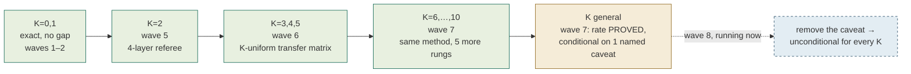
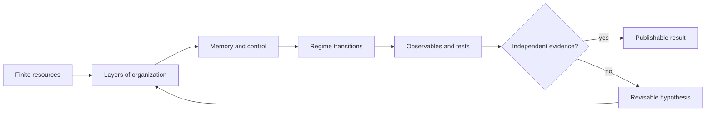
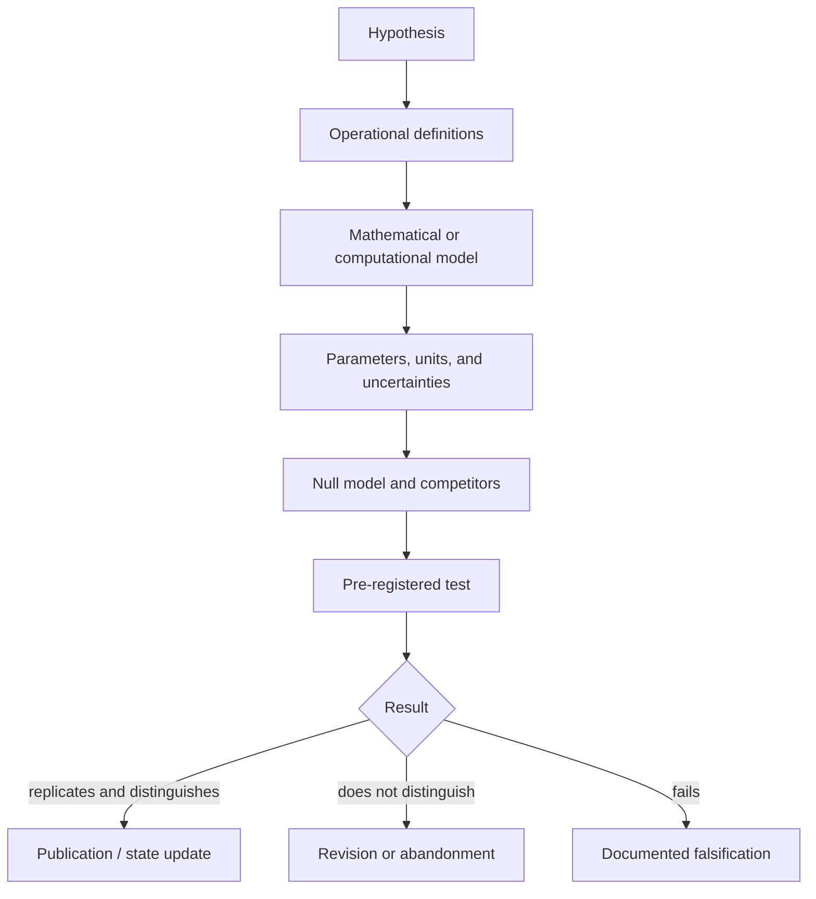

# Tamesis Discovery Lab — Adversarial Research Archive

[](RELATORIO_PROGRESSO_AUDITORIA_ARTIGOS.md)
[](RELATORIO_PROGRESSO_AUDITORIA_ARTIGOS.md)
[](05_DISCOVERY_LAB/01_PORTFOLIO/TEST_QUEUE.yaml)
[](05_DISCOVERY_LAB/00_GOVERNANCE/CLAIM_LEDGER.yaml)
[](05_DISCOVERY_LAB/00_GOVERNANCE/DECISION_LEDGER.yaml)
[%20limit%20law-closed--form%20%C2%B7%20adversarially%20verified-8c5a1f?style=for-the-badge)](tamesis-cycle-survival/)
[](PROJECT_STATE.json)
[](LICENSE)
[](#governance-authorship-and-responsibility)

**Languages:** **English** · [Português (BR)](README_PTBR.md) · [日本語](README_JA.md) · [中文（简体）](README_ZH.md) · [Español](README_ES.md)

> **An interdisciplinary research archive for information, geometry, phase transitions, complex systems, and cognition — with hypotheses kept explicitly separate from evidence.**

This repository preserves the complete trajectory of the Tamesis Laboratory: its current experimental branch, and its historical, mathematical, physical, computational, and cognitive research lines. The archive holds **280 audited records**, organized into **274 audit dossiers**. Auditing here does not turn conjecture into fact — it makes explicit what is a proof, a conditional consequence, a numerical fit, a computational illustration, a conjecture, or a speculative scenario.

Since 2026, the archive has also run a **continuous adjudication laboratory** (`05_DISCOVERY_LAB`): every quantitative claim the archive itself makes is closed out, one at a time, against real external references, under pre-registered criteria and **mandatory adversarial reproduction**. The outcome so far — dozens of catalogued negative closures with a final verdict, and one positive mathematical result independently re-derived and adversarially verified — is synthesized in the **[Discovery Lab paper](index.html)** (the repository's landing page).

## Quick read

The institutional report [Final Vision of the Tamesis Laboratory](RELATORIO_VISAO_FINAL_LABORATORIO_TAMESIS.md) lays out the questions, answers, impacts, applications, and new questions produced by the research program as a whole. A [print-ready HTML/PDF version](RELATORIO_VISAO_FINAL_LABORATORIO_TAMESIS.html) is also available.

### Current scientific state

| Layer | State | Correct interpretation |
|---|---|---|
| Archive and methodology | **Complete / audited** | Inventory, claim classification, sources, and falsification criteria are all on record. |
| Computational models | **Frozen for audit** | Reproducible outputs should be read as model outputs, not measured constants. |
| Tamesis `M_c v1` | **Testable hypothesis** | The value `M_c = 5.292674126388712e-16 kg` is a model parameter, not a measurement. |
| Independent physical evidence | **Not yet established** | Nothing in this archive is experimental confirmation of the Tamesis ontology. |
| Millennium Prize Problems and TOE claims | **Unsolved** | These texts are conjectures, reductions, or restricted-model arguments — not accepted solutions. |
| Core numerical adjudication | **Mathematical consolidation complete, gap closed unconditionally through K=10 (2026-08-22)** | See below — 3 claims closed negative with a final verdict; the 4th (`U₁/₂`) has a proved core, adversarially refereed, with the Open Lemma now proved unconditionally for `K=0,…,10`; for general `K` a conditional proof of the rate conjecture exists (a regularity caveat judged correctly scoped by a hostile referee), not an unconditional closure. |

### The adjudication program (Discovery Lab, updated 2026-08-22)

`05_DISCOVERY_LAB` runs continuous adjudication of this archive's quantitative claims against real external references (PDG, CODATA, Planck, SPARC, Gaia, Odlyzko), with methodology fixed *before* each computation, full provenance for every reference value, and **mandatory adversarial reproduction** for any positive finding. Full record: `05_DISCOVERY_LAB/01_PORTFOLIO/TEST_QUEUE.yaml` and `05_DISCOVERY_LAB/00_GOVERNANCE/DECISION_LEDGER.yaml`. Paper-format synthesis: **[`index.html`](index.html)** (the repository's landing page).


```mermaid
flowchart LR
    R[280 audited<br/>archive records] --> S[Archive-wide<br/>Phase-0 survey<br/>19 candidates, 7 areas]
    S -->|18/19 rejected,<br/>concrete reason cited| N1[CLOSED_NULL]
    S -->|1 immature lead<br/>promoted| L13[13 formal<br/>Discovery Lab<br/>test lines]
    L13 --> C8[8 pre-registered claims<br/>locked + adversarially reviewed]
    C8 --> V1[1 proved positive result<br/>U&#40;1/2&#41; limit law]
    C8 --> V2[7 informative negative<br/>results — REFUTED /<br/>INCONCLUSIVE / NULL]
    style V1 fill:#e8f0e0,stroke:#1f6f5c,stroke-width:2px
    style N1 fill:#f0e5e8,stroke:#7a3b4a
```

**The complete survival funnel (2026):**

| Line | Tested | Outcome |
|---|---|---|
| Cross-domain invariant (TRI-RG) | 16 candidates, 5 rounds | `CLOSED_NULL` — 0 survivors; 4 `p<0.05` findings refuted by adversarial reproduction (mundane explanations demonstrated) |
| SPARC/MOND cosmology + Gaia wide binaries | 4 pre-registered tests | 4/4 inconclusive from demonstrated real confounders; 2 legacy headline results discovered to rest on **fabricated data** and redone with real data |
| Riemann zeta zeros (RH-REAL) | 12/12 survey items, all finally dispositioned | 2 replicated findings (consecutive-gap anti-clustering; `N^(-1/3)` GUE scaling); FHK maxima and number-variance both closed `CLOSED_INCONCLUSIVE`, each with a strong component confirmed adversarially (iid-side exclusion ≥8.8σ; naive-GUE exclusion up to 203σ — adversarial reproduction still found and fixed a 3rd real bug in the primary estimator) |
| Core quantitative claim adjudication (wave 1) | 7 claims | `M_c` inconsistent (~190× between values); quark/knot mass model fails leave-one-out; `sin²θ_W=3/13` off by 7.5σ with hardcoded tuning; `α⁻¹=Ω^{1.03}` with 0 degrees of freedom; bounce `n_s` unidentifiable; holographic `Λ` ≡ `ρ_crit` by algebraic identity |
| **`U₁/₂` limit law (waves 2–7, consolidated)** | 1 theorem + 1 generalization + Open Lemma cases `K=2,…,10` + general-`K` rate conjecture | **Proved, adversarially refereed (3 independent rounds, distinct techniques), published as a paper + reproducible package; `K=2` proved in wave 5, `K=3,4,5` in wave 6, `K=6,…,10` in wave 7, all via transfer-matrix method; general-`K` rate PROVED in wave 7, explicitly conditional on a regularity caveat** (see below) |
| Archive-wide candidate survey (Phase 0, beyond TRI-RG) | 19 candidates, 7 areas | `CLOSED_NULL` — 18/19 rejected with a concrete cited reason; 1 immature lead (cognitive EEG spectral signatures) promoted to a new line, see below |
| Cognition — EEG spectral signature in depression (Mumtaz, `DISC-COGNITIVE-EEG-SPECTRAL-001`) | 1 locked pre-registration, N=30 MDD/26 HC | `CLOSED_REFUTED` — spectral entropy **higher**, not lower, in MDD (`d=1.447`, `p=3.97×10⁻⁶`) — opposite direction to the tested hypothesis, confirmed by an independent from-scratch adversarial reproduction (numbers match to <10⁻⁹) |
| SPARC-004 cosmology — `f_multi` self-calibration (Stage 1→2) | Pipeline validated + applied to real discovery data (30,203 systems) | `CLOSED_INCONCLUSIVE` — mechanical verdict `BOTH_FALSIFIED`, but the mandatory debunker pass found a real confounder: a 19%-of-sample subgroup (high RUWE) is systematically under-corrected by the single-scalar `f_multi` model, with a statistically robust excess even in the calibration's own anchor bin |

### The headline positive result: an exact closed-form universality law

The `U₁/₂` universality class (random permutation perturbed at rate `c/n` toward a random map) has the exact limit law:

<p align="center"></p>

> `φ_∞(c) = ∫₀¹ e^(−ct²) dt = ½·√(π/c)·erf(√c)` — zero free parameters,

derived analytically (not fitted), correcting the archive's original conjecture `(1+c)^(-1/2)` (excluded at the very first series coefficient: `a₁ = 1/3 ≠ 1/2`, confirmed by exact enumeration). This result is now a **proved theorem**, not a conjecture: a self-contained mathematical document (`THEOREM.md`) proves the closed form in six steps, including the correct treatment of the *size-biasing* of visited arcs, and was reviewed by an independent agent acting as a hostile referee — **zero errors found**.

The bridge between the finite model and the limit object is now proved for `K=0,…,10` unconditionally, and the general-`K` rate conjecture is proved conditional on a precisely-named, hostile-referee-scoped regularity hypothesis:


```mermaid
flowchart LR
    K01["K=0,1<br/>exact, no gap<br/>waves 1–2"] --> K2["K=2<br/>wave 5<br/>4-layer referee"]
    K2 --> K345["K=3,4,5<br/>wave 6<br/>K-uniform transfer matrix"]
    K345 --> K610["K=6,…,10<br/>wave 7<br/>same method, 5 more rungs"]
    K610 --> Kgen["K general<br/>wave 7: rate PROVED,<br/>conditional on 1 named caveat"]
    Kgen -.->|"wave 8, running now"| Close["remove the caveat →<br/>unconditional for every K"]
    style K01 fill:#e8f0e0,stroke:#1f6f5c
    style K2 fill:#e8f0e0,stroke:#1f6f5c
    style K345 fill:#e8f0e0,stroke:#1f6f5c
    style K610 fill:#e8f0e0,stroke:#1f6f5c
    style Kgen fill:#f5ecd8,stroke:#96702a
    style Close fill:#e3edf3,stroke:#33566f,stroke-dasharray: 4 4
```

Each rung above was independently re-derived by a separate hostile-referee agent, using a *different* proof technique than the original derivation, its own brute-force enumeration, and full recursion-substitution checks — **zero errors found at any layer**, across 3 independent referee rounds. `K=6,…,10` was additionally confirmed bit-for-bit against fresh exhaustive enumeration at two held-out points. The one remaining **Open Lemma** — proved unconditionally through `K=10`, proved conditionally for general `K` — is the exact fixed-parameter case of Hansen & Jaworski (EJC, 2014); a Poisson mixture with closed-form `erf` was not found in a systematic literature search (35+ queries logged), with the explicit caveat that this does not equal "novel." A second front derived **why the exponent is exactly 1/2**: across an entire parametric family of perturbation mechanisms, `α ∈ [1/2, 1]` always — `α < 1/2` is *proved impossible* (a quadratic clustering effect that persists even without any cyclicity "death"). Wave 5 also located and confirmed a natural mechanism (`M-WEIB(β)`, non-homogeneous Weibull hazard) that reaches every intermediate `α ∈ (1/2, 1)`. No physical implication is claimed — this is pure combinatorial mathematics on a specific ensemble.

**Where to find everything:** the full theorem and referee reports live in `05_DISCOVERY_LAB/02_TESTS/CORE_NUMERICS/u12_universality/theorem/`; the generalization and its adversarial verification in `.../generalization_u_alpha/`; a **standalone reproducible package** — compiled LaTeX paper (PDF), self-contained proofs, clean-room simulations, and 49 automated tests — is at **[`tamesis-cycle-survival/`](tamesis-cycle-survival/)**. And the honest table of **everything this laboratory has tried and did not survive** — so this one positive result is read in the right context — is in **[`FAILED_HYPOTHESES.md`](FAILED_HYPOTHESES.md)**.

An honest survey of the whole Tamesis archive (not restricted to TRI-RG, 19 candidates across 7 areas) closed `CLOSED_NULL` — 18/19 rejected with a concrete cited reason — and promoted the one immature lead found (cognitive EEG spectral signatures, depression vs. anxiety) to a new candidate line. Its operationalization stage is complete (observable defined as normalized Shannon spectral entropy, a named competing model, computed statistical power, verified real data access for the depression arm) — the anxiety arm remains blocked on a data provider requiring human login, honestly reported as such; no real data has been computed there. See `05_DISCOVERY_LAB/02_TESTS/ARCHIVE_PHASE0_SURVEY/SURVEY.md` and `05_DISCOVERY_LAB/02_TESTS/COGNITIVE_EEG_SPECTRAL/OPERATIONALIZATION.md`.

## Laboratory vision

The program investigates whether systems under finite resources can build additional layers of organization when the cost of that complexity is offset by a reduction in error, dissipation, instability, or future search cost. This is a **modeling principle**, not a purpose attributed to nature.

The laboratory connects four levels:

1. **Mathematics:** operators, spectra, topology, graphs, universality, and regularity.
2. **Fundamental physics:** information, geometry, holography, gravity, particles, and quantum-to-classical transitions.
3. **Complex systems:** thermodynamics, memory, irreversibility, networks, stability, and control.
4. **Life and cognition:** the integrated organism, brain-computer interfaces, consciousness, and cognitive ecosystems.


```mermaid
flowchart LR
    A[Finite resources] --> B[Layers of organization]
    B --> C[Memory and control]
    C --> D[Regime transitions]
    D --> E[Observables and tests]
    E --> F{Independent evidence?}
    F -->|yes| G[Publishable result]
    F -->|no| H[Revisable hypothesis]
    H --> B
```


<p align="center"><sub>Figure 1 — Working illustration of the holographic principle. This is a modeling hypothesis, not evidence that the universe is holographic or simulated.</sub></p>

## Start here

- **[Discovery Lab scientific paper (2026) — adversarial adjudication and the `U₁/₂` limit law](index.html)** (repository landing page)
- **[`tamesis-cycle-survival/`](tamesis-cycle-survival/) reproducible package** — compiled LaTeX paper, proofs, simulations, and automated tests for the `U₁/₂` theorem
- **[`FAILED_HYPOTHESES.md`](FAILED_HYPOTHESES.md)** — the honest table of every hypothesis tested and not surviving in this laboratory
- [Final vision report of the laboratory](RELATORIO_VISAO_FINAL_LABORATORIO_TAMESIS.md)
- [HTML version for presentation and PDF](RELATORIO_VISAO_FINAL_LABORATORIO_TAMESIS.html)
- [280-article audit report](RELATORIO_PROGRESSO_AUDITORIA_ARTIGOS.md)
- [Rigorous audit protocol](PROTOCOLO_AUDITORIA_RIGOROSA_DE_ARTIGOS.md)
- [Machine-readable inventory manifest](ARTICLE_MANIFEST.csv)
- [Freeze status and resumption conditions](PROJECT_FREEZE.md)
- [Project state in JSON](PROJECT_STATE.json)
- [Timeline](00_HOME/TIMELINE.md)
- [Archive map](00_HOME/WORKSPACE_MAP.md)
- [Navigable home page](00_HOME/README.md)
- [Interactive hypothesis atlas](atlas.html)
- [Proof dependency map for the `U₁/₂` line](05_DISCOVERY_LAB/02_TESTS/CORE_NUMERICS/u12_universality/PROOF_DEPENDENCY_MAP.md)

## The research lines

| Line | Central question | Current state | Potential applications |
|---|---|---|---|
| **A. Foundations and the architecture of reality** | Can information, geometry, or computation generate spacetime and effective laws? | Conceptual architecture and candidate models. | Quantum gravity, informational geometry, network modeling. |
| **B. Axioms and operational bridges** | Does a small axiom set reproduce observed equations without per-sector tuning? | Partial, conditional closure. | Model derivation, consistency tests, parameter reduction. |
| **C. TDTR, TRI, and irreversibility** | How do regimes change, and why are some transitions irreversible? | Vocabulary, libraries, and transition models. | Thermodynamics, dissipative dynamics, arrows of time. |
| **D. Universality** | Do different systems share invariants and scaling laws? | **Exact limit law of the `U₁/₂` class, derived and adversarially verified (2026-08)**; empirical cross-domain invariant search closed null (16/16). | Transition detection, failure analysis, adaptive control. |
| **E. Spectra and Riemann** | Does an operator exist whose spectrum realizes the zeta zeros? | Legitimate mathematical route; no proof of the Riemann Hypothesis. | Spectral theory, quantum chaos, numerical analysis. |
| **F. Computation, graphs, and primes** | Can arithmetic structures be encoded in graphs and computational systems? | Exploratory algorithms and correspondences. | Graph learning, network analysis, spectral algorithms. |
| **G. Observational cosmology** | What observable distinguishes Tamesis from `ΛCDM`, MOND, and competing models? | Test catalog; no demonstrated empirical replacement. | CMB, BAO, supernovae, lensing, SPARC, gravitational waves. |
| **H. Black holes and singularities** | How do information and geometry handle horizons and singularities? | Speculative thermodynamic/holographic models. | Quantum information, gravity, horizon thermodynamics. |
| **I. Particles and topology** | Can topology explain masses, families, mixing, and couplings? | Candidate mechanisms and numerical relations. | Particle phenomenology and precision tests. |
| **J. Quantum-to-classical limit** | When and why does quantum dynamics become classical? | Competing hypotheses and experimental designs. | Interferometry, optomechanics, quantum metrology. |
| **K. Cognitive ecosystems** | How do organisms build control, memory, and consciousness profiles? | Conceptual agenda and empirical program. | Network neuroscience, physiology, brain-computer interfaces. |
| **L. Cognitive topology and hybrid cybernetics** | Can cognitive states be classified by relational/spectral invariants? | Theoretical structure and control prototypes. | Human-machine systems and embodied robotics. |
| **M. Stability and operators** | Do coercivity, dissipation, and spectral margins detect pathological regimes? | Candidate methods and restricted theorems. | Infrastructure control, anomaly detection, adaptive networks. |
| **N. Millennium Prize Problems** | Can finite capacity imply theorems about `P vs NP`, RH, or PDEs? | No accepted solution; restricted arguments. | New mathematical lemmas, not resolution claims. |
| **O. Speculative cosmologies and metric engineering** | Do bounces, parent universes, or modified metrics produce observables? | Speculative scenarios. | Only after a covariant, stable, causal solution. |
| **P. Scientific infrastructure** | How to keep interdisciplinary research reproducible and honest? | Traceable inventory and audit. | Governance, review, preprints, external collaboration. |

### Completion potential per line (operational estimate, not an archive metric)

The table below estimates, line by line, **how much of the gap named in each central question has already been characterized** — not the probability that the hypothesis is correct, nor a metric computed by the laboratory. It is an external reading, calibrated against the real state documented for each line (`RELATORIO_VISAO_FINAL_LABORATORIO_TAMESIS.md` §6 and `05_DISCOVERY_LAB/`), with one important correction to the original inventory: **Line D must be read in two parts.** The `U₁/₂` subset, rigorously adjudicated by the Discovery Lab, is well advanced; but Line D as a whole — which in the original report also includes `U₀`, `U₂`/Lindblad, the general class atlas, and topological applications — has **not** advanced in the same proportion: the laboratory's own archive-wide survey (`DISC-ARCHIVE-PHASE0-SURVEY-001`) records that `U₀` and `U₂`, unlike `U₁/₂`, never reached a closed-form candidate. Treating "Line D" as 85% resolved would be exactly the kind of conflation this archive's discipline exists to prevent.

| Rank | Line | Estimated completion | Status | To close |
|---:|---|---:|---|---|
| 🥇 | **D — `U₁/₂`** (adjudicated subset, `DISC-CORE-NUMERICS-001`) | **~85%** | 🔥 Active — Open Lemma proved unconditionally for `K=0,…,10`, general-`K` rate proved conditionally | Close the general-`K` regularity caveat **and** the M-CLUST residual — the two fronts running now (see [dependency map](05_DISCOVERY_LAB/02_TESTS/CORE_NUMERICS/u12_universality/PROOF_DEPENDENCY_MAP.md)) |
| 🥈 | **P — Infrastructure** | **~90%** | 🔧 Ongoing — since Jul/2026 gained a second layer: pre-registration + mandatory adversarial reproduction + decision/claim ledgers (`05_DISCOVERY_LAB/00_GOVERNANCE/`) | Semantic versioning, open data/code, external review |
| 🥉 | **B — Axioms** | 35% | 🟡 Promising | Prove that the bridges preserve symmetries/conservation without per-sector tuning |
| 4 | **E — Riemann** | 30% | 🟡 Exploratory — since Jul/2026, all 12 items of the `RH-REAL` survey finally dispositioned; 2 replicated findings (anti-clustering; GUE scaling), none about RH itself | Self-adjoint operator whose spectrum realizes the zeros, with full error control |
| 5 | **M — Stability** | 30% | 🟡 Exploratory | Small theorem, complete hypotheses, benchmark against Lyapunov/LQR |
| 6 | **C — Irreversibility** | 25% | 🟡 | A non-trivial monotone + a testable transition class |
| 7 | **F — Graphs/primes** | 25% | 🟡 | Benchmarks and formal correspondence theorems |
| 8 | **J — Quantum-classical** | 25% | 🟡 | A blind protocol separating decoherence, collapse, and gravity |
| 9 | **L — Cognitive topology** | 25% | 🟡 | Defined invariant + inter-rater reliability + independent data |
| 10 | **A — Foundations** | 20% | ⚪ | A minimal action with degrees of freedom, units, and a new prediction |
| 11 | **G — Cosmology** | 20% | ⚪ — since Jul/2026, 4 pre-registered tests **executed** on real data (SPARC-001…004), all `CLOSED_INCONCLUSIVE`; an honest RUWE-confounder finding, not just a pending test catalog | An observable that distinguishes Tamesis from `ΛCDM`/MOND and survives out-of-sample |
| 12 | **I — Particles** | 20% | ⚪ | A complete gauge action + renormalization + unitarity + a collider prediction |
| 13 | **H — Black holes** | 15% | ⚪ | Metric/stress-energy tensor + causality + a horizon observable |
| 14 | **K — Cognition** | 15% | ⚪ — since Jul/2026, one concrete hypothesis tested and adversarially **refuted** (`DISC-COGNITIVE-EEG-SPECTRAL-001`: EEG spectral entropy in depression, real effect in the opposite direction to that predicted); the broad question (control/memory/consciousness) still lacks a single model | Reduce to one measurable phenomenon with a reproducible prediction |
| 15 | **O — Speculative cosmologies** | 10% | ⚪ | A consistent covariant solution before any observable |
| 16 | **N — Millennium** | 5% | 🔴 — no solution; this line is permanently out of scope for resolution claims | A complete, verifiable theorem for the original problem, not a restricted heuristic |

**How not to use this table.** An "85%" does not mean an 85% chance that the `U₁/₂` class is correct, nor that Line D is close to done — it means that, of the gaps explicitly named in that specific question, most have already been proved or precisely characterized. If the criterion is "where to put research effort now," the answer is the one already guiding the laboratory: most of the available research capacity goes to `D — U₁/₂`, split exactly between the two fronts already running — closing the M-CLUST residual and removing the general-`K` regularity caveat.

## A verifiable research cycle


```mermaid
flowchart TD
    A[Hypothesis] --> B[Operational definitions]
    B --> C[Mathematical or computational model]
    C --> D[Parameters, units, and uncertainties]
    D --> E[Null model and competitors]
    E --> F[Pre-registered test]
    F --> G{Result}
    G -->|replicates and distinguishes| H[Publication / state update]
    G -->|does not distinguish| I[Revision or abandonment]
    G -->|fails| J[Documented falsification]
```

This cycle is the archive's editorial rule. A simulation that reproduces a curve is not automatically a discovery; a numerical coincidence is not a derivation; and an analogy between systems is not a physical identity.

## Current experimental core: `Tamesis M_c v1`

The current experimental branch is frozen at `frozen_and_ready`, with hardware qualification not yet started. Demonstrator A begins with blind optical thermometry calibration between 5 K and 20 K; it **does not yet measure `M_c`**.

- [`Tamesis M_c v1` README](01_TAMESIS_CORE/02_Experimental_Validation/Quantum_Classical_Transition/tamesis_mc_v1/README.md)
- [Demonstrator A v0.6 execution report](01_TAMESIS_CORE/02_Experimental_Validation/Quantum_Classical_Transition/tamesis_mc_v1/reports/DEMONSTRATOR_A_V0_6_EXECUTION_REPORT.md)
- [Visual outputs, figures, and animations](02_TAMESIS_MC_V1_OUTPUTS/README.md)
- [Experimental collaboration package](03_EXPERIMENTAL_COLLABORATION_PACKAGE/README.md)


<p align="center"><sub>Figure 2 — Limit map used as a testing guide. Regions and markers represent hypotheses and reference data; they do not constitute confirmation of a universal boundary.</sub></p>

## Complex systems and transitions


<p align="center"><sub>Figure 3 — Conceptual visualization of compression, saturation, and reorganization. This is a model illustration, not a general empirical law.</sub></p>

The laboratory uses a common language to compare systems: **state, resources, couplings, memory, transition, dissipation, stability, observable, and failure criterion**. The comparison is methodological — it does not claim that a galaxy, a cell, a graph, and a brain are the same kind of object.

## What the laboratory has already achieved

- a complete, traceable inventory and audit of 280 records;
- an explicit separation between proof, hypothesis, model, fit, simulation, and speculative scenario;
- an atlas of regimes, transitions, operators, networks, and cognitive systems;
- a catalog of observational and experimental tests with null models;
- an institutional HTML/PDF version for academic presentation;
- preservation of historical versions without endorsing their claims as current results;
- **complete adversarial adjudication of the core's quantitative claims** (2026): 30+ claims closed under pre-registered criteria, including the detection and correction of 2 legacy headline results built on fabricated data;
- **one new mathematical result, derived and adversarially verified**: the exact closed-form limit law `φ_∞(c) = ½√(π/c)·erf(√c)` of the `U₁/₂` class (see the [paper](index.html));
- two replicated findings about the real zeros of the Riemann zeta function (consecutive-gap anti-clustering; minimum-gap GUE scaling).

## What has not yet been demonstrated

The archive **does not claim** to have solved the Riemann Hypothesis, `P vs NP`, Navier–Stokes, Yang–Mills, Hodge, or Birch–Swinnerton-Dyer. There is likewise no accepted demonstration that Tamesis replaces `ΛCDM`, eliminates dark matter/dark energy, gives consciousness a causal role in quantum collapse, enables metric propulsion, or proves the universe is a simulation.

These lines remain conjectures, test programs, or restricted models until they produce formal proofs, independent data, new predictions, and replication.

## Repository structure

| Folder/file | Function |
|---|---|
| `00_HOME` | Orientation, timeline, and archive map. |
| `01_TAMESIS_CORE` | Core theory, models, assets, and current experimental validation. |
| `02_TAMESIS_MC_V1_OUTPUTS` | Convenient copies of `M_c v1` branch figures and animations. |
| `03_EXPERIMENTAL_COLLABORATION_PACKAGE` | Materials for experimental collaboration and qualification. |
| `05_DISCOVERY_LAB` | Adjudication laboratory: test queue, governance ledgers, methodology notes, results, and adversarial verdicts. |
| `index.html` | **Synthesis paper of the adjudication program** (landing page; figures and generator script in `ARTIGO_DISCOVERY_LAB/figures/`). |
| `tamesis-cycle-survival` | Standalone reproducible package for the `U₁/₂` theorem — compiled LaTeX paper, proofs, clean-room simulations, and automated tests. |
| `FAILED_HYPOTHESES.md` | Complete, honest table of every hypothesis/candidate the Discovery Lab has tested, surviving or not. |
| `computational_freeze.html` | Previous root landing page (Tamesis `M_c v1` frozen state), preserved. |
| `90_LEGACY` | Historical, superseded, speculative, or currently unsupported branches. |
| `RECURSOS_PARA_PESQUISA` | Reference materials; not evidence produced by the project. |
| `publicar` / `publicados` | Editorial organization of articles intended for and already published. |
| `ARTICLE_MANIFEST.csv` | Machine-readable inventory of articles. |
| `RELATORIO_PROGRESSO_AUDITORIA_ARTIGOS.md` | Article-by-article audit tracking. |
| `RELATORIO_VISAO_FINAL_LABORATORIO_TAMESIS.html` | PDF-ready institutional document. |

## Governance, authorship, and responsibility

**Scientific direction, primary authorship, and curation of this archive:** **Douglas H. M. Fulber**.

The Tamesis Laboratory is run as an independent research program within this repository. Mentions of universities, laboratories, authors, or DOIs in historical documents do not imply institutional endorsement, co-authorship, or external validation unless explicit authorization and record exist.

Editorial governance follows these rules:

1. the responsible maintainer controls status classification, line organization, and acceptance of structural changes;
2. external contributions are welcome but do not alter authorship, provenance, or evidence status without a recorded review;
3. new results must include method, data/code where applicable, uncertainties, a null model, limitations, and a falsification criterion;
4. legacy documents remain for provenance and are not automatically promoted to valid results;
5. any derived publication must cite the laboratory, the author/curator, and the specific archive version used.

To propose a collaboration or correction, open an issue/patch documenting: affected file, justification, sources, impact on classification, and a verification test.

## License and attribution

Original material in this archive is available under [Creative Commons Attribution 4.0 International (CC BY 4.0)](LICENSE), unless stated otherwise in the file itself or subject to third-party rights. The license allows sharing and adapting the material as long as attribution is preserved and modifications are indicated.

Recommended attribution form:

> Douglas H. M. Fulber, Tamesis Laboratory — *Tamesis Research Archive*, version/commit used, licensed under CC BY 4.0: [repository](.).

When reusing a figure, preserve the caption, the asset path, and the indication that it is a model visualization when that is its recorded classification. Third-party images, data, or text may be subject to their own conditions; CC BY 4.0 does not transfer rights the laboratory does not hold.

## Integrity and limits of use

- Do not present archive conjectures as established facts.
- Do not use the presence of a DOI as proof of peer review or experimental validation.
- Do not attribute institutional endorsement to universities or groups cited without formal authorization.
- Do not hide limitations, fitted parameters, negative results, or failure conditions.
- Do not use this material for medical, legal, financial, or safety advice without independent professional evaluation.

## How to cite this archive

```text
Fulber, Douglas H. M. (2026). Tamesis Research Archive: Tamesis Laboratory — vision, audit, and research program. CC BY 4.0.
```

## Contact and collaboration

The recommended entry point is a documented issue in this repository. For academic presentation, use the [institutional HTML/PDF report](RELATORIO_VISAO_FINAL_LABORATORIO_TAMESIS.html) and the [full Markdown report](RELATORIO_VISAO_FINAL_LABORATORIO_TAMESIS.md), always preserving the indicated evidence classification.
