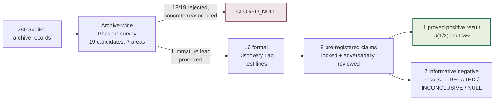
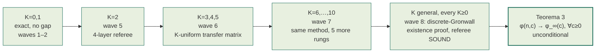
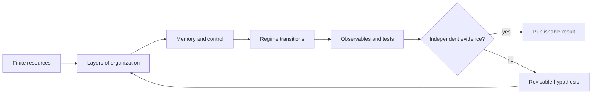
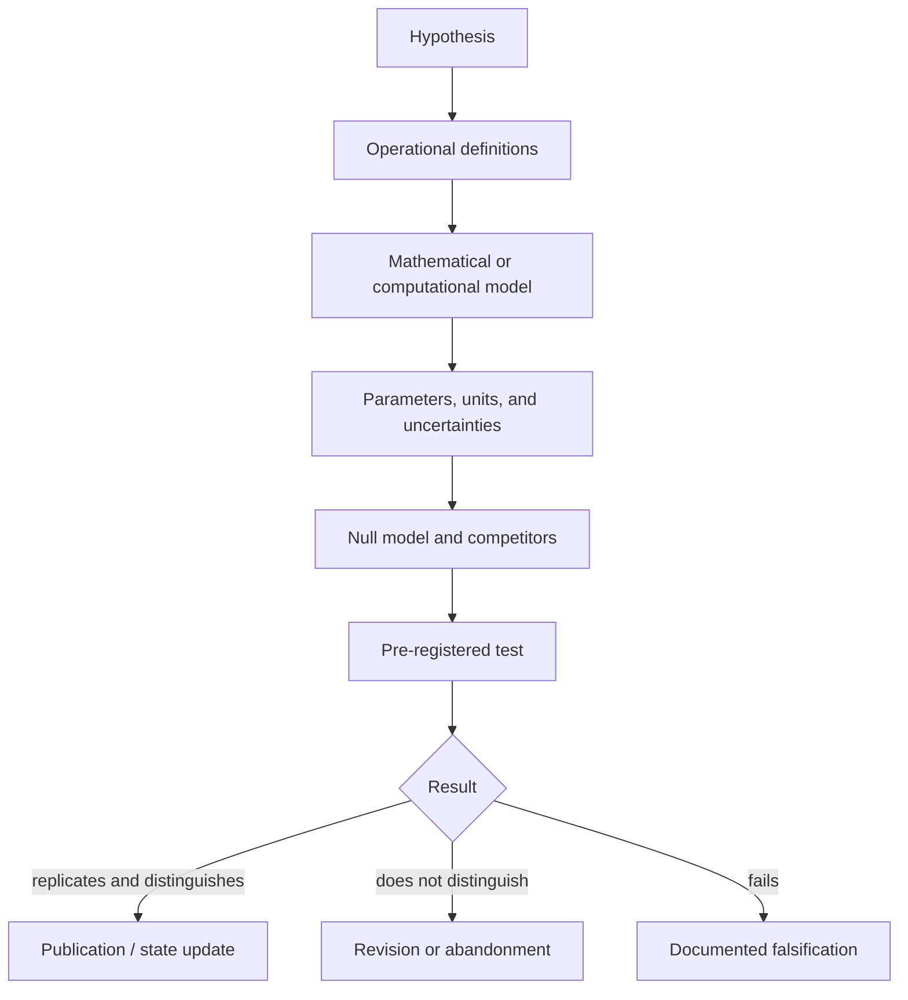

# Tamesis Discovery Lab — Adversarial Research Archive

[](RELATORIO_PROGRESSO_AUDITORIA_ARTIGOS.md)
[](RELATORIO_PROGRESSO_AUDITORIA_ARTIGOS.md)
[](05_DISCOVERY_LAB/01_PORTFOLIO/TEST_QUEUE.yaml)
[](05_DISCOVERY_LAB/00_GOVERNANCE/CLAIM_LEDGER.yaml)
[](05_DISCOVERY_LAB/00_GOVERNANCE/DECISION_LEDGER.yaml)
[%20limit%20law-closed--form%20%C2%B7%20unconditional%20%C2%B7%20adversarially%20verified-8c5a1f?style=for-the-badge)](tamesis-cycle-survival/)
[](PROJECT_STATE.json)
[](LICENSE)
[](#governance-authorship-and-responsibility)

**Languages:** **English** · [Português (BR)](README_PTBR.md) · [日本語](README_JA.md) · [中文（简体）](README_ZH.md) · [Español](README_ES.md)

> **An interdisciplinary research archive for information, geometry, phase transitions, complex systems, and cognition — with hypotheses kept explicitly separate from evidence.**

This repository preserves the complete trajectory of the Tamesis Laboratory: its current experimental branch, and its historical, mathematical, physical, computational, and cognitive research lines. The archive holds **280 audited records**, organized into **274 audit dossiers**. Auditing here does not turn conjecture into fact — it makes explicit what is a proof, a conditional consequence, a numerical fit, a computational illustration, a conjecture, or a speculative scenario.

Since 2026, the archive has also run a **continuous adjudication laboratory** (`05_DISCOVERY_LAB`): every quantitative claim the archive itself makes is closed out, one at a time, against real external references, under pre-registered criteria and **mandatory adversarial reproduction**. The outcome so far — dozens of catalogued negative closures with a final verdict, and one positive mathematical result independently re-derived and adversarially verified — is synthesized in the **[Discovery Lab paper](index.html)** (the repository's landing page).

<p align="center"></p>

## Roadmap: from research archive to discovery infrastructure

**[`ROADMAP.md`](ROADMAP.md)** lays out a proposed — not committed, not built — future direction: packaging this archive's actual strongest asset (the pre-registration → adversarial-review → decision-ledger methodology that produced the `U₁/₂` result below) as reusable discovery infrastructure, with `U₁/₂` kept permanently as its required first benchmark. Five staged milestones, from a 5-module MVP through a full product suite to a unified architecture; explicit non-goals carried over from this archive's own anti-overclaiming discipline. Read it as a prioritization argument, not a claim about what exists today.

## Discovery Engine: the roadmap's Stage 1–3a, built and tested

**[`06_DISCOVERY_ENGINE/`](06_DISCOVERY_ENGINE/README.md)** turns the first three stages of `ROADMAP.md` into real, tested Python code: 12 modules across Stage 1 (Hypothesis Registry, Experiment Runner, Reproduction Engine, Adversarial Reviewer, Decision Ledger), Stage 2 (Symbolic Mathematics, Monte Carlo Lab, Dataset Observatory, a Lean4 formal-proof bridge, Universality Atlas), and Stage 3a (Hypothesis Engine, Mathematical Discovery Engine) — the two of Stage 3's eight named products that were tractable to build honestly as backend modules.

What makes this credible rather than a marketing claim: 220/220 tests pass across the three stages, each one closed out by a dedicated hostile-review pass from an agent that did not write the code, then independently re-verified a third time by the orchestrating session itself. The required acceptance benchmark reproduces this archive's own proved `U₁/₂` result end-to-end — `φ_∞(c)`, the `M_K` distribution, the finite-`n` correction, and the `γ=c/n` scaling regime — from an independent implementation with no import from `05_DISCOVERY_LAB` and no hand-holding. Hostile review earned its keep rather than rubber-stamping: it caught a real tail-tamper gap in the Stage 1 ledger's hash chain (the newest entry had no successor to protect it) and a false "impossible to bypass" claim in the Stage 3a Hypothesis Engine's own documentation — both corrected openly, with the same dated `correção` discipline this archive applies to its own mathematical mistakes, not silently patched.

Three pieces are explicitly **not** built, catalogued as deferred rather than faked: the Simulation Lab (a real visual agent-based/network simulation environment is a GUI undertaking no test suite can validate the way the modules above were validated); the Observatory's live external-data-feed capability (needs network access and API credentials this build should not assume); and Stage 4's unified "Tamesis OS" architecture (blocked on an infrastructure-stack decision — `ROADMAP.md` itself calls its candidate stack "unevaluated... none of this is committed" — not on remaining effort). This is software-correctness work, not a new mathematical or physical claim: it does not enter `05_DISCOVERY_LAB`'s governance ledger or count toward any Millennium Prize claim. Full detail: **[`06_DISCOVERY_ENGINE/README.md`](06_DISCOVERY_ENGINE/README.md)** and **[`GOAL.md`](GOAL.md)**.

## Quick read

The institutional report [Final Vision of the Tamesis Laboratory](RELATORIO_VISAO_FINAL_LABORATORIO_TAMESIS.md) lays out the questions, answers, impacts, applications, and new questions produced by the research program as a whole. A [print-ready HTML/PDF version](RELATORIO_VISAO_FINAL_LABORATORIO_TAMESIS.html) is also available.

### Current scientific state

| Layer | State | Correct interpretation |
|---|---|---|
| Archive and methodology | **Complete / audited** | Inventory, claim classification, sources, and falsification criteria are all on record. |
| Computational models | **Frozen for audit** | Reproducible outputs should be read as model outputs, not measured constants. |
| Tamesis `M_c v1` | **Testable hypothesis** | The value `M_c = 5.292674126388712e-16 kg` is a model parameter, not a measurement. |
| Independent physical evidence | **Not yet established** | Nothing in this archive is experimental confirmation of the Tamesis ontology. |
| Millennium Prize Problems and TOE claims | **Unsolved** | These texts are conjectures, reductions, or restricted-model arguments — not accepted solutions. |
| Core numerical adjudication | **Mathematical consolidation complete — Conjectures 1 and 2 now proved for every `K` (2026-08-26)** | See below — 3 claims closed negative with a final verdict; the 4th (`U₁/₂`) has a proved core, adversarially refereed many independent times, with the Open Lemma and rate conjecture proved unconditionally for every `K≥0` (2026-08-22), the sharp rate constant `a*` proved and assembled into an explicit finite-`n` bound (2026-08-25), the `γ=c/n` scaling law proved for every `γ∈(0,1]` (2026-08-26), and Conjectures 1 and 2 — the full distributional law and its Poisson mixture — both now proved for **every** `K≥1`, not a finite list of instances (2026-08-26). |

### The adjudication program (Discovery Lab, updated 2026-08-28)

`05_DISCOVERY_LAB` runs continuous adjudication of this archive's quantitative claims against real external references (PDG, CODATA, Planck, SPARC, Gaia, Odlyzko), with methodology fixed *before* each computation, full provenance for every reference value, and **mandatory adversarial reproduction** for any positive finding. Full record: `05_DISCOVERY_LAB/01_PORTFOLIO/TEST_QUEUE.yaml` and `05_DISCOVERY_LAB/00_GOVERNANCE/DECISION_LEDGER.yaml`. Paper-format synthesis: **[`index.html`](index.html)** (the repository's landing page).


```mermaid
flowchart LR
    R[280 audited<br/>archive records] --> S[Archive-wide<br/>Phase-0 survey<br/>19 candidates, 7 areas]
    S -->|18/19 rejected,<br/>concrete reason cited| N1[CLOSED_NULL]
    S -->|1 immature lead<br/>promoted| L13[16 formal<br/>Discovery Lab<br/>test lines]
    L13 --> C8[8 pre-registered claims<br/>locked + adversarially reviewed]
    C8 --> V1["1 proved positive result<br/>U(1/2) limit law"]
    C8 --> V2[7 informative negative<br/>results — REFUTED /<br/>INCONCLUSIVE / NULL]
    style V1 fill:#e8f0e0,stroke:#1f6f5c,stroke-width:2px
    style N1 fill:#f0e5e8,stroke:#7a3b4a
```

**The complete survival funnel (2026):**

| Line | Tested | Outcome |
|---|---|---|
| Cross-domain invariant (TRI-RG) | 16 candidates, 5 rounds | `CLOSED_NULL` — 0 survivors; 4 `p<0.05` findings refuted by adversarial reproduction (mundane explanations demonstrated) |
| SPARC/MOND cosmology + Gaia wide binaries | 4 pre-registered tests | 4/4 inconclusive from demonstrated real confounders; 2 legacy headline results discovered to rest on **fabricated data** and redone with real data |
| Riemann zeta zeros (RH-REAL) | 12/12 survey items, all finally dispositioned | 2 replicated findings (consecutive-gap anti-clustering; `N^(-1/3)` GUE scaling); FHK maxima and number-variance both closed `CLOSED_INCONCLUSIVE`, each with a strong component confirmed adversarially (iid-side exclusion ≥8.8σ; naive-GUE exclusion up to 203σ — adversarial reproduction still found and fixed a 3rd real bug in the primary estimator) |
| Core quantitative claim adjudication (wave 1) | 7 claims | `M_c` inconsistent (~190× between values); quark/knot mass model fails leave-one-out; `sin²θ_W=3/13` off by 7.5σ with hardcoded tuning; `α⁻¹=Ω^{1.03}` with 0 degrees of freedom; bounce `n_s` unidentifiable; holographic `Λ` ≡ `ρ_crit` by algebraic identity |
| **`U₁/₂` limit law (waves 2–17, consolidated)** | 1 theorem + 1 generalization + Open Lemma (every `K≥0`) + Conjectures 1 and 2 (every `K≥1`) + sharp rate + `γ`-scaling law | **Proved, adversarially refereed (many independent rounds, distinct techniques each time), published as a paper + reproducible package; Open Lemma and rate conjecture PROVED unconditionally for every `K` (wave 8, 2026-08-22); Conjecture 1's full density `f_{M_K}(x)=2Kx(1-x²)^{K-1}` and its Poisson-mixture Conjecture 2 both now PROVED for every `K≥1` at once (wave 17, 2026-08-26), after per-`K` closures at `K=2,3,4` (waves 14–16); the sharp rate constant `a*` PROVED and assembled into an explicit finite-`n` bound (wave 17, 2026-08-25); the `γ=c/n` scaling law PROVED for every `γ∈(0,1]` (wave 17, 2026-08-26)** (see below) |
| Archive-wide candidate survey (Phase 0, beyond TRI-RG) | 19 candidates, 7 areas | `CLOSED_NULL` — 18/19 rejected with a concrete cited reason; 1 immature lead (cognitive EEG spectral signatures) promoted to a new line, see below |
| Cognition — EEG spectral signature in depression (Mumtaz, `DISC-COGNITIVE-EEG-SPECTRAL-001`) | 1 locked pre-registration, N=30 MDD/26 HC | `CLOSED_REFUTED` — spectral entropy **higher**, not lower, in MDD (`d=1.447`, `p=3.97×10⁻⁶`) — opposite direction to the tested hypothesis, confirmed by an independent from-scratch adversarial reproduction (numbers match to <10⁻⁹) |
| SPARC-004 cosmology — `f_multi` self-calibration (Stage 1→2) | Pipeline validated + applied to real discovery data (30,203 systems) | `CLOSED_INCONCLUSIVE` — mechanical verdict `BOTH_FALSIFIED`, but the mandatory debunker pass found a real confounder: a 19%-of-sample subgroup (high RUWE) is systematically under-corrected by the single-scalar `f_multi` model, with a statistically robust excess even in the calibration's own anchor bin |
| Schumann resonance spectral peak (`DISC-SCHUMANN-RESONANCE-001`) | Real ELF magnetometer data, Sierra Nevada station (Zenodo), 3 days × 2 channels, 6/6 cases | `NÃO DISTINGUE` — a genuine broad spectral hump exists at the expected location (7.8–8.0 Hz) in every case, but prominence (1.22×–1.44×) falls short of the pre-registered 3× threshold; bit-for-bit adversarial reproduction, no neural-connection claim made or possible |
| IIT/Φ reproducibility — canonical ABC network (`DISC-IIT-PHI-REPRO-001`) | PyPhi reproduction of Oizumi, Albantakis & Tononi (2014) Figure 4 network | `CONFIRMED` — Φ=1.916666 vs. published 1.916665, bit-identical to 16 significant digits across two fully independent installations; a reproducibility check of a defined metric, not a test of any consciousness claim |
| Free Energy Principle — falsifiable-target survey (`DISC-FEP-PREDICTIVE-CODING-001`) | Phase-0 literature survey, 4 candidates examined to primary-source depth | `CLOSED_OUT_OF_DOMAIN` — no target satisfying all three requirements (closed-form prediction, named external competitor, public dataset) was found; one paper under review concedes in its own text that the principle "can arguably describe any observed biological data" |
| Non-classical logic in Lean4 — Priest's LP (paraconsistent) | 6 files, 876 lines, 12 meta-theorems, `lake build` clean | Explosion, modus ponens, and disjunctive syllogism proved **invalid** under LP (paraconsistency's central result); classical-recapture collapse theorem proved as a genuine two-way `iff`; adversarially reviewed, one documentation-only correction applied |

These four lines open a companion program applying the same discipline to claims from philosophy of mind, cognitive science, geophysics, and formal logic — see **[`PROGRAMA_CONSCIENCIA_LOGICA_E_REALIDADE.md`](PROGRAMA_CONSCIENCIA_LOGICA_E_REALIDADE.md)** for the full item-by-item mapping, including what was deliberately excluded as non-falsifiable (panpsychism as fact, "God as thermodynamic equilibrium," the Simulation Argument as a testable proposition, and others) and why.

### The headline positive result: an exact closed-form universality law

The `U₁/₂` universality class (random permutation perturbed at rate `c/n` toward a random map) has the exact limit law:

<p align="center"></p>

> `φ_∞(c) = ∫₀¹ e^(−ct²) dt = ½·√(π/c)·erf(√c)` — zero free parameters,

derived analytically (not fitted), correcting the archive's original conjecture `(1+c)^(-1/2)` (excluded at the very first series coefficient: `a₁ = 1/3 ≠ 1/2`, confirmed by exact enumeration). This result is now a **proved theorem**, not a conjecture: a self-contained mathematical document (`THEOREM.md`) proves the closed form in six steps, including the correct treatment of the *size-biasing* of visited arcs, and was reviewed by an independent agent acting as a hostile referee — **zero errors found**.

The bridge between the finite model and the limit object is now proved **unconditionally for every `K≥0`** — `φ(n,c) → φ_∞(c)` as `n → ∞`, for every fixed `c ≥ 0`, with no unproved hypothesis remaining (`THEOREM.md`, "Teorema 3"):


```mermaid
flowchart LR
    K01["K=0,1<br/>exact, no gap<br/>waves 1–2"] --> K2["K=2<br/>wave 5<br/>4-layer referee"]
    K2 --> K345["K=3,4,5<br/>wave 6<br/>K-uniform transfer matrix"]
    K345 --> K610["K=6,…,10<br/>wave 7<br/>same method, 5 more rungs"]
    K610 --> Kgen["K general, every K≥0<br/>wave 8: discrete-Gronwall<br/>existence proof, referee SOUND"]
    Kgen --> Teo3["Teorema 3<br/>φ(n,c) → φ_∞(c), ∀c≥0<br/>unconditional"]
    style K01 fill:#e8f0e0,stroke:#1f6f5c
    style K2 fill:#e8f0e0,stroke:#1f6f5c
    style K345 fill:#e8f0e0,stroke:#1f6f5c
    style K610 fill:#e8f0e0,stroke:#1f6f5c
    style Kgen fill:#e8f0e0,stroke:#1f6f5c
    style Teo3 fill:#e8f0e0,stroke:#1f6f5c,stroke-width:2px
```

Each rung above was independently re-derived by a separate hostile-referee agent, using a *different* proof technique than the original derivation, its own brute-force enumeration, and full recursion-substitution checks — **zero errors found at any layer**, across 4 independent referee rounds. `K=6,…,10` was additionally confirmed bit-for-bit against fresh exhaustive enumeration at two held-out points. The final rung closed the one remaining named gap: a hostile referee independently re-derived, from scratch, an exact discrete-Gronwall induction proving the finite-`n` two-term expansion exists for *every* `K`, not just the 11 concretely-checked values — verdict **SOUND, with named issues** (four found, none fatal, corrected via dated addenda). The **Open Lemma** — now proved unconditionally for every `K` — is the exact fixed-parameter case of Hansen & Jaworski (EJC, 2014); a Poisson mixture with closed-form `erf` was not found in a systematic literature search (35+ queries logged), with the explicit caveat that this does not equal "novel." A second front derived **why the exponent is exactly 1/2**: across an entire parametric family of perturbation mechanisms, `α ∈ [1/2, 1]` always — `α < 1/2` is *proved impossible* (a quadratic clustering effect that persists even without any cyclicity "death"). Wave 5 also located and confirmed a natural mechanism (`M-WEIB(β)`, non-homogeneous Weibull hazard) that reaches every intermediate `α ∈ (1/2, 1)`. No physical implication is claimed — this is pure combinatorial mathematics on a specific ensemble.

**The all-orders closed form (2026-08-23).** Every rung above — `K=0,…,10`, the general-`K` bridge, the finite-`n` error constants — is now a corollary of a single exact formula. Extending the same asymptotic-expansion technique to a *symbolic* order index revealed that the coefficients at every order are exactly the unsigned Stirling numbers of the first kind, and because those are precisely the coefficients of a rising factorial, the entire infinite expansion resums — not asymptotically, but exactly and finitely (it terminates after `K+1` terms). The result is one finite, fully explicit expression for the underlying recursion at every `n`, `K`, and offset parameter, with an independent elementary proof that needs none of the expansion machinery at all. A dedicated hostile-referee pass re-derived both proofs from scratch against its own from-scratch simulator (215,070 exact checks, zero mismatches), confirmed the headline claim, and caught one real error in a secondary negative claim (corrected via a dated addendum) plus two conservative labels the original document had deliberately left unproved, both of which the referee proved outright. See `THEOREM.md`, "Estágio 9".

**Uniform convergence on the entire parameter range (2026-08-23).** The theorem above only says `φ(n,c) → φ_∞(c)` for each fixed `c`, one at a time. A separate front closed that gap more thoroughly than asked: the convergence is uniform not just on compact ranges `[0,C]` but on the *entire* half-line `[0,∞)`, both proved unconditionally from two short elementary lemmas — a Lipschitz coupling and a uniform-in-`n` tail bound — that need none of the machinery above. The exact first-order error profile was derived in closed form as a bonus. A hostile-referee pass attacked the two new lemmas and the two unconditional theorems hardest and found no error in either; its one substantive finding corrected which specific gap remained open in a secondary, already-conditional result, making the archive's own account of that gap more accurate rather than less. See `THEOREM.md`, "Estágio 10".

**Conjecture 1 — the full distributional law, now proved for EVERY `K≥1` (2026-08-26).** Beyond the mean `φ_∞(c)` above, the archive conjectures the *entire density* of the cyclic mass conditional on exactly `K` reroutes: `f_{M_K}(x) = 2Kx(1-x²)^(K-1)`. `K=2` closed in wave 14; `K=3` closed unexpectedly in wave 15; `K=4` closed in wave 16 — each a consecutive surprise against a combinatorial-explosion diagnosis, with the weighted-forest identity `E(E+Q)^{n−1}=E` behind the off-cycle cancellation named as the candidate route for a general argument. Wave 17 front (a) took that route the rest of the way: every per-`K` ingredient of the `K=1..4` line — the labeled-spacings lemma, the telescoping peel, the destination-mechanism formula, and the weighted-forest identity itself — was generalized to symbolic `K`, closing **Conjecture 1 for every `K≥1` at once**, conditional to the same single classical citation (`PD(1)` size-biasing/residual property) the whole line already relies on, applied recursively up to `K−1` times per fixed `K`. As a corollary, **Conjecture 2** (the full unconditional law, `M(c) =_d min(1,√(E/c))`) is **also now proved**, at the same tier, via the already-cited Poisson-mixture algebra — closing `E[M(c)²]=(1−e^{−c})/c` and `E[M_K²]=1/(K+1)` unconditionally for every `K`. A REINFORCED hostile referee, briefed specifically to attack the per-`K`-to-general-`K` jump (residual independence in the telescoping peel), reconstructed the whole argument from scratch — including a from-scratch verification one step past the front's own scope, at `K=6` — and found no mathematical error. See `THEOREM.md`, "Estágio 24":

<p align="center"></p>

**The sharp constant — supremum now PROVED: `sup_K M_K/√K = a*` (2026-08-25).** `THEOREM.md` proves `lim_{K→∞} M_K/√K = a* ≈ 0.367` exactly (Estágio 13), and, on the third attempt after two failed routes, wave 16 front (b) closed the supremum as well: `M_K < a*√K` *strictly* for every `K≥1`, so the supremum equals the limit (Estágio 19 — via Robbins 1955, the Flajolet–Grabner–Kirschenhofer–Prodinger two-sided bound on the Ramanujan `Q`-function, and a classical exact identity; the boundary case was closed by the hostile referee itself and independently re-verified). Hypothesis (U') now carries the sharp constant `a*` in place of the non-sharp `a=1+√(π/2)≈2.253`. Wave 17 front (b) then executed the one mechanical piece this left open: the Estágio 12 assembly re-run with `a*` gives **Teorema R**, the sharp explicit finite-`n` rate: `|φ(n,c)−φ_∞(c)| ≤ [a*√c+κ_B]/n` for `n≥4`, `0≤c≤n`, strict, with the additive constant `κ_B≈0.2805` unchanged and now certified in pure rational arithmetic, asymptotically tight along `c=n` (Estágio 22):

<p align="center"></p>

**The γ-scaling law — proved for every `γ∈(0,1]` (2026-08-26).** A separate open item since wave 4 (Estágios 10–13): does `φ(n,γn)/φ_∞(γn) → √(2/(2−γ))` for a fixed ratio `γ=c/n`, not just fixed `c`? Wave 17 front (e) proved it in full, via a brand-new exact finite-`n` double-sum formula for `φ(n,qn)` derived directly from the model's definition — deliberately not reusing the Estágios 9/12/22 machinery, which was diagnosed and confirmed structurally too weak for this particular ratio limit. Both bonus targets closed too: uniformity on compacts `[γ₀,1]`, and the limit `γ_n→0` with `γ_n n^{1/3}/ln n→∞`. A hostile referee re-derived the core formula by hand before writing any code, and — in a nice bit of cross-checking — both the referee and the orchestrating session independently hit and fixed the *same class* of catastrophic floating-point underflow bug in their own verification scripts before confirming the result. See `THEOREM.md`, "Estágio 23":

<p align="center"></p>

**A new theorem on the joint two-point law — proved (2026-08-26).** A separate front took on the obstruction Estágio 18 had located: the joint law of exploring *two* reference points at once. Its two numeric targets turned out to already be closed by the general-`K` result above, by an unrelated route — no tension, since the front itself had already shown there is no shortcut from a same/different-cycle split to those targets. What it *did* prove is new: the **Uniform Cyclic Restriction Theorem** — conditional on which points end up on a cycle at all, the permutation induced on that realized cyclic set is exactly uniform over all its possible orderings, for every finite `n` and `K` — with an exact corollary that two points, given both survive as cyclic, land on the same final cycle exactly half the time. A hostile referee independently re-derived both the theorem and its trickiest lemma by hand, then ran an exhaustive check across more cases than the front itself had covered, finding no error. See `THEOREM.md`, "Estágio 25".

**Wave 18 — three honest non-closures, each with genuine unconditional progress (2026-08-26).** Three further fronts attacked items left open above and did not close their central mandates, but each isolated precisely where the remaining difficulty lives. On the γ-scaling law's second-order term `C(γ)` for `γ∈(0,1)` (open since Estágio 23): Lemma E proves an exact equivalence between `C(γ)` and a statement about an exact sum `S_n`, and Lemma D0 gives a closed form for that sum's "deterministic half", `D_0(γ)=(γ-1)/(2(2-γ))`, valid for every `γ∈(0,1]`, via Poisson summation/Jacobi theta transformation — a technique new to this line; a second, structurally independent heuristic derivation of the remaining "hard half" matches the wave-17-conjectured closed form exactly, symbolically, which is strong evidence but not a proof. `C(γ)` for `γ∈(0,1)` remains open. See `THEOREM.md`, "Estágio 26". On the `n→∞` distributional bridge `M_n(c)→_d M(c)` (open since Estágio 6, distinct from the mean already closed by Teorema 1): the case `K=0,1` is now closed unconditionally, via an exact finite-`n` CDF-mixture identity (Proposition D0), a full CDF-level version of the archive's Poisson-mixing argument (Lemma R), and an exact closed form `P(M_n^{(1)}≤k/n)=k(k+1)/n²` (Proposition D1) whose corollaries include this line's first-ever second-moment/fluctuation result — plus a general-`K` reduction of the second moment to a single scalar (Lemma P2). `K≥2` remains open. See `THEOREM.md`, "Estágio 27". On the continuum-native version of Theorem J (attempted directly in Estágio 25 §6.3 and left open there): a direct construction remains open, but a genuine bypass "by transfer" — exploiting that Theorem J's Corollary (Estágio 25) is an exact identity at every finite `n`, not merely asymptotic — closes a new continuum theorem, `P(same final cycle | K marks) = 1/(2(K+1))`, for `K=0,1`. `K≥2` remains open. See `THEOREM.md`, "Estágio 28". All three fronts passed dedicated hostile-referee review (`SOUND` / `ACCEPT for catalogue`); the one error found (a wrong error-term exponent asserted in Lemma D0 — the true rate is `Θ(n^{-1/2})`, not the exponentially small bound originally claimed; `D_0(γ)`'s value is unaffected) was corrected via a dated addendum before integration.

**Wave 18's remaining front, plus wave 19 — two proofs, one further extension, one sharpened non-closure (2026-08-26).** Wave 18's fourth front, dispatched alongside the three non-closures above but integrated afterward, extended the `D*^{(p)}_r(b)` closed-form error-constant assembly from `p=1,...,20` to `p=1,...,40` at full scale (`r≤200,b≤30`), plus an exploratory pass to `p=60` at reduced scale — no new mathematical ingredient, pure execution of already-proved machinery, hostile-referee re-derivation via a deliberately different route (Stirling numbers + hockey-stick identity instead of Bernoulli/Faulhaber), 138,040 exhaustive plus 400 randomized checks, zero divergences. See `THEOREM.md`, "Estágio 29". Wave 19 then closed two more items outright and extended a third. On the `γ`-scaling law's second-order term `C(γ)` (open since Estágio 26): Gap 2 — the fluctuation-correction lemma the wave-18 front had called "short, mechanical, not yet done" — is now closed rigorously, in a form stronger than requested: `τ(m)` turns out to be an exact cubic polynomial in `m`, giving `Δτ(k)` as an exact closed form (not a Taylor-remainder bound) valid on the *entire* range `1≤k≤n`, and the weighted sum that actually matters for `E(γ)` is proved `O(n^{-1/2})→0` via a new Lemma G2 (an elementary corollary, by differentiation, of the already-proved Poisson-summation identity behind Lemma D0). `C(γ)` for `γ∈(0,1)` remains open — Gap 1 is now, by elimination and direct comparison of difficulty, the sole dominant remaining obstacle. On the joint two-point exploration (open since Estágio 18, named independently as the blocker behind four separate downstream integrations): `K=2` is now PROVED — an exact closed form, `P_nn(n,2)=(10n²+7n+2)/(30n²)`, via two new lemmas (a Marked-Point Gap-Structure Lemma; a Two-Source Redirection Structure Lemma) generalizing the Estágio 25/27 case-split method from one marked point to two — closing Estágio 27's second-moment target `P_nn(n,K)→1/(K+1)` at `K=2`, and, via the already-proved Theorem J corollary, extending the continuum same-cycle transfer theorem (Estágio 28) to `K=2` (`→1/6`) essentially for free. `K≥3` remains open, now with a precise structural diagnosis (a functional redirection graph on the marked arcs, not merely a flat 3×3 table) of why the case-split method does not extend directly. And `D*^{(p)}_r(b)` was extended again, to `p=1,...,80` at full scale (`r≤200,b≤30`), 261,274 exhaustive checks, zero divergences — `p>80` is open only by non-execution. Separately, on the M-CLUST(b) plateau residual (`PROOF_DEPENDENCY_MAP.md`, node `PLATRESUM` — a distinct mechanism from the main `THEOREM.md` line above): a fourth front used the now-exact abstract plateau constant to re-characterize the long-standing abstract-vs-real gap at **~38.8% average** (range 35.8%–43.2%), roughly *constant* across the parameter range rather than concentrated in one regime — a sharp diagnosis, not a closure, that also weakens (without replacing) the two candidate explanations named previously — and numerically strengthened the four-term asymptotic law's next two conjectured coefficients, `d4≈26.1246` (vs. the conjectured `209/8=26.125`) and `d5≈-82.017` (vs. the conjectured `-(1546/15)√(2/π)≈-82.235`), via a fresh residual-isolation method reaching `c=100` through `c=655360`. All four fronts passed dedicated hostile-referee review (`SOUND` / `SOUND WITH NAMED ISSUES` — `ACCEPT for catalogue` throughout); named issues (mostly imprecise labels; one incomplete magnitude argument) were corrected via dated addenda, none affecting any reported number. See `THEOREM.md`, "Estágio 29"–"Estágio 32", and `PROOF_DEPENDENCY_MAP.md`'s dated addendum under `PLATRESUM` (`DISC-DEC-083`/`DISC-DEC-085`).

**Wave 20 — one full closure, one unexpected second proof, one further honest partial closure, one heuristic gap decomposed (2026-08-26).** Four more fronts attacked what wave 19 left open. On Gap 1 of the `γ`-scaling second-order term (the sole remaining named obstacle to `C(γ)` for `γ∈(0,1)` after Gap 2 closed above): a genuinely transcendental object, so unlike Gap 2 there is no exact closed form — but the front delivers a new exact algebraic fact (`δ(D)+τ(M)/2` is an exact cubic polynomial in `D:=M-γk`), a new Bulk/Tail Lemma reducing Gap 1 to bounding two deterministic scalar quantities via monotonicity plus Hoeffding's inequality, and a leading-order asymptotic showing the resulting bound does vanish — not yet a fully explicit, `γ`-uniform inequality with a named threshold `n₀(γ)`. `C(γ)` for `γ∈(0,1)` remains open, but the strategy is now concrete and numerically validated rather than untried. See `THEOREM.md`, "Estágio 33". On the joint two-point exploration: `K=3`, diagnosed by the previous front as structurally much harder (a functional graph, not a flat table), is nonetheless now PROVED for the scalar second-moment/same-cycle targets — an exact closed form, `P_nn(n,3)=(35n³+38n²+23n+6)/(140n³)`, via two new mechanisms (governing-source reindexing; cycle-predecessor uniqueness) that answer the prior diagnosis head-on rather than routing around it. The continuum same-cycle transfer pattern `1/(2(K+1))` is now confirmed at `K=0,1,2,3`; the full CDF of `M_n^{(3)}` and the general-`K` joint law remain open. See `THEOREM.md`, "Estágio 35". On the M-CLUST(b) plateau's `H1` heuristic gap (uniform validity of the outer/inner matched-asymptotics decomposition, left untouched by the wave-19 front above): a new rigorous Watson Concentration Lemma reduces `H1` to two smaller, individually checkable conditions (`(U1)`, `(U2)`), plus a new exact ODE for the plateau profile and an extensive numerical uniformity grid showing the approximation ratio converging to 1 monotonically as the layer variable grows — the opposite of what a genuine uniformity failure would look like. `H1` remains open, but decomposed rather than monolithic; `H2` is untouched. Finally, a fourth front closed, completely, the **"intermediate window"** `n^ε≤c_n≤n^{2/3}/log(n)` — named as an open residual since wave 17 and never before attacked directly — via a short, elementary combination of two already-proved results (Teorema R, Corolário 4.2), with no new machinery, plus a bonus strengthening of Corolário 2's `γ_n→0` half (its minimum-growth-rate hypothesis is no longer needed for that conclusion). See `THEOREM.md`, "Estágio 34". All four fronts passed dedicated hostile-referee review (`SOUND` / `SOUND WITH NAMED ISSUES` — `ACCEPT for catalogue` throughout); named issues (mostly cosmetic mislabelings, plus one moderate finding about an undeclared monotonicity assumption in the Gap 1 Bulk/Tail Lemma that deeper checking did not find to actually fail) were corrected via dated addenda. See `THEOREM.md`, "Estágio 33"–"Estágio 35", and `PROOF_DEPENDENCY_MAP.md`'s dated addendum under `PLATRESUM` (`DISC-DEC-088`/`DISC-DEC-091`).

**Wave 21 — a correction to a live constant, and a first explicit inequality for Gap 1 (2026-08-26).** Continuing Gap 1 of the `γ`-scaling second-order term (the sole remaining named obstacle to `C(γ)` after wave 19 closed Gap 2), the front re-reads Estágio 33's own source derivation and finds a real correction: the truncation constant `κ_0(γ)=8/(γ(2-γ))` is a *function* of `γ`, not the illustrative constant `2.25` Estágio 33 used — so `λ(γ)=4(3-2γ)/(γ(2-γ))` is continuous but **unbounded** on `(0,1)` (diverging as `γ→0⁺`), refuting Estágio 33/its predecessor's claim that `λ` was "bounded on `(0,1)`". The corrected, correctly-scoped replacement is proved rigorously: a single `C(γ₀)` works uniformly on every compact `[γ₀,1)⊂(0,1)`, but no single `C` works on the whole open interval simultaneously. Separately, the front does construct the explicit `∀n≥n₀(γ)` inequality Estágio 33 had left open — closing the logical gap, though not the practical one: with deliberately crude elementary constants, the resulting `n₀(γ)` comes out astronomically large (`~10²¹` at `γ=0.99` to `~10⁸⁵` at `γ=0.01`). No prior numerical result is weakened — the correction affects only a qualitative claim about the shape of the bound, not any catalogued number. `C(γ)` for `γ∈(0,1)` remains entirely open. A dedicated hostile referee independently re-derived the corrected algebra from the cited source and confirmed the correction beyond reasonable doubt (one low-severity cosmetic slip found and fixed via dated addendum). See `THEOREM.md`, "Estágio 36".

**Wave 21's remaining front, plus wave 22 — a sharper tail bound, and general-`K` closed forms through `K=8` (2026-08-27–2026-08-28).** On Gap 1's practical side: a genuinely sharper, variance-sensitive tail inequality (Bernstein, not Hoeffding) cuts `n₀(γ)` by up to `~9` orders of magnitude at `γ=0.01` (`0.44`–`3.19` decades at moderate `γ`, negligible loss at `γ=0.5`, where Hoeffding's assumed worst case already applies exactly) — a genuine partial improvement, not a closure: `n₀(γ)` remains astronomically large (`10^18`–`10^76`), and `C(γ)` itself remains entirely open. A genuine bonus falls out of the same construction: because `σ²(γ)λ̂(γ)→28` stays finite as `γ→0`, a single `γ`-independent constant now suffices on the **entire** open interval `(0,1)`, not just on compacts as under Hoeffding. See `THEOREM.md`, "Estágio 37". On the joint two-point law: the general-`K` case-split method (governing-source reindexing + cycle-predecessor uniqueness) is now proved genuinely `K`-free in its logic — literally the same `K=3` proof with `3` replaced by `K` — closing new exact closed forms at `K=4,5,6` (Propositions NN4/NN5/NN6, e.g. `P_nn(n,4)=(126n⁴+187n³+177n²+98n+24)/(630n⁴)`), cross-checked against true brute force up to 165M/84.7M exhaustive configurations. A single closed-form-in-`K` formula remains open, precisely diagnosed as symbolic term-count growth in the assembly sum, not a barrier in the method itself; `K≥7` was not attempted here, for a stated budget reason. See `THEOREM.md`, "Estágio 38". A follow-up front then collapsed the double integral for `P_disjoint(s,s')` — flagged by Estágio 38 as its most concrete open item — to a single integral, with a bonus identity `P_same≡P_disjoint`, and pushed the same idea through the outer composition sum via an ordinary-generating-function identity, yielding a much faster general-`K` algorithm (`K=1,...,6` in `~1s` versus `~166s`) that produces two genuinely new closed forms, `P_nn(n,7)` and `P_nn(n,8)`, each confirmed independently by two distinct routes. The obstruction to a single symbolic-`K` closed form is now relocated precisely — to a finite sum over `r` of size `K` — and, unlike Estágio 38's, is CERTIFIED, not merely observed, not to admit an elementary closed form there: the Gosper algorithm (a genuine decision procedure, not a heuristic) returns `None` on all three moment types, both for symbolic `K` and across 13 concrete values `K=3,...,15`. Both fronts passed dedicated hostile-referee review (`SOUND` / `SOUND WITH NAMED ISSUES` — `ACCEPT for catalogue`); named issues (citation precision; cosmetic labels) were corrected via dated addenda. `K≥9` was not attempted, and no claim is made about whether a closed form in `K` exists or not beyond the Gosper-summable class checked here. See `THEOREM.md`, "Estágio 39". No claim of progress on any Millennium Problem; pure combinatorial mathematics internal to this file.

**Wave 21, redispatched front (b) — the full CDF of `M_n^{(3)}`, closed (2026-08-28).** A separate item left open since Estágio 27 — the full closed-form CDF `P(M_n^{(3)}≤k/n)`, in the style of `K=1`'s Proposition D1 — was redispatched from scratch as a fresh attempt (`K3-FULL-CDF-ATTEMPT`, v2) after an earlier v1 front stalled with no verifiable return; the abandoned v1 material was kept, not deleted, for audit. The new front closed its mandate and exceeded it: a **Full Cycle-Count Decomposition Theorem** strengthens Estágio 35's pairwise Lemma 4/5 into the *entire joint law* of the cyclic-point count `T` (`M_n^{(3)}=T/n`) — `T=O+Σ_{s∈S}V_s`, with `S⊆{0,1,2}` the random set of cyclic sources and, given `S`, the `V_s` mutually independent and uniform, governed by four new closed forms for the law of `S` (**Proposition S**). From this falls the headline result, **Proposition D3**: a single closed-form rational function, uniform in `n`, for `P(M_n^{(3)}≤k/n)` at *every* `n≥3` and every integer `k` — matching Proposition D1's ambition exactly, one universality class further out. Five corollaries follow: `P(M_n^{(3)}=1)=6/n³` by direct proof; exact symbolic recovery, with **zero symbolic remainder**, of the already-proved finite-`n` mean `φ_n^{(3)}` (Estágio 4); second/third-moment limits matching the already-proved continuum values `1/4` and `16/105` (Estágios 17/18); and a uniform `O(1/n)` convergence-rate bound. A hostile referee — extending true brute force past the front's own tested range, to `n=9`, and independently re-deriving Proposition S's four formulas over all `4³=64` raw cases — found no mathematical error; one informational finding (the Estágio 4 mean formula, stated for `n≥4`, in fact also holds exactly at `n=3`) and one provenance question about the abandoned v1 attempt, resolved directly by the orchestrating session: the flagged v1 files held only single-point pmf formulas (`P(T=n-2)`, `P(T=n-3)`), not a competing CDF, and one of those two formulas was itself wrong — consistent with v1 having been correctly abandoned mid-work, not silently completed. Verdict: **SOUND WITH NAMED ISSUES — ACCEPT for catalogue**. `M_n^{(3)}`'s full CDF is now the first complete closed-form CDF catalogued on this line beyond `K=0,1` (Estágio 27); the general-`K` full CDF (`K≥4`) remains open, not attempted by this front. No claim of progress on any Millennium Problem; pure combinatorial mathematics internal to this file. See `THEOREM.md`, "Estágio 40".

**Wave 23 — the small-`K` CDF gap closes completely, a genuine general-`K` decomposition theorem, and an honest correction on the M-CLUST(b) residual (2026-08-28).** Three fronts ran in parallel. Front (b) took on exactly the generalization Estágio 40 flagged but did not attempt: the **Full Cycle-Count Decomposition Theorem** (`T=O+Σ_{s∈S}V_s`, mutually independent given `S`, each `V_s` uniform) and a new **Proposição S, general `K`** — one closed formula, free of both `K` and `|A|`, `P(S=A)=|A|!·∏_{a∈A}p_a·(p_D+Σ_{a∈A}p_a)` — are now PROVED for every `K≥0`, with genuinely `K`-free proofs (not merely checked at many `K` values), via a new Key Lemma established by strong induction on `|B|`. As a bonus, this single formula exactly reproduces Estágio 40's four separate `K=3` formulas as the special cases `|A|=0,1,2,3` — revealing they were always one formula in disguise. What this does not close: a single closed-form-in-`(n,K)` CDF formula (the general-`K` analogue of Proposition D3) was not attempted beyond a small proof-of-concept that the underlying algorithmic machinery works for general `K`. See `THEOREM.md`, "Estágio 41". Front (a), running independently, closed the one small-`K` gap this line still had: **Proposição D2**, a single closed-form rational function `P(M_n^{(2)}≤k/n)=k(k+1)(2n²-3n+k-k²)/[n³(n-1)]` for every `n≥2` and every integer `0≤k≤n-1`, via the same method as Estágio 40 but structurally simpler — only one combinatorial regime is needed, not three, since the generic formula already holds exactly at the boundary `k=n-1`, confirmed by a zero-remainder symbolic check. Corollaries include `P(M_n^{(2)}=1)=2/n²` by direct proof, exact symbolic recovery (zero remainder) of the already-proved finite-`n` mean `φ_n^{(2)}` (Estágio 3), agreement with the already-proved continuum second/third moments `1/3` and `8/35`, and a uniform convergence bound `|F_n^{(2)}(x)-F_2(x)|≤12/n`. Together, the full closed-form CDF is now closed for **all of `K=0,1,2,3`**; only `K≥4` remains open at the closed-formula level (Estágio 41's general-`K` decomposition theorem proves the underlying machinery works for every `K`, a structural advance short of an actual closed CDF formula). See `THEOREM.md`, "Estágio 42". Both fronts passed dedicated hostile-referee review — **SOUND, no mathematical error found** in either, only low-severity informational findings. A third front (c) attacked the M-CLUST(b) plateau's `H1` heuristic gap (a distinct mechanism from this line — see `PROOF_DEPENDENCY_MAP.md`) via a Volterra-equation reformulation of the exact renewal identity, producing genuine new content — a derivative-free algebraic identity, a correctly-diagnosed linear Volterra structure on a Banach-space-valued domain, and new convergent Neumann/Picard grid numerics — but its central diagnostic claim, that the full kernel's boundedness "depends entirely" on an unbounded multiplication operator, was **wrong**: the hostile referee found the front had only bounded that operator in isolation, never the actual composed operator appearing in the kernel, and — once corrected — the composed operator, and hence the full kernel, is in fact globally bounded and does not grow, the opposite of what the front claimed. `H1`/`(U1)`/`(U2)` remain open, unaffected by the correction; the front's algebra, Volterra-structure diagnosis, and numerics stand. Verdict: **NEEDS REVISION** on that specific diagnostic claim, corrected via a dated addendum, not a rejection of the front's contribution as a whole. See `PROOF_DEPENDENCY_MAP.md`'s dated addendum under `PLATRESUM` (`DISC-DEC-113`). No claim of progress on any Millennium Problem; pure combinatorial mathematics internal to this file.

**Wave 24 — the small-`K` closed-CDF series completes at `K=4`, and a Gosper-certified non-existence diagnosis for the natural general-`K` construction (2026-08-28).** Front (a) extended the same method one level further: **Proposição D4**, a single closed-form rational function for `P(M_n^{(4)}≤k/n)` at every `n≥4` and every integer `0≤k≤n-1`, via four combinatorial regimes (one more than `K=3` needed) collapsing into one formula by exact symbolic identity; corollaries include a full all-orders finite-`n` mean formula and agreement with the already-proved continuum second/third moments (`1/5`, `128/1155`). The small-`K` closed-form CDF series is now complete for **`K=0,1,2,3,4`**; only `K≥5` remains open at the closed-formula level. See `THEOREM.md`, "Estágio 43". Front (b), attacking the general-`K` closed-form CDF directly, obtained a rigorous non-existence certificate for the natural closed-form construction, precisely diagnosing where it fails: reorganizing the Estágio 41 decomposition by subset size `r` closes Layer 1 symbolically in `(n,K,r)`, but Layer 2 (the truncated inner sum) requires a genuine indefinite hypergeometric antidifference — exactly what the Gosper algorithm decides — and `gosper_term`, run on the Layer 2 summand with `K` fully symbolic, terminates and returns `None`: a formal certificate that no hypergeometric-term antidifference exists there for symbolic `K`, even though the very same summand IS Gosper-summable at every concrete `K` tested (`K=3,...,7`). This is a precise non-closure diagnosis, not a closure of anything — no closed form in `(n,K)` was found or ruled out by any other construction, and the general-`K` closed-form CDF for `K≥5` remains open. See `THEOREM.md`, "Estágio 44". Both fronts passed dedicated hostile-referee review (`SOUND WITH NAMED ISSUES — ACCEPT for catalogue`; named issues were citation/transcription slips corrected via dated addenda, none affecting the mathematical content). No claim of progress on any Millennium Problem; pure combinatorial mathematics internal to this file.

**Wave 25 — sharp finite-`n` closure at `K=2,3,4`, a faster second non-existence certificate, rigorous elimination of a candidate class on the M-CLUST(b) gap, and a new closed-form leading asymptotic plus self-averaging reformulation of `H1` (2026-08-29).** Four fronts ran in parallel. Front (a) proved the previously-numerical-only sharp convergence-rate constants as rigorous finite-`n` uniform bounds: **complete** closure at `K=2` (`M_2≈0.7107/n` exact optimum, valid for all `n≥4`, ~16.9× tighter than the crude `12/n`) and near-sharp closure at `K=3` (`C_3=1.0088×M_3`, `n≥6`) and `K=4` (`C_4=1.0365×M_4`, `n≥6`); it also found and corrected a real numeric error in an already-published passage — Estágio 42's `K=2` rate constant had been mis-cited as `≈0.167/n` (the finite-`n=4` boundary value `|Δ_4(1)|=1/6`, not the true `n→∞` constant `≈0.7107/n`, over 4× off), now fixed by a dated correction directly in Estágio 42. See `THEOREM.md`, "Estágio 46". Front (b) reattacked the general-`K` closed CDF from a structurally simpler angle — collapsing the double sum into one via a new exact identity (`InnerJ(V,O)` depends only on `V+O`) — and obtained a second, independent Gosper non-existence certificate ~25× faster than Estágio 44's, reinforcing that the obstruction is having two simultaneous symbolic parameters, not `K` itself. See `THEOREM.md`, "Estágio 45". Front (d) rigorously eliminated an entire candidate function class (`(c/n)^p` for any `p`) for the M-CLUST(b) abstract-vs-real gap rate, using the structural fact that `c,n` are fixed constants across the relevant data, not a free-`p` fit — see `PROOF_DEPENDENCY_MAP.md`'s dated addendum (`DISC-DEC-119`). Front (c), the sixth consecutive wave (20–25) on the M-CLUST(b) `H1`/`(U1)`/`(U2)` gap, precisely located the translation-invariance failure of the kernel `K(y,t)` (via a new exact exponential-conjugation identity) and derived a new closed-form leading asymptotic, `K(y,t)f(x)=[f(x)-e^{-h/ε}f(x+h)]/(x+y)+O(1/(x+y)²)`, proved conditional on the standing boundedness hypothesis plus one new regularity hypothesis and confirmed numerically to `3.2×10⁻⁸`; from it, a genuinely new self-averaging (Cesàro) reformulation of `(U1)` is derived, with the precise missing Tauberian ingredient named but not attacked. `H1`/`(U1)`/`(U2)` remain open. See `PROOF_DEPENDENCY_MAP.md`'s dated addendum under `PLATRESUM` (`DISC-DEC-122`). All four fronts passed dedicated hostile-referee review (`SOUND` or `SOUND WITH NAMED ISSUES — ACCEPT for catalogue`; named issues were low/moderate-severity prose-precision or attribution slips, corrected via dated notas, none affecting the underlying mathematics). No claim of progress on any Millennium Problem; pure combinatorial/asymptotic mathematics internal to these files.

**Wave 26 — an unconditional `K`-free coupling theorem, exact closure of `K=3,4`'s sharp rate constants, and a sharper diagnosis of the M-CLUST(b) Tauberian gap (2026-08-29).** Three fronts ran in parallel. Front (a) proved **Theorem A**, an unconditional, `K`-free coupling between `M_n^{(K)}` and a new continuum object `M_K'` (the literal `n→∞` limit of Estágio 41's `K`-free decomposition machinery), giving `sup_x|F_n^{(K)}(x)-F_{M_K'}(x)|` bounded by a constant *polynomial* in `K` — avoiding the `2^K` blow-up a naive argument would hit, by coupling the primitive destination vector directly rather than summing over subsets. The companion identity `M_K'=_dM_K` is proved exactly at `K=1` and left honestly open for `K≥2`, backed by strong evidence (35/35 exact rational moment matches, `K=1,…,7`); combined, this gives a genuinely new `K`-free route to `sup_x|F_n^{(K)}(x)-F_K(x)|≤8K²/n`, conditional on that open identity. See `THEOREM.md`, "Estágio 47". Front (b) closed the gap Estágio 46 (wave 25) left open: **exact**, not merely near-sharp, finite-`n` closure at `K=3` (`n≥5`, widened from `n≥6`) and `K=4` (`n≥6`), at the same optimal constants `M_3`, `M_4` Estágio 46 had only bounded within `~1%`, via exact resultant elimination rather than Estágio 46's looser term-by-term method; confirms that `g_3'` and `g_4'` factor cleanly into irreducible quartics (no Galois obstruction to a radical form) — the real prior obstruction was a sign issue in the tail-bound comparison, not radical-solvability. See `THEOREM.md`, "Estágio 48". Front (c), the seventh consecutive wave (20–26) on the M-CLUST(b) `H1`/`(U1)`/`(U2)` gap, confirmed one route to the classical Tauberian theorem is a dead end, proved a conditional relative-step oscillation bound on `Φ` via the closed-form kernel from wave 25, and found that theorem needs a *third* hypothesis — Cesàro-`(C,1)` convergence of the running average — that no prior wave had named, illustrated with a worked counter-example (`g(t)=sin(log(1+t))`, bounded, correctly oscillating, yet never converging); the hostile referee added a sharper corollary of its own: given the already-proved self-averaging identity, Cesàro convergence alone is necessary *and* sufficient for `(U1)`, making the front's own oscillation-bound result logically unnecessary as a stepping stone specifically for that closure. `H1`/`(U1)`/`(U2)` remain open. See `PROOF_DEPENDENCY_MAP.md`'s dated addendum under `PLATRESUM` (`DISC-DEC-125`). All three fronts passed dedicated hostile-referee review (`SOUND WITH NAMED ISSUES — ACCEPT for catalogue`; named issues ranged from prose-precision slips to two moderate-severity mechanism/rigor gaps in front (b)'s self-disclosed K=4 lower-bound wrinkle, all corrected via dated correções/notas, none changing any final result). No claim of progress on any Millennium Problem; pure combinatorial/asymptotic mathematics internal to these files.

**Wave 27 — Claim B closed for all `K≥1` (making Estágio 47's Main Theorem unconditional), a sharper reduction of `n₀(γ)` via the true asymmetric binomial support, and the first dedicated attack on `(U2)` (2026-08-29).** Three fronts ran in parallel, rotating one front off the `(U1)` line that had absorbed seven straight waves. Front (b) closed the open half of Estágio 47: a general closed form `W(r,t)=(t+2r+1)(t+r)!`, derived (not merely fit) for every `t≥1` — extending Estágio 47's `t=1,2`-only formulas — feeds a by-hand Beta-integral proof (the mandate's literal Gosper-summation route certifiably does not close for odd or symbolic `t`) that `S(K,t)=Γ(t/2+1)/Γ(K+t/2+1)` for every `K≥1,t≥1`; compact-support Hausdorff moment-determinacy then proves `M_K'=_dM_K` for **every** `K≥1`, not just `K=1`, making `sup_x|F_n^{(K)}(x)-F_K(x)|≤8K²/n` **unconditional**. See `THEOREM.md`, "Estágio 50". Front (c) found that `M~Bin(k,γ)`'s exact support `[0,k]` gives `D:=M-γk` the true asymmetric range `[-γk,(1-γ)k]` — never used by any ancestor front, which all used the looser symmetric `[-k,k]` — yielding a proved exact tightened oscillation constant `λ_tight(γ):=max(4,4(1-γ)²/(γ(2-γ)))` and, combined with Bernstein-with-slack, a supremum exactly `14×` smaller than Estágio 37's, uniformly in the free parameter; `n₀(γ)` shrinks by `2.30`–`16.21` decades against the best prior table, though it remains astronomically large (`10^15.4`–`10^61.2`) and `C(γ)` itself stays fully open. See `THEOREM.md`, "Estágio 49". Front (a), the first front in this lineage to target `(U2)` specifically rather than `(U1)`, proved a new closed form for `W_inf(x;ε)`'s own outer expansion, `χ_n(x)=(γ_n-γ_{n-1})R^{(n-1)}(x)`, generalizing the record's `ψ_n` ODEs from `x=0` to all `x`, and diagnosed the inner boundary layer at `x=εu` as structurally degenerate — conditional on the same uniform-remainder-control obstruction that has stopped every `(U1)` attempt. `(U2)` remains open. See `PROOF_DEPENDENCY_MAP.md`'s dated addendum under `PLATRESUM` (`DISC-DEC-130`). All three fronts passed dedicated hostile-referee review; fronts (b) and (c) came back `SOUND WITH NAMED ISSUES — ACCEPT` (cosmetic/expository slips only — a dropped-then-reinstated `t!` factor in a displayed derivation, a mislabeled "decades saved" figure — none affecting any final result), while front (a) came back `SOUND — ACCEPT` with **zero** named issues, the first clean verdict in this `H1` sub-lineage since it began. No claim of progress on any Millennium Problem; pure combinatorial mathematics internal to these files.

**Where to find everything:** the full theorem and referee reports live in `05_DISCOVERY_LAB/02_TESTS/CORE_NUMERICS/u12_universality/theorem/`; the generalization and its adversarial verification in `.../generalization_u_alpha/`; a **standalone reproducible package** — compiled LaTeX paper (PDF), self-contained proofs, clean-room simulations, and 49 automated tests — is at **[`tamesis-cycle-survival/`](tamesis-cycle-survival/)**. And the honest table of **everything this laboratory has tried and did not survive** — so this one positive result is read in the right context — is in **[`FAILED_HYPOTHESES.md`](FAILED_HYPOTHESES.md)**.

An honest survey of the whole Tamesis archive (not restricted to TRI-RG, 19 candidates across 7 areas) closed `CLOSED_NULL` — 18/19 rejected with a concrete cited reason — and promoted the one immature lead found (cognitive EEG spectral signatures, depression vs. anxiety) to a new candidate line. Its operationalization stage is complete (observable defined as normalized Shannon spectral entropy, a named competing model, computed statistical power, verified real data access for the depression arm) — the anxiety arm remains blocked on a data provider requiring human login, honestly reported as such; no real data has been computed there. See `05_DISCOVERY_LAB/02_TESTS/ARCHIVE_PHASE0_SURVEY/SURVEY.md` and `05_DISCOVERY_LAB/02_TESTS/COGNITIVE_EEG_SPECTRAL/OPERATIONALIZATION.md`.

## Laboratory vision

The program investigates whether systems under finite resources can build additional layers of organization when the cost of that complexity is offset by a reduction in error, dissipation, instability, or future search cost. This is a **modeling principle**, not a purpose attributed to nature.

The laboratory connects four levels:

1. **Mathematics:** operators, spectra, topology, graphs, universality, and regularity.
2. **Fundamental physics:** information, geometry, holography, gravity, particles, and quantum-to-classical transitions.
3. **Complex systems:** thermodynamics, memory, irreversibility, networks, stability, and control.
4. **Life and cognition:** the integrated organism, brain-computer interfaces, consciousness, and cognitive ecosystems.


```mermaid
flowchart LR
    A[Finite resources] --> B[Layers of organization]
    B --> C[Memory and control]
    C --> D[Regime transitions]
    D --> E[Observables and tests]
    E --> F{Independent evidence?}
    F -->|yes| G[Publishable result]
    F -->|no| H[Revisable hypothesis]
    H --> B
```


<p align="center"><sub>Figure 1 — Working illustration of the holographic principle. This is a modeling hypothesis, not evidence that the universe is holographic or simulated.</sub></p>

## Start here

- **[Discovery Lab scientific paper (2026) — adversarial adjudication and the `U₁/₂` limit law](index.html)** (repository landing page)
- **[`tamesis-cycle-survival/`](tamesis-cycle-survival/) reproducible package** — compiled LaTeX paper, proofs, simulations, and automated tests for the `U₁/₂` theorem
- **[`FAILED_HYPOTHESES.md`](FAILED_HYPOTHESES.md)** — the honest table of every hypothesis tested and not surviving in this laboratory
- [Final vision report of the laboratory](RELATORIO_VISAO_FINAL_LABORATORIO_TAMESIS.md)
- [HTML version for presentation and PDF](RELATORIO_VISAO_FINAL_LABORATORIO_TAMESIS.html)
- [280-article audit report](RELATORIO_PROGRESSO_AUDITORIA_ARTIGOS.md)
- [Rigorous audit protocol](PROTOCOLO_AUDITORIA_RIGOROSA_DE_ARTIGOS.md)
- [Machine-readable inventory manifest](ARTICLE_MANIFEST.csv)
- [Freeze status and resumption conditions](PROJECT_FREEZE.md)
- [Project state in JSON](PROJECT_STATE.json)
- [Timeline](00_HOME/TIMELINE.md)
- [Archive map](00_HOME/WORKSPACE_MAP.md)
- [Navigable home page](00_HOME/README.md)
- [Interactive hypothesis atlas](atlas.html)
- [Proof dependency map for the `U₁/₂` line](05_DISCOVERY_LAB/02_TESTS/CORE_NUMERICS/u12_universality/PROOF_DEPENDENCY_MAP.md)

## The research lines

| Line | Central question | Current state | Potential applications |
|---|---|---|---|
| **A. Foundations and the architecture of reality** | Can information, geometry, or computation generate spacetime and effective laws? | Conceptual architecture and candidate models. | Quantum gravity, informational geometry, network modeling. |
| **B. Axioms and operational bridges** | Does a small axiom set reproduce observed equations without per-sector tuning? | Partial, conditional closure. | Model derivation, consistency tests, parameter reduction. |
| **C. TDTR, TRI, and irreversibility** | How do regimes change, and why are some transitions irreversible? | Vocabulary, libraries, and transition models. | Thermodynamics, dissipative dynamics, arrows of time. |
| **D. Universality** | Do different systems share invariants and scaling laws? | **Exact limit law of the `U₁/₂` class, derived and adversarially verified (2026-08)**; empirical cross-domain invariant search closed null (16/16). | Transition detection, failure analysis, adaptive control. |
| **E. Spectra and Riemann** | Does an operator exist whose spectrum realizes the zeta zeros? | Legitimate mathematical route; no proof of the Riemann Hypothesis. | Spectral theory, quantum chaos, numerical analysis. |
| **F. Computation, graphs, and primes** | Can arithmetic structures be encoded in graphs and computational systems? | Exploratory algorithms and correspondences. | Graph learning, network analysis, spectral algorithms. |
| **G. Observational cosmology** | What observable distinguishes Tamesis from `ΛCDM`, MOND, and competing models? | Test catalog; no demonstrated empirical replacement. | CMB, BAO, supernovae, lensing, SPARC, gravitational waves. |
| **H. Black holes and singularities** | How do information and geometry handle horizons and singularities? | Speculative thermodynamic/holographic models. | Quantum information, gravity, horizon thermodynamics. |
| **I. Particles and topology** | Can topology explain masses, families, mixing, and couplings? | Candidate mechanisms and numerical relations. | Particle phenomenology and precision tests. |
| **J. Quantum-to-classical limit** | When and why does quantum dynamics become classical? | Competing hypotheses and experimental designs. | Interferometry, optomechanics, quantum metrology. |
| **K. Cognitive ecosystems** | How do organisms build control, memory, and consciousness profiles? | Conceptual agenda and empirical program. | Network neuroscience, physiology, brain-computer interfaces. |
| **L. Cognitive topology and hybrid cybernetics** | Can cognitive states be classified by relational/spectral invariants? | Theoretical structure and control prototypes. | Human-machine systems and embodied robotics. |
| **M. Stability and operators** | Do coercivity, dissipation, and spectral margins detect pathological regimes? | Candidate methods and restricted theorems. | Infrastructure control, anomaly detection, adaptive networks. |
| **N. Millennium Prize Problems** | Can finite capacity imply theorems about `P vs NP`, RH, or PDEs? | No accepted solution; restricted arguments. | New mathematical lemmas, not resolution claims. |
| **O. Speculative cosmologies and metric engineering** | Do bounces, parent universes, or modified metrics produce observables? | Speculative scenarios. | Only after a covariant, stable, causal solution. |
| **P. Scientific infrastructure** | How to keep interdisciplinary research reproducible and honest? | Traceable inventory and audit. | Governance, review, preprints, external collaboration. |

### Completion potential per line (operational estimate, not an archive metric)

The table below estimates, line by line, **how much of the gap named in each central question has already been characterized** — not the probability that the hypothesis is correct, nor a metric computed by the laboratory. It is an external reading, calibrated against the real state documented for each line (`RELATORIO_VISAO_FINAL_LABORATORIO_TAMESIS.md` §6 and `05_DISCOVERY_LAB/`), with one important correction to the original inventory: **Line D must be read in two parts.** The `U₁/₂` subset, rigorously adjudicated by the Discovery Lab, is well advanced; but Line D as a whole — which in the original report also includes `U₀`, `U₂`/Lindblad, the general class atlas, and topological applications — has **not** advanced in the same proportion: the laboratory's own archive-wide survey (`DISC-ARCHIVE-PHASE0-SURVEY-001`) records that `U₀` and `U₂`, unlike `U₁/₂`, never reached a closed-form candidate. Treating "Line D" as 85% resolved would be exactly the kind of conflation this archive's discipline exists to prevent.

| Rank | Line | Estimated completion | Status | To close |
|---:|---|---:|---|---|
| 🥇 | **D — `U₁/₂`** (adjudicated subset, `DISC-CORE-NUMERICS-001`) | **~98%** | ✅ Open Lemma and general-`K` rate conjecture proved **unconditionally for every `K≥0`** (2026-08-22); the exact, finite, all-orders, general-`K` closed form for the underlying recursion is now **proved** as well (2026-08-23), the convergence `φ(n,c)→φ_∞(c)` is proved **uniform in `c` on the entire range `[0,∞)`**, not just pointwise (2026-08-23); the sharp explicit rate in `c` is fully **CLOSED**: `sup_K M_K/√K=a*≈0.367` proved (2026-08-25, third attempt), then assembled into `|φ(n,c)−φ_∞(c)| ≤ [a*√c+0.2805]/n` for `n≥4`, `0≤c≤n`, strict, `κ_B` certified in pure rational arithmetic (2026-08-25); the `γ=c/n` scaling law is now **CLOSED** for every `γ∈(0,1]`, `φ(n,γn)/φ_∞(γn)→√(2/(2−γ))`, via a new exact finite-`n` double-sum formula, plus both bonus targets (uniformity on compacts, the `γ_n→0` limit) (2026-08-26); and the **full distributional law is now CLOSED for every `K≥1` at once** — Conjecture 1's density `f_{M_K}(x)=2Kx(1-x²)^{K-1}` and, as an indirect corollary via the Poisson-mixture algebra, Conjecture 2 itself (`M(c)=_d min(1,√(E/c))`) are both proved, closing `E[M(c)²]=(1−e^{−c})/c` and `E[M_K²]=1/(K+1)` unconditionally for every `K` (wave 17, 2026-08-26) — every earlier finite-`n` result on this line is a corollary of one formula | Remaining, none central: the M-CLUST(b) residual (a separate mechanism, `PARTIALLY CLOSED`; the abstract-vs-real gap is now sharply characterized at **~38.8% average** (range 35.8%–43.2%, roughly constant across the parameter range) rather than closed, and the four-term asymptotic law's `d4,d5` coefficients are numerically strengthened, but the resummation itself and heuristic gap `H1` remain open (`H2` dissolved as an independent gap, `DISC-DEC-093/095`); `H1` is now decomposed into two smaller conditions `(U1)`/`(U2)` via a Watson Concentration Lemma, and — after six consecutive waves (20–25) — carries a proved, closed-form leading asymptotic for the kernel `K(y,t)` (`3.2×10⁻⁸` numerically confirmed) and a genuinely new self-averaging/Cesàro reformulation of `(U1)`, with the precise missing Tauberian ingredient named but not attacked; `(U1)`/`(U2)`/`H1` remain open, 2026-08-29); Conjecture 2's own *direct* route (not through Conjecture 1) remains honestly open — the joint two-point exploration machinery it was chartered to build now has proved results at `K=2` and `K=3` (2026-08-26, closing the corresponding second-moment/same-cycle targets and confirming the continuum transfer pattern `1/(2(K+1))` at `K=0,1,2,3`); the general-`K` case-split method itself is now proved genuinely `K`-free in its logic, not merely checked pointwise, closing new exact closed forms at `K=4,5,6` (Estágio 38) and, via a faster composition-sum collapse, at `K=7,8` too (Estágio 39) — narrowing what remains to one precisely-diagnosed item: a single closed-form-in-`K` formula, now CERTIFIED (via the Gosper algorithm, not merely unfound) not to exist in the Gosper-summable class for the natural construction used here; `K≥9` not attempted; the full CDF beyond `K=0,1` is now **CLOSED for `K=2` and `K=3` as well** — Proposição D3 at `K=3` (Estágio 40, a single closed-form rational function for `P(M_n^{(3)}≤k/n)` at every `n≥3` and every integer `k`, plus a Full Cycle-Count Decomposition Theorem and Proposição S behind it), Proposição D2 at `K=2` (Estágio 42, structurally simpler than `K=3`, needing only one regime, 2026-08-28), and Proposição D4 at `K=4` (Estágio 43, 2026-08-28, one more combinatorial regime than `K=3`) — so the closed-form CDF is now complete for **all of `K=0,1,2,3,4`**, and only `K≥5` remains open at the closed-formula level; the underlying decomposition machinery itself (the Full Cycle-Count Decomposition Theorem and Proposição S) is now separately proved genuinely `K`-free, for every `K≥0` at once, not merely checked pointwise (Estágio 41, 2026-08-28) — a structural advance short of an actual closed CDF formula for `K≥5`; the natural general-`K` closed-form construction itself now carries a Gosper-certified non-existence diagnosis (Estágio 44, 2026-08-28) — `gosper_term` on the relevant summand with `K` symbolic terminates and returns `None`, a rigorous non-existence certificate precisely locating where that construction fails, not a closure, since the same summand IS Gosper-summable at every concrete `K` tested (`K=3,...,7`), and a second, independently-constructed non-existence certificate (via a collapsed single-sum identity, `InnerJ(V,O)` depending only on `V+O`) reaches the same conclusion ~25× faster, reinforcing that the true obstruction is having two simultaneous symbolic parameters, not `K` itself (Estágio 45, 2026-08-29); the previously-numerical-only sharp finite-`n` convergence-rate constants are now proved rigorous uniform bounds — **complete** at `K=2` (`M_2≈0.7107/n`, exact optimum, `n≥4`) and near-sharp at `K=3`/`K=4` (`n≥6`), Estágio 46, 2026-08-29 — which also caught and corrected a real numeric error in Estágio 42's originally-published `K=2` rate constant (`≈0.167/n` was the wrong, finite-`n=4` boundary value; the correct `n→∞` constant is `≈0.7107/n`); the `n→∞` distributional bridge `M_n(c)→_d M(c)` is unconditionally closed for `K=0,1` at the full-CDF level (Estágio 27) and the reduced second-moment target `P_nn(n,K)→1/(K+1)` is now also closed at `K=2,3` (Estágios 31, 35); a closed form for the sharp error constants `D*^{(p)}_r(b)` (now proved and executed for **`p=1,...,80`** at every `b≥0`, extended twice more since wave 18, 2026-08-26; `p>80` open only because it wasn't executed, not from mathematical uncertainty); a rigorous (non-heuristic) version of the `γ`-scaling law's second-order term `C(γ)` for **`γ∈(0,1)`** (wave 19 closed Gap 2 rigorously and in a stronger form than asked, via an exact cubic identity for `τ(m)` and a new Lemma G2, Estágio 30; wave 20 then gave Gap 1 — the sole remaining named obstacle — a concrete, numerically-validated proof strategy via a new Bulk/Tail Lemma, Estágio 33; wave 21 corrected Estágio 33's own truncation constant — `λ(γ)` is unbounded on `(0,1)`, not bounded as first claimed, uniform only on compacts `[γ₀,1)` — and constructed the explicit `n₀(γ)` inequality Gap 1 needed, though numerically useless (`~10²¹`–`10⁸⁵`), Estágio 36; wave 22 then swapped in a variance-sensitive Bernstein tail bound, cutting `n₀(γ)` by up to `~10⁹×` at small `γ` and, as a genuine bonus, making a single `γ`-independent constant work on the whole open interval `(0,1)` rather than just compacts, Estágio 37 — but none of this closes it: `C(γ)` itself is still entirely open, `n₀(γ)` still `10^18`–`10^76`); the intermediate window between the fixed-`c` and `γ_n→0` regimes, previously open, is now **CLOSED** (2026-08-26, via a short combination of two already-proved results, plus a bonus strengthening of Corolário 2's `γ_n→0` half, Estágio 34) — see [dependency map](05_DISCOVERY_LAB/02_TESTS/CORE_NUMERICS/u12_universality/PROOF_DEPENDENCY_MAP.md) |
| 🥈 | **P — Infrastructure** | **~90%** | 🔧 Ongoing — since Jul/2026 gained a second layer: pre-registration + mandatory adversarial reproduction + decision/claim ledgers (`05_DISCOVERY_LAB/00_GOVERNANCE/`) | Semantic versioning, open data/code, external review |
| 🥉 | **B — Axioms** | 35% | 🟡 Promising | Prove that the bridges preserve symmetries/conservation without per-sector tuning |
| 4 | **E — Riemann** | 30% | 🟡 Exploratory — since Jul/2026, all 12 items of the `RH-REAL` survey finally dispositioned; 2 replicated findings (anti-clustering; GUE scaling), none about RH itself | Self-adjoint operator whose spectrum realizes the zeros, with full error control |
| 5 | **M — Stability** | 30% | 🟡 Exploratory | Small theorem, complete hypotheses, benchmark against Lyapunov/LQR |
| 6 | **C — Irreversibility** | 25% | 🟡 | A non-trivial monotone + a testable transition class |
| 7 | **F — Graphs/primes** | 25% | 🟡 | Benchmarks and formal correspondence theorems |
| 8 | **J — Quantum-classical** | 25% | 🟡 | A blind protocol separating decoherence, collapse, and gravity |
| 9 | **L — Cognitive topology** | 25% | 🟡 | Defined invariant + inter-rater reliability + independent data |
| 10 | **A — Foundations** | 20% | ⚪ | A minimal action with degrees of freedom, units, and a new prediction |
| 11 | **G — Cosmology** | 20% | ⚪ — since Jul/2026, 4 pre-registered tests **executed** on real data (SPARC-001…004), all `CLOSED_INCONCLUSIVE`; an honest RUWE-confounder finding, not just a pending test catalog | An observable that distinguishes Tamesis from `ΛCDM`/MOND and survives out-of-sample |
| 12 | **I — Particles** | 20% | ⚪ | A complete gauge action + renormalization + unitarity + a collider prediction |
| 13 | **H — Black holes** | 15% | ⚪ | Metric/stress-energy tensor + causality + a horizon observable |
| 14 | **K — Cognition** | 15% | ⚪ — since Jul/2026, one concrete hypothesis tested and adversarially **refuted** (`DISC-COGNITIVE-EEG-SPECTRAL-001`: EEG spectral entropy in depression, real effect in the opposite direction to that predicted); the broad question (control/memory/consciousness) still lacks a single model | Reduce to one measurable phenomenon with a reproducible prediction |
| 15 | **O — Speculative cosmologies** | 10% | ⚪ | A consistent covariant solution before any observable |
| 16 | **N — Millennium** | 5% | 🔴 — no solution; this line is permanently out of scope for resolution claims | A complete, verifiable theorem for the original problem, not a restricted heuristic |

**How not to use this table.** A "90%" does not mean a 90% chance that the `U₁/₂` class is correct, nor that Line D is close to done — it means that, of the gaps explicitly named in that specific question, most have already been proved or precisely characterized. The general-`K` regularity caveat that was the last named gap of the main line closed on 2026-08-22 (`DISC-DEC-040`); remaining research capacity on `D — U₁/₂` now goes to the separate M-CLUST(b) residual (still `PARTIALLY CLOSED`) and to the genuinely open, non-central questions named above.

## A verifiable research cycle


```mermaid
flowchart TD
    A[Hypothesis] --> B[Operational definitions]
    B --> C[Mathematical or computational model]
    C --> D[Parameters, units, and uncertainties]
    D --> E[Null model and competitors]
    E --> F[Pre-registered test]
    F --> G{Result}
    G -->|replicates and distinguishes| H[Publication / state update]
    G -->|does not distinguish| I[Revision or abandonment]
    G -->|fails| J[Documented falsification]
```

This cycle is the archive's editorial rule. A simulation that reproduces a curve is not automatically a discovery; a numerical coincidence is not a derivation; and an analogy between systems is not a physical identity.

## Current experimental core: `Tamesis M_c v1`

The current experimental branch is frozen at `frozen_and_ready`, with hardware qualification not yet started. Demonstrator A begins with blind optical thermometry calibration between 5 K and 20 K; it **does not yet measure `M_c`**.

- [`Tamesis M_c v1` README](01_TAMESIS_CORE/02_Experimental_Validation/Quantum_Classical_Transition/tamesis_mc_v1/README.md)
- [Demonstrator A v0.6 execution report](01_TAMESIS_CORE/02_Experimental_Validation/Quantum_Classical_Transition/tamesis_mc_v1/reports/DEMONSTRATOR_A_V0_6_EXECUTION_REPORT.md)
- [Visual outputs, figures, and animations](02_TAMESIS_MC_V1_OUTPUTS/README.md)
- [Experimental collaboration package](03_EXPERIMENTAL_COLLABORATION_PACKAGE/README.md)


<p align="center"><sub>Figure 2 — Limit map used as a testing guide. Regions and markers represent hypotheses and reference data; they do not constitute confirmation of a universal boundary.</sub></p>

## Complex systems and transitions


<p align="center"><sub>Figure 3 — Conceptual visualization of compression, saturation, and reorganization. This is a model illustration, not a general empirical law.</sub></p>

The laboratory uses a common language to compare systems: **state, resources, couplings, memory, transition, dissipation, stability, observable, and failure criterion**. The comparison is methodological — it does not claim that a galaxy, a cell, a graph, and a brain are the same kind of object.

## What the laboratory has already achieved

- a complete, traceable inventory and audit of 280 records;
- an explicit separation between proof, hypothesis, model, fit, simulation, and speculative scenario;
- an atlas of regimes, transitions, operators, networks, and cognitive systems;
- a catalog of observational and experimental tests with null models;
- an institutional HTML/PDF version for academic presentation;
- preservation of historical versions without endorsing their claims as current results;
- **complete adversarial adjudication of the core's quantitative claims** (2026): 30+ claims closed under pre-registered criteria, including the detection and correction of 2 legacy headline results built on fabricated data;
- **one new mathematical result, derived and adversarially verified**: the exact closed-form limit law `φ_∞(c) = ½√(π/c)·erf(√c)` of the `U₁/₂` class (see the [paper](index.html));
- two replicated findings about the real zeros of the Riemann zeta function (consecutive-gap anti-clustering; minimum-gap GUE scaling).

## What has not yet been demonstrated

The archive **does not claim** to have solved the Riemann Hypothesis, `P vs NP`, Navier–Stokes, Yang–Mills, Hodge, or Birch–Swinnerton-Dyer. There is likewise no accepted demonstration that Tamesis replaces `ΛCDM`, eliminates dark matter/dark energy, gives consciousness a causal role in quantum collapse, enables metric propulsion, or proves the universe is a simulation.

These lines remain conjectures, test programs, or restricted models until they produce formal proofs, independent data, new predictions, and replication.

## Repository structure

| Folder/file | Function |
|---|---|
| `00_HOME` | Orientation, timeline, and archive map. |
| `01_TAMESIS_CORE` | Core theory, models, assets, and current experimental validation. |
| `02_TAMESIS_MC_V1_OUTPUTS` | Convenient copies of `M_c v1` branch figures and animations. |
| `03_EXPERIMENTAL_COLLABORATION_PACKAGE` | Materials for experimental collaboration and qualification. |
| `05_DISCOVERY_LAB` | Adjudication laboratory: test queue, governance ledgers, methodology notes, results, and adversarial verdicts. |
| `index.html` | **Synthesis paper of the adjudication program** (landing page; figures and generator script in `ARTIGO_DISCOVERY_LAB/figures/`). |
| `tamesis-cycle-survival` | Standalone reproducible package for the `U₁/₂` theorem — compiled LaTeX paper, proofs, clean-room simulations, and automated tests. |
| `FAILED_HYPOTHESES.md` | Complete, honest table of every hypothesis/candidate the Discovery Lab has tested, surviving or not. |
| `computational_freeze.html` | Previous root landing page (Tamesis `M_c v1` frozen state), preserved. |
| `90_LEGACY` | Historical, superseded, speculative, or currently unsupported branches. |
| `RECURSOS_PARA_PESQUISA` | Reference materials; not evidence produced by the project. |
| `publicar` / `publicados` | Editorial organization of articles intended for and already published. |
| `ARTICLE_MANIFEST.csv` | Machine-readable inventory of articles. |
| `RELATORIO_PROGRESSO_AUDITORIA_ARTIGOS.md` | Article-by-article audit tracking. |
| `RELATORIO_VISAO_FINAL_LABORATORIO_TAMESIS.html` | PDF-ready institutional document. |

## Governance, authorship, and responsibility

**Scientific direction, primary authorship, and curation of this archive:** **Douglas H. M. Fulber**.

The Tamesis Laboratory is run as an independent research program within this repository. Mentions of universities, laboratories, authors, or DOIs in historical documents do not imply institutional endorsement, co-authorship, or external validation unless explicit authorization and record exist.

Editorial governance follows these rules:

1. the responsible maintainer controls status classification, line organization, and acceptance of structural changes;
2. external contributions are welcome but do not alter authorship, provenance, or evidence status without a recorded review;
3. new results must include method, data/code where applicable, uncertainties, a null model, limitations, and a falsification criterion;
4. legacy documents remain for provenance and are not automatically promoted to valid results;
5. any derived publication must cite the laboratory, the author/curator, and the specific archive version used.

To propose a collaboration or correction, open an issue/patch documenting: affected file, justification, sources, impact on classification, and a verification test.

## License and attribution

Original material in this archive is available under [Creative Commons Attribution 4.0 International (CC BY 4.0)](LICENSE), unless stated otherwise in the file itself or subject to third-party rights. The license allows sharing and adapting the material as long as attribution is preserved and modifications are indicated.

Recommended attribution form:

> Douglas H. M. Fulber, Tamesis Laboratory — *Tamesis Research Archive*, version/commit used, licensed under CC BY 4.0: [repository](.).

When reusing a figure, preserve the caption, the asset path, and the indication that it is a model visualization when that is its recorded classification. Third-party images, data, or text may be subject to their own conditions; CC BY 4.0 does not transfer rights the laboratory does not hold.

## Integrity and limits of use

- Do not present archive conjectures as established facts.
- Do not use the presence of a DOI as proof of peer review or experimental validation.
- Do not attribute institutional endorsement to universities or groups cited without formal authorization.
- Do not hide limitations, fitted parameters, negative results, or failure conditions.
- Do not use this material for medical, legal, financial, or safety advice without independent professional evaluation.

## How to cite this archive

```text
Fulber, Douglas H. M. (2026). Tamesis Research Archive: Tamesis Laboratory — vision, audit, and research program. CC BY 4.0.
```

## Contact and collaboration

The recommended entry point is a documented issue in this repository. For academic presentation, use the [institutional HTML/PDF report](RELATORIO_VISAO_FINAL_LABORATORIO_TAMESIS.html) and the [full Markdown report](RELATORIO_VISAO_FINAL_LABORATORIO_TAMESIS.md), always preserving the indicated evidence classification.
