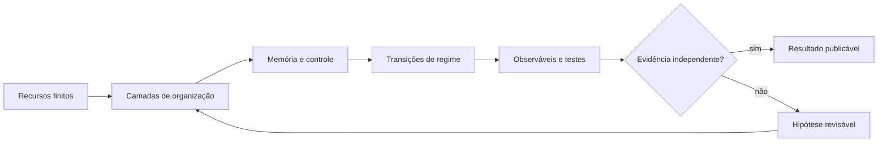
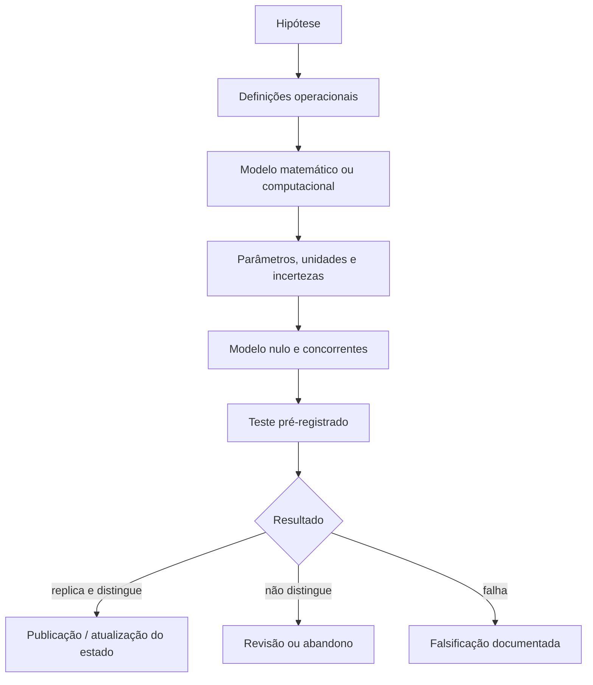

# Laboratório Tamesis — Research Archive

[](RELATORIO_PROGRESSO_AUDITORIA_ARTIGOS.md)
[](RELATORIO_PROGRESSO_AUDITORIA_ARTIGOS.md)
[](PROJECT_FREEZE.md)
[](PROJECT_STATE.json)
[](LICENSE)
[](#governança-autoria-e-responsabilidade)

> **Um arquivo interdisciplinar para investigar informação, geometria, transições, sistemas complexos e cognição — com hipóteses separadas de evidências.**

Este repositório preserva a trajetória completa do Laboratório Tamesis, seu ramo experimental atual e suas linhas históricas, matemáticas, físicas, computacionais e cognitivas. O arquivo contém **280 registros auditados**, organizados em **274 dossiês de auditoria**. A auditoria não transforma conjecturas em fatos: ela torna explícito o que é demonstração, modelo, simulação, ajuste, hipótese ou cenário especulativo.

## Leitura rápida

O relatório institucional [Visão final do Laboratório Tamesis](RELATORIO_VISAO_FINAL_LABORATORIO_TAMESIS.md) apresenta as perguntas, respostas, impactos, aplicações e novas perguntas produzidas pelo conjunto da pesquisa. Há também uma versão [HTML pronta para impressão em PDF](RELATORIO_VISAO_FINAL_LABORATORIO_TAMESIS.html).

### Estado científico atual

| Camada | Estado | Interpretação correta |
|---|---|---|
| Arquivo e metodologia | **Concluído/auditado** | Inventário, classificação de alegações, fontes e critérios de falsificação registrados. |
| Modelos computacionais | **Congelados para auditoria** | Resultados reproduzíveis devem ser tratados como saídas de modelos, não como constantes medidas. |
| Tamesis `M_c v1` | **Hipótese testável** | O valor `M_c = 5.292674126388712e-16 kg` é um parâmetro do modelo, não uma medição. |
| Evidência física independente | **Ainda não estabelecida** | Não há, neste arquivo, confirmação experimental da ontologia Tamesis. |
| Problemas do Millennium e TOE | **Não resolvidos** | Os textos são conjecturas, reduções ou modelos restritos; não são soluções aceitas. |
| Adjudicação numérica do núcleo | **Onda 1 concluída (2026-08-21)** | Ver seção "Adjudicação numérica em andamento" abaixo — 3 alegações fechadas negativas com veredito final, 1 parcialmente confirmada por reprodução adversarial. |

### Adjudicação numérica em andamento (Discovery Lab, atualizado 2026-08-21)

O `05_DISCOVERY_LAB` mantém uma adjudicação contínua das alegações quantitativas
deste arquivo contra referências externas reais (PDG, CODATA, Planck), com
metodologia fixada antes de cada cálculo, proveniência de todo valor de
referência e reprodução adversarial obrigatória para achados positivos.
Registro completo: `05_DISCOVERY_LAB/01_PORTFOLIO/TEST_QUEUE.yaml` e
`05_DISCOVERY_LAB/00_GOVERNANCE/DECISION_LEDGER.yaml` (`DISC-DEC-013`/`-014`).

| Alegação do núcleo | Veredito (critérios a priori) |
|---|---|
| Consistência interna de `M_c` | **Inconsistente.** 4 valores divergem em até ~190×; o valor congelado usa o ramo `a₀=cH₀` desfavorecido pelo próprio teste SPARC-002 do laboratório; fórmula do rascunho PRL dimensionalmente inconsistente. |
| Massas de quarks via nós (`M∝e^{αL/D}`, "R²>0,99") | **Não sobrevive.** R² real 0,986/0,935; leave-one-out falha em 5/6 quarks; percentil 86/70 no nulo de permutação (limiar 95). |
| `sin²θ_W=3/13`, `α⁻¹=Ω^{1.03}`, `n_s` do bounce, Λ holográfico | **Nenhuma sobrevive como formulada.** 7,5σ no esquema mais favorável; ajuste com 0 g.l.; tuning de `ξ` confirmado no código; Λ reproduz `ρ_crit` por identidade algébrica (razão ≡ 1/Ω_Λ). |
| Classe de universalidade U₁/₂ (`φ(c)=(1+c)^{-1/2}`) | **Parcialmente confirmada** (reprodução adversarial independente): expoente de cauda 1/2 e distinção das classes concorrentes CONFIRMADOS; o "teorema" de limite exato REFUTADO (desvios estáveis até n=64.000); o objeto-limite verdadeiro foi identificado e explica todo o dado. Pergunta aberta: qual é a função-limite exata? |
| Zeros de ζ — triagem itens 5/6/10 (avaliação de `ζ(s)`) | Itens 5 e 6 despriorizados com justificativa concreta; **item 10 (máximos FHK em intervalos curtos) priorizado** — único com pergunta falseável e modelo concorrente nomeado; pré-registro em desenho. |

Anteriormente: a linha `DISC-TRI-RG-001` (invariante cross-domain) foi encerrada
`CLOSED_NULL` após 16/16 candidatos sem sobrevivente, e as linhas SPARC/MOND
fecharam inconclusivas — ver `05_DISCOVERY_LAB/DISCOVERY_LAB_STATE.md`.

## Visão do laboratório

O programa investiga se sistemas sujeitos a recursos finitos podem construir camadas adicionais de organização quando o custo dessa complexidade é compensado pela redução de erro, dissipação, instabilidade ou busca futura. Essa ideia é um **princípio de modelagem**, não uma finalidade atribuída à natureza.

O laboratório conecta quatro níveis:

1. **Matemática:** operadores, espectros, topologia, grafos, universalidade e regularidade.
2. **Física fundamental:** informação, geometria, holografia, gravidade, partículas e transições quântico-clássicas.
3. **Sistemas complexos:** termodinâmica, memória, irreversibilidade, redes, estabilidade e controle.
4. **Vida e cognição:** organismo integrado, cérebro-computador, consciência e ecossistemas cognitivos.


```mermaid
flowchart LR
    A[Recursos finitos] --> B[Camadas de organização]
    B --> C[Memória e controle]
    C --> D[Transições de regime]
    D --> E[Observáveis e testes]
    E --> F{Evidência independente?}
    F -->|sim| G[Resultado publicável]
    F -->|não| H[Hipótese revisável]
    H --> B
```


<p align="center"><sub>Figura 1 — Ilustração de trabalho do princípio holográfico. A figura representa uma hipótese de modelagem; não é evidência de que o universo seja holográfico ou simulado.</sub></p>

## Comece aqui

- [Relatório final de visão do laboratório](RELATORIO_VISAO_FINAL_LABORATORIO_TAMESIS.md)
- [Versão HTML para apresentação e PDF](RELATORIO_VISAO_FINAL_LABORATORIO_TAMESIS.html)
- [Relatório da auditoria dos 280 artigos](RELATORIO_PROGRESSO_AUDITORIA_ARTIGOS.md)
- [Protocolo de auditoria rigorosa](PROTOCOLO_AUDITORIA_RIGOROSA_DE_ARTIGOS.md)
- [Manifesto máquina-legível do inventário](ARTICLE_MANIFEST.csv)
- [Congelamento e condições de retomada](PROJECT_FREEZE.md)
- [Estado do projeto em JSON](PROJECT_STATE.json)
- [Linha do tempo](00_HOME/TIMELINE.md)
- [Mapa do arquivo](00_HOME/WORKSPACE_MAP.md)
- [Página inicial navegável](00_HOME/README.md)
- [Versão em português do README](README_PTBR.md)
- [Atlas interativo de hipóteses](atlas.html)

## As linhas de pesquisa

| Linha | Pergunta central | Estado atual | Aplicações potenciais |
|---|---|---|---|
| **A. Fundamentos e arquitetura da realidade** | Informação, geometria ou computação podem gerar espaço-tempo e leis efetivas? | Arquitetura conceitual e modelos candidatos. | Gravidade quântica, geometria informacional, modelagem de redes. |
| **B. Axiomas e pontes operacionais** | Um conjunto pequeno de axiomas reproduz equações observadas sem ajuste setor a setor? | Fechamento parcial e condicional. | Derivação de modelos, testes de consistência e redução de parâmetros. |
| **C. TDTR, TRI e irreversibilidade** | Como regimes mudam e por que certas transições são irreversíveis? | Vocabulário, bibliotecas e modelos de transição. | Termodinâmica, dinâmica dissipativa e setas do tempo. |
| **D. Universalidade** | Sistemas diferentes compartilham invariantes e leis de escala? | Classes promissoras em modelos restritos. | Detecção de transições, análise de falhas e controle adaptativo. |
| **E. Espectros e Riemann** | Existe um operador cujo espectro realize os zeros da zeta? | Rota matemática legítima; sem prova da Hipótese de Riemann. | Teoria espectral, caos quântico e análise numérica. |
| **F. Computação, grafos e primos** | Estruturas aritméticas podem ser codificadas em grafos e sistemas computacionais? | Algoritmos e correspondências exploratórias. | Graph learning, análise de redes e algoritmos espectrais. |
| **G. Cosmologia observacional** | Que observável distingue Tamesis de `ΛCDM`, MOND e modelos concorrentes? | Catálogo de testes; sem substituição empírica demonstrada. | CMB, BAO, supernovas, lentes, SPARC e ondas gravitacionais. |
| **H. Buracos negros e singularidades** | Como informação e geometria lidam com horizontes e singularidades? | Modelos termodinâmicos/holográficos especulativos. | Informação quântica, gravidade e termodinâmica de horizontes. |
| **I. Partículas e topologia** | Topologia pode explicar massas, famílias, mistura e acoplamentos? | Mecanismos candidatos e relações numéricas. | Fenomenologia de partículas e testes de precisão. |
| **J. Limite quântico-clássico** | Quando e por que uma dinâmica quântica se torna clássica? | Hipóteses concorrentes e desenhos experimentais. | Interferometria, optomecânica e metrologia quântica. |
| **K. Ecossistemas cognitivos** | Como organismos constroem controle, memória e perfis de consciência? | Agenda conceitual e programa empírico. | Neurociência de redes, fisiologia e interfaces cérebro-computador. |
| **L. Topologia cognitiva e cybernetics híbrida** | Estados cognitivos podem ser classificados por invariantes relacionais/espectrais? | Estrutura teórica e protótipos de controle. | Sistemas humano-máquina e robótica corporificada. |
| **M. Estabilidade e operadores** | Coercividade, dissipação e margens espectrais detectam regimes patológicos? | Métodos candidatos e teoremas restritos. | Controle de infraestrutura, anomalias e redes adaptativas. |
| **N. Problemas do Millennium** | Capacidade finita pode implicar teoremas sobre `P vs NP`, RH e EDPs? | Nenhuma solução aceita; argumentos restritos. | Novos lemas matemáticos, não alegações de resolução. |
| **O. Cosmologias especulativas e engenharia métrica** | Bounces, universos-pai ou métricas modificadas geram observáveis? | Cenários especulativos. | Apenas após solução covariante, estabilidade e causalidade. |
| **P. Infraestrutura científica** | Como manter pesquisa interdisciplinar reproduzível e honesta? | Inventário e auditoria rastreáveis. | Governança, revisão, preprints e colaboração externa. |

## Um ciclo de pesquisa verificável


```mermaid
flowchart TD
    A[Hipótese] --> B[Definições operacionais]
    B --> C[Modelo matemático ou computacional]
    C --> D[Parâmetros, unidades e incertezas]
    D --> E[Modelo nulo e concorrentes]
    E --> F[Teste pré-registrado]
    F --> G{Resultado}
    G -->|replica e distingue| H[Publicação / atualização do estado]
    G -->|não distingue| I[Revisão ou abandono]
    G -->|falha| J[Falsificação documentada]
```

Esse ciclo é a regra editorial do arquivo. Uma simulação que reproduz uma curva não é automaticamente uma descoberta; uma coincidência numérica não é uma derivação; e uma analogia entre sistemas não é uma identidade física.

## Núcleo experimental atual: `Tamesis M_c v1`

O ramo experimental atual está congelado em `frozen_and_ready`, com a qualificação de hardware ainda não iniciada. O Demonstrador A começa pela calibração cega de termometria óptica entre 5 K e 20 K; ele **ainda não mede `M_c`**.

- [README do Tamesis M_c v1](01_TAMESIS_CORE/02_Experimental_Validation/Quantum_Classical_Transition/tamesis_mc_v1/README.md)
- [Relatório de execução do Demonstrador A v0.6](01_TAMESIS_CORE/02_Experimental_Validation/Quantum_Classical_Transition/tamesis_mc_v1/reports/DEMONSTRATOR_A_V0_6_EXECUTION_REPORT.md)
- [Saídas visuais, figuras e animações](02_TAMESIS_MC_V1_OUTPUTS/README.md)
- [Pacote de colaboração experimental](03_EXPERIMENTAL_COLLABORATION_PACKAGE/README.md)


<p align="center"><sub>Figura 2 — Mapa de limites usado como guia de teste. Regiões e marcadores representam hipóteses e dados de referência; não constituem confirmação de uma fronteira universal.</sub></p>

## Sistemas complexos e transições


<p align="center"><sub>Figura 3 — Visualização conceitual de compressão, saturação e reorganização. É uma ilustração de modelo, não uma lei empírica geral.</sub></p>

O laboratório usa uma linguagem comum para comparar sistemas: **estado, recursos, acoplamentos, memória, transição, dissipação, estabilidade, observável e critério de falha**. A comparação é metodológica; ela não afirma que uma galáxia, uma célula, um grafo e um cérebro sejam o mesmo tipo de objeto.

## O que o laboratório já conseguiu

- inventário completo de 280 registros e auditoria rastreável;
- separação explícita entre prova, hipótese, modelo, ajuste, simulação e cenário especulativo;
- atlas de regimes, transições, operadores, redes e sistemas cognitivos;
- catálogo de testes observacionais e experimentais com modelos nulos;
- versão HTML/PDF institucional para apresentação acadêmica;
- preservação de versões históricas sem endossar suas alegações como resultados atuais.

## O que ainda não foi demonstrado

O arquivo **não afirma** ter resolvido a Hipótese de Riemann, `P vs NP`, Navier–Stokes, Yang–Mills, Hodge ou Birch–Swinnerton-Dyer. Também não há demonstração aceita de que Tamesis substitua `ΛCDM`, elimine matéria escura/energia escura, faça a consciência causar colapso quântico, viabilize propulsão métrica ou prove que o universo é uma simulação.

Essas linhas permanecem como conjecturas, programas de teste ou modelos restritos até que apresentem provas formais, dados independentes, previsões novas e replicação.

## Estrutura do repositório

| Pasta/arquivo | Função |
|---|---|
| `00_HOME` | Orientação, linha do tempo e mapa do arquivo. |
| `01_TAMESIS_CORE` | Teoria central, modelos, ativos e validação experimental. |
| `02_TAMESIS_MC_V1_OUTPUTS` | Figuras e animações convenientes do ramo `M_c v1`. |
| `03_EXPERIMENTAL_COLLABORATION_PACKAGE` | Materiais para colaboração e qualificação experimental. |
| `90_LEGACY` | Ramos históricos, substituídos, especulativos ou sem sustentação atual. |
| `RECURSOS_PARA_PESQUISA` | Referências e materiais de pesquisa; não são evidência produzida pelo projeto. |
| `publicar` / `publicados` | Organização editorial de artigos destinados a publicação e já publicados. |
| `ARTICLE_MANIFEST.csv` | Inventário máquina-legível de artigos. |
| `RELATORIO_PROGRESSO_AUDITORIA_ARTIGOS.md` | Rastreamento da auditoria artigo a artigo. |
| `RELATORIO_VISAO_FINAL_LABORATORIO_TAMESIS.html` | Documento institucional pronto para PDF. |

## Governança, autoria e responsabilidade

**Gestão científica, autoria principal e curadoria deste arquivo:** **Douglas H. M. Fulber**.

O Laboratório Tamesis é administrado como um programa de pesquisa independente neste repositório. A menção a universidades, laboratórios, autores ou DOIs em documentos históricos não significa endosso institucional, coautoria ou validação externa, salvo quando houver autorização e registro explícitos.

A governança editorial segue estas regras:

1. o mantenedor responsável controla a classificação de status, a organização das linhas e a aceitação de alterações estruturais;
2. contribuições externas são bem-vindas, mas não alteram autoria, proveniência ou estado de evidência sem revisão registrada;
3. novos resultados devem incluir método, dados/código quando aplicável, incertezas, modelo nulo, limitações e critério de falsificação;
4. documentos legados permanecem por proveniência e não são automaticamente promovidos a resultados válidos;
5. qualquer publicação derivada deve citar o laboratório, o autor/curador e a versão específica do arquivo utilizada.

Para propor uma colaboração ou correção, abra uma issue/patch documentando: arquivo afetado, justificativa, fontes, impacto na classificação e teste de verificação.

## Licença e atribuição

O material original deste arquivo é disponibilizado sob [Creative Commons Attribution 4.0 International (CC BY 4.0)](LICENSE), salvo indicação diferente no próprio arquivo ou direitos de terceiros. A licença permite compartilhar e adaptar o material, desde que a atribuição seja preservada e as modificações sejam indicadas.

Forma recomendada de atribuição:

> Douglas H. M. Fulber, Laboratório Tamesis — *Tamesis Research Archive*, versão/commit utilizado, licenciado sob CC BY 4.0: [repositório](.).

Ao reutilizar uma figura, preserve a legenda, o caminho do ativo e a indicação de que se trata de uma visualização de modelo quando essa for a classificação registrada. Imagens, dados ou textos de terceiros podem estar sujeitos a condições próprias; a CC BY 4.0 não transfere direitos que o laboratório não possui.

## Integridade e limites de uso

- Não apresentar conjecturas do arquivo como fatos estabelecidos.
- Não usar a presença de um DOI como prova de revisão por pares ou validação experimental.
- Não atribuir endosso institucional a universidades ou grupos citados sem autorização formal.
- Não ocultar limitações, parâmetros ajustados, resultados negativos ou condições de falha.
- Não usar o material para aconselhamento médico, jurídico, financeiro ou de segurança sem avaliação profissional independente.

## Como citar este arquivo

```text
Fulber, Douglas H. M. (2026). Tamesis Research Archive: Laboratório Tamesis — visão, auditoria e programa de pesquisa. CC BY 4.0.
```

## Contato e colaboração

O ponto de entrada recomendado é uma issue documentada neste repositório. Para apresentação acadêmica, utilize o [relatório institucional em HTML/PDF](RELATORIO_VISAO_FINAL_LABORATORIO_TAMESIS.html) e o [relatório completo em Markdown](RELATORIO_VISAO_FINAL_LABORATORIO_TAMESIS.md), sempre preservando a classificação de evidência indicada.
