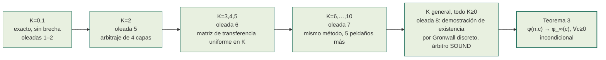
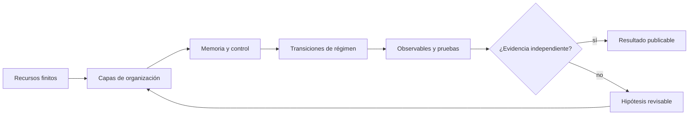
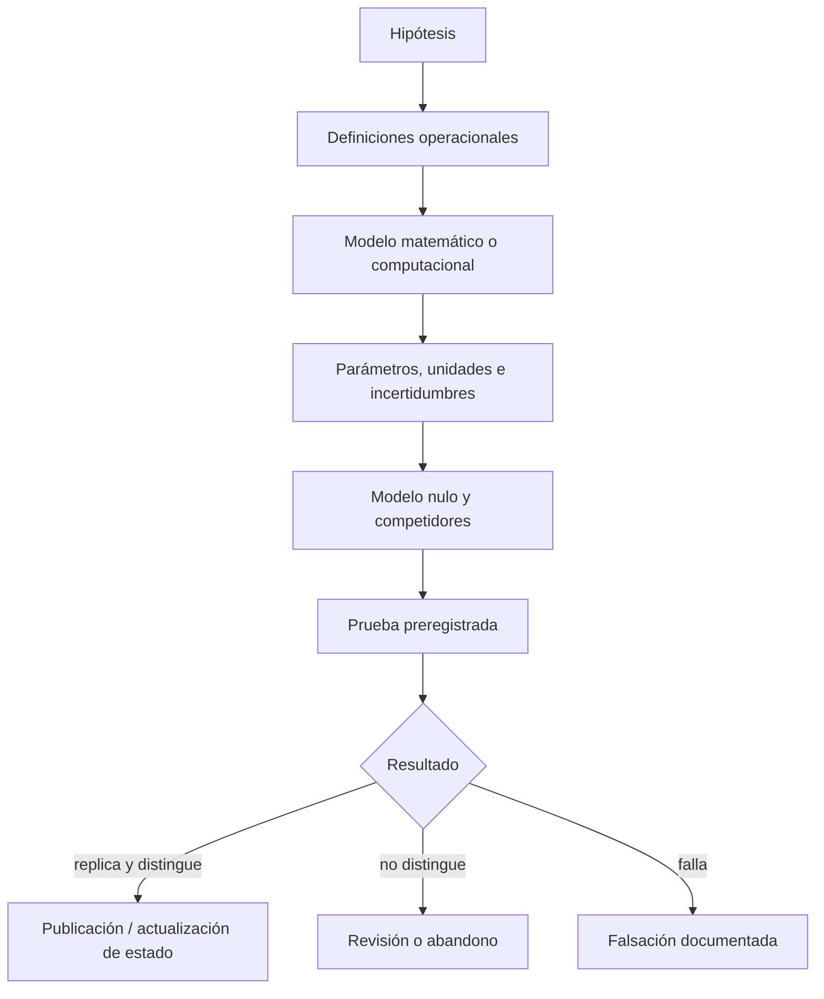

# Tamesis Discovery Lab — Archivo de Investigación Adversarial

[](RELATORIO_PROGRESSO_AUDITORIA_ARTIGOS.md)
[](RELATORIO_PROGRESSO_AUDITORIA_ARTIGOS.md)
[](05_DISCOVERY_LAB/01_PORTFOLIO/TEST_QUEUE.yaml)
[](05_DISCOVERY_LAB/00_GOVERNANCE/CLAIM_LEDGER.yaml)
[](05_DISCOVERY_LAB/00_GOVERNANCE/DECISION_LEDGER.yaml)
[%20limit%20law-closed--form%20%C2%B7%20unconditional%20%C2%B7%20adversarially%20verified-8c5a1f?style=for-the-badge)](tamesis-cycle-survival/)
[](PROJECT_STATE.json)
[](LICENSE)
[](README.md#governance-authorship-and-responsibility)
[](README.md)

**Idiomas:** [English](README.md) · [Português (BR)](README_PTBR.md) · [日本語](README_JA.md) · [中文（简体）](README_ZH.md) · **Español**

> **Un archivo de investigación interdisciplinario sobre información, geometría, transiciones de fase, sistemas complejos y cognición — con las hipótesis mantenidas explícitamente separadas de la evidencia.**

Este repositorio conserva la trayectoria completa del Laboratorio Tamesis: su rama experimental actual y sus líneas de investigación históricas, matemáticas, físicas, computacionales y cognitivas. El archivo contiene **280 registros auditados**, organizados en **274 dossiers de auditoría**. Auditar aquí no convierte la conjetura en hecho — hace explícito qué es una demostración, una consecuencia condicional, un ajuste numérico, una ilustración computacional, una conjetura o un escenario especulativo.

Desde 2026, el archivo también opera un **laboratorio de adjudicación continua** (`05_DISCOVERY_LAB`): cada afirmación cuantitativa que el propio archivo formula se cierra, una por una, contra referencias externas reales, bajo criterios preregistrados y **reproducción adversarial obligatoria**. El resultado hasta ahora — decenas de cierres negativos catalogados con veredicto final, y un resultado matemático positivo re-derivado de forma independiente y verificado adversarialmente — se sintetiza en el **[artículo del Discovery Lab](index.html)** (la página de inicio del repositorio).

<p align="center"></p>

## Discovery Engine: los Estadios 1–3a de la hoja de ruta, construidos y probados

**[`06_DISCOVERY_ENGINE/`](06_DISCOVERY_ENGINE/README.md)** convierte los tres primeros estadios de `ROADMAP.md` en código Python real y probado: 12 módulos repartidos en el Estadio 1 (Registro de Hipótesis, Ejecutor de Experimentos, Motor de Reproducción, Revisor Adversarial, Ledger de Decisiones), el Estadio 2 (Matemática Simbólica, Laboratorio de Monte Carlo, Observatorio de Datasets, un puente de prueba formal hacia Lean4, Atlas de Universalidad) y el Estadio 3a (Motor de Hipótesis, Motor de Descubrimiento Matemático) — los dos, de los ocho productos nombrados en el Estadio 3, que era posible construir honestamente como módulos de backend.

Lo que hace esto creíble, y no solo una afirmación de marketing: 220/220 pruebas pasan en los tres estadios, cada uno cerrado por una revisión hostil dedicada, realizada por un agente que no escribió el código, y luego reverificado de forma independiente una tercera vez por la sesión orquestadora. El benchmark de aceptación exigido reproduce de extremo a extremo el propio resultado `U₁/₂` ya demostrado por este archivo — `φ_∞(c)`, la distribución de `M_K`, la corrección de `n` finito y el régimen de escala `γ=c/n` — a partir de una implementación independiente, sin importar de `05_DISCOVERY_LAB` y sin ninguna ayuda directa. La revisión hostil no fue un mero sello: encontró un fallo real de manipulación de la cola en la cadena hash del ledger del Estadio 1 (la entrada más reciente no tenía sucesor que la protegiera) y una afirmación falsa de "imposible de eludir" en la propia documentación del Motor de Hipótesis del Estadio 3a — ambas corregidas abiertamente, con la misma disciplina de `corrección` fechada que este archivo aplica a sus propios errores matemáticos, no remendadas en silencio.

Tres piezas quedan explícitamente **sin construir**, catalogadas como aplazadas, no simuladas: el Laboratorio de Simulación (un entorno visual real de simulación basada en agentes/redes es una empresa de interfaz gráfica que ninguna suite de pruebas puede validar como se validaron los módulos anteriores); la captación de datos externos en vivo del Observatorio (requiere acceso de red y credenciales de API que este build no debería asumir); y la arquitectura unificada "Tamesis OS" del Estadio 4 (bloqueada por una decisión de pila de infraestructura — el propio `ROADMAP.md` llama a su pila candidata "no evaluada... nada de esto está comprometido" — no por esfuerzo pendiente). Esto es trabajo de corrección de software, no una nueva afirmación matemática o física: no entra en el ledger de gobernanza de `05_DISCOVERY_LAB` ni cuenta para ninguna afirmación de Problema del Milenio. Detalle completo: **[`06_DISCOVERY_ENGINE/README.md`](06_DISCOVERY_ENGINE/README.md)** y **[`GOAL.md`](GOAL.md)**.

## Lectura rápida

El informe institucional [Visión Final del Laboratorio Tamesis](RELATORIO_VISAO_FINAL_LABORATORIO_TAMESIS.md) expone las preguntas, respuestas, impactos, aplicaciones y nuevas preguntas producidas por el programa de investigación en su conjunto. También está disponible una [versión HTML/PDF lista para imprimir](RELATORIO_VISAO_FINAL_LABORATORIO_TAMESIS.html).

### Estado científico actual

| Capa | Estado | Interpretación correcta |
|---|---|---|
| Archivo y metodología | **Completo / auditado** | El inventario, la clasificación de afirmaciones, las fuentes y los criterios de falsación están todos registrados. |
| Modelos computacionales | **Congelados para auditoría** | Las salidas reproducibles deben leerse como salidas de modelo, no como constantes medidas. |
| Tamesis `M_c v1` | **Hipótesis comprobable** | El valor `M_c = 5.292674126388712e-16 kg` es un parámetro del modelo, no una medición. |
| Evidencia física independiente | **Aún no establecida** | Nada en este archivo constituye confirmación experimental de la ontología Tamesis. |
| Problemas del Milenio y afirmaciones de Teoría del Todo | **Sin resolver** | Estos textos son conjeturas, reducciones o argumentos de modelo restringido — no soluciones aceptadas. |
| Adjudicación numérica del núcleo | **Consolidación matemática completa — las Conjeturas 1 y 2 ahora probadas para todo `K` (2026-08-26)** | Ver más abajo — 3 afirmaciones cerradas en negativo con veredicto final; la 4ª (`U₁/₂`) tiene un núcleo probado, arbitrado adversarialmente muchas veces de forma independiente, con el Lema Abierto y la conjetura de tasa probados incondicionalmente para todo `K≥0` (2026-08-22), la constante nítida de la tasa `a*` probada y ensamblada en una cota explícita para `n` finito (2026-08-25), la ley de escala `γ=c/n` probada para todo `γ∈(0,1]` (2026-08-26), y las Conjeturas 1 y 2 — la ley distribucional completa y su mezcla de Poisson — ambas ahora probadas para **todo** `K≥1`, no solo una lista finita de instancias (2026-08-26). |

### El programa de adjudicación (Discovery Lab, actualizado el 2026-08-28)

`05_DISCOVERY_LAB` ejecuta una adjudicación continua de las afirmaciones cuantitativas de este archivo contra referencias externas reales (PDG, CODATA, Planck, SPARC, Gaia, Odlyzko), con la metodología fijada *antes* de cada cómputo, procedencia completa para cada valor de referencia, y **reproducción adversarial obligatoria** para todo hallazgo positivo. Registro completo: `05_DISCOVERY_LAB/01_PORTFOLIO/TEST_QUEUE.yaml` y `05_DISCOVERY_LAB/00_GOVERNANCE/DECISION_LEDGER.yaml`. Síntesis en formato de artículo: **[`index.html`](index.html)** (la página de inicio del repositorio).


**El embudo de supervivencia completo (2026):**

| Línea | Probado | Resultado |
|---|---|---|
| Invariante entre dominios (TRI-RG) | 16 candidatos, 5 rondas | `CLOSED_NULL` — 0 sobrevivientes; 4 hallazgos con `p<0.05` refutados por reproducción adversarial (se demostraron explicaciones mundanas) |
| Cosmología SPARC/MOND + binarias anchas de Gaia | 4 pruebas preregistradas | 4/4 inconclusas por confusores reales demostrados; se descubrió que 2 resultados destacados heredados se apoyaban en **datos fabricados** y se rehicieron con datos reales |
| Ceros de la función zeta de Riemann (RH-REAL) | 12/12 ítems del relevamiento, todos finalmente resueltos | 2 hallazgos replicados (anti-agrupamiento de brechas consecutivas; escalamiento GUE `N^(-1/3)`); tanto los máximos FHK como la varianza del número de ceros cerraron como `CLOSED_INCONCLUSIVE`, cada uno con un componente fuerte confirmado adversarialmente (exclusión del lado iid ≥8.8σ; exclusión GUE ingenua de hasta 203σ — la reproducción adversarial además encontró y corrigió un 3er error real en el estimador primario) |
| Adjudicación de afirmaciones cuantitativas del núcleo (oleada 1) | 7 afirmaciones | `M_c` inconsistente (~190× entre valores); el modelo de masa quark/nudo falla la validación leave-one-out; `sin²θ_W=3/13` se desvía 7.5σ con ajuste manual codificado; `α⁻¹=Ω^{1.03}` con 0 grados de libertad; `n_s` del rebote no identificable; `Λ` holográfico ≡ `ρ_crit` por identidad algebraica |
| **Ley límite `U₁/₂` (oleadas 2–17, consolidada)** | 1 teorema + 1 generalización + Lema Abierto (todo `K≥0`) + Conjeturas 1 y 2 (todo `K≥1`) + tasa nítida + ley de escala `γ` | **Probado, arbitrado adversarialmente (muchas rondas independientes, técnicas distintas cada vez), publicado como artículo + paquete reproducible; Lema Abierto y conjetura de tasa PROBADOS incondicionalmente para todo `K` (oleada 8, 2026-08-22); la densidad completa de la Conjetura 1, `f_{M_K}(x)=2Kx(1-x²)^{K-1}`, y su Conjetura 2 asociada por mezcla de Poisson están ahora ambas PROBADAS para todo `K≥1` a la vez (oleada 17, 2026-08-26), tras los cierres por `K` individual en `K=2,3,4` (oleadas 14–16); la constante nítida de la tasa `a*` PROBADA y ensamblada en una cota explícita para `n` finito (oleada 17, 2026-08-25); la ley de escala `γ=c/n` PROBADA para todo `γ∈(0,1]` (oleada 17, 2026-08-26)** (ver más abajo) |
| Relevamiento de candidatos en todo el archivo (Fase 0, más allá de TRI-RG) | 19 candidatos, 7 áreas | `CLOSED_NULL` — 18/19 rechazados con un motivo concreto citado; 1 pista inmadura (firmas espectrales de EEG cognitivo) promovida a una nueva línea, ver más abajo |
| Cognición — firma espectral de EEG en depresión (Mumtaz, `DISC-COGNITIVE-EEG-SPECTRAL-001`) | 1 preregistro cerrado, N=30 MDD/26 HC | `CLOSED_REFUTED` — la entropía espectral fue **mayor**, no menor, en MDD (`d=1.447`, `p=3.97×10⁻⁶`) — dirección opuesta a la hipótesis probada, confirmado por una reproducción adversarial independiente hecha desde cero (los números coinciden hasta <10⁻⁹) |
| Cosmología SPARC-004 — autocalibración de `f_multi` (Etapa 1→2) | Pipeline validado + aplicado a datos reales de descubrimiento (30,203 sistemas) | `CLOSED_INCONCLUSIVE` — veredicto mecánico `BOTH_FALSIFIED`, pero el paso obligatorio de refutación (debunker) encontró un confusor real: un subgrupo del 19% de la muestra (RUWE alto) está sistemáticamente subcorregido por el modelo `f_multi` de escalar único, con un exceso estadísticamente robusto incluso en el propio bin de anclaje de la calibración |
| Pico espectral de la resonancia Schumann (`DISC-SCHUMANN-RESONANCE-001`) | Datos reales de magnetómetro ELF, estación Sierra Nevada (Zenodo), 3 días × 2 canales, 6/6 casos | `NO DISTINGUE` — existe una elevación espectral amplia genuina en la ubicación esperada (7,8–8,0 Hz) en todos los casos, pero la prominencia (1,22×–1,44×) queda por debajo del umbral preregistrado de 3×; reproducción adversarial bit a bit, ninguna afirmación de conexión neuronal hecha ni posible |
| Reproducibilidad de IIT/Φ — red canónica ABC (`DISC-IIT-PHI-REPRO-001`) | Reproducción vía PyPhi de la red de la Figura 4 de Oizumi, Albantakis & Tononi (2014) | `CONFIRMED` — Φ=1,916666 frente al valor publicado 1,916665, idéntico bit a bit en 16 dígitos significativos entre dos instalaciones totalmente independientes; verificación de reproducibilidad de una métrica definida, no una prueba de ninguna afirmación sobre la consciencia |
| Principio de Energía Libre — búsqueda de objetivo falsable (`DISC-FEP-PREDICTIVE-CODING-001`) | Relevamiento de literatura en Fase 0, 4 candidatos examinados a nivel de fuente primaria | `CLOSED_OUT_OF_DOMAIN` — no se encontró ningún objetivo que satisficiera los tres requisitos (predicción cerrada, modelo competidor externo nombrado, conjunto de datos público); uno de los artículos revisados admite en su propio texto que el principio "puede describir arguiblemente cualquier dato biológico observado" |
| Lógica no clásica en Lean4 — LP de Priest (paraconsistente) | 6 archivos, 876 líneas, 12 metateoremas, `lake build` limpio | Explosión, modus ponens y silogismo disyuntivo demostrados INVÁLIDOS bajo LP (el resultado central de la paraconsistencia); teorema de colapso clásico demostrado como un `iff` genuino de dos vías; revisado adversarialmente, se aplicó una sola corrección, solo de documentación |

Estas cuatro líneas abren un programa complementario que aplica la misma disciplina a afirmaciones de la filosofía de la mente, las ciencias cognitivas, la geofísica y la lógica formal — ver **[`PROGRAMA_CONSCIENCIA_LOGICA_E_REALIDADE.md`](PROGRAMA_CONSCIENCIA_LOGICA_E_REALIDADE.md)** para el mapeo completo, ítem por ítem, incluyendo lo que fue deliberadamente excluido por no ser falsable (el panpsiquismo como hecho, "Dios como equilibrio termodinámico", el Argumento de la Simulación como proposición comprobable, y otros) y por qué.

### El resultado positivo principal: una ley de universalidad exacta en forma cerrada

La clase de universalidad `U₁/₂` (una permutación aleatoria perturbada a una tasa `c/n` hacia una función aleatoria) tiene la ley límite exacta:

<p align="center"></p>

> `φ_∞(c) = ∫₀¹ e^(−ct²) dt = ½·√(π/c)·erf(√c)` — cero parámetros libres,

derivada analíticamente (no ajustada), corrigiendo la conjetura original del archivo `(1+c)^(-1/2)` (excluida ya en el primer coeficiente de la serie: `a₁ = 1/3 ≠ 1/2`, confirmado por enumeración exacta). Este resultado es ahora un **teorema probado**, no una conjetura: un documento matemático autocontenido (`THEOREM.md`) demuestra la forma cerrada en seis pasos, incluyendo el tratamiento correcto del *size-biasing* (sesgo por tamaño) de los arcos visitados, y fue revisado por un agente independiente actuando como árbitro hostil — **cero errores encontrados**.

El puente entre el modelo finito y el objeto límite está ahora probado **incondicionalmente para todo `K≥0`** — `φ(n,c) → φ_∞(c)` cuando `n → ∞`, para todo `c ≥ 0` fijo, sin ninguna hipótesis no probada restante (`THEOREM.md`, «Teorema 3»):



Cada peldaño anterior fue re-derivado de forma independiente por un agente árbitro hostil distinto, usando una técnica de demostración *diferente* de la derivación original, su propia enumeración por fuerza bruta, y verificaciones completas de sustitución recursiva — **cero errores encontrados en ninguna capa**, a lo largo de 4 rondas de arbitraje independientes. `K=6,…,10` fue además confirmado bit a bit contra una enumeración exhaustiva nueva en dos puntos reservados. El peldaño final cerró la última brecha nombrada que quedaba: un árbitro hostil re-derivó de forma independiente, desde cero, una inducción exacta por Gronwall discreto que demuestra que la expansión de dos términos para `n` finito existe para *todo* `K`, no solo para los 11 valores verificados concretamente — veredicto **SOUND, with named issues** (cuatro encontrados, ninguno fatal, corregidos mediante adendas fechadas). El **Lema Abierto** — ahora probado incondicionalmente para todo `K` — es el caso exacto de parámetro fijo de Hansen & Jaworski (EJC, 2014); una mezcla de Poisson con `erf` en forma cerrada no se encontró en una búsqueda bibliográfica sistemática (35+ consultas registradas), con la salvedad explícita de que esto no equivale a "novedoso". Un segundo frente derivó **por qué el exponente es exactamente 1/2**: a través de toda una familia paramétrica de mecanismos de perturbación, `α ∈ [1/2, 1]` siempre — `α < 1/2` está **probado imposible** (un efecto de agrupamiento cuadrático que persiste incluso sin ninguna "muerte" de ciclicidad). La oleada 5 también localizó y confirmó un mecanismo natural (`M-WEIB(β)`, riesgo de Weibull no homogéneo) que alcanza todo `α ∈ (1/2, 1)` intermedio. No se afirma ninguna implicación física — esto es matemática combinatoria pura sobre un ensemble específico.

**La forma cerrada a todos los órdenes (2026-08-23).** Cada peldaño anterior — `K=0,…,10`, el puente para `K` general, las constantes de error en `n` finito — es ahora un corolario de una única fórmula exacta. Al extender la misma técnica de expansión asintótica a un índice de orden *simbólico*, se reveló que los coeficientes de cada orden son exactamente los números de Stirling de primera especie sin signo, y, como estos son precisamente los coeficientes de un factorial ascendente, toda la expansión infinita se re-suma — no asintóticamente, sino de forma exacta y finita (termina tras `K+1` términos). El resultado es una única expresión finita y totalmente explícita para la recursión subyacente, válida para todo `n`, `K` y parámetro de desplazamiento, con una demostración elemental independiente que prescinde por completo de la maquinaria de la expansión. Una ronda dedicada de arbitraje hostil re-derivó ambas demostraciones desde cero, contra su propio simulador construido desde cero (215,070 verificaciones exactas, cero discrepancias), confirmó la afirmación principal y encontró un error real en una afirmación negativa secundaria (corregido mediante una adenda fechada), además de dos etiquetas conservadoras que el documento original había dejado deliberadamente sin demostrar — ambas probadas directamente por el árbitro. Ver `THEOREM.md`, «Estágio 9».

**Convergencia uniforme en todo el rango de parámetros (2026-08-23).** El teorema anterior solo dice que `φ(n,c) → φ_∞(c)` para cada `c` fijo, uno a la vez. Un frente separado cerró esa brecha de forma más completa de lo pedido: la convergencia es uniforme no solo en rangos compactos `[0,C]`, sino en toda la semirrecta `[0,∞)`, ambas probadas incondicionalmente a partir de dos lemas elementales breves — un acoplamiento Lipschitz y una cota de cola uniforme en `n` — que no requieren nada de la maquinaria anterior. El perfil exacto de error de primer orden se derivó en forma cerrada como bonus. Una ronda de arbitraje hostil atacó con más fuerza los dos nuevos lemas y los dos teoremas incondicionales, y no encontró ningún error en ninguno de ellos; su único hallazgo sustantivo corrigió qué brecha específica seguía abierta en un resultado secundario ya condicional, haciendo que el propio relato del archivo sobre esa brecha fuera más preciso, no menos. Ver `THEOREM.md`, «Estágio 10».

**Conjetura 1 — la ley distribucional completa, ahora probada para TODO `K≥1` (2026-08-26).** Además de la media `φ_∞(c)` anterior, el archivo conjetura la *densidad completa* de la masa cíclica condicional a exactamente `K` reencaminamientos: `f_{M_K}(x) = 2Kx(1-x²)^(K-1)`. `K=2` se cerró en la onda 14; `K=3` se cerró inesperadamente en la onda 15; `K=4` se cerró en la onda 16 — cada una una sorpresa consecutiva frente a un diagnóstico de explosión combinatoria, con la identidad de bosques ponderados `E(E+Q)^{n−1}=E` detrás de la cancelación fuera del ciclo nombrada como la ruta candidata para un argumento general. El frente (a) de la onda 17 recorrió esa ruta hasta el final: cada ingrediente por `K` individual de la línea `K=1..4` — el lema de espaciamientos etiquetados, el pelado (peeling) telescópico, la fórmula del mecanismo de destino, y la propia identidad de bosques ponderados — se generalizó a `K` simbólico, cerrando **la Conjetura 1 para todo `K≥1` a la vez**, condicional a la misma cita clásica única (la propiedad de size-biasing/residual de `PD(1)`) de la que ya depende toda la línea, aplicada recursivamente hasta `K−1` veces por cada `K` fijo. Como corolario, la **Conjetura 2** (la ley incondicional completa, `M(c) =_d min(1,√(E/c))`) **también está ahora probada**, en el mismo nivel, mediante el álgebra de mezcla de Poisson ya citada — cerrando `E[M(c)²]=(1−e^{−c})/c` y `E[M_K²]=1/(K+1)` incondicionalmente para todo `K`. Un árbitro hostil REFORZADO, instruido específicamente para atacar el salto de `K` individual a `K` general (independencia residual en el pelado telescópico), reconstruyó todo el argumento desde cero — incluida una verificación desde cero un paso más allá del alcance propio del frente, en `K=6` — y no encontró ningún error matemático. Ver `THEOREM.md`, «Estágio 24»:

<p align="center"></p>

**La constante nítida — supremo ahora PROBADO: `sup_K M_K/√K = a*` (2026-08-25).** `THEOREM.md` prueba `lim_{K→∞} M_K/√K = a* ≈ 0,367` exactamente (Estágio 13) y, en el tercer intento tras dos rutas fallidas, el frente (b) de la onda 16 cerró también el supremo: `M_K < a*√K` *estrictamente* para todo `K≥1`, de modo que el supremo es igual al límite (Estágio 19 — vía Robbins 1955, la cota bilateral de Flajolet–Grabner–Kirschenhofer–Prodinger sobre la función `Q` de Ramanujan y una identidad exacta clásica; el caso frontera fue cerrado por el propio árbitro hostil y re-verificado de forma independiente). La Hipótesis (U') lleva ahora la constante nítida `a*` en lugar de la no nítida `a=1+√(π/2)≈2,253`. El frente (b) de la onda 17 ejecutó entonces la única pieza mecánica que quedaba abierta: la reejecución del ensamblaje del Estágio 12 con `a*` da el **Teorema R**, la tasa nítida y explícita para `n` finito: `|φ(n,c)−φ_∞(c)| ≤ [a*√c+κ_B]/n` para `n≥4`, `0≤c≤n`, estricta, con la constante aditiva `κ_B≈0,2805` sin cambios y ahora certificada en aritmética racional pura, asintóticamente ajustada a lo largo de `c=n` (Estágio 22):

<p align="center"></p>

**La ley de escala γ — probada para todo `γ∈(0,1]` (2026-08-26).** Un asunto abierto aparte desde la onda 4 (Estágios 10–13): ¿`φ(n,γn)/φ_∞(γn) → √(2/(2−γ))` para una razón fija `γ=c/n`, y no solo para `c` fijo? El frente (e) de la onda 17 lo probó por completo, mediante una fórmula de suma doble exacta para `n` finito, completamente nueva, para `φ(n,qn)`, derivada directamente de la definición del modelo — deliberadamente sin reutilizar la maquinaria de los Estágios 9/12/22, que se diagnosticó y confirmó como estructuralmente demasiado débil para este límite de razón en particular. Ambas metas bonus también se cerraron: uniformidad en compactos `[γ₀,1]`, y el límite `γ_n→0` con `γ_n n^{1/3}/ln n→∞`. Un árbitro hostil re-derivó a mano la fórmula central antes de escribir ningún código y — en un buen ejemplo de verificación cruzada — tanto el árbitro como la sesión orquestadora encontraron y corrigieron, de forma independiente, la *misma clase* de error catastrófico de underflow de punto flotante en sus propios scripts de verificación antes de confirmar el resultado. Ver `THEOREM.md`, «Estágio 23»:

<p align="center"></p>

**Un nuevo teorema sobre la ley conjunta de dos puntos — probado (2026-08-26).** Un frente aparte atacó la obstrucción localizada por el Estágio 18: la ley conjunta de explorar *dos* puntos de referencia a la vez. Sus dos objetivos numéricos ya estaban cerrados por el resultado general-`K` anterior, por una ruta no relacionada — sin tensión, ya que el propio frente había demostrado que no existe atajo desde un split same/different-cycle hacia esos objetivos. Lo que sí probó es nuevo: el **Teorema de Restricción Cíclica Uniforme** — condicional a qué puntos terminan en algún ciclo, la permutación inducida sobre ese conjunto cíclico realizado es exactamente uniforme sobre todos sus posibles órdenes, para todo `n` y `K` finitos — con un corolario exacto: dos puntos, dado que ambos sobreviven como cíclicos, terminan en el mismo ciclo final exactamente la mitad de las veces. Un árbitro hostil re-derivó de forma independiente el teorema y su lema más arriesgado a mano, y luego ejecutó una comprobación exhaustiva en más casos de los que el propio frente había cubierto, sin encontrar error. Ver `THEOREM.md`, «Estágio 25».

**Onda 18 — tres no-cierres honestos, cada uno con progreso incondicional genuino (2026-08-26).** Tres frentes adicionales atacaron ítems dejados abiertos arriba y no cerraron sus mandatos centrales, pero cada uno aisló con precisión dónde vive la dificultad remanente. En el término de segundo orden `C(γ)` de la ley de escala `γ` para `γ∈(0,1)` (abierto desde el Estágio 23): el Lema E prueba una equivalencia exacta entre `C(γ)` y una afirmación sobre una suma exacta `S_n`, y el Lema D0 da la forma cerrada de la «mitad determinística» de esa suma, `D_0(γ)=(γ-1)/(2(2-γ))`, válida para todo `γ∈(0,1]`, vía suma de Poisson/transformación theta de Jacobi — técnica nueva en esta línea; una segunda derivación heurística independiente de la «mitad difícil» remanente coincide exactamente, de forma simbólica, con la forma cerrada ya conjeturada en la onda 17. `C(γ)` para `γ∈(0,1)` permanece abierto. Ver `THEOREM.md`, «Estágio 26». En el puente distribucional `n→∞`, `M_n(c)→_d M(c)` (abierto desde el Estágio 6, distinto de la media ya cerrada por el Teorema 1): el caso `K=0,1` está ahora cerrado incondicionalmente, vía una identidad exacta de mezcla de CDFs en `n` finito (Proposición D0), una versión a nivel de CDF del argumento de mezcla de Poisson del archivo (Lema R), y una forma cerrada exacta `P(M_n^{(1)}≤k/n)=k(k+1)/n²` (Proposición D1) cuyos corolarios incluyen el primer resultado de segundo momento/fluctuación de esta línea — más una reducción general-`K` del segundo momento a un único escalar (Lema P2). `K≥2` permanece abierto. Ver `THEOREM.md`, «Estágio 27». En la versión continua-nativa del Teorema J (intentada directamente en el Estágio 25 y dejada abierta allí): la construcción directa permanece abierta, pero un bypass genuino «por transferencia» — explotando que el Corolario del Teorema J es una identidad exacta en todo `n` finito, no solo asintótica — cierra un nuevo teorema continuo, `P(mismo ciclo final | K marcas) = 1/(2(K+1))`, para `K=0,1`. `K≥2` permanece abierto. Ver `THEOREM.md`, «Estágio 28». Los tres frentes pasaron revisión adversarial hostil dedicada (`SOUND`, «ACCEPT for catalogue»); el único error encontrado (un exponente erróneo en el término de error del Lema D0 — la tasa correcta es `Θ(n^{-1/2})`, no la cota exponencialmente pequeña originalmente alegada; el valor de `D_0(γ)` no cambia) fue corregido vía adenda fechada antes de la integración.

**Onda 18 (cuarto frente), más onda 19 — dos cierres, una extensión, un diagnóstico afilado (2026-08-26).** El cuarto frente de la onda 18, integrado después de los tres anteriores, extendió `D*^{(p)}_r(b)` de `p=1,...,20` a `p=1,...,40` a escala completa, sin ningún ingrediente matemático nuevo — 138.040 comprobaciones exhaustivas más 400 aleatorizadas, cero divergencias, con re-derivación del árbitro por una ruta deliberadamente distinta (números de Stirling de segunda especie en lugar de Bernoulli/Faulhaber). Ver `THEOREM.md`, «Estágio 29». La onda 19 cerró entonces dos ítems y extendió un tercero. En la Brecha 2 del término `C(γ)`: `τ(m)` resulta ser un polinomio cúbico exacto, dando `Δτ(k)` en forma cerrada exacta — no una cota de resto de Taylor — válida en todo el rango `1≤k≤n`, y la suma ponderada que realmente importa para `E(γ)` se prueba `O(n^{-1/2})→0` vía un nuevo Lema G2 — más fuerte de lo pedido; `C(γ)` para `γ∈(0,1)` permanece abierto, con la Brecha 1 ahora, por eliminación, el único obstáculo dominante nombrado. Ver `THEOREM.md`, «Estágio 30». En la exploración conjunta de dos puntos, nombrada bloqueador en cuatro integraciones distintas (Estágios 18, 25, 27, 28): `K=2` está ahora **PROBADO** — forma cerrada exacta `P_nn(n,2)=(10n²+7n+2)/(30n²)`, vía dos nuevos lemas que generalizan el método de división de casos de un punto marcado a dos — cerrando el objetivo de segundo momento `P_nn(n,K)→1/(K+1)` del Estágio 27 en `K=2` y, vía el Corolario del Teorema J ya probado, extendiendo el teorema continuo por transferencia a `K=2` (`→1/6`) casi gratis. `K≥3` permanece abierto, ahora con diagnóstico estructural preciso (un grafo funcional de redirección sobre los arcos marcados). Ver `THEOREM.md`, «Estágio 31». Y `D*^{(p)}_r(b)` se extendió de nuevo, a `p=1,...,80` a escala completa, 261.274 comprobaciones exactas, cero divergencias — `p>80` abierto solo por no haberse ejecutado. Ver `THEOREM.md`, «Estágio 32». Por separado, en el residuo de la meseta M-CLUST(b) (`PROOF_DEPENDENCY_MAP.md`, nodo `PLATRESUM` — mecanismo distinto de la línea principal de este teorema): un cuarto frente recaracterizó la brecha abstracto-vs-real, antes «~30%», en **~38,8% en promedio** (rango 35,8%–43,2%), aproximadamente constante a lo largo del rango de parámetros — diagnóstico afilado, no cierre — y fortaleció numéricamente los coeficientes `d4≈26,1246` y `d5≈-82,017` de la ley asintótica de cuatro términos. Los cuatro frentes pasaron árbitro hostil dedicado (`SOUND` / `SOUND WITH NAMED ISSUES`, «ACCEPT for catalogue» en todos), con hallazgos nombrados corregidos vía adendas fechadas, ninguno afectando número reportado alguno.

**Onda 20 — un cierre completo, una segunda prueba inesperada, un cierre parcial adicional, una brecha heurística descompuesta (2026-08-26).** Cuatro frentes atacaron lo que la onda 19 dejó abierto. En la Brecha 1 de `C(γ)` (objeto genuinamente trascendental, sin forma cerrada exacta disponible): un nuevo hecho algebraico exacto (`δ(D)+τ(M)/2` es un polinomio cúbico exacto en `D:=M-γk`), un nuevo Lema Bulk/Tail riguroso que reduce la Brecha 1 a acotar dos cantidades escalares determinísticas vía monotonicidad + la desigualdad de Hoeffding, y una asintótica de orden dominante que muestra que la cota resultante efectivamente se anula — aún no una desigualdad totalmente explícita y uniforme en `γ`. `C(γ)` para `γ∈(0,1)` permanece abierto, pero con una estrategia ahora concreta y validada numéricamente. Ver `THEOREM.md`, «Estágio 33». En la exploración conjunta: `K=3`, diagnosticado por el frente anterior como estructuralmente mucho más duro, está ahora **PROBADO** para los objetivos escalares de segundo momento/mismo ciclo — forma cerrada exacta `P_nn(n,3)=(35n³+38n²+23n+6)/(140n³)`, vía dos mecanismos nuevos (reindexación por fuente-gobernante; unicidad del predecesor-de-ciclo) que responden directamente al diagnóstico anterior. El patrón de transferencia continua `1/(2(K+1))` está ahora confirmado en `K=0,1,2,3`; la CDF completa y la ley conjunta general-`K` permanecen abiertas. Ver `THEOREM.md`, «Estágio 35». En la brecha heurística `H1` de la meseta M-CLUST(b): un nuevo Lema de Concentración de Watson reduce `H1` a dos condiciones menores y verificables, más una nueva EDO exacta para el perfil de la meseta y una malla numérica extensa que muestra convergencia monótona de la razón de aproximación a 1 — lo opuesto de lo que produciría una falla genuina de uniformidad. `H1` permanece abierto, descompuesto; `H2` intacto. Finalmente, un cuarto frente cerró por completo la **ventana intermedia** `n^ε≤c_n≤n^{2/3}/log(n)` — nombrada como residuo abierto desde la onda 17 — mediante una combinación corta y elemental de dos resultados ya probados (Teorema R, Corolario 4.2), sin maquinaria nueva, más un bonus que fortalece la mitad `γ_n→0` del Corolario 2 (su hipótesis de tasa mínima de crecimiento deja de ser necesaria). Ver `THEOREM.md`, «Estágio 34». Los cuatro frentes pasaron árbitro hostil dedicado (`SOUND` / `SOUND WITH NAMED ISSUES`, «ACCEPT for catalogue» en todos); los hallazgos nombrados fueron corregidos vía adendas fechadas. Ninguna alegación de progreso en ningún Problema del Millennium; matemática combinatoria pura interna a este archivo.

**Onda 21 — una corrección a una constante viva, y una primera desigualdad explícita para la Brecha 1 (2026-08-26).** Continuando la Brecha 1 del término de segundo orden de la ley de escala en `γ` (el único obstáculo nombrado que queda para `C(γ)` tras cerrar la onda 19 la Brecha 2), el frente relee la propia derivación fuente del Estágio 33 y encuentra una corrección real: la constante de truncamiento `κ_0(γ)=8/(γ(2-γ))` es una FUNCIÓN de `γ`, no la constante ilustrativa `2,25` usada por el Estágio 33 — por lo tanto `λ(γ)=4(3-2γ)/(γ(2-γ))` es continua pero NO ACOTADA en `(0,1)` (diverge conforme `γ→0⁺`), refutando la afirmación del Estágio 33/su predecesor de que `λ` era «acotada en `(0,1)`». El reemplazo correctamente delimitado se prueba rigurosamente: un único `C(γ_0)` funciona uniformemente en todo compacto `[γ_0,1)⊂(0,1)`, pero ningún `C` único funciona en el intervalo abierto entero simultáneamente. Por separado, el frente sí construye la desigualdad explícita `∀n≥n_0(γ)` que el Estágio 33 había dejado abierta — cerrando la brecha lógica, aunque no la práctica: con constantes elementales deliberadamente crudas, el `n_0(γ)` resultante sale astronómicamente grande (`~10²¹` en `γ=0,99` hasta `~10⁸⁵` en `γ=0,01`). Ningún resultado numérico previo se debilita — la corrección afecta solo una afirmación cualitativa sobre la forma de la desigualdad, no ningún número catalogado. `C(γ)` para `γ∈(0,1)` permanece enteramente abierto. Un árbitro hostil dedicado re-derivó la álgebra corregida de forma independiente a partir de la fuente citada y confirmó la corrección más allá de duda razonable (un hallazgo cosmético de baja severidad, corregido vía adenda fechada). Ver `THEOREM.md`, «Estágio 36».

**El frente restante de la onda 21, más la onda 22 — una cola más afilada, y formas cerradas generales-`K` hasta `K=8` (2026-08-27–2026-08-28).** En el lado práctico de la Brecha 1: una desigualdad de cola genuinamente más afilada y sensible a la varianza (Bernstein, no Hoeffding) reduce `n_0(γ)` en hasta `~9` órdenes de magnitud en `γ=0,01` (`0,44`–`3,19` décadas en `γ` moderado, pérdida negligible en `γ=0,5`, donde el peor caso ya asumido por Hoeffding se aplica exactamente) — una mejora parcial genuina, no un cierre: `n_0(γ)` permanece astronómicamente grande (`10^18`–`10^76`), y `C(γ)` en sí permanece enteramente abierto. Un bono genuino surge de la misma construcción: como `σ²(γ)λ̂(γ)→28` permanece finito conforme `γ→0`, una única constante `C` `γ`-independiente ahora basta en todo el intervalo abierto `(0,1)`, no solo en compactos como bajo Hoeffding. Ver `THEOREM.md`, «Estágio 37». En la ley conjunta de dos puntos: el propio método general-`K` de división por casos (reindexación por fuente-gobernante + unicidad del predecesor-de-ciclo) está ahora probado genuinamente libre de `K` en su lógica — literalmente la misma prueba de `K=3` con `3` reemplazado por `K` — cerrando nuevas formas cerradas exactas en `K=4,5,6` (Proposiciones NN4/NN5/NN6, p. ej. `P_nn(n,4)=(126n⁴+187n³+177n²+98n+24)/(630n⁴)`), verificadas cruzadamente contra fuerza bruta verdadera hasta 165M/84,7M configuraciones exhaustivas. Una única fórmula cerrada-en-`K` permanece abierta, diagnosticada con precisión como crecimiento del número de términos en la suma simbólica, no una barrera del método en sí; `K≥7` no se intentó aquí, por una razón de presupuesto declarada. Ver `THEOREM.md`, «Estágio 38». Un frente subsiguiente colapsó entonces la integral doble de `P_disjoint(s,s')` — señalada por el Estágio 38 como su cuestión abierta más concreta — a una única integral, con una identidad-bono `P_same≡P_disjoint`, y empujó la misma idea a través de la suma de composición externa vía una identidad de función generatriz ordinaria, produciendo un algoritmo general-`K` mucho más rápido (`K=1,...,6` en `~1s` frente a `~166s`) que produce dos resultados genuinamente nuevos, `P_nn(n,7)` y `P_nn(n,8)`, cada uno confirmado independientemente por dos rutas distintas. La obstrucción para una única fórmula cerrada simbólica-en-`K` está ahora relocalizada con precisión — en una suma finita sobre `r` de tamaño `K` — y, a diferencia de la del Estágio 38, está CERTIFICADA, no solo observada, a no admitir forma cerrada elemental allí: el algoritmo de Gosper (un procedimiento de decisión genuino, no una heurística) devuelve `None` en los tres tipos de momento, tanto para `K` simbólico como en 13 valores concretos `K=3,...,15`. Ambos frentes pasaron árbitro hostil dedicado (`SOUND` / `SOUND WITH NAMED ISSUES` — «ACCEPT for catalogue»); los hallazgos nombrados (precisión de citación; etiquetas cosméticas) fueron corregidos vía adendas fechadas. `K≥9` no se intentó, y no se hace ninguna alegación sobre si existe o no una fórmula cerrada en `K` más allá de la clase Gosper-sumable verificada aquí. Ver `THEOREM.md`, «Estágio 39». Ninguna alegación de progreso en Problema del Millennium; matemática combinatoria pura interna a este archivo.

**Onda 21, frente (b) redespachada — la CDF completa de `M_n^{(3)}`, cerrada (2026-08-28).** Un ítem separado, abierto desde el Estágio 27 — la CDF cerrada completa `P(M_n^{(3)}≤k/n)`, al estilo de la Proposición D1 de `K=1` — fue redespachado desde cero como intento nuevo (`K3-FULL-CDF-ATTEMPT`, v2) después de que un frente v1 anterior se estancara sin retorno verificable; el material v1 abandonado fue preservado, no eliminado, para auditoría. El nuevo frente cerró su mandato y lo excedió: un **Teorema de Descomposición Completa del Conteo de Ciclos** fortalece el Lema 4/5 del Estágio 35 de una afirmación par-a-par a la **ley conjunta completa** del conteo de puntos cíclicos `T` (`M_n^{(3)}=T/n`) — `T=O+Σ_{s∈S}V_s`, con `S⊆{0,1,2}` el conjunto aleatorio de fuentes cíclicas y, dado `S`, los `V_s` mutuamente independientes y uniformes, gobernados por cuatro fórmulas cerradas nuevas para la ley de `S` (**Proposición S**). De esto se sigue el resultado principal, **Proposición D3**: una única función racional cerrada, uniforme en `n`, para `P(M_n^{(3)}≤k/n)` en todo `n≥3` y todo entero `k` — igualando exactamente la ambición de la Proposición D1, una clase de universalidad más allá. Se siguen cinco corolarios: `P(M_n^{(3)}=1)=6/n³` por prueba directa; recuperación simbólica exacta, con **cero resto simbólico**, de la ya probada media finita-`n` `φ_n^{(3)}` (Estágio 4); límites de segundo/tercer momento coincidiendo con los ya probados valores continuos `1/4` y `16/105` (Estágios 17/18); y una cota de convergencia uniforme `O(1/n)`. Un árbitro hostil — extendiendo fuerza bruta verdadera más allá del alcance probado por el propio frente, hasta `n=9`, y rederivando independientemente las cuatro fórmulas de la Proposición S sobre los `4³=64` casos brutos — no encontró error matemático; un hallazgo informacional (la fórmula de la media del Estágio 4, enunciada para `n≥4`, en realidad también vale exactamente en `n=3`) y una cuestión de procedencia sobre el intento v1 abandonado, resuelta directamente por la sesión orquestadora: los archivos v1 señalados contenían solo fórmulas de punto único (`P(T=n-2)`, `P(T=n-3)`), no una CDF competidora, y una de esas dos fórmulas estaba de hecho equivocada — consistente con que la v1 fue correctamente abandonada a mitad de trabajo, no completada silenciosamente. Veredicto: **SOUND WITH NAMED ISSUES — ACCEPT for catalogue**. La CDF completa de `M_n^{(3)}` es ahora la primera CDF completa en forma cerrada catalogada en esta línea más allá de `K=0,1` (Estágio 27); la CDF completa general-`K` (`K≥4`) permanece abierta, no intentada por este frente. Ninguna alegación de progreso en Problema del Millennium; matemática combinatoria pura interna a este archivo. Ver `THEOREM.md`, «Estágio 40».

**Onda 23 — la brecha de la CDF en `K` pequeño se cierra por completo, un genuino teorema de descomposición general-`K`, y una corrección honesta en el residuo M-CLUST(b) (2026-08-28).** Tres frentes corrieron en paralelo. El frente (b) atacó exactamente la generalización que el Estágio 40 señaló pero no intentó: el **Teorema de Descomposición Completa del Conteo de Ciclos** (`T=O+Σ_{s∈S}V_s`, mutuamente independientes dado `S`, cada `V_s` uniforme) y una nueva **Proposición S, `K` general** — una única fórmula cerrada, libre de `K` y de `|A|`, `P(S=A)=|A|!·∏_{a∈A}p_a·(p_D+Σ_{a∈A}p_a)` — están ahora PROBADOS para todo `K≥0`, con pruebas genuinamente libres de `K` (no solo verificadas en muchos valores de `K`), vía un nuevo Lema Clave establecido por inducción fuerte en `|B|`. Como bono, esta única fórmula reproduce exactamente las cuatro fórmulas separadas del Estágio 40 para `K=3` como casos especiales `|A|=0,1,2,3` — revelando que siempre fueron una única fórmula disfrazada. Lo que esto no cierra: una única fórmula cerrada en `(n,K)` para la CDF (el análogo general-`K` de la Proposición D3) no fue intentada más allá de una pequeña prueba de concepto de que la maquinaria algorítmica subyacente funciona para `K` general. Ver `THEOREM.md`, «Estágio 41». El frente (a), corriendo de forma independiente, cerró la única brecha de `K` pequeño que aún quedaba en esta línea: la **Proposición D2**, una única función racional cerrada `P(M_n^{(2)}≤k/n)=k(k+1)(2n²-3n+k-k²)/[n³(n-1)]` para todo `n≥2` y todo entero `0≤k≤n-1`, vía la misma ruta del Estágio 40 pero estructuralmente más simple — basta un único régimen combinatorio, no tres, pues la fórmula genérica ya vale exactamente en la frontera `k=n-1`, confirmado por verificación simbólica de resto cero. Corolarios incluyen `P(M_n^{(2)}=1)=2/n²` por prueba directa, recuperación simbólica exacta (resto cero) de la ya probada media finita-`n` `φ_n^{(2)}` (Estágio 3), concordancia con los ya probados momentos continuos de segundo/tercer orden `1/3` y `8/35`, y una cota de convergencia uniforme `|F_n^{(2)}(x)-F_2(x)|≤12/n`. Con esto, la CDF completa en forma cerrada está ahora cerrada para **todo `K=0,1,2,3`**; solo `K≥4` permanece abierto al nivel de fórmula cerrada (la maquinaria de descomposición general-`K` del Estágio 41 prueba que el método funciona para todo `K`, un avance estructural por debajo de una fórmula cerrada de CDF). Ver `THEOREM.md`, «Estágio 42». Ambos frentes pasaron árbitro hostil dedicado — **SOUND, ningún error matemático encontrado** en ninguno de los dos, solo hallazgos informacionales de baja severidad. Un tercer frente (c) atacó la brecha heurística `H1` de la meseta M-CLUST(b) (un mecanismo distinto de esta línea — ver `PROOF_DEPENDENCY_MAP.md`) vía una reformulación de Volterra de la identidad de renovación exacta, produciendo contenido nuevo genuino — una identidad algebraica libre de derivada, una estructura de Volterra correctamente diagnosticada en un dominio valorado en espacio de Banach, y nueva numérica convergente de Neumann/Picard — pero su afirmación diagnóstica central, de que la acotación del núcleo completo «depende enteramente» de un operador de multiplicación no acotado, estaba **equivocada**: el árbitro hostil encontró que el frente había acotado solo ese operador de forma aislada, nunca el operador COMPUESTO que de hecho aparece en el núcleo, y — una vez corregido — el operador compuesto, y por lo tanto el núcleo completo, está de hecho globalmente acotado y no crece, lo opuesto exacto de lo que el frente alegó. `H1`/`(U1)`/`(U2)` permanecen abiertos, no afectados por la corrección; el álgebra, el diagnóstico de estructura de Volterra y la numérica del frente permanecen en pie. Veredicto: **NEEDS REVISION** en esa afirmación diagnóstica específica, corregida vía adenda fechada, no un rechazo de la contribución del frente en su conjunto. Ver la adenda fechada de `PROOF_DEPENDENCY_MAP.md` bajo `PLATRESUM` (`DISC-DEC-113`). Ninguna alegación de progreso en ningún Problema del Millennium; matemática combinatoria pura interna a este archivo.

**Onda 24 — la serie de CDFs en `K` pequeño se completa en `K=4`, y un diagnóstico de no-existencia certificado por Gosper para la construcción natural general-`K` (2026-08-28).** El frente (a) extendió el mismo método un nivel más allá de `K=3`: **Proposición D4**, una única fórmula racional cerrada para `P(M_n^{(4)}≤k/n)` en todo `n≥4` y todo entero `0≤k≤n-1`, vía cuatro regímenes combinatorios (uno más que `K=3`) que colapsan, por identidad simbólica exacta, en una única fórmula. Los corolarios incluyen una fórmula completa nueva, en todos los órdenes, de la media finita-`n`, y la recuperación exacta de los momentos continuos ya probados (`1/5`, `128/1155`). La serie de CDFs cerradas en `K` pequeño está ahora completa para **`K=0,1,2,3,4`**; solo `K≥5` permanece abierto al nivel de fórmula cerrada. Ver `THEOREM.md`, «Estágio 43». El frente (b), atacando directamente la CDF cerrada en `(n,K)` general, obtuvo un certificado riguroso de no-existencia para esa construcción natural, diagnosticando con precisión dónde falla: reorganizando la descomposición del Estágio 41 por tamaño de subconjunto `r`, la Capa 1 cierra simbólicamente en `(n,K,r)`, pero la Capa 2 (la suma interna truncada) exige una antidiferencia hipergeométrica indefinida genuina — exactamente lo que decide el algoritmo de Gosper — y `gosper_term`, ejecutado sobre el sumando de la Capa 2 con `K` totalmente simbólico, termina y devuelve `None`: un certificado formal de que ninguna antidiferencia hipergeométrica-en-términos existe allí para `K` simbólico, aun cuando el mismo sumando es Gosper-sumable en todo `K` concreto probado (`K=3,...,7`). Es un diagnóstico preciso de no-cierre, no un cierre — no se encontró ni se descartó ninguna fórmula cerrada en `(n,K)` por ninguna otra vía, y la CDF cerrada general-`K` para `K≥5` permanece abierta. Ambos frentes pasaron árbitro hostil dedicado — **SOUND WITH NAMED ISSUES — ACCEPT for catalogue**; hallazgos nombrados (transcripción; encuadre de novedad) corregidos vía adendas fechadas, ninguno afectando el contenido matemático. Ninguna alegación de progreso en ningún Problema del Millennium; matemática combinatoria pura interna a este archivo. Ver `THEOREM.md`, «Estágio 44».

**Onda 25 — cierre afilado en `n` finito en `K=2,3,4`, un segundo certificado de no-existencia más rápido, eliminación rigurosa de una clase candidata en la brecha M-CLUST(b), y una nueva asintótica líder en forma cerrada más una reformulación autopromediante de `H1` (2026-08-29).** Cuatro frentes corrieron en paralelo. El frente (a) probó como cotas rigurosas en `n` finito las constantes de tasa de convergencia antes solo numéricas: cierre **completo** en `K=2` (`M_2≈0,7107/n`, óptimo exacto, válido para todo `n≥4`, ~16,9× más ajustado que la cota cruda `12/n`) y cierre casi-afilado en `K=3` (`C_3=1,0088×M_3`, `n≥6`) y `K=4` (`C_4=1,0365×M_4`, `n≥6`); también encontró y corrigió un error numérico real en un pasaje ya publicado — la constante de tasa de `K=2` del Estágio 42 estaba citada incorrectamente como `≈0,167/n` (el valor de frontera finito-`n=4`, `|Δ_4(1)|=1/6`, no la verdadera constante `n→∞`, `≈0,7107/n`, error de más de 4×), ahora corregida vía blockquote fechado directamente en el Estágio 42. Ver `THEOREM.md`, «Estágio 46». El frente (b) reatacó la CDF cerrada general-`K` desde un ángulo estructuralmente más simple — colapsando la suma doble en una única suma vía una nueva identidad exacta (`InnerJ(V,O)` depende solo de `V+O`) — y obtuvo un segundo certificado Gosper de no-existencia, independiente y ~25× más rápido que el del Estágio 44, reforzando que la obstrucción es tener dos parámetros simbólicos simultáneos, no `K` en sí. Ver `THEOREM.md`, «Estágio 45». El frente (d) eliminó rigurosamente toda una clase candidata de funciones (`(c/n)^p` para cualquier `p`) para la tasa de la brecha abstracto-vs-real M-CLUST(b), usando el hecho estructural de que `c,n` son constantes fijas en los datos relevantes, no un ajuste de `p` libre — ver la adenda fechada de `PROOF_DEPENDENCY_MAP.md` (`DISC-DEC-119`). El frente (c), sexta onda consecutiva (20–25) en la brecha heurística `H1`/`(U1)`/`(U2)` de la meseta M-CLUST(b), localizó con precisión la falla de invariancia por traslación del núcleo `K(y,t)` (vía una nueva identidad exacta de conjugación exponencial) y derivó una nueva asintótica líder en forma cerrada, `K(y,t)f(x)=[f(x)-e^{-h/ε}f(x+h)]/(x+y)+O(1/(x+y)²)`, probada condicional a la hipótesis de acotación ya vigente más una nueva hipótesis de regularidad, confirmada numéricamente a `3,2×10⁻⁸`; a partir de ella, derivó una nueva reformulación autopromediante (Cesàro) de `(U1)`, con el ingrediente Tauberiano preciso faltante nombrado, pero no atacado. `H1`/`(U1)`/`(U2)` permanecen abiertos. Ver la adenda fechada de `PROOF_DEPENDENCY_MAP.md` bajo `PLATRESUM` (`DISC-DEC-122`). Los cuatro frentes pasaron árbitro hostil dedicado (SOUND o SOUND WITH NAMED ISSUES — ACCEPT for catalogue; los hallazgos nombrados fueron deslices de precisión de prosa o atribución de severidad baja/moderada, corregidos vía adendas fechadas, ninguno afectando la matemática). Ninguna alegación de progreso en ningún Problema del Millennium; matemática combinatoria/asintótica pura interna a estos archivos.

**Onda 26 — un teorema de acoplamiento incondicional libre de `K`, cierre exacto de las constantes de tasa afiladas en `K=3,4`, y un diagnóstico más afilado de la brecha Tauberiana de M-CLUST(b) (2026-08-29).** Tres frentes corrieron en paralelo. El frente (a) probó el **Teorema A**, un acoplamiento incondicional, libre de `K`, entre `M_n^{(K)}` y un nuevo objeto continuo `M_K'` (el límite literal `n→∞` de la maquinaria de descomposición libre de `K` del Estágio 41), dando `sup_x|F_n^{(K)}(x)-F_{M_K'}(x)|` acotado por una constante *polinomial* en `K` — evitando el blowup `2^K` que un argumento ingenuo encontraría, al acoplar directamente el vector de destino primitivo en lugar de sumar sobre subconjuntos. La identidad compañera `M_K'=_dM_K` está probada exactamente en `K=1` y permanece honestamente abierta para `K≥2`, respaldada por evidencia fuerte (35/35 momentos racionales exactos coincidiendo, `K=1,...,7`); combinados, esto da una ruta genuinamente nueva, libre de `K`, para `sup_x|F_n^{(K)}(x)-F_K(x)|≤8K²/n`, condicional a esa identidad abierta. Ver `THEOREM.md`, «Estágio 47». El frente (b) cerró la brecha que el Estágio 46 (onda 25) había dejado abierta: cierre **exacto**, no solo casi-afilado, en `n` finito en `K=3` (`n≥5`, ampliado desde `n≥6`) y `K=4` (`n≥6`), en las mismas constantes óptimas `M_3`, `M_4` que el Estágio 46 solo había acotado dentro de `~1%`, vía eliminación por resultante exacta en lugar del método término a término más flojo del Estágio 46; confirma que `g_3'` y `g_4'` se factorizan limpiamente en cuárticas irreducibles (ninguna obstrucción de Galois a una forma radical) — la obstrucción real anterior era un problema de signo en la comparación de la cota de cola, no solubilidad por radicales. Ver `THEOREM.md`, «Estágio 48». El frente (c), séptima onda consecutiva (20–26) en la brecha heurística `H1`/`(U1)`/`(U2)` de la meseta M-CLUST(b), confirmó que una ruta hacia el teorema Tauberiano clásico es un callejón sin salida, probó una cota condicional de oscilación de paso relativo sobre `Φ` vía la asintótica en forma cerrada de la onda 25, y encontró que ese teorema necesita una *tercera* hipótesis — convergencia de Cesàro-`(C,1)` del promedio corriente — que ninguna onda anterior había nombrado, ilustrado con un contraejemplo elaborado (`g(t)=sin(log(1+t))`, acotado, oscilando correctamente, pero nunca convergiendo); el árbitro hostil añadió su propio corolario más afilado: dado que la identidad de autopromediación ya está probada, la convergencia de Cesàro por sí sola es necesaria *y* suficiente para `(U1)`, haciendo que el propio resultado de cota de oscilación del frente sea lógicamente innecesario como peldaño intermedio específicamente para ese cierre. `H1`/`(U1)`/`(U2)` permanecen abiertos. Ver la adenda fechada de `PROOF_DEPENDENCY_MAP.md` bajo `PLATRESUM` (`DISC-DEC-125`). Los tres frentes pasaron árbitro hostil dedicado (SOUND WITH NAMED ISSUES — ACCEPT for catalogue; los hallazgos variaron desde deslices de precisión de prosa hasta dos brechas de mecanismo/rigor de severidad moderada en la "arruga" auto-divulgada de la cota inferior de `K=4` del frente (b), todas corregidas vía correcciones/adendas fechadas, ninguna cambiando ningún resultado final). Ninguna alegación de progreso en Problema del Millennium; matemática combinatoria/asintótica pura interna a estos archivos.

**Dónde encontrar todo:** el teorema completo y los informes de arbitraje están en `05_DISCOVERY_LAB/02_TESTS/CORE_NUMERICS/u12_universality/theorem/`; la generalización y su verificación adversarial en `.../generalization_u_alpha/`; un **paquete reproducible independiente** — artículo en LaTeX compilado (PDF), demostraciones autocontenidas, simulaciones clean-room y 49 pruebas automatizadas — está en **[`tamesis-cycle-survival/`](tamesis-cycle-survival/)**. Y la tabla honesta de **todo lo que este laboratorio intentó y no sobrevivió** — para que este único resultado positivo se lea en el contexto correcto — está en **[`FAILED_HYPOTHESES.md`](FAILED_HYPOTHESES.md)**.

Un relevamiento honesto de todo el archivo Tamesis (no restringido a TRI-RG, 19 candidatos en 7 áreas) cerró `CLOSED_NULL` — 18/19 rechazados con un motivo concreto citado — y promovió la única pista inmadura encontrada (firmas espectrales de EEG cognitivo, depresión vs. ansiedad) a una nueva línea candidata. Su etapa de operacionalización está completa (observable definido como entropía espectral de Shannon normalizada, un modelo competidor nombrado, poder estadístico calculado, acceso a datos reales verificado para el brazo de depresión) — el brazo de ansiedad permanece bloqueado por un proveedor de datos que exige inicio de sesión humano, honestamente reportado como tal; no se ha computado ningún dato real allí. Ver `05_DISCOVERY_LAB/02_TESTS/ARCHIVE_PHASE0_SURVEY/SURVEY.md` y `05_DISCOVERY_LAB/02_TESTS/COGNITIVE_EEG_SPECTRAL/OPERATIONALIZATION.md`.

## Visión del laboratorio

El programa investiga si los sistemas bajo recursos finitos pueden construir capas adicionales de organización cuando el costo de esa complejidad se compensa con una reducción en el error, la disipación, la inestabilidad o el costo de búsqueda futuro. Este es un **principio de modelado**, no un propósito atribuido a la naturaleza.

El laboratorio conecta cuatro niveles:

1. **Matemática:** operadores, espectros, topología, grafos, universalidad y regularidad.
2. **Física fundamental:** información, geometría, holografía, gravedad, partículas y transiciones cuántico-clásicas.
3. **Sistemas complejos:** termodinámica, memoria, irreversibilidad, redes, estabilidad y control.
4. **Vida y cognición:** el organismo integrado, interfaces cerebro-computadora, conciencia y ecosistemas cognitivos.




<p align="center"><sub>Figura 1 — Ilustración de trabajo del principio holográfico. Esta es una hipótesis de modelado, no evidencia de que el universo sea holográfico o una simulación.</sub></p>

## Empezar aquí

- **[Artículo científico del Discovery Lab (2026) — adjudicación adversarial y la ley límite `U₁/₂`](index.html)** (página de inicio del repositorio)
- **[`tamesis-cycle-survival/`](tamesis-cycle-survival/) paquete reproducible** — artículo en LaTeX compilado, demostraciones, simulaciones y pruebas automatizadas para el teorema `U₁/₂`
- **[`FAILED_HYPOTHESES.md`](FAILED_HYPOTHESES.md)** — la tabla honesta de toda hipótesis probada y no sobreviviente en este laboratorio
- [Informe de visión final del laboratorio](RELATORIO_VISAO_FINAL_LABORATORIO_TAMESIS.md)
- [Versión HTML para presentación y PDF](RELATORIO_VISAO_FINAL_LABORATORIO_TAMESIS.html)
- [Informe de auditoría de 280 artículos](RELATORIO_PROGRESSO_AUDITORIA_ARTIGOS.md)
- [Protocolo de auditoría riguroso](PROTOCOLO_AUDITORIA_RIGOROSA_DE_ARTIGOS.md)
- [Manifiesto de inventario legible por máquina](ARTICLE_MANIFEST.csv)
- [Estado de congelamiento y condiciones de reanudación](PROJECT_FREEZE.md)
- [Estado del proyecto en JSON](PROJECT_STATE.json)
- [Línea de tiempo](00_HOME/TIMELINE.md)
- [Mapa del archivo](00_HOME/WORKSPACE_MAP.md)
- [Página de inicio navegable](00_HOME/README.md)
- [Atlas interactivo de hipótesis](atlas.html)
- [Mapa de dependencias de la demostración para la línea `U₁/₂`](05_DISCOVERY_LAB/02_TESTS/CORE_NUMERICS/u12_universality/PROOF_DEPENDENCY_MAP.md)

## Las líneas de investigación

| Línea | Pregunta central | Estado actual | Aplicaciones potenciales |
|---|---|---|---|
| **A. Fundamentos y la arquitectura de la realidad** | ¿Pueden la información, la geometría o el cómputo generar el espaciotiempo y las leyes efectivas? | Arquitectura conceptual y modelos candidatos. | Gravedad cuántica, geometría informacional, modelado de redes. |
| **B. Axiomas y puentes operacionales** | ¿Un conjunto reducido de axiomas reproduce las ecuaciones observadas sin ajuste sector por sector? | Cierre parcial y condicional. | Derivación de modelos, pruebas de consistencia, reducción de parámetros. |
| **C. TDTR, TRI e irreversibilidad** | ¿Cómo cambian los regímenes y por qué algunas transiciones son irreversibles? | Vocabulario, bibliotecas y modelos de transición. | Termodinámica, dinámica disipativa, flechas del tiempo. |
| **D. Universalidad** | ¿Comparten distintos sistemas invariantes y leyes de escala? | **Ley límite exacta de la clase `U₁/₂`, derivada y verificada adversarialmente (2026-08)**; la búsqueda empírica de un invariante entre dominios cerró nula (16/16). | Detección de transiciones, análisis de fallas, control adaptativo. |
| **E. Espectros y Riemann** | ¿Existe un operador cuyo espectro realice los ceros de zeta? | Ruta matemática legítima; sin demostración de la Hipótesis de Riemann. | Teoría espectral, caos cuántico, análisis numérico. |
| **F. Cómputo, grafos y números primos** | ¿Pueden codificarse estructuras aritméticas en grafos y sistemas computacionales? | Algoritmos y correspondencias exploratorias. | Aprendizaje sobre grafos, análisis de redes, algoritmos espectrales. |
| **G. Cosmología observacional** | ¿Qué observable distingue a Tamesis de `ΛCDM`, MOND y los modelos competidores? | Catálogo de pruebas; sin reemplazo empírico demostrado. | CMB, BAO, supernovas, lentes gravitacionales, SPARC, ondas gravitacionales. |
| **H. Agujeros negros y singularidades** | ¿Cómo abordan la información y la geometría los horizontes y las singularidades? | Modelos termodinámicos/holográficos especulativos. | Información cuántica, gravedad, termodinámica de horizontes. |
| **I. Partículas y topología** | ¿Puede la topología explicar masas, familias, mezcla y acoplamientos? | Mecanismos candidatos y relaciones numéricas. | Fenomenología de partículas y pruebas de precisión. |
| **J. Límite cuántico-clásico** | ¿Cuándo y por qué la dinámica cuántica se vuelve clásica? | Hipótesis y diseños experimentales en competencia. | Interferometría, optomecánica, metrología cuántica. |
| **K. Ecosistemas cognitivos** | ¿Cómo construyen los organismos perfiles de control, memoria y conciencia? | Agenda conceptual y programa empírico. | Neurociencia de redes, fisiología, interfaces cerebro-computadora. |
| **L. Topología cognitiva y cibernética híbrida** | ¿Pueden clasificarse los estados cognitivos mediante invariantes relacionales/espectrales? | Estructura teórica y prototipos de control. | Sistemas humano-máquina y robótica encarnada. |
| **M. Estabilidad y operadores** | ¿Detectan la coercitividad, la disipación y los márgenes espectrales los regímenes patológicos? | Métodos candidatos y teoremas restringidos. | Control de infraestructura, detección de anomalías, redes adaptativas. |
| **N. Problemas del Milenio** | ¿Puede la capacidad finita implicar teoremas sobre `P vs NP`, RH o EDPs? | Sin solución aceptada; argumentos restringidos. | Nuevos lemas matemáticos, no afirmaciones de resolución. |
| **O. Cosmologías especulativas e ingeniería métrica** | ¿Producen observables los rebotes, los universos padre o las métricas modificadas? | Escenarios especulativos. | Solo después de una solución covariante, estable y causal. |
| **P. Infraestructura científica** | ¿Cómo mantener la investigación interdisciplinaria reproducible y honesta? | Inventario y auditoría trazables. | Gobernanza, revisión, preprints, colaboración externa. |

### Potencial de finalización por línea (estimación operativa, no una métrica del archivo)

La tabla a continuación estima, línea por línea, **cuánto de la brecha nombrada en cada pregunta central ya ha sido caracterizada** — no la probabilidad de que la hipótesis sea correcta, ni una métrica calculada por el laboratorio. Es una lectura externa, calibrada contra el estado real documentado para cada línea (`RELATORIO_VISAO_FINAL_LABORATORIO_TAMESIS.md` §6 y `05_DISCOVERY_LAB/`), con una corrección importante al inventario original: **la Línea D debe leerse en dos partes.** El subconjunto `U₁/₂`, adjudicado rigurosamente por el Discovery Lab, está bien avanzado; pero la Línea D en su conjunto — que en el informe original también incluye `U₀`, `U₂`/Lindblad, el atlas de la clase general y las aplicaciones topológicas — **no** ha avanzado en la misma proporción: el propio relevamiento de todo el archivo del laboratorio (`DISC-ARCHIVE-PHASE0-SURVEY-001`) registra que `U₀` y `U₂`, a diferencia de `U₁/₂`, nunca llegaron a un candidato en forma cerrada. Tratar a "la Línea D" como resuelta al 85% sería exactamente el tipo de conflación que la disciplina de este archivo existe para prevenir.

| Puesto | Línea | Finalización estimada | Estado | Para cerrar |
|---:|---|---:|---|---|
| 🥇 | **D — `U₁/₂`** (subconjunto adjudicado, `DISC-CORE-NUMERICS-001`) | **~98%** | ✅ Lema Abierto y conjetura de tasa para `K` general probados **incondicionalmente para todo `K≥0`** (2026-08-22); la forma cerrada exacta, finita, a todos los órdenes, para `K` general, de la recursión subyacente también está **probada** (2026-08-23), la convergencia `φ(n,c)→φ_∞(c)` está probada **uniforme en `c` en todo el rango `[0,∞)`**, no solo puntual (2026-08-23); la tasa explícita nítida en `c` está completamente **CERRADA**: `sup_K M_K/√K=a*≈0,367` probado (2026-08-25, tercer intento), luego ensamblado en `|φ(n,c)−φ_∞(c)| ≤ [a*√c+0,2805]/n` para `n≥4`, `0≤c≤n`, estricta, `κ_B` certificada en aritmética racional pura (2026-08-25); la ley de escala `γ=c/n` ahora está **CERRADA** para todo `γ∈(0,1]`, `φ(n,γn)/φ_∞(γn)→√(2/(2−γ))`, mediante una nueva fórmula de suma doble exacta para `n` finito, además de ambas metas bonus (uniformidad en compactos, el límite `γ_n→0`) (2026-08-26); y la **ley distribucional completa ahora está CERRADA para todo `K≥1` a la vez** — la densidad de la Conjetura 1, `f_{M_K}(x)=2Kx(1-x²)^{K-1}`, y, como corolario indirecto vía el álgebra de mezcla de Poisson, la propia Conjetura 2 (`M(c)=_d min(1,√(E/c))`) están ambas probadas, cerrando `E[M(c)²]=(1−e^{−c})/c` y `E[M_K²]=1/(K+1)` incondicionalmente para todo `K` (onda 17, 2026-08-26) — todo resultado anterior en `n` finito de esta línea es ahora un corolario de una única fórmula | Restante, ninguno central: el residuo M-CLUST(b) (un mecanismo separado, `PARTIALLY CLOSED`; la brecha abstracto-vs-real está ahora caracterizada con precisión en **~38,8% en promedio** — rango 35,8%–43,2%, aproximadamente constante a lo largo del rango de parámetros — en lugar de cerrada, y los coeficientes `d4,d5` de la ley asintótica de cuatro términos fueron fortalecidos numéricamente, pero la resumación en sí y las dos brechas heurísticas `H1` (ahora descompuesta en dos condiciones menores vía un nuevo Lema de Concentración de Watson, aún abierta) y `H2` (intacta) permanecen abiertas, 2026-08-26); la ruta *directa* de la propia Conjetura 2 (no vía la Conjetura 1) permanece honestamente abierta — la maquinaria de exploración conjunta de dos puntos que fue encargada de construir ahora tiene resultados probados en `K=2` y `K=3` (2026-08-26, cerrando los objetivos correspondientes de segundo momento/mismo ciclo y confirmando el patrón de transferencia continua `1/(2(K+1))` en `K=0,1,2,3`); el propio método general-`K` de división por casos está ahora probado genuinamente libre de `K` en su lógica, no solo verificado punto por punto, cerrando nuevas formas cerradas exactas en `K=4,5,6` (Estágio 38) y, vía un colapso más rápido de la suma de composición, también en `K=7,8` (Estágio 39) — dejando, con precisión, un único ítem abierto: una fórmula cerrada única en `K`, ahora CERTIFICADA (vía el algoritmo de Gosper, no simplemente no-hallada) a no existir en la clase Gosper-sumable para la construcción natural usada aquí; `K≥9` no intentado; la CDF completa más allá de `K=0,1` ahora está **CERRADA también en `K=2` y `K=3`** — Proposición D3 en `K=3` (Estágio 40, una única función racional cerrada para `P(M_n^{(3)}≤k/n)` en todo `n≥3` y todo entero `k`, más un Teorema de Descomposición Completa del Conteo de Ciclos y la Proposición S detrás de él), Proposición D2 en `K=2` (Estágio 42, estructuralmente más simple que `K=3`, requiriendo solo un régimen, 2026-08-28) y Proposición D4 en `K=4` (Estágio 43, 2026-08-28, un régimen combinatorio más que `K=3`) — de modo que la CDF completa en forma cerrada está ahora completa para **todo `K=0,1,2,3,4`**, y solo `K≥5` permanece abierto al nivel de fórmula cerrada; la propia maquinaria de descomposición subyacente (el Teorema de Descomposición Completa del Conteo de Ciclos y la Proposición S) está ahora separadamente probada genuinamente libre de `K`, para todo `K≥0` a la vez, no solo verificada punto por punto (Estágio 41, 2026-08-28) — un avance estructural por debajo de una fórmula cerrada de CDF para `K≥5`; la propia construcción natural general-`K` para la CDF ahora carga un certificado de no-existencia vía Gosper (Estágio 44, 2026-08-28) — `K` simbólico no admite antidiferencia hipergeométrica-en-términos en esa formulación específica, un diagnóstico preciso de dónde falla la construcción, no un cierre; el puente distribucional `M_n(c)→_d M(c)` está cerrado incondicionalmente para `K=0,1` a nivel de CDF completa, y el objetivo reducido de segundo momento `P_nn(n,K)→1/(K+1)` también está cerrado en `K=2,3`; una forma cerrada para las constantes de error nítidas `D*^{(p)}_r(b)` (ahora probada y ejecutada para **`p=1,...,80`** en todo `b≥0`, extendida dos veces más desde la onda 18, 2026-08-26; `p>80` abierto solo por no haberse ejecutado, no por incertidumbre matemática); una versión rigurosa (no heurística) del término de segundo orden de la ley de escala `γ` para `γ∈(0,1)` (la onda 19 cerró la Brecha 2 rigurosamente y de forma más fuerte de lo pedido, Estágio 30; la onda 20 dio a la Brecha 1 — el único obstáculo remanente nombrado — una estrategia de prueba concreta y validada numéricamente, Estágio 33; la onda 21 corrigió la propia constante de truncamiento del Estágio 33 — `λ(γ)` es no acotada en `(0,1)`, no acotada como se alegó al principio, uniforme solo en compactos `[γ_0,1)` — y construyó la desigualdad explícita `n_0(γ)` que la Brecha 1 necesitaba, aunque numéricamente inútil (`~10²¹`–`10⁸⁵`), Estágio 36; la onda 22 luego sustituyó por una desigualdad de Bernstein sensible a la varianza, reduciendo `n_0(γ)` en hasta `~10⁹×` en `γ` pequeño y, como bono genuino, haciendo que una única constante `C` `γ`-independiente funcione en todo el intervalo abierto `(0,1)`, no solo en compactos, Estágio 37 — pero nada de esto la cierra: `C(γ)` en sí permanece enteramente abierto, `n_0(γ)` aún `10^18`–`10^76`); y la ventana intermedia entre los regímenes de `c` fijo y `γ_n→0`, antes abierta, ahora está **CERRADA** (2026-08-26, vía una combinación corta de dos resultados ya probados, más un bonus que fortalece la mitad `γ_n→0` del Corolario 2, Estágio 34) — ver [mapa de dependencias](05_DISCOVERY_LAB/02_TESTS/CORE_NUMERICS/u12_universality/PROOF_DEPENDENCY_MAP.md) |
| 🥈 | **P — Infraestructura** | **~90%** | 🔧 En curso — desde jul/2026 ganó una segunda capa: preregistro + reproducción adversarial obligatoria + libros de decisiones/afirmaciones (`05_DISCOVERY_LAB/00_GOVERNANCE/`) | Versionado semántico, datos/código abiertos, revisión externa |
| 🥉 | **B — Axiomas** | 35% | 🟡 Prometedor | Demostrar que los puentes preservan simetrías/conservación sin ajuste sector por sector |
| 4 | **E — Riemann** | 30% | 🟡 Exploratorio — desde jul/2026, los 12 ítems del relevamiento `RH-REAL` quedaron finalmente resueltos; 2 hallazgos replicados (anti-agrupamiento; escalamiento GUE), ninguno sobre la RH en sí | Operador autoadjunto cuyo espectro realice los ceros, con control de error completo |
| 5 | **M — Estabilidad** | 30% | 🟡 Exploratorio | Teorema acotado, hipótesis completas, comparación contra Lyapunov/LQR |
| 6 | **C — Irreversibilidad** | 25% | 🟡 | Una monótona no trivial + una clase de transición comprobable |
| 7 | **F — Grafos/primos** | 25% | 🟡 | Comparaciones de referencia y teoremas formales de correspondencia |
| 8 | **J — Cuántico-clásico** | 25% | 🟡 | Un protocolo ciego que separe decoherencia, colapso y gravedad |
| 9 | **L — Topología cognitiva** | 25% | 🟡 | Invariante definido + fiabilidad entre evaluadores + datos independientes |
| 10 | **A — Fundamentos** | 20% | ⚪ | Una acción mínima con grados de libertad, unidades y una nueva predicción |
| 11 | **G — Cosmología** | 20% | ⚪ — desde jul/2026, 4 pruebas preregistradas **ejecutadas** sobre datos reales (SPARC-001…004), todas `CLOSED_INCONCLUSIVE`; un hallazgo honesto de confusor por RUWE, no solo un catálogo de pruebas pendientes | Un observable que distinga a Tamesis de `ΛCDM`/MOND y sobreviva fuera de muestra |
| 12 | **I — Partículas** | 20% | ⚪ | Una acción de gauge completa + renormalización + unitariedad + una predicción de colisionador |
| 13 | **H — Agujeros negros** | 15% | ⚪ | Tensor métrico/energía-momento + causalidad + un observable de horizonte |
| 14 | **K — Cognición** | 15% | ⚪ — desde jul/2026, una hipótesis concreta fue probada y **refutada** adversarialmente (`DISC-COGNITIVE-EEG-SPECTRAL-001`: entropía espectral de EEG en depresión, efecto real en la dirección opuesta a la predicha); la pregunta amplia (control/memoria/conciencia) aún carece de un modelo único | Reducir a un fenómeno medible con una predicción reproducible |
| 15 | **O — Cosmologías especulativas** | 10% | ⚪ | Una solución covariante consistente antes que cualquier observable |
| 16 | **N — Milenio** | 5% | 🔴 — sin solución; esta línea está permanentemente fuera del alcance para afirmaciones de resolución | Un teorema completo y verificable para el problema original, no una heurística restringida |

**Cómo no usar esta tabla.** Un "90%" no significa una probabilidad del 90% de que la clase `U₁/₂` sea correcta, ni que la Línea D esté cerca de terminarse — significa que, de las brechas explícitamente nombradas en esa pregunta específica, la mayoría ya fue probada o caracterizada con precisión. La salvedad de regularidad para `K` general, que era la última brecha nombrada de la línea principal, se cerró el 2026-08-22 (`DISC-DEC-040`); la capacidad de investigación restante en `D — U₁/₂` ahora se destina al residuo M-CLUST(b) separado (aún `PARTIALLY CLOSED`) y a las preguntas genuinamente abiertas y no centrales nombradas anteriormente.

## Un ciclo de investigación verificable



Este ciclo es la regla editorial del archivo. Una simulación que reproduce una curva no es automáticamente un descubrimiento; una coincidencia numérica no es una derivación; y una analogía entre sistemas no es una identidad física.

## Núcleo experimental actual: `Tamesis M_c v1`

La rama experimental actual está congelada en `frozen_and_ready`, con la calificación de hardware aún sin comenzar. El Demostrador A comienza con una calibración ciega de termometría óptica entre 5 K y 20 K; **aún no mide `M_c`**.

- [README de `Tamesis M_c v1`](01_TAMESIS_CORE/02_Experimental_Validation/Quantum_Classical_Transition/tamesis_mc_v1/README.md)
- [Informe de ejecución del Demostrador A v0.6](01_TAMESIS_CORE/02_Experimental_Validation/Quantum_Classical_Transition/tamesis_mc_v1/reports/DEMONSTRATOR_A_V0_6_EXECUTION_REPORT.md)
- [Salidas visuales, figuras y animaciones](02_TAMESIS_MC_V1_OUTPUTS/README.md)
- [Paquete de colaboración experimental](03_EXPERIMENTAL_COLLABORATION_PACKAGE/README.md)


<p align="center"><sub>Figura 2 — Mapa de límites usado como guía de pruebas. Las regiones y los marcadores representan hipótesis y datos de referencia; no constituyen confirmación de un límite universal.</sub></p>

## Sistemas complejos y transiciones


<p align="center"><sub>Figura 3 — Visualización conceptual de compresión, saturación y reorganización. Esta es una ilustración de modelo, no una ley empírica general.</sub></p>

El laboratorio usa un lenguaje común para comparar sistemas: **estado, recursos, acoplamientos, memoria, transición, disipación, estabilidad, observable y criterio de falla**. La comparación es metodológica — no afirma que una galaxia, una célula, un grafo y un cerebro sean el mismo tipo de objeto.

## Lo que el laboratorio ya logró

- un inventario y una auditoría completos y trazables de 280 registros;
- una separación explícita entre demostración, hipótesis, modelo, ajuste, simulación y escenario especulativo;
- un atlas de regímenes, transiciones, operadores, redes y sistemas cognitivos;
- un catálogo de pruebas observacionales y experimentales con modelos nulos;
- una versión institucional en HTML/PDF para presentación académica;
- la preservación de versiones históricas sin avalar sus afirmaciones como resultados vigentes;
- **adjudicación adversarial completa de las afirmaciones cuantitativas del núcleo** (2026): 30+ afirmaciones cerradas bajo criterios preregistrados, incluyendo la detección y corrección de 2 resultados destacados heredados construidos sobre datos fabricados;
- **un nuevo resultado matemático, derivado y verificado adversarialmente**: la ley límite exacta en forma cerrada `φ_∞(c) = ½√(π/c)·erf(√c)` de la clase `U₁/₂` (ver el [artículo](index.html));
- dos hallazgos replicados sobre los ceros reales de la función zeta de Riemann (anti-agrupamiento de brechas consecutivas; escalamiento GUE de la brecha mínima).

## Lo que aún no se ha demostrado

El archivo **no afirma** haber resuelto la Hipótesis de Riemann, `P vs NP`, Navier–Stokes, Yang–Mills, Hodge o Birch–Swinnerton-Dyer. Tampoco existe una demostración aceptada de que Tamesis reemplace a `ΛCDM`, elimine la materia/energía oscura, otorgue a la conciencia un rol causal en el colapso cuántico, permita la propulsión métrica, o pruebe que el universo es una simulación.

Estas líneas siguen siendo conjeturas, programas de prueba o modelos restringidos hasta que produzcan demostraciones formales, datos independientes, nuevas predicciones y replicación.

## Estructura del repositorio

| Carpeta/archivo | Función |
|---|---|
| `00_HOME` | Orientación, línea de tiempo y mapa del archivo. |
| `01_TAMESIS_CORE` | Teoría central, modelos, recursos y validación experimental actual. |
| `02_TAMESIS_MC_V1_OUTPUTS` | Copias convenientes de las figuras y animaciones de la rama `M_c v1`. |
| `03_EXPERIMENTAL_COLLABORATION_PACKAGE` | Materiales para la colaboración experimental y la calificación. |
| `05_DISCOVERY_LAB` | Laboratorio de adjudicación: cola de pruebas, libros de gobernanza, notas de metodología, resultados y veredictos adversariales. |
| `index.html` | **Artículo de síntesis del programa de adjudicación** (página de inicio; figuras y script generador en `ARTIGO_DISCOVERY_LAB/figures/`). |
| `tamesis-cycle-survival` | Paquete reproducible independiente para el teorema `U₁/₂` — artículo en LaTeX compilado, demostraciones, simulaciones clean-room y pruebas automatizadas. |
| `FAILED_HYPOTHESES.md` | Tabla completa y honesta de toda hipótesis/candidato que el Discovery Lab probó, sobreviviente o no. |
| `computational_freeze.html` | Página de inicio raíz anterior (estado congelado de Tamesis `M_c v1`), preservada. |
| `90_LEGACY` | Ramas históricas, reemplazadas, especulativas o actualmente sin soporte. |
| `RECURSOS_PARA_PESQUISA` | Materiales de referencia; no son evidencia producida por el proyecto. |
| `publicar` / `publicados` | Organización editorial de artículos destinados a publicación y ya publicados. |
| `ARTICLE_MANIFEST.csv` | Inventario de artículos legible por máquina. |
| `RELATORIO_PROGRESSO_AUDITORIA_ARTIGOS.md` | Seguimiento de auditoría artículo por artículo. |
| `RELATORIO_VISAO_FINAL_LABORATORIO_TAMESIS.html` | Documento institucional listo para PDF. |

## Gobernanza, autoría y responsabilidad

**Dirección científica, autoría principal y curaduría de este archivo:** **Douglas H. M. Fulber**.

El Laboratorio Tamesis se conduce como un programa de investigación independiente dentro de este repositorio. Las menciones a universidades, laboratorios, autores o DOIs en documentos históricos no implican aval institucional, coautoría o validación externa, salvo que exista autorización explícita y un registro de ello.

La gobernanza editorial sigue estas reglas:

1. el mantenedor responsable controla la clasificación de estados, la organización de las líneas y la aceptación de cambios estructurales;
2. las contribuciones externas son bienvenidas, pero no alteran la autoría, la procedencia o el estado de la evidencia sin una revisión registrada;
3. los nuevos resultados deben incluir método, datos/código cuando corresponda, incertidumbres, un modelo nulo, limitaciones y un criterio de falsación;
4. los documentos heredados se conservan por procedencia y no se promueven automáticamente a resultados válidos;
5. toda publicación derivada debe citar al laboratorio, al autor/curador y la versión específica del archivo utilizada.

Para proponer una colaboración o corrección, abra un issue/parche que documente: el archivo afectado, la justificación, las fuentes, el impacto en la clasificación y una prueba de verificación.

## Licencia y atribución

El material original de este archivo está disponible bajo [Creative Commons Atribución 4.0 Internacional (CC BY 4.0)](LICENSE), salvo que se indique lo contrario en el propio archivo o esté sujeto a derechos de terceros. La licencia permite compartir y adaptar el material siempre que se preserve la atribución y se indiquen las modificaciones.

Forma de atribución recomendada:

> Douglas H. M. Fulber, Tamesis Laboratory — *Tamesis Research Archive*, versión/commit utilizado, con licencia CC BY 4.0: [repositorio](.).

Al reutilizar una figura, conserve el pie de figura, la ruta del recurso y la indicación de que se trata de una visualización de modelo cuando esa sea su clasificación registrada. Las imágenes, datos o textos de terceros pueden estar sujetos a sus propias condiciones; CC BY 4.0 no transfiere derechos que el laboratorio no posea.

## Integridad y límites de uso

- No presente las conjeturas del archivo como hechos establecidos.
- No use la presencia de un DOI como prueba de revisión por pares o validación experimental.
- No atribuya aval institucional a universidades o grupos citados sin autorización formal.
- No oculte limitaciones, parámetros ajustados, resultados negativos o condiciones de falla.
- No use este material como asesoramiento médico, legal, financiero o de seguridad sin una evaluación profesional independiente.

## Cómo citar este archivo

```text
Fulber, Douglas H. M. (2026). Tamesis Research Archive: Tamesis Laboratory — vision, audit, and research program. CC BY 4.0.
```

## Contacto y colaboración

El punto de entrada recomendado es un issue documentado en este repositorio. Para presentación académica, use el [informe institucional en HTML/PDF](RELATORIO_VISAO_FINAL_LABORATORIO_TAMESIS.html) y el [informe completo en Markdown](RELATORIO_VISAO_FINAL_LABORATORIO_TAMESIS.md), preservando siempre la clasificación de evidencia indicada.
