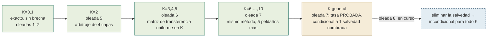
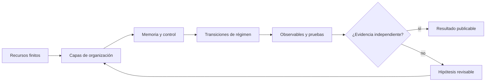
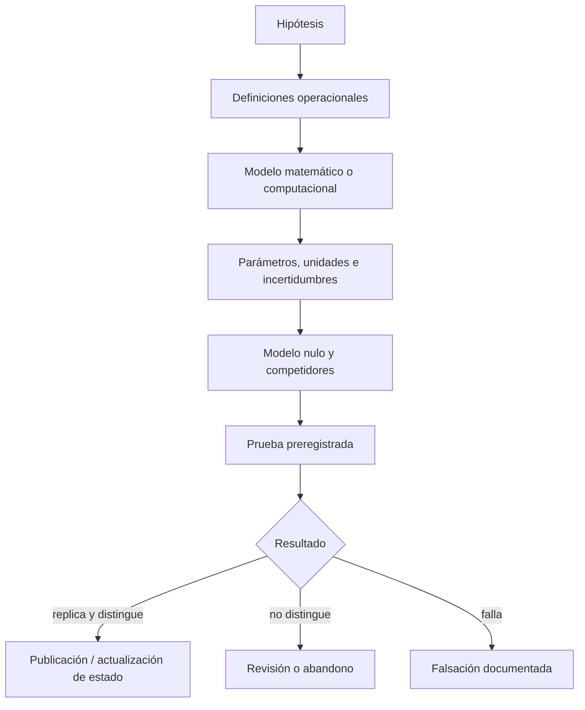

# Tamesis Discovery Lab — Archivo de Investigación Adversarial

[](RELATORIO_PROGRESSO_AUDITORIA_ARTIGOS.md)
[](RELATORIO_PROGRESSO_AUDITORIA_ARTIGOS.md)
[](05_DISCOVERY_LAB/01_PORTFOLIO/TEST_QUEUE.yaml)
[](05_DISCOVERY_LAB/00_GOVERNANCE/CLAIM_LEDGER.yaml)
[](05_DISCOVERY_LAB/00_GOVERNANCE/DECISION_LEDGER.yaml)
[%20limit%20law-closed--form%20%C2%B7%20adversarially%20verified-8c5a1f?style=for-the-badge)](tamesis-cycle-survival/)
[](PROJECT_STATE.json)
[](LICENSE)
[](README.md#governance-authorship-and-responsibility)
[](README.md)

**Idiomas:** [English](README.md) · [Português (BR)](README_PTBR.md) · [日本語](README_JA.md) · [中文（简体）](README_ZH.md) · **Español**

> **Un archivo de investigación interdisciplinario sobre información, geometría, transiciones de fase, sistemas complejos y cognición — con las hipótesis mantenidas explícitamente separadas de la evidencia.**

Este repositorio conserva la trayectoria completa del Laboratorio Tamesis: su rama experimental actual y sus líneas de investigación históricas, matemáticas, físicas, computacionales y cognitivas. El archivo contiene **280 registros auditados**, organizados en **274 dossiers de auditoría**. Auditar aquí no convierte la conjetura en hecho — hace explícito qué es una demostración, una consecuencia condicional, un ajuste numérico, una ilustración computacional, una conjetura o un escenario especulativo.

Desde 2026, el archivo también opera un **laboratorio de adjudicación continua** (`05_DISCOVERY_LAB`): cada afirmación cuantitativa que el propio archivo formula se cierra, una por una, contra referencias externas reales, bajo criterios preregistrados y **reproducción adversarial obligatoria**. El resultado hasta ahora — decenas de cierres negativos catalogados con veredicto final, y un resultado matemático positivo re-derivado de forma independiente y verificado adversarialmente — se sintetiza en el **[artículo del Discovery Lab](index.html)** (la página de inicio del repositorio).

## Lectura rápida

El informe institucional [Visión Final del Laboratorio Tamesis](RELATORIO_VISAO_FINAL_LABORATORIO_TAMESIS.md) expone las preguntas, respuestas, impactos, aplicaciones y nuevas preguntas producidas por el programa de investigación en su conjunto. También está disponible una [versión HTML/PDF lista para imprimir](RELATORIO_VISAO_FINAL_LABORATORIO_TAMESIS.html).

### Estado científico actual

| Capa | Estado | Interpretación correcta |
|---|---|---|
| Archivo y metodología | **Completo / auditado** | El inventario, la clasificación de afirmaciones, las fuentes y los criterios de falsación están todos registrados. |
| Modelos computacionales | **Congelados para auditoría** | Las salidas reproducibles deben leerse como salidas de modelo, no como constantes medidas. |
| Tamesis `M_c v1` | **Hipótesis comprobable** | El valor `M_c = 5.292674126388712e-16 kg` es un parámetro del modelo, no una medición. |
| Evidencia física independiente | **Aún no establecida** | Nada en este archivo constituye confirmación experimental de la ontología Tamesis. |
| Problemas del Milenio y afirmaciones de Teoría del Todo | **Sin resolver** | Estos textos son conjeturas, reducciones o argumentos de modelo restringido — no soluciones aceptadas. |
| Adjudicación numérica del núcleo | **Consolidación matemática completa, brecha cerrada incondicionalmente hasta K=10 (2026-08-22)** | Ver más abajo — 3 afirmaciones cerradas en negativo con veredicto final; la 4ª (`U₁/₂`) tiene un núcleo probado, arbitrado adversarialmente, con el Lema Abierto ahora probado incondicionalmente para `K=0,…,10`; para `K` general existe una demostración condicional de la conjetura de tasa (una salvedad de regularidad que un árbitro hostil juzgó correctamente delimitada), no un cierre incondicional. |

### El programa de adjudicación (Discovery Lab, actualizado el 2026-08-22)

`05_DISCOVERY_LAB` ejecuta una adjudicación continua de las afirmaciones cuantitativas de este archivo contra referencias externas reales (PDG, CODATA, Planck, SPARC, Gaia, Odlyzko), con la metodología fijada *antes* de cada cómputo, procedencia completa para cada valor de referencia, y **reproducción adversarial obligatoria** para todo hallazgo positivo. Registro completo: `05_DISCOVERY_LAB/01_PORTFOLIO/TEST_QUEUE.yaml` y `05_DISCOVERY_LAB/00_GOVERNANCE/DECISION_LEDGER.yaml`. Síntesis en formato de artículo: **[`index.html`](index.html)** (la página de inicio del repositorio).

```mermaid
flowchart LR
    R[280 registros de<br/>archivo auditados] --> S[Relevamiento Fase 0<br/>de todo el archivo<br/>19 candidatos, 7 áreas]
    S -->|18/19 rechazados,<br/>con motivo concreto citado| N1[CLOSED_NULL]
    S -->|1 pista inmadura<br/>promovida| L13[13 líneas de prueba<br/>formales del<br/>Discovery Lab]
    L13 --> C8[8 afirmaciones preregistradas<br/>cerradas + revisadas adversarialmente]
    C8 --> V1[1 resultado positivo probado<br/>ley límite U&#40;1/2&#41;]
    C8 --> V2[7 resultados negativos<br/>informativos — REFUTADO /<br/>INCONCLUSO / NULO]
    style V1 fill:#e8f0e0,stroke:#1f6f5c,stroke-width:2px
    style N1 fill:#f0e5e8,stroke:#7a3b4a
```



**El embudo de supervivencia completo (2026):**

| Línea | Probado | Resultado |
|---|---|---|
| Invariante entre dominios (TRI-RG) | 16 candidatos, 5 rondas | `CLOSED_NULL` — 0 sobrevivientes; 4 hallazgos con `p<0.05` refutados por reproducción adversarial (se demostraron explicaciones mundanas) |
| Cosmología SPARC/MOND + binarias anchas de Gaia | 4 pruebas preregistradas | 4/4 inconclusas por confusores reales demostrados; se descubrió que 2 resultados destacados heredados se apoyaban en **datos fabricados** y se rehicieron con datos reales |
| Ceros de la función zeta de Riemann (RH-REAL) | 12/12 ítems del relevamiento, todos finalmente resueltos | 2 hallazgos replicados (anti-agrupamiento de brechas consecutivas; escalamiento GUE `N^(-1/3)`); tanto los máximos FHK como la varianza del número de ceros cerraron como `CLOSED_INCONCLUSIVE`, cada uno con un componente fuerte confirmado adversarialmente (exclusión del lado iid ≥8.8σ; exclusión GUE ingenua de hasta 203σ — la reproducción adversarial además encontró y corrigió un 3er error real en el estimador primario) |
| Adjudicación de afirmaciones cuantitativas del núcleo (oleada 1) | 7 afirmaciones | `M_c` inconsistente (~190× entre valores); el modelo de masa quark/nudo falla la validación leave-one-out; `sin²θ_W=3/13` se desvía 7.5σ con ajuste manual codificado; `α⁻¹=Ω^{1.03}` con 0 grados de libertad; `n_s` del rebote no identificable; `Λ` holográfico ≡ `ρ_crit` por identidad algebraica |
| **Ley límite `U₁/₂` (oleadas 2–7, consolidada)** | 1 teorema + 1 generalización + casos del Lema Abierto `K=2,…,10` + conjetura de tasa para `K` general | **Probado, arbitrado adversarialmente (3 rondas independientes, técnicas distintas), publicado como artículo + paquete reproducible; `K=2` probado en la oleada 5, `K=3,4,5` en la oleada 6, `K=6,…,10` en la oleada 7, todos mediante el método de matriz de transferencia; la tasa para `K` general fue PROBADA en la oleada 7, explícitamente condicional a una salvedad de regularidad** (ver más abajo) |
| Relevamiento de candidatos en todo el archivo (Fase 0, más allá de TRI-RG) | 19 candidatos, 7 áreas | `CLOSED_NULL` — 18/19 rechazados con un motivo concreto citado; 1 pista inmadura (firmas espectrales de EEG cognitivo) promovida a una nueva línea, ver más abajo |
| Cognición — firma espectral de EEG en depresión (Mumtaz, `DISC-COGNITIVE-EEG-SPECTRAL-001`) | 1 preregistro cerrado, N=30 MDD/26 HC | `CLOSED_REFUTED` — la entropía espectral fue **mayor**, no menor, en MDD (`d=1.447`, `p=3.97×10⁻⁶`) — dirección opuesta a la hipótesis probada, confirmado por una reproducción adversarial independiente hecha desde cero (los números coinciden hasta <10⁻⁹) |
| Cosmología SPARC-004 — autocalibración de `f_multi` (Etapa 1→2) | Pipeline validado + aplicado a datos reales de descubrimiento (30,203 sistemas) | `CLOSED_INCONCLUSIVE` — veredicto mecánico `BOTH_FALSIFIED`, pero el paso obligatorio de refutación (debunker) encontró un confusor real: un subgrupo del 19% de la muestra (RUWE alto) está sistemáticamente subcorregido por el modelo `f_multi` de escalar único, con un exceso estadísticamente robusto incluso en el propio bin de anclaje de la calibración |

### El resultado positivo principal: una ley de universalidad exacta en forma cerrada

La clase de universalidad `U₁/₂` (una permutación aleatoria perturbada a una tasa `c/n` hacia una función aleatoria) tiene la ley límite exacta:

<p align="center"></p>

> `φ_∞(c) = ∫₀¹ e^(−ct²) dt = ½·√(π/c)·erf(√c)` — cero parámetros libres,

derivada analíticamente (no ajustada), corrigiendo la conjetura original del archivo `(1+c)^(-1/2)` (excluida ya en el primer coeficiente de la serie: `a₁ = 1/3 ≠ 1/2`, confirmado por enumeración exacta). Este resultado es ahora un **teorema probado**, no una conjetura: un documento matemático autocontenido (`THEOREM.md`) demuestra la forma cerrada en seis pasos, incluyendo el tratamiento correcto del *size-biasing* (sesgo por tamaño) de los arcos visitados, y fue revisado por un agente independiente actuando como árbitro hostil — **cero errores encontrados**.

El puente entre el modelo finito y el objeto límite está ahora probado para `K=0,…,10` de forma incondicional, y la conjetura de tasa para `K` general está probada condicional a una hipótesis de regularidad, nombrada con precisión y delimitada por un árbitro hostil:



Cada peldaño anterior fue re-derivado de forma independiente por un agente árbitro hostil distinto, usando una técnica de demostración *diferente* de la derivación original, su propia enumeración por fuerza bruta, y verificaciones completas de sustitución recursiva — **cero errores encontrados en ninguna capa**, a lo largo de 3 rondas de arbitraje independientes. `K=6,…,10` fue además confirmado bit a bit contra una enumeración exhaustiva nueva en dos puntos reservados. El único **Lema Abierto** restante — probado incondicionalmente hasta `K=10`, probado condicionalmente para `K` general — es el caso exacto de parámetro fijo de Hansen & Jaworski (EJC, 2014); una mezcla de Poisson con `erf` en forma cerrada no se encontró en una búsqueda bibliográfica sistemática (35+ consultas registradas), con la salvedad explícita de que esto no equivale a "novedoso". Un segundo frente derivó **por qué el exponente es exactamente 1/2**: a través de toda una familia paramétrica de mecanismos de perturbación, `α ∈ [1/2, 1]` siempre — `α < 1/2` está **probado imposible** (un efecto de agrupamiento cuadrático que persiste incluso sin ninguna "muerte" de ciclicidad). La oleada 5 también localizó y confirmó un mecanismo natural (`M-WEIB(β)`, riesgo de Weibull no homogéneo) que alcanza todo `α ∈ (1/2, 1)` intermedio. No se afirma ninguna implicación física — esto es matemática combinatoria pura sobre un ensemble específico.

**Dónde encontrar todo:** el teorema completo y los informes de arbitraje están en `05_DISCOVERY_LAB/02_TESTS/CORE_NUMERICS/u12_universality/theorem/`; la generalización y su verificación adversarial en `.../generalization_u_alpha/`; un **paquete reproducible independiente** — artículo en LaTeX compilado (PDF), demostraciones autocontenidas, simulaciones clean-room y 49 pruebas automatizadas — está en **[`tamesis-cycle-survival/`](tamesis-cycle-survival/)**. Y la tabla honesta de **todo lo que este laboratorio intentó y no sobrevivió** — para que este único resultado positivo se lea en el contexto correcto — está en **[`FAILED_HYPOTHESES.md`](FAILED_HYPOTHESES.md)**.

Un relevamiento honesto de todo el archivo Tamesis (no restringido a TRI-RG, 19 candidatos en 7 áreas) cerró `CLOSED_NULL` — 18/19 rechazados con un motivo concreto citado — y promovió la única pista inmadura encontrada (firmas espectrales de EEG cognitivo, depresión vs. ansiedad) a una nueva línea candidata. Su etapa de operacionalización está completa (observable definido como entropía espectral de Shannon normalizada, un modelo competidor nombrado, poder estadístico calculado, acceso a datos reales verificado para el brazo de depresión) — el brazo de ansiedad permanece bloqueado por un proveedor de datos que exige inicio de sesión humano, honestamente reportado como tal; no se ha computado ningún dato real allí. Ver `05_DISCOVERY_LAB/02_TESTS/ARCHIVE_PHASE0_SURVEY/SURVEY.md` y `05_DISCOVERY_LAB/02_TESTS/COGNITIVE_EEG_SPECTRAL/OPERATIONALIZATION.md`.

## Visión del laboratorio

El programa investiga si los sistemas bajo recursos finitos pueden construir capas adicionales de organización cuando el costo de esa complejidad se compensa con una reducción en el error, la disipación, la inestabilidad o el costo de búsqueda futuro. Este es un **principio de modelado**, no un propósito atribuido a la naturaleza.

El laboratorio conecta cuatro niveles:

1. **Matemática:** operadores, espectros, topología, grafos, universalidad y regularidad.
2. **Física fundamental:** información, geometría, holografía, gravedad, partículas y transiciones cuántico-clásicas.
3. **Sistemas complejos:** termodinámica, memoria, irreversibilidad, redes, estabilidad y control.
4. **Vida y cognición:** el organismo integrado, interfaces cerebro-computadora, conciencia y ecosistemas cognitivos.




<p align="center"><sub>Figura 1 — Ilustración de trabajo del principio holográfico. Esta es una hipótesis de modelado, no evidencia de que el universo sea holográfico o una simulación.</sub></p>

## Empezar aquí

- **[Artículo científico del Discovery Lab (2026) — adjudicación adversarial y la ley límite `U₁/₂`](index.html)** (página de inicio del repositorio)
- **[`tamesis-cycle-survival/`](tamesis-cycle-survival/) paquete reproducible** — artículo en LaTeX compilado, demostraciones, simulaciones y pruebas automatizadas para el teorema `U₁/₂`
- **[`FAILED_HYPOTHESES.md`](FAILED_HYPOTHESES.md)** — la tabla honesta de toda hipótesis probada y no sobreviviente en este laboratorio
- [Informe de visión final del laboratorio](RELATORIO_VISAO_FINAL_LABORATORIO_TAMESIS.md)
- [Versión HTML para presentación y PDF](RELATORIO_VISAO_FINAL_LABORATORIO_TAMESIS.html)
- [Informe de auditoría de 280 artículos](RELATORIO_PROGRESSO_AUDITORIA_ARTIGOS.md)
- [Protocolo de auditoría riguroso](PROTOCOLO_AUDITORIA_RIGOROSA_DE_ARTIGOS.md)
- [Manifiesto de inventario legible por máquina](ARTICLE_MANIFEST.csv)
- [Estado de congelamiento y condiciones de reanudación](PROJECT_FREEZE.md)
- [Estado del proyecto en JSON](PROJECT_STATE.json)
- [Línea de tiempo](00_HOME/TIMELINE.md)
- [Mapa del archivo](00_HOME/WORKSPACE_MAP.md)
- [Página de inicio navegable](00_HOME/README.md)
- [Atlas interactivo de hipótesis](atlas.html)
- [Mapa de dependencias de la demostración para la línea `U₁/₂`](05_DISCOVERY_LAB/02_TESTS/CORE_NUMERICS/u12_universality/PROOF_DEPENDENCY_MAP.md)

## Las líneas de investigación

| Línea | Pregunta central | Estado actual | Aplicaciones potenciales |
|---|---|---|---|
| **A. Fundamentos y la arquitectura de la realidad** | ¿Pueden la información, la geometría o el cómputo generar el espaciotiempo y las leyes efectivas? | Arquitectura conceptual y modelos candidatos. | Gravedad cuántica, geometría informacional, modelado de redes. |
| **B. Axiomas y puentes operacionales** | ¿Un conjunto reducido de axiomas reproduce las ecuaciones observadas sin ajuste sector por sector? | Cierre parcial y condicional. | Derivación de modelos, pruebas de consistencia, reducción de parámetros. |
| **C. TDTR, TRI e irreversibilidad** | ¿Cómo cambian los regímenes y por qué algunas transiciones son irreversibles? | Vocabulario, bibliotecas y modelos de transición. | Termodinámica, dinámica disipativa, flechas del tiempo. |
| **D. Universalidad** | ¿Comparten distintos sistemas invariantes y leyes de escala? | **Ley límite exacta de la clase `U₁/₂`, derivada y verificada adversarialmente (2026-08)**; la búsqueda empírica de un invariante entre dominios cerró nula (16/16). | Detección de transiciones, análisis de fallas, control adaptativo. |
| **E. Espectros y Riemann** | ¿Existe un operador cuyo espectro realice los ceros de zeta? | Ruta matemática legítima; sin demostración de la Hipótesis de Riemann. | Teoría espectral, caos cuántico, análisis numérico. |
| **F. Cómputo, grafos y números primos** | ¿Pueden codificarse estructuras aritméticas en grafos y sistemas computacionales? | Algoritmos y correspondencias exploratorias. | Aprendizaje sobre grafos, análisis de redes, algoritmos espectrales. |
| **G. Cosmología observacional** | ¿Qué observable distingue a Tamesis de `ΛCDM`, MOND y los modelos competidores? | Catálogo de pruebas; sin reemplazo empírico demostrado. | CMB, BAO, supernovas, lentes gravitacionales, SPARC, ondas gravitacionales. |
| **H. Agujeros negros y singularidades** | ¿Cómo abordan la información y la geometría los horizontes y las singularidades? | Modelos termodinámicos/holográficos especulativos. | Información cuántica, gravedad, termodinámica de horizontes. |
| **I. Partículas y topología** | ¿Puede la topología explicar masas, familias, mezcla y acoplamientos? | Mecanismos candidatos y relaciones numéricas. | Fenomenología de partículas y pruebas de precisión. |
| **J. Límite cuántico-clásico** | ¿Cuándo y por qué la dinámica cuántica se vuelve clásica? | Hipótesis y diseños experimentales en competencia. | Interferometría, optomecánica, metrología cuántica. |
| **K. Ecosistemas cognitivos** | ¿Cómo construyen los organismos perfiles de control, memoria y conciencia? | Agenda conceptual y programa empírico. | Neurociencia de redes, fisiología, interfaces cerebro-computadora. |
| **L. Topología cognitiva y cibernética híbrida** | ¿Pueden clasificarse los estados cognitivos mediante invariantes relacionales/espectrales? | Estructura teórica y prototipos de control. | Sistemas humano-máquina y robótica encarnada. |
| **M. Estabilidad y operadores** | ¿Detectan la coercitividad, la disipación y los márgenes espectrales los regímenes patológicos? | Métodos candidatos y teoremas restringidos. | Control de infraestructura, detección de anomalías, redes adaptativas. |
| **N. Problemas del Milenio** | ¿Puede la capacidad finita implicar teoremas sobre `P vs NP`, RH o EDPs? | Sin solución aceptada; argumentos restringidos. | Nuevos lemas matemáticos, no afirmaciones de resolución. |
| **O. Cosmologías especulativas e ingeniería métrica** | ¿Producen observables los rebotes, los universos padre o las métricas modificadas? | Escenarios especulativos. | Solo después de una solución covariante, estable y causal. |
| **P. Infraestructura científica** | ¿Cómo mantener la investigación interdisciplinaria reproducible y honesta? | Inventario y auditoría trazables. | Gobernanza, revisión, preprints, colaboración externa. |

### Potencial de finalización por línea (estimación operativa, no una métrica del archivo)

La tabla a continuación estima, línea por línea, **cuánto de la brecha nombrada en cada pregunta central ya ha sido caracterizada** — no la probabilidad de que la hipótesis sea correcta, ni una métrica calculada por el laboratorio. Es una lectura externa, calibrada contra el estado real documentado para cada línea (`RELATORIO_VISAO_FINAL_LABORATORIO_TAMESIS.md` §6 y `05_DISCOVERY_LAB/`), con una corrección importante al inventario original: **la Línea D debe leerse en dos partes.** El subconjunto `U₁/₂`, adjudicado rigurosamente por el Discovery Lab, está bien avanzado; pero la Línea D en su conjunto — que en el informe original también incluye `U₀`, `U₂`/Lindblad, el atlas de la clase general y las aplicaciones topológicas — **no** ha avanzado en la misma proporción: el propio relevamiento de todo el archivo del laboratorio (`DISC-ARCHIVE-PHASE0-SURVEY-001`) registra que `U₀` y `U₂`, a diferencia de `U₁/₂`, nunca llegaron a un candidato en forma cerrada. Tratar a "la Línea D" como resuelta al 85% sería exactamente el tipo de conflación que la disciplina de este archivo existe para prevenir.

| Puesto | Línea | Finalización estimada | Estado | Para cerrar |
|---:|---|---:|---|---|
| 🥇 | **D — `U₁/₂`** (subconjunto adjudicado, `DISC-CORE-NUMERICS-001`) | **~85%** | 🔥 Activo — Lema Abierto probado incondicionalmente para `K=0,…,10`, tasa para `K` general probada condicionalmente | Cerrar la salvedad de regularidad para `K` general **y** el residuo M-CLUST — los dos frentes en curso ahora (ver [mapa de dependencias](05_DISCOVERY_LAB/02_TESTS/CORE_NUMERICS/u12_universality/PROOF_DEPENDENCY_MAP.md)) |
| 🥈 | **P — Infraestructura** | **~90%** | 🔧 En curso — desde jul/2026 ganó una segunda capa: preregistro + reproducción adversarial obligatoria + libros de decisiones/afirmaciones (`05_DISCOVERY_LAB/00_GOVERNANCE/`) | Versionado semántico, datos/código abiertos, revisión externa |
| 🥉 | **B — Axiomas** | 35% | 🟡 Prometedor | Demostrar que los puentes preservan simetrías/conservación sin ajuste sector por sector |
| 4 | **E — Riemann** | 30% | 🟡 Exploratorio — desde jul/2026, los 12 ítems del relevamiento `RH-REAL` quedaron finalmente resueltos; 2 hallazgos replicados (anti-agrupamiento; escalamiento GUE), ninguno sobre la RH en sí | Operador autoadjunto cuyo espectro realice los ceros, con control de error completo |
| 5 | **M — Estabilidad** | 30% | 🟡 Exploratorio | Teorema acotado, hipótesis completas, comparación contra Lyapunov/LQR |
| 6 | **C — Irreversibilidad** | 25% | 🟡 | Una monótona no trivial + una clase de transición comprobable |
| 7 | **F — Grafos/primos** | 25% | 🟡 | Comparaciones de referencia y teoremas formales de correspondencia |
| 8 | **J — Cuántico-clásico** | 25% | 🟡 | Un protocolo ciego que separe decoherencia, colapso y gravedad |
| 9 | **L — Topología cognitiva** | 25% | 🟡 | Invariante definido + fiabilidad entre evaluadores + datos independientes |
| 10 | **A — Fundamentos** | 20% | ⚪ | Una acción mínima con grados de libertad, unidades y una nueva predicción |
| 11 | **G — Cosmología** | 20% | ⚪ — desde jul/2026, 4 pruebas preregistradas **ejecutadas** sobre datos reales (SPARC-001…004), todas `CLOSED_INCONCLUSIVE`; un hallazgo honesto de confusor por RUWE, no solo un catálogo de pruebas pendientes | Un observable que distinga a Tamesis de `ΛCDM`/MOND y sobreviva fuera de muestra |
| 12 | **I — Partículas** | 20% | ⚪ | Una acción de gauge completa + renormalización + unitariedad + una predicción de colisionador |
| 13 | **H — Agujeros negros** | 15% | ⚪ | Tensor métrico/energía-momento + causalidad + un observable de horizonte |
| 14 | **K — Cognición** | 15% | ⚪ — desde jul/2026, una hipótesis concreta fue probada y **refutada** adversarialmente (`DISC-COGNITIVE-EEG-SPECTRAL-001`: entropía espectral de EEG en depresión, efecto real en la dirección opuesta a la predicha); la pregunta amplia (control/memoria/conciencia) aún carece de un modelo único | Reducir a un fenómeno medible con una predicción reproducible |
| 15 | **O — Cosmologías especulativas** | 10% | ⚪ | Una solución covariante consistente antes que cualquier observable |
| 16 | **N — Milenio** | 5% | 🔴 — sin solución; esta línea está permanentemente fuera del alcance para afirmaciones de resolución | Un teorema completo y verificable para el problema original, no una heurística restringida |

**Cómo no usar esta tabla.** Un "85%" no significa una probabilidad del 85% de que la clase `U₁/₂` sea correcta, ni que la Línea D esté cerca de terminarse — significa que, de las brechas explícitamente nombradas en esa pregunta específica, la mayoría ya fue probada o caracterizada con precisión. Si el criterio es "dónde poner el esfuerzo de investigación ahora", la respuesta es la que ya guía al laboratorio: la mayor parte de la capacidad de investigación disponible se destina a `D — U₁/₂`, dividida exactamente entre los dos frentes ya en curso — cerrar el residuo M-CLUST y eliminar la salvedad de regularidad para `K` general.

## Un ciclo de investigación verificable



Este ciclo es la regla editorial del archivo. Una simulación que reproduce una curva no es automáticamente un descubrimiento; una coincidencia numérica no es una derivación; y una analogía entre sistemas no es una identidad física.

## Núcleo experimental actual: `Tamesis M_c v1`

La rama experimental actual está congelada en `frozen_and_ready`, con la calificación de hardware aún sin comenzar. El Demostrador A comienza con una calibración ciega de termometría óptica entre 5 K y 20 K; **aún no mide `M_c`**.

- [README de `Tamesis M_c v1`](01_TAMESIS_CORE/02_Experimental_Validation/Quantum_Classical_Transition/tamesis_mc_v1/README.md)
- [Informe de ejecución del Demostrador A v0.6](01_TAMESIS_CORE/02_Experimental_Validation/Quantum_Classical_Transition/tamesis_mc_v1/reports/DEMONSTRATOR_A_V0_6_EXECUTION_REPORT.md)
- [Salidas visuales, figuras y animaciones](02_TAMESIS_MC_V1_OUTPUTS/README.md)
- [Paquete de colaboración experimental](03_EXPERIMENTAL_COLLABORATION_PACKAGE/README.md)


<p align="center"><sub>Figura 2 — Mapa de límites usado como guía de pruebas. Las regiones y los marcadores representan hipótesis y datos de referencia; no constituyen confirmación de un límite universal.</sub></p>

## Sistemas complejos y transiciones


<p align="center"><sub>Figura 3 — Visualización conceptual de compresión, saturación y reorganización. Esta es una ilustración de modelo, no una ley empírica general.</sub></p>

El laboratorio usa un lenguaje común para comparar sistemas: **estado, recursos, acoplamientos, memoria, transición, disipación, estabilidad, observable y criterio de falla**. La comparación es metodológica — no afirma que una galaxia, una célula, un grafo y un cerebro sean el mismo tipo de objeto.

## Lo que el laboratorio ya logró

- un inventario y una auditoría completos y trazables de 280 registros;
- una separación explícita entre demostración, hipótesis, modelo, ajuste, simulación y escenario especulativo;
- un atlas de regímenes, transiciones, operadores, redes y sistemas cognitivos;
- un catálogo de pruebas observacionales y experimentales con modelos nulos;
- una versión institucional en HTML/PDF para presentación académica;
- la preservación de versiones históricas sin avalar sus afirmaciones como resultados vigentes;
- **adjudicación adversarial completa de las afirmaciones cuantitativas del núcleo** (2026): 30+ afirmaciones cerradas bajo criterios preregistrados, incluyendo la detección y corrección de 2 resultados destacados heredados construidos sobre datos fabricados;
- **un nuevo resultado matemático, derivado y verificado adversarialmente**: la ley límite exacta en forma cerrada `φ_∞(c) = ½√(π/c)·erf(√c)` de la clase `U₁/₂` (ver el [artículo](index.html));
- dos hallazgos replicados sobre los ceros reales de la función zeta de Riemann (anti-agrupamiento de brechas consecutivas; escalamiento GUE de la brecha mínima).

## Lo que aún no se ha demostrado

El archivo **no afirma** haber resuelto la Hipótesis de Riemann, `P vs NP`, Navier–Stokes, Yang–Mills, Hodge o Birch–Swinnerton-Dyer. Tampoco existe una demostración aceptada de que Tamesis reemplace a `ΛCDM`, elimine la materia/energía oscura, otorgue a la conciencia un rol causal en el colapso cuántico, permita la propulsión métrica, o pruebe que el universo es una simulación.

Estas líneas siguen siendo conjeturas, programas de prueba o modelos restringidos hasta que produzcan demostraciones formales, datos independientes, nuevas predicciones y replicación.

## Estructura del repositorio

| Carpeta/archivo | Función |
|---|---|
| `00_HOME` | Orientación, línea de tiempo y mapa del archivo. |
| `01_TAMESIS_CORE` | Teoría central, modelos, recursos y validación experimental actual. |
| `02_TAMESIS_MC_V1_OUTPUTS` | Copias convenientes de las figuras y animaciones de la rama `M_c v1`. |
| `03_EXPERIMENTAL_COLLABORATION_PACKAGE` | Materiales para la colaboración experimental y la calificación. |
| `05_DISCOVERY_LAB` | Laboratorio de adjudicación: cola de pruebas, libros de gobernanza, notas de metodología, resultados y veredictos adversariales. |
| `index.html` | **Artículo de síntesis del programa de adjudicación** (página de inicio; figuras y script generador en `ARTIGO_DISCOVERY_LAB/figures/`). |
| `tamesis-cycle-survival` | Paquete reproducible independiente para el teorema `U₁/₂` — artículo en LaTeX compilado, demostraciones, simulaciones clean-room y pruebas automatizadas. |
| `FAILED_HYPOTHESES.md` | Tabla completa y honesta de toda hipótesis/candidato que el Discovery Lab probó, sobreviviente o no. |
| `computational_freeze.html` | Página de inicio raíz anterior (estado congelado de Tamesis `M_c v1`), preservada. |
| `90_LEGACY` | Ramas históricas, reemplazadas, especulativas o actualmente sin soporte. |
| `RECURSOS_PARA_PESQUISA` | Materiales de referencia; no son evidencia producida por el proyecto. |
| `publicar` / `publicados` | Organización editorial de artículos destinados a publicación y ya publicados. |
| `ARTICLE_MANIFEST.csv` | Inventario de artículos legible por máquina. |
| `RELATORIO_PROGRESSO_AUDITORIA_ARTIGOS.md` | Seguimiento de auditoría artículo por artículo. |
| `RELATORIO_VISAO_FINAL_LABORATORIO_TAMESIS.html` | Documento institucional listo para PDF. |

## Gobernanza, autoría y responsabilidad

**Dirección científica, autoría principal y curaduría de este archivo:** **Douglas H. M. Fulber**.

El Laboratorio Tamesis se conduce como un programa de investigación independiente dentro de este repositorio. Las menciones a universidades, laboratorios, autores o DOIs en documentos históricos no implican aval institucional, coautoría o validación externa, salvo que exista autorización explícita y un registro de ello.

La gobernanza editorial sigue estas reglas:

1. el mantenedor responsable controla la clasificación de estados, la organización de las líneas y la aceptación de cambios estructurales;
2. las contribuciones externas son bienvenidas, pero no alteran la autoría, la procedencia o el estado de la evidencia sin una revisión registrada;
3. los nuevos resultados deben incluir método, datos/código cuando corresponda, incertidumbres, un modelo nulo, limitaciones y un criterio de falsación;
4. los documentos heredados se conservan por procedencia y no se promueven automáticamente a resultados válidos;
5. toda publicación derivada debe citar al laboratorio, al autor/curador y la versión específica del archivo utilizada.

Para proponer una colaboración o corrección, abra un issue/parche que documente: el archivo afectado, la justificación, las fuentes, el impacto en la clasificación y una prueba de verificación.

## Licencia y atribución

El material original de este archivo está disponible bajo [Creative Commons Atribución 4.0 Internacional (CC BY 4.0)](LICENSE), salvo que se indique lo contrario en el propio archivo o esté sujeto a derechos de terceros. La licencia permite compartir y adaptar el material siempre que se preserve la atribución y se indiquen las modificaciones.

Forma de atribución recomendada:

> Douglas H. M. Fulber, Tamesis Laboratory — *Tamesis Research Archive*, versión/commit utilizado, con licencia CC BY 4.0: [repositorio](.).

Al reutilizar una figura, conserve el pie de figura, la ruta del recurso y la indicación de que se trata de una visualización de modelo cuando esa sea su clasificación registrada. Las imágenes, datos o textos de terceros pueden estar sujetos a sus propias condiciones; CC BY 4.0 no transfiere derechos que el laboratorio no posea.

## Integridad y límites de uso

- No presente las conjeturas del archivo como hechos establecidos.
- No use la presencia de un DOI como prueba de revisión por pares o validación experimental.
- No atribuya aval institucional a universidades o grupos citados sin autorización formal.
- No oculte limitaciones, parámetros ajustados, resultados negativos o condiciones de falla.
- No use este material como asesoramiento médico, legal, financiero o de seguridad sin una evaluación profesional independiente.

## Cómo citar este archivo

```text
Fulber, Douglas H. M. (2026). Tamesis Research Archive: Tamesis Laboratory — vision, audit, and research program. CC BY 4.0.
```

## Contacto y colaboración

El punto de entrada recomendado es un issue documentado en este repositorio. Para presentación académica, use el [informe institucional en HTML/PDF](RELATORIO_VISAO_FINAL_LABORATORIO_TAMESIS.html) y el [informe completo en Markdown](RELATORIO_VISAO_FINAL_LABORATORIO_TAMESIS.md), preservando siempre la clasificación de evidencia indicada.
