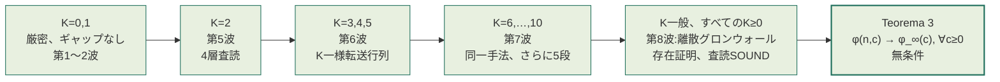
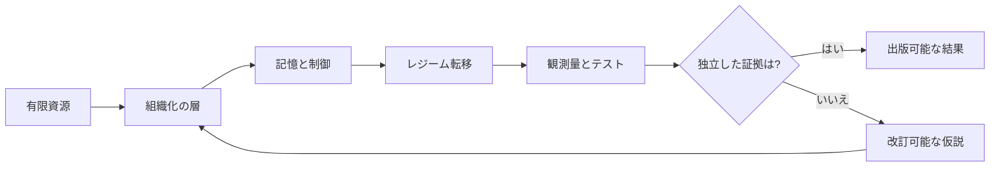
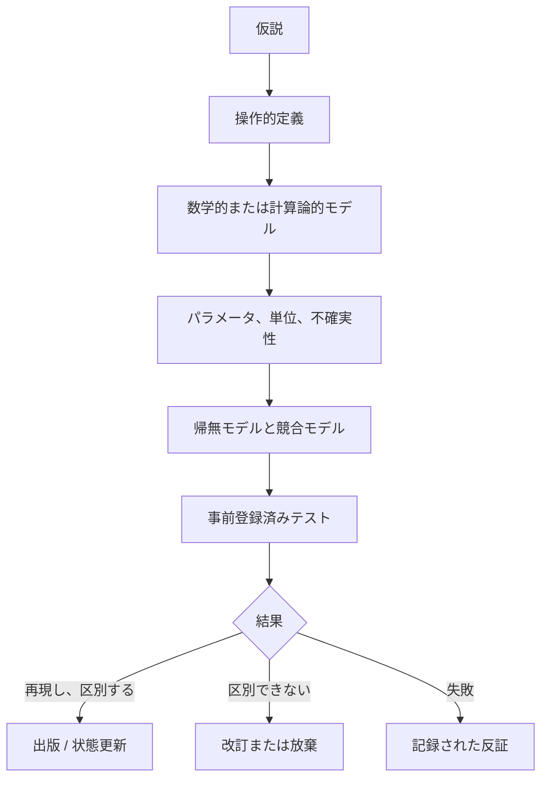

# Tamesis Discovery Lab — 敵対的検証研究アーカイブ

[](RELATORIO_PROGRESSO_AUDITORIA_ARTIGOS.md)
[](RELATORIO_PROGRESSO_AUDITORIA_ARTIGOS.md)
[](05_DISCOVERY_LAB/01_PORTFOLIO/TEST_QUEUE.yaml)
[](05_DISCOVERY_LAB/00_GOVERNANCE/CLAIM_LEDGER.yaml)
[](05_DISCOVERY_LAB/00_GOVERNANCE/DECISION_LEDGER.yaml)
[%20limit%20law-closed--form%20%C2%B7%20unconditional%20%C2%B7%20adversarially%20verified-8c5a1f?style=for-the-badge)](tamesis-cycle-survival/)
[](PROJECT_STATE.json)
[](LICENSE)
[](README.md#governance-authorship-and-responsibility)
[](README.md)

**言語:** [English](README.md) · [Português (BR)](README_PTBR.md) · **日本語** · [中文（简体）](README_ZH.md) · [Español](README_ES.md)

> **情報、幾何学、相転移、複雑系、認知を対象とする学際的研究アーカイブ ― 仮説と証拠を明確に区別して管理する。**

本リポジトリは、Tamesis Laboratory の全軌跡 ― 現在の実験ブランチ、および歴史的・数学的・物理的・計算論的・認知的な各研究ラインを保存するものである。アーカイブには**監査済み記録280件**が収められており、**274件の監査ドシエ**に整理されている。ここでの監査は、憶測を事実に変えるものではない ― 何が証明であり、何が条件付きの帰結であり、何が数値フィットであり、何が計算上の例示であり、何が憶測であり、何が思弁的シナリオであるかを明示するものである。

2026年以降、アーカイブは**継続的な判定ラボ**(`05_DISCOVERY_LAB`)も運営している。ここでは、アーカイブ自身が行うすべての定量的な主張が、事前登録された基準と**必須の敵対的再現**のもとで、実際の外部参照データと照合されて一つずつ決着させられる。これまでの成果 ― 最終判定付きで一覧化された数十件の否定的クロージャと、独立に再導出され敵対的に検証された1件の肯定的な数学的結果 ― は**[Discovery Labの論文](index.html)**(本リポジトリのランディングページ)にまとめられている。

<p align="center"></p>

## Discovery Engine(発見エンジン):ロードマップの第1〜3a段階、構築・テスト済み

**[`06_DISCOVERY_ENGINE/`](06_DISCOVERY_ENGINE/README.md)** は、`ROADMAP.md` の最初の3段階を、実際にテストされたPythonコードへと落とし込んだものである。第1段階(仮説レジストリ、実験ランナー、再現エンジン、敵対的レビュアー、決定台帳)、第2段階(記号数学、モンテカルロ・ラボ、データセット・オブザーバトリー、Lean4形式証明ブリッジ、普遍性アトラス)、第3a段階(仮説エンジン、数学的発見エンジン)にまたがる**12モジュール**――第3段階で名指しされた8製品のうち、バックエンドモジュールとして誠実に構築可能だった2製品――である。

これがマーケティング上の主張ではなく信頼に値する理由:3段階を通じて**220/220件のテストが合格**しており、各段階はそのコードを書いていないエージェントによる専用の敵対的レビューを経て終了し、その後オーケストレーション用セッション自身によって独立に三度目の再検証が行われている。要求される受け入れベンチマークは、本アーカイブ自身が証明済みの `U₁/₂` の結果――`φ_∞(c)`、`M_K` 分布、有限 `n` 補正、`γ=c/n` スケーリング領域――を、`05_DISCOVERY_LAB` からのインポートも一切の手助けもなしに、独立実装によって最初から最後まで再現する。敵対的レビューは単なる形式ではなかった。第1段階の台帳のハッシュチェーンに実在するテール改ざんの隙(最新エントリを保護すべき後続エントリが存在しなかった)を発見し、第3a段階の仮説エンジン自身のドキュメントにあった「回避不可能」という誤った主張を発見した――いずれも、本アーカイブが自らの数学的誤りに適用してきたのと同じ、日付入り「correção(訂正)」の作法で公然と修正されており、こっそり書き換えられたわけではない。

3つの要素は明示的に**未構築**であり、ごまかさず「保留」として台帳に記載されている:シミュレーション・ラボ(実際のビジュアルなエージェントベース/ネットワークシミュレーション環境はGUI開発の領域であり、上記のモジュールと同じ方法でテストスイートによって検証できるものではない)、オブザーバトリーのライブ外部データ取得機能(この環境が前提とすべきでないネットワークアクセスとAPI認証情報を必要とする)、そして第4段階の統合アーキテクチャ「Tamesis OS」(インフラのスタック選定という決定に阻まれている――`ROADMAP.md` 自身が候補スタックを「未評価……何一つ確定していない」と呼んでいる――残作業量の問題ではない)。これはソフトウェアの正しさに関する作業であり、新たな数学的・物理的主張ではない――`05_DISCOVERY_LAB` のガバナンス台帳には記載されず、いかなるミレニアム懸賞問題の主張としてもカウントされない。詳細は **[`06_DISCOVERY_ENGINE/README.md`](06_DISCOVERY_ENGINE/README.md)** と **[`GOAL.md`](GOAL.md)** を参照。

## クイックリード

制度報告書『[Tamesis Laboratoryの最終ビジョン](RELATORIO_VISAO_FINAL_LABORATORIO_TAMESIS.md)』は、研究プログラム全体が生み出した問い、答え、影響、応用、そして新たな問いを提示している。[印刷用HTML/PDF版](RELATORIO_VISAO_FINAL_LABORATORIO_TAMESIS.html)も利用可能である。

### 現在の科学的状態

| 階層 | 状態 | 正しい解釈 |
|---|---|---|
| アーカイブと方法論 | **完了 / 監査済み** | 目録、主張の分類、出典、反証基準がすべて記録されている。 |
| 計算モデル | **監査のため凍結** | 再現可能な出力は、測定された定数としてではなく、モデルの出力として読むべきである。 |
| Tamesis `M_c v1` | **検証可能な仮説** | 値 `M_c = 5.292674126388712e-16 kg` はモデルパラメータであり、測定値ではない。 |
| 独立した物理的証拠 | **未確立** | 本アーカイブ内のいかなる内容も、Tamesis存在論の実験的確認ではない。 |
| ミレニアム懸賞問題およびTOE(万物の理論)の主張 | **未解決** | これらの文書は憶測、還元、あるいは制限モデルによる論証であり、承認された解ではない。 |
| コア数値判定 | **数学的統合が完了 ― 予想1と予想2が現在、すべての `K` について証明されている(2026-08-26)** | 下記参照 ― 3件の主張が最終判定とともに否定的にクローズされた。4件目(`U₁/₂`)は、証明済みの中核部分を持ち、独立に何度も敵対的査読を受けており、未解決補題(Open Lemma)とレート予想はすべての `K≥0` について無条件に証明され(2026-08-22)、最良のレート定数 `a*` が証明されて `n` 有限の明示的な評価式へと組み立てられ(2026-08-25)、`γ=c/n` のスケーリング法則がすべての `γ∈(0,1]` について証明され(2026-08-26)、そして予想1と予想2 ― 完全な分布法則とそのポアソン混合 ― の両方が有限個のインスタンスの列挙ではなく、**すべての** `K≥1` について証明されている(2026-08-26)。 |

### 判定プログラム(Discovery Lab、2026-08-28更新)

`05_DISCOVERY_LAB` は、本アーカイブの定量的な主張を実際の外部参照データ(PDG、CODATA、Planck、SPARC、Gaia、Odlyzko)と照合して継続的に判定する。方法論は各計算の*前に*固定され、すべての参照値には完全な出所情報が付与され、肯定的な発見にはすべて**必須の敵対的再現**が課される。完全な記録は `05_DISCOVERY_LAB/01_PORTFOLIO/TEST_QUEUE.yaml` および `05_DISCOVERY_LAB/00_GOVERNANCE/DECISION_LEDGER.yaml` にある。論文形式のまとめは **[`index.html`](index.html)**(本リポジトリのランディングページ)を参照。


**完全な生存ファネル(2026年):**

| ライン | テスト内容 | 結果 |
|---|---|---|
| 分野横断不変量(TRI-RG) | 候補16件、5ラウンド | `CLOSED_NULL` ― 生存者0件。`p<0.05` の発見4件は敵対的再現によって反証された(平凡な説明が実証された) |
| SPARC/MOND宇宙論 + Gaia広域連星 | 事前登録済みテスト4件 | 実在する交絡因子が実証されたことにより4/4件が不確定。従来の目玉となる結果2件が**捏造データ**に基づいていたことが判明し、実データで再実施された |
| リーマンゼータ零点(RH-REAL) | 調査項目12/12件、すべて最終的に決着 | 複製された発見2件(連続ギャップの反クラスタリング、`N^(-1/3)` のGUEスケーリング)。FHK最大値と数分散はいずれも `CLOSED_INCONCLUSIVE` としてクローズされたが、それぞれ敵対的に確認された強力な構成要素を持つ(iid側の除外 ≥8.8σ、素朴GUEの除外 最大203σ ― 敵対的再現によって、主推定量における3件目の実在するバグがさらに発見・修正された) |
| コア定量的主張の判定(第1波) | 主張7件 | `M_c` は値間で不整合(~190倍の差);クォーク/ノット質量モデルはleave-one-out検証に失敗;`sin²θ_W=3/13` はハードコードされた調整により7.5σずれている;`α⁻¹=Ω^{1.03}` は自由度0;バウンス宇宙論の `n_s` は同定不能;ホログラフィックな `Λ` は代数的恒等式により `ρ_crit` と等価 |
| **`U₁/₂` 極限法則(第2〜17波、統合)** | 定理1件 + 一般化1件 + 未解決補題(Open Lemma、すべての `K≥0`)+ 予想1と予想2(すべての `K≥1`)+ 最良レート + `γ`スケーリング法則 | **証明済み、敵対的査読済み(独立した多数のラウンド、毎回異なる手法)、論文+再現可能パッケージとして公開。未解決補題(Open Lemma)とレート予想はすべての `K` について無条件にPROVED(第8波、2026-08-22);予想1の完全な密度 `f_{M_K}(x)=2Kx(1-x²)^{K-1}` とそのポアソン混合である予想2が、`K=2,3,4`(第14〜16波)における個別の `K` ごとの決着を経て、すべての `K≥1` について一挙にPROVED(第17波、2026-08-26);最良のレート定数 `a*` がPROVEDされ、`n` 有限の明示的な評価式へと組み立てられた(第17波、2026-08-25);`γ=c/n` のスケーリング法則がすべての `γ∈(0,1]` についてPROVED(第17波、2026-08-26)**(下記参照) |
| アーカイブ全体の候補調査(フェーズ0、TRI-RGを超えて) | 候補19件、7分野 | `CLOSED_NULL` ― 18/19件が具体的な理由とともに却下。未成熟なリード1件(認知EEGスペクトルシグネチャ)が新規ラインに昇格、下記参照 |
| 認知 ― うつ病におけるEEGスペクトルシグネチャ(Mumtaz、`DISC-COGNITIVE-EEG-SPECTRAL-001`) | ロック済み事前登録1件、N=30(MDD)/26(HC) | `CLOSED_REFUTED` ― スペクトルエントロピーはMDDにおいて低いのではなく**高い**(`d=1.447`、`p=3.97×10⁻⁶`)― 検証された仮説とは逆方向であり、ゼロから独立に行われた敵対的再現によって確認された(数値は<10⁻⁹の精度で一致) |
| SPARC-004宇宙論 ― `f_multi` 自己較正(ステージ1→2) | パイプライン検証済み+実発見データ(30,203系)に適用 | `CLOSED_INCONCLUSIVE` ― 機械的判定は `BOTH_FALSIFIED` だが、必須のデバンカー(反証)パスにより実在する交絡因子が発見された:サンプルの19%を占めるサブグループ(高RUWE)が単一スカラーの `f_multi` モデルによって系統的に補正不足となっており、較正自身のアンカー・ビンにおいてすら統計的に頑健な超過が見られる |
| シューマン共鳴のスペクトルピーク (`DISC-SCHUMANN-RESONANCE-001`) | 実際のELF磁力計データ、シエラネバダ観測所(Zenodo)、3日間×2チャンネル、6/6ケース | `判別不能`(NÃO DISTINGUE) ― 期待される位置(7.8–8.0 Hz)にすべてのケースで実際の広いスペクトルの盛り上がりが存在するが、卓越度(1.22×–1.44×)は事前登録された3倍の閾値に届かない;ビット単位で一致する敵対的再現、神経接続に関する主張は一切行われていないし不可能 |
| IIT/Φ再現性 ― 標準ABCネットワーク (`DISC-IIT-PHI-REPRO-001`) | Oizumi, Albantakis & Tononi (2014) 図4のネットワークのPyPhiによる再現 | `確認済み`(CONFIRMED) ― Φ=1.916666、公表値1.916665との差は完全に独立した2つのインストール間で有効数字16桁までビット単位で一致;これは定義済み指標の再現性チェックであり、意識に関するいかなる主張の検証でもない |
| 自由エネルギー原理 ― 反証可能な対象の探索 (`DISC-FEP-PREDICTIVE-CODING-001`) | フェーズ0の文献調査、一次資料レベルまで検討した4つの候補 | `対象外として終了`(CLOSED_OUT_OF_DOMAIN) ― 3つの要件(閉形式の予測、名指しされた外部の競合モデル、公開データセット)をすべて満たす対象は見つからなかった;検討した論文の1つは、その本文中で自由エネルギー原理が「観測されたいかなる生物学的データも説明しうる」と認めている |
| Lean4における非古典論理 ― プリーストのLP(矛盾許容論理) | 6ファイル、876行、12のメタ定理、`lake build`はクリーン | 爆発律、モーダスポネンス、選言三段論法がLPのもとで無効であることが証明された(矛盾許容性の中心的な結果);古典論理への還元定理が真の双方向`iff`として証明された;敵対的レビュー済み、ドキュメントのみの修正を1件適用 |

これら4件のラインは、心の哲学、認知科学、地球物理学、形式論理学の主張に同じ規律を適用する姉妹プログラムの端緒である ― 項目ごとの完全な対応表は**[`PROGRAMA_CONSCIENCIA_LOGICA_E_REALIDADE.md`](PROGRAMA_CONSCIENCIA_LOGICA_E_REALIDADE.md)**を参照。反証不可能であるとして意図的に除外された対象(事実としての汎心論、「神が熱力学的平衡である」という主張、検証可能な命題としてのシミュレーション仮説、その他)とその理由も、そこに記載されている。

### 目玉となる肯定的結果:厳密な閉形式の普遍性法則

`U₁/₂` 普遍性クラス(レート `c/n` でランダム写像へと摂動されたランダム置換)は、次の厳密な極限法則を持つ:

<p align="center"></p>

> `φ_∞(c) = ∫₀¹ e^(−ct²) dt = ½·√(π/c)·erf(√c)` ― 自由パラメータはゼロ、

この法則は(フィットではなく)解析的に導出されたものであり、アーカイブの当初の憶測であった `(1+c)^(-1/2)`(最初の級数係数の時点で既に排除されている:`a₁ = 1/3 ≠ 1/2`、厳密な数え上げにより確認)を訂正するものである。この結果は今や憶測ではなく**証明済みの定理**である:自己完結した数学文書(`THEOREM.md`)が、訪問済みアークの*サイズバイアス*の正しい取り扱いを含め、6段階でこの閉形式を証明しており、敵対的査読者として振る舞う独立エージェントによってレビューされた ― **誤りはゼロ件**。

有限モデルと極限対象の間の橋渡しは、現在**すべての `K≥0` について無条件に**証明されている ― `φ(n,c) → φ_∞(c)`(`n → ∞` のとき)が、固定されたすべての `c ≥ 0` について、未証明の仮説を一切残すことなく成り立つ(`THEOREM.md`、「Teorema 3」):



上記の各段は、それぞれ独立した敵対的査読者エージェントによって、元の導出とは*異なる*証明手法、独自のブルートフォース列挙、および完全な再帰代入チェックを用いて独立に再導出された ― 独立した4ラウンドの査読を通じて、**いかなる層でも誤りはゼロ件**であった。`K=6,…,10` については、2つのホールドアウト点における新規の網羅的列挙とビット単位で一致することもさらに確認された。最後の段は、残されていた唯一の名指しされたギャップを解消するものであった:敵対的査読者がゼロから独立に、有限 `n` の2項展開が11個の具体的に検証された値だけでなく*すべての* `K` について存在することを証明する厳密な離散グロンウォール帰納法を再導出した ― 判定は**SOUND、名指しされた問題点あり**(4件発見、いずれも致命的ではなく、日付入りの補遺により訂正済み)であった。**未解決補題(Open Lemma)**― 現在すべての `K` について無条件に証明されている ― は、Hansen & Jaworski(EJC、2014年)の厳密な固定パラメータケースである。閉形式の `erf` を伴うポアソン混合は、体系的な文献調査(35件以上のクエリを記録)では見つからなかったが、これが「新規性」と同義ではないという明示的な留保が付されている。第二の戦線では、**なぜ指数がちょうど1/2なのか**が導出された:摂動機構のパラメトリックな族全体にわたって、`α ∈ [1/2, 1]` が常に成り立ち ― `α < 1/2` は*証明により不可能*であることが示された(いかなる周期性の「消滅」がなくても持続する二次的クラスタリング効果による)。第5波では、中間のあらゆる `α ∈ (1/2, 1)` に到達する自然な機構(`M-WEIB(β)`、非斉次ワイブル・ハザード)も特定・確認された。物理的な含意は一切主張されていない ― これは特定のアンサンブルに関する純粋な組合せ数学である。

**全次数にわたる閉形式(2026-08-23)。** 上記のすべての段 ― `K=0,…,10`、`K` 一般への橋渡し、有限 `n` の誤差定数 ― は、今や単一の厳密な公式の系となった。同じ漸近展開の手法を*記号的な*次数指数へと拡張したところ、各次数の係数がまさに符号なし第一種スターリング数であることが明らかになった。これらはちょうど上昇階乗冪の係数と一致するため、無限級数展開全体が ― 漸近的にではなく、厳密かつ有限の形で(`K+1` 項で終わる)― 再総和されることになる。この結果は、すべての `n`、`K`、およびオフセットパラメータについて、根底にある再帰式を表す単一の有限かつ完全に明示的な式であり、展開の仕組みを一切必要としない独立した初等的証明も付されている。専任の敵対的査読ラウンドが、独自にゼロから構築したシミュレータに対して両方の証明をゼロから再導出し(215,070件の厳密な照合、不一致ゼロ)、この見出しの主張を確認するとともに、二次的な否定的主張における実際の誤りを1件発見し(日付入りの補遺により訂正済み)、さらに元の文書が意図的に未証明のまま残していた2つの保守的なラベルについても、査読者自身がそれらを完全に証明した。詳細は `THEOREM.md` の「Estágio 9」を参照。

**パラメータ範囲全体における一様収束(2026-08-23)。** 上記の定理は、固定された各 `c` について `φ(n,c) → φ_∞(c)` であることを述べているに過ぎない ― 一度に1つの `c` についてのみである。別の研究戦線が、要求されていた以上に徹底的にこのギャップを解消した:収束はコンパクトな範囲 `[0,C]` だけでなく、*半直線全体* `[0,∞)` において一様であり、いずれも上記の仕組みを一切必要としない2つの短い初等補題 ― リプシッツ結合(Lipschitz coupling)と `n` に一様なテイル評価(uniform-in-`n` tail bound)― から無条件に証明された。おまけとして、厳密な一次誤差プロファイルも閉形式で導出された。敵対的査読ラウンドは、2つの新しい補題と2つの無条件定理を最も強く攻撃したが、いずれにも誤りは見つからなかった。唯一の実質的な発見は、既に条件付きである二次的な結果においてどの具体的なギャップが未解決のままかを訂正するものであり、そのギャップに関するアーカイブ自身の記述を、より不正確にではなくむしろより正確にした。詳細は `THEOREM.md` の「Estágio 10」を参照。

**予想1 ― 完全な分布法則、今やすべての `K≥1` について証明済み(2026-08-26)。** 上記の平均 `φ_∞(c)` に加えて、本アーカイブはちょうど `K` 回の迂回を条件とする巡回質量の*完全な密度*を予想している:`f_{M_K}(x) = 2Kx(1-x²)^(K-1)`。`K=2` は第14波で決着し、`K=3` は第15波で予想外に決着し、`K=4` は第16波で決着した ― いずれも組合せ爆発という診断に反する連続した予想外の結果であり、サイクル外の相殺の背後にある重み付き森の恒等式 `E(E+Q)^{n−1}=E` が、一般の議論のための候補ルートとして名指しされていた。第17波のフロント(a)はそのルートを最後まで辿った:`K=1..4` の系列における `K` 個別の要素 ― 標識付き間隔の補題、テレスコープ剥離、目的地機構の公式、そして重み付き森の恒等式そのもの ― がすべて記号的な `K` へと一般化され、**予想1がすべての `K≥1` について一挙に証明**された。この結果は、このライン全体がすでに依拠している唯一の古典的引用(`PD(1)` のサイズバイアス/残差性)に条件付きであり、固定された `K` ごとに最大 `K−1` 回まで再帰的に適用される。系として、**予想2**(完全な無条件法則、`M(c) =_d min(1,√(E/c))`)も同じ水準で**今や証明されており**、既に引用されているポアソン混合の代数を通じて、`E[M(c)²]=(1−e^{−c})/c` と `E[M_K²]=1/(K+1)` をすべての `K` について無条件に閉じている。個別の `K` から一般の `K` への飛躍(テレスコープ剥離における残差独立性)を攻撃するよう特に指示された強化型の敵対的査読者は、議論全体をゼロから再構築し ― フロント自身の対象範囲を一歩超えた `K=6` におけるゼロからの検証も含めて ― 数学的な誤りを一切発見しなかった。詳細は `THEOREM.md` の「Estágio 24」を参照:

<p align="center"></p>

**最良定数 ― 上限は今や証明済み:`sup_K M_K/√K = a*`(2026-08-25)。** `THEOREM.md` は `lim_{K→∞} M_K/√K = a* ≈ 0.367` を厳密に証明しており(Estágio 13)、2つのルートの失敗を経た3回目の試みで、第16波のフロント(b)が上限も決着させた:すべての `K≥1` について `M_K < a*√K` が*厳密に*成り立ち、したがって上限は極限に等しい(Estágio 19 ― Robbins 1955、Ramanujan `Q` 関数に対するFlajolet–Grabner–Kirschenhofer–Prodingerの両側評価、および古典的な厳密恒等式による;境界ケースは敵対的査読者自身によって決着され、独立に再検証された)。仮説(U')は今や、非最良の `a=1+√(π/2)≈2.253` に代わって最良定数 `a*` を保持している。第17波のフロント(b)は、残された唯一の機械的な作業を実行した:Estágio 12の組み立てを `a*` で再実行することで**Teorema R**、すなわち `n` 有限に対する最良の明示的レートが得られる:`n≥4`、`0≤c≤n` において `|φ(n,c)−φ_∞(c)| ≤ [a*√c+κ_B]/n` が厳密に成り立ち、加法定数 `κ_B≈0.2805` は不変で純粋な有理数演算によって証明されており、`c=n` に沿って漸近的にタイトである(Estágio 22):

<p align="center"></p>

**γスケーリング法則 ― すべての `γ∈(0,1]` について証明済み(2026-08-26)。** 第4波(Estágios 10〜13)以来の別個の未解決事項:固定された `c` だけでなく、固定された比 `γ=c/n` について `φ(n,γn)/φ_∞(γn) → √(2/(2−γ))` は成り立つのか? 第17波のフロント(e)はこれを完全に証明した ― モデルの定義から直接導出された、`φ(n,qn)` に対する `n` 有限の厳密な二重和公式(まったく新規)を用い、この特定の比の極限に対して構造的に弱すぎると診断・確認されたEstágio 9/12/22の仕組みをあえて再利用しなかった。両方のボーナス目標も決着した:コンパクト集合 `[γ₀,1]` 上での一様性、そして `γ_n n^{1/3}/ln n→∞` を満たす `γ_n→0` の極限である。敵対的査読者はコードを書く前に手作業で中核公式を再導出し ― 良いクロスチェックの例として ― 査読者と統括セッションの両方が、結果を確認する前に、それぞれの検証スクリプトにおいて*同種の*致命的な浮動小数点アンダーフローのバグを独立に発見・修正した。詳細は `THEOREM.md` の「Estágio 23」を参照:

<p align="center"></p>

**2点結合則に関する新定理 ― 証明済み(2026-08-26)。** 別の研究戦線が、Estágio 18で特定された障害 ― 2つの基準点を同時に探索する結合則 ― に取り組んだ。その2つの数値目標は、無関係な経路により、上記の一般`K`の結果によってすでに決着していた ― 矛盾はない。これは、同じ/異なるサイクルへの分割からそれらの目標への近道が存在しないことを、当の戦線自身がすでに示していたためである。この戦線が実際に証明した新しい成果は、**一様巡回制限定理**である ― いずれかのサイクルに最終的に属する点の集合を条件として、その実現された巡回集合上に誘導される置換は、有限な`n`、`K`のいずれについても、可能なすべての順序にわたって厳密に一様分布する ― という定理であり、両方が巡回的に生き残ったという条件のもとで2点が同じ最終サイクルに属する確率がちょうど半分であるという厳密な系を伴う。敵対的査読者は、定理とその最もリスクの高い補題を手作業で独立に再導出したのち、戦線自身がカバーしていたよりも多くのケースにわたる網羅的検証を実行し、誤りを発見しなかった。詳細は `THEOREM.md` の「Estágio 25」を参照。

**第18波 ― 3件の誠実な未決着、いずれも真の無条件の進展を伴う(2026-08-26)。** 3つの追加戦線がそれぞれ上記で未解決のまま残された項目に取り組んだが、いずれも中心的な使命を決着させることはなかった。しかし各戦線は、残された困難がどこにあるのかを正確に切り分けた。スケーリング則`γ`の第2項`C(γ)`(Estágio 23以来未解決)について:補題Eは`C(γ)`と厳密な和`S_n`に関する命題との厳密な同値性を証明し、補題D0はその「決定論的半分」の閉形式`D_0(γ)=(γ-1)/(2(2-γ))`を、すべての`γ∈(0,1]`について、ポアソン総和/ヤコビのテータ変換 ― このラインでは新しい手法 ― により与える。残る「困難な半分」に対する第2の独立したヒューリスティック導出は、第17波ですでに予想されていた閉形式と記号的に厳密に一致する。`C(γ)`は`γ∈(0,1)`について未解決のままである。詳細は `THEOREM.md` の「Estágio 26」を参照。分布論的橋渡し`n→∞`、`M_n(c)→_d M(c)`(Estágio 6以来未解決、定理1によってすでに決着した平均とは別物)について:`K=0,1`の場合は、有限`n`におけるCDF混合の厳密な恒等式(命題D0)、アーカイブのポアソン混合論法をCDFレベルへ完全に引き上げたもの(補題R)、そしてこのラインで初めての2次モーメント/揺らぎの結果を系として含む厳密な閉形式`P(M_n^{(1)}≤k/n)=k(k+1)/n²`(命題D1) ― さらに2次モーメントの収束を単一のスカラーに帰着させる一般`K`の還元(補題P2) ― により、今や無条件に決着した。`K≥2`は未解決のままである。詳細は `THEOREM.md` の「Estágio 27」を参照。定理Jの連続体ネイティブ版(Estágio 25 §6.3で直接試みられ、そこで未解決のまま残されたもの)について:直接構成は未解決のままであるが、定理Jの系(Estágio 25)がすべての有限`n`において漸近的にではなく厳密な恒等式であることを利用した真の「転送による」バイパスにより、新しい連続体定理`P(同一最終サイクル | K個の印) = 1/(2(K+1))`が`K=0,1`について決着した。`K≥2`は未解決のままである。詳細は `THEOREM.md` の「Estágio 28」を参照。3つの戦線はいずれも専任の敵対的査読(`SOUND`、「ACCEPT for catalogue」)を通過した。発見された唯一の誤り(補題D0の誤差項における誤った指数 ― 正しいレートは`Θ(n^{-1/2})`であり、当初主張されていた指数関数的に小さい上界ではない;`D_0(γ)`の値自体は変わらない)は、統合前に日付入りの補遺により訂正された。

**第18波(第4戦線)および第19波 ― 2件の決着、1件の拡張、1件の鋭い診断(2026-08-26)。** 上記3戦線と並行して派遣されたが後から統合された第18波の第4戦線は、`D*^{(p)}_r(b)`を`p=1,...,20`から`p=1,...,40`へフルスケールで拡張した ― 新しい数学的要素は一切なく、13万8040件の網羅的照合と400件のランダム化照合、不一致ゼロであり、査読者は意図的に異なる経路(Bernoulli/Faulhaberではなくスターリング数)で再導出した。詳細は `THEOREM.md` の「Estágio 29」を参照。第19波はさらに2項目を決着させ、1項目を拡張した。`C(γ)`のギャップ2について:`τ(m)`は厳密な3次多項式であることが判明し、`Δτ(k)`は ― テイラー剰余ではなく ― 区間`1≤k≤n`全体で有効な厳密な閉形式として得られる。`E(γ)`にとって実際に重要な加重和は、新しい補題G2(すでに証明済みのポアソン総和恒等式の微分による初等的な系)により`O(n^{-1/2})→0`と証明され、要求されたより強い結果となった。`C(γ)`は`γ∈(0,1)`について未解決のままであるが、消去法によりギャップ1が唯一の支配的な残存障害となった。詳細は `THEOREM.md` の「Estágio 30」を参照。2点結合探索(Estágio 18で提起され、4つの異なる統合の障害として独立に特定されていた項目、Estágios 18・25・27・28)について:`K=2`は今や**証明済み**である ― 厳密な閉形式`P_nn(n,2)=(10n²+7n+2)/(30n²)`が、1点の場合分け法を2点へ一般化する2つの新補題により得られ、Estágio 27の2次モーメント目標`P_nn(n,K)→1/(K+1)`を`K=2`について決着させ、すでに証明済みの定理Jの系を通じて連続体版の転送定理を`K=2`(`→1/6`)へほぼ無償で拡張した。`K≥3`は未解決のままであるが、印付き弧上の関数グラフという正確な構造的診断が今や得られている。詳細は `THEOREM.md` の「Estágio 31」を参照。`D*^{(p)}_r(b)`はさらに`p=1,...,80`へフルスケールで拡張され、26万1274件の厳密照合、不一致ゼロ ― `p>80`は未実行であることのみを理由に未解決である。詳細は `THEOREM.md` の「Estágio 32」を参照。別途、M-CLUST(b)プラトー残差(`PROOF_DEPENDENCY_MAP.md`、ノード`PLATRESUM` ― 本定理の主系統とは異なる機構)については、第4の戦線が今や厳密となった抽象プラトー定数を用いて、旧来の「約30%」という抽象値-実測値ギャップを**平均約38.8%**(範囲35.8%〜43.2%)、パラメータ範囲全体でほぼ一定 ― と再特定した。これは決着ではなく鋭い診断であり、また新しい残差分離法により`c=100`から`c=655,360`まで到達し、4項漸近則の次の2係数`d4≈26.1246`、`d5≈-82.017`を数値的に強化した。4つの戦線すべてが専任の敵対的査読(`SOUND` / `SOUND WITH NAMED ISSUES`、いずれも「ACCEPT for catalogue」)を通過し、指摘された事項は日付入りの補遺で訂正され、報告済みの数値には一切影響しなかった。

**第20波 ― 完全な決着1件、予想外の第2の証明1件、さらなる誠実な部分決着1件、ヒューリスティックなギャップの分解1件(2026-08-26)。** 4つの戦線が第19波で未解決のまま残された項目に取り組んだ。`C(γ)`のギャップ1(ギャップ2の決着後に残る唯一の名指しされた障害)について:真に超越的な対象であり、ギャップ2とは異なり厳密な閉形式は存在しない ― しかし戦線は、新しい厳密な代数的事実(`δ(D)+τ(M)/2`は`D:=M-γk`における厳密な3次多項式である)、単調性とHoeffding不等式によりギャップ1を2つの決定論的スカラー量の評価に帰着させる新しい厳密なBulk/Tail補題、そして得られる上界が実際に消失することを示す主要次数の漸近評価を提供する ― まだ`γ`について完全に明示的かつ一様な不等式には至っていない。`C(γ)`は`γ∈(0,1)`について未解決のままであるが、戦略は今や具体的であり数値的に検証済みである。詳細は `THEOREM.md` の「Estágio 33」を参照。2点結合探索については:前戦線により構造的にはるかに困難と診断された`K=3`が、2次モーメント/同一サイクルというスカラー目標について今や**証明済み**である ― 厳密な閉形式`P_nn(n,3)=(35n³+38n²+23n+6)/(140n³)`が、先の診断に正面から応える2つの新機構(支配元再インデックス化;サイクル前駆点の一意性)により得られた。連続体転送則`1/(2(K+1))`は`K=0,1,2,3`で確認された ― 完全なCDFと一般`K`の結合則は未解決のままである。詳細は `THEOREM.md` の「Estágio 35」を参照。M-CLUST(b)プラトーのヒューリスティックなギャップ`H1`については:新しい厳密なWatson集中補題が`H1`を2つのより小さく検証可能な条件へ帰着させ、プラトー・プロファイルに対する新しい厳密なODE、そして近似比が単調に1へ収束することを示す広範な数値一様性グリッド ― 真の一様性の破綻が示すはずのものとは正反対の挙動 ― が提供された。`H1`は未解決のままであるが単一のブラックボックスではなく分解され、`H2`は手つかずである。最後に、第4の戦線が **「中間窓」** `n^ε≤c_n≤n^{2/3}/log(n)`(第17波以来未解決の残余項目として特定されていたが、直接取り組まれたことはなかった)を、すでに証明済みの2つの結果(Teorema R、Corolário 4.2)の短く初等的な組み合わせにより、新しい仕組みを一切用いずに完全に決着させた。おまけとして、Corolário 2の`γ_n→0`側も強化され、その最小増加率の仮定が不要になった。詳細は `THEOREM.md` の「Estágio 34」を参照。4つの戦線すべてが専任の敵対的査読(`SOUND` / `SOUND WITH NAMED ISSUES`、いずれも「ACCEPT for catalogue」)を通過し、指摘事項は日付入りの補遺で訂正された。ミレニアム懸賞問題に対する進展の主張は一切なく、本アーカイブに内在する純粋な組合せ数学である。

**第21波 ― 現行定数への訂正1件、ギャップ1に対する初の明示的不等式1件(2026-08-26)。** `γ`スケーリング則の2次項のギャップ1(第19波がギャップ2を決着させた後に残る唯一の名指しされた障害)を引き続き攻略するこの戦線は、Estágio 33自身の出典証明を読み直し、実際の訂正を見出した:切り捨て定数`κ_0(γ)=8/(γ(2-γ))`は`γ`の関数であり、Estágio 33が用いた例示的定数`2.25`ではない ― したがって`λ(γ)=4(3-2γ)/(γ(2-γ))`は連続だが`(0,1)`上で**非有界**である(`γ→0⁺`で発散)。これはEstágio 33/その先行研究による「`λ`は`(0,1)`上で有界」という主張を直接反証するものである。正しく範囲設定された置き換えは厳密に証明されている:単一の`C(γ_0)`はすべてのコンパクト集合`[γ_0,1)⊂(0,1)`上で一様に機能するが、開区間全体で同時に機能する単一の`C`は存在しない。別途、この戦線はEstágio 33が未解決のまま残していた明示的不等式`∀n≥n_0(γ)`を実際に構築した ― 論理的ギャップは閉じたが、実用的なギャップは閉じていない:意図的に粗い初等的定数を用いたため、結果として得られる`n_0(γ)`は天文学的に大きい(`γ=0.99`で`~10²¹`から`γ=0.01`で`~10⁸⁵`まで)。既存の数値結果は一切弱められていない ― この訂正は不等式の形についての定性的主張のみに影響し、カタログ化されたいかなる数値にも影響しない。`C(γ)`は`γ∈(0,1)`について依然として完全に未解決である。専任の敵対的査読者は引用元から訂正済みの代数を独立に再導出し、合理的な疑いを超えて訂正を確認した(低severityの体裁上の誤りが1件見つかり、日付入りの補遺で修正された)。詳細は `THEOREM.md` の「Estágio 36」を参照。

**第21波の残戦線、および第22波 ― より鋭いテール不等式1件、`K=8`までの一般`K`閉形式(2026-08-27〜2026-08-28)。** ギャップ1の実用面について:分散に敏感なBernstein不等式(Hoeffdingではない)という真に鋭いテール不等式が、`γ=0.01`において`n_0(γ)`を最大`~9`桁削減する(`γ`が中程度の場合は`0.44`〜`3.19`桁、Hoeffdingが常に想定する最悪ケースがちょうど当てはまる`γ=0.5`では無視できる程度の損失)― これは真の部分的改善であり、決着ではない:`n_0(γ)`は依然として天文学的に大きく(`10^18`〜`10^76`)、`C(γ)`自体は依然として完全に未解決である。同じ構成から真のボーナスが得られる:`σ²(γ)λ̂(γ)→28`が`γ→0`で有限にとどまるため、単一の`γ`に依存しない定数が、Hoeffdingの下でのコンパクト集合上だけでなく、開区間`(0,1)`**全体**で通用するようになった。詳細は `THEOREM.md` の「Estágio 37」を参照。2点結合則について:一般`K`の場合分け法(支配元再インデックス化+サイクル前駆点の一意性)自体が、そのロジックにおいて真に`K`に依存しないことが証明された ― 文字通り`K=3`の証明において`3`を`K`に置き換えただけのものである ― これにより`K=4,5,6`について新たな厳密な閉形式(命題NN4/NN5/NN6、例:`P_nn(n,4)=(126n⁴+187n³+177n²+98n+24)/(630n⁴)`)が決着し、165M/84.7Mの網羅的構成に対する真の全数探索と照合された。`K`に関する単一の閉形式は未解決のまま残るが、その原因はシンボリックな和における項数の増加であると精密に診断されており、手法自体の障壁ではない。`K≥7`は明示された予算上の理由によりここでは試みられていない。詳細は `THEOREM.md` の「Estágio 38」を参照。続く戦線は、Estágio 38がその最も具体的な未解決課題として特定した`P_disjoint(s,s')`の二重積分を単一の積分へと収束させ、ボーナスとして恒等式`P_same≡P_disjoint`を得た。さらに同じ発想を通常型母関数の恒等式を通じて外側の合成和にも押し進め、はるかに高速な一般`K`アルゴリズム(`K=1,...,6`が`~166秒`に対し`~1秒`)を生み出し、真に新しい2つの閉形式`P_nn(n,7)`と`P_nn(n,8)`を生み出した ― いずれも2つの独立した経路により確認済みである。シンボリックな`K`に関する単一の閉形式への障害は、今や`K`の大きさに応じた`r`に関する有限和という位置へ精密に再特定され、Estágio 38のそれとは異なり、単に観測されたのではなく、そこに初等的閉形式が存在しないことがCERTIFIED(証明・確認済み)されている:Gosperアルゴリズム(ヒューリスティックではない真の決定手続き)は、シンボリックな`K`および13個の具体的な値`K=3,...,15`のすべてにおいて、3種類のモーメントすべてで`None`を返す。両戦線とも専任の敵対的査読(`SOUND` / `SOUND WITH NAMED ISSUES` ― いずれも「ACCEPT for catalogue」)を通過し、指摘事項(引用の精度、体裁上のラベル)は日付入りの補遺で修正された。`K≥9`は試みられておらず、ここで検証されたGosper総和可能なクラスを超えて`K`に関する閉形式が存在するか否かについての主張は一切ない。詳細は `THEOREM.md` の「Estágio 39」を参照。ミレニアム懸賞問題に対する進展の主張は一切なく、本アーカイブに内在する純粋な組合せ数学である。

**第21波、再派遣されたフロント(b) ― `M_n^{(3)}`の完全なCDF、決着(2026-08-28)。** Estágio 27以来未解決だった別項目 ― `K=1`のProposição D1様式による完全な閉形式CDF `P(M_n^{(3)}≤k/n)` ― は、検証可能な成果のないまま停滞した先行のv1フロントの後、新規の試み(`K3-FULL-CDF-ATTEMPT`, v2)としてゼロから再派遣された。放棄されたv1の資料は監査のため削除されず保存されている。新フロントはその任務を決着させ、それを超えた。新たな**サイクル計数の完全分解定理**は、Estágio 35の対-対の補題4/5を、サイクル点数`T`(`M_n^{(3)}=T/n`)の**完全な同時法則**へと強化する ― `T=O+Σ_{s∈S}V_s`、`S⊆{0,1,2}`はサイクル源のランダムな集合であり、`S`が与えられた下で`V_s`は互いに独立で一様分布に従い、`S`の法則を定める4つの新しい閉形式(**Proposição S**)によって支配される。ここから主結果である**Proposição D3**が導かれる ― すべての`n≥3`とすべての整数`k`について成り立つ、`n`について一様な単一の閉形式有理関数`P(M_n^{(3)}≤k/n)`であり、Proposição D1の野心を正確に一段先の普遍性クラスで達成している。5つの系が続く ― 直接証明による`P(M_n^{(3)}=1)=6/n³`; 既に証明済みの有限`n`平均`φ_n^{(3)}`(Estágio 4)の**シンボリック剰余ゼロ**での厳密な再現; 既に証明済みの連続体極限値`1/4`と`16/105`(Estágio 17/18)に一致する2次/3次モーメント極限; 一様`O(1/n)`収束率限界。敵対的レフェリーは ― フロント自身がテストした範囲を超えて`n=9`まで真のブルートフォースを拡張し、`4³=64`の生ケース全体にわたりProposição Sの4つの式を独立に再導出して ― 数学的誤りを発見しなかった。情報提供的な指摘一件(`n≥4`向けに記載されたEstágio 4の平均公式は、実際には`n=3`でも厳密に成立する)と、放棄されたv1の試みに関する来歴上の疑問一件があり、後者はオーケストレーティングセッションが直接解決した ― フラグが立てられたv1ファイルは単点分布公式(`P(T=n-2)`、`P(T=n-3)`)のみを含み、競合するCDFではなく、そのうち一方の公式は実際に誤っていた ― これはv1が作業途中で正しく放棄され、静かに完成されたものではなかったことと整合する。判定 ― **SOUND WITH NAMED ISSUES ― ACCEPT for catalogue**。`M_n^{(3)}`の完全なCDFは、この系列において`K=0,1`(Estágio 27)を超えて最初に目録化された完全な閉形式CDFとなった。一般`K`(`K≥4`)の完全なCDFは未解決のままであり、本フロントでは試みられていない。ミレニアム懸賞問題に対する進展の主張は一切なく、本アーカイブに内在する純粋な組合せ数学である。詳細は `THEOREM.md` の「Estágio 40」を参照。

**第23波 ― `K`が小さい場合のCDFの空隙が完全に決着し、真の一般`K`分解定理が得られ、M-CLUST(b)残差について誠実な訂正が加えられた(2026-08-28)。** 3つの戦線が並行して走った。戦線(b)は、Estágio 40が旗を立てたが試みなかった一般化にまさに取り組んだ:**サイクル計数の完全分解定理**(`T=O+Σ_{s∈S}V_s`、`S`が与えられた下で互いに独立、各`V_s`は一様分布)と、新しい**Proposição S、一般`K`版**――`K`にも`|A|`にも依存しない単一の閉形式`P(S=A)=|A|!·∏_{a∈A}p_a·(p_D+Σ_{a∈A}p_a)`――が、すべての`K≥0`について、真に`K`に依存しない証明(多数の`K`で確認しただけではない)とともに今やPROVEDである。これは`|B|`に関する強い帰納法により確立された新しいKey Lemmaを介して得られた。おまけとして、この単一の式はEstágio 40の`K=3`における4つの別々の式を`|A|=0,1,2,3`という特殊ケースとして正確に再現する ― それらが常に一つの式の変装形であったことを明らかにした。これが決着させないもの:`(n,K)`に関する単一の閉形式CDF公式(Proposição D3の一般`K`版類似物)は、一般`K`について基礎となるアルゴリズム機構が機能することの小さな概念実証を超えては試みられていない。詳細は `THEOREM.md` の「Estágio 41」を参照。独立に走った戦線(a)は、このラインに残っていた唯一の`K`が小さい場合の空隙を決着させた:**Proposição D2**、すべての`n≥2`とすべての整数`0≤k≤n-1`について成り立つ単一閉形式有理関数`P(M_n^{(2)}≤k/n)=k(k+1)(2n²-3n+k-k²)/[n³(n-1)]`であり、Estágio 40と同じ経路によるが構造的にはより単純である ― 必要な組合せ論的レジームは3つではなく1つだけであり、一般的な式が境界`k=n-1`においてすでに厳密に成り立つことが、剰余ゼロの記号的検証により確認された。系には、直接証明による`P(M_n^{(2)}=1)=2/n²`、既に証明済みの有限`n`平均`φ_n^{(2)}`(Estágio 3)の剰余ゼロでの厳密な記号的再現、既に証明済みの連続体第2/第3モーメント`1/3`と`8/35`との一致、一様収束限界`|F_n^{(2)}(x)-F_2(x)|≤12/n`が含まれる。これにより、閉形式の完全なCDFは今や**`K=0,1,2,3`のすべて**について決着した;閉形式のレベルでは`K≥4`のみが未解決である(Estágio 41の一般`K`分解機構は、この手法がすべての`K`について機能することを証明しているが、これは閉形式CDF公式には及ばない構造的な前進である)。詳細は `THEOREM.md` の「Estágio 42」を参照。両戦線とも専任の敵対的査読を通過した ― いずれも**SOUND、数学的誤りは発見されなかった**、低severityの情報提供的な指摘のみ。第3の戦線(c)は、M-CLUST(b)プラトーのヒューリスティックなギャップ`H1`(本ラインとは異なる機構 ― `PROOF_DEPENDENCY_MAP.md`参照)に、厳密な更新恒等式のVolterra方程式的な再定式化を通じて取り組み、真に新しい内容を生み出した ― 微分を含まない代数的恒等式、バナッハ空間値領域における正しく診断されたVolterra構造、そして新しい収束するNeumann/Picardグリッド数値計算である ― しかし、その中心的な診断上の主張、すなわち完全な核の有界性が非有界な乗算作用素に「完全に依存している」という主張は**誤り**だった:敵対的査読者は、この戦線がその作用素を単独でしか有界化しておらず、核に実際に現れる合成作用素を有界化していなかったことを発見した。訂正後、合成作用素、ひいては完全な核は実際にはグローバルに有界であり成長しない ― これは戦線が主張したこととは正反対である。`H1`/`(U1)`/`(U2)`は未解決のままであり、この訂正の影響を受けない;戦線の代数、Volterra構造の診断、数値計算はそのまま維持される。判定:**NEEDS REVISION**、その特定の診断上の主張についてのみであり、日付入りの補遺で訂正された ― 戦線全体の貢献を却下するものではない。詳細は `PROOF_DEPENDENCY_MAP.md` の`PLATRESUM`下の日付入り補遺(`DISC-DEC-113`)を参照。ミレニアム懸賞問題に対する進展の主張は一切なく、本アーカイブに内在する純粋な組合せ数学である。

**第24波 ― `K`が小さい場合のCDF系列が`K=4`で完成し、一般`K`の自然な構成に対するGosper認証済み非存在診断が得られた(2026-08-28)。** 戦線(a)は同じ手法を`K=3`のさらに一段先へ拡張した:**Proposição D4**、すべての`n≥4`とすべての整数`0≤k≤n-1`について成り立つ`P(M_n^{(4)}≤k/n)`の単一閉形式有理関数であり、4つの組合せ論的レジーム(`K=3`より1つ多い)が、厳密な記号的恒等式により単一の式へと収束することで得られる。系には、有限`n`平均の全次数にわたる新しい完全公式、および既に証明済みの連続体モーメント(`1/5`、`128/1155`)の厳密な再現が含まれる。`K`が小さい場合の閉形式CDF系列は今や**`K=0,1,2,3,4`**のすべてについて完成した;閉形式のレベルでは`K≥5`のみが未解決である。詳細は`THEOREM.md`の「Estágio 43」を参照。戦線(b)は、一般`(n,K)`の閉形式CDFに直接取り組み、この自然な構成についての厳密な非存在証明書を得て、それがどこで破綻するかを正確に診断した:Estágio 41の分解を部分集合サイズ`r`で再編成すると、レイヤー1は`(n,K,r)`について記号的に完全に閉じるが、レイヤー2(打ち切られた内側の和)は真に不定超幾何反差分を要求する ― これはまさにGosperアルゴリズムが判定する対象である ― そして`gosper_term`を、`K`を完全に記号的にしたままレイヤー2の被加数に対して実行すると、終了して`None`を返す:`K`が記号的である場合、項ごとに超幾何的な反差分がそこには存在しないという形式的な証明書である ― もっとも、テストされたすべての具体的な`K`(`K=3,...,7`)においては同じ被加数がGosper総和可能であるにもかかわらず、である。これは決着ではなく、精密な非決着の診断である ― `(n,K)`についての閉形式は他のいかなる経路によっても発見も排除もされておらず、`K≥5`についての一般`K`閉形式CDFは未解決のままである。両戦線とも専任の敵対的査読を通過した ― **SOUND WITH NAMED ISSUES ― ACCEPT for catalogue**;指摘事項(転記ミス;新規性の位置づけ)は日付入りの補遺で訂正され、数学的内容には影響しない。ミレニアム懸賞問題に対する進展の主張は一切なく、本アーカイブに内在する純粋な組合せ数学である。詳細は`THEOREM.md`の「Estágio 44」を参照。

**第25波 ― `K=2,3,4`における`n`有限での鋭い決着、より高速な第二の非存在証明書、M-CLUST(b)ギャップにおける候補クラスの厳密な排除、そして`H1`の新しい閉形式先頭漸近式と自己平均的再定式化(2026-08-29)。** 4つの戦線が並行して走った。戦線(a)は、これまで数値的にしか分かっていなかった収束レート定数を、`n`有限の厳密な上界として証明した:`K=2`では**完全な**決着(`M_2≈0.7107/n`、厳密な最適値、すべての`n≥4`で成立、粗い`12/n`より約16.9倍鋭い)、`K=3`(`C_3=1.0088×M_3`、`n≥6`)と`K=4`(`C_4=1.0365×M_4`、`n≥6`)ではほぼ鋭い決着を得た。また、すでに公開済みの箇所にある実際の数値誤りを発見・訂正した ― Estágio 42における`K=2`のレート定数は誤って`≈0.167/n`(有限`n=4`での境界値`|Δ_4(1)|=1/6`)と引用されていたが、これは真の`n→∞`定数`≈0.7107/n`ではなく、4倍以上の誤差があった。今回、Estágio 42内に日付入りのblockquoteとして直接訂正が加えられた。詳細は`THEOREM.md`の「Estágio 46」を参照。戦線(b)は一般`K`の閉形式CDFに、構造的により単純な角度から再度取り組んだ ― 新しい厳密な恒等式(`InnerJ(V,O)`は`V+O`のみに依存する)により二重和を単一の和へ折り畳み ― Estágio 44よりも約25倍高速な、独立した第二のGosper非存在証明書を得た。これは、障害が`K`そのものではなく、2つの記号的パラメータが同時に存在することにあるという診断を裏づけるものである。詳細は`THEOREM.md`の「Estágio 45」を参照。戦線(d)は、M-CLUST(b)の抽象値-実測値ギャップのレートに対する候補関数クラス全体(任意の`p`についての`(c/n)^p`)を厳密に排除した ― `c,n`が関連データ全体を通じて固定定数であり、自由な`p`へのフィッティングではないという構造的事実を用いた。詳細は`PROOF_DEPENDENCY_MAP.md`の日付入りの補遺(`DISC-DEC-119`)を参照。戦線(c)は、M-CLUST(b)プラトーのヒューリスティックなギャップ`H1`/`(U1)`/`(U2)`に取り組む6波連続(第20波〜第25波)の戦線であり、核`K(y,t)`の並進不変性の破れを(新しい厳密な指数共役恒等式により)正確に特定し、新しい閉形式の先頭漸近式`K(y,t)f(x)=[f(x)-e^{-h/ε}f(x+h)]/(x+y)+O(1/(x+y)²)`を導出した。これは既存の有界性仮説に加えて新しい正則性仮説のもとで条件付きで証明され、数値的に`3.2×10⁻⁸`まで確認された。さらにこれをもとに、`(U1)`の新しい自己平均的(チェザロ)再定式化を導出したが、必要な正確なタウバー型条件は特定されたのみで、まだ攻略されていない。`H1`/`(U1)`/`(U2)`は未解決のままである。詳細は`PROOF_DEPENDENCY_MAP.md`の`PLATRESUM`下の日付入りの補遺(`DISC-DEC-122`)を参照。4つの戦線すべてが専任の敵対的査読(`SOUND`または`SOUND WITH NAMED ISSUES`、いずれも「ACCEPT for catalogue」)を通過し、指摘事項は低〜中程度の重大性の文章上の精度や帰属の見落としであり、日付入りの注記で訂正され、数学的内容には一切影響しなかった。ミレニアム懸賞問題に対する進展の主張は一切なく、本アーカイブに内在する純粋な組合せ・漸近数学である。

**第26波 ― `K`に依存しない無条件の結合定理、`K=3,4`における鋭いレート定数の厳密な決着、そしてM-CLUST(b)タウバー型ギャップのより鋭い診断(2026-08-29)。** 3つの戦線が並行して走った。戦線(a)は**定理A**を証明した ― `M_n^{(K)}`と新しい連続体対象`M_K'`(Estágio 41の`K`に依存しない分解機構の文字通りの`n→∞`極限)との間の、無条件で`K`に依存しない結合であり、`sup_x|F_n^{(K)}(x)-F_{M_K'}(x)|`を`K`について*多項式*的な定数で上から抑える ― 部分集合にわたる和を取る代わりに原始的な目標ベクトルを直接結合することで、素朴な議論が直面する`2^K`の爆発を回避している。伴侶となる恒等式`M_K'=_dM_K`は`K=1`で厳密に証明されており、`K≥2`については正直に未解決のままである(`K=1,...,7`にわたる35/35個の厳密な有理モーメントの一致という強力な証拠に支えられている)。両者を組み合わせると、`sup_x|F_n^{(K)}(x)-F_K(x)|≤8K²/n`への、真に`K`に依存しない新しい経路が得られるが、これはその未解決の恒等式に条件付けられている。詳細は`THEOREM.md`の「Estágio 47」を参照。戦線(b)は、Estágio 46(第25波)が未解決のまま残したギャップを決着させた ― Estágio 46がおよそ1%以内にしか抑えられていなかった同じ最適定数`M_3`、`M_4`について、`K=3`(`n≥5`、`n≥6`から拡大)と`K=4`(`n≥6`)における`n`有限での**厳密な**(単に鋭いだけでなく)決着を、Estágio 46のより緩い項別の方法ではなく厳密な終結式消去によって達成した。これにより`g_3'`と`g_4'`が既約な4次式へきれいに因数分解されることが確認された(根号による表現へのGalois的な障害はない)― 以前の実際の障害は、根号による可解性の問題ではなく、裾野限界の比較における符号の問題であった。詳細は`THEOREM.md`の「Estágio 48」を参照。戦線(c)は、M-CLUST(b)プラトーのヒューリスティックなギャップ`H1`/`(U1)`/`(U2)`に取り組む7波連続(第20波〜第26波)の戦線であり、古典的タウバー型定理への一つの経路が行き止まりであることを確認し、第25波の閉形式漸近式を介して`Φ`上の条件付き相対ステップ振動限界を証明し、この定理には ― これまでのどの波も名指ししてこなかった ― *第三の*仮説、すなわち移動平均のチェザロ-`(C,1)`収束が必要であることを発見した。これは精巧な反例(`g(t)=sin(log(1+t))`、有界で正しく振動するが決して収束しない)によって例示された。敵対的レフェリーはさらに鋭い自身の系を付け加えた ― 自己平均恒等式がすでに証明されている以上、チェザロ収束だけが`(U1)`にとって必要*かつ*十分であり、この戦線自身の振動限界の結果は、この決着のための中間段階としては論理的に不要になる、というものである。`H1`/`(U1)`/`(U2)`は未解決のままである。詳細は`PROOF_DEPENDENCY_MAP.md`の`PLATRESUM`下の日付入りの補遺(`DISC-DEC-125`)を参照。3つの戦線すべてが専任の敵対的査読を通過した(SOUND WITH NAMED ISSUES ― ACCEPT for catalogue;指摘事項は文章上の精度の見落としから、戦線(b)が自己申告した`K=4`下界の「ひずみ」における中程度の重大性を持つ機構・厳密性上の2つのギャップまで幅があったが、いずれも日付入りの訂正・注記により修正され、最終的な結果を変えるものはなかった)。ミレニアム懸賞問題に対する進展の主張は一切なく、本アーカイブに内在する純粋な組合せ・漸近数学である。

**第27波 ― `K≥1`のすべてについて主張Bが決着し(Estágio 47の主定理が無条件となった)、真の非対称二項分布台による`n₀(γ)`のより鋭い削減、そして`(U2)`への初の専任攻撃(2026-08-29)。** 3つの戦線が並行して走り、7波連続で`(U1)`系統に充てられてきた戦線を1つ外して回転させた。戦線(b)はEstágio 47の未解決だった半分を決着させた:すべての`t≥1`について(単に数値的に当てはめたのではなく)導出された一般閉形式`W(r,t)=(t+2r+1)(t+r)!` ― Estágio 47の`t=1,2`限定の式を拡張するもの ― は、手計算によるベータ積分証明(委任事項が指定した文字通りのGosper総和法のルートは、`t`が奇数またはシンボリックな場合には証明済みで決着しないことが確認された)を経て、すべての`K≥1,t≥1`について`S(K,t)=Γ(t/2+1)/Γ(K+t/2+1)`であることを示す。そこからコンパクト台上のハウスドルフのモーメント決定性により、`K=1`だけでなく**すべての**`K≥1`について`M_K'=_dM_K`が証明され、`sup_x|F_n^{(K)}(x)-F_K(x)|≤8K²/n`が**無条件**となる。詳細は`THEOREM.md`の「Estágio 50」を参照。戦線(c)は、`M~Bin(k,γ)`の厳密な台`[0,k]`が`D:=M-γk`に真の非対称な範囲`[-γk,(1-γ)k]`を与えることを見出した ― これはどの祖先戦線もこれまで用いておらず、いずれもより緩い対称な範囲`[-k,k]`を用いていた ― これにより厳密で引き締められた振動定数`λ_tight(γ):=max(4,4(1-γ)²/(γ(2-γ)))`が証明され、さらにBernstein-with-slackと組み合わせることで、自由パラメータ全体にわたって一様にEstágio 37のものより厳密に`14×`小さい上限を得た。`n₀(γ)`は従来最良の表と比べて`2.30`〜`16.21`桁縮小したが、依然として天文学的に大きく(`10^15.4`〜`10^61.2`)、`C(γ)`自体は完全に未解決のままである。詳細は`THEOREM.md`の「Estágio 49」を参照。戦線(a)は、この系統で`(U1)`ではなく`(U2)`そのものを標的とした初めての戦線であり、`W_inf(x;ε)`自身の「外側」展開に対する新しい閉形式`χ_n(x)=(γ_n-γ_{n-1})R^{(n-1)}(x)`を証明し、記録に残る`ψ_n`のODEを`x=0`のみからすべての`x`へと一般化した。また、`x=εu`における「内側」境界層が構造的に退化していることを診断した ― これは、これまでのすべての`(U1)`挑戦を阻んできたのと同じ、残余項の一様制御に関する障害に条件付けられている。`(U2)`は未解決のままである。詳細は`PROOF_DEPENDENCY_MAP.md`の`PLATRESUM`下の日付入りの補遺(`DISC-DEC-130`)を参照。3つの戦線すべてが専任の敵対的査読を通過した。戦線(b)と(c)は`SOUND WITH NAMED ISSUES — ACCEPT`という評価を受けた(表示された導出の中で一度落ちてから復元された`t!`因子、誤ってラベル付けされた「節約された桁数」の数値といった、体裁上・記述上の些細な指摘のみで、いずれも最終的な結果には影響しない)。一方、戦線(a)は指摘事項**ゼロ**で`SOUND — ACCEPT`という評価を受けた。これはこの`H1`系統が始まって以来、初めてのクリーンな評決である。ミレニアム懸賞問題に対する進展の主張は一切なく、本アーカイブに内在する純粋な組合せ数学である。

**第28波 ― `(H-ces)`が名指しされたちょうど2つの仮説にまで還元され、古典的タウバー型定理はもはや不要となり、`C(γ)`について正直かつ十分に検証された非決着が得られた(2026-08-29)。** 2つの戦線が並行して走った。これは、9波連続で同じ`H1`/M-CLUST(b)ギャップを巡ってきたことを受けて、意図的に多様化させたものである。戦線(a)は、振動限界の副産物としてではなく`(H-ces)`そのものを直接攻撃した初めての戦線であり、自己平均化誤差`e(y):=Φ_y(x)-A(y)/(x+y)`が、これまで知られていた単なる`o(1)`ではなく`O(1/z)`(`z:=x+y`)であることを発見した。商の微分法則により`d/dy[A(y)/(x+y)]=e(y)/(x+y)`であることから、この導関数は`O(1/z²)`となり、したがって絶対可積分であり、したがって初等的なコーシー判定法により`A(y)/(x+y)`が収束することになる ― これにより`(H-ces)`が決着し、その系として`(U1)`自身も、前の波がすでに必要としていたのとまったく同じ2つの仮説`(C')`と`(U)`に条件付けられ、タウバー型の装置を一切用いることなく、明示的な`O(1/(x+y))`のレートで決着した。2つの具体例によってこの閾値が正確に確定される:`O(1/z)`はこの限界を等号で飽和させる一方、`O(1/log z)`(依然として`o(1)`である)は、明示的に構成された発散部分列によって不十分であることが示された。詳細は`PROOF_DEPENDENCY_MAP.md`の`PLATRESUM`下の日付入りの補遺(`DISC-DEC-132`)を参照。戦線(b)は、γスケーリング則の長らく休眠していた二次項である`C(γ)`を標的としたが、正直なところそれを構成するには至らなかった ― しかし実質的な部分的成果をもたらした:`A_k(n,γ)`が有限項で終わる`₂F₀`超幾何多項式であるという新しい厳密な事実(この系統でこれまで一度も指摘されていなかった)、そして真に異なる機構 ― リアプノフの不等式と厳密な4次モーメント ― による`n₀(γ)`のさらなる`3.46`〜`29.76`桁の削減であり、これまでのすべての引き締め戦線が取り除いてきた固定定数ではなく、*非有界*な`~(log n)^1.5`の非効率性を取り除くものである。同時にこれを「Estágio 49が乗り越えるべきだと述べたのと同種の貢献」であり、委任事項が求めていた構成そのものではないと率直に明記している。詳細は`THEOREM.md`の「Estágio 51」を参照。両戦線とも敵対的レフェリーの審査を通過し、`SOUND WITH NAMED ISSUES — ACCEPT`という評価を受けた。戦線(a)のレフェリーは、ある具体例における定義域の境界に関する低重大度の見落としを1件発見し、戦線(b)のレフェリーは、実際の数値が矛盾している現行の予想に対する、テイラー展開による「裏付け」だと主張されていた箇所における中程度の重大性を持つ実際の逆転を発見し、これは3件の日付入りの訂正を通じて修正された。ミレニアム懸賞問題に対する進展の主張は一切なく、本アーカイブに内在する純粋な組合せ数学である。

**第29波 ― 同じギャップを巡る10波連続の末に`(U)`について得られた真正な定理、`K=5`の厳密な決着、そしてアーカイブ自身の記録に対する訂正(2026-08-29)。** 3つの戦線が並行して走った。戦線(a)は、`H1`/M-CLUST(b)ギャップを巡って10波連続(20–29)で挑んできたものであり、この系統において初めて、単なる数値的検証にとどまらない無条件の定理を生み出した:`(U)`は今や証明された ― `(B)`に加えて`(C')`を穏やかに強化した新たな仮定`(C'')`を条件として、ミルズ比関数`R(z)`に対する厳密で非漸近的なGordon型二重不等式によるものであり、これはすべての祖先の形式的漸近級数を、有界な剰余項なしに置き換える。決定的な鋭さの検証により、この証明手法の各点レベルでは`(C'')`が真に必要であることが判明した一方、最終的な限界に実際に入る集約量は、それなしでも鋭いレートへと「自己修復する」ことが示された ― これはいずれにせよ新しい情報であり、正直に言えば未解決のままの現象である。`(C')`自体は、証明されたのではなく、単一の名指しされた問い ― Volterraレゾルベントの安定性 ― に還元された。これは、既存の仮定`(B)`自体とちょうど同じくらい難しい。戦線(b)は、Estágio 51が`C(γ)`にとって最も有望な手がかりとして名指ししていた対角`₂F₀`和の決着を試みた。成功はしなかったが、その過程で、既に統合済みのその記録の中にある実際の誤りを発見し、訂正した ― Estágio 51が真正な否定的知見として報告したCharlier多項式の同定は、標準的なDLMFの規約においては*厳密な恒等式*であり、報告された残差はその戦線自身のスクリプトにおける具体的な実装上のバグに起因することが判明した。戦線(c)は、厳密な終結式消去法(Estágio 48)を`K=5`まできれいに拡張した ― `M_5≈0.6968`、`n₀=7`、新たな代数的障害はなく、アーカイブの厳密な有限`n`のレート定数の系列を`K=0,…,5`まで拡張した。3つの戦線すべてが敵対的レフェリーの審査を通過し、`SOUND`(戦線c)または`SOUND WITH NAMED ISSUES, ALL LOW SEVERITY`(戦線a、b)という評価を受けた ― 体裁上・記述上の指摘が少数あったのみで、いずれも日付入りの訂正または注記を通じて修正され、実質的な結果には一切影響しなかった。ミレニアム懸賞問題に対する進展の主張は一切なく、本アーカイブに内在する純粋な組合せ数学である。

**第30波 ― 前波の新定理に対する真正な強化、実質的な方法論的転換を伴う`K=6`の決着、そして`C(γ)`は依然未解決だが第四の収束的証拠系列が得られた(2026-08-29)。** 3つの戦線が並行して走り、それぞれが統合前に独立にスポットチェックされ、敵対的レフェリーの審査を受けた。戦線(a)は`C(γ)`に対する「ルート2」――`2F0`/Charlier機構を完全に迂回する手法――を追求し、`C(γ)`は依然として未解決のままであるものの、二重和交換核に対する真に新しいGauss型の有限項終結`2F1`恒等式を発見し、それをランダム部分標本の中央値のpmfとして同定した(これは、これまでのすべての戦線の累積量機構が依拠していた二項分布のカウントよりも、より原始的な対象である)。さらに鞍点スケーリング則を導出した。その後レフェリーは、この戦線自身が名指ししていながら未実行のままだった「Pfaff変換による修正」を実際に遂行し、戦線の知見を結びつける新たな、独立に検証された閉形式へと導いた――これは、敵対的レビューが単なる検証にとどまらず、数学そのものを付け加えた事例である。戦線(b)は、直前の波自身が正直に未解決のまま残した問いを*肯定的*方向に解決した:`(U)`――前波では`(B)`に加えて`(C')`の穏やかな強化である`(C'')`を条件として証明されていた――は、今や`(B)`+`(C')`のみを条件として証明された。これは、前身の戦線に`(C'')`を強いていた各点微分差を形成する前に、2つの積分の順序を入れ替える経路によるものである。敵対的レフェリーは、より強い経路が数値的な偶然ではなく数学的に正当である理由を、独自の言葉で独立に確認した。戦線(c)は厳密な終結式消去法を`K=6`まで拡張した――`M₆≈0.6797`、`n₀=8`――`K=4`型の下限に関する実在の「しわ」を正直に発見して解消し、さらに開示された計算上の障害(直接法自身の根の分離ステップがスケールしなくなった)を、Taylorシフト後のDescartesの符号則に基づく新たな「シフト証明書」技法によって解決し、アーカイブの厳密な有限`n`のレート定数系列を`K=0,…,6`まで拡張した。3つの戦線すべてが敵対的レフェリーの審査を通過し、`SOUND`または`SOUND WITH ISSUES, ALL LOW SEVERITY`という評価を受けた――体裁上・記述上の指摘のみで、いずれも日付入りの注記を通じて修正され、実質的な結果には一切影響しなかった。ミレニアム懸賞問題に対する進展の主張は一切なく、本アーカイブに内在する純粋な組合せ数学である。

**第31波 ― `(C')`自体への初の直接攻撃、新たな無条件作用素ノルム定理、そして`C(γ)`に対して初めて真に実行された結合鞍点解析(2026-08-29)。** 2つの戦線が並行して走った ― 専門のポートフォリオ調査により、`u12_universality`を除くアーカイブの全行が形式的に決着済みであることが判明し、第三・第四の戦線を人為的に作り出すべきでないという勧告がなされ、その勧告はそのまま受け入れられた。戦線(a)は、`H1`/M-CLUST(b)ギャップを巡って12波連続(20–31)で挑んできたものであり、`(C')`を前提とした`(U)`ではなく`(C')`自体を直接攻撃した初めての戦線である:Volterraレゾルベントの真の作用素ノルム`‖K(y,t)‖`に関する新たな無条件定理を、明示的な符号付き密度`D(s)`――`[0,h]`上での正値性とそれを超えたところでの指数的に小さい負のローブ――を通じて証明した。この2つは共に、敵対的レフェリーによって生の定義から独立に再導出された。その後レフェリーは、この2つの部品を組み立てる段階に実在する中程度の重大さの誤り(負のローブ寄与に欠けていた因子`2`――戦線自身の「自己発見による修正」が逆向きだったことに起因する真正な二重計上に遡る)を発見し、それが増大指数の式とその鋭い転移点(`ε=1`→`ε=1/√2`)にまで伝播していた。レフェリー自身の明示的な言明によれば、この訂正は戦線の誠実な結論を弱めるのではなく、むしろ*強化する*:どれほど鋭い作用素ノルム/優関数の手法をもってしても、この帰着が必要とする一様安定性を確立することはできない――真の障害は当初報告されていたよりも深刻である。`(C')`、`(B)`、`H1`は形式的には未解決のままであるが、得られた価値は、この攻撃角度全体が構造的に閉じていることの初の厳密な証明であり、正確な訂正後のマージンを伴う。戦線(b)は、`C(γ)`に対して初めて真に実行された二変数の結合鞍点/Laplace解析を行った(最有力ルートとして初めて名指しされてから6波後のことである):内部鞍点の新たな厳密閉形式(レフェリーは凹性により局所的だけでなく大域的な最適性を証明した)、レフェリーによって、同一の答えに至るより強いルートを通じて独立に再導出された新たなメゾスケール極限プロファイル、そしてその積分がアーカイブで既に証明済みの`G_n`における`√n`係数を正確に再現する非循環的な結果、である。2つの実在する誤り(ある数値的主張の背後にあったRichardson外挿の人為的産物、および戦線自身が印刷したデータと矛盾する「`c(γ)/2`での交差」という主張)は、日付入りの脚注によって修正された。`C(γ)`自体は完全に未解決のままである。両戦線とも専門の敵対的レフェリー審査を通過した。ミレニアム懸賞問題に対する進展の主張は一切なく、本アーカイブに内在する純粋な組合せ・解析数学である。

**第32波 ― 原PDE自身の平均化構造を通じた`(C')`/`(B)`への初の攻撃、および`C(γ)`のメゾスケールプロファイルを洗練する次数補正(2026-08-29)。** ポートフォリオ調査が`u12_universality`を除くアーカイブの全行が依然として形式的に決着済みであることを再確認した後、2つの戦線が走った。戦線(a)は、`H1`/M-CLUST(b)ギャップを巡る13波連続(20–32)の挑戦であり、`W`の`Φ`への依存性が`Φ`の各点値ではなく平均のみを通じてであるという事実――直前の波が文字通り勧告していた点――を利用して、原PDEに直接、最大値原理による論法で`(B)`/`(C')`を攻撃した初めての戦線である。`(B)`/`(C')`は未証明のままであるが、この戦線は実質的な副産物を伴う真の否定的結果をもたらした:この平均化構造こそが、前波ですでに不十分と証明された作用素ノルム機構の代数的な源泉であること(独立した回避経路ではないこと)を示す新たな厳密な恒等式;`Φ`がその境界値と経路上の値との厳密な凸結合であるという新たな無条件定理;自然な反復限界が、最も安全な領域においてさえ非縮小写像であることの直接的な代数的証明;そして補助場`Ψ`に対する定量化された反因果性の発見(後にレフェリーによって厳密に証明され、単なる数値的主張を定理へと強化した)。レフェリーは2つの中程度の訂正を発見した ― 新たな恒等式と最大値原理の実際の破綻との間の過大に主張された因果関係(実際にはより初等的で独立した事実に帰着する)、および反因果性の漏洩割合に関する誤った自己矛盾的な数値範囲 ― いずれも日付入りの脚注によって修正された。戦線(b)は、`C(γ)`のメゾスケール極限プロファイル(2波前に確立)の内部積分部分に対する、閉形式で`γ`に依存しない次数補正を導出し、古典的なStirling級数と厳密に一致することを検証し、`n=10^{15}`まで数値的に一様であることを確認した;レフェリーは中間的な裾野限界のステップに1つの中程度の厳密性の欠落を発見したが、これは戦線の実際の、別の根拠に基づく結論には影響しない。`C(γ)`自体は完全に未解決のままである。両戦線とも専門の敵対的レフェリー審査を通過した。ミレニアム懸賞問題に対する進展の主張は一切なく、本アーカイブに内在する純粋な組合せ・解析数学である。

**第33波 ― 13波にわたるギャップを休止し、`C(γ)`のメゾスケール漸近解析の4つの診断済み要素のうち3つを完成させる(2026-08-29)。** ポートフォリオ調査は明確な戦略的判断を下した:13波連続(20–32)で6つの異なる技法系統を`H1`/M-CLUST(b)ギャップに投入しながらも決着させられず、名目上残っていた2つの副次的角度も真に新規ではないと評価されたことを受け、調査は第14波を人為的に作り出すのではなく、今サイクルはこのギャップを休止することを勧告した ― この勧告はそのまま受け入れられた。代わりに両戦線は`C(γ)`自身の診断済みキューに取り組み続けた。戦線(a)は項別和の`m!`/二項係数前因子部分に対する新たな閉形式補正を導出し(内部積分の外側にある部分は2波前に補正済み)、その自身の主要特異点が以前の補正の対応する極と*厳密に*相殺することを発見した ― この極を持たない結合補正は、`n=10^{12}`まで`O(n^{-1})`の精度で正確であることが確認された。敵対的レフェリーは、真に敵対的な労力(全体を通じて異なる手法による独立の再導出)を払った後も数学的誤りを一つも発見しなかった。唯一の問題は、自己申告された無害な手続き上の些細な逸脱であった(読み取り専用の`git status`確認が、戦線自身のgitコマンド禁止の任務書から技術的に外れていた点)。戦線(b)は外側の離散和自体にPoisson和公式を適用し、境界項補正 ― いずれの項別補正ともまったく異なる機構 ― を導出した。この補正は厳密に指数的に小さい剰余項を持ち、離散和とその連続近似とを依然として隔てている特定の残差部分を特定する(ただし解決はしない)ために用いられた。レフェリーは1つの中程度の訂正を発見した:収束比パターンに関する数値的な興味深い現象が、テストされた3つのパラメータ値のうち2つにおいて、戦線自身が記録したデータによって裏付けられていなかった ― 日付入りの脚注により修正され、戦線自身がすでに非厳密であると明示していたセクションに限定された。前波の結果と合わせて、この漸近的機構について当初診断された4つの要素のうち3つが完成した。残るは最終的な二変数の結合組み立てのみである。`C(γ)`自体は完全に未解決のままである。ミレニアム懸賞問題に対する進展の主張は一切なく、本アーカイブに内在する純粋な組合せ・解析数学である。

**すべての所在:** 定理全文と査読報告書は `05_DISCOVERY_LAB/02_TESTS/CORE_NUMERICS/u12_universality/theorem/` にある。一般化とその敵対的検証は `.../generalization_u_alpha/` にある。**独立した再現可能パッケージ** ― コンパイル済みLaTeX論文(PDF)、自己完結した証明、クリーンルームシミュレーション、49件の自動テスト ― は **[`tamesis-cycle-survival/`](tamesis-cycle-survival/)** にある。そして、この一つの肯定的結果を正しい文脈で読めるようにするための、**この研究室が試みて生き残らなかったすべて**の正直な一覧表は **[`FAILED_HYPOTHESES.md`](FAILED_HYPOTHESES.md)** にある。

Tamesisアーカイブ全体(TRI-RGに限定されない、7分野にわたる候補19件)についての正直な調査は `CLOSED_NULL` としてクローズされ ― 18/19件が具体的な理由とともに却下された ― 発見された唯一の未成熟なリード(認知EEGスペクトルシグネチャ、うつ病 対 不安)は新たな候補ラインへと昇格した。その操作化段階は完了している(観測量を正規化シャノン・スペクトルエントロピーとして定義、名指しされた競合モデル、計算済みの統計的検出力、うつ病アームについて実データへのアクセスを確認済み)― 不安アームは、人間によるログインを要求するデータ提供者のためにブロックされたままであり、そのように正直に報告されている。そちらでは実データはまだ計算されていない。詳細は `05_DISCOVERY_LAB/02_TESTS/ARCHIVE_PHASE0_SURVEY/SURVEY.md` および `05_DISCOVERY_LAB/02_TESTS/COGNITIVE_EEG_SPECTRAL/OPERATIONALIZATION.md` を参照。

## 研究室のビジョン

本プログラムは、有限の資源の下にあるシステムが、その複雑性のコストが誤差・散逸・不安定性・将来の探索コストの低減によって相殺される場合に、追加的な組織化の層を構築できるかどうかを探究する。これは**モデル化の原理**であり、自然に帰属させられた目的ではない。

本研究室は4つの階層を接続する:

1. **数学:** 作用素、スペクトル、トポロジー、グラフ、普遍性、正則性。
2. **基礎物理学:** 情報、幾何学、ホログラフィー、重力、素粒子、量子-古典転移。
3. **複雑系:** 熱力学、記憶、不可逆性、ネットワーク、安定性、制御。
4. **生命と認知:** 統合された生体、脳-コンピュータ・インターフェース、意識、認知エコシステム。




<p align="center"><sub>図1 ― ホログラフィー原理の作業用イラスト。これはモデル化上の仮説であり、宇宙がホログラフィックであることやシミュレーションであることの証拠ではない。</sub></p>

## はじめに

- **[Discovery Lab科学論文(2026年)― 敵対的判定と `U₁/₂` 極限法則](index.html)**(本リポジトリのランディングページ)
- **[`tamesis-cycle-survival/`](tamesis-cycle-survival/) 再現可能パッケージ** ― `U₁/₂` 定理のためのコンパイル済みLaTeX論文、証明、シミュレーション、自動テスト
- **[`FAILED_HYPOTHESES.md`](FAILED_HYPOTHESES.md)** ― 本研究室で検証され、生き残らなかったすべての仮説の正直な一覧表
- [研究室の最終ビジョン報告書](RELATORIO_VISAO_FINAL_LABORATORIO_TAMESIS.md)
- [プレゼンテーション用HTML版およびPDF版](RELATORIO_VISAO_FINAL_LABORATORIO_TAMESIS.html)
- [280記事の監査報告書](RELATORIO_PROGRESSO_AUDITORIA_ARTIGOS.md)
- [厳格な監査プロトコル](PROTOCOLO_AUDITORIA_RIGOROSA_DE_ARTIGOS.md)
- [機械可読な目録マニフェスト](ARTICLE_MANIFEST.csv)
- [凍結状況と再開条件](PROJECT_FREEZE.md)
- [JSON形式のプロジェクト状態](PROJECT_STATE.json)
- [タイムライン](00_HOME/TIMELINE.md)
- [アーカイブマップ](00_HOME/WORKSPACE_MAP.md)
- [ナビゲーション可能なホームページ](00_HOME/README.md)
- [インタラクティブな仮説アトラス](atlas.html)
- [`U₁/₂` ラインの証明依存関係マップ](05_DISCOVERY_LAB/02_TESTS/CORE_NUMERICS/u12_universality/PROOF_DEPENDENCY_MAP.md)

## 研究ライン

| ライン | 中心的な問い | 現在の状態 | 潜在的応用 |
|---|---|---|---|
| **A. 基礎と現実のアーキテクチャ** | 情報、幾何学、あるいは計算は時空と有効法則を生成しうるか? | 概念的アーキテクチャと候補モデル。 | 量子重力、情報幾何学、ネットワークモデリング。 |
| **B. 公理と運用上の橋渡し** | 小さな公理系は、セクターごとの調整なしに観測される方程式を再現できるか? | 部分的・条件付きのクロージャ。 | モデル導出、整合性テスト、パラメータ削減。 |
| **C. TDTR、TRI、および不可逆性** | レジームはどのように変化し、なぜ一部の転移は不可逆なのか? | 語彙、ライブラリ、転移モデル。 | 熱力学、散逸ダイナミクス、時間の矢。 |
| **D. 普遍性** | 異なるシステムは不変量やスケーリング則を共有するか? | **`U₁/₂` クラスの厳密な極限法則が導出され、敵対的に検証済み(2026年8月)**;分野横断不変量の経験的探索は帰無としてクローズ(16/16)。 | 転移検出、故障解析、適応制御。 |
| **E. スペクトルとリーマン** | ゼータ零点を実現するスペクトルを持つ作用素は存在するか? | 数学的に正当な経路;リーマン予想の証明はなし。 | スペクトル理論、量子カオス、数値解析。 |
| **F. 計算、グラフ、素数** | 算術構造はグラフや計算システムに符号化できるか? | 探索的アルゴリズムと対応関係。 | グラフ学習、ネットワーク解析、スペクトルアルゴリズム。 |
| **G. 観測的宇宙論** | どの観測量がTamesisを `ΛCDM`、MOND、および競合モデルから区別するか? | テストカタログ;実証された経験的な置き換えはなし。 | CMB、BAO、超新星、レンズ効果、SPARC、重力波。 |
| **H. ブラックホールと特異点** | 情報と幾何学は事象の地平線と特異点をどのように扱うか? | 思弁的な熱力学的/ホログラフィックモデル。 | 量子情報、重力、地平線熱力学。 |
| **I. 素粒子とトポロジー** | トポロジーは質量、世代、混合、結合を説明できるか? | 候補となる機構と数値的関係。 | 素粒子現象論と精密検証。 |
| **J. 量子-古典極限** | 量子力学はいつ、なぜ古典的になるのか? | 競合する仮説と実験デザイン。 | 干渉計測、オプトメカニクス、量子計測。 |
| **K. 認知エコシステム** | 生体は制御、記憶、意識のプロファイルをどのように構築するか? | 概念的アジェンダと経験的プログラム。 | ネットワーク神経科学、生理学、脳-コンピュータ・インターフェース。 |
| **L. 認知トポロジーとハイブリッド・サイバネティクス** | 認知状態は関係的/スペクトル的不変量によって分類できるか? | 理論的構造と制御プロトタイプ。 | 人間-機械システムと身体性ロボティクス。 |
| **M. 安定性と作用素** | 強圧性、散逸、スペクトル余裕は病的なレジームを検出できるか? | 候補となる手法と制限定理。 | インフラ制御、異常検知、適応ネットワーク。 |
| **N. ミレニアム懸賞問題** | 有限容量は `P vs NP`、RH、あるいはPDEに関する定理を含意しうるか? | 承認された解はなし;制限された論証。 | 解決の主張ではなく、新たな数学的補題。 |
| **O. 思弁的宇宙論とメトリック工学** | バウンス、親宇宙、あるいは修正されたメトリックは観測量を生み出すか? | 思弁的シナリオ。 | 共変的・安定・因果的な解が得られて初めて。 |
| **P. 科学インフラ** | 学際的研究の再現可能性と誠実性をどう維持するか? | 追跡可能な目録と監査。 | ガバナンス、レビュー、プレプリント、外部協力。 |

### ライン別の完成度ポテンシャル(運用上の推定であり、アーカイブの指標ではない)

以下の表は、ラインごとに**それぞれの中心的な問いにおいて名指しされたギャップのうち、どれだけがすでに特徴づけられているか**を推定するものであり、その仮説が正しい確率でも、研究室が算出した指標でもない。これは、各ラインについて記録された実際の状態(`RELATORIO_VISAO_FINAL_LABORATORIO_TAMESIS.md` §6 および `05_DISCOVERY_LAB/`)に照らして較正された外部からの読み解きであり、元の目録に対する1つの重要な訂正を伴う:**ラインDは2つの部分に分けて読む必要がある。** Discovery Labによって厳密に判定された `U₁/₂` サブセットは大きく進展しているが、ラインD全体 ― 元の報告書では `U₀`、`U₂`/Lindblad、一般クラスのアトラス、トポロジー応用も含む ― は同じ割合では進展して**いない**:研究室自身によるアーカイブ全体調査(`DISC-ARCHIVE-PHASE0-SURVEY-001`)は、`U₀` と `U₂` が `U₁/₂` とは異なり、閉形式の候補に一度も到達していないことを記録している。「ラインD」を85%解決済みとして扱うことは、まさに本アーカイブの規律が防止しようとしている類の混同そのものであろう。

| 順位 | ライン | 推定完成度 | 状態 | クローズに向けて |
|---:|---|---:|---|---|
| 🥇 | **D ― `U₁/₂`**(判定済みサブセット、`DISC-CORE-NUMERICS-001`) | **~98%** | ✅ 未解決補題(Open Lemma)と一般 `K` に対するレート予想は**すべての `K≥0` について無条件に**証明された(2026-08-22);根底にある再帰式について、一般 `K` に対する厳密かつ有限な全次数の閉形式も**証明された**(2026-08-23);収束 `φ(n,c)→φ_∞(c)` も、単なる各点収束ではなく**`c` について `[0,∞)` の全域で一様に**成り立つことが証明された(2026-08-23);`c` に関する最良の明示的レートは今や完全に**CLOSED**:`sup_K M_K/√K=a*≈0.367` が証明され(2026-08-25、3回目の試み)、続いて `|φ(n,c)−φ_∞(c)| ≤ [a*√c+0.2805]/n`(`n≥4`、`0≤c≤n`、厳密)へと組み立てられ、`κ_B` は純粋な有理数演算によって証明されている(2026-08-25);`γ=c/n` のスケーリング法則は今やすべての `γ∈(0,1]` について**CLOSED**であり、`φ(n,γn)/φ_∞(γn)→√(2/(2−γ))` が、新規の厳密な `n` 有限の二重和公式を通じて、さらに両方のボーナス目標(コンパクト集合上の一様性、`γ_n→0` の極限)とともに証明された(2026-08-26);そして**完全な分布法則が今やすべての `K≥1` について一挙にCLOSED**である ― 予想1の密度 `f_{M_K}(x)=2Kx(1-x²)^{K-1}` と、ポアソン混合の代数を通じた間接的な系として予想2自体(`M(c)=_d min(1,√(E/c))`)がともに証明され、`E[M(c)²]=(1−e^{−c})/c` と `E[M_K²]=1/(K+1)` をすべての `K` について無条件に閉じている(第17波、2026-08-26)― 本ラインにおけるこれまでの有限 `n` の結果はすべて、この単一の式の系となる | 残されている非中心的な事項:M-CLUST(b)残差(別の機構、`PARTIALLY CLOSED`;抽象値-実測値ギャップは今や決着ではなく**平均約38.8%**(範囲35.8%〜43.2%、パラメータ範囲全体でほぼ一定)として精密に特定され、4項漸近則の係数`d4,d5`は数値的に強化されたが、再総和そのもの、および2つのヒューリスティックなギャップ`H1`(新しいWatson集中補題により2つの小さな条件へ分解されたが依然未解決)と`H2`(手つかず)は未解決のままである、2026-08-26);予想2自体の*直接*ルート(予想1を経由しない)は正直に未解決のままである ― 構築するために計画された2点同時探索の仕組みは、今や`K=2`と`K=3`について証明済みの結果を持つ(2026-08-26、対応する2次モーメント/同一サイクル目標を決着させ、連続体転送則`1/(2(K+1))`を`K=0,1,2,3`で確認);一般`K`の場合分け法自体は、単に個別に検証されただけでなく、そのロジックにおいて真に`K`に依存しないことが今や証明されており、`K=4,5,6`(Estágio 38)、さらに合成和のより高速な収束を通じて`K=7,8`(Estágio 39)についても新たな厳密な閉形式を決着させた ― 残るのは精密に診断された単一の項目のみである:`K`に関する単一の閉形式が、Gosperアルゴリズムにより(単に未発見であるだけでなく)ここで用いた自然な構成に対するGosper総和可能なクラスには存在しないことがCERTIFIED(証明・確認済み)された;`K≥9`は試みられていない;`K=0,1`を超えた完全なCDFは今や**`K=2`と`K=3`の両方について決着**している ― `K=3`についてはProposição D3(Estágio 40、すべての`n≥3`とすべての整数`k`について成り立つ`P(M_n^{(3)}≤k/n)`の単一閉形式有理関数、およびその背後にあるサイクル計数の完全分解定理とProposição S)、`K=2`についてはProposição D2(Estágio 42、`K=3`より構造的に単純で必要なレジームは1つのみ、2026-08-28)、`K=4`についてはProposição D4(Estágio 43、2026-08-28、`K=3`より組合せ論的レジームが1つ多い)である ― これにより閉形式の完全なCDFは今や**`K=0,1,2,3,4`のすべて**について完成し、閉形式のレベルでは`K≥5`のみが未解決である;根底にある分解機構自体(サイクル計数の完全分解定理とProposição S)は、今や個別に、すべての`K≥0`について一挙に真に`K`に依存しない形で別途証明されており、単に個別に検証されただけではない(Estágio 41、2026-08-28)― これは`K≥5`に対する閉形式CDF公式には及ばない構造的な前進である;さらに、CDFに対する一般`K`の自然な構成自体が、今やGosperによる非存在証明書を伴う ― `K`が記号的である場合、この特定の定式化のもとでは項ごとの超幾何反差分は存在せず、これは構成がどこで破綻するかについての精密な診断であり、決着ではない(Estágio 44、2026-08-28);分布論的橋渡し`M_n(c)→_d M(c)`は完全なCDFレベルで`K=0,1`について無条件に決着しており、縮約された2次モーメント目標`P_nn(n,K)→1/(K+1)`も`K=2,3`について決着した;厳密な誤差定数`D*^{(p)}_r(b)`の閉形式(今や任意の`b≥0`について**`p=1,...,80`**まで証明・実行済み、第18波以降さらに2回拡張、2026-08-26;`p>80`は単に未実行なだけで未解決、数学的な不確実性によるものではない);`γ∈(0,1)` におけるγスケーリング法則の2次項の厳密な(発見的ではない)版(第19波はギャップ2を厳密に、要求以上に強く決着させ〔Estágio 30〕、第20波は残る唯一の名指しされた障害であるギャップ1に具体的で数値的に検証された証明戦略を与え〔Estágio 33〕、第21波はEstágio 33自身の切り捨て定数を訂正した ― `λ(γ)`は`(0,1)`上で非有界であり、当初主張されたような有界ではなく、コンパクト集合`[γ_0,1)`上でのみ一様である ― そしてギャップ1が必要としていた明示的な`n_0(γ)`不等式を構築した(数値的には実用不可能、`~10²¹`〜`10⁸⁵`、Estágio 36);第22波は分散に敏感なBernsteinテール不等式に置き換え、`γ`が小さい場合に`n_0(γ)`を最大`~10⁹`倍削減し、真のボーナスとして単一の`γ`に依存しない定数がコンパクト集合だけでなく開区間`(0,1)`全体で機能するようにした〔Estágio 37〕― しかしこれらいずれも決着させてはいない:`C(γ)` 自体は依然として完全に未解決であり、`n_0(γ)`も依然として`10^18`〜`10^76`である);固定された `c` の領域と `γ_n→0` の領域の間の中間領域は、以前は未解決であったが今や**決着済み**である(2026-08-26、すでに証明済みの2つの結果の短い組み合わせにより、Corolário 2の`γ_n→0`側を強化するおまけとともに、Estágio 34) ― [依存関係マップ](05_DISCOVERY_LAB/02_TESTS/CORE_NUMERICS/u12_universality/PROOF_DEPENDENCY_MAP.md)参照 |
| 🥈 | **P ― インフラ** | **~90%** | 🔧 継続中 ― 2026年7月以降、第2の層を獲得:事前登録+必須の敵対的再現+意思決定/主張台帳(`05_DISCOVERY_LAB/00_GOVERNANCE/`) | セマンティックバージョニング、オープンなデータ/コード、外部レビュー |
| 🥉 | **B ― 公理** | 35% | 🟡 有望 | 橋渡しがセクターごとの調整なしに対称性/保存則を保つことを証明する |
| 4 | **E ― リーマン** | 30% | 🟡 探索的 ― 2026年7月以降、`RH-REAL` 調査の全12項目が最終的に決着;複製された発見2件(反クラスタリング、GUEスケーリング)、いずれもRH自体に関するものではない | 誤差を完全に制御した上で、零点を実現する自己随伴作用素 |
| 5 | **M ― 安定性** | 30% | 🟡 探索的 | 小さな定理、完全な仮説、Lyapunov/LQRに対するベンチマーク |
| 6 | **C ― 不可逆性** | 25% | 🟡 | 非自明な単調量 + 検証可能な転移クラス |
| 7 | **F ― グラフ/素数** | 25% | 🟡 | ベンチマークと形式的な対応定理 |
| 8 | **J ― 量子-古典** | 25% | 🟡 | デコヒーレンス、収縮、重力を分離するブラインドプロトコル |
| 9 | **L ― 認知トポロジー** | 25% | 🟡 | 定義された不変量 + 評価者間信頼性 + 独立データ |
| 10 | **A ― 基礎** | 20% | ⚪ | 自由度、単位、新たな予言を備えた最小作用 |
| 11 | **G ― 宇宙論** | 20% | ⚪ ― 2026年7月以降、事前登録済みテスト4件が実データ(SPARC-001〜004)に対して**実行**され、すべて `CLOSED_INCONCLUSIVE`;単なる保留中のテストカタログではなく、正直なRUWE交絡因子の発見あり | Tamesisを `ΛCDM`/MONDから区別し、アウト・オブ・サンプルでも生き残る観測量 |
| 12 | **I ― 素粒子** | 20% | ⚪ | 完全なゲージ作用 + 繰り込み + ユニタリ性 + 衝突型加速器での予言 |
| 13 | **H ― ブラックホール** | 15% | ⚪ | メトリック/エネルギー運動量テンソル + 因果律 + 地平線の観測量 |
| 14 | **K ― 認知** | 15% | ⚪ ― 2026年7月以降、具体的な仮説1件が検証され敵対的に**反証**された(`DISC-COGNITIVE-EEG-SPECTRAL-001`:うつ病におけるEEGスペクトルエントロピー、実際の効果は予測とは逆方向);広範な問い(制御/記憶/意識)には依然として単一のモデルが存在しない | 再現可能な予言を伴う1つの測定可能な現象へと還元する |
| 15 | **O ― 思弁的宇宙論** | 10% | ⚪ | いかなる観測量よりも先に、無矛盾な共変解 |
| 16 | **N ― ミレニアム** | 5% | 🔴 ― 解なし;このラインは解決の主張について恒久的に対象外 | 制限されたヒューリスティックではなく、元の問題に対する完全で検証可能な定理 |

**この表の誤った使い方。** 「90%」は、`U₁/₂` クラスが正しい確率が90%であることも、ラインDがほぼ完了に近いことも意味しない ― それが意味するのは、その特定の問いにおいて明示的に名指しされたギャップのうち、大半がすでに証明されたか、精密に特徴づけられているということである。本ラインの最後に残されていた名指しの一般 `K` 正則性に関する留保条件は、2026-08-22に(`DISC-DEC-040`)解消された;`D — U₁/₂` に残された研究能力は、現在、別個のM-CLUST(b)残差(依然として `PARTIALLY CLOSED`)と、上記で名指しされた真に未解決の非中心的な問いへと向けられている。

## 検証可能な研究サイクル



このサイクルはアーカイブの編集上の規則である。曲線を再現するシミュレーションは自動的に発見となるわけではなく、数値的な一致は導出ではなく、システム間の類推は物理的な同一性ではない。

## 現在の実験コア:`Tamesis M_c v1`

現在の実験ブランチは `frozen_and_ready` の状態で凍結されており、ハードウェア認定はまだ開始されていない。実証機Aは、5Kから20Kの間でのブラインド光学温度測定較正から始まる;**まだ `M_c` を測定していない**。

- [`Tamesis M_c v1` README](01_TAMESIS_CORE/02_Experimental_Validation/Quantum_Classical_Transition/tamesis_mc_v1/README.md)
- [実証機A v0.6 実行報告書](01_TAMESIS_CORE/02_Experimental_Validation/Quantum_Classical_Transition/tamesis_mc_v1/reports/DEMONSTRATOR_A_V0_6_EXECUTION_REPORT.md)
- [視覚的出力、図表、アニメーション](02_TAMESIS_MC_V1_OUTPUTS/README.md)
- [実験協力パッケージ](03_EXPERIMENTAL_COLLABORATION_PACKAGE/README.md)


<p align="center"><sub>図2 ― 検証の指針として用いられる限界マップ。領域とマーカーは仮説と参照データを表しており、普遍的な境界の確認を構成するものではない。</sub></p>

## 複雑系と転移


<p align="center"><sub>図3 ― 圧縮、飽和、再編成の概念的可視化。これはモデルによる図解であり、一般的な経験則ではない。</sub></p>

本研究室は、システムを比較するために共通言語を用いる:**状態、資源、結合、記憶、転移、散逸、安定性、観測量、故障基準**。この比較は方法論的なものであり、銀河、細胞、グラフ、脳が同種の対象であると主張するものではない。

## 研究室がすでに達成したこと

- 280件の記録に対する完全で追跡可能な目録と監査;
- 証明、仮説、モデル、フィット、シミュレーション、思弁的シナリオの間の明示的な区別;
- レジーム、転移、作用素、ネットワーク、認知システムのアトラス;
- 帰無モデルを備えた観測的・実験的テストのカタログ;
- 学術的発表のための制度的HTML/PDF版;
- 過去のバージョンをその主張を現在の結果として承認することなく保存;
- **コアの定量的主張に対する完全な敵対的判定**(2026年):事前登録された基準のもとで30件以上の主張がクローズされ、捏造データに基づいて構築された従来の目玉となる結果2件の検出と訂正を含む;
- **導出され敵対的に検証された1件の新たな数学的結果**:`U₁/₂` クラスの厳密な閉形式極限法則 `φ_∞(c) = ½√(π/c)·erf(√c)`([論文](index.html)参照);
- リーマンゼータ関数の実零点に関する複製された発見2件(連続ギャップの反クラスタリング、最小ギャップのGUEスケーリング)。

## まだ実証されていないこと

本アーカイブは、リーマン予想、`P vs NP`、Navier–Stokes方程式、Yang–Mills理論、Hodge予想、Birch–Swinnerton-Dyer予想を解決したとは**主張しない**。同様に、Tamesisが `ΛCDM` を置き換える、ダークマター/ダークエネルギーを排除する、量子収縮において意識に因果的役割を与える、メトリック推進を可能にする、あるいは宇宙がシミュレーションであることを証明する、といった承認された実証も存在しない。

これらのラインは、形式的な証明、独立したデータ、新たな予言、そして再現性を生み出すまでは、憶測、テストプログラム、または制限モデルのままである。

## リポジトリ構造

| フォルダ/ファイル | 機能 |
|---|---|
| `00_HOME` | 概要案内、タイムライン、アーカイブマップ。 |
| `01_TAMESIS_CORE` | 中核理論、モデル、アセット、現在の実験的検証。 |
| `02_TAMESIS_MC_V1_OUTPUTS` | `M_c v1` ブランチの図表とアニメーションの利便用コピー。 |
| `03_EXPERIMENTAL_COLLABORATION_PACKAGE` | 実験協力と認定のための資料。 |
| `05_DISCOVERY_LAB` | 判定ラボ:テストキュー、ガバナンス台帳、方法論ノート、結果、敵対的判定。 |
| `index.html` | **判定プログラムの総合論文**(ランディングページ;図表と生成スクリプトは `ARTIGO_DISCOVERY_LAB/figures/` にある)。 |
| `tamesis-cycle-survival` | `U₁/₂` 定理のための独立した再現可能パッケージ ― コンパイル済みLaTeX論文、証明、クリーンルームシミュレーション、自動テスト。 |
| `FAILED_HYPOTHESES.md` | Discovery Labが検証したすべての仮説/候補について、生存の有無を問わず記載した完全で正直な一覧表。 |
| `computational_freeze.html` | 以前のルート・ランディングページ(Tamesis `M_c v1` の凍結状態)、保存されている。 |
| `90_LEGACY` | 歴史的、置き換えられた、思弁的、あるいは現在サポートされていないブランチ。 |
| `RECURSOS_PARA_PESQUISA` | 参考資料;本プロジェクトによって生み出された証拠ではない。 |
| `publicar` / `publicados` | 発表予定および発表済みの記事の編集上の整理。 |
| `ARTICLE_MANIFEST.csv` | 記事の機械可読な目録。 |
| `RELATORIO_PROGRESSO_AUDITORIA_ARTIGOS.md` | 記事ごとの監査追跡。 |
| `RELATORIO_VISAO_FINAL_LABORATORIO_TAMESIS.html` | PDF出力に対応した制度文書。 |

## ガバナンス、著者性、責任

**本アーカイブの科学的指揮、主著者、およびキュレーション:** **Douglas H. M. Fulber**。

Tamesis Laboratoryは、本リポジトリ内で独立した研究プログラムとして運営されている。過去の文書における大学、研究所、著者、DOIへの言及は、明示的な許可と記録が存在しない限り、機関としての承認、共著、あるいは外部からの検証を意味しない。

編集上のガバナンスは以下の規則に従う:

1. 責任あるメンテナーが、状態分類、ラインの整理、構造的変更の受け入れを管理する;
2. 外部からの貢献は歓迎されるが、記録されたレビューなしに著者性、出所、証拠の状態を変更することはない;
3. 新たな結果には、手法、該当する場合はデータ/コード、不確実性、帰無モデル、限界、および反証基準を含めなければならない;
4. 過去の文書は出所を示すために保存されるが、自動的に有効な結果へと昇格することはない;
5. 派生する出版物はすべて、研究室、著者/キュレーター、および使用した特定のアーカイブのバージョンを引用しなければならない。

協力や訂正を提案するには、以下を文書化したissue/パッチを開いてください:影響を受けるファイル、根拠、出典、分類への影響、検証テスト。

## ライセンスと帰属表示

本アーカイブのオリジナル素材は、ファイル自体に別段の記載がある場合や第三者の権利が及ぶ場合を除き、[クリエイティブ・コモンズ 表示4.0国際(CC BY 4.0)](LICENSE)の下で利用可能である。このライセンスは、帰属表示が保持され、変更が示されている限り、素材の共有と改変を認めるものである。

推奨される帰属表示の形式:

> Douglas H. M. Fulber, Tamesis Laboratory — *Tamesis Research Archive*, 使用したバージョン/コミット, licensed under CC BY 4.0: [リポジトリ](.)。

図を再利用する際は、キャプション、アセットのパス、そしてそれがモデルによる可視化であるという記録された分類の表示がある場合はその表示を保持すること。第三者の画像、データ、テキストは、それら独自の条件の対象となる場合がある;CC BY 4.0は、研究室が保有していない権利を移転するものではない。

## 誠実性と利用上の限界

- アーカイブの憶測を確立された事実として提示しないこと。
- DOIの存在をもって、査読や実験的検証の証拠としないこと。
- 正式な許可なく引用された大学や団体に、機関としての承認を帰属させないこと。
- 限界、フィットされたパラメータ、否定的な結果、あるいは失敗条件を隠さないこと。
- 独立した専門家による評価なしに、本素材を医療、法律、金融、安全に関する助言として使用しないこと。

## 本アーカイブの引用方法

```text
Fulber, Douglas H. M. (2026). Tamesis Research Archive: Tamesis Laboratory — vision, audit, and research program. CC BY 4.0.
```

## 連絡と協力

推奨される入口は、本リポジトリにおける文書化されたissueである。学術的な発表には、[制度的HTML/PDF報告書](RELATORIO_VISAO_FINAL_LABORATORIO_TAMESIS.html)および[完全なMarkdown報告書](RELATORIO_VISAO_FINAL_LABORATORIO_TAMESIS.md)を用い、常に示された証拠分類を保持すること。
