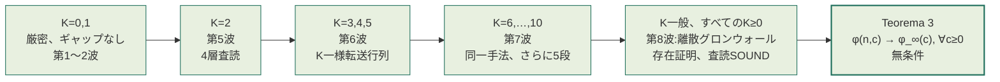
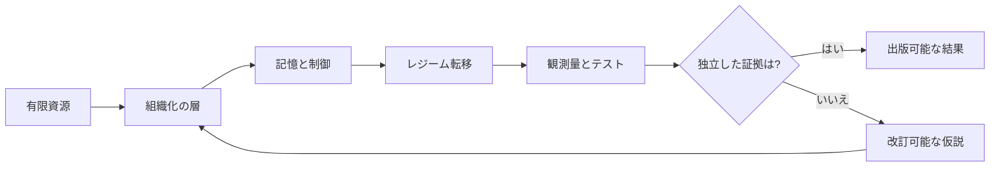
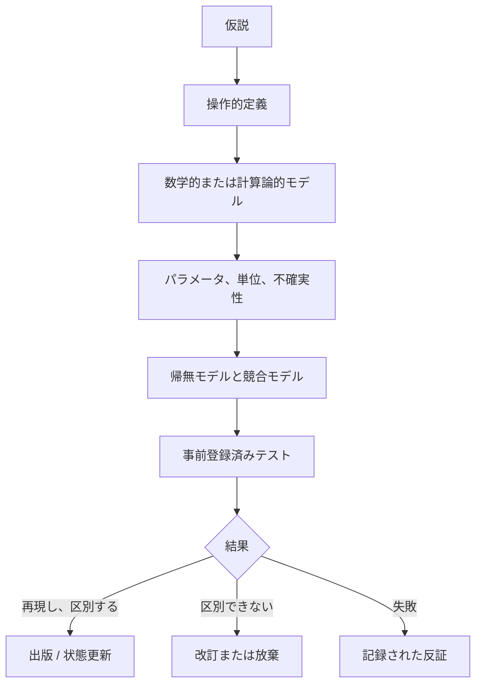

# Tamesis Discovery Lab — 敵対的検証研究アーカイブ

[](RELATORIO_PROGRESSO_AUDITORIA_ARTIGOS.md)
[](RELATORIO_PROGRESSO_AUDITORIA_ARTIGOS.md)
[](05_DISCOVERY_LAB/01_PORTFOLIO/TEST_QUEUE.yaml)
[](05_DISCOVERY_LAB/00_GOVERNANCE/CLAIM_LEDGER.yaml)
[](05_DISCOVERY_LAB/00_GOVERNANCE/DECISION_LEDGER.yaml)
[%20limit%20law-closed--form%20%C2%B7%20unconditional%20%C2%B7%20adversarially%20verified-8c5a1f?style=for-the-badge)](tamesis-cycle-survival/)
[](PROJECT_STATE.json)
[](LICENSE)
[](README.md#governance-authorship-and-responsibility)
[](README.md)

**言語:** [English](README.md) · [Português (BR)](README_PTBR.md) · **日本語** · [中文（简体）](README_ZH.md) · [Español](README_ES.md)

> **情報、幾何学、相転移、複雑系、認知を対象とする学際的研究アーカイブ ― 仮説と証拠を明確に区別して管理する。**

本リポジトリは、Tamesis Laboratory の全軌跡 ― 現在の実験ブランチ、および歴史的・数学的・物理的・計算論的・認知的な各研究ラインを保存するものである。アーカイブには**監査済み記録280件**が収められており、**274件の監査ドシエ**に整理されている。ここでの監査は、憶測を事実に変えるものではない ― 何が証明であり、何が条件付きの帰結であり、何が数値フィットであり、何が計算上の例示であり、何が憶測であり、何が思弁的シナリオであるかを明示するものである。

2026年以降、アーカイブは**継続的な判定ラボ**(`05_DISCOVERY_LAB`)も運営している。ここでは、アーカイブ自身が行うすべての定量的な主張が、事前登録された基準と**必須の敵対的再現**のもとで、実際の外部参照データと照合されて一つずつ決着させられる。これまでの成果 ― 最終判定付きで一覧化された数十件の否定的クロージャと、独立に再導出され敵対的に検証された1件の肯定的な数学的結果 ― は**[Discovery Labの論文](index.html)**(本リポジトリのランディングページ)にまとめられている。

## クイックリード

制度報告書『[Tamesis Laboratoryの最終ビジョン](RELATORIO_VISAO_FINAL_LABORATORIO_TAMESIS.md)』は、研究プログラム全体が生み出した問い、答え、影響、応用、そして新たな問いを提示している。[印刷用HTML/PDF版](RELATORIO_VISAO_FINAL_LABORATORIO_TAMESIS.html)も利用可能である。

### 現在の科学的状態

| 階層 | 状態 | 正しい解釈 |
|---|---|---|
| アーカイブと方法論 | **完了 / 監査済み** | 目録、主張の分類、出典、反証基準がすべて記録されている。 |
| 計算モデル | **監査のため凍結** | 再現可能な出力は、測定された定数としてではなく、モデルの出力として読むべきである。 |
| Tamesis `M_c v1` | **検証可能な仮説** | 値 `M_c = 5.292674126388712e-16 kg` はモデルパラメータであり、測定値ではない。 |
| 独立した物理的証拠 | **未確立** | 本アーカイブ内のいかなる内容も、Tamesis存在論の実験的確認ではない。 |
| ミレニアム懸賞問題およびTOE(万物の理論)の主張 | **未解決** | これらの文書は憶測、還元、あるいは制限モデルによる論証であり、承認された解ではない。 |
| コア数値判定 | **数学的統合が完了 ― 未解決補題(Open Lemma)は現在、すべての `K` について無条件に証明されている(2026-08-22)** | 下記参照 ― 3件の主張が最終判定とともに否定的にクローズされた。4件目(`U₁/₂`)は、証明済みの中核部分を持ち、独立に3回敵対的査読を受けており、未解決補題(Open Lemma)とレート予想は現在、**すべての** `K≥0`(`K=0,…,10` に限らず)について無条件に証明されている ― 最後に残されていた正則性に関する留保条件は離散グロンウォール存在証明によって解消され、アーカイブの条件付き命題は無条件の定理(**Teorema 3**)へと昇格した。 |

### 判定プログラム(Discovery Lab、2026-08-22更新)

`05_DISCOVERY_LAB` は、本アーカイブの定量的な主張を実際の外部参照データ(PDG、CODATA、Planck、SPARC、Gaia、Odlyzko)と照合して継続的に判定する。方法論は各計算の*前に*固定され、すべての参照値には完全な出所情報が付与され、肯定的な発見にはすべて**必須の敵対的再現**が課される。完全な記録は `05_DISCOVERY_LAB/01_PORTFOLIO/TEST_QUEUE.yaml` および `05_DISCOVERY_LAB/00_GOVERNANCE/DECISION_LEDGER.yaml` にある。論文形式のまとめは **[`index.html`](index.html)**(本リポジトリのランディングページ)を参照。

```mermaid
flowchart LR
    R[監査済み<br/>アーカイブ記録280件] --> S[アーカイブ全体の<br/>フェーズ0調査<br/>候補19件、7分野]
    S -->|18/19件が却下、<br/>具体的な理由を明示| N1[CLOSED_NULL]
    S -->|未成熟なリードを<br/>1件昇格| L13[正式な<br/>Discovery Lab<br/>テストライン13件]
    L13 --> C8[事前登録済みの<br/>主張8件<br/>ロック済み+敵対的レビュー済み]
    C8 --> V1[証明済みの肯定的結果1件<br/>U&#40;1/2&#41;極限法則]
    C8 --> V2[有益な否定的<br/>結果7件 — REFUTED /<br/>INCONCLUSIVE / NULL]
    style V1 fill:#e8f0e0,stroke:#1f6f5c,stroke-width:2px
    style N1 fill:#f0e5e8,stroke:#7a3b4a
```



**完全な生存ファネル(2026年):**

| ライン | テスト内容 | 結果 |
|---|---|---|
| 分野横断不変量(TRI-RG) | 候補16件、5ラウンド | `CLOSED_NULL` ― 生存者0件。`p<0.05` の発見4件は敵対的再現によって反証された(平凡な説明が実証された) |
| SPARC/MOND宇宙論 + Gaia広域連星 | 事前登録済みテスト4件 | 実在する交絡因子が実証されたことにより4/4件が不確定。従来の目玉となる結果2件が**捏造データ**に基づいていたことが判明し、実データで再実施された |
| リーマンゼータ零点(RH-REAL) | 調査項目12/12件、すべて最終的に決着 | 複製された発見2件(連続ギャップの反クラスタリング、`N^(-1/3)` のGUEスケーリング)。FHK最大値と数分散はいずれも `CLOSED_INCONCLUSIVE` としてクローズされたが、それぞれ敵対的に確認された強力な構成要素を持つ(iid側の除外 ≥8.8σ、素朴GUEの除外 最大203σ ― 敵対的再現によって、主推定量における3件目の実在するバグがさらに発見・修正された) |
| コア定量的主張の判定(第1波) | 主張7件 | `M_c` は値間で不整合(~190倍の差);クォーク/ノット質量モデルはleave-one-out検証に失敗;`sin²θ_W=3/13` はハードコードされた調整により7.5σずれている;`α⁻¹=Ω^{1.03}` は自由度0;バウンス宇宙論の `n_s` は同定不能;ホログラフィックな `Λ` は代数的恒等式により `ρ_crit` と等価 |
| **`U₁/₂` 極限法則(第2〜8波、統合)** | 定理1件 + 一般化1件 + 未解決補題(Open Lemma、すべての `K≥0`)+ 一般 `K` に対するレート予想、いずれも無条件 | **証明済み、敵対的査読済み(独立した4ラウンド、異なる手法)、論文+再現可能パッケージとして公開。`K=2` は第5波、`K=3,4,5` は第6波、`K=6,…,10` は第7波で転送行列法により証明された。一般 `K` のレートはまず第7波で条件付きに証明され、続いて第8波で正則性に関する留保条件自体が離散グロンウォール存在証明により解消された ― 未解決補題(Open Lemma)とレート予想は現在、すべての `K` について無条件にPROVED(証明済み)であり、アーカイブの条件付き命題は無条件の定理へと昇格した**(下記参照) |
| アーカイブ全体の候補調査(フェーズ0、TRI-RGを超えて) | 候補19件、7分野 | `CLOSED_NULL` ― 18/19件が具体的な理由とともに却下。未成熟なリード1件(認知EEGスペクトルシグネチャ)が新規ラインに昇格、下記参照 |
| 認知 ― うつ病におけるEEGスペクトルシグネチャ(Mumtaz、`DISC-COGNITIVE-EEG-SPECTRAL-001`) | ロック済み事前登録1件、N=30(MDD)/26(HC) | `CLOSED_REFUTED` ― スペクトルエントロピーはMDDにおいて低いのではなく**高い**(`d=1.447`、`p=3.97×10⁻⁶`)― 検証された仮説とは逆方向であり、ゼロから独立に行われた敵対的再現によって確認された(数値は<10⁻⁹の精度で一致) |
| SPARC-004宇宙論 ― `f_multi` 自己較正(ステージ1→2) | パイプライン検証済み+実発見データ(30,203系)に適用 | `CLOSED_INCONCLUSIVE` ― 機械的判定は `BOTH_FALSIFIED` だが、必須のデバンカー(反証)パスにより実在する交絡因子が発見された:サンプルの19%を占めるサブグループ(高RUWE)が単一スカラーの `f_multi` モデルによって系統的に補正不足となっており、較正自身のアンカー・ビンにおいてすら統計的に頑健な超過が見られる |

### 目玉となる肯定的結果:厳密な閉形式の普遍性法則

`U₁/₂` 普遍性クラス(レート `c/n` でランダム写像へと摂動されたランダム置換)は、次の厳密な極限法則を持つ:

<p align="center"></p>

> `φ_∞(c) = ∫₀¹ e^(−ct²) dt = ½·√(π/c)·erf(√c)` ― 自由パラメータはゼロ、

この法則は(フィットではなく)解析的に導出されたものであり、アーカイブの当初の憶測であった `(1+c)^(-1/2)`(最初の級数係数の時点で既に排除されている:`a₁ = 1/3 ≠ 1/2`、厳密な数え上げにより確認)を訂正するものである。この結果は今や憶測ではなく**証明済みの定理**である:自己完結した数学文書(`THEOREM.md`)が、訪問済みアークの*サイズバイアス*の正しい取り扱いを含め、6段階でこの閉形式を証明しており、敵対的査読者として振る舞う独立エージェントによってレビューされた ― **誤りはゼロ件**。

有限モデルと極限対象の間の橋渡しは、現在**すべての `K≥0` について無条件に**証明されている ― `φ(n,c) → φ_∞(c)`(`n → ∞` のとき)が、固定されたすべての `c ≥ 0` について、未証明の仮説を一切残すことなく成り立つ(`THEOREM.md`、「Teorema 3」):



上記の各段は、それぞれ独立した敵対的査読者エージェントによって、元の導出とは*異なる*証明手法、独自のブルートフォース列挙、および完全な再帰代入チェックを用いて独立に再導出された ― 独立した4ラウンドの査読を通じて、**いかなる層でも誤りはゼロ件**であった。`K=6,…,10` については、2つのホールドアウト点における新規の網羅的列挙とビット単位で一致することもさらに確認された。最後の段は、残されていた唯一の名指しされたギャップを解消するものであった:敵対的査読者がゼロから独立に、有限 `n` の2項展開が11個の具体的に検証された値だけでなく*すべての* `K` について存在することを証明する厳密な離散グロンウォール帰納法を再導出した ― 判定は**SOUND、名指しされた問題点あり**(4件発見、いずれも致命的ではなく、日付入りの補遺により訂正済み)であった。**未解決補題(Open Lemma)**― 現在すべての `K` について無条件に証明されている ― は、Hansen & Jaworski(EJC、2014年)の厳密な固定パラメータケースである。閉形式の `erf` を伴うポアソン混合は、体系的な文献調査(35件以上のクエリを記録)では見つからなかったが、これが「新規性」と同義ではないという明示的な留保が付されている。第二の戦線では、**なぜ指数がちょうど1/2なのか**が導出された:摂動機構のパラメトリックな族全体にわたって、`α ∈ [1/2, 1]` が常に成り立ち ― `α < 1/2` は*証明により不可能*であることが示された(いかなる周期性の「消滅」がなくても持続する二次的クラスタリング効果による)。第5波では、中間のあらゆる `α ∈ (1/2, 1)` に到達する自然な機構(`M-WEIB(β)`、非斉次ワイブル・ハザード)も特定・確認された。物理的な含意は一切主張されていない ― これは特定のアンサンブルに関する純粋な組合せ数学である。

**全次数にわたる閉形式(2026-08-23)。** 上記のすべての段 ― `K=0,…,10`、`K` 一般への橋渡し、有限 `n` の誤差定数 ― は、今や単一の厳密な公式の系となった。同じ漸近展開の手法を*記号的な*次数指数へと拡張したところ、各次数の係数がまさに符号なし第一種スターリング数であることが明らかになった。これらはちょうど上昇階乗冪の係数と一致するため、無限級数展開全体が ― 漸近的にではなく、厳密かつ有限の形で(`K+1` 項で終わる)― 再総和されることになる。この結果は、すべての `n`、`K`、およびオフセットパラメータについて、根底にある再帰式を表す単一の有限かつ完全に明示的な式であり、展開の仕組みを一切必要としない独立した初等的証明も付されている。専任の敵対的査読ラウンドが、独自にゼロから構築したシミュレータに対して両方の証明をゼロから再導出し(215,070件の厳密な照合、不一致ゼロ)、この見出しの主張を確認するとともに、二次的な否定的主張における実際の誤りを1件発見し(日付入りの補遺により訂正済み)、さらに元の文書が意図的に未証明のまま残していた2つの保守的なラベルについても、査読者自身がそれらを完全に証明した。詳細は `THEOREM.md` の「Estágio 9」を参照。

**パラメータ範囲全体における一様収束(2026-08-23)。** 上記の定理は、固定された各 `c` について `φ(n,c) → φ_∞(c)` であることを述べているに過ぎない ― 一度に1つの `c` についてのみである。別の研究戦線が、要求されていた以上に徹底的にこのギャップを解消した:収束はコンパクトな範囲 `[0,C]` だけでなく、*半直線全体* `[0,∞)` において一様であり、いずれも上記の仕組みを一切必要としない2つの短い初等補題 ― リプシッツ結合(Lipschitz coupling)と `n` に一様なテイル評価(uniform-in-`n` tail bound)― から無条件に証明された。おまけとして、厳密な一次誤差プロファイルも閉形式で導出された。敵対的査読ラウンドは、2つの新しい補題と2つの無条件定理を最も強く攻撃したが、いずれにも誤りは見つからなかった。唯一の実質的な発見は、既に条件付きである二次的な結果においてどの具体的なギャップが未解決のままかを訂正するものであり、そのギャップに関するアーカイブ自身の記述を、より不正確にではなくむしろより正確にした。詳細は `THEOREM.md` の「Estágio 10」を参照。

**すべての所在:** 定理全文と査読報告書は `05_DISCOVERY_LAB/02_TESTS/CORE_NUMERICS/u12_universality/theorem/` にある。一般化とその敵対的検証は `.../generalization_u_alpha/` にある。**独立した再現可能パッケージ** ― コンパイル済みLaTeX論文(PDF)、自己完結した証明、クリーンルームシミュレーション、49件の自動テスト ― は **[`tamesis-cycle-survival/`](tamesis-cycle-survival/)** にある。そして、この一つの肯定的結果を正しい文脈で読めるようにするための、**この研究室が試みて生き残らなかったすべて**の正直な一覧表は **[`FAILED_HYPOTHESES.md`](FAILED_HYPOTHESES.md)** にある。

Tamesisアーカイブ全体(TRI-RGに限定されない、7分野にわたる候補19件)についての正直な調査は `CLOSED_NULL` としてクローズされ ― 18/19件が具体的な理由とともに却下された ― 発見された唯一の未成熟なリード(認知EEGスペクトルシグネチャ、うつ病 対 不安)は新たな候補ラインへと昇格した。その操作化段階は完了している(観測量を正規化シャノン・スペクトルエントロピーとして定義、名指しされた競合モデル、計算済みの統計的検出力、うつ病アームについて実データへのアクセスを確認済み)― 不安アームは、人間によるログインを要求するデータ提供者のためにブロックされたままであり、そのように正直に報告されている。そちらでは実データはまだ計算されていない。詳細は `05_DISCOVERY_LAB/02_TESTS/ARCHIVE_PHASE0_SURVEY/SURVEY.md` および `05_DISCOVERY_LAB/02_TESTS/COGNITIVE_EEG_SPECTRAL/OPERATIONALIZATION.md` を参照。

## 研究室のビジョン

本プログラムは、有限の資源の下にあるシステムが、その複雑性のコストが誤差・散逸・不安定性・将来の探索コストの低減によって相殺される場合に、追加的な組織化の層を構築できるかどうかを探究する。これは**モデル化の原理**であり、自然に帰属させられた目的ではない。

本研究室は4つの階層を接続する:

1. **数学:** 作用素、スペクトル、トポロジー、グラフ、普遍性、正則性。
2. **基礎物理学:** 情報、幾何学、ホログラフィー、重力、素粒子、量子-古典転移。
3. **複雑系:** 熱力学、記憶、不可逆性、ネットワーク、安定性、制御。
4. **生命と認知:** 統合された生体、脳-コンピュータ・インターフェース、意識、認知エコシステム。




<p align="center"><sub>図1 ― ホログラフィー原理の作業用イラスト。これはモデル化上の仮説であり、宇宙がホログラフィックであることやシミュレーションであることの証拠ではない。</sub></p>

## はじめに

- **[Discovery Lab科学論文(2026年)― 敵対的判定と `U₁/₂` 極限法則](index.html)**(本リポジトリのランディングページ)
- **[`tamesis-cycle-survival/`](tamesis-cycle-survival/) 再現可能パッケージ** ― `U₁/₂` 定理のためのコンパイル済みLaTeX論文、証明、シミュレーション、自動テスト
- **[`FAILED_HYPOTHESES.md`](FAILED_HYPOTHESES.md)** ― 本研究室で検証され、生き残らなかったすべての仮説の正直な一覧表
- [研究室の最終ビジョン報告書](RELATORIO_VISAO_FINAL_LABORATORIO_TAMESIS.md)
- [プレゼンテーション用HTML版およびPDF版](RELATORIO_VISAO_FINAL_LABORATORIO_TAMESIS.html)
- [280記事の監査報告書](RELATORIO_PROGRESSO_AUDITORIA_ARTIGOS.md)
- [厳格な監査プロトコル](PROTOCOLO_AUDITORIA_RIGOROSA_DE_ARTIGOS.md)
- [機械可読な目録マニフェスト](ARTICLE_MANIFEST.csv)
- [凍結状況と再開条件](PROJECT_FREEZE.md)
- [JSON形式のプロジェクト状態](PROJECT_STATE.json)
- [タイムライン](00_HOME/TIMELINE.md)
- [アーカイブマップ](00_HOME/WORKSPACE_MAP.md)
- [ナビゲーション可能なホームページ](00_HOME/README.md)
- [インタラクティブな仮説アトラス](atlas.html)
- [`U₁/₂` ラインの証明依存関係マップ](05_DISCOVERY_LAB/02_TESTS/CORE_NUMERICS/u12_universality/PROOF_DEPENDENCY_MAP.md)

## 研究ライン

| ライン | 中心的な問い | 現在の状態 | 潜在的応用 |
|---|---|---|---|
| **A. 基礎と現実のアーキテクチャ** | 情報、幾何学、あるいは計算は時空と有効法則を生成しうるか? | 概念的アーキテクチャと候補モデル。 | 量子重力、情報幾何学、ネットワークモデリング。 |
| **B. 公理と運用上の橋渡し** | 小さな公理系は、セクターごとの調整なしに観測される方程式を再現できるか? | 部分的・条件付きのクロージャ。 | モデル導出、整合性テスト、パラメータ削減。 |
| **C. TDTR、TRI、および不可逆性** | レジームはどのように変化し、なぜ一部の転移は不可逆なのか? | 語彙、ライブラリ、転移モデル。 | 熱力学、散逸ダイナミクス、時間の矢。 |
| **D. 普遍性** | 異なるシステムは不変量やスケーリング則を共有するか? | **`U₁/₂` クラスの厳密な極限法則が導出され、敵対的に検証済み(2026年8月)**;分野横断不変量の経験的探索は帰無としてクローズ(16/16)。 | 転移検出、故障解析、適応制御。 |
| **E. スペクトルとリーマン** | ゼータ零点を実現するスペクトルを持つ作用素は存在するか? | 数学的に正当な経路;リーマン予想の証明はなし。 | スペクトル理論、量子カオス、数値解析。 |
| **F. 計算、グラフ、素数** | 算術構造はグラフや計算システムに符号化できるか? | 探索的アルゴリズムと対応関係。 | グラフ学習、ネットワーク解析、スペクトルアルゴリズム。 |
| **G. 観測的宇宙論** | どの観測量がTamesisを `ΛCDM`、MOND、および競合モデルから区別するか? | テストカタログ;実証された経験的な置き換えはなし。 | CMB、BAO、超新星、レンズ効果、SPARC、重力波。 |
| **H. ブラックホールと特異点** | 情報と幾何学は事象の地平線と特異点をどのように扱うか? | 思弁的な熱力学的/ホログラフィックモデル。 | 量子情報、重力、地平線熱力学。 |
| **I. 素粒子とトポロジー** | トポロジーは質量、世代、混合、結合を説明できるか? | 候補となる機構と数値的関係。 | 素粒子現象論と精密検証。 |
| **J. 量子-古典極限** | 量子力学はいつ、なぜ古典的になるのか? | 競合する仮説と実験デザイン。 | 干渉計測、オプトメカニクス、量子計測。 |
| **K. 認知エコシステム** | 生体は制御、記憶、意識のプロファイルをどのように構築するか? | 概念的アジェンダと経験的プログラム。 | ネットワーク神経科学、生理学、脳-コンピュータ・インターフェース。 |
| **L. 認知トポロジーとハイブリッド・サイバネティクス** | 認知状態は関係的/スペクトル的不変量によって分類できるか? | 理論的構造と制御プロトタイプ。 | 人間-機械システムと身体性ロボティクス。 |
| **M. 安定性と作用素** | 強圧性、散逸、スペクトル余裕は病的なレジームを検出できるか? | 候補となる手法と制限定理。 | インフラ制御、異常検知、適応ネットワーク。 |
| **N. ミレニアム懸賞問題** | 有限容量は `P vs NP`、RH、あるいはPDEに関する定理を含意しうるか? | 承認された解はなし;制限された論証。 | 解決の主張ではなく、新たな数学的補題。 |
| **O. 思弁的宇宙論とメトリック工学** | バウンス、親宇宙、あるいは修正されたメトリックは観測量を生み出すか? | 思弁的シナリオ。 | 共変的・安定・因果的な解が得られて初めて。 |
| **P. 科学インフラ** | 学際的研究の再現可能性と誠実性をどう維持するか? | 追跡可能な目録と監査。 | ガバナンス、レビュー、プレプリント、外部協力。 |

### ライン別の完成度ポテンシャル(運用上の推定であり、アーカイブの指標ではない)

以下の表は、ラインごとに**それぞれの中心的な問いにおいて名指しされたギャップのうち、どれだけがすでに特徴づけられているか**を推定するものであり、その仮説が正しい確率でも、研究室が算出した指標でもない。これは、各ラインについて記録された実際の状態(`RELATORIO_VISAO_FINAL_LABORATORIO_TAMESIS.md` §6 および `05_DISCOVERY_LAB/`)に照らして較正された外部からの読み解きであり、元の目録に対する1つの重要な訂正を伴う:**ラインDは2つの部分に分けて読む必要がある。** Discovery Labによって厳密に判定された `U₁/₂` サブセットは大きく進展しているが、ラインD全体 ― 元の報告書では `U₀`、`U₂`/Lindblad、一般クラスのアトラス、トポロジー応用も含む ― は同じ割合では進展して**いない**:研究室自身によるアーカイブ全体調査(`DISC-ARCHIVE-PHASE0-SURVEY-001`)は、`U₀` と `U₂` が `U₁/₂` とは異なり、閉形式の候補に一度も到達していないことを記録している。「ラインD」を85%解決済みとして扱うことは、まさに本アーカイブの規律が防止しようとしている類の混同そのものであろう。

| 順位 | ライン | 推定完成度 | 状態 | クローズに向けて |
|---:|---|---:|---|---|
| 🥇 | **D ― `U₁/₂`**(判定済みサブセット、`DISC-CORE-NUMERICS-001`) | **~97%** | ✅ 未解決補題(Open Lemma)と一般 `K` に対するレート予想は**すべての `K≥0` について無条件に**証明された(2026-08-22);根底にある再帰式について、一般 `K` に対する厳密かつ有限な全次数の閉形式も**証明された**(2026-08-23);収束 `φ(n,c)→φ_∞(c)` も、単なる各点収束ではなく**`c` について `[0,∞)` の全域で一様に**成り立つことが証明された(2026-08-23);さらに**明示的かつ無条件の収束レート** `|Δ_n(c)|≤[(1+√(π/2))√c+0.2805]/n` も証明された(2026-08-23、非最良定数)― 本ラインにおけるこれまでの有限 `n` の結果はすべて、この単一の式の系となる | 残されている非中心的な事項:M-CLUST(b)残差(別の機構、`PARTIALLY CLOSED`);完全な分布法則(予想1〜2、2026-08-23以降 `K=1,2` で証明済み ― `K≥3` は未着手のまま未解決);厳密な誤差定数の閉形式(2026-08-23以降、`p=1,2,3,4`・任意の `b≥0` について証明済み ― `p≥5` は未解決、唯一の障害が機械的に除去可能であることは示されたが実行はされていない);上記の明示的レートにおける**最良(sharp)定数**(証明済みの非最良値 `a≈2.253` に対し `a*≈0.367`、ただし*極限* `lim_K M_K/√K=a*` 自体は2026-08-23に厳密に証明済み ― 残る未解決事項は `K` について一様な上限のみ) ― [依存関係マップ](05_DISCOVERY_LAB/02_TESTS/CORE_NUMERICS/u12_universality/PROOF_DEPENDENCY_MAP.md)参照 |
| 🥈 | **P ― インフラ** | **~90%** | 🔧 継続中 ― 2026年7月以降、第2の層を獲得:事前登録+必須の敵対的再現+意思決定/主張台帳(`05_DISCOVERY_LAB/00_GOVERNANCE/`) | セマンティックバージョニング、オープンなデータ/コード、外部レビュー |
| 🥉 | **B ― 公理** | 35% | 🟡 有望 | 橋渡しがセクターごとの調整なしに対称性/保存則を保つことを証明する |
| 4 | **E ― リーマン** | 30% | 🟡 探索的 ― 2026年7月以降、`RH-REAL` 調査の全12項目が最終的に決着;複製された発見2件(反クラスタリング、GUEスケーリング)、いずれもRH自体に関するものではない | 誤差を完全に制御した上で、零点を実現する自己随伴作用素 |
| 5 | **M ― 安定性** | 30% | 🟡 探索的 | 小さな定理、完全な仮説、Lyapunov/LQRに対するベンチマーク |
| 6 | **C ― 不可逆性** | 25% | 🟡 | 非自明な単調量 + 検証可能な転移クラス |
| 7 | **F ― グラフ/素数** | 25% | 🟡 | ベンチマークと形式的な対応定理 |
| 8 | **J ― 量子-古典** | 25% | 🟡 | デコヒーレンス、収縮、重力を分離するブラインドプロトコル |
| 9 | **L ― 認知トポロジー** | 25% | 🟡 | 定義された不変量 + 評価者間信頼性 + 独立データ |
| 10 | **A ― 基礎** | 20% | ⚪ | 自由度、単位、新たな予言を備えた最小作用 |
| 11 | **G ― 宇宙論** | 20% | ⚪ ― 2026年7月以降、事前登録済みテスト4件が実データ(SPARC-001〜004)に対して**実行**され、すべて `CLOSED_INCONCLUSIVE`;単なる保留中のテストカタログではなく、正直なRUWE交絡因子の発見あり | Tamesisを `ΛCDM`/MONDから区別し、アウト・オブ・サンプルでも生き残る観測量 |
| 12 | **I ― 素粒子** | 20% | ⚪ | 完全なゲージ作用 + 繰り込み + ユニタリ性 + 衝突型加速器での予言 |
| 13 | **H ― ブラックホール** | 15% | ⚪ | メトリック/エネルギー運動量テンソル + 因果律 + 地平線の観測量 |
| 14 | **K ― 認知** | 15% | ⚪ ― 2026年7月以降、具体的な仮説1件が検証され敵対的に**反証**された(`DISC-COGNITIVE-EEG-SPECTRAL-001`:うつ病におけるEEGスペクトルエントロピー、実際の効果は予測とは逆方向);広範な問い(制御/記憶/意識)には依然として単一のモデルが存在しない | 再現可能な予言を伴う1つの測定可能な現象へと還元する |
| 15 | **O ― 思弁的宇宙論** | 10% | ⚪ | いかなる観測量よりも先に、無矛盾な共変解 |
| 16 | **N ― ミレニアム** | 5% | 🔴 ― 解なし;このラインは解決の主張について恒久的に対象外 | 制限されたヒューリスティックではなく、元の問題に対する完全で検証可能な定理 |

**この表の誤った使い方。** 「90%」は、`U₁/₂` クラスが正しい確率が90%であることも、ラインDがほぼ完了に近いことも意味しない ― それが意味するのは、その特定の問いにおいて明示的に名指しされたギャップのうち、大半がすでに証明されたか、精密に特徴づけられているということである。本ラインの最後に残されていた名指しの一般 `K` 正則性に関する留保条件は、2026-08-22に(`DISC-DEC-040`)解消された;`D — U₁/₂` に残された研究能力は、現在、別個のM-CLUST(b)残差(依然として `PARTIALLY CLOSED`)と、上記で名指しされた真に未解決の非中心的な問いへと向けられている。

## 検証可能な研究サイクル



このサイクルはアーカイブの編集上の規則である。曲線を再現するシミュレーションは自動的に発見となるわけではなく、数値的な一致は導出ではなく、システム間の類推は物理的な同一性ではない。

## 現在の実験コア:`Tamesis M_c v1`

現在の実験ブランチは `frozen_and_ready` の状態で凍結されており、ハードウェア認定はまだ開始されていない。実証機Aは、5Kから20Kの間でのブラインド光学温度測定較正から始まる;**まだ `M_c` を測定していない**。

- [`Tamesis M_c v1` README](01_TAMESIS_CORE/02_Experimental_Validation/Quantum_Classical_Transition/tamesis_mc_v1/README.md)
- [実証機A v0.6 実行報告書](01_TAMESIS_CORE/02_Experimental_Validation/Quantum_Classical_Transition/tamesis_mc_v1/reports/DEMONSTRATOR_A_V0_6_EXECUTION_REPORT.md)
- [視覚的出力、図表、アニメーション](02_TAMESIS_MC_V1_OUTPUTS/README.md)
- [実験協力パッケージ](03_EXPERIMENTAL_COLLABORATION_PACKAGE/README.md)


<p align="center"><sub>図2 ― 検証の指針として用いられる限界マップ。領域とマーカーは仮説と参照データを表しており、普遍的な境界の確認を構成するものではない。</sub></p>

## 複雑系と転移


<p align="center"><sub>図3 ― 圧縮、飽和、再編成の概念的可視化。これはモデルによる図解であり、一般的な経験則ではない。</sub></p>

本研究室は、システムを比較するために共通言語を用いる:**状態、資源、結合、記憶、転移、散逸、安定性、観測量、故障基準**。この比較は方法論的なものであり、銀河、細胞、グラフ、脳が同種の対象であると主張するものではない。

## 研究室がすでに達成したこと

- 280件の記録に対する完全で追跡可能な目録と監査;
- 証明、仮説、モデル、フィット、シミュレーション、思弁的シナリオの間の明示的な区別;
- レジーム、転移、作用素、ネットワーク、認知システムのアトラス;
- 帰無モデルを備えた観測的・実験的テストのカタログ;
- 学術的発表のための制度的HTML/PDF版;
- 過去のバージョンをその主張を現在の結果として承認することなく保存;
- **コアの定量的主張に対する完全な敵対的判定**(2026年):事前登録された基準のもとで30件以上の主張がクローズされ、捏造データに基づいて構築された従来の目玉となる結果2件の検出と訂正を含む;
- **導出され敵対的に検証された1件の新たな数学的結果**:`U₁/₂` クラスの厳密な閉形式極限法則 `φ_∞(c) = ½√(π/c)·erf(√c)`([論文](index.html)参照);
- リーマンゼータ関数の実零点に関する複製された発見2件(連続ギャップの反クラスタリング、最小ギャップのGUEスケーリング)。

## まだ実証されていないこと

本アーカイブは、リーマン予想、`P vs NP`、Navier–Stokes方程式、Yang–Mills理論、Hodge予想、Birch–Swinnerton-Dyer予想を解決したとは**主張しない**。同様に、Tamesisが `ΛCDM` を置き換える、ダークマター/ダークエネルギーを排除する、量子収縮において意識に因果的役割を与える、メトリック推進を可能にする、あるいは宇宙がシミュレーションであることを証明する、といった承認された実証も存在しない。

これらのラインは、形式的な証明、独立したデータ、新たな予言、そして再現性を生み出すまでは、憶測、テストプログラム、または制限モデルのままである。

## リポジトリ構造

| フォルダ/ファイル | 機能 |
|---|---|
| `00_HOME` | 概要案内、タイムライン、アーカイブマップ。 |
| `01_TAMESIS_CORE` | 中核理論、モデル、アセット、現在の実験的検証。 |
| `02_TAMESIS_MC_V1_OUTPUTS` | `M_c v1` ブランチの図表とアニメーションの利便用コピー。 |
| `03_EXPERIMENTAL_COLLABORATION_PACKAGE` | 実験協力と認定のための資料。 |
| `05_DISCOVERY_LAB` | 判定ラボ:テストキュー、ガバナンス台帳、方法論ノート、結果、敵対的判定。 |
| `index.html` | **判定プログラムの総合論文**(ランディングページ;図表と生成スクリプトは `ARTIGO_DISCOVERY_LAB/figures/` にある)。 |
| `tamesis-cycle-survival` | `U₁/₂` 定理のための独立した再現可能パッケージ ― コンパイル済みLaTeX論文、証明、クリーンルームシミュレーション、自動テスト。 |
| `FAILED_HYPOTHESES.md` | Discovery Labが検証したすべての仮説/候補について、生存の有無を問わず記載した完全で正直な一覧表。 |
| `computational_freeze.html` | 以前のルート・ランディングページ(Tamesis `M_c v1` の凍結状態)、保存されている。 |
| `90_LEGACY` | 歴史的、置き換えられた、思弁的、あるいは現在サポートされていないブランチ。 |
| `RECURSOS_PARA_PESQUISA` | 参考資料;本プロジェクトによって生み出された証拠ではない。 |
| `publicar` / `publicados` | 発表予定および発表済みの記事の編集上の整理。 |
| `ARTICLE_MANIFEST.csv` | 記事の機械可読な目録。 |
| `RELATORIO_PROGRESSO_AUDITORIA_ARTIGOS.md` | 記事ごとの監査追跡。 |
| `RELATORIO_VISAO_FINAL_LABORATORIO_TAMESIS.html` | PDF出力に対応した制度文書。 |

## ガバナンス、著者性、責任

**本アーカイブの科学的指揮、主著者、およびキュレーション:** **Douglas H. M. Fulber**。

Tamesis Laboratoryは、本リポジトリ内で独立した研究プログラムとして運営されている。過去の文書における大学、研究所、著者、DOIへの言及は、明示的な許可と記録が存在しない限り、機関としての承認、共著、あるいは外部からの検証を意味しない。

編集上のガバナンスは以下の規則に従う:

1. 責任あるメンテナーが、状態分類、ラインの整理、構造的変更の受け入れを管理する;
2. 外部からの貢献は歓迎されるが、記録されたレビューなしに著者性、出所、証拠の状態を変更することはない;
3. 新たな結果には、手法、該当する場合はデータ/コード、不確実性、帰無モデル、限界、および反証基準を含めなければならない;
4. 過去の文書は出所を示すために保存されるが、自動的に有効な結果へと昇格することはない;
5. 派生する出版物はすべて、研究室、著者/キュレーター、および使用した特定のアーカイブのバージョンを引用しなければならない。

協力や訂正を提案するには、以下を文書化したissue/パッチを開いてください:影響を受けるファイル、根拠、出典、分類への影響、検証テスト。

## ライセンスと帰属表示

本アーカイブのオリジナル素材は、ファイル自体に別段の記載がある場合や第三者の権利が及ぶ場合を除き、[クリエイティブ・コモンズ 表示4.0国際(CC BY 4.0)](LICENSE)の下で利用可能である。このライセンスは、帰属表示が保持され、変更が示されている限り、素材の共有と改変を認めるものである。

推奨される帰属表示の形式:

> Douglas H. M. Fulber, Tamesis Laboratory — *Tamesis Research Archive*, 使用したバージョン/コミット, licensed under CC BY 4.0: [リポジトリ](.)。

図を再利用する際は、キャプション、アセットのパス、そしてそれがモデルによる可視化であるという記録された分類の表示がある場合はその表示を保持すること。第三者の画像、データ、テキストは、それら独自の条件の対象となる場合がある;CC BY 4.0は、研究室が保有していない権利を移転するものではない。

## 誠実性と利用上の限界

- アーカイブの憶測を確立された事実として提示しないこと。
- DOIの存在をもって、査読や実験的検証の証拠としないこと。
- 正式な許可なく引用された大学や団体に、機関としての承認を帰属させないこと。
- 限界、フィットされたパラメータ、否定的な結果、あるいは失敗条件を隠さないこと。
- 独立した専門家による評価なしに、本素材を医療、法律、金融、安全に関する助言として使用しないこと。

## 本アーカイブの引用方法

```text
Fulber, Douglas H. M. (2026). Tamesis Research Archive: Tamesis Laboratory — vision, audit, and research program. CC BY 4.0.
```

## 連絡と協力

推奨される入口は、本リポジトリにおける文書化されたissueである。学術的な発表には、[制度的HTML/PDF報告書](RELATORIO_VISAO_FINAL_LABORATORIO_TAMESIS.html)および[完全なMarkdown報告書](RELATORIO_VISAO_FINAL_LABORATORIO_TAMESIS.md)を用い、常に示された証拠分類を保持すること。
