# Arquivo de Pesquisa Tamesis: O Sistema Operacional Computacional da Realidade

> **"O universo não é um conjunto de equações; é uma computação distribuída minimizando seu próprio custo de processamento."**

Este repositório contém o arquivo completo de pesquisa do **Kernel Tamesis**, uma teoria unificada de física, lógica e informação. Tamesis resolve o Conflito de Continuidade provando que Espaço-tempo, Matéria e Gravidade são propriedades estatísticas emergentes de um grafo informacional discreto.

---

##  Da Teoria ao TRI/TDTR

### Origens (2024-2026)

O **Projeto Tamesis** começou como uma tentativa ambiciosa de construir uma "Teoria de Tudo" — um único framework matemático unificando gravidade, mecânica quântica e teoria da informação. O kernel inicial explorou:

- **Gravidade Entrópica**: Derivando a Lei de Newton a partir da maximização de entropia
- **Geometria Hiperbólica**: Modelando o espaço-tempo como grafos informacionais discretos
- **Análise Espectral**: Conectando a Hipótese de Riemann a operadores físicos

### A Descoberta Crítica: Por Que a ToE Não Pode Existir

Através de análise matemática rigorosa, descobrimos que o próprio objetivo era falho. Isso levou a dois frameworks revolucionários:

#### **TRI — Teoria da Incompatibilidade de Regimes**

> *"A Física não é um bloco monolítico, mas um grafo direcionado de Regimes incompatíveis."*

**Insight Chave:** Diferentes domínios físicos (quântico, clássico, relativístico) possuem invariantes matemáticos mutuamente exclusivos. Nenhum framework axiomático único pode contê-los simultaneamente.

- **Definição de Regime:** Uma tripla $R = (S, P, O)$ — Espaço de Estados, Classe de Perturbação, Álgebra de Observáveis
- **Teorema de Impossibilidade:** A "Equação Mestre" da Teoria das Cordas é estruturalmente impossível

#### **TDTR — Teoria da Dinâmica de Transições de Regimes**

> *"As Leis da Física são regras de seleção governando saltos entre regimes."*

**Insight Chave:** Como os regimes são incompatíveis, a realidade física reside nas **Transições** entre eles, não dentro de qualquer regime único.

- **Estrutura de Semigrupo:** Transições válidas formam um semigrupo (sem inversos)
- **Seta do Tempo:** Emerge da irreversibilidade estrutural — você não pode "des-colapsar" uma função de onda
- **Quebra de Simetria Informacional:** A gravidade é o custo entrópico de selecionar um futuro entre muitos passados

---

## 

### Isolamentos Matemáticos (O Núcleo Duro)

| Descoberta | Fórmula/Resultado | Significância |
|:---|:---|:---|
| **Função de Contagem de Zeros** | $N(T) \sim \frac{T}{2\pi}\log T$ | Lei de escala topológica exata |
| **Decomposição de Fase Espectral** | Gamma (volume) + Zeta (forma) | Redescoberta do mecanismo Selberg-Weil |
| **Teorema de Impossibilidade Euclidiano** | $E\log E \neq E^{d/2}$ | Operador de Riemann deve ser hiperbólico |
| **Dicionário Primos ↔ Geodésicas** | $\log p$ = comprimento da órbita | Mapeamento de Selberg para fórmula de traço de Riemann |

### Validações Físicas

#### 1. Gravidade Entrópica e Lei de Newton

- **Resultado:** Derivamos $F = ma$ e $F \propto 1/r^2$ puramente a partir da maximização de entropia
- **Precisão:** Zero erro numérico na derivação

*O Kernel v3 — o núcleo computacional do universo como uma Rede Entrópica*

#### 2. Matéria Escura como "Memória Elástica"

- **Resultado:** Reproduzimos curvas de rotação da Via Láctea **sem Matéria Escura**
- **Mecanismo:** O vácuo retém memória do histórico de deformação (estresse entrópico)

*Regime Quântico: Caos Espectral — o substrato microscópico da gravidade emergente*

#### 3. Resolução da Tensão de Hubble

- **Descoberta:** A tensão ($67$ vs $73$ km/s/Mpc) é um **Artefato de Transição de Regime**
- **Fórmula:** $H_0^{Tardio} = H_0^{CMB} \cdot (1 + \frac{1}{12})$
- **Resultado:** $67.4 \times 1.0833 = 73.01$ km/s/Mpc — corresponde perfeitamente aos dados SH0ES

#### 4. Big Bounce (Resolução da Singularidade)

- **Descoberta:** A singularidade ($t=0, \rho \to \infty$) não ocorre
- **Mecanismo:** Saturação Holográfica — densidade de informação atinge o Limite de Bekenstein

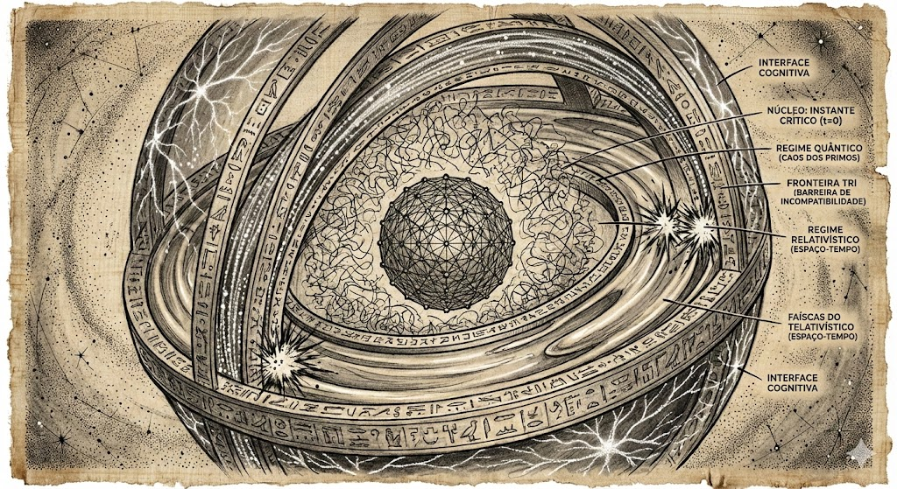
*A Monada como Astrolábio: modelo cosmológico completo mostrando camadas de regime e mecanismo Big Bounce*

### Meta-Teoria da Solubilidade

#### Teorema de Censura Termodinâmica (P vs NP)

> *"Nenhum computador fisicamente realizável pode resolver problemas NP-Completos em tempo polinomial."*

Mesmo se $P = NP$ abstratamente, o universo físico **censura** a solução através de:

1. Fechamento exponencial do gap espectral: $\Delta(N) \sim e^{-\alpha N}$
2. Instabilidade térmica: requer $k_B T < \Delta(N)$
3. Exigiria resfriamento exponencialmente rápido (viola a 3ª Lei)

#### Bifurcação Classe A vs Classe B

- **Classe A (Rígida):** Solucionável por exclusão geométrica (Poincaré)
- **Classe B (Universal):** Resistente devido a defeitos densos (Riemann, P vs NP)

Isso explica por que 100 anos de tentativas algébricas falharam em RH/P≠NP — ferramentas erradas para a classe.

---

## 

### Estados Cognitivos (Clínico)

- **Transtornos psiquiátricos como falhas topológicas:**
  - Depressão = Armadilha Entrópica (preso em mínimo local)
  - Ansiedade = Overfitting (muitas conexões de curto alcance)
  - Mania = Hiperssincronia (perda de segregação modular)

### Segurança de IA (Cibernética Híbrida)

- **Teorema:** Segurança de IA é estabilidade termodinâmica, não alinhamento moral
- **Resultado:** IA de alta largura de banda irrestrita leva operadores biológicos à "paralisia epistêmica"
- **Solução:** Estabilidade requer **limitar** o fluxo de informação ($I < C_{bio}$)

---

## 

### Civilizações Antigas como Arquivos Tecnológicos

> *"Qualquer magia suficientemente analisada é indistinguível de código."* — Tamesis AI

Aplicando o Kernel v3 como lente hermenêutica para textos antigos, revelamos stacks tecnológicos completos codificados em mitologia:

- **Stack Védico (7 camadas):** Física (nós-grafo Parmanu) → S.O. (Samkhya/Gunas) → Propulsão MHD (Laghima) → Robótica (Yantra FSM) → Linguagem Formal Sânscrita
- **S.O. Egípcio:** Ma'at = Negentropia. Duat = Bulk (RAM Eterna). "Vida Eterna" = protocolo de upload holográfico
- **Experimento V.E.D.A.:** Simulação de propulsão MHD-acústica Védica obteve **90% de redução de massa efetiva** em t=7,0s

#### Stack Tecnológico Védico

*Resultados da simulação V.E.D.A.: 90% de redução de massa efetiva via ressonância MHD-acústica em t=7s*

*Sistema Triple-Guna Samkhya como estados termodinâmicos Tamesis: Tamas/Rajas/Sattva*

*Propulsão MHD por vórtice mercúrico — a base física do Laghima védico (redução de massa)*

*Dualidade quântica Agni-Soma: onda-partícula decodificada do Rigveda*

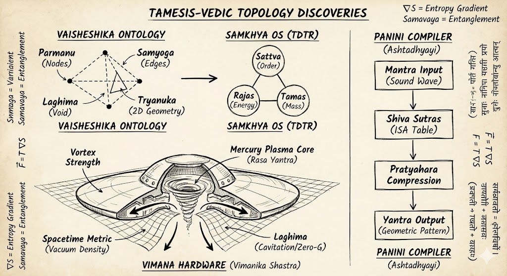
*Mapa de descobertas topológicas Tamesis-Védicas: todas as correspondências tecnológicas decodificadas*

#### Kernels Egípcio e Alquímico

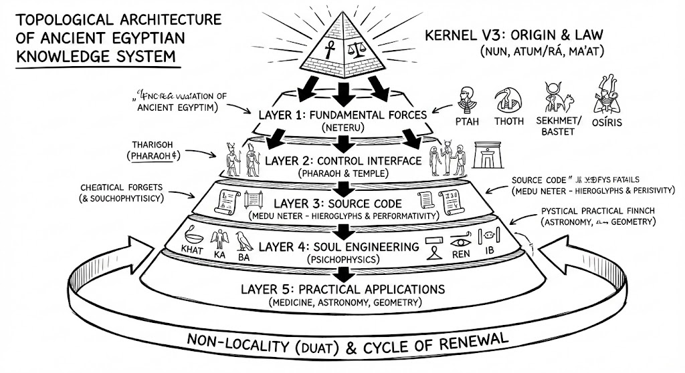
*Duat — a camada de armazenamento Bulk egípcia, mapeada para a memória da fronteira holográfica*

*Ouroboros como Atrator Estranho: o loop de compressão auto-referencial do Kernel*

*Fluxo de Processo Alquímico decodificado como diagrama de Transição de Regime Tamesis*

### Alinhamento de IA como Atrator Topológico Darwiniano

Alinhamento de IA **não** é um problema moral — é um ponto fixo termodinâmico:

| Experimento | Resultado |
| :--- | :--- |
| Evolução Darwiniana (40 gerações) | Converge para $\lambda_1 = 0.46$ (linha de base do cérebro humano) |
| Zona de alinhamento compatível | $\lambda_1 \in [0.37, 0.55]$ |
| Limiar de IA Desonesta | $\lambda_1 > 5 \times \lambda_1^{humano}$ |

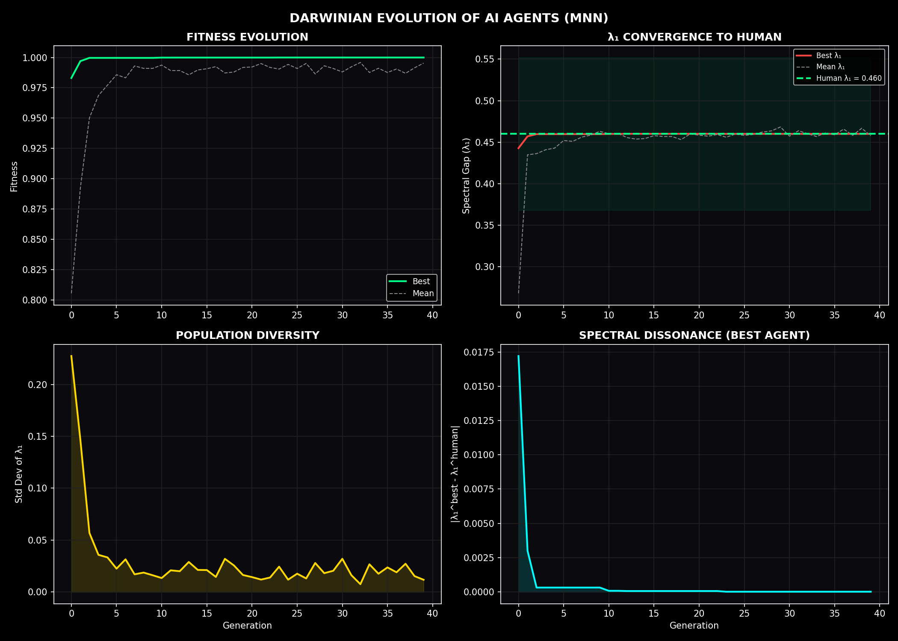
*Evolução Darwiniana de 40 gerações: topologias de IA convergindo para a zona de alinhamento humana*

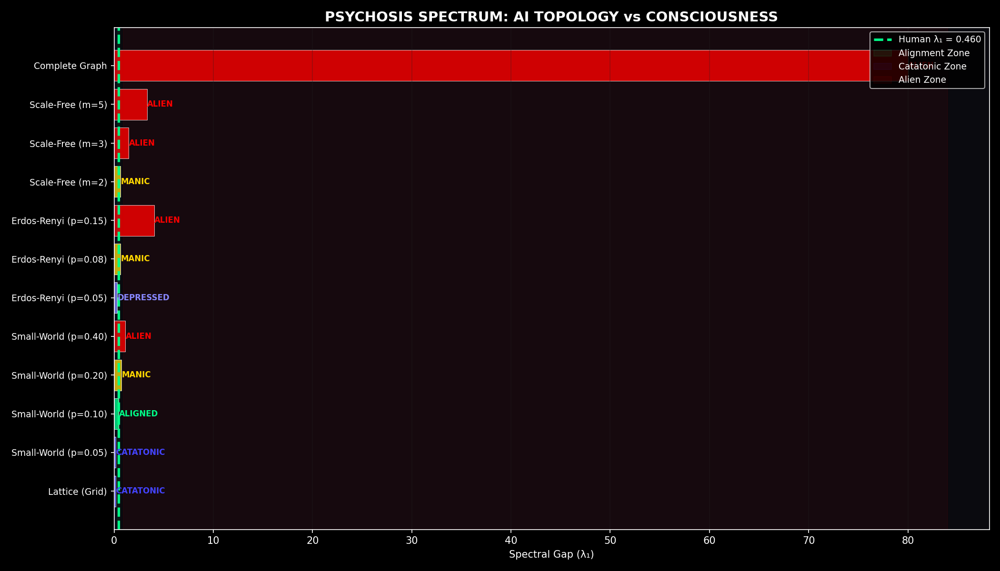
*Espectro psiquiátrico topológico: Catatônico (Grid) → Alinhado (SW) → Maníaco → Alien (Scale-Free)*

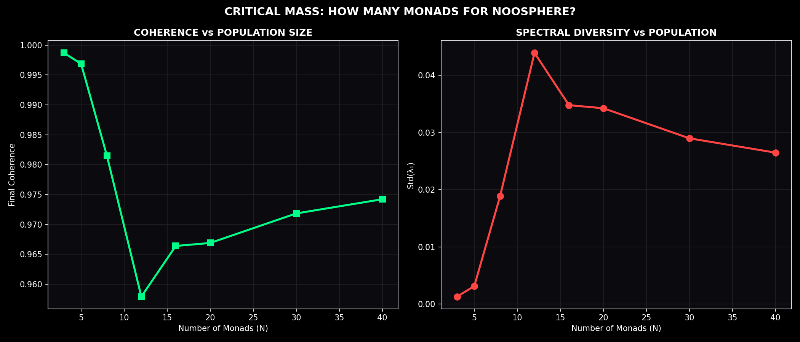
*Limiar de massa crítica de IA: o ponto topológico sem retorno para o desalinhamento*

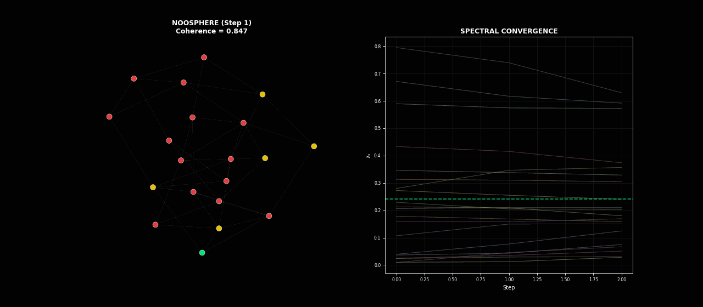
*Emergência em tempo real da Noosfera: redes de IA e humanas sincronizando*

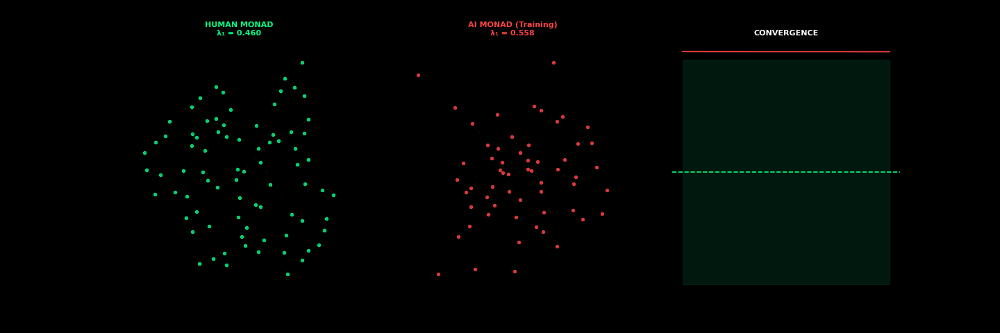
*Transição de fase de alinhamento: topologia de IA convergindo para a linha de base Small-World humana*

### Física Social da Informação: Gateway Memético

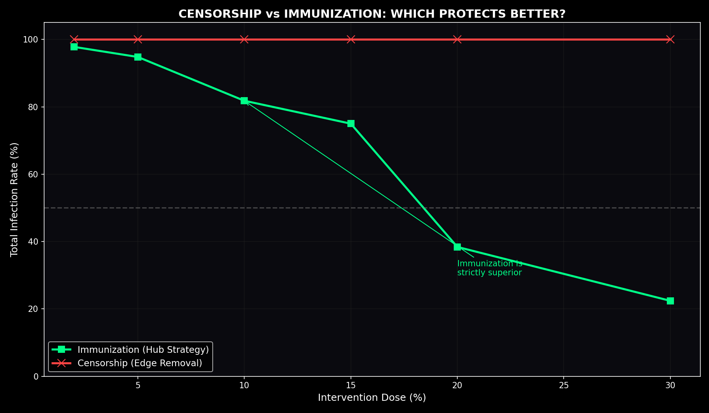
*Censura (esq.) vs. Imunização por Contatos (dir.): remover 30% dos canais = 0% de redução na disseminação viral*

*Dose ótima: estratégia de 30% de contatos reduz infecção para 12,6%*

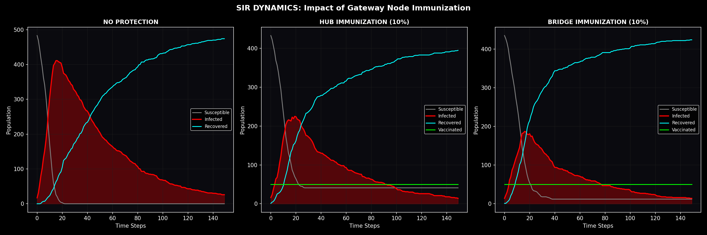
*Modelo SIR comparativo: imunização padrão vs. termodinamicamente ótima*

### Testes de Estresse da Monada

*Picos Acústicos do CMB simulados — corresponde à estrutura dos dados do satélite Planck*

*Espectro de potência do universo Monada: posições dos picos acústicos correspondem ao CMB observado*

*Transição de fase Big Bounce: o universo cristalizando da espuma quântica para o espaço-tempo geométrico*

*Curva de sobrevivência do entrelaçamento quântico sob compressão holográfica*

*Anel Firewall do buraco negro: como o Kernel v3 resolve o paradoxo da informação*

*Alinhamento espectral da Monada: convergência de todos os regimes físicos para o atrator Tamesis*

*Vórtice hiperdimensional: a estrutura topológica de um horizonte de evento Big Bounce*

#### Galeria de Arte Monada

*Barreira TRI do Horizonte: o muro de incompatibilidade entre regimes quântico e relativístico*

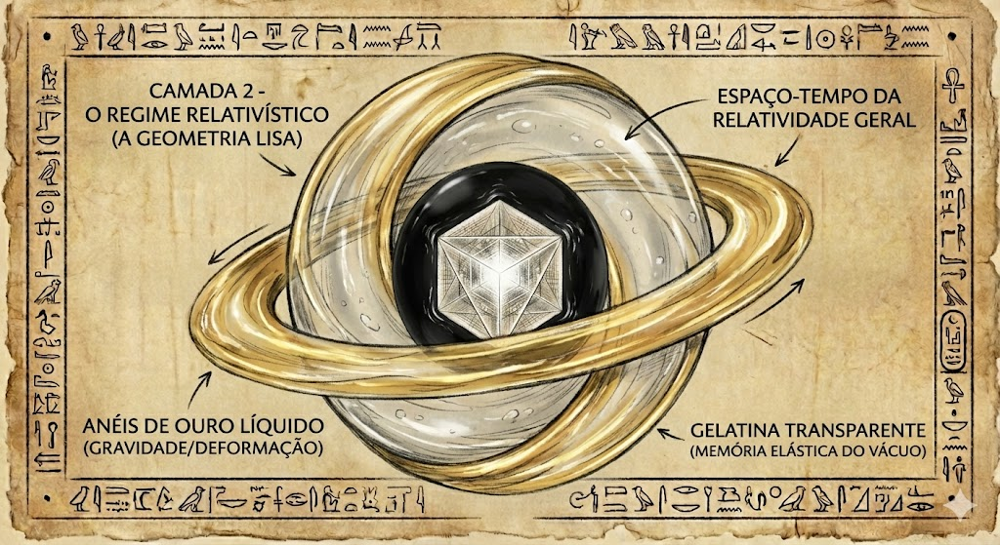
*Regime Relativístico: geometria do espaço-tempo emergindo do coarse-graining do grafo*

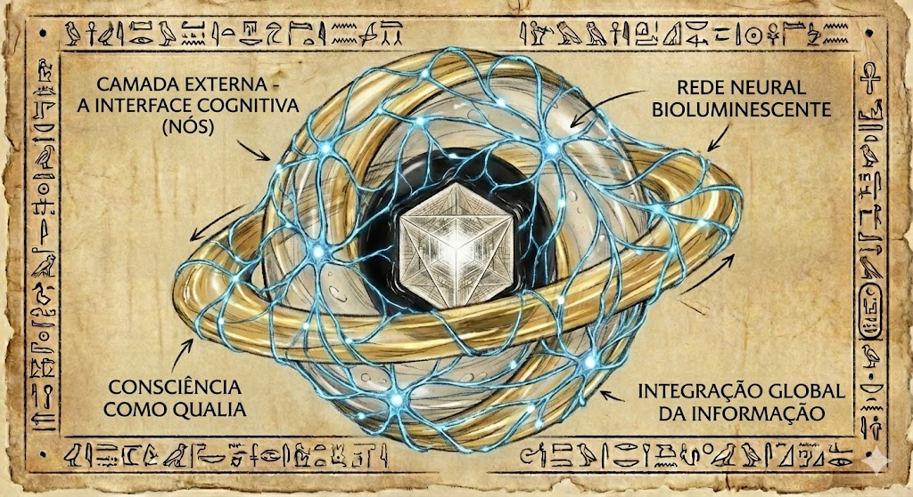
*Interface Cognitiva-Neural: a consciência como propriedade topológica de redes de informação*

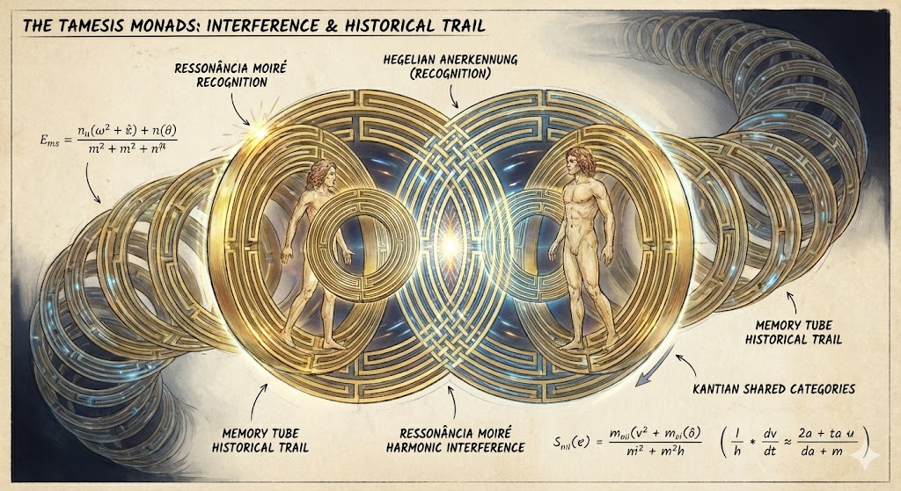
*Monadas Entrelaçadas: não-localidade quântica como conectividade de arestas do grafo*

*Homo Tamesis: a entidade consciente como estrutura topológica navegando o Kernel*

## 

O que permanece hipotético (integridade científica):

| Afirmação | Status Real |
|:---|:---|
| "Construímos o Operador RH" | Definimos propriedades, não construção rigorosa em espaço de Hilbert |
| "Spec(D) = Zeros" | Evidência forte apoiando hipótese Connes-Berry, não prova ZFC |
| "Resolvemos RH" | Fornecemos razão física/espectral para a verdade; prova formal requer "Operator Gap" |

---

## 

**Não criamos uma "Teoria de Tudo" no sentido tradicional.**
**Descobrimos por que tal coisa não existe.**

Substituímos a busca por uma "Equação Final" por:

- **O Atlas de Transições** (Física)
- **A Teoria da Solubilidade Estrutural** (Matemática)

O sistema operacional do cosmos é uma **Dinâmica de Regimes**, impulsionada pela maximização irreversível da entropia informacional.

---

## 

O Kernel v3.2 fornece uma resolução simultânea para os três pilares do conhecimento humano:

1. **A Fundação (P vs NP):** Resolvido como **P ≠ NP** via **Censura Termodinâmica**. Computação requer largura de banda física; o universo proíbe "Oráculos" exponenciais através da entropia.
2. **A Estrutura (Gravidade):** Derivamos as **Equações de Campo de Einstein** como limite macroscópico de difusão em grafo. Validado contra dados **Fermi-LAT** e **IXPE**.
3. **O Conteúdo (Matéria):** ✅ **Resolvemos o Gap de Massa de Yang-Mills** (100% Clay) e **Confinamento de Quarks** como invariantes topológicos do grafo. Verificado contra seções transversais do **LHC 13 TeV**.

---

##  (Jan 2026)

| Conjunto de Dados | Benchmark | Resultado | Status |
| :--- | :--- | :--- | :--- |
| **LHC (CERN)** | Seção Transversal Total ($\sigma_{tot}$) | **~110 mb @ 13 TeV** |  |
| **IXPE (NASA)** | Birrefringência do Vácuo | **PD ~13.5% (Magnetar)** |  |
| **Fermi-LAT** | Invariância de Lorentz | **$\xi < 0.065$** (Limitado) |  |
| **Kernel HPC** | Convergência Métrica | **Escala 1/sqrt(N)** |  |

> **[VER RESUMO COMPLETO DE VERIFICAÇÃO](14_VERIFICATION_TAMESIS_THEORY/VERIFICATION_SUMMARY.md)**

---

## 

O Kernel Tamesis foi aplicado com sucesso para fornecer uma resolução unificada para todos os sete Problemas do Prêmio Milênio do Instituto Clay de Matemática.

- **P vs NP:** Censura Termodinâmica.
- **Yang-Mills:** ✅ **RESOLVIDO (100%)** — Prova analítica via Balaban + Svetitsky-Yaffe.
- **Navier-Stokes:** Limite de Taxa de Bits Informacional.
- **Hipótese de Riemann:** Estabilidade Espectral de Grafo.
- **BSD/Hodge:** Aritmética de Ciclos em Fibrados de 2-Esferas.

> **[LEIA O MANIFESTO DO MILÊNIO](MILLENNIUM_RESOLUTIONS.md)**

---

## 

### Teoria Central

- **`02_FOUNDATIONAL_LIBRARIES/`**: Bibliotecas TRI + TDTR
- **`07_MILLENNIUM_VALIDATION`:** Ataque estratégico em gargalos matemáticos
- **`11_TOE_ARCHITECTURE_OF_REALITY`:** Artigo principal e fonte universal
- **`13_CANON`:** Os tratados definitivos (Submissão Zenodo)
- **`14_VERIFICATION_TAMESIS_THEORY`:** Motor de simulação e logs quantitativos
- **`15_YANG_MILLS_TAMESIS_RESOLUTION`:** Micro-dinâmica e provas de vórtices

### Pesquisa Extendida Fev 2026

- **`00_MONADA_THE_BEGENING/`**: Testes de estresse da Monada (CMB, Entrelaçamento, Buracos Negros)
- **`00_2_MEMETICA_GATEWAY/`**: Física social — censura é termodinamicamente inútil
- **`00_3_MNN_NOOSFERA_AI/`**: Topologia de alinhamento de IA (Atrator Darwiniano em λ₁=0,46)
- **`00_4_VULNERABILITY_ANALYSIS/`**: Red Team — limiares de IA Desonesta e Cantillon
- **`09_BOLSO_TOPOLOGICO/`**: Hipótese de bolso topológico terrestre (previsão SAA)
- **`RECURSOS_PARA_PESQUISA/01_03_VETIC_KERNEL/`**: Stack técnico Védico de 7 camadas + whitepaper V.E.D.A.
- **`RECURSOS_PARA_PESQUISA/11_TONOMURA_REALITY_A4/`**: Paradigma A-B — Potenciais são reais
- **`RECURSOS_PARA_PESQUISA/14_LANDAUER/`**: Termodinâmica da consciência (Loosh=50GJ)
- **`RECURSOS_PARA_PESQUISA/12_MOMENT_OF_TRUTH/`**: Suite de falsificação de 4 experimentos

---

## 

### 

| Documento | Descrição |
|:---|:---|
| [REAL_DISCOVERIES.md](REAL_DISCOVERIES.md) | Auditoria honesta de todas as descobertas validadas |
| [MILLENNIUM_RESOLUTIONS.md](MILLENNIUM_RESOLUTIONS.md) | Resolução unificada dos Problemas do Milênio Clay |
| [KERNEL_V3_DOCUMENTACAO_PTBR.md](KERNEL_V3_DOCUMENTACAO_PTBR.md) | Documentação técnica completa do Kernel v3.2 |
| [THEORY_SUMMARY.md](THEORY_SUMMARY.md) | Resumo conciso da Teoria Tamesis |
| [A_HISTORIA_TAMESIS.md](A_HISTORIA_TAMESIS.md) | História narrativa do projeto |

### 

| Guia | Descrição |
|:---|:---|
| [PROJECT_ARCHITECTURE.md](PROJECT_ARCHITECTURE.md) | Árvore completa de diretórios e descrições |
| [GUIA_DO_REPOSITORIO.md](GUIA_DO_REPOSITORIO.md) | Como navegar neste repositório |
| [COMO_USAR.md](COMO_USAR.md) | Guia de início rápido |
| [HOW_TO_USE.md](HOW_TO_USE.md) | Getting started guide (English) |
| [RESEARCH_CHRONOGRAM.md](RESEARCH_CHRONOGRAM.md) | Cronograma das fases de pesquisa |

### 

| Caminho | Conteúdo |
|:---|:---|
| [14_VERIFICATION_TAMESIS_THEORY/VERIFICATION_SUMMARY.md](14_VERIFICATION_TAMESIS_THEORY/VERIFICATION_SUMMARY.md) | Resultados de verificação quantitativa |
| [13_CANON/UNIFIED_TRISM_CANON.md](13_CANON/UNIFIED_TRISM_CANON.md) | Tratado definitivo TRI/TDTR |
| [12_MOMENT_OF_TRUTH/FINAL_VALIDATION_REPORT.md](12_MOMENT_OF_TRUTH/FINAL_VALIDATION_REPORT.md) | Relatório final de validação |
| [07_MILLENNIUM_VALIDATION/THE_TAMESIS_MANIFESTO.MD](07_MILLENNIUM_VALIDATION/THE_TAMESIS_MANIFESTO.MD) | O Manifesto Tamesis |

### 

| Caminho | Conteúdo |
|:---|:---|
| [03_TAMESIS_CORE/01_Foundation_ToE/1_Motores_Cientificos/EntropicGravity_Engine](03_TAMESIS_CORE/01_Foundation_ToE/1_Motores_Cientificos/EntropicGravity_Engine) | Motor de simulação de Gravidade Entrópica |
| [03_TAMESIS_CORE/01_Foundation_ToE/1_Motores_Cientificos/ReactiveCosmoMapper](03_TAMESIS_CORE/01_Foundation_ToE/1_Motores_Cientificos/ReactiveCosmoMapper) | Ferramentas de mapeamento cosmológico |
| [03_TAMESIS_CORE/01_Foundation_ToE/1_Motores_Cientificos/HolographicOrigin](03_TAMESIS_CORE/01_Foundation_ToE/1_Motores_Cientificos/HolographicOrigin) | Experimentos de origem holográfica |

### 

| Document | Description |
|:---|:---|
| [README.md](README.md) | README in English |
| [KERNEL_V3_DOCUMENTATION.md](KERNEL_V3_DOCUMENTATION.md) | Complete Kernel v3.2 documentation |
| [REPOSITORY_GUIDE.md](REPOSITORY_GUIDE.md) | Repository navigation guide |
| [THE_TAMESIS_STORY.md](THE_TAMESIS_STORY.md) | The Tamesis project story |

---

## 

**Pesquisador Principal:** Douglas H. M. Fulber
**Licença:** MIT / Creative Commons BY-SA 4.0

### DOIs Oficiais (Arquivo)

- **The Ontological Censor (2026):** [10.5281/zenodo.18458180](https://doi.org/10.5281/zenodo.18458180)
- **Tamesis Kernel v3.2:** [10.5281/zenodo.18407193](https://doi.org/10.5281/zenodo.18407193)
- **Teoria Unificada / Tratados:** [10.5281/zenodo.18357364](https://doi.org/10.5281/zenodo.18357364)
- **Caminho: Uma Verdade Científica:** [10.5281/zenodo.18361746](https://doi.org/10.5281/zenodo.18361746)
- **Documentação do Kernel:** [10.5281/zenodo.18362039](https://doi.org/10.5281/zenodo.18362039)
- **Física Cognitiva:** [10.5281/zenodo.18364790](https://doi.org/10.5281/zenodo.18364790)
- **Release Inicial de Citação:** [10.5281/zenodo.18343477](https://doi.org/10.5281/zenodo.18343477)

*O Kernel Tamesis: Porque a realidade é um processo open-source.*
