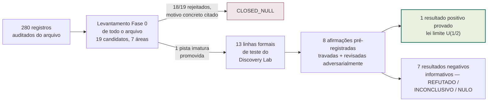
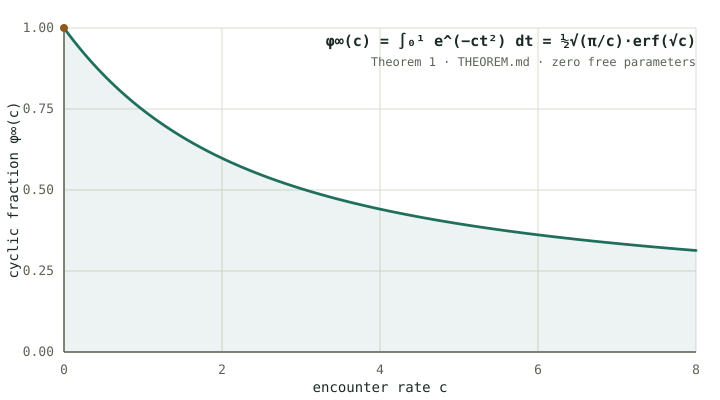
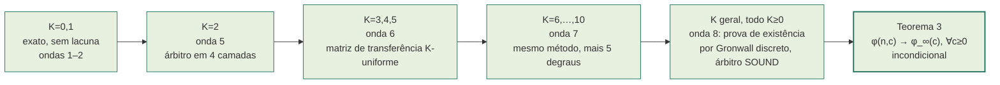
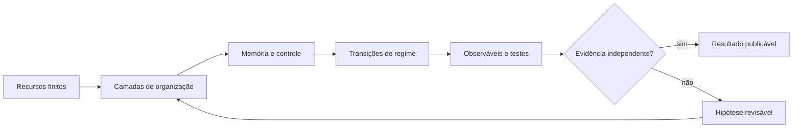
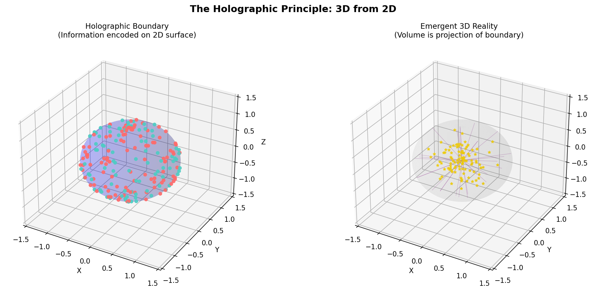
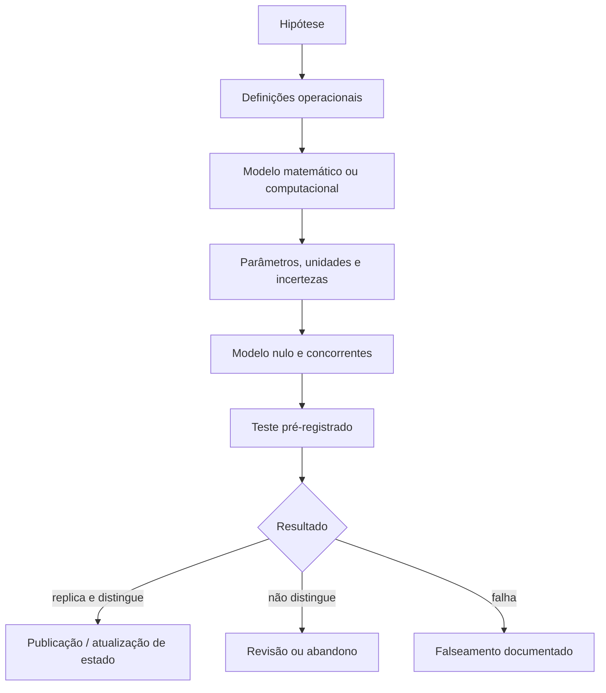
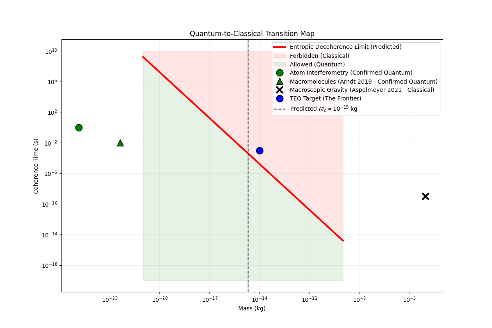
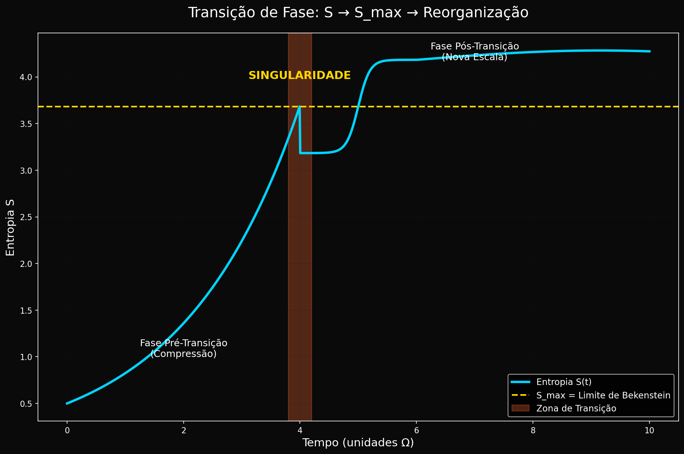

# Tamesis Discovery Lab — Arquivo de Pesquisa Adversarial

[](RELATORIO_PROGRESSO_AUDITORIA_ARTIGOS.md)
[](RELATORIO_PROGRESSO_AUDITORIA_ARTIGOS.md)
[](05_DISCOVERY_LAB/01_PORTFOLIO/TEST_QUEUE.yaml)
[](05_DISCOVERY_LAB/00_GOVERNANCE/CLAIM_LEDGER.yaml)
[](05_DISCOVERY_LAB/00_GOVERNANCE/DECISION_LEDGER.yaml)
[%20limit%20law-closed--form%20%C2%B7%20unconditional%20%C2%B7%20adversarially%20verified-8c5a1f?style=for-the-badge)](tamesis-cycle-survival/)
[](PROJECT_STATE.json)
[](LICENSE)
[](README.md#governance-authorship-and-responsibility)
[-6c757d?style=for-the-badge)](README.md)

**Idiomas:** [English](README.md) · **Português (BR)** · [日本語](README_JA.md) · [中文（简体）](README_ZH.md) · [Español](README_ES.md)

> **Um arquivo de pesquisa interdisciplinar sobre informação, geometria, transições de fase, sistemas complexos e cognição — com hipóteses mantidas explicitamente separadas das evidências.**

Este repositório preserva a trajetória completa do Laboratório Tamesis: seu ramo experimental atual e suas linhas de pesquisa históricas, matemáticas, físicas, computacionais e cognitivas. O arquivo contém **280 registros auditados**, organizados em **274 dossiês de auditoria**. Auditar aqui não transforma conjectura em fato — torna explícito o que é uma prova, uma consequência condicional, um ajuste numérico, uma ilustração computacional, uma conjectura ou um cenário especulativo.

Desde 2026, o arquivo também mantém um **laboratório de adjudicação contínua** (`05_DISCOVERY_LAB`): cada afirmação quantitativa feita pelo próprio arquivo é encerrada, uma de cada vez, em confronto com referências externas reais, sob critérios pré-registrados e **reprodução adversarial obrigatória**. O resultado até agora — dezenas de encerramentos negativos catalogados com veredito final, e um resultado matemático positivo re-derivado de forma independente e verificado adversarialmente — está sintetizado no **[artigo do Discovery Lab](index.html)** (a página inicial do repositório).

## Leitura rápida

O relatório institucional [Visão Final do Laboratório Tamesis](RELATORIO_VISAO_FINAL_LABORATORIO_TAMESIS.md) apresenta as perguntas, respostas, impactos, aplicações e novas perguntas produzidas pelo programa de pesquisa como um todo. Uma [versão HTML/PDF pronta para impressão](RELATORIO_VISAO_FINAL_LABORATORIO_TAMESIS.html) também está disponível.

### Estado científico atual

| Camada | Estado | Interpretação correta |
|---|---|---|
| Arquivo e metodologia | **Completo / auditado** | Inventário, classificação de afirmações, fontes e critérios de falseabilidade estão todos registrados. |
| Modelos computacionais | **Congelados para auditoria** | Saídas reproduzíveis devem ser lidas como saídas de modelo, não como constantes medidas. |
| Tamesis `M_c v1` | **Hipótese testável** | O valor `M_c = 5.292674126388712e-16 kg` é um parâmetro de modelo, não uma medição. |
| Evidência física independente | **Ainda não estabelecida** | Nada neste arquivo constitui confirmação experimental da ontologia Tamesis. |
| Problemas do Prêmio Millennium e afirmações de Teoria de Tudo (TOE) | **Não resolvidos** | Esses textos são conjecturas, reduções ou argumentos de modelo restrito — não soluções aceitas. |
| Adjudicação numérica central | **Consolidação matemática completa — o Lema Aberto agora está provado incondicionalmente para todo `K` (2026-08-22)** | Ver abaixo — 3 afirmações encerradas negativamente com veredito final; a 4ª (`U₁/₂`) tem um núcleo provado, arbitrado adversarialmente três vezes de forma independente, com o Lema Aberto e a conjectura de taxa agora provados incondicionalmente para **todo** `K≥0` (não apenas `K=0,…,10`) — a última ressalva de regularidade nomeada foi fechada por uma prova de existência via desigualdade de Gronwall discreta, e a proposição condicional do arquivo foi promovida a um teorema incondicional (**Teorema 3**). |

### O programa de adjudicação (Discovery Lab, atualizado em 2026-08-22)

`05_DISCOVERY_LAB` executa adjudicação contínua das afirmações quantitativas deste arquivo em confronto com referências externas reais (PDG, CODATA, Planck, SPARC, Gaia, Odlyzko), com metodologia fixada *antes* de cada cálculo, proveniência completa para cada valor de referência, e **reprodução adversarial obrigatória** para qualquer achado positivo. Registro completo: `05_DISCOVERY_LAB/01_PORTFOLIO/TEST_QUEUE.yaml` e `05_DISCOVERY_LAB/00_GOVERNANCE/DECISION_LEDGER.yaml`. Síntese em formato de artigo: **[`index.html`](index.html)** (a página inicial do repositório).


```mermaid
flowchart LR
    R[280 registros<br/>auditados do arquivo] --> S[Levantamento Fase 0<br/>de todo o arquivo<br/>19 candidatos, 7 áreas]
    S -->|18/19 rejeitados,<br/>motivo concreto citado| N1[CLOSED_NULL]
    S -->|1 pista imatura<br/>promovida| L13[13 linhas formais<br/>de teste do<br/>Discovery Lab]
    L13 --> C8[8 afirmações pré-registradas<br/>travadas + revisadas adversarialmente]
    C8 --> V1["1 resultado positivo provado<br/>lei limite U(1/2)"]
    C8 --> V2[7 resultados negativos<br/>informativos — REFUTADO /<br/>INCONCLUSIVO / NULO]
    style V1 fill:#e8f0e0,stroke:#1f6f5c,stroke-width:2px
    style N1 fill:#f0e5e8,stroke:#7a3b4a
```

**O funil completo de sobrevivência (2026):**

| Linha | Testado | Resultado |
|---|---|---|
| Invariante interdomínio (TRI-RG) | 16 candidatos, 5 rodadas | `CLOSED_NULL` — 0 sobreviventes; 4 achados com `p<0.05` refutados por reprodução adversarial (explicações mundanas demonstradas) |
| Cosmologia SPARC/MOND + binárias largas Gaia | 4 testes pré-registrados | 4/4 inconclusivos por fatores de confusão reais demonstrados; 2 resultados de destaque legados descobertos como assentados em **dados fabricados** e refeitos com dados reais |
| Zeros da função zeta de Riemann (RH-REAL) | 12/12 itens do levantamento, todos finalmente resolvidos | 2 achados replicados (anti-agrupamento de intervalos consecutivos; escalonamento GUE `N^(-1/3)`); tanto os máximos FHK quanto a variância do número de zeros foram encerrados como `CLOSED_INCONCLUSIVE`, cada um com um componente forte confirmado adversarialmente (exclusão do lado iid ≥8.8σ; exclusão GUE ingênua de até 203σ — a reprodução adversarial ainda encontrou e corrigiu um 3º bug real no estimador primário) |
| Adjudicação de afirmações quantitativas centrais (onda 1) | 7 afirmações | `M_c` inconsistente (~190× entre valores); modelo de massa quark/nó falha no leave-one-out; `sin²θ_W=3/13` desviado em 7.5σ, com ajuste fixado no código (hardcoded); `α⁻¹=Ω^{1.03}` com 0 graus de liberdade; `n_s` do bounce não identificável; `Λ` holográfico ≡ `ρ_crit` por identidade algébrica |
| **Lei limite `U₁/₂` (ondas 2–8, consolidada)** | 1 teorema + 1 generalização + Lema Aberto, todo `K≥0` + conjectura de taxa para `K` geral, ambos incondicionais | **Provada, arbitrada adversarialmente (4 rodadas independentes, técnicas distintas), publicada como artigo + pacote reproduzível; `K=2` provado na onda 5, `K=3,4,5` na onda 6, `K=6,…,10` na onda 7 via método de matriz de transferência; a taxa para `K` geral foi primeiro provada condicionalmente na onda 7, e depois a própria ressalva de regularidade foi fechada na onda 8 via uma prova de existência por desigualdade de Gronwall discreta — o Lema Aberto e a conjectura de taxa agora estão PROVADOS incondicionalmente para todo `K`, promovendo a proposição condicional do arquivo a um teorema incondicional** (ver abaixo) |
| Levantamento de candidatos em todo o arquivo (Fase 0, além do TRI-RG) | 19 candidatos, 7 áreas | `CLOSED_NULL` — 18/19 rejeitados com motivo concreto citado; 1 pista imatura (assinaturas espectrais de EEG cognitivo) promovida a uma nova linha, ver abaixo |
| Cognição — assinatura espectral de EEG na depressão (Mumtaz, `DISC-COGNITIVE-EEG-SPECTRAL-001`) | 1 pré-registro travado, N=30 MDD/26 HC | `CLOSED_REFUTED` — entropia espectral **maior**, não menor, em pacientes com MDD (`d=1.447`, `p=3.97×10⁻⁶`) — direção oposta à hipótese testada, confirmada por uma reprodução adversarial independente feita do zero (números coincidem a <10⁻⁹) |
| Cosmologia SPARC-004 — autocalibração de `f_multi` (Estágio 1→2) | Pipeline validado + aplicado a dados reais de descoberta (30,203 sistemas) | `CLOSED_INCONCLUSIVE` — veredito mecânico `BOTH_FALSIFIED`, mas a etapa obrigatória de refutação (debunker) encontrou um fator de confusão real: um subgrupo de 19% da amostra (RUWE alto) é sistematicamente subcorrigido pelo modelo de `f_multi` de escalar único, com um excesso estatisticamente robusto mesmo no próprio bin de ancoragem da calibração |

### O resultado positivo de destaque: uma lei de universalidade exata em forma fechada

A classe de universalidade `U₁/₂` (permutação aleatória perturbada a uma taxa `c/n` em direção a um mapa aleatório) tem a lei limite exata:

<p align="center"></p>

> `φ_∞(c) = ∫₀¹ e^(−ct²) dt = ½·√(π/c)·erf(√c)` — zero parâmetros livres,

derivada analiticamente (não ajustada), corrigindo a conjectura original do arquivo `(1+c)^(-1/2)` (excluída já no primeiro coeficiente da série: `a₁ = 1/3 ≠ 1/2`, confirmado por enumeração exata). Este resultado agora é um **teorema provado**, não uma conjectura: um documento matemático autocontido (`THEOREM.md`) prova a forma fechada em seis passos, incluindo o tratamento correto do *size-biasing* (viés de tamanho) dos arcos visitados, e foi revisado por um agente independente atuando como árbitro hostil — **zero erros encontrados**.

A ponte entre o modelo finito e o objeto limite agora está provada **incondicionalmente para todo `K≥0`** — `φ(n,c) → φ_∞(c)` quando `n → ∞`, para todo `c ≥ 0` fixo, sem nenhuma hipótese não provada remanescente (`THEOREM.md`, "Teorema 3"):


```mermaid
flowchart LR
    K01["K=0,1<br/>exato, sem lacuna<br/>ondas 1–2"] --> K2["K=2<br/>onda 5<br/>árbitro em 4 camadas"]
    K2 --> K345["K=3,4,5<br/>onda 6<br/>matriz de transferência K-uniforme"]
    K345 --> K610["K=6,…,10<br/>onda 7<br/>mesmo método, mais 5 degraus"]
    K610 --> Kgen["K geral, todo K≥0<br/>onda 8: prova de existência<br/>por Gronwall discreto, árbitro SOUND"]
    Kgen --> Teo3["Teorema 3<br/>φ(n,c) → φ_∞(c), ∀c≥0<br/>incondicional"]
    style K01 fill:#e8f0e0,stroke:#1f6f5c
    style K2 fill:#e8f0e0,stroke:#1f6f5c
    style K345 fill:#e8f0e0,stroke:#1f6f5c
    style K610 fill:#e8f0e0,stroke:#1f6f5c
    style Kgen fill:#e8f0e0,stroke:#1f6f5c
    style Teo3 fill:#e8f0e0,stroke:#1f6f5c,stroke-width:2px
```

Cada degrau acima foi re-derivado de forma independente por um agente árbitro hostil separado, usando uma técnica de prova *diferente* da derivação original, sua própria enumeração por força bruta, e verificações completas de substituição recursiva — **zero erros encontrados em qualquer camada**, ao longo de 4 rodadas independentes de arbitragem. `K=6,…,10` foi adicionalmente confirmado bit a bit contra uma nova enumeração exaustiva em dois pontos retidos (held-out). O degrau final fechou a última lacuna nomeada remanescente: um árbitro hostil re-derivou de forma independente, do zero, uma indução exata por desigualdade de Gronwall discreta provando que a expansão de dois termos para `n` finito existe para *todo* `K`, não apenas os 11 valores concretamente verificados — veredito **SOUND, com problemas nomeados** (quatro encontrados, nenhum fatal, corrigidos via adendos datados). O **Lema Aberto** — agora provado incondicionalmente para todo `K` — é exatamente o caso de parâmetro fixo de Hansen & Jaworski (EJC, 2014); uma mistura de Poisson com forma fechada em `erf` não foi encontrada em uma busca sistemática na literatura (35+ consultas registradas), com a ressalva explícita de que isso não equivale a "inédito". Uma segunda frente derivou **por que o expoente é exatamente 1/2**: em toda uma família paramétrica de mecanismos de perturbação, `α ∈ [1/2, 1]` sempre — `α < 1/2` é *provadamente impossível* (um efeito de agrupamento quadrático que persiste mesmo sem qualquer "morte" de ciclicidade). A onda 5 também localizou e confirmou um mecanismo natural (`M-WEIB(β)`, risco de Weibull não homogêneo) que atinge todo `α ∈ (1/2, 1)` intermediário. Nenhuma implicação física é afirmada — trata-se de matemática combinatória pura sobre um ensemble específico.

**A forma fechada em todas as ordens (2026-08-23).** Cada degrau acima — `K=0,…,10`, a ponte para `K` geral, as constantes de erro em `n` finito — agora é um corolário de uma única fórmula exata. Ao estender a mesma técnica de expansão assintótica a um índice de ordem *simbólico*, revelou-se que os coeficientes de cada ordem são exatamente os números de Stirling de primeira espécie sem sinal e, como esses são precisamente os coeficientes de um fatorial ascendente, toda a expansão infinita se re-soma — não assintoticamente, mas de forma exata e finita (ela termina após `K+1` termos). O resultado é uma única expressão finita e totalmente explícita para a recursão subjacente, válida para todo `n`, `K` e parâmetro de deslocamento, com uma prova elementar independente que dispensa por completo o maquinário da expansão. Uma rodada dedicada de arbitragem hostil re-derivou as duas provas do zero, contra seu próprio simulador construído do zero (215,070 verificações exatas, zero divergências), confirmou a afirmação principal e encontrou um erro real em uma afirmação negativa secundária (corrigido via um adendo datado), além de duas rotulagens conservadoras que o documento original havia deixado deliberadamente sem prova — ambas provadas diretamente pelo árbitro. Ver `THEOREM.md`, "Estágio 9".

**Convergência uniforme em toda a faixa de parâmetros (2026-08-23).** O teorema acima afirma apenas que `φ(n,c) → φ_∞(c)` para cada `c` fixo, um de cada vez. Uma frente separada fechou essa lacuna de forma mais completa do que o pedido: a convergência é uniforme não apenas em faixas compactas `[0,C]`, mas em toda a semirreta `[0,∞)`, ambas provadas incondicionalmente a partir de dois lemas elementares curtos — um acoplamento Lipschitz e uma cota de cauda uniforme em `n` — que dispensam todo o maquinário acima. O perfil exato do erro de primeira ordem foi derivado em forma fechada como um bônus. Uma rodada de arbitragem hostil atacou com mais força os dois novos lemas e os dois teoremas incondicionais, e não encontrou erro em nenhum deles; sua única descoberta substantiva corrigiu qual lacuna específica permanecia aberta em um resultado secundário já condicional, tornando o próprio relato do arquivo sobre essa lacuna mais preciso, não menos. Ver `THEOREM.md`, "Estágio 10".

**Onde encontrar tudo:** o teorema completo e os relatórios dos árbitros estão em `05_DISCOVERY_LAB/02_TESTS/CORE_NUMERICS/u12_universality/theorem/`; a generalização e sua verificação adversarial em `.../generalization_u_alpha/`; um **pacote reproduzível autônomo** — artigo em LaTeX compilado (PDF), provas autocontidas, simulações clean-room e 49 testes automatizados — está em **[`tamesis-cycle-survival/`](tamesis-cycle-survival/)**. E a tabela honesta de **tudo o que este laboratório tentou e não sobreviveu** — para que este único resultado positivo seja lido no contexto correto — está em **[`FAILED_HYPOTHESES.md`](FAILED_HYPOTHESES.md)**.

Um levantamento honesto de todo o arquivo Tamesis (não restrito ao TRI-RG, 19 candidatos em 7 áreas) foi encerrado `CLOSED_NULL` — 18/19 rejeitados com motivo concreto citado — e promoveu a única pista imatura encontrada (assinaturas espectrais de EEG cognitivo, depressão vs. ansiedade) a uma nova linha candidata. Seu estágio de operacionalização está completo (observável definido como entropia espectral de Shannon normalizada, um modelo concorrente nomeado, poder estatístico calculado, acesso a dados reais verificado para o braço de depressão) — o braço de ansiedade permanece bloqueado por um provedor de dados que exige login humano, honestamente relatado como tal; nenhum dado real foi calculado ali. Ver `05_DISCOVERY_LAB/02_TESTS/ARCHIVE_PHASE0_SURVEY/SURVEY.md` e `05_DISCOVERY_LAB/02_TESTS/COGNITIVE_EEG_SPECTRAL/OPERATIONALIZATION.md`.

## Visão do laboratório

O programa investiga se sistemas sob recursos finitos podem construir camadas adicionais de organização quando o custo dessa complexidade é compensado por uma redução no erro, na dissipação, na instabilidade ou no custo de busca futuro. Este é um **princípio de modelagem**, não um propósito atribuído à natureza.

O laboratório conecta quatro níveis:

1. **Matemática:** operadores, espectros, topologia, grafos, universalidade e regularidade.
2. **Física fundamental:** informação, geometria, holografia, gravidade, partículas e transições quântico-clássicas.
3. **Sistemas complexos:** termodinâmica, memória, irreversibilidade, redes, estabilidade e controle.
4. **Vida e cognição:** o organismo integrado, interfaces cérebro-computador, consciência e ecossistemas cognitivos.


```mermaid
flowchart LR
    A[Recursos finitos] --> B[Camadas de organização]
    B --> C[Memória e controle]
    C --> D[Transições de regime]
    D --> E[Observáveis e testes]
    E --> F{Evidência independente?}
    F -->|sim| G[Resultado publicável]
    F -->|não| H[Hipótese revisável]
    H --> B
```



<p align="center"><sub>Figura 1 — Ilustração de trabalho do princípio holográfico. Esta é uma hipótese de modelagem, não evidência de que o universo é holográfico ou simulado.</sub></p>

## Comece aqui

- **[Artigo científico do Discovery Lab (2026) — adjudicação adversarial e a lei limite `U₁/₂`](index.html)** (página inicial do repositório)
- **Pacote reproduzível [`tamesis-cycle-survival/`](tamesis-cycle-survival/)** — artigo em LaTeX compilado, provas, simulações e testes automatizados para o teorema `U₁/₂`
- **[`FAILED_HYPOTHESES.md`](FAILED_HYPOTHESES.md)** — a tabela honesta de toda hipótese testada e não sobrevivente neste laboratório
- [Relatório de visão final do laboratório](RELATORIO_VISAO_FINAL_LABORATORIO_TAMESIS.md)
- [Versão HTML para apresentação e PDF](RELATORIO_VISAO_FINAL_LABORATORIO_TAMESIS.html)
- [Relatório de auditoria de 280 artigos](RELATORIO_PROGRESSO_AUDITORIA_ARTIGOS.md)
- [Protocolo de auditoria rigorosa](PROTOCOLO_AUDITORIA_RIGOROSA_DE_ARTIGOS.md)
- [Manifesto de inventário legível por máquina](ARTICLE_MANIFEST.csv)
- [Status de congelamento e condições de retomada](PROJECT_FREEZE.md)
- [Estado do projeto em JSON](PROJECT_STATE.json)
- [Linha do tempo](00_HOME/TIMELINE.md)
- [Mapa do arquivo](00_HOME/WORKSPACE_MAP.md)
- [Página inicial navegável](00_HOME/README.md)
- [Atlas interativo de hipóteses](atlas.html)
- [Mapa de dependência de provas da linha `U₁/₂`](05_DISCOVERY_LAB/02_TESTS/CORE_NUMERICS/u12_universality/PROOF_DEPENDENCY_MAP.md)

## As linhas de pesquisa

| Linha | Questão central | Estado atual | Aplicações potenciais |
|---|---|---|---|
| **A. Fundamentos e a arquitetura da realidade** | Informação, geometria ou computação podem gerar o espaço-tempo e leis efetivas? | Arquitetura conceitual e modelos candidatos. | Gravidade quântica, geometria informacional, modelagem de redes. |
| **B. Axiomas e pontes operacionais** | Um conjunto pequeno de axiomas reproduz as equações observadas sem ajuste específico por setor? | Fechamento parcial e condicional. | Derivação de modelos, testes de consistência, redução de parâmetros. |
| **C. TDTR, TRI e irreversibilidade** | Como os regimes mudam, e por que algumas transições são irreversíveis? | Vocabulário, bibliotecas e modelos de transição. | Termodinâmica, dinâmica dissipativa, setas do tempo. |
| **D. Universalidade** | Sistemas diferentes compartilham invariantes e leis de escala? | **Lei limite exata da classe `U₁/₂`, derivada e verificada adversarialmente (2026-08)**; busca empírica de invariante interdomínio encerrada nula (16/16). | Detecção de transições, análise de falhas, controle adaptativo. |
| **E. Espectros e Riemann** | Existe um operador cujo espectro realiza os zeros da zeta? | Rota matemática legítima; nenhuma prova da Hipótese de Riemann. | Teoria espectral, caos quântico, análise numérica. |
| **F. Computação, grafos e primos** | Estruturas aritméticas podem ser codificadas em grafos e sistemas computacionais? | Algoritmos e correspondências exploratórias. | Aprendizado em grafos, análise de redes, algoritmos espectrais. |
| **G. Cosmologia observacional** | Qual observável distingue Tamesis de `ΛCDM`, MOND e modelos concorrentes? | Catálogo de testes; nenhuma substituição empírica demonstrada. | CMB, BAO, supernovas, lenteamento gravitacional, SPARC, ondas gravitacionais. |
| **H. Buracos negros e singularidades** | Como informação e geometria lidam com horizontes e singularidades? | Modelos termodinâmicos/holográficos especulativos. | Informação quântica, gravidade, termodinâmica de horizontes. |
| **I. Partículas e topologia** | A topologia pode explicar massas, famílias, mistura e acoplamentos? | Mecanismos candidatos e relações numéricas. | Fenomenologia de partículas e testes de precisão. |
| **J. Limite quântico-clássico** | Quando e por que a dinâmica quântica se torna clássica? | Hipóteses concorrentes e desenhos experimentais. | Interferometria, optomecânica, metrologia quântica. |
| **K. Ecossistemas cognitivos** | Como organismos constroem perfis de controle, memória e consciência? | Agenda conceitual e programa empírico. | Neurociência de redes, fisiologia, interfaces cérebro-computador. |
| **L. Topologia cognitiva e cibernética híbrida** | Estados cognitivos podem ser classificados por invariantes relacionais/espectrais? | Estrutura teórica e protótipos de controle. | Sistemas humano-máquina e robótica corporificada. |
| **M. Estabilidade e operadores** | Coercividade, dissipação e margens espectrais detectam regimes patológicos? | Métodos candidatos e teoremas restritos. | Controle de infraestrutura, detecção de anomalias, redes adaptativas. |
| **N. Problemas do Prêmio Millennium** | A capacidade finita pode implicar teoremas sobre `P vs NP`, RH ou EDPs? | Nenhuma solução aceita; argumentos restritos. | Novos lemas matemáticos, não afirmações de resolução. |
| **O. Cosmologias especulativas e engenharia métrica** | Bounces, universos-pais ou métricas modificadas produzem observáveis? | Cenários especulativos. | Somente após uma solução covariante, estável e causal. |
| **P. Infraestrutura científica** | Como manter a pesquisa interdisciplinar reproduzível e honesta? | Inventário e auditoria rastreáveis. | Governança, revisão, preprints, colaboração externa. |

### Potencial de conclusão por linha (estimativa operacional, não uma métrica do arquivo)

A tabela abaixo estima, linha por linha, **quanto da lacuna nomeada em cada questão central já foi caracterizado** — não a probabilidade de a hipótese estar correta, nem uma métrica calculada pelo laboratório. É uma leitura externa, calibrada em relação ao estado real documentado para cada linha (`RELATORIO_VISAO_FINAL_LABORATORIO_TAMESIS.md` §6 e `05_DISCOVERY_LAB/`), com uma correção importante ao inventário original: **a Linha D deve ser lida em duas partes.** O subconjunto `U₁/₂`, rigorosamente adjudicado pelo Discovery Lab, está bem avançado; mas a Linha D como um todo — que no relatório original também inclui `U₀`, `U₂`/Lindblad, o atlas da classe geral e aplicações topológicas — **não** avançou na mesma proporção: o próprio levantamento de todo o arquivo feito pelo laboratório (`DISC-ARCHIVE-PHASE0-SURVEY-001`) registra que `U₀` e `U₂`, diferentemente de `U₁/₂`, nunca alcançaram um candidato em forma fechada. Tratar a "Linha D" como 85% resolvida seria exatamente o tipo de confusão que a disciplina deste arquivo existe para evitar.

| Posição | Linha | Conclusão estimada | Status | Para fechar |
|---:|---|---:|---|---|
| 🥇 | **D — `U₁/₂`** (subconjunto adjudicado, `DISC-CORE-NUMERICS-001`) | **~97%** | ✅ Lema Aberto e conjectura de taxa para `K` geral provados **incondicionalmente para todo `K≥0`** (2026-08-22); a forma fechada exata, finita, em todas as ordens, para `K` geral, da recursão subjacente também está **provada** (2026-08-23), a convergência `φ(n,c)→φ_∞(c)` é provada **uniforme em `c` em toda a faixa `[0,∞)`**, não apenas pontual (2026-08-23), e uma **taxa de convergência explícita e incondicional** `|Δ_n(c)|≤[(1+√(π/2))√c+0,2805]/n` também está agora provada (2026-08-23, constante não-nítida) — todo resultado anterior em `n` finito nesta linha agora é um corolário de uma única fórmula | Restante, nenhum central: o resíduo M-CLUST(b) (um mecanismo separado, `PARTIALLY CLOSED`); a lei distribucional completa (Conjecturas 1–2, agora provada em `K=1,2` desde 2026-08-23 — `K≥3` aberto, não tentado); uma forma fechada para as constantes de erro precisas (agora provada para `p=1,...,10` em todo `b≥0` desde 2026-08-24, com a máquina geral-`k` subjacente provada correta para todo `k` por indução — `p>10` aberto só por não ter sido executado, não por incerteza matemática); a constante **nítida** na taxa explícita acima (`a*≈0,367` vs. o valor não-nítido `a≈2,253` já provado, embora o *limite* `lim_K M_K/√K=a*` já esteja agora provado exatamente, 2026-08-23 — resta aberto apenas o supremo uniforme-em-`K`) — ver [mapa de dependência](05_DISCOVERY_LAB/02_TESTS/CORE_NUMERICS/u12_universality/PROOF_DEPENDENCY_MAP.md) |
| 🥈 | **P — Infraestrutura** | **~90%** | 🔧 Em andamento — desde jul/2026 ganhou uma segunda camada: pré-registro + reprodução adversarial obrigatória + registros de decisão/afirmações (`05_DISCOVERY_LAB/00_GOVERNANCE/`) | Versionamento semântico, dados/código abertos, revisão externa |
| 🥉 | **B — Axiomas** | 35% | 🟡 Promissora | Provar que as pontes preservam simetrias/conservação sem ajuste específico por setor |
| 4 | **E — Riemann** | 30% | 🟡 Exploratória — desde jul/2026, todos os 12 itens do levantamento `RH-REAL` finalmente resolvidos; 2 achados replicados (anti-agrupamento; escalonamento GUE), nenhum sobre a RH em si | Operador autoadjunto cujo espectro realiza os zeros, com controle de erro completo |
| 5 | **M — Estabilidade** | 30% | 🟡 Exploratória | Pequeno teorema, hipóteses completas, benchmark contra Lyapunov/LQR |
| 6 | **C — Irreversibilidade** | 25% | 🟡 | Uma monotônica não trivial + uma classe de transição testável |
| 7 | **F — Grafos/primos** | 25% | 🟡 | Benchmarks e teoremas formais de correspondência |
| 8 | **J — Quântico-clássico** | 25% | 🟡 | Um protocolo cego separando decoerência, colapso e gravidade |
| 9 | **L — Topologia cognitiva** | 25% | 🟡 | Invariante definido + confiabilidade entre avaliadores + dados independentes |
| 10 | **A — Fundamentos** | 20% | ⚪ | Uma ação mínima com graus de liberdade, unidades e uma nova previsão |
| 11 | **G — Cosmologia** | 20% | ⚪ — desde jul/2026, 4 testes pré-registrados **executados** com dados reais (SPARC-001…004), todos `CLOSED_INCONCLUSIVE`; um achado honesto de fator de confusão por RUWE, não apenas um catálogo de testes pendentes | Um observável que distingue Tamesis de `ΛCDM`/MOND e sobrevive fora da amostra |
| 12 | **I — Partículas** | 20% | ⚪ | Uma ação de calibre completa + renormalização + unitariedade + uma previsão para colisores |
| 13 | **H — Buracos negros** | 15% | ⚪ | Tensor métrica/energia-momento + causalidade + um observável de horizonte |
| 14 | **K — Cognição** | 15% | ⚪ — desde jul/2026, uma hipótese concreta testada e adversarialmente **refutada** (`DISC-COGNITIVE-EEG-SPECTRAL-001`: entropia espectral de EEG na depressão, efeito real na direção oposta à prevista); a questão ampla (controle/memória/consciência) ainda carece de um único modelo | Reduzir a um fenômeno mensurável com previsão reproduzível |
| 15 | **O — Cosmologias especulativas** | 10% | ⚪ | Uma solução covariante consistente antes de qualquer observável |
| 16 | **N — Millennium** | 5% | 🔴 — nenhuma solução; esta linha está permanentemente fora de escopo para afirmações de resolução | Um teorema completo e verificável para o problema original, não uma heurística restrita |

**Como não usar esta tabela.** Um "90%" não significa 90% de chance de a classe `U₁/₂` estar correta, nem que a Linha D está perto de concluída — significa que, das lacunas explicitamente nomeadas naquela questão específica, a maioria já foi provada ou precisamente caracterizada. A ressalva de regularidade para `K` geral, que era a última lacuna nomeada da linha principal, foi fechada em 2026-08-22 (`DISC-DEC-040`); a capacidade de pesquisa remanescente em `D — U₁/₂` agora vai para o resíduo M-CLUST(b) separado (ainda `PARTIALLY CLOSED`) e para as questões genuinamente abertas e não centrais nomeadas acima.

## Um ciclo de pesquisa verificável


```mermaid
flowchart TD
    A[Hipótese] --> B[Definições operacionais]
    B --> C[Modelo matemático ou computacional]
    C --> D[Parâmetros, unidades e incertezas]
    D --> E[Modelo nulo e concorrentes]
    E --> F[Teste pré-registrado]
    F --> G{Resultado}
    G -->|replica e distingue| H[Publicação / atualização de estado]
    G -->|não distingue| I[Revisão ou abandono]
    G -->|falha| J[Falseamento documentado]
```

Este ciclo é a regra editorial do arquivo. Uma simulação que reproduz uma curva não é automaticamente uma descoberta; uma coincidência numérica não é uma derivação; e uma analogia entre sistemas não é uma identidade física.

## Núcleo experimental atual: `Tamesis M_c v1`

O ramo experimental atual está congelado em `frozen_and_ready`, com a qualificação de hardware ainda não iniciada. O Demonstrador A começa com calibração cega de termometria óptica entre 5 K e 20 K; ele **ainda não mede `M_c`**.

- [README do `Tamesis M_c v1`](01_TAMESIS_CORE/02_Experimental_Validation/Quantum_Classical_Transition/tamesis_mc_v1/README.md)
- [Relatório de execução do Demonstrador A v0.6](01_TAMESIS_CORE/02_Experimental_Validation/Quantum_Classical_Transition/tamesis_mc_v1/reports/DEMONSTRATOR_A_V0_6_EXECUTION_REPORT.md)
- [Saídas visuais, figuras e animações](02_TAMESIS_MC_V1_OUTPUTS/README.md)
- [Pacote de colaboração experimental](03_EXPERIMENTAL_COLLABORATION_PACKAGE/README.md)



<p align="center"><sub>Figura 2 — Mapa de limites usado como guia de testes. Regiões e marcadores representam hipóteses e dados de referência; não constituem confirmação de uma fronteira universal.</sub></p>

## Sistemas complexos e transições



<p align="center"><sub>Figura 3 — Visualização conceitual de compressão, saturação e reorganização. Esta é uma ilustração de modelo, não uma lei empírica geral.</sub></p>

O laboratório usa uma linguagem comum para comparar sistemas: **estado, recursos, acoplamentos, memória, transição, dissipação, estabilidade, observável e critério de falha**. A comparação é metodológica — não afirma que uma galáxia, uma célula, um grafo e um cérebro sejam o mesmo tipo de objeto.

## O que o laboratório já alcançou

- um inventário e auditoria completos e rastreáveis de 280 registros;
- uma separação explícita entre prova, hipótese, modelo, ajuste, simulação e cenário especulativo;
- um atlas de regimes, transições, operadores, redes e sistemas cognitivos;
- um catálogo de testes observacionais e experimentais com modelos nulos;
- uma versão institucional em HTML/PDF para apresentação acadêmica;
- preservação de versões históricas sem endossar suas afirmações como resultados atuais;
- **adjudicação adversarial completa das afirmações quantitativas centrais** (2026): 30+ afirmações encerradas sob critérios pré-registrados, incluindo a detecção e correção de 2 resultados de destaque legados construídos sobre dados fabricados;
- **um novo resultado matemático, derivado e verificado adversarialmente**: a lei limite exata em forma fechada `φ_∞(c) = ½√(π/c)·erf(√c)` da classe `U₁/₂` (ver o [artigo](index.html));
- dois achados replicados sobre os zeros reais da função zeta de Riemann (anti-agrupamento de intervalos consecutivos; escalonamento GUE de intervalo mínimo).

## O que ainda não foi demonstrado

O arquivo **não afirma** ter resolvido a Hipótese de Riemann, `P vs NP`, Navier–Stokes, Yang–Mills, Hodge, ou Birch–Swinnerton-Dyer. Também não há demonstração aceita de que Tamesis substitui `ΛCDM`, elimina matéria escura/energia escura, atribui à consciência um papel causal no colapso quântico, viabiliza propulsão métrica, ou prova que o universo é uma simulação.

Essas linhas permanecem conjecturas, programas de teste ou modelos restritos até que produzam provas formais, dados independentes, novas previsões e replicação.

## Estrutura do repositório

| Pasta/arquivo | Função |
|---|---|
| `00_HOME` | Orientação, linha do tempo e mapa do arquivo. |
| `01_TAMESIS_CORE` | Teoria central, modelos, ativos e validação experimental atual. |
| `02_TAMESIS_MC_V1_OUTPUTS` | Cópias convenientes de figuras e animações do ramo `M_c v1`. |
| `03_EXPERIMENTAL_COLLABORATION_PACKAGE` | Materiais para colaboração e qualificação experimental. |
| `05_DISCOVERY_LAB` | Laboratório de adjudicação: fila de testes, registros de governança, notas de metodologia, resultados e vereditos adversariais. |
| `index.html` | **Artigo de síntese do programa de adjudicação** (página inicial; figuras e script gerador em `ARTIGO_DISCOVERY_LAB/figures/`). |
| `tamesis-cycle-survival` | Pacote reproduzível autônomo para o teorema `U₁/₂` — artigo em LaTeX compilado, provas, simulações clean-room e testes automatizados. |
| `FAILED_HYPOTHESES.md` | Tabela completa e honesta de toda hipótese/candidato testado pelo Discovery Lab, sobrevivente ou não. |
| `computational_freeze.html` | Página inicial raiz anterior (estado congelado do Tamesis `M_c v1`), preservada. |
| `90_LEGACY` | Ramos históricos, superados, especulativos ou atualmente sem suporte. |
| `RECURSOS_PARA_PESQUISA` | Materiais de referência; não são evidências produzidas pelo projeto. |
| `publicar` / `publicados` | Organização editorial de artigos destinados à publicação e já publicados. |
| `ARTICLE_MANIFEST.csv` | Inventário de artigos legível por máquina. |
| `RELATORIO_PROGRESSO_AUDITORIA_ARTIGOS.md` | Acompanhamento de auditoria artigo por artigo. |
| `RELATORIO_VISAO_FINAL_LABORATORIO_TAMESIS.html` | Documento institucional pronto para PDF. |

## Governança, autoria e responsabilidade

**Direção científica, autoria principal e curadoria deste arquivo:** **Douglas H. M. Fulber**.

O Laboratório Tamesis é conduzido como um programa de pesquisa independente dentro deste repositório. Menções a universidades, laboratórios, autores ou DOIs em documentos históricos não implicam endosso institucional, coautoria ou validação externa, a menos que exista autorização explícita e registro correspondente.

A governança editorial segue estas regras:

1. o mantenedor responsável controla a classificação de status, a organização das linhas e a aceitação de mudanças estruturais;
2. contribuições externas são bem-vindas, mas não alteram autoria, proveniência ou status de evidência sem uma revisão registrada;
3. novos resultados devem incluir método, dados/código quando aplicável, incertezas, um modelo nulo, limitações e um critério de falseabilidade;
4. documentos legados permanecem por proveniência e não são automaticamente promovidos a resultados válidos;
5. qualquer publicação derivada deve citar o laboratório, o autor/curador e a versão específica do arquivo utilizada.

Para propor uma colaboração ou correção, abra uma issue/patch documentando: arquivo afetado, justificativa, fontes, impacto na classificação e um teste de verificação.

## Licença e atribuição

O material original deste arquivo está disponível sob a licença [Creative Commons Atribuição 4.0 Internacional (CC BY 4.0)](LICENSE), salvo indicação em contrário no próprio arquivo ou sujeição a direitos de terceiros. A licença permite compartilhar e adaptar o material, desde que a atribuição seja preservada e as modificações sejam indicadas.

Forma de atribuição recomendada:

> Douglas H. M. Fulber, Tamesis Laboratory — *Tamesis Research Archive*, versão/commit utilizado, licenciado sob CC BY 4.0: [repositório](.).

Ao reutilizar uma figura, preserve a legenda, o caminho do ativo e a indicação de que se trata de uma visualização de modelo, quando essa for sua classificação registrada. Imagens, dados ou textos de terceiros podem estar sujeitos às suas próprias condições; a CC BY 4.0 não transfere direitos que o laboratório não detém.

## Integridade e limites de uso

- Não apresente conjecturas do arquivo como fatos estabelecidos.
- Não use a presença de um DOI como prova de revisão por pares ou validação experimental.
- Não atribua endosso institucional a universidades ou grupos citados sem autorização formal.
- Não oculte limitações, parâmetros ajustados, resultados negativos ou condições de falha.
- Não use este material para aconselhamento médico, jurídico, financeiro ou de segurança sem avaliação profissional independente.

## Como citar este arquivo

```text
Fulber, Douglas H. M. (2026). Tamesis Research Archive: Tamesis Laboratory — vision, audit, and research program. CC BY 4.0.
```

## Contato e colaboração

O ponto de entrada recomendado é uma issue documentada neste repositório. Para apresentação acadêmica, use o [relatório institucional em HTML/PDF](RELATORIO_VISAO_FINAL_LABORATORIO_TAMESIS.html) e o [relatório completo em Markdown](RELATORIO_VISAO_FINAL_LABORATORIO_TAMESIS.md), sempre preservando a classificação de evidência indicada.
