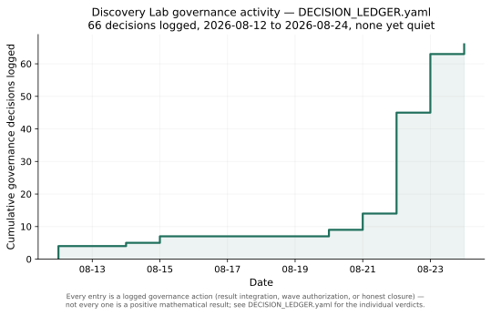
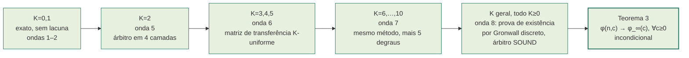
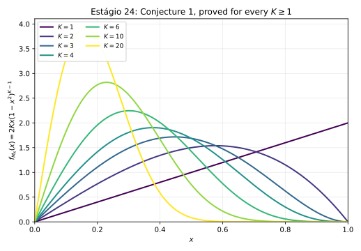
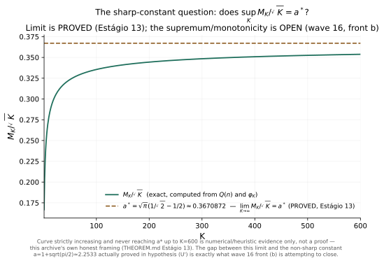
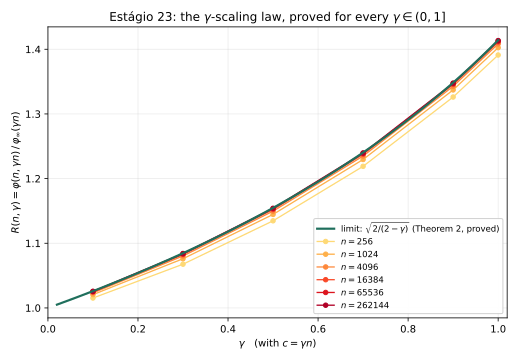
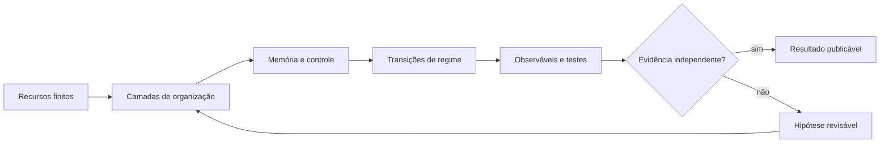
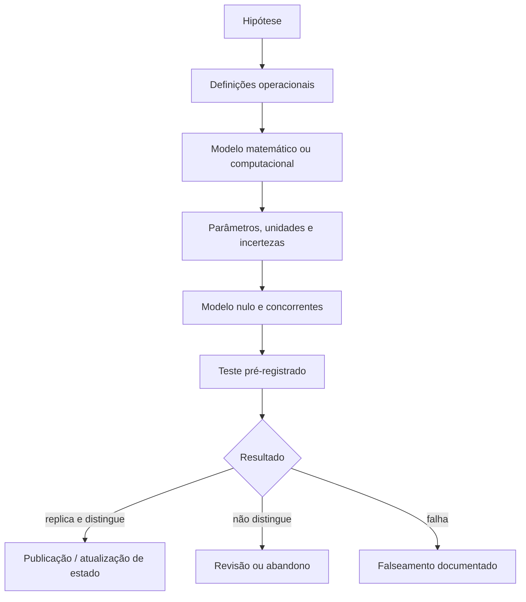

# Tamesis Discovery Lab — Arquivo de Pesquisa Adversarial

[](RELATORIO_PROGRESSO_AUDITORIA_ARTIGOS.md)
[](RELATORIO_PROGRESSO_AUDITORIA_ARTIGOS.md)
[](05_DISCOVERY_LAB/01_PORTFOLIO/TEST_QUEUE.yaml)
[](05_DISCOVERY_LAB/00_GOVERNANCE/CLAIM_LEDGER.yaml)
[](05_DISCOVERY_LAB/00_GOVERNANCE/DECISION_LEDGER.yaml)
[%20limit%20law-closed--form%20%C2%B7%20unconditional%20%C2%B7%20adversarially%20verified-8c5a1f?style=for-the-badge)](tamesis-cycle-survival/)
[](PROJECT_STATE.json)
[](LICENSE)
[](README.md#governance-authorship-and-responsibility)
[-6c757d?style=for-the-badge)](README.md)

**Idiomas:** [English](README.md) · **Português (BR)** · [日本語](README_JA.md) · [中文（简体）](README_ZH.md) · [Español](README_ES.md)

> **Um arquivo de pesquisa interdisciplinar sobre informação, geometria, transições de fase, sistemas complexos e cognição — com hipóteses mantidas explicitamente separadas das evidências.**

Este repositório preserva a trajetória completa do Laboratório Tamesis: seu ramo experimental atual e suas linhas de pesquisa históricas, matemáticas, físicas, computacionais e cognitivas. O arquivo contém **280 registros auditados**, organizados em **274 dossiês de auditoria**. Auditar aqui não transforma conjectura em fato — torna explícito o que é uma prova, uma consequência condicional, um ajuste numérico, uma ilustração computacional, uma conjectura ou um cenário especulativo.

Desde 2026, o arquivo também mantém um **laboratório de adjudicação contínua** (`05_DISCOVERY_LAB`): cada afirmação quantitativa feita pelo próprio arquivo é encerrada, uma de cada vez, em confronto com referências externas reais, sob critérios pré-registrados e **reprodução adversarial obrigatória**. O resultado até agora — dezenas de encerramentos negativos catalogados com veredito final, e um resultado matemático positivo re-derivado de forma independente e verificado adversarialmente — está sintetizado no **[artigo do Discovery Lab](index.html)** (a página inicial do repositório).

<p align="center"></p>

## Motor de Descoberta (Discovery Engine): os Estágios 1–3a do roadmap, construídos e testados

**[`06_DISCOVERY_ENGINE/`](06_DISCOVERY_ENGINE/README.md)** transforma os três primeiros estágios do `ROADMAP.md` em código Python real e testado: 12 módulos distribuídos no Estágio 1 (Registro de Hipóteses, Executor de Experimentos, Motor de Reprodução, Revisor Adversarial, Ledger de Decisões), no Estágio 2 (Matemática Simbólica, Laboratório de Monte Carlo, Observatório de Datasets, uma ponte de prova formal para Lean4, Atlas de Universalidade) e no Estágio 3a (Motor de Hipóteses, Motor de Descoberta Matemática) — os dois, entre os oito produtos nomeados no Estágio 3, que era possível construir honestamente como módulos de backend.

O que torna isso confiável, e não apenas uma alegação de marketing: 220/220 testes passam nos três estágios, cada um encerrado por uma revisão hostil dedicada, feita por um agente que não escreveu o código, e depois reverificada de forma independente uma terceira vez pela sessão orquestradora. O benchmark de aceitação exigido reproduz de ponta a ponta o próprio resultado `U₁/₂` já provado por este arquivo — `φ_∞(c)`, a distribuição de `M_K`, a correção de `n` finito e o regime de escala `γ=c/n` — a partir de uma implementação independente, sem importar de `05_DISCOVERY_LAB` e sem qualquer ajuda direta. A revisão hostil não foi um mero carimbo: encontrou uma lacuna real de adulteração da cauda na cadeia de hash do ledger do Estágio 1 (a entrada mais recente não tinha sucessor para protegê-la) e uma alegação falsa de "impossível de contornar" na própria documentação do Motor de Hipóteses do Estágio 3a — ambas corrigidas abertamente, com a mesma disciplina de `correção` datada que este arquivo aplica aos seus próprios erros matemáticos, não silenciosamente remendadas.

Três partes explicitamente **não** foram construídas, catalogadas como adiadas, não fingidas: o Laboratório de Simulação (um ambiente visual real de simulação baseada em agentes/redes é um empreendimento de interface gráfica que nenhuma suíte de testes valida da mesma forma que os módulos acima foram validados); a captação de dados externos ao vivo do Observatório (exige acesso de rede e credenciais de API que este build não deveria supor); e a arquitetura unificada "Tamesis OS" do Estágio 4 (bloqueada por uma decisão de pilha de infraestrutura — o próprio `ROADMAP.md` chama sua pilha candidata de "não avaliada... nada disso está comprometido" — não por esforço restante). Isto é trabalho de correção de software, não uma nova alegação matemática ou física: não entra no ledger de governança do `05_DISCOVERY_LAB` nem conta para nenhuma alegação de Problema do Milênio. Detalhamento completo: **[`06_DISCOVERY_ENGINE/README.md`](06_DISCOVERY_ENGINE/README.md)** e **[`GOAL.md`](GOAL.md)**.

## Leitura rápida

O relatório institucional [Visão Final do Laboratório Tamesis](RELATORIO_VISAO_FINAL_LABORATORIO_TAMESIS.md) apresenta as perguntas, respostas, impactos, aplicações e novas perguntas produzidas pelo programa de pesquisa como um todo. Uma [versão HTML/PDF pronta para impressão](RELATORIO_VISAO_FINAL_LABORATORIO_TAMESIS.html) também está disponível.

### Estado científico atual

| Camada | Estado | Interpretação correta |
|---|---|---|
| Arquivo e metodologia | **Completo / auditado** | Inventário, classificação de afirmações, fontes e critérios de falseabilidade estão todos registrados. |
| Modelos computacionais | **Congelados para auditoria** | Saídas reproduzíveis devem ser lidas como saídas de modelo, não como constantes medidas. |
| Tamesis `M_c v1` | **Hipótese testável** | O valor `M_c = 5.292674126388712e-16 kg` é um parâmetro de modelo, não uma medição. |
| Evidência física independente | **Ainda não estabelecida** | Nada neste arquivo constitui confirmação experimental da ontologia Tamesis. |
| Problemas do Prêmio Millennium e afirmações de Teoria de Tudo (TOE) | **Não resolvidos** | Esses textos são conjecturas, reduções ou argumentos de modelo restrito — não soluções aceitas. |
| Adjudicação numérica central | **Consolidação matemática completa — Conjecturas 1 e 2 agora provadas para todo `K` (2026-08-26)** | Ver abaixo — 3 afirmações encerradas negativamente com veredito final; a 4ª (`U₁/₂`) tem um núcleo provado, arbitrado adversarialmente muitas vezes de forma independente, com o Lema Aberto e a conjectura de taxa provados incondicionalmente para todo `K≥0` (2026-08-22), a constante nítida da taxa `a*` provada e montada em uma cota explícita para `n` finito (2026-08-25), a lei de escala `γ=c/n` provada para todo `γ∈(0,1]` (2026-08-26), e as Conjecturas 1 e 2 — a lei distribucional completa e sua mistura de Poisson — ambas agora provadas para **todo** `K≥1`, não apenas uma lista finita de instâncias (2026-08-26). |

### O programa de adjudicação (Discovery Lab, atualizado em 2026-08-28)

`05_DISCOVERY_LAB` executa adjudicação contínua das afirmações quantitativas deste arquivo em confronto com referências externas reais (PDG, CODATA, Planck, SPARC, Gaia, Odlyzko), com metodologia fixada *antes* de cada cálculo, proveniência completa para cada valor de referência, e **reprodução adversarial obrigatória** para qualquer achado positivo. Registro completo: `05_DISCOVERY_LAB/01_PORTFOLIO/TEST_QUEUE.yaml` e `05_DISCOVERY_LAB/00_GOVERNANCE/DECISION_LEDGER.yaml`. Síntese em formato de artigo: **[`index.html`](index.html)** (a página inicial do repositório).


```mermaid
flowchart LR
    R[280 registros<br/>auditados do arquivo] --> S[Levantamento Fase 0<br/>de todo o arquivo<br/>19 candidatos, 7 áreas]
    S -->|18/19 rejeitados,<br/>motivo concreto citado| N1[CLOSED_NULL]
    S -->|1 pista imatura<br/>promovida| L13[16 linhas formais<br/>de teste do<br/>Discovery Lab]
    L13 --> C8[8 afirmações pré-registradas<br/>travadas + revisadas adversarialmente]
    C8 --> V1["1 resultado positivo provado<br/>lei limite U(1/2)"]
    C8 --> V2[7 resultados negativos<br/>informativos — REFUTADO /<br/>INCONCLUSIVO / NULO]
    style V1 fill:#e8f0e0,stroke:#1f6f5c,stroke-width:2px
    style N1 fill:#f0e5e8,stroke:#7a3b4a
```

**O funil completo de sobrevivência (2026):**

| Linha | Testado | Resultado |
|---|---|---|
| Invariante interdomínio (TRI-RG) | 16 candidatos, 5 rodadas | `CLOSED_NULL` — 0 sobreviventes; 4 achados com `p<0.05` refutados por reprodução adversarial (explicações mundanas demonstradas) |
| Cosmologia SPARC/MOND + binárias largas Gaia | 4 testes pré-registrados | 4/4 inconclusivos por fatores de confusão reais demonstrados; 2 resultados de destaque legados descobertos como assentados em **dados fabricados** e refeitos com dados reais |
| Zeros da função zeta de Riemann (RH-REAL) | 12/12 itens do levantamento, todos finalmente resolvidos | 2 achados replicados (anti-agrupamento de intervalos consecutivos; escalonamento GUE `N^(-1/3)`); tanto os máximos FHK quanto a variância do número de zeros foram encerrados como `CLOSED_INCONCLUSIVE`, cada um com um componente forte confirmado adversarialmente (exclusão do lado iid ≥8.8σ; exclusão GUE ingênua de até 203σ — a reprodução adversarial ainda encontrou e corrigiu um 3º bug real no estimador primário) |
| Adjudicação de afirmações quantitativas centrais (onda 1) | 7 afirmações | `M_c` inconsistente (~190× entre valores); modelo de massa quark/nó falha no leave-one-out; `sin²θ_W=3/13` desviado em 7.5σ, com ajuste fixado no código (hardcoded); `α⁻¹=Ω^{1.03}` com 0 graus de liberdade; `n_s` do bounce não identificável; `Λ` holográfico ≡ `ρ_crit` por identidade algébrica |
| **Lei limite `U₁/₂` (ondas 2–17, consolidada)** | 1 teorema + 1 generalização + Lema Aberto (todo `K≥0`) + Conjecturas 1 e 2 (todo `K≥1`) + taxa nítida + lei de escala `γ` | **Provada, arbitrada adversarialmente (muitas rodadas independentes, técnicas distintas a cada vez), publicada como artigo + pacote reproduzível; Lema Aberto e conjectura de taxa PROVADOS incondicionalmente para todo `K` (onda 8, 2026-08-22); a densidade completa da Conjectura 1, `f_{M_K}(x)=2Kx(1-x²)^{K-1}`, e sua Conjectura 2 associada por mistura de Poisson estão agora ambas PROVADAS para todo `K≥1` de uma só vez (onda 17, 2026-08-26), após os fechamentos por `K` individual em `K=2,3,4` (ondas 14–16); a constante nítida da taxa `a*` PROVADA e montada em uma cota explícita para `n` finito (onda 17, 2026-08-25); a lei de escala `γ=c/n` PROVADA para todo `γ∈(0,1]` (onda 17, 2026-08-26)** (ver abaixo) |
| Levantamento de candidatos em todo o arquivo (Fase 0, além do TRI-RG) | 19 candidatos, 7 áreas | `CLOSED_NULL` — 18/19 rejeitados com motivo concreto citado; 1 pista imatura (assinaturas espectrais de EEG cognitivo) promovida a uma nova linha, ver abaixo |
| Cognição — assinatura espectral de EEG na depressão (Mumtaz, `DISC-COGNITIVE-EEG-SPECTRAL-001`) | 1 pré-registro travado, N=30 MDD/26 HC | `CLOSED_REFUTED` — entropia espectral **maior**, não menor, em pacientes com MDD (`d=1.447`, `p=3.97×10⁻⁶`) — direção oposta à hipótese testada, confirmada por uma reprodução adversarial independente feita do zero (números coincidem a <10⁻⁹) |
| Cosmologia SPARC-004 — autocalibração de `f_multi` (Estágio 1→2) | Pipeline validado + aplicado a dados reais de descoberta (30,203 sistemas) | `CLOSED_INCONCLUSIVE` — veredito mecânico `BOTH_FALSIFIED`, mas a etapa obrigatória de refutação (debunker) encontrou um fator de confusão real: um subgrupo de 19% da amostra (RUWE alto) é sistematicamente subcorrigido pelo modelo de `f_multi` de escalar único, com um excesso estatisticamente robusto mesmo no próprio bin de ancoragem da calibração |
| Pico espectral da ressonância de Schumann (`DISC-SCHUMANN-RESONANCE-001`) | Dado real de magnetômetro ELF, estação Sierra Nevada (Zenodo), 3 dias × 2 canais, 6/6 casos | `NÃO DISTINGUE` — existe um morro espectral largo genuíno na localização esperada (7,8–8,0 Hz) em todos os casos, mas a proeminência (1,22×–1,44×) fica abaixo do limiar pré-registrado de 3×; reprodução adversarial bit-a-bit, nenhuma alegação de conexão neural feita ou possível |
| Reprodutibilidade de IIT/Φ — rede canônica ABC (`DISC-IIT-PHI-REPRO-001`) | Reprodução via PyPhi da rede da Figura 4 de Oizumi, Albantakis & Tononi (2014) | `CONFIRMED` — Φ=1,916666 vs. valor publicado 1,916665, idêntico bit a bit em 16 dígitos significativos entre duas instalações totalmente independentes; checagem de reprodutibilidade de uma métrica definida, não teste de nenhuma alegação sobre consciência |
| Princípio da Energia Livre — busca de alvo falseável (`DISC-FEP-PREDICTIVE-CODING-001`) | Levantamento de literatura em Fase 0, 4 candidatos examinados a nível de fonte primária | `CLOSED_OUT_OF_DOMAIN` — nenhum alvo satisfazendo os três requisitos (previsão fechada, modelo concorrente externo nomeado, dataset público) foi encontrado; um dos artigos revisados admite no próprio texto que o princípio "pode descrever qualquer dado biológico observado" |
| Lógica não-clássica em Lean4 — Priest's LP (paraconsistente) | 6 arquivos, 876 linhas, 12 metateoremas, `lake build` limpo | Explosão, modus ponens e silogismo disjuntivo provados **inválidos** sob LP (o resultado central da paraconsistência); teorema de colapso clássico provado como um `iff` genuíno de duas vias; revisado adversarialmente, uma correção apenas de documentação aplicada |

Essas quatro linhas abrem um programa complementar que aplica a mesma disciplina a afirmações da filosofia da mente, ciência cognitiva, geofísica e lógica formal — ver **[`PROGRAMA_CONSCIENCIA_LOGICA_E_REALIDADE.md`](PROGRAMA_CONSCIENCIA_LOGICA_E_REALIDADE.md)** para o mapeamento completo item a item, incluindo o que foi deliberadamente excluído por não ser falseável (panpsiquismo como fato, "Deus como equilíbrio termodinâmico", o Argumento da Simulação como proposição testável, e outros) e o porquê.

### O resultado positivo de destaque: uma lei de universalidade exata em forma fechada

A classe de universalidade `U₁/₂` (permutação aleatória perturbada a uma taxa `c/n` em direção a um mapa aleatório) tem a lei limite exata:

<p align="center"></p>

> `φ_∞(c) = ∫₀¹ e^(−ct²) dt = ½·√(π/c)·erf(√c)` — zero parâmetros livres,

derivada analiticamente (não ajustada), corrigindo a conjectura original do arquivo `(1+c)^(-1/2)` (excluída já no primeiro coeficiente da série: `a₁ = 1/3 ≠ 1/2`, confirmado por enumeração exata). Este resultado agora é um **teorema provado**, não uma conjectura: um documento matemático autocontido (`THEOREM.md`) prova a forma fechada em seis passos, incluindo o tratamento correto do *size-biasing* (viés de tamanho) dos arcos visitados, e foi revisado por um agente independente atuando como árbitro hostil — **zero erros encontrados**.

A ponte entre o modelo finito e o objeto limite agora está provada **incondicionalmente para todo `K≥0`** — `φ(n,c) → φ_∞(c)` quando `n → ∞`, para todo `c ≥ 0` fixo, sem nenhuma hipótese não provada remanescente (`THEOREM.md`, "Teorema 3"):


```mermaid
flowchart LR
    K01["K=0,1<br/>exato, sem lacuna<br/>ondas 1–2"] --> K2["K=2<br/>onda 5<br/>árbitro em 4 camadas"]
    K2 --> K345["K=3,4,5<br/>onda 6<br/>matriz de transferência K-uniforme"]
    K345 --> K610["K=6,…,10<br/>onda 7<br/>mesmo método, mais 5 degraus"]
    K610 --> Kgen["K geral, todo K≥0<br/>onda 8: prova de existência<br/>por Gronwall discreto, árbitro SOUND"]
    Kgen --> Teo3["Teorema 3<br/>φ(n,c) → φ_∞(c), ∀c≥0<br/>incondicional"]
    style K01 fill:#e8f0e0,stroke:#1f6f5c
    style K2 fill:#e8f0e0,stroke:#1f6f5c
    style K345 fill:#e8f0e0,stroke:#1f6f5c
    style K610 fill:#e8f0e0,stroke:#1f6f5c
    style Kgen fill:#e8f0e0,stroke:#1f6f5c
    style Teo3 fill:#e8f0e0,stroke:#1f6f5c,stroke-width:2px
```

Cada degrau acima foi re-derivado de forma independente por um agente árbitro hostil separado, usando uma técnica de prova *diferente* da derivação original, sua própria enumeração por força bruta, e verificações completas de substituição recursiva — **zero erros encontrados em qualquer camada**, ao longo de 4 rodadas independentes de arbitragem. `K=6,…,10` foi adicionalmente confirmado bit a bit contra uma nova enumeração exaustiva em dois pontos retidos (held-out). O degrau final fechou a última lacuna nomeada remanescente: um árbitro hostil re-derivou de forma independente, do zero, uma indução exata por desigualdade de Gronwall discreta provando que a expansão de dois termos para `n` finito existe para *todo* `K`, não apenas os 11 valores concretamente verificados — veredito **SOUND, com problemas nomeados** (quatro encontrados, nenhum fatal, corrigidos via adendos datados). O **Lema Aberto** — agora provado incondicionalmente para todo `K` — é exatamente o caso de parâmetro fixo de Hansen & Jaworski (EJC, 2014); uma mistura de Poisson com forma fechada em `erf` não foi encontrada em uma busca sistemática na literatura (35+ consultas registradas), com a ressalva explícita de que isso não equivale a "inédito". Uma segunda frente derivou **por que o expoente é exatamente 1/2**: em toda uma família paramétrica de mecanismos de perturbação, `α ∈ [1/2, 1]` sempre — `α < 1/2` é *provadamente impossível* (um efeito de agrupamento quadrático que persiste mesmo sem qualquer "morte" de ciclicidade). A onda 5 também localizou e confirmou um mecanismo natural (`M-WEIB(β)`, risco de Weibull não homogêneo) que atinge todo `α ∈ (1/2, 1)` intermediário. Nenhuma implicação física é afirmada — trata-se de matemática combinatória pura sobre um ensemble específico.

**A forma fechada em todas as ordens (2026-08-23).** Cada degrau acima — `K=0,…,10`, a ponte para `K` geral, as constantes de erro em `n` finito — agora é um corolário de uma única fórmula exata. Ao estender a mesma técnica de expansão assintótica a um índice de ordem *simbólico*, revelou-se que os coeficientes de cada ordem são exatamente os números de Stirling de primeira espécie sem sinal e, como esses são precisamente os coeficientes de um fatorial ascendente, toda a expansão infinita se re-soma — não assintoticamente, mas de forma exata e finita (ela termina após `K+1` termos). O resultado é uma única expressão finita e totalmente explícita para a recursão subjacente, válida para todo `n`, `K` e parâmetro de deslocamento, com uma prova elementar independente que dispensa por completo o maquinário da expansão. Uma rodada dedicada de arbitragem hostil re-derivou as duas provas do zero, contra seu próprio simulador construído do zero (215,070 verificações exatas, zero divergências), confirmou a afirmação principal e encontrou um erro real em uma afirmação negativa secundária (corrigido via um adendo datado), além de duas rotulagens conservadoras que o documento original havia deixado deliberadamente sem prova — ambas provadas diretamente pelo árbitro. Ver `THEOREM.md`, "Estágio 9".

**Convergência uniforme em toda a faixa de parâmetros (2026-08-23).** O teorema acima afirma apenas que `φ(n,c) → φ_∞(c)` para cada `c` fixo, um de cada vez. Uma frente separada fechou essa lacuna de forma mais completa do que o pedido: a convergência é uniforme não apenas em faixas compactas `[0,C]`, mas em toda a semirreta `[0,∞)`, ambas provadas incondicionalmente a partir de dois lemas elementares curtos — um acoplamento Lipschitz e uma cota de cauda uniforme em `n` — que dispensam todo o maquinário acima. O perfil exato do erro de primeira ordem foi derivado em forma fechada como um bônus. Uma rodada de arbitragem hostil atacou com mais força os dois novos lemas e os dois teoremas incondicionais, e não encontrou erro em nenhum deles; sua única descoberta substantiva corrigiu qual lacuna específica permanecia aberta em um resultado secundário já condicional, tornando o próprio relato do arquivo sobre essa lacuna mais preciso, não menos. Ver `THEOREM.md`, "Estágio 10".

**Conjectura 1 — a lei distribucional completa, agora provada para TODO `K≥1` (2026-08-26).** Além da média `φ_∞(c)` acima, o arquivo conjectura a *densidade completa* da massa cíclica condicional a exatamente `K` reroteamentos: `f_{M_K}(x) = 2Kx(1-x²)^(K-1)`. `K=2` fechou na onda 14; `K=3` fechou inesperadamente na onda 15; `K=4` fechou na onda 16 — cada uma uma surpresa consecutiva contra um diagnóstico de explosão combinatória, com a identidade de floresta ponderada `E(E+Q)^{n−1}=E` por trás do cancelamento fora-do-ciclo nomeada como a rota candidata para um argumento geral. A frente (a) da onda 17 percorreu essa rota até o fim: todo ingrediente por `K` individual da linha `K=1..4` — o lema de espaçamentos rotulados, o descascamento (peeling) por telescopagem, a fórmula do mecanismo de destino, e a própria identidade de floresta ponderada — foi generalizado para `K` simbólico, fechando **a Conjectura 1 para todo `K≥1` de uma só vez**, condicional à mesma citação clássica única (a propriedade de size-biasing/residual de `PD(1)`) da qual toda a linha já depende, aplicada recursivamente até `K−1` vezes por `K` fixo. Como corolário, a **Conjectura 2** (a lei incondicional completa, `M(c) =_d min(1,√(E/c))`) também **agora está provada**, no mesmo patamar, via a álgebra de mistura de Poisson já citada — fechando `E[M(c)²]=(1−e^{−c})/c` e `E[M_K²]=1/(K+1)` incondicionalmente para todo `K`. Um referee hostil REFORÇADO, instruído especificamente a atacar o salto de `K` individual para `K` geral (independência residual no descascamento por telescopagem), reconstruiu todo o argumento do zero — incluindo uma verificação do zero um passo além do escopo próprio da frente, em `K=6` — e não encontrou nenhum erro matemático. Ver `THEOREM.md`, "Estágio 24":

<p align="center"></p>

**A constante nítida — supremo agora PROVADO: `sup_K M_K/√K = a*` (2026-08-25).** `THEOREM.md` prova `lim_{K→∞} M_K/√K = a* ≈ 0,367` exatamente (Estágio 13) e, na terceira tentativa após duas rotas fracassadas, a frente (b) da onda 16 fechou também o supremo: `M_K < a*√K` *estritamente* para todo `K≥1`, de modo que o supremo é igual ao limite (Estágio 19 — via Robbins 1955, a cota bilateral de Flajolet–Grabner–Kirschenhofer–Prodinger para a função `Q` de Ramanujan e uma identidade exata clássica; o caso de fronteira foi fechado pelo próprio referee hostil e re-verificado de forma independente). A Hipótese (U') agora carrega a constante nítida `a*` no lugar da não-nítida `a=1+√(π/2)≈2,253`. A frente (b) da onda 17 então executou a única peça mecânica que restava aberta: a re-execução da montagem do Estágio 12 com `a*` fornece o **Teorema R**, a taxa nítida e explícita para `n` finito: `|φ(n,c)−φ_∞(c)| ≤ [a*√c+κ_B]/n` para `n≥4`, `0≤c≤n`, estrita, com a constante aditiva `κ_B≈0,2805` inalterada e agora certificada em aritmética racional pura, assintoticamente justa ao longo de `c=n` (Estágio 22):

<p align="center"></p>

**A lei de escala γ — provada para todo `γ∈(0,1]` (2026-08-26).** Um item em aberto separado desde a onda 4 (Estágios 10–13): será que `φ(n,γn)/φ_∞(γn) → √(2/(2−γ))` para uma razão fixa `γ=c/n`, e não apenas `c` fixo? A frente (e) da onda 17 provou isso por completo, via uma fórmula de soma dupla exata para `n` finito, inteiramente nova, para `φ(n,qn)`, derivada diretamente da definição do modelo — deliberadamente sem reutilizar o maquinário dos Estágios 9/12/22, que foi diagnosticado e confirmado como estruturalmente fraco demais para este limite de razão em particular. Ambas as metas bônus também fecharam: uniformidade em compactos `[γ₀,1]`, e o limite `γ_n→0` com `γ_n n^{1/3}/ln n→∞`. Um referee hostil re-derivou a fórmula central à mão antes de escrever qualquer código e — em um bom exemplo de verificação cruzada — tanto o referee quanto a sessão orquestradora encontraram e corrigiram, de forma independente, a *mesma classe* de bug catastrófico de underflow de ponto flutuante em seus próprios scripts de verificação antes de confirmar o resultado. Ver `THEOREM.md`, "Estágio 23":

<p align="center"></p>

**Um novo teorema sobre a lei conjunta de dois pontos — provado (2026-08-26).** Uma frente separada atacou a obstrução localizada pelo Estágio 18: a lei conjunta de explorar *dois* pontos de referência ao mesmo tempo. Seus dois alvos numéricos já estavam fechados pelo resultado geral-`K` acima, por uma rota não relacionada — sem tensão, já que a própria frente havia mostrado que não existe atalho de um split same/different-cycle para esses alvos. O que ela de fato provou é novo: o **Teorema da Restrição Cíclica Uniforme** — condicional a quais pontos terminam em algum ciclo, a permutação induzida sobre esse conjunto cíclico realizado é exatamente uniforme sobre todas as suas ordenações possíveis, para todo `n` e `K` finitos — com um corolário exato de que dois pontos, dado que ambos sobrevivem como cíclicos, terminam no mesmo ciclo final exatamente metade das vezes. Um referee hostil re-derivou de forma independente o teorema e seu lema mais arriscado à mão, depois rodou uma checagem exaustiva em mais casos do que a própria frente havia coberto, sem encontrar erro. Ver `THEOREM.md`, "Estágio 25".

**Onda 18 — três não-fechamentos honestos, cada um com progresso incondicional genuíno (2026-08-26).** Três frentes adicionais atacaram itens deixados abertos acima e não fecharam seus mandatos centrais, mas cada uma isolou com precisão onde a dificuldade remanescente vive. No termo de segunda ordem `C(γ)` da lei de escala `γ` para `γ∈(0,1)` (aberto desde o Estágio 23): o Lema E prova uma equivalência exata entre `C(γ)` e uma afirmação sobre uma soma exata `S_n`, e o Lema D0 dá a forma fechada da "metade determinística" dessa soma, `D_0(γ)=(γ-1)/(2(2-γ))`, válida para todo `γ∈(0,1]`, via soma de Poisson/transformação theta de Jacobi — técnica nova nesta linhagem; uma segunda derivação heurística independente da "metade difícil" remanescente casa exatamente, de forma simbólica, com a forma fechada já conjecturada na onda 17. `C(γ)` para `γ∈(0,1)` permanece aberto. Ver `THEOREM.md`, "Estágio 26". Na ponte distribucional `n→∞`, `M_n(c)→_d M(c)` (aberta desde o Estágio 6, distinta da média já fechada pelo Teorema 1): o caso `K=0,1` está agora fechado incondicionalmente, via uma identidade exata de mistura de CDFs em `n` finito (Proposição D0), uma versão em nível de CDF do argumento de mistura de Poisson do arquivo (Lema R), e uma forma fechada exata `P(M_n^{(1)}≤k/n)=k(k+1)/n²` (Proposição D1) cujos corolários incluem o primeiro resultado de segundo momento/flutuação desta linhagem — mais uma redução geral-`K` do segundo momento a um único escalar (Lema P2). `K≥2` permanece aberto. Ver `THEOREM.md`, "Estágio 27". Na versão contínua-nativa do Teorema J (tentada diretamente no Estágio 25 e ali deixada aberta): a construção direta permanece aberta, mas um bypass genuíno "por transferência" — explorando que o Corolário do Teorema J é uma identidade exata em todo `n` finito, não apenas assintótica — fecha um novo teorema contínuo, `P(mesmo ciclo final | K marcas) = 1/(2(K+1))`, para `K=0,1`. `K≥2` permanece aberto. Ver `THEOREM.md`, "Estágio 28". As três frentes passaram por revisão adversarial hostil dedicada (`SOUND`, "ACCEPT for catalogue"); o único erro encontrado (um expoente errado no termo de erro do Lema D0 — a taxa correta é `Θ(n^{-1/2})`, não o limite exponencialmente pequeno originalmente alegado; o valor de `D_0(γ)` não muda) foi corrigido via adendo datado antes da integração.

**Onda 18 (quarta frente), mais onda 19 — dois fechamentos, uma extensão, um diagnóstico afiado (2026-08-26).** A quarta frente da onda 18, integrada depois das três acima, estendeu `D*^{(p)}_r(b)` de `p=1,...,20` para `p=1,...,40` em escala completa, sem nenhum ingrediente matemático novo — 138.040 checagens exaustivas mais 400 aleatorizadas, zero divergências, com re-derivação do referee por rota deliberadamente diferente (Stirling de segunda espécie em vez de Bernoulli/Faulhaber). Ver `THEOREM.md`, "Estágio 29". A onda 19 então fechou dois itens e estendeu um terceiro. Na Lacuna 2 do termo `C(γ)`: `τ(m)` é um polinômio cúbico exato, dando `Δτ(k)` em forma fechada exata — não um resto de Taylor — válida em toda a faixa `1≤k≤n`, e a soma ponderada que de fato importa para `E(γ)` é provada `O(n^{-1/2})→0` via um novo Lema G2 — mais forte que o pedido; `C(γ)` para `γ∈(0,1)` permanece aberto, com a Lacuna 1 agora, por eliminação, o único obstáculo dominante nomeado. Ver `THEOREM.md`, "Estágio 30". Na exploração conjunta de dois pontos, nomeada bloqueador em quatro integrações distintas (Estágios 18, 25, 27, 28): `K=2` está agora **PROVADO** — forma fechada exata `P_nn(n,2)=(10n²+7n+2)/(30n²)`, via dois novos lemas que generalizam o método de caso-split de um ponto marcado para dois — fechando o alvo de segundo momento `P_nn(n,K)→1/(K+1)` do Estágio 27 em `K=2` e, via o Corolário do Teorema J já provado, estendendo o teorema contínuo por transferência a `K=2` (`→1/6`) quase de graça. `K≥3` permanece aberto, agora com diagnóstico estrutural preciso (um grafo funcional de redirecionamento nos arcos marcados). Ver `THEOREM.md`, "Estágio 31". E `D*^{(p)}_r(b)` foi estendido de novo, a `p=1,...,80` em escala completa, 261.274 checagens exatas, zero divergências — `p>80` aberto apenas por não-executado. Ver `THEOREM.md`, "Estágio 32". Separadamente, no resíduo do platô M-CLUST(b) (`PROOF_DEPENDENCY_MAP.md`, nó `PLATRESUM` — mecanismo distinto da linha principal deste teorema): uma quarta frente recaracterizou o gap abstrato-vs-real, antigo "~30%", em **~38,8% em média** (faixa 35,8%–43,2%), aproximadamente constante ao longo da faixa de parâmetros — diagnóstico afiado, não fechamento — e fortaleceu numericamente os coeficientes `d4≈26,1246` e `d5≈-82,017` da lei assintótica de quatro termos. Todas as quatro frentes passaram por referee hostil dedicado (`SOUND` / `SOUND WITH NAMED ISSUES`, "ACCEPT for catalogue" em todas), com achados nomeados corrigidos por adendos datados, nenhum afetando número reportado.

**Onda 20 — um fechamento completo, uma segunda prova inesperada, um fechamento parcial adicional, um gap heurístico decomposto (2026-08-26).** Quatro frentes atacaram o que a onda 19 deixou aberto. Na Lacuna 1 de `C(γ)` (objeto genuinamente transcendental, sem forma fechada exata disponível): um novo fato algébrico exato (`δ(D)+τ(M)/2` é polinômio cúbico exato em `D:=M-γk`), um novo Lema Bulk/Tail rigoroso reduzindo a Lacuna 1 a limitar duas quantidades escalares determinísticas via monotonicidade + a desigualdade de Hoeffding, e uma assintótica de ordem dominante mostrando que o limitante resultante de fato se anula — ainda não uma desigualdade totalmente explícita e uniforme em `γ`. `C(γ)` para `γ∈(0,1)` permanece aberto, mas com estratégia agora concreta e numericamente validada. Ver `THEOREM.md`, "Estágio 33". Na exploração conjunta: `K=3`, diagnosticado pela frente anterior como estruturalmente muito mais duro, está agora **PROVADO** para os alvos escalares de segundo momento/mesmo ciclo — forma fechada exata `P_nn(n,3)=(35n³+38n²+23n+6)/(140n³)`, via dois mecanismos novos (reindexação por fonte-governante; unicidade do predecessor-de-ciclo) que respondem diretamente ao diagnóstico anterior. O padrão de transferência contínua `1/(2(K+1))` está agora confirmado em `K=0,1,2,3`; a CDF completa e a lei conjunta geral-`K` permanecem abertas. Ver `THEOREM.md`, "Estágio 35". No gap heurístico `H1` do platô M-CLUST(b): um novo Lema de Concentração de Watson reduz `H1` a duas condições menores e verificáveis, mais uma nova EDO exata para o perfil do platô e uma grade numérica extensa mostrando convergência monotônica da razão de aproximação a 1 — o oposto de uma falha genuína de uniformidade. `H1` permanece aberto, decomposto; `H2` intocado. Por fim, uma quarta frente fechou por completo a **janela intermediária** `n^ε≤c_n≤n^{2/3}/log(n)` — nomeada como resíduo aberto desde a onda 17 — por combinação curta e elementar de dois resultados já provados (Teorema R, Corolário 4.2), sem maquinaria nova, mais um bônus fortalecendo a metade `γ_n→0` do Corolário 2 (sua hipótese de taxa mínima de crescimento deixa de ser necessária). Ver `THEOREM.md`, "Estágio 34". As quatro frentes passaram por referee hostil dedicado (`SOUND` / `SOUND WITH NAMED ISSUES`, "ACCEPT for catalogue" em todas); achados nomeados foram corrigidos por adendos datados. Nenhuma alegação de progresso em qualquer Problema do Millennium; matemática combinatória pura interna a este arquivo.

**Onda 21 — uma correção a uma constante viva, e uma primeira desigualdade explícita para a Lacuna 1 (2026-08-26).** Continuando a Lacuna 1 do termo de segunda ordem da lei de escala em `γ` (o único obstáculo nomeado remanescente para `C(γ)` após a onda 19 fechar a Lacuna 2), a frente relê a própria prova-fonte do Estágio 33 e encontra uma correção real: a constante de truncagem `κ_0(γ)=8/(γ(2-γ))` é uma FUNÇÃO de `γ`, não a constante ilustrativa `2,25` usada pelo Estágio 33 — logo `λ(γ)=4(3-2γ)/(γ(2-γ))` é contínua mas NÃO LIMITADA em `(0,1)` (diverge conforme `γ→0⁺`), refutando a alegação do Estágio 33/seu predecessor de que `λ` era "limitada em `(0,1)`". A substituição corretamente escopada é provada rigorosamente: um único `C(γ_0)` funciona uniformemente em todo compacto `[γ_0,1)⊂(0,1)`, mas nenhum `C` único funciona no intervalo aberto inteiro simultaneamente. Separadamente, a frente de fato constrói a desigualdade explícita `∀n≥n_0(γ)` que o Estágio 33 havia deixado em aberto — fechando a lacuna lógica, mas não a prática: com constantes elementares deliberadamente cruas, o `n_0(γ)` resultante sai astronomicamente grande (`~10²¹` em `γ=0,99` até `~10⁸⁵` em `γ=0,01`). Nenhum resultado numérico anterior é enfraquecido — a correção afeta apenas uma alegação qualitativa sobre a forma da desigualdade, não nenhum número catalogado. `C(γ)` para `γ∈(0,1)` permanece inteiramente aberto. Um referee hostil dedicado re-derivou a álgebra corrigida de forma independente a partir da fonte citada e confirmou a correção além de dúvida razoável (um achado cosmético de baixa severidade, corrigido por adendo datado). Ver `THEOREM.md`, "Estágio 36".

**A frente remanescente da onda 21, mais a onda 22 — uma cauda mais afiada, e formas fechadas gerais-`K` até `K=8` (2026-08-27–2026-08-28).** No lado prático da Lacuna 1: uma desigualdade de cauda genuinamente mais afiada e sensível à variância (Bernstein, não Hoeffding) reduz `n_0(γ)` em até `~9` ordens de magnitude em `γ=0,01` (`0,44`–`3,19` décadas em `γ` moderado, perda negligível em `γ=0,5`, onde o pior caso já assumido por Hoeffding se aplica exatamente) — uma melhoria parcial genuína, não um fechamento: `n_0(γ)` permanece astronomicamente grande (`10^18`–`10^76`), e `C(γ)` em si permanece inteiramente aberto. Um bônus genuíno surge da mesma construção: como `σ²(γ)λ̂(γ)→28` permanece finito conforme `γ→0`, um único `C` `γ`-independente agora basta em todo o intervalo aberto `(0,1)`, não apenas em compactos como sob Hoeffding. Ver `THEOREM.md`, "Estágio 37". Na lei conjunta de dois pontos: o próprio método geral-`K` de caso-split (reindexação por fonte-governante + unicidade do predecessor-de-ciclo) é agora provado genuinamente `K`-livre em sua lógica — literalmente a mesma prova de `K=3` com `3` substituído por `K` — fechando novas formas fechadas exatas em `K=4,5,6` (Proposições NN4/NN5/NN6, ex. `P_nn(n,4)=(126n⁴+187n³+177n²+98n+24)/(630n⁴)`), cross-checadas contra brute force verdadeiro até 165M/84,7M configurações exaustivas. Uma única fórmula fechada-em-`K` permanece aberta, diagnosticada com precisão como crescimento do número de termos na soma simbólica, não uma barreira do método em si; `K≥7` não foi tentado aqui, por razão de orçamento declarada. Ver `THEOREM.md`, "Estágio 38". Uma frente seguinte então colapsou o integral duplo de `P_disjoint(s,s')` — sinalizado pelo Estágio 38 como sua questão aberta mais concreta — para um único integral, com uma identidade-bônus `P_same≡P_disjoint`, e empurrou a mesma ideia pela soma de composição externa via uma identidade de função-geratriz ordinária, produzindo um algoritmo geral-`K` muito mais rápido (`K=1,...,6` em `~1s` contra `~166s`) que produz dois resultados genuinamente novos, `P_nn(n,7)` e `P_nn(n,8)`, cada um confirmado independentemente por duas rotas distintas. A obstrução para uma fórmula fechada única simbólica-em-`K` é agora relocalizada com precisão — para uma soma finita sobre `r` de tamanho `K` — e, ao contrário da do Estágio 38, é CERTIFICADA, não apenas observada, a não admitir forma fechada elementar ali: o algoritmo de Gosper (um procedimento de decisão genuíno, não uma heurística) retorna `None` nos três tipos de momento, tanto para `K` simbólico quanto em 13 valores concretos `K=3,...,15`. Ambas as frentes passaram por referee hostil dedicado (`SOUND` / `SOUND WITH NAMED ISSUES` — `ACCEPT for catalogue`); achados nomeados (precisão de citação; rótulos cosméticos) foram corrigidos por adendos datados. `K≥9` não foi tentado, e nenhuma alegação é feita sobre a existência ou não de uma fórmula fechada em `K` além da classe Gosper-somável verificada aqui. Ver `THEOREM.md`, "Estágio 39". Nenhuma alegação de progresso em Problema do Millennium; matemática combinatória pura interna a este arquivo.

**Onda 21, frente (b) redespachada — a CDF completa de `M_n^{(3)}`, fechada (2026-08-28).** Um item separado, aberto desde o Estágio 27 — a CDF fechada completa `P(M_n^{(3)}≤k/n)`, no estilo da Proposição D1 de `K=1` — foi redespachado do zero como tentativa nova (`K3-FULL-CDF-ATTEMPT`, v2) depois que uma frente v1 anterior estagnou sem retorno verificável; o material v1 abandonado foi preservado, não deletado, para auditoria. A nova frente fechou seu mandato e o excedeu: um **Teorema de Decomposição Completa da Contagem de Ciclos** fortalece o Lema 4/5 do Estágio 35 de uma afirmação par-a-par para a **lei conjunta completa** da contagem de pontos cíclicos `T` (`M_n^{(3)}=T/n`) — `T=O+Σ_{s∈S}V_s`, com `S⊆{0,1,2}` o conjunto aleatório de fontes cíclicas e, dado `S`, os `V_s` mutuamente independentes e uniformes, governados por quatro fórmulas fechadas novas para a lei de `S` (**Proposição S**). Disto segue o resultado principal, **Proposição D3**: uma única função racional fechada, uniforme em `n`, para `P(M_n^{(3)}≤k/n)` em todo `n≥3` e todo inteiro `k` — igualando exatamente a ambição da Proposição D1, uma classe de universalidade mais adiante. Cinco corolários seguem: `P(M_n^{(3)}=1)=6/n³` por prova direta; recuperação simbólica exata, com **zero resto simbólico**, da já-provada média finita-`n` `φ_n^{(3)}` (Estágio 4); limites de segundo/terceiro momento coincidindo com os já-provados valores contínuos `1/4` e `16/105` (Estágios 17/18); e um limitante de convergência uniforme `O(1/n)`. Um referee hostil — estendendo brute force verdadeiro além do alcance testado pela própria frente, até `n=9`, e re-derivando independentemente as quatro fórmulas da Proposição S sobre os `4³=64` casos brutos — não encontrou erro matemático; um achado informacional (a fórmula da média do Estágio 4, enunciada para `n≥4`, na verdade também vale exatamente em `n=3`) e uma questão de proveniência sobre a tentativa v1 abandonada, resolvida diretamente pela sessão orquestradora: os arquivos v1 sinalizados continham apenas fórmulas de ponto único (`P(T=n-2)`, `P(T=n-3)`), não uma CDF concorrente, e uma dessas duas fórmulas estava de fato errada — consistente com a v1 ter sido corretamente abandonada em meio ao trabalho, não silenciosamente completa. Veredito: **SOUND WITH NAMED ISSUES — ACCEPT for catalogue**. A CDF completa de `M_n^{(3)}` é agora a primeira CDF completa em forma fechada catalogada nesta linha além de `K=0,1` (Estágio 27); a CDF completa geral-`K` (`K≥4`) permanece aberta, não tentada por esta frente. Nenhuma alegação de progresso em Problema do Millennium; matemática combinatória pura interna a este arquivo. Ver `THEOREM.md`, "Estágio 40".

**Onda 23 — a lacuna da CDF em `K` pequeno fecha por completo, um genuíno teorema de decomposição geral-`K`, e uma correção honesta no resíduo M-CLUST(b) (2026-08-28).** Três frentes rodaram em paralelo. A frente (b) atacou exatamente a generalização que o Estágio 40 sinalizou mas não tentou: o **Teorema de Decomposição Completa da Contagem de Ciclos** (`T=O+Σ_{s∈S}V_s`, mutuamente independentes dado `S`, cada `V_s` uniforme) e uma nova **Proposição S, `K` geral** — uma única fórmula fechada, livre de `K` e de `|A|`, `P(S=A)=|A|!·∏_{a∈A}p_a·(p_D+Σ_{a∈A}p_a)` — estão agora PROVADOS para todo `K≥0`, com provas genuinamente livres de `K` (não apenas checadas em muitos valores de `K`), via um novo Lema-Chave estabelecido por indução forte em `|B|`. Como bônus, esta única fórmula reproduz exatamente as quatro fórmulas separadas do Estágio 40 para `K=3` como casos especiais `|A|=0,1,2,3` — revelando que sempre foram uma única fórmula disfarçada. O que isto não fecha: uma única fórmula fechada em `(n,K)` para a CDF (o análogo geral-`K` da Proposição D3) não foi tentada além de uma pequena prova de conceito de que a maquinaria algorítmica subjacente funciona para `K` geral. Ver `THEOREM.md`, "Estágio 41". A frente (a), rodando de forma independente, fechou a única lacuna de `K` pequeno que ainda restava nesta linha: a **Proposição D2**, uma única função racional fechada `P(M_n^{(2)}≤k/n)=k(k+1)(2n²-3n+k-k²)/[n³(n-1)]` para todo `n≥2` e todo inteiro `0≤k≤n-1`, pela mesma via do Estágio 40 mas estruturalmente mais simples — basta um único regime combinatório, não três, pois a fórmula genérica já vale exatamente na fronteira `k=n-1`, confirmado por verificação simbólica de resto zero. Corolários incluem `P(M_n^{(2)}=1)=2/n²` por prova direta, recuperação simbólica exata (resto zero) da já-provada média finita-`n` `φ_n^{(2)}` (Estágio 3), concordância com os já-provados momentos contínuos de segunda/terceira ordem `1/3` e `8/35`, e um limitante de convergência uniforme `|F_n^{(2)}(x)-F_2(x)|≤12/n`. Com isto, a CDF completa em forma fechada está agora fechada para **todo `K=0,1,2,3`**; apenas `K≥4` permanece aberto ao nível de fórmula fechada (a maquinaria de decomposição geral-`K` do Estágio 41 prova que o método funciona para todo `K`, um avanço estrutural aquém de uma fórmula fechada de CDF). Ver `THEOREM.md`, "Estágio 42". Ambas as frentes passaram por referee hostil dedicado — **SOUND, nenhum erro matemático encontrado** em nenhuma delas, apenas achados informacionais de baixa severidade. Uma terceira frente (c) atacou o gap heurístico `H1` do platô M-CLUST(b) (um mecanismo distinto desta linha — ver `PROOF_DEPENDENCY_MAP.md`) via uma reformulação Volterra da identidade de renovação exata, produzindo conteúdo novo genuíno — uma identidade algébrica livre de derivada, uma estrutura de Volterra corretamente diagnosticada em domínio valorado em espaço de Banach, e nova numérica convergente de Neumann/Picard — mas sua alegação diagnóstica central, de que a limitação do núcleo completo "depende inteiramente" de um operador de multiplicação não-limitado, estava **errada**: o referee hostil encontrou que a frente havia limitado apenas esse operador isoladamente, nunca o operador COMPOSTO que de fato aparece no núcleo, e — uma vez corrigido — o operador composto, e portanto o núcleo completo, é de fato globalmente limitado e não cresce, o oposto exato do que a frente alegou. `H1`/`(U1)`/`(U2)` permanecem abertos, não afetados pela correção; a álgebra, o diagnóstico de estrutura Volterra e a numérica da frente permanecem de pé. Veredito: **NEEDS REVISION** nessa alegação diagnóstica específica, corrigida via adendo datado, não uma rejeição da contribuição da frente como um todo. Ver o adendo datado de `PROOF_DEPENDENCY_MAP.md` sob `PLATRESUM` (`DISC-DEC-113`). Nenhuma alegação de progresso em qualquer Problema do Millennium; matemática combinatória pura interna a este arquivo.

**Onda 24 — a série de CDFs em `K` pequeno se completa em `K=4`, e um diagnóstico de não-existência certificado por Gosper para a construção natural geral-`K` (2026-08-28).** A frente (a) estendeu o mesmo método um nível além de `K=3`: **Proposição D4**, uma única fórmula racional fechada para `P(M_n^{(4)}≤k/n)` em todo `n≥4` e todo inteiro `0≤k≤n-1`, via quatro regimes combinatórios (um a mais que `K=3`) que colapsam, por identidade simbólica exata, numa única fórmula. Corolários incluem uma fórmula completa nova, em todas as ordens, da média finita-`n`, e a recuperação exata dos momentos contínuos já provados (`1/5`, `128/1155`). A série de CDFs fechadas em `K` pequeno está agora completa para **`K=0,1,2,3,4`**; apenas `K≥5` permanece aberto ao nível de fórmula fechada. Ver `THEOREM.md`, "Estágio 43". A frente (b), atacando diretamente a CDF fechada em `(n,K)` geral, obteve um certificado rigoroso de não-existência para essa construção natural, diagnosticando com precisão onde ela falha: reorganizando a decomposição do Estágio 41 por tamanho de subconjunto `r`, a Camada 1 fecha simbolicamente em `(n,K,r)`, mas a Camada 2 (a soma interna truncada) exige uma antidiferença hipergeométrica indefinida genuína — exatamente o que o algoritmo de Gosper decide — e `gosper_term`, rodado no somando da Camada 2 com `K` totalmente simbólico, termina e retorna `None`: um certificado formal de que nenhuma antidiferença hipergeométrica-em-termos existe ali para `K` simbólico, ainda que o mesmo somando seja Gosper-somável em todo `K` concreto testado (`K=3,...,7`). É um diagnóstico preciso de não-fechamento, não um fechamento — nenhuma fórmula fechada em `(n,K)` foi encontrada ou descartada por qualquer outra via, e a CDF fechada geral-`K` para `K≥5` permanece aberta. Ambas as frentes passaram por referee hostil dedicado — **SOUND WITH NAMED ISSUES — ACCEPT for catalogue**; achados nomeados (transcrição; enquadramento de ineditismo) corrigidos por adendos datados, nenhum afetando o conteúdo matemático. Nenhuma alegação de progresso em qualquer Problema do Millennium; matemática combinatória pura interna a este arquivo. Ver `THEOREM.md`, "Estágio 44".

**Onda 25 — fechamento afiado em `n` finito em `K=2,3,4`, um segundo certificado de não-existência mais rápido, eliminação rigorosa de uma classe candidata no gap M-CLUST(b), e uma nova assíntota líder em forma fechada mais uma reformulação auto-mediante de `H1` (2026-08-29).** Quatro frentes rodaram em paralelo. A frente (a) provou como limitantes rigorosos em `n` finito as constantes de taxa de convergência antes só numéricas: fechamento **completo** em `K=2` (`M_2≈0,7107/n`, ótimo exato, válido para todo `n≥4`, ~16,9× mais apertado que o cru `12/n`) e fechamento quase-afiado em `K=3` (`C_3=1,0088×M_3`, `n≥6`) e `K=4` (`C_4=1,0365×M_4`, `n≥6`); também encontrou e corrigiu um erro numérico real numa passagem já publicada — a constante de taxa de `K=2` do Estágio 42 estava citada incorretamente como `≈0,167/n` (o valor de fronteira finito-`n=4`, `|Δ_4(1)|=1/6`, não a verdadeira constante `n→∞`, `≈0,7107/n`, erro de mais de 4×), agora corrigida por blockquote datado diretamente no Estágio 42. Ver `THEOREM.md`, "Estágio 46". A frente (b) reatacou a CDF fechada geral-`K` por um ângulo estruturalmente mais simples — colapsando a soma dupla numa única soma via uma nova identidade exata (`InnerJ(V,O)` depende só de `V+O`) — e obteve um segundo certificado Gosper de não-existência, independente e ~25× mais rápido que o do Estágio 44, reforçando que a obstrução é ter dois parâmetros simbólicos simultâneos, não `K` em si. Ver `THEOREM.md`, "Estágio 45". A frente (d) eliminou rigorosamente toda uma classe candidata de funções (`(c/n)^p` para qualquer `p`) para a taxa do gap abstrato-vs-real M-CLUST(b), usando o fato estrutural de que `c,n` são constantes fixas nos dados relevantes, não um ajuste de `p` livre — ver o adendo datado de `PROOF_DEPENDENCY_MAP.md` (`DISC-DEC-119`). A frente (c), sexta onda consecutiva (20–25) no gap heurístico `H1`/`(U1)`/`(U2)` do platô M-CLUST(b), localizou com precisão a falha de invariância por translação do núcleo `K(y,t)` (via uma nova identidade exata de conjugação exponencial) e derivou uma nova assíntota líder em forma fechada, `K(y,t)f(x)=[f(x)-e^{-h/ε}f(x+h)]/(x+y)+O(1/(x+y)²)`, provada condicional à hipótese de limitação já vigente mais uma nova hipótese de regularidade, confirmada numericamente a `3,2×10⁻⁸`; a partir dela, derivou uma nova reformulação auto-mediante (Cesàro) de `(U1)`, com o ingrediente Tauberiano preciso faltante nomeado, mas não atacado. `H1`/`(U1)`/`(U2)` permanecem abertos. Ver o adendo datado de `PROOF_DEPENDENCY_MAP.md` sob `PLATRESUM` (`DISC-DEC-122`). Todas as quatro frentes passaram por referee hostil dedicado (SOUND ou SOUND WITH NAMED ISSUES — ACCEPT for catalogue; achados nomeados foram deslizes de precisão de prosa ou atribuição de severidade baixa/moderada, corrigidos por notas datadas, nenhum afetando a matemática). Nenhuma alegação de progresso em qualquer Problema do Millennium; matemática combinatória/assintótica pura interna a estes arquivos.

**Onda 26 — um teorema de acoplamento incondicional livre de `K`, fechamento exato das constantes de taxa afiadas em `K=3,4`, e um diagnóstico mais afiado do gap Tauberiano de M-CLUST(b) (2026-08-29).** Três frentes rodaram em paralelo. A frente (a) provou o **Teorema A**, um acoplamento incondicional, livre de `K`, entre `M_n^{(K)}` e um novo objeto contínuo `M_K'` (o limite literal `n→∞` da maquinaria de decomposição livre de `K` do Estágio 41), dando `sup_x|F_n^{(K)}(x)-F_{M_K'}(x)|` limitado por uma constante *polinomial* em `K` — evitando o blowup `2^K` que um argumento ingênuo encontraria, ao acoplar diretamente o vetor de destino primitivo em vez de somar sobre subconjuntos. A identidade companheira `M_K'=_dM_K` está provada exatamente em `K=1` e permanece honestamente aberta para `K≥2`, respaldada por evidência forte (35/35 momentos racionais exatos batendo, `K=1,...,7`); combinados, isto dá uma rota genuinamente nova, livre de `K`, para `sup_x|F_n^{(K)}(x)-F_K(x)|≤8K²/n`, condicional a essa identidade aberta. Ver `THEOREM.md`, "Estágio 47". A frente (b) fechou o gap que o Estágio 46 (onda 25) deixara aberto: fechamento **exato**, não apenas quase-afiado, em `n` finito em `K=3` (`n≥5`, alargado de `n≥6`) e `K=4` (`n≥6`), nas mesmas constantes ótimas `M_3`, `M_4` que o Estágio 46 só havia limitado dentro de `~1%`, via eliminação por resultante exata em vez do método termo-a-termo mais frouxo do Estágio 46; confirma que `g_3'` e `g_4'` se fatoram limpamente em quárticos irredutíveis (nenhuma obstrução de Galois a uma forma radical) — a obstrução real anterior era um problema de sinal na comparação do limitante de cauda, não solubilidade por radicais. Ver `THEOREM.md`, "Estágio 48". A frente (c), sétima onda consecutiva (20–26) no gap heurístico `H1`/`(U1)`/`(U2)` do platô M-CLUST(b), confirmou que uma rota para o teorema Tauberiano clássico é um beco sem saída, provou um limitante condicional de oscilação de passo relativo sobre `Φ` via a assíntota em forma fechada da onda 25, e encontrou que esse teorema precisa de uma *terceira* hipótese — convergência de Cesàro-`(C,1)` da média corrente — que nenhuma onda anterior havia nomeado, ilustrado com um contraexemplo elaborado (`g(t)=sin(log(1+t))`, limitado, oscilando corretamente, mas nunca convergindo); o referee hostil acrescentou seu próprio corolário mais afiado: dado que a identidade de auto-mediação já está provada, a convergência de Cesàro sozinha é necessária *e* suficiente para `(U1)`, tornando o próprio resultado de limitante de oscilação da frente logicamente desnecessário como degrau intermediário especificamente para esse fechamento. `H1`/`(U1)`/`(U2)` permanecem abertos. Ver o adendo datado de `PROOF_DEPENDENCY_MAP.md` sob `PLATRESUM` (`DISC-DEC-125`). Todas as três frentes passaram por referee hostil dedicado (SOUND WITH NAMED ISSUES — ACCEPT for catalogue; achados variaram de deslizes de precisão de prosa a duas lacunas de mecanismo/rigor de severidade moderada na "ruga" auto-divulgada do limitante inferior de `K=4` da frente (b), todas corrigidas por correções/notas datadas, nenhuma alterando qualquer resultado final). Nenhuma alegação de progresso em Problema do Milênio; matemática combinatória/assintótica pura interna a estes arquivos.

**Onda 27 — Reivindicação B fechada para todo `K≥1` (tornando o Teorema Principal do Estágio 47 incondicional), uma redução mais afiada de `n₀(γ)` via o suporte binomial assimétrico verdadeiro, e o primeiro ataque dedicado a `(U2)` (2026-08-29).** Três frentes rodaram em paralelo, deslocando uma frente para fora da linha `(U1)` que havia absorvido sete ondas consecutivas. A frente (b) fechou a metade aberta do Estágio 47: uma forma fechada geral `W(r,t)=(t+2r+1)(t+r)!`, derivada (não apenas ajustada) para todo `t≥1` — estendendo as fórmulas do Estágio 47 restritas a `t=1,2` — alimenta uma prova por integral Beta feita à mão (a rota literal de somatório de Gosper do mandato certificadamente não fecha para `t` ímpar ou simbólico) de que `S(K,t)=Γ(t/2+1)/Γ(K+t/2+1)` para todo `K≥1,t≥1`; a determinação de momento de Hausdorff em suporte compacto então prova `M_K'=_dM_K` para **todo** `K≥1`, não apenas `K=1`, tornando `sup_x|F_n^{(K)}(x)-F_K(x)|≤8K²/n` **incondicional**. Ver `THEOREM.md`, "Estágio 50". A frente (c) descobriu que o suporte exato `[0,k]` de `M~Bin(k,γ)` dá a `D:=M-γk` a verdadeira faixa assimétrica `[-γk,(1-γ)k]` — nunca usada por nenhuma frente ancestral, que todas usaram a mais frouxa faixa simétrica `[-k,k]` — resultando numa constante de oscilação exata refinada e provada `λ_tight(γ):=max(4,4(1-γ)²/(γ(2-γ)))` e, combinada com Bernstein-com-folga, num supremo exatamente `14×` menor que o do Estágio 37, uniformemente no parâmetro livre; `n₀(γ)` encolhe de `2,30`–`16,21` décadas em relação à melhor tabela anterior, embora permaneça astronomicamente grande (`10^15,4`–`10^61,2`) e `C(γ)` em si permaneça inteiramente aberto. Ver `THEOREM.md`, "Estágio 49". A frente (a), a primeira frente nesta linhagem a mirar `(U2)` especificamente em vez de `(U1)`, provou uma nova forma fechada para a própria expansão "externa" de `W_inf(x;ε)`, `χ_n(x)=(γ_n-γ_{n-1})R^{(n-1)}(x)`, generalizando as EDOs de `ψ_n` do registro de `x=0` para todo `x`, e diagnosticou a camada-limite "interna" em `x=εu` como estruturalmente degenerada — condicional à mesma obstrução de controle uniforme do resto que travou toda tentativa de `(U1)`. `(U2)` permanece aberto. Ver o adendo datado de `PROOF_DEPENDENCY_MAP.md` sob `PLATRESUM` (`DISC-DEC-130`). Todas as três frentes passaram por referee hostil dedicado; as frentes (b) e (c) voltaram `SOUND WITH NAMED ISSUES — ACCEPT` (apenas deslizes cosméticos/expositivos — um fator `t!` descartado e depois reinstaurado numa derivação exibida, uma cifra de "décadas economizadas" rotulada incorretamente — nenhum afetando qualquer resultado final), enquanto a frente (a) voltou `SOUND — ACCEPT` com **zero** achados nomeados, o primeiro veredito limpo nesta sublinhagem `H1` desde seu início. Nenhuma alegação de progresso em Problema do Milênio; matemática combinatória pura interna a estes arquivos.

**Onde encontrar tudo:** o teorema completo e os relatórios dos árbitros estão em `05_DISCOVERY_LAB/02_TESTS/CORE_NUMERICS/u12_universality/theorem/`; a generalização e sua verificação adversarial em `.../generalization_u_alpha/`; um **pacote reproduzível autônomo** — artigo em LaTeX compilado (PDF), provas autocontidas, simulações clean-room e 49 testes automatizados — está em **[`tamesis-cycle-survival/`](tamesis-cycle-survival/)**. E a tabela honesta de **tudo o que este laboratório tentou e não sobreviveu** — para que este único resultado positivo seja lido no contexto correto — está em **[`FAILED_HYPOTHESES.md`](FAILED_HYPOTHESES.md)**.

Um levantamento honesto de todo o arquivo Tamesis (não restrito ao TRI-RG, 19 candidatos em 7 áreas) foi encerrado `CLOSED_NULL` — 18/19 rejeitados com motivo concreto citado — e promoveu a única pista imatura encontrada (assinaturas espectrais de EEG cognitivo, depressão vs. ansiedade) a uma nova linha candidata. Seu estágio de operacionalização está completo (observável definido como entropia espectral de Shannon normalizada, um modelo concorrente nomeado, poder estatístico calculado, acesso a dados reais verificado para o braço de depressão) — o braço de ansiedade permanece bloqueado por um provedor de dados que exige login humano, honestamente relatado como tal; nenhum dado real foi calculado ali. Ver `05_DISCOVERY_LAB/02_TESTS/ARCHIVE_PHASE0_SURVEY/SURVEY.md` e `05_DISCOVERY_LAB/02_TESTS/COGNITIVE_EEG_SPECTRAL/OPERATIONALIZATION.md`.

## Visão do laboratório

O programa investiga se sistemas sob recursos finitos podem construir camadas adicionais de organização quando o custo dessa complexidade é compensado por uma redução no erro, na dissipação, na instabilidade ou no custo de busca futuro. Este é um **princípio de modelagem**, não um propósito atribuído à natureza.

O laboratório conecta quatro níveis:

1. **Matemática:** operadores, espectros, topologia, grafos, universalidade e regularidade.
2. **Física fundamental:** informação, geometria, holografia, gravidade, partículas e transições quântico-clássicas.
3. **Sistemas complexos:** termodinâmica, memória, irreversibilidade, redes, estabilidade e controle.
4. **Vida e cognição:** o organismo integrado, interfaces cérebro-computador, consciência e ecossistemas cognitivos.


```mermaid
flowchart LR
    A[Recursos finitos] --> B[Camadas de organização]
    B --> C[Memória e controle]
    C --> D[Transições de regime]
    D --> E[Observáveis e testes]
    E --> F{Evidência independente?}
    F -->|sim| G[Resultado publicável]
    F -->|não| H[Hipótese revisável]
    H --> B
```


<p align="center"><sub>Figura 1 — Ilustração de trabalho do princípio holográfico. Esta é uma hipótese de modelagem, não evidência de que o universo é holográfico ou simulado.</sub></p>

## Comece aqui

- **[Artigo científico do Discovery Lab (2026) — adjudicação adversarial e a lei limite `U₁/₂`](index.html)** (página inicial do repositório)
- **Pacote reproduzível [`tamesis-cycle-survival/`](tamesis-cycle-survival/)** — artigo em LaTeX compilado, provas, simulações e testes automatizados para o teorema `U₁/₂`
- **[`FAILED_HYPOTHESES.md`](FAILED_HYPOTHESES.md)** — a tabela honesta de toda hipótese testada e não sobrevivente neste laboratório
- [Relatório de visão final do laboratório](RELATORIO_VISAO_FINAL_LABORATORIO_TAMESIS.md)
- [Versão HTML para apresentação e PDF](RELATORIO_VISAO_FINAL_LABORATORIO_TAMESIS.html)
- [Relatório de auditoria de 280 artigos](RELATORIO_PROGRESSO_AUDITORIA_ARTIGOS.md)
- [Protocolo de auditoria rigorosa](PROTOCOLO_AUDITORIA_RIGOROSA_DE_ARTIGOS.md)
- [Manifesto de inventário legível por máquina](ARTICLE_MANIFEST.csv)
- [Status de congelamento e condições de retomada](PROJECT_FREEZE.md)
- [Estado do projeto em JSON](PROJECT_STATE.json)
- [Linha do tempo](00_HOME/TIMELINE.md)
- [Mapa do arquivo](00_HOME/WORKSPACE_MAP.md)
- [Página inicial navegável](00_HOME/README.md)
- [Atlas interativo de hipóteses](atlas.html)
- [Mapa de dependência de provas da linha `U₁/₂`](05_DISCOVERY_LAB/02_TESTS/CORE_NUMERICS/u12_universality/PROOF_DEPENDENCY_MAP.md)

## As linhas de pesquisa

| Linha | Questão central | Estado atual | Aplicações potenciais |
|---|---|---|---|
| **A. Fundamentos e a arquitetura da realidade** | Informação, geometria ou computação podem gerar o espaço-tempo e leis efetivas? | Arquitetura conceitual e modelos candidatos. | Gravidade quântica, geometria informacional, modelagem de redes. |
| **B. Axiomas e pontes operacionais** | Um conjunto pequeno de axiomas reproduz as equações observadas sem ajuste específico por setor? | Fechamento parcial e condicional. | Derivação de modelos, testes de consistência, redução de parâmetros. |
| **C. TDTR, TRI e irreversibilidade** | Como os regimes mudam, e por que algumas transições são irreversíveis? | Vocabulário, bibliotecas e modelos de transição. | Termodinâmica, dinâmica dissipativa, setas do tempo. |
| **D. Universalidade** | Sistemas diferentes compartilham invariantes e leis de escala? | **Lei limite exata da classe `U₁/₂`, derivada e verificada adversarialmente (2026-08)**; busca empírica de invariante interdomínio encerrada nula (16/16). | Detecção de transições, análise de falhas, controle adaptativo. |
| **E. Espectros e Riemann** | Existe um operador cujo espectro realiza os zeros da zeta? | Rota matemática legítima; nenhuma prova da Hipótese de Riemann. | Teoria espectral, caos quântico, análise numérica. |
| **F. Computação, grafos e primos** | Estruturas aritméticas podem ser codificadas em grafos e sistemas computacionais? | Algoritmos e correspondências exploratórias. | Aprendizado em grafos, análise de redes, algoritmos espectrais. |
| **G. Cosmologia observacional** | Qual observável distingue Tamesis de `ΛCDM`, MOND e modelos concorrentes? | Catálogo de testes; nenhuma substituição empírica demonstrada. | CMB, BAO, supernovas, lenteamento gravitacional, SPARC, ondas gravitacionais. |
| **H. Buracos negros e singularidades** | Como informação e geometria lidam com horizontes e singularidades? | Modelos termodinâmicos/holográficos especulativos. | Informação quântica, gravidade, termodinâmica de horizontes. |
| **I. Partículas e topologia** | A topologia pode explicar massas, famílias, mistura e acoplamentos? | Mecanismos candidatos e relações numéricas. | Fenomenologia de partículas e testes de precisão. |
| **J. Limite quântico-clássico** | Quando e por que a dinâmica quântica se torna clássica? | Hipóteses concorrentes e desenhos experimentais. | Interferometria, optomecânica, metrologia quântica. |
| **K. Ecossistemas cognitivos** | Como organismos constroem perfis de controle, memória e consciência? | Agenda conceitual e programa empírico. | Neurociência de redes, fisiologia, interfaces cérebro-computador. |
| **L. Topologia cognitiva e cibernética híbrida** | Estados cognitivos podem ser classificados por invariantes relacionais/espectrais? | Estrutura teórica e protótipos de controle. | Sistemas humano-máquina e robótica corporificada. |
| **M. Estabilidade e operadores** | Coercividade, dissipação e margens espectrais detectam regimes patológicos? | Métodos candidatos e teoremas restritos. | Controle de infraestrutura, detecção de anomalias, redes adaptativas. |
| **N. Problemas do Prêmio Millennium** | A capacidade finita pode implicar teoremas sobre `P vs NP`, RH ou EDPs? | Nenhuma solução aceita; argumentos restritos. | Novos lemas matemáticos, não afirmações de resolução. |
| **O. Cosmologias especulativas e engenharia métrica** | Bounces, universos-pais ou métricas modificadas produzem observáveis? | Cenários especulativos. | Somente após uma solução covariante, estável e causal. |
| **P. Infraestrutura científica** | Como manter a pesquisa interdisciplinar reproduzível e honesta? | Inventário e auditoria rastreáveis. | Governança, revisão, preprints, colaboração externa. |

### Potencial de conclusão por linha (estimativa operacional, não uma métrica do arquivo)

A tabela abaixo estima, linha por linha, **quanto da lacuna nomeada em cada questão central já foi caracterizado** — não a probabilidade de a hipótese estar correta, nem uma métrica calculada pelo laboratório. É uma leitura externa, calibrada em relação ao estado real documentado para cada linha (`RELATORIO_VISAO_FINAL_LABORATORIO_TAMESIS.md` §6 e `05_DISCOVERY_LAB/`), com uma correção importante ao inventário original: **a Linha D deve ser lida em duas partes.** O subconjunto `U₁/₂`, rigorosamente adjudicado pelo Discovery Lab, está bem avançado; mas a Linha D como um todo — que no relatório original também inclui `U₀`, `U₂`/Lindblad, o atlas da classe geral e aplicações topológicas — **não** avançou na mesma proporção: o próprio levantamento de todo o arquivo feito pelo laboratório (`DISC-ARCHIVE-PHASE0-SURVEY-001`) registra que `U₀` e `U₂`, diferentemente de `U₁/₂`, nunca alcançaram um candidato em forma fechada. Tratar a "Linha D" como 85% resolvida seria exatamente o tipo de confusão que a disciplina deste arquivo existe para evitar.

| Posição | Linha | Conclusão estimada | Status | Para fechar |
|---:|---|---:|---|---|
| 🥇 | **D — `U₁/₂`** (subconjunto adjudicado, `DISC-CORE-NUMERICS-001`) | **~98%** | ✅ Lema Aberto e conjectura de taxa para `K` geral provados **incondicionalmente para todo `K≥0`** (2026-08-22); a forma fechada exata, finita, em todas as ordens, para `K` geral, da recursão subjacente também está **provada** (2026-08-23), a convergência `φ(n,c)→φ_∞(c)` é provada **uniforme em `c` em toda a faixa `[0,∞)`**, não apenas pontual (2026-08-23); a taxa explícita nítida em `c` está totalmente **FECHADA**: `sup_K M_K/√K=a*≈0,367` provado (2026-08-25, terceira tentativa), depois montado em `|φ(n,c)−φ_∞(c)| ≤ [a*√c+0,2805]/n` para `n≥4`, `0≤c≤n`, estrita, `κ_B` certificada em aritmética racional pura (2026-08-25); a lei de escala `γ=c/n` agora está **FECHADA** para todo `γ∈(0,1]`, `φ(n,γn)/φ_∞(γn)→√(2/(2−γ))`, via uma nova fórmula de soma dupla exata para `n` finito, mais ambas as metas bônus (uniformidade em compactos, o limite `γ_n→0`) (2026-08-26); e a **lei distribucional completa agora está FECHADA para todo `K≥1` de uma só vez** — a densidade da Conjectura 1, `f_{M_K}(x)=2Kx(1-x²)^{K-1}`, e, como corolário indireto via a álgebra de mistura de Poisson, a própria Conjectura 2 (`M(c)=_d min(1,√(E/c))`) estão ambas provadas, fechando `E[M(c)²]=(1−e^{−c})/c` e `E[M_K²]=1/(K+1)` incondicionalmente para todo `K` (onda 17, 2026-08-26) — todo resultado anterior em `n` finito nesta linha agora é um corolário de uma única fórmula | Restante, nenhum central: o resíduo M-CLUST(b) (um mecanismo separado, `PARTIALLY CLOSED`; o gap abstrato-vs-real está agora caracterizado com precisão em **~38,8% em média** — faixa 35,8%–43,2%, aproximadamente constante ao longo da faixa de parâmetros — em vez de fechado, e os coeficientes `d4,d5` da lei assintótica de quatro termos foram fortalecidos numericamente, mas a ressomação em si e os dois gaps heurísticos `H1` (agora decomposto em duas condições menores via um novo Lema de Concentração de Watson, ainda aberto) e `H2` (intocado) permanecem abertos, 2026-08-26); a rota *direta* da própria Conjectura 2 (não via a Conjectura 1) permanece honestamente aberta — o maquinário de exploração conjunta de dois pontos que ela foi encarregada de construir agora tem resultados provados em `K=2` e `K=3` (2026-08-26, fechando os alvos correspondentes de segundo momento/mesmo ciclo e confirmando o padrão de transferência contínua `1/(2(K+1))` em `K=0,1,2,3`); o próprio método geral-`K` de caso-split está agora provado genuinamente `K`-livre em sua lógica, não apenas checado ponto a ponto, fechando novas formas fechadas exatas em `K=4,5,6` (Estágio 38) e, via um colapso mais rápido da soma de composição, também em `K=7,8` (Estágio 39) — restando, com precisão, um único item: uma fórmula fechada única em `K`, agora CERTIFICADA (via o algoritmo de Gosper, não apenas não-encontrada) a não existir na classe Gosper-somável para a construção natural usada aqui; `K≥9` não tentado; a CDF completa além de `K=0,1` agora está **FECHADA também em `K=2` e `K=3`** — Proposição D3 em `K=3` (Estágio 40, uma única função racional fechada para `P(M_n^{(3)}≤k/n)` em todo `n≥3` e todo inteiro `k`, mais um Teorema de Decomposição Completa da Contagem de Ciclos e a Proposição S por trás dele), Proposição D2 em `K=2` (Estágio 42, estruturalmente mais simples que `K=3`, exigindo apenas um regime, 2026-08-28) e Proposição D4 em `K=4` (Estágio 43, 2026-08-28, um regime combinatório a mais que `K=3`) — de modo que a CDF completa em forma fechada está agora completa para **todo `K=0,1,2,3,4`**, e apenas `K≥5` permanece aberto ao nível de fórmula fechada; a própria maquinaria de decomposição subjacente (o Teorema de Decomposição Completa da Contagem de Ciclos e a Proposição S) está agora separadamente provada genuinamente livre de `K`, para todo `K≥0` de uma vez, não apenas checada pontualmente (Estágio 41, 2026-08-28) — um avanço estrutural aquém de uma fórmula fechada de CDF para `K≥5`; a própria construção natural geral-`K` para a CDF carrega agora um certificado de não-existência via Gosper (Estágio 44, 2026-08-28) — `K` simbólico não admite antidiferença hipergeométrica-em-termos nessa formulação específica, um diagnóstico preciso de onde a construção falha, não um fechamento; a ponte distribucional `M_n(c)→_d M(c)` está fechada incondicionalmente para `K=0,1` ao nível de CDF completa, e o alvo reduzido de segundo momento `P_nn(n,K)→1/(K+1)` também está fechado em `K=2,3`; uma forma fechada para as constantes de erro nítidas `D*^{(p)}_r(b)` (agora provada e executada para **`p=1,...,80`** em todo `b≥0`, estendida duas vezes mais desde a onda 18, 2026-08-26; `p>80` aberto só por não ter sido executado, não por incerteza matemática); uma versão rigorosa (não heurística) do termo de segunda ordem da lei de escala `γ` para `γ∈(0,1)` (a onda 19 fechou a Lacuna 2 rigorosamente e de forma mais forte que o pedido, Estágio 30; a onda 20 deu à Lacuna 1 — o único obstáculo remanescente nomeado — uma estratégia de prova concreta e numericamente validada, Estágio 33; a onda 21 corrigiu a própria constante de truncagem do Estágio 33 — `λ(γ)` é não-limitada em `(0,1)`, não limitada como alegado a princípio, uniforme apenas em compactos `[γ_0,1)` — e construiu a desigualdade explícita `n_0(γ)` que a Lacuna 1 exigia, embora numericamente inútil (`~10²¹`–`10⁸⁵`), Estágio 36; a onda 22 então trocou por uma desigualdade de Bernstein sensível à variância, reduzindo `n_0(γ)` em até `~10⁹×` em `γ` pequeno e, como bônus genuíno, fazendo um único `C` `γ`-independente funcionar em todo o intervalo aberto `(0,1)`, não apenas em compactos, Estágio 37 — mas nada disto a fecha: `C(γ)` em si permanece inteiramente aberto, `n_0(γ)` ainda `10^18`–`10^76`); e a janela intermediária entre os regimes de `c` fixo e `γ_n→0`, antes aberta, agora está **FECHADA** (2026-08-26, via combinação curta de dois resultados já provados, mais um bônus fortalecendo a metade `γ_n→0` do Corolário 2, Estágio 34) — ver [mapa de dependência](05_DISCOVERY_LAB/02_TESTS/CORE_NUMERICS/u12_universality/PROOF_DEPENDENCY_MAP.md) |
| 🥈 | **P — Infraestrutura** | **~90%** | 🔧 Em andamento — desde jul/2026 ganhou uma segunda camada: pré-registro + reprodução adversarial obrigatória + registros de decisão/afirmações (`05_DISCOVERY_LAB/00_GOVERNANCE/`) | Versionamento semântico, dados/código abertos, revisão externa |
| 🥉 | **B — Axiomas** | 35% | 🟡 Promissora | Provar que as pontes preservam simetrias/conservação sem ajuste específico por setor |
| 4 | **E — Riemann** | 30% | 🟡 Exploratória — desde jul/2026, todos os 12 itens do levantamento `RH-REAL` finalmente resolvidos; 2 achados replicados (anti-agrupamento; escalonamento GUE), nenhum sobre a RH em si | Operador autoadjunto cujo espectro realiza os zeros, com controle de erro completo |
| 5 | **M — Estabilidade** | 30% | 🟡 Exploratória | Pequeno teorema, hipóteses completas, benchmark contra Lyapunov/LQR |
| 6 | **C — Irreversibilidade** | 25% | 🟡 | Uma monotônica não trivial + uma classe de transição testável |
| 7 | **F — Grafos/primos** | 25% | 🟡 | Benchmarks e teoremas formais de correspondência |
| 8 | **J — Quântico-clássico** | 25% | 🟡 | Um protocolo cego separando decoerência, colapso e gravidade |
| 9 | **L — Topologia cognitiva** | 25% | 🟡 | Invariante definido + confiabilidade entre avaliadores + dados independentes |
| 10 | **A — Fundamentos** | 20% | ⚪ | Uma ação mínima com graus de liberdade, unidades e uma nova previsão |
| 11 | **G — Cosmologia** | 20% | ⚪ — desde jul/2026, 4 testes pré-registrados **executados** com dados reais (SPARC-001…004), todos `CLOSED_INCONCLUSIVE`; um achado honesto de fator de confusão por RUWE, não apenas um catálogo de testes pendentes | Um observável que distingue Tamesis de `ΛCDM`/MOND e sobrevive fora da amostra |
| 12 | **I — Partículas** | 20% | ⚪ | Uma ação de calibre completa + renormalização + unitariedade + uma previsão para colisores |
| 13 | **H — Buracos negros** | 15% | ⚪ | Tensor métrica/energia-momento + causalidade + um observável de horizonte |
| 14 | **K — Cognição** | 15% | ⚪ — desde jul/2026, uma hipótese concreta testada e adversarialmente **refutada** (`DISC-COGNITIVE-EEG-SPECTRAL-001`: entropia espectral de EEG na depressão, efeito real na direção oposta à prevista); a questão ampla (controle/memória/consciência) ainda carece de um único modelo | Reduzir a um fenômeno mensurável com previsão reproduzível |
| 15 | **O — Cosmologias especulativas** | 10% | ⚪ | Uma solução covariante consistente antes de qualquer observável |
| 16 | **N — Millennium** | 5% | 🔴 — nenhuma solução; esta linha está permanentemente fora de escopo para afirmações de resolução | Um teorema completo e verificável para o problema original, não uma heurística restrita |

**Como não usar esta tabela.** Um "90%" não significa 90% de chance de a classe `U₁/₂` estar correta, nem que a Linha D está perto de concluída — significa que, das lacunas explicitamente nomeadas naquela questão específica, a maioria já foi provada ou precisamente caracterizada. A ressalva de regularidade para `K` geral, que era a última lacuna nomeada da linha principal, foi fechada em 2026-08-22 (`DISC-DEC-040`); a capacidade de pesquisa remanescente em `D — U₁/₂` agora vai para o resíduo M-CLUST(b) separado (ainda `PARTIALLY CLOSED`) e para as questões genuinamente abertas e não centrais nomeadas acima.

## Um ciclo de pesquisa verificável


```mermaid
flowchart TD
    A[Hipótese] --> B[Definições operacionais]
    B --> C[Modelo matemático ou computacional]
    C --> D[Parâmetros, unidades e incertezas]
    D --> E[Modelo nulo e concorrentes]
    E --> F[Teste pré-registrado]
    F --> G{Resultado}
    G -->|replica e distingue| H[Publicação / atualização de estado]
    G -->|não distingue| I[Revisão ou abandono]
    G -->|falha| J[Falseamento documentado]
```

Este ciclo é a regra editorial do arquivo. Uma simulação que reproduz uma curva não é automaticamente uma descoberta; uma coincidência numérica não é uma derivação; e uma analogia entre sistemas não é uma identidade física.

## Núcleo experimental atual: `Tamesis M_c v1`

O ramo experimental atual está congelado em `frozen_and_ready`, com a qualificação de hardware ainda não iniciada. O Demonstrador A começa com calibração cega de termometria óptica entre 5 K e 20 K; ele **ainda não mede `M_c`**.

- [README do `Tamesis M_c v1`](01_TAMESIS_CORE/02_Experimental_Validation/Quantum_Classical_Transition/tamesis_mc_v1/README.md)
- [Relatório de execução do Demonstrador A v0.6](01_TAMESIS_CORE/02_Experimental_Validation/Quantum_Classical_Transition/tamesis_mc_v1/reports/DEMONSTRATOR_A_V0_6_EXECUTION_REPORT.md)
- [Saídas visuais, figuras e animações](02_TAMESIS_MC_V1_OUTPUTS/README.md)
- [Pacote de colaboração experimental](03_EXPERIMENTAL_COLLABORATION_PACKAGE/README.md)


<p align="center"><sub>Figura 2 — Mapa de limites usado como guia de testes. Regiões e marcadores representam hipóteses e dados de referência; não constituem confirmação de uma fronteira universal.</sub></p>

## Sistemas complexos e transições


<p align="center"><sub>Figura 3 — Visualização conceitual de compressão, saturação e reorganização. Esta é uma ilustração de modelo, não uma lei empírica geral.</sub></p>

O laboratório usa uma linguagem comum para comparar sistemas: **estado, recursos, acoplamentos, memória, transição, dissipação, estabilidade, observável e critério de falha**. A comparação é metodológica — não afirma que uma galáxia, uma célula, um grafo e um cérebro sejam o mesmo tipo de objeto.

## O que o laboratório já alcançou

- um inventário e auditoria completos e rastreáveis de 280 registros;
- uma separação explícita entre prova, hipótese, modelo, ajuste, simulação e cenário especulativo;
- um atlas de regimes, transições, operadores, redes e sistemas cognitivos;
- um catálogo de testes observacionais e experimentais com modelos nulos;
- uma versão institucional em HTML/PDF para apresentação acadêmica;
- preservação de versões históricas sem endossar suas afirmações como resultados atuais;
- **adjudicação adversarial completa das afirmações quantitativas centrais** (2026): 30+ afirmações encerradas sob critérios pré-registrados, incluindo a detecção e correção de 2 resultados de destaque legados construídos sobre dados fabricados;
- **um novo resultado matemático, derivado e verificado adversarialmente**: a lei limite exata em forma fechada `φ_∞(c) = ½√(π/c)·erf(√c)` da classe `U₁/₂` (ver o [artigo](index.html));
- dois achados replicados sobre os zeros reais da função zeta de Riemann (anti-agrupamento de intervalos consecutivos; escalonamento GUE de intervalo mínimo).

## O que ainda não foi demonstrado

O arquivo **não afirma** ter resolvido a Hipótese de Riemann, `P vs NP`, Navier–Stokes, Yang–Mills, Hodge, ou Birch–Swinnerton-Dyer. Também não há demonstração aceita de que Tamesis substitui `ΛCDM`, elimina matéria escura/energia escura, atribui à consciência um papel causal no colapso quântico, viabiliza propulsão métrica, ou prova que o universo é uma simulação.

Essas linhas permanecem conjecturas, programas de teste ou modelos restritos até que produzam provas formais, dados independentes, novas previsões e replicação.

## Estrutura do repositório

| Pasta/arquivo | Função |
|---|---|
| `00_HOME` | Orientação, linha do tempo e mapa do arquivo. |
| `01_TAMESIS_CORE` | Teoria central, modelos, ativos e validação experimental atual. |
| `02_TAMESIS_MC_V1_OUTPUTS` | Cópias convenientes de figuras e animações do ramo `M_c v1`. |
| `03_EXPERIMENTAL_COLLABORATION_PACKAGE` | Materiais para colaboração e qualificação experimental. |
| `05_DISCOVERY_LAB` | Laboratório de adjudicação: fila de testes, registros de governança, notas de metodologia, resultados e vereditos adversariais. |
| `index.html` | **Artigo de síntese do programa de adjudicação** (página inicial; figuras e script gerador em `ARTIGO_DISCOVERY_LAB/figures/`). |
| `tamesis-cycle-survival` | Pacote reproduzível autônomo para o teorema `U₁/₂` — artigo em LaTeX compilado, provas, simulações clean-room e testes automatizados. |
| `FAILED_HYPOTHESES.md` | Tabela completa e honesta de toda hipótese/candidato testado pelo Discovery Lab, sobrevivente ou não. |
| `computational_freeze.html` | Página inicial raiz anterior (estado congelado do Tamesis `M_c v1`), preservada. |
| `90_LEGACY` | Ramos históricos, superados, especulativos ou atualmente sem suporte. |
| `RECURSOS_PARA_PESQUISA` | Materiais de referência; não são evidências produzidas pelo projeto. |
| `publicar` / `publicados` | Organização editorial de artigos destinados à publicação e já publicados. |
| `ARTICLE_MANIFEST.csv` | Inventário de artigos legível por máquina. |
| `RELATORIO_PROGRESSO_AUDITORIA_ARTIGOS.md` | Acompanhamento de auditoria artigo por artigo. |
| `RELATORIO_VISAO_FINAL_LABORATORIO_TAMESIS.html` | Documento institucional pronto para PDF. |

## Governança, autoria e responsabilidade

**Direção científica, autoria principal e curadoria deste arquivo:** **Douglas H. M. Fulber**.

O Laboratório Tamesis é conduzido como um programa de pesquisa independente dentro deste repositório. Menções a universidades, laboratórios, autores ou DOIs em documentos históricos não implicam endosso institucional, coautoria ou validação externa, a menos que exista autorização explícita e registro correspondente.

A governança editorial segue estas regras:

1. o mantenedor responsável controla a classificação de status, a organização das linhas e a aceitação de mudanças estruturais;
2. contribuições externas são bem-vindas, mas não alteram autoria, proveniência ou status de evidência sem uma revisão registrada;
3. novos resultados devem incluir método, dados/código quando aplicável, incertezas, um modelo nulo, limitações e um critério de falseabilidade;
4. documentos legados permanecem por proveniência e não são automaticamente promovidos a resultados válidos;
5. qualquer publicação derivada deve citar o laboratório, o autor/curador e a versão específica do arquivo utilizada.

Para propor uma colaboração ou correção, abra uma issue/patch documentando: arquivo afetado, justificativa, fontes, impacto na classificação e um teste de verificação.

## Licença e atribuição

O material original deste arquivo está disponível sob a licença [Creative Commons Atribuição 4.0 Internacional (CC BY 4.0)](LICENSE), salvo indicação em contrário no próprio arquivo ou sujeição a direitos de terceiros. A licença permite compartilhar e adaptar o material, desde que a atribuição seja preservada e as modificações sejam indicadas.

Forma de atribuição recomendada:

> Douglas H. M. Fulber, Tamesis Laboratory — *Tamesis Research Archive*, versão/commit utilizado, licenciado sob CC BY 4.0: [repositório](.).

Ao reutilizar uma figura, preserve a legenda, o caminho do ativo e a indicação de que se trata de uma visualização de modelo, quando essa for sua classificação registrada. Imagens, dados ou textos de terceiros podem estar sujeitos às suas próprias condições; a CC BY 4.0 não transfere direitos que o laboratório não detém.

## Integridade e limites de uso

- Não apresente conjecturas do arquivo como fatos estabelecidos.
- Não use a presença de um DOI como prova de revisão por pares ou validação experimental.
- Não atribua endosso institucional a universidades ou grupos citados sem autorização formal.
- Não oculte limitações, parâmetros ajustados, resultados negativos ou condições de falha.
- Não use este material para aconselhamento médico, jurídico, financeiro ou de segurança sem avaliação profissional independente.

## Como citar este arquivo

```text
Fulber, Douglas H. M. (2026). Tamesis Research Archive: Tamesis Laboratory — vision, audit, and research program. CC BY 4.0.
```

## Contato e colaboração

O ponto de entrada recomendado é uma issue documentada neste repositório. Para apresentação acadêmica, use o [relatório institucional em HTML/PDF](RELATORIO_VISAO_FINAL_LABORATORIO_TAMESIS.html) e o [relatório completo em Markdown](RELATORIO_VISAO_FINAL_LABORATORIO_TAMESIS.md), sempre preservando a classificação de evidência indicada.
