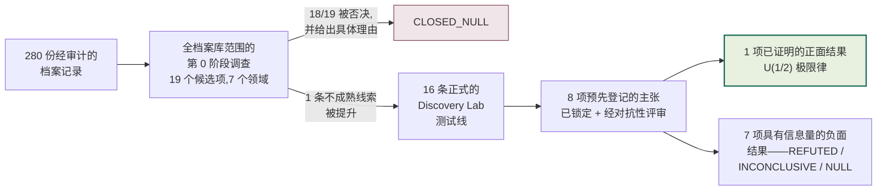
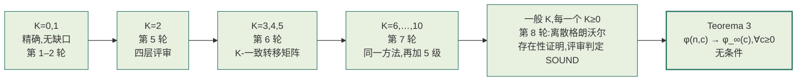
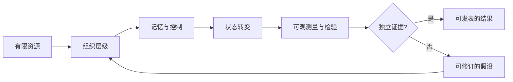
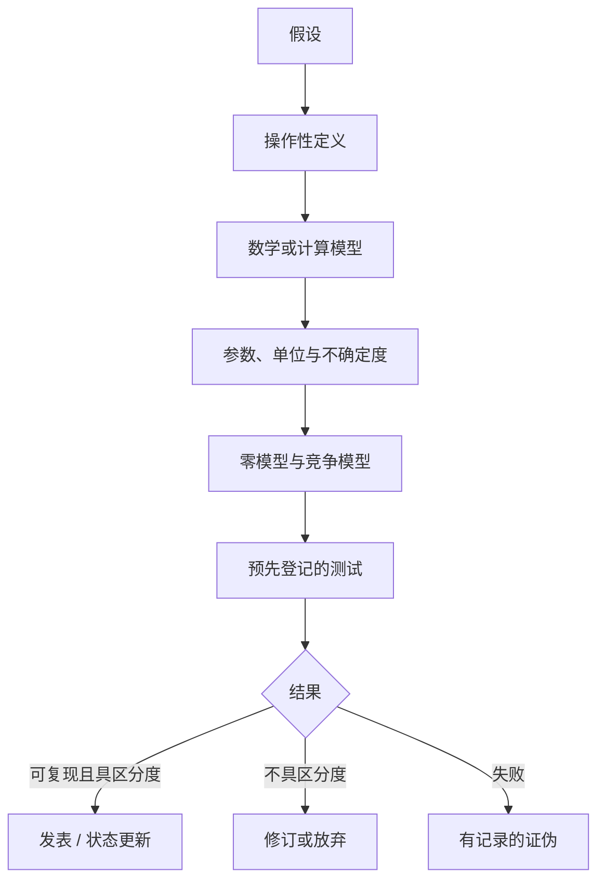

# Tamesis Discovery Lab — 对抗性研究档案库

[](RELATORIO_PROGRESSO_AUDITORIA_ARTIGOS.md)
[](RELATORIO_PROGRESSO_AUDITORIA_ARTIGOS.md)
[](05_DISCOVERY_LAB/01_PORTFOLIO/TEST_QUEUE.yaml)
[](05_DISCOVERY_LAB/00_GOVERNANCE/CLAIM_LEDGER.yaml)
[](05_DISCOVERY_LAB/00_GOVERNANCE/DECISION_LEDGER.yaml)
[%20limit%20law-closed--form%20%C2%B7%20unconditional%20%C2%B7%20adversarially%20verified-8c5a1f?style=for-the-badge)](tamesis-cycle-survival/)
[](PROJECT_STATE.json)
[](LICENSE)
[](README.md#governance-authorship-and-responsibility)
[](README.md)

**语言:** [English](README.md) · [Português (BR)](README_PTBR.md) · [日本語](README_JA.md) · **中文（简体）** · [Español](README_ES.md)

> **一个跨学科研究档案库,涵盖信息、几何、相变、复杂系统与认知——明确将假设与证据分离。**

本仓库保存了 Tamesis 实验室的完整轨迹:其当前的实验分支,以及历史、数学、物理、计算与认知等研究方向。该档案库包含 **280 份经审计的记录**,整理为 **274 份审计档案(dossiers)**。此处的审计并不会把猜想变成事实——它只是明确指出哪些内容是证明、条件性推论、数值拟合、计算示例、猜想,或是推测性情景。

自 2026 年起,该档案库还运行着一个**持续裁定实验室**(`05_DISCOVERY_LAB`):档案库自身提出的每一项定量主张,都会依据预先登记(pre-registered)的标准,并结合真实的外部参考数据,逐一地、以**强制性的对抗性复现(adversarial reproduction)**方式予以裁定并结案。迄今为止的结果——数十项已编目、附有最终裁决的否定性结案,以及一项经独立重新推导并对抗性验证的正面数学结果——综合呈现于**[Discovery Lab 论文](index.html)**(本仓库的首页)之中。

<p align="center"></p>

## 快速阅读

机构报告[Tamesis 实验室最终愿景](RELATORIO_VISAO_FINAL_LABORATORIO_TAMESIS.md)阐述了整个研究计划所提出的问题、答案、影响、应用及新问题。同时也提供了[适合打印的 HTML/PDF 版本](RELATORIO_VISAO_FINAL_LABORATORIO_TAMESIS.html)。

### 当前科学状态

| 层面 | 状态 | 正确解读 |
|---|---|---|
| 档案库与方法论 | **完整 / 已审计** | 清单、主张分类、来源与证伪标准均已记录在案。 |
| 计算模型 | **为审计而冻结** | 可复现的输出应被理解为模型输出,而非实测常数。 |
| Tamesis `M_c v1` | **可检验假设** | 数值 `M_c = 5.292674126388712e-16 kg` 是一个模型参数,而非测量值。 |
| 独立物理证据 | **尚未确立** | 本档案库中没有任何内容构成对 Tamesis 本体论的实验证实。 |
| 千禧年大奖难题与万有理论(TOE)主张 | **未解决** | 这些文本是猜想、归约,或受限模型下的论证——并非被公认接受的解答。 |
| 核心数值裁定 | **数学层面的整合已完成——猜想 1 与猜想 2 现已对每一个 `K` 得到证明(截至 2026-08-26)** | 详见下文——3 项主张以最终裁决被否定性结案;第 4 项(`U₁/₂`)已有经对抗性同行评审(referee)多轮独立评审确认的核心证明结果,开放引理与速率猜想已对每一个 `K≥0` 无条件证明(2026-08-22),最优速率常数 `a*` 已被证明并组装为一个显式的有限 `n` 界(2026-08-25),`γ=c/n` 标度律已对每一个 `γ∈(0,1]` 得到证明(2026-08-26),猜想 1 与猜想 2——完整分布律及其泊松混合——两者现已对**每一个** `K≥1` 得到证明,而非仅限于有限个实例(2026-08-26)。 |

### 裁定计划(Discovery Lab,更新于 2026-08-26)

`05_DISCOVERY_LAB` 持续地将本档案库的定量主张与真实的外部参考数据(PDG、CODATA、Planck、SPARC、Gaia、Odlyzko)进行裁定,方法论在每次计算*之前*即已确定,每一个参考值都有完整的出处溯源,任何正面发现都必须经过**强制性的对抗性复现**。完整记录见:`05_DISCOVERY_LAB/01_PORTFOLIO/TEST_QUEUE.yaml` 与 `05_DISCOVERY_LAB/00_GOVERNANCE/DECISION_LEDGER.yaml`。论文形式的综述见:**[`index.html`](index.html)**(本仓库的首页)。



**完整的存活漏斗(2026 年):**

| 研究线 | 已测试项 | 结果 |
|---|---|---|
| 跨领域不变量(TRI-RG) | 16 个候选项,5 轮 | `CLOSED_NULL`——0 项存活;4 项 `p<0.05` 的发现被对抗性复现推翻(证实为平凡的解释) |
| SPARC/MOND 宇宙学 + Gaia 宽双星 | 4 项预先登记的测试 | 4/4 项因证实存在真实的混杂因素(confounder)而无法定论(inconclusive);发现 2 项历史上的头条结果建立在**伪造数据**之上,已用真实数据重新计算 |
| 黎曼 zeta 函数零点(RH-REAL) | 12/12 项调查内容,全部最终得到处置 | 2 项复现的发现(相邻间距反聚集;`N^(-1/3)` GUE 标度);FHK 极大值与数方差(number-variance)均以 `CLOSED_INCONCLUSIVE` 结案,但各自都有一个强分量经对抗性确认(iid 一侧排除 ≥8.8σ;朴素 GUE 排除高达 203σ——对抗性复现还发现并修复了主估计量中的第 3 个真实缺陷) |
| 核心定量主张裁定(第 1 轮) | 7 项主张 | `M_c` 不一致(不同数值间相差约 190 倍);夸克/纽结质量模型未通过留一法(leave-one-out)检验;`sin²θ_W=3/13` 偏离 7.5σ,且存在硬编码调参;`α⁻¹=Ω^{1.03}` 自由度为 0;反弹(bounce)模型的 `n_s` 不可辨识;全息 `Λ` 依代数恒等式即等于 `ρ_crit` |
| **`U₁/₂` 极限律(第 2–17 轮,整合结果)** | 1 项定理 + 1 项推广 + 开放引理(对每一个 `K≥0`)+ 猜想 1 与猜想 2(对每一个 `K≥1`)+ 最优速率 + `γ` 标度律 | **已证明,经对抗性同行评审(多轮独立评审,每次采用不同技术),已发表为论文并附可复现的软件包;开放引理与速率猜想已对每一个 `K` 无条件证明(第 8 轮,2026-08-22);猜想 1 的完整密度 `f_{M_K}(x)=2Kx(1-x²)^{K-1}` 及其泊松混合对应的猜想 2,在 `K=2,3,4`(第 14–16 轮)逐个 `K` 闭合之后,现已一次性对每一个 `K≥1` 得到证明(第 17 轮,2026-08-26);最优速率常数 `a*` 已被证明并组装为一个显式的有限 `n` 界(第 17 轮,2026-08-25);`γ=c/n` 标度律已对每一个 `γ∈(0,1]` 得到证明(第 17 轮,2026-08-26)**(见下文) |
| 全档案库候选项调查(第 0 阶段,超出 TRI-RG 范围) | 19 个候选项,7 个领域 | `CLOSED_NULL`——18/19 项被否决并给出具体理由;1 条不成熟线索(认知 EEG 频谱特征)被提升为新的研究线,见下文 |
| 认知——抑郁症中的 EEG 频谱特征(Mumtaz,`DISC-COGNITIVE-EEG-SPECTRAL-001`) | 1 项已锁定的预先登记,N=30 MDD / 26 HC | `CLOSED_REFUTED`——重度抑郁症(MDD)患者的频谱熵**更高**而非更低(`d=1.447`,`p=3.97×10⁻⁶`)——方向与所测试的假设相反,已由一次独立的、从零开始的对抗性复现所证实(数值吻合至 <10⁻⁹) |
| SPARC-004 宇宙学——`f_multi` 自校准(第 1→2 阶段) | 流程已验证 + 已应用于真实的发现数据(30,203 个系统) | `CLOSED_INCONCLUSIVE`——机械裁决为 `BOTH_FALSIFIED`,但强制性的证伪复核(debunker pass)发现了一个真实的混杂因素:样本中占 19% 的一个子群体(高 RUWE)被单标量 `f_multi` 模型系统性地欠校正,即使在校准自身的锚定区间(anchor bin)内也存在具有统计学稳健性的过量 |
| 舒曼共振频谱峰值(`DISC-SCHUMANN-RESONANCE-001`) | 真实 ELF 磁力计数据,塞拉内华达观测站(Zenodo),3 天 × 2 个通道,6/6 个案例 | `无法区分`(NÃO DISTINGUE)——在所有案例中,预期位置(7.8–8.0 Hz)都存在真实的宽频谱隆起,但其显著度(1.22×–1.44×)未达到预注册的 3 倍阈值;逐位对抗性复现一致,未作出也不可能作出任何神经连接方面的主张 |
| IIT/Φ 可复现性——标准 ABC 网络(`DISC-IIT-PHI-REPRO-001`) | 通过 PyPhi 复现 Oizumi、Albantakis 与 Tononi(2014 年)论文图 4 中的网络 | `已确认`(CONFIRMED)——计算得 Φ=1.916666,与已发表值 1.916665 相比,在两次完全独立的安装中,16 位有效数字逐位一致;这是对一个已定义指标的可复现性检验,而非对任何意识主张的检验 |
| 自由能原理——可证伪目标的搜索(`DISC-FEP-PREDICTIVE-CODING-001`) | 第 0 阶段文献调研,对 4 个候选目标进行了追溯至一手文献层面的审查 | `因超出领域而关闭`(CLOSED_OUT_OF_DOMAIN)——未找到同时满足三项要求(封闭形式的预测、明确指定的外部竞争模型、公开数据集)的目标;被审查的论文之一在正文中承认该原理"可以说能够解释任何观测到的生物学数据" |
| Lean4 中的非经典逻辑——Priest 的 LP(次协调逻辑) | 6 个文件,876 行代码,12 条元定理,`lake build` 干净通过 | 证明了爆炸律、肯定前件式(modus ponens)与选言三段论在 LP 下均无效(这是次协调性的核心结果);证明了经典逻辑还原定理是真正的双向 `iff`;已经过对抗性审查,仅应用了一处文档性修正 |

这五条研究线开启了一项配套研究计划,将同样的方法论用于检验心灵哲学、认知科学、地球物理学与形式逻辑领域的主张——完整的逐项映射,包括哪些内容因不可证伪而被刻意排除在外(泛心论作为事实、"上帝是一种热力学平衡"的说法、作为可检验命题的模拟论证,以及其他若干项)及其原因,详见 **[`PROGRAMA_CONSCIENCIA_LOGICA_E_REALIDADE.md`](PROGRAMA_CONSCIENCIA_LOGICA_E_REALIDADE.md)**。

### 头号正面结果:一条精确的闭式(closed-form)普适律

`U₁/₂` 普适类(以速率 `c/n` 向随机映射扰动的随机置换)具有如下精确的极限律:

<p align="center"></p>

> `φ_∞(c) = ∫₀¹ e^(−ct²) dt = ½·√(π/c)·erf(√c)` ——零自由参数,

该结果是解析推导得出的(而非拟合所得),修正了档案库最初的猜想 `(1+c)^(-1/2)`(该猜想在级数的第一个系数处即被排除:`a₁ = 1/3 ≠ 1/2`,已通过精确枚举证实)。这一结果现已是一个**已证明的定理**,而非猜想:一份自足的数学文档(`THEOREM.md`)分六个步骤证明了该闭式表达式,其中包括对所访问弧段(arcs)*大小偏倚(size-biasing)*的正确处理,并由一名充当敌对评审员的独立智能体进行了评审——**未发现任何错误**。

有限模型与极限对象之间的桥接,现已**对每一个 `K≥0`** 完成无条件证明——对于每一个固定的 `c ≥ 0`,当 `n → ∞` 时 `φ(n,c) → φ_∞(c)`,不再遗留任何未经证明的假设(`THEOREM.md`,"Teorema 3"):



以上每一级都由一名独立的敌对评审智能体重新推导,所用的证明技术与原始推导*不同*,并配有其自有的暴力枚举(brute-force enumeration)与完整的递归代入检验——在 4 轮独立评审中,**任何一层都未发现错误**。`K=6,…,10` 还额外在两个留出(held-out)点处,与全新的穷举枚举逐位(bit-for-bit)核对确认。最后一级闭合了唯一剩下的、被明确指出的缺口:一名敌对评审员从零开始独立重新推导出一个精确的离散格朗沃尔(discrete-Gronwall)归纳论证,证明了有限 `n` 的两项展开式对*每一个* `K` 都存在,而不仅仅是那 11 个已被具体验证过的取值——裁决为**SOUND,附带若干已命名的问题**(发现 4 个问题,均非致命,已通过带日期的补遗予以修正)。**开放引理**——现已对每一个 `K` 都得到无条件证明——正是 Hansen & Jaworski(EJC, 2014)论文中固定参数情形的精确对应;经系统性文献检索(记录在案的查询超过 35 次)未发现具有闭式 `erf` 表达的泊松混合模型,但需明确说明这并不等同于"新颖(novel)"。另一条研究路线推导出了**指数为何恰好是 1/2**:在整个扰动机制参数化家族中,`α ∈ [1/2, 1]` 始终成立——`α < 1/2` 被*证明是不可能的*(一种二次聚集效应,即使不存在任何循环性的"消亡"也依然存在)。第 5 轮还找到并确认了一种自然机制(`M-WEIB(β)`,非齐次威布尔(Weibull)风险率),它可以达到 `α ∈ (1/2, 1)` 之间的每一个中间值。这里不作任何物理含义上的断言——这纯粹是关于某个特定系综(ensemble)的组合数学结果。

**全阶闭式表达式(2026-08-23)。** 上文中的每一级——`K=0,…,10`、一般 `K` 情形下的桥接、有限 `n` 的误差常数——现在都成为了同一个精确公式的推论。将同样的渐近展开技术推广到一个*符号化*的阶数指标后发现,每一阶的系数恰好就是无符号第一类斯特林数(unsigned Stirling numbers of the first kind);又因为这些数恰好是上升阶乘幂(rising factorial)的系数,整个无穷级数展开式便得以重新求和——不是渐近意义上的,而是精确且有限的(该式在 `K+1` 项后即终止)。其结果是:对于每一个 `n`、`K` 以及偏移参数,都存在一个有限的、完全显式的表达式来描述这一底层递归式,并配有一个不依赖任何展开机制的独立初等证明。一轮专门的敌对评审从零开始,针对其自建的从零搭建的模拟器,重新推导了这两个证明(215,070 次精确核对,零不一致),确认了这一标志性结论,并在一个次要的否定性论断中发现了一个真实错误(已通过带日期的补遗予以修正),此外还有两个原文档刻意保留为未证明的保守标注,也均被评审员直接证明。参见 `THEOREM.md` 中的 "Estágio 9" 一节。

**参数范围全域内的一致收敛(2026-08-23)。** 上述定理只表明,对每一个固定的 `c`,`φ(n,c) → φ_∞(c)` 逐一成立。另一条研究战线对这一缺口的弥合比要求的更为彻底:该收敛不仅在紧致(compact)范围 `[0,C]` 内一致,而且在*整个*半直线 `[0,∞)` 上也一致成立,二者均由两条简短的初等引理无条件证明得到——一个利普希茨(Lipschitz)耦合,以及一个关于 `n` 一致的尾部界(uniform-in-`n` tail bound)——完全不需要用到上文的任何机制。作为额外收获,精确的一阶误差剖面也以闭式表达式的形式被导出。一轮敌对评审对这两条新引理与两个无条件定理发起了最猛烈的攻击,结果均未发现任何错误;其唯一一项实质性发现,纠正了一个次要的、本已属于条件性结果中究竟哪个具体缺口仍未闭合的说法——这使得档案库自身对该缺口的说明变得更准确,而非更不准确。参见 `THEOREM.md` 中的 "Estágio 10" 一节。

**猜想1——完整的分布律,现已对每一个 `K≥1` 得证(2026-08-26)。** 除了上文的均值 `φ_∞(c)` 之外,档案库还猜想了在恰好经历 `K` 次改道的条件下,循环质量的*完整密度*:`f_{M_K}(x) = 2Kx(1-x²)^(K-1)`。`K=2` 已在第14轮研究中闭合;`K=3` 在第15轮研究中出人意料地闭合;`K=4` 已在第16轮研究中闭合——每一次都是与组合爆炸诊断相悖的连续意外,而支撑离环相消的加权森林恒等式(weighted-forest identity)`E(E+Q)^{n−1}=E` 被指名为通向一般性论证的候选路径。第17轮研究的战线(a)沿着这条路径一直走到了终点:`K=1..4` 这一系列中每一个逐个 `K` 的要素——带标记间隔引理、望远镜式剥离(telescoping peel)、目标机制公式,以及加权森林恒等式本身——都被推广到了符号化的 `K`,从而一次性闭合了**每一个 `K≥1` 的猜想1**,其条件仅依赖于整条研究线原本就已依赖的同一条经典引用(`PD(1)` 的大小偏倚/剩余性质),对固定的每个 `K` 递归应用至多 `K−1` 次。作为推论,**猜想2**(完整的无条件律,`M(c) =_d min(1,√(E/c))`)也**现已在同一层级得到证明**,借助已引用过的泊松混合代数——将 `E[M(c)²]=(1−e^{−c})/c` 与 `E[M_K²]=1/(K+1)` 对每一个 `K` 无条件闭合。一名被专门指示去攻击"从逐个 `K` 到一般 `K`"这一跃迁(即望远镜式剥离中的剩余独立性)的加强版敌对评审员,从零开始重构了整个论证——包括在超出该战线自身范围一步的 `K=6` 处进行的从零验证——未发现任何数学错误。参见 `THEOREM.md` 中的 "Estágio 24" 一节:

<p align="center"></p>

**最优常数——上确界现已证明:`sup_K M_K/√K = a*`(2026-08-25)。** `THEOREM.md` 精确证明了 `lim_{K→∞} M_K/√K = a* ≈ 0.367`(Estágio 13);而在两条路径失败后的第三次尝试中,第16轮研究的战线(b)也闭合了上确界:对每一个 `K≥1`,`M_K < a*√K` *严格*成立,因此上确界等于该极限(Estágio 19——借助 Robbins 1955、Flajolet–Grabner–Kirschenhofer–Prodinger 关于 Ramanujan `Q` 函数的双侧界,以及一个经典的精确恒等式;边界情形由敌对评审员亲自闭合,并经独立重新验证)。假设 (U') 现在携带的是最优常数 `a*`,取代了非最优的 `a=1+√(π/2)≈2.253`。第17轮研究的战线(b)随后执行了唯一遗留的机械性工作:用 `a*` 重新运行 Estágio 12 的组装,得到**Teorema R**——最优的、显式的有限 `n` 速率:`|φ(n,c)−φ_∞(c)| ≤ [a*√c+κ_B]/n`,对 `n≥4`、`0≤c≤n` 严格成立,加性常数 `κ_B≈0.2805` 保持不变,现已通过纯有理数运算认证,且沿 `c=n` 渐近紧(Estágio 22):

<p align="center"></p>

**γ标度律——已对每一个 `γ∈(0,1]` 得证(2026-08-26)。** 自第4轮研究(Estágios 10–13)以来一直悬而未决的一个独立问题:对于固定比率 `γ=c/n`(而不仅仅是固定的 `c`),`φ(n,γn)/φ_∞(γn) → √(2/(2−γ))` 是否成立?第17轮研究的战线(e)对此给出了完整证明,方法是直接从模型的定义出发推导出一个全新的、精确的有限 `n` 双重求和公式来表示 `φ(n,qn)`——刻意不重用 Estágios 9/12/22 的机制,因为经诊断确认,该机制在结构上对这一特定的比率极限而言过于薄弱。两项额外目标也一并闭合:在紧集 `[γ₀,1]` 上的一致性,以及满足 `γ_n n^{1/3}/ln n→∞` 的 `γ_n→0` 极限。一名敌对评审员在编写任何代码之前就手工重新推导出了核心公式,并且——作为一次很好的交叉核验——该评审员与主导会话双方都各自独立地在自己的验证脚本中发现并修复了*同一类*灾难性的浮点下溢(underflow)缺陷,然后才确认了这一结果。参见 `THEOREM.md` 中的 "Estágio 23" 一节:

<p align="center"></p>

**关于双点联合律的一个新定理——已证明(2026-08-26)。** 另一条战线攻克了 Estágio 18 所定位的障碍:同时探索*两个*参考点的联合律。其两个数值目标已经通过一条无关的路径被上文的一般 `K` 结果闭合——这并不矛盾,因为该战线自身已经证明,从"同环/异环"划分到这些目标之间并不存在捷径。该战线真正证明的新结果是**均匀循环限制定理**——以最终落在某个环上的点集合为条件,`f` 在该已实现的循环集合上诱导出的置换,对每一个有限的 `n`、`K`,在其所有可能的排列上都*严格*均匀分布——并附带一个精确推论:两个点在都作为循环点存活的条件下,恰好有一半的概率落在同一个最终环上。一名敌对评审员先徒手独立重新推导出该定理及其风险最高的引理,随后执行了比该战线本身所覆盖的情形更多的穷举检验,未发现错误。参见 `THEOREM.md` 中的 "Estágio 25" 一节。

**第18轮研究——三项诚实的未闭合,每一项都伴随着真实的无条件进展(2026-08-26)。** 另外三条战线分别攻克了上文遗留的未解决项目,均未闭合其核心任务,但每一条都精确定位了剩余困难所在。关于 γ 标度律的二阶项 `C(γ)`(自 Estágio 23 起悬而未决):引理E证明了 `C(γ)` 与一个精确求和 `S_n` 之间的命题的精确等价性,引理D0通过泊松求和/雅可比θ变换——这条研究线中的新技巧——给出了该求和"确定性一半"的闭形式 `D_0(γ)=(γ-1)/(2(2-γ))`,对每一个 `γ∈(0,1]` 均成立;第二个独立的启发式推导恰好在符号层面上与第17轮研究中已猜想的闭形式吻合,这是有力的证据,但并非证明。`C(γ)` 对 `γ∈(0,1)` 依然悬而未决。参见 `THEOREM.md` 中的 "Estágio 26" 一节。关于分布桥接 `M_n(c)→_d M(c)`(自 Estágio 6 起悬而未决,不同于已由定理1闭合的均值):`K=0,1` 的情形现已无条件闭合,依靠有限 `n` 下CDF混合的精确恒等式(命题D0)、档案库泊松混合论证在CDF层面的完整版本(引理R),以及一个精确闭形式 `P(M_n^{(1)}≤k/n)=k(k+1)/n²`(命题D1)——其推论包括这条研究线上首个二阶矩/涨落结果——再加上将二阶矩收敛归约为单一标量的一般 `K` 归约(引理P2)。`K≥2` 依然悬而未决。参见 `THEOREM.md` 中的 "Estágio 27" 一节。关于定理J的连续统原生版本(曾在 Estágio 25 §6.3 中直接尝试,并在那里被搁置):直接构造依然悬而未决,但一种真正的"通过传递"绕行方案——利用定理J的推论(Estágio 25)在每一个有限 `n` 下都是精确恒等式,而不仅仅是渐近成立这一事实——闭合了一个新的连续统定理 `P(同一最终环 | K个标记) = 1/(2(K+1))`,适用于 `K=0,1`。`K≥2` 依然悬而未决。参见 `THEOREM.md` 中的 "Estágio 28" 一节。三条战线均通过了专门的敌对评审(`SOUND`,"ACCEPT for catalogue");发现的唯一错误(引理D0误差项中一个错误的指数——正确速率是 `Θ(n^{-1/2})`,而非最初声称的指数级小上界;`D_0(γ)` 的值本身不受影响)已在纳入档案库之前通过日期标注的勘误得到修正。

**第18轮研究(第四条战线)与第19轮研究——两项闭合、一项扩展、一项精确诊断(2026-08-26)。** 与上述三条战线一同派出、但随后才被纳入的第18轮研究第四条战线,将 `D*^{(p)}_r(b)` 从 `p=1,...,20` 扩展到了 `p=1,...,40` 的完整规模——不含任何新的数学要素,138,040 项穷举核验加 400 项随机化核验,零分歧,评审员刻意采用不同路径(以斯特林数取代伯努利/法尔哈伯)重新推导。参见 `THEOREM.md` 中的 "Estágio 29" 一节。第19轮研究随后闭合了两项、扩展了一项。关于 `C(γ)` 的第二个技术缺口:`τ(m)` 被证明是一个精确的三次多项式,由此 `Δτ(k)` 得到一个精确闭形式——而非泰勒余项界——在整个 `1≤k≤n` 区间上均成立,而对 `E(γ)` 真正重要的加权求和,借助一个新引理G2(由已证明的泊松求和恒等式求导得到的初等推论),被证明为 `O(n^{-1/2})→0`——比要求的更强。`C(γ)` 对 `γ∈(0,1)` 依然悬而未决,但通过排除法,第一个技术缺口现已成为唯一被点名的主要障碍。参见 `THEOREM.md` 中的 "Estágio 30" 一节。关于双点联合探索(在 Estágio 18 中被提出,并被独立指认为四项不同集成结果的阻碍,分别是 Estágios 18、25、27、28):`K=2` 现已**得证**——精确闭形式 `P_nn(n,2)=(10n²+7n+2)/(30n²)`,通过两个将单点分情形方法推广到双点的新引理得到,闭合了 Estágio 27 二阶矩目标 `P_nn(n,K)→1/(K+1)` 在 `K=2` 处的情形,并借助已证明的定理J推论,几乎不费力地将连续统传递定理扩展到 `K=2`(`→1/6`)。`K≥3` 依然悬而未决,但现已获得精确的结构性诊断(标记弧上的函数图,而非简单的 3×3 表格)。参见 `THEOREM.md` 中的 "Estágio 31" 一节。而 `D*^{(p)}_r(b)` 再度被扩展至 `p=1,...,80` 的完整规模,261,274 项精确核验,零分歧——`p>80` 仅因尚未执行而悬而未决。参见 `THEOREM.md` 中的 "Estágio 32" 一节。另外,关于 M-CLUST(b) 平台残差(`PROOF_DEPENDENCY_MAP.md` 中的 `PLATRESUM` 节点——一个不同于本定理主线的独立机制):第四条战线利用现已精确的抽象平台常数,将旧有的"约30%"抽象值—实测值差距重新刻画为**平均约38.8%**(区间35.8%–43.2%),且在整个参数区间内大致保持恒定——这是一个精确的诊断,而非闭合——并通过一种新的残差分离方法,将四项渐近律的下两个系数 `d4≈26.1246`、`d5≈-82.017` 在数值上进一步加强,该方法覆盖了从 `c=100` 到 `c=655,360` 的范围。四条战线均通过了专门的敌对评审(`SOUND` / `SOUND WITH NAMED ISSUES`,均为"ACCEPT for catalogue"),被指出的问题均已通过日期标注的勘误修正,且均不影响任何已报告的数值。

**第20轮研究——一项完全闭合、一项意外的第二次证明、一项进一步的诚实部分闭合、一项被拆解的启发式缺口(2026-08-26)。** 四条战线攻克了第19轮研究遗留的未解决项目。关于 `C(γ)` 的第一个技术缺口(在第二个缺口闭合后唯一被点名的剩余障碍):这是一个真正超越性的对象,不同于第二个缺口,不存在精确闭形式——但该战线给出了一个新的精确代数事实(`δ(D)+τ(M)/2` 是 `D:=M-γk` 的精确三次多项式)、一个新的严格 Bulk/Tail 引理(借助单调性与 Hoeffding 不等式,将该缺口归约为限定两个确定性标量的大小),以及一个主阶渐近结果,表明所得的界确实趋于零——但尚未成为对 `γ` 一致的完全显式不等式。`C(γ)` 对 `γ∈(0,1)` 依然悬而未决,但策略现已具体化并经数值验证。参见 `THEOREM.md` 中的 "Estágio 33" 一节。关于双点联合探索:被前一条战线诊断为结构上远更困难的 `K=3`,现已针对二阶矩/同环这两个标量目标**得证**——精确闭形式 `P_nn(n,3)=(35n³+38n²+23n+6)/(140n³)`,借助两个直接回应此前诊断而非绕开它的新机制(主导源重编号;环前驱唯一性)得到。连续统传递模式 `1/(2(K+1))` 现已在 `K=0,1,2,3` 得到确认;完整的CDF与一般 `K` 联合律依然悬而未决。参见 `THEOREM.md` 中的 "Estágio 35" 一节。关于 M-CLUST(b) 平台的启发式缺口 `H1`:一个新的严格 Watson 集中引理将 `H1` 归约为两个更小的、可逐一核验的条件,再加上平台轮廓的一个新的精确常微分方程,以及一个广泛的数值一致性网格,显示近似比率单调收敛到1——这与真正的一致性失效所应表现出的情形恰恰相反。`H1` 依然悬而未决,但现已被拆解而非作为一个整体;`H2` 未被触及。最后,第四条战线彻底闭合了**"中间窗口"** `n^ε≤c_n≤n^{2/3}/log(n)`——自第17轮研究以来一直被点名为悬而未决的残留问题,此前从未有战线直接攻克——方法是将两个已证明的结果(Teorema R、Corolário 4.2)进行简短而初等的组合,不含任何新机制,并附带一个额外收获:同一论证强化了 Corolário 2 的 `γ_n→0` 一侧,使其原本所需的最小增长速率假设不再必要。参见 `THEOREM.md` 中的 "Estágio 34" 一节。四条战线均通过了专门的敌对评审(`SOUND` / `SOUND WITH NAMED ISSUES`,均为"ACCEPT for catalogue"),被指出的问题均已通过日期标注的勘误修正。此处不涉及任何关于千禧年大奖难题(Millennium Problem)的进展主张;这是本档案库内部纯粹的组合数学。

**第21轮研究——对一个既有常数的一项修正,以及第一个技术缺口的首个显式不等式(2026-08-26)。** 继续攻克 γ 标度律二阶项的第一个技术缺口(第19轮研究闭合第二个技术缺口之后唯一被点名的剩余障碍),该战线重新研读了 Estágio 33 自身所引用的源证明,发现了一处真正的修正:截断常数 `κ_0(γ)=8/(γ(2-γ))` 是 `γ` 的一个函数,而非 Estágio 33 所用的示例性常数 `2.25`——因此 `λ(γ)=4(3-2γ)/(γ(2-γ))` 连续但在 `(0,1)` 上**无界**(随 `γ→0⁺` 发散),这直接反驳了 Estágio 33 及其前身所声称的 `λ` 在 `(0,1)` 上"有界"。经过正确限定范围的替代命题已被严格证明:单一常数 `C(γ_0)` 在每一个紧集 `[γ_0,1)⊂(0,1)` 上一致成立,但没有单一的 `C` 能同时在整个开区间上成立。另外,该战线确实构造出了 Estágio 33 遗留的显式不等式 `∀n≥n_0(γ)`——闭合了逻辑上的缺口,但未闭合实用上的缺口:由于刻意采用粗糙的初等常数,所得的 `n_0(γ)` 天文数字般巨大(`γ=0.99` 时约为 `10²¹`,`γ=0.01` 时约为 `10⁸⁵`)。此前的任何数值结果均未被削弱——该修正仅影响关于不等式形态的定性论断,不涉及任何已登记的数值。`C(γ)` 对 `γ∈(0,1)` 依然完全悬而未决。一名专任敌对评审员独立地从所引用的源头重新推导了修正后的代数,并将该修正确认无疑(发现一处低严重性的表述性瑕疵,已通过日期标注的勘误修正)。参见 `THEOREM.md` 中的 "Estágio 36" 一节。

**第21轮研究的剩余战线,加上第22轮研究——一个更锋利的尾部不等式,以及一般 `K` 闭式一路扩展到 `K=8`(2026-08-27至2026-08-28)。** 在第一个技术缺口的实用一面:一个真正更锋利、对方差敏感的尾部不等式(Bernstein,而非 Hoeffding)将 `n_0(γ)` 在 `γ=0.01` 处削减最多约 `9` 个数量级(在中等 `γ` 处为 `0.44`–`3.19` 个数量级,在 `γ=0.5` 处损失可忽略不计,因为 Hoeffding 本就假定的最坏情形在该处恰好成立)——这是一项真实的部分改进,而非闭合:`n_0(γ)` 依然天文数字般巨大(`10^18`–`10^76`),`C(γ)` 本身依然完全悬而未决。同一构造还带来了一项真正的额外收获:由于 `σ²(γ)λ̂(γ)→28` 在 `γ→0` 时保持有限,如今一个不依赖 `γ` 的单一常数在整个开区间 `(0,1)` 上都足够,而不仅仅是像 Hoeffding 路线那样局限于紧集。参见 `THEOREM.md` 中的 "Estágio 37" 一节。关于双点联合律:一般 `K` 的分情形方法本身(主导源重编号+环前驱唯一性)如今已被证明在其证明逻辑上真正与 `K` 无关——字面上就是把 `K=3` 的证明中的 `3` 替换为 `K`——由此闭合了 `K=4,5,6` 处的新精确闭式(命题 NN4/NN5/NN6,例如 `P_nn(n,4)=(126n⁴+187n³+177n²+98n+24)/(630n⁴)`),并与多达 1.65 亿/8470 万种穷举构型的真实暴力枚举完成了交叉核验。关于 `K` 的单一闭式依然悬而未决,其原因已被精确诊断为符号求和中项数的增长,而非方法本身存在障碍;`K≥7` 因明确说明的算力预算原因未在此尝试。参见 `THEOREM.md` 中的 "Estágio 38" 一节。随后的一条战线将 `P_disjoint(s,s')` 的双重积分——被 Estágio 38 标记为其最具体的未解决问题——收敛为单一积分,并附带一个额外的恒等式 `P_same≡P_disjoint`;同样的思路通过一个普通生成函数恒等式被推进到外层的组合求和之中,产生了一个快得多的一般 `K` 算法(`K=1,...,6` 仅需约 `1` 秒,而前代方法需约 `166` 秒),并由此得到两个真正全新的闭式 `P_nn(n,7)` 与 `P_nn(n,8)`,二者均通过两条独立路径得到确认。关于符号 `K` 的单一闭式的障碍如今已被精确地重新定位——落在一个规模为 `K` 的对 `r` 求和的有限和之中——并且与 Estágio 38 的情形不同,该障碍已被CERTIFIED(而不仅仅是被观察到)在此处不存在初等闭式:Gosper 算法(一个真正的判定程序,而非启发式方法)在符号 `K` 以及 13 个具体取值 `K=3,...,15` 下,对全部三类矩均返回 `None`。两条战线均通过了专门的敌对评审(`SOUND` / `SOUND WITH NAMED ISSUES`——均为"ACCEPT for catalogue");被指出的问题(引用精度、表述性标签)均已通过日期标注的勘误修正。`K≥9` 未被尝试,对于超出本处所核验的 Gosper 可求和类之外是否存在关于 `K` 的闭式,亦不作任何断言。参见 `THEOREM.md` 中的 "Estágio 39" 一节。此处不涉及任何关于千禧年大奖难题的进展主张;这是本档案库内部纯粹的组合数学。

**第21轮重新派发的前线(b)——`M_n^{(3)}` 的完整CDF,已闭合(2026-08-28)。** 自 Estágio 27 以来悬而未决的另一项——按 `K=1` 的命题 D1 风格给出的完整闭式CDF `P(M_n^{(3)}≤k/n)`——在此前一次 v1 前线陷入停滞且无可核验的成果之后,被作为全新尝试(`K3-FULL-CDF-ATTEMPT`,v2)从零重新派发;被放弃的 v1 材料被保留而非删除,以备审计。新前线不仅闭合了其任务,还超出了预期:一个新的**循环点计数完全分解定理**将 Estágio 35 的成对引理 4/5 强化为循环点计数 `T`(`M_n^{(3)}=T/n`)的**完整联合律**——`T=O+Σ_{s∈S}V_s`,其中 `S⊆{0,1,2}` 是循环源的随机子集,在给定 `S` 的条件下 `V_s` 相互独立且均匀分布,`S` 的分布由四个新的闭式(**命题 S**)给出。由此得出主结果**命题 D3**:对每个 `n≥3` 及每个整数 `k`,都有一个统一于 `n` 的单一闭式有理函数 `P(M_n^{(3)}≤k/n)`——恰好达到了命题 D1 的雄心,只是在更远一级的普适性类上。随之而来五条推论:直接证明得到 `P(M_n^{(3)}=1)=6/n³`;已证明的有限 `n` 均值 `φ_n^{(3)}`(Estágio 4)以**零符号余项**精确恢复;二阶/三阶矩极限与已证明的连续极限值 `1/4` 和 `16/105`(Estágio 17/18)相符;以及一个一致的 `O(1/n)` 收敛速率界。一位敌对裁判——将真正的穷举验证扩展到超出前线自身测试范围的 `n=9`,并独立地在全部 `4³=64` 个原始情形上重新推导命题 S 的四条公式——未发现任何数学错误;发现一项信息性问题(Estágio 4 的均值公式原本仅针对 `n≥4` 给出,裁判发现它——以及命题 D3——在 `n=3` 时同样精确成立)以及一项关于被放弃的 v1 尝试的溯源疑问,后者由协调会话直接解决:被标记的 v1 文件仅含单点概率质量函数公式(`P(T=n-2)`、`P(T=n-3)`),并非与之竞争的CDF,且其中一条公式实际上是错误的——这与 v1 在工作中途被正确放弃、而非悄然完成的判断相符。裁决:**SOUND WITH NAMED ISSUES——ACCEPT for catalogue**。`M_n^{(3)}` 的完整CDF现已成为本谱系中继 `K=0,1`(Estágio 27)之后第一个被收录目录的完整闭式CDF;一般 `K`(`K≥4`)的完整CDF仍未解决,本前线未曾尝试。此处不涉及任何关于千禧年大奖难题的进展主张;这是本档案库内部纯粹的组合数学。参见 `THEOREM.md` 中的 "Estágio 40" 一节。

**在哪里能找到全部内容:** 完整的定理与评审报告位于 `05_DISCOVERY_LAB/02_TESTS/CORE_NUMERICS/u12_universality/theorem/`;其推广及对抗性验证位于 `.../generalization_u_alpha/`;一个**独立的可复现软件包**——已编译的 LaTeX 论文(PDF)、自足的证明、洁净室(clean-room)模拟,以及 49 项自动化测试——位于 **[`tamesis-cycle-survival/`](tamesis-cycle-survival/)**。而**本实验室所尝试过但未能存活的一切**的诚实清单——以便这一项正面结果能被置于正确的语境中理解——位于 **[`FAILED_HYPOTHESES.md`](FAILED_HYPOTHESES.md)**。

一项对整个 Tamesis 档案库(不局限于 TRI-RG,涵盖 7 个领域的 19 个候选项)的诚实调查以 `CLOSED_NULL` 结案——18/19 项被否决并给出具体理由——并将发现的唯一一条不成熟线索(认知 EEG 频谱特征,抑郁症与焦虑症对比)提升为一条新的候选研究线。其操作化(operationalization)阶段已经完成(可观测量被定义为归一化香农频谱熵、指定了一个竞争模型、计算了统计功效,并且已核实抑郁症分支的真实数据可获取性)——焦虑症分支仍卡在一个需要人工登录的数据提供方处,这一点已被如实报告;该分支尚未计算任何真实数据。详见 `05_DISCOVERY_LAB/02_TESTS/ARCHIVE_PHASE0_SURVEY/SURVEY.md` 与 `05_DISCOVERY_LAB/02_TESTS/COGNITIVE_EEG_SPECTRAL/OPERATIONALIZATION.md`。

## 实验室愿景

该研究计划探究的是:在有限资源约束下的系统,当额外复杂性的代价能够被误差、耗散、不稳定性或未来搜索成本的降低所抵消时,系统是否能够构建出额外的组织层级。这是一条**建模原则**,而非赋予自然界某种目的。

该实验室将四个层面联系在一起:

1. **数学:** 算子、谱、拓扑、图、普适性与正则性。
2. **基础物理学:** 信息、几何、全息原理、引力、粒子,以及量子到经典的转变。
3. **复杂系统:** 热力学、记忆、不可逆性、网络、稳定性与控制。
4. **生命与认知:** 整合的有机体、脑机接口、意识,以及认知生态系统。




<p align="center"><sub>图 1 —— 全息原理的工作示意图。这是一个建模假设,并非宇宙具有全息性质或是一场模拟的证据。</sub></p>

## 从这里开始

- **[Discovery Lab 科学论文(2026)——对抗性裁定与 `U₁/₂` 极限律](index.html)**(仓库首页)
- **[`tamesis-cycle-survival/`](tamesis-cycle-survival/) 可复现软件包** —— `U₁/₂` 定理的已编译 LaTeX 论文、证明、模拟与自动化测试
- **[`FAILED_HYPOTHESES.md`](FAILED_HYPOTHESES.md)** —— 本实验室中每一项经测试但未能存活的假设的诚实清单
- [实验室最终愿景报告](RELATORIO_VISAO_FINAL_LABORATORIO_TAMESIS.md)
- [用于展示的 HTML 与 PDF 版本](RELATORIO_VISAO_FINAL_LABORATORIO_TAMESIS.html)
- [280 篇文章的审计报告](RELATORIO_PROGRESSO_AUDITORIA_ARTIGOS.md)
- [严格审计规程](PROTOCOLO_AUDITORIA_RIGOROSA_DE_ARTIGOS.md)
- [机器可读的清单文件](ARTICLE_MANIFEST.csv)
- [冻结状态与恢复条件](PROJECT_FREEZE.md)
- [项目状态(JSON 格式)](PROJECT_STATE.json)
- [时间线](00_HOME/TIMELINE.md)
- [档案库地图](00_HOME/WORKSPACE_MAP.md)
- [可导航的主页](00_HOME/README.md)
- [交互式假设图谱](atlas.html)
- [`U₁/₂` 研究线的证明依赖关系图](05_DISCOVERY_LAB/02_TESTS/CORE_NUMERICS/u12_universality/PROOF_DEPENDENCY_MAP.md)

## 研究方向

| 研究线 | 核心问题 | 当前状态 | 潜在应用 |
|---|---|---|---|
| **A. 基础与实在的架构** | 信息、几何或计算能否生成时空与有效定律? | 概念架构与候选模型。 | 量子引力、信息几何、网络建模。 |
| **B. 公理与操作性桥接** | 一个小型公理集能否在不针对各扇区分别调参的情况下重现已观测到的方程? | 部分的、条件性的闭合。 | 模型推导、一致性检验、参数简化。 |
| **C. TDTR、TRI 与不可逆性** | 状态是如何变化的?为何某些转变是不可逆的? | 词汇体系、程序库与转变模型。 | 热力学、耗散动力学、时间之箭。 |
| **D. 普适性** | 不同系统是否共享不变量与标度律? | **`U₁/₂` 类的精确极限律,已推导并经对抗性验证(2026 年 8 月)**;跨领域不变量的实证搜索以空结果(null)结案(16/16)。 | 转变检测、失效分析、自适应控制。 |
| **E. 谱与黎曼猜想** | 是否存在一个算子,其谱恰好实现 zeta 函数的零点? | 合理的数学路径;尚无黎曼假设的证明。 | 谱理论、量子混沌、数值分析。 |
| **F. 计算、图与素数** | 算术结构能否被编码进图与计算系统中? | 探索性的算法与对应关系。 | 图学习、网络分析、谱算法。 |
| **G. 观测宇宙学** | 什么样的可观测量能将 Tamesis 与 `ΛCDM`、MOND 及其他竞争模型区分开? | 测试目录;尚无经证实的经验性替代方案。 | CMB(宇宙微波背景)、BAO(重子声学振荡)、超新星、引力透镜、SPARC、引力波。 |
| **H. 黑洞与奇点** | 信息与几何如何处理视界与奇点? | 推测性的热力学/全息模型。 | 量子信息、引力、视界热力学。 |
| **I. 粒子与拓扑** | 拓扑能否解释质量、代际(family)、混合与耦合? | 候选机制与数值关系。 | 粒子唯象学与精密检验。 |
| **J. 量子到经典的极限** | 量子动力学在何时、为何会变为经典的? | 相互竞争的假设与实验设计。 | 干涉测量、光力学(optomechanics)、量子计量学。 |
| **K. 认知生态系统** | 有机体如何构建控制、记忆与意识特征? | 概念性议程与实证研究计划。 | 网络神经科学、生理学、脑机接口。 |
| **L. 认知拓扑与混合控制论** | 认知状态能否通过关系性/谱不变量来分类? | 理论结构与控制原型。 | 人机系统与具身机器人技术。 |
| **M. 稳定性与算子** | 强制性(coercivity)、耗散与谱裕度能否检测出病态状态? | 候选方法与受限定理。 | 基础设施控制、异常检测、自适应网络。 |
| **N. 千禧年大奖难题** | 有限容量能否推出关于 `P vs NP`、黎曼假设(RH)或偏微分方程(PDE)的定理? | 无被公认接受的解答;仅有受限的论证。 | 新的数学引理,而非解决声明。 |
| **O. 推测性宇宙学与度规工程** | 反弹(bounce)、母宇宙,或修改后的度规能否产生可观测量? | 推测性情景。 | 只有在得到一个协变、稳定、满足因果性的解之后才可能。 |
| **P. 科研基础设施** | 如何保持跨学科研究的可复现性与诚实性? | 可追溯的清单与审计。 | 治理、评审、预印本、外部合作。 |

### 各研究线的完成度潜力(操作性估计,并非档案库指标)

下表逐条研究线估计**每个核心问题中所指明的缺口已被表征(characterized)到何种程度**——而不是该假设正确的概率,也不是实验室计算出的某项指标。这是一种外部解读,依据每条研究线所记录的真实状态(`RELATORIO_VISAO_FINAL_LABORATORIO_TAMESIS.md` 第 6 节及 `05_DISCOVERY_LAB/`)进行校准,并对原始清单作出一处重要修正:**研究线 D 必须分两部分来看待。** 由 Discovery Lab 严格裁定的 `U₁/₂` 子集已进展良好;但作为整体的研究线 D——在原始报告中还包括 `U₀`、`U₂`/林德布拉德(Lindblad)方程、一般类别图谱以及拓扑应用——**并未**以同样的比例取得进展:实验室自身的全档案库调查(`DISC-ARCHIVE-PHASE0-SURVEY-001`)记录显示,与 `U₁/₂` 不同,`U₀` 和 `U₂` 从未达到过闭式候选阶段。若将"研究线 D"笼统地视为已解决 85%,正是本档案库的纪律所要防止的那种混淆。

| 排名 | 研究线 | 估计完成度 | 状态 | 待解决事项 |
|---:|---|---:|---|---|
| 🥇 | **D —— `U₁/₂`**(已裁定子集,`DISC-CORE-NUMERICS-001`) | **约 98%** | ✅ 开放引理与一般 `K` 的速率猜想已**对每一个 `K≥0` 无条件证明**(2026-08-22);关于底层递归式、适用于一般 `K` 的精确、有限的全阶闭式表达式现已同样得到**证明**(2026-08-23),收敛 `φ(n,c)→φ_∞(c)` 已被证明在 **`c` 取遍整个范围 `[0,∞)` 时一致成立**,而不仅仅是逐点成立(2026-08-23);以 `c` 表示的最优显式速率现已**完全闭合**:`sup_K M_K/√K=a*≈0.367` 已得到证明(2026-08-25,第三次尝试),随后组装为 `|φ(n,c)−φ_∞(c)| ≤ [a*√c+0.2805]/n`,对 `n≥4`、`0≤c≤n` 严格成立,`κ_B` 已通过纯有理数运算认证(2026-08-25);`γ=c/n` 标度律现已对每一个 `γ∈(0,1]` **闭合**,`φ(n,γn)/φ_∞(γn)→√(2/(2−γ))`,通过一个全新的精确有限 `n` 双重求和公式,连同两项额外目标(紧集上的一致性、`γ_n→0` 极限)一并证明(2026-08-26);以及**完整分布律现已一次性对每一个 `K≥1` 闭合**——猜想 1 的密度 `f_{M_K}(x)=2Kx(1-x²)^{K-1}`,以及作为经由泊松混合代数得到的间接推论、猜想 2 本身(`M(c)=_d min(1,√(E/c))`),两者均已证明,将 `E[M(c)²]=(1−e^{−c})/c` 与 `E[M_K²]=1/(K+1)` 对每一个 `K` 无条件闭合(第17轮研究,2026-08-26)——本研究线此前所有有限 `n` 的结果现均成为这一单一公式的推论 | 剩余事项,均非核心:M-CLUST(b) 残差(一个独立的机制,`PARTIALLY CLOSED`;抽象值—实测值差距现已被精确刻画为**平均约38.8%**(区间35.8%–43.2%,在整个参数区间内大致恒定),而非闭合,四项渐近律的系数 `d4,d5` 也已在数值上加强,但重求和本身,以及两个启发式缺口 `H1`(已通过一个新的 Watson 集中引理拆解为两个更小的条件,但依然悬而未决)与 `H2`(未被触及)仍悬而未决,2026-08-26);猜想 2 自身的*直接*路径(不经由猜想 1)仍如实保持未解决——受托构建的两点联合探索机制现已在 `K=2` 与 `K=3` 处取得证明结果(2026-08-26,闭合了相应的二阶矩/同环目标,并在 `K=0,1,2,3` 处确认了连续统传递模式 `1/(2(K+1))`);一般 `K` 的分情形方法本身如今已被证明在其证明逻辑上真正与 `K` 无关,而不仅仅是逐点核验,由此闭合了 `K=4,5,6`(Estágio 38)处的新精确闭式,并通过更快的组合求和收敛,又闭合了 `K=7,8`(Estágio 39)——如今精确地只剩下一项未解决:一个关于 `K` 的单一闭式,如今已被CERTIFIED(通过 Gosper 算法,而不仅仅是未被找到)在此处所用的自然构造下不存在于 Gosper 可求和类之中;`K≥9` 未被尝试;超出 `K=0,1` 的完整CDF如今在 `K=3` 处也已闭合(Estágio 40),`K=2` 与 `K≥4` 仍悬而未决;分布桥接 `M_n(c)→_d M(c)` 已在完整CDF层面对 `K=0,1` 无条件闭合,归约后的二阶矩目标 `P_nn(n,K)→1/(K+1)` 也已在 `K=2,3` 闭合;完整CDF如今在 `K=3` 处也已**闭合**——命题 D3,对每个 `n≥3` 及每个整数 `k` 给出的单一闭式有理函数 `P(M_n^{(3)}≤k/n)`,及其背后的循环点计数完全分解定理与命题 S(Estágio 40,2026-08-28)——`K=2` 的完整CDF未被该结果涉及,仍悬而未决,一般 `K`(`K≥4`)的完整CDF也仍未解决、未曾尝试;精确误差常数 `D*^{(p)}_r(b)` 的闭式表达式(现已对任意 `b≥0` 证明并执行至**`p=1,...,80`**,自第18轮研究以来又扩展了两次,2026-08-26;`p>80` 仅因尚未执行而未解决,并非数学上存在不确定性);`γ` 标度律在 `γ∈(0,1)` 上二阶项的严格(非启发式)版本(第19轮研究严格闭合了第二个技术缺口,且强度超出要求,Estágio 30;第20轮研究随后为唯一被点名的剩余障碍——第一个技术缺口——给出了具体且经数值验证的证明策略,Estágio 33;第21轮研究修正了 Estágio 33 自身的截断常数——`λ(γ)` 在 `(0,1)` 上无界,而非最初所声称的有界,仅在紧集 `[γ_0,1)` 上一致——并构造出第一个技术缺口所需的显式不等式 `n_0(γ)`,尽管数值上并不实用(约 `10²¹`–`10⁸⁵`),Estágio 36;第22轮研究随后换用了对方差敏感的 Bernstein 尾部不等式,在 `γ` 较小时将 `n_0(γ)` 削减最多约 `10⁹` 倍,并带来一项真正的额外收获:一个不依赖 `γ` 的单一常数如今在整个开区间 `(0,1)` 上均成立,而不仅限于紧集,Estágio 37——但以上均未将其闭合:`C(γ)` 本身依然完全悬而未决,`n_0(γ)` 依然为 `10^18`–`10^76`);固定 `c` 区制与 `γ_n→0` 区制之间的中间过渡区此前悬而未决,现已**闭合**(2026-08-26,通过两个已证明结果的简短组合,并附带强化 Corolário 2 `γ_n→0` 一侧的额外收获,Estágio 34)——见[依赖关系图](05_DISCOVERY_LAB/02_TESTS/CORE_NUMERICS/u12_universality/PROOF_DEPENDENCY_MAP.md) |
| 🥈 | **P —— 基础设施** | **约 90%** | 🔧 持续进行中——自 2026 年 7 月起新增了第二层:预先登记 + 强制性对抗性复现 + 决策/主张台账(`05_DISCOVERY_LAB/00_GOVERNANCE/`) | 语义化版本管理、开放数据/代码、外部评审 |
| 🥉 | **B —— 公理** | 35% | 🟡 有希望 | 证明桥接在不针对各扇区分别调参的情况下保持对称性/守恒律 |
| 4 | **E —— 黎曼** | 30% | 🟡 探索性——自 2026 年 7 月起,`RH-REAL` 调查的全部 12 项内容均已最终处置;2 项复现的发现(反聚集;GUE 标度),均未涉及黎曼假设本身 | 一个自伴算子,其谱能实现这些零点,并具备完整的误差控制 |
| 5 | **M —— 稳定性** | 30% | 🟡 探索性 | 一个小型定理、完整的假设条件,以及与 Lyapunov(李雅普诺夫)/LQR 方法的基准对比 |
| 6 | **C —— 不可逆性** | 25% | 🟡 | 一个非平凡的单调量 + 一个可检验的转变类别 |
| 7 | **F —— 图/素数** | 25% | 🟡 | 基准测试与形式化的对应定理 |
| 8 | **J —— 量子-经典** | 25% | 🟡 | 一个能够区分退相干、坍缩与引力的盲实验方案 |
| 9 | **L —— 认知拓扑** | 25% | 🟡 | 已定义的不变量 + 评审者间信度(inter-rater reliability) + 独立数据 |
| 10 | **A —— 基础** | 20% | ⚪ | 一个具有自由度、单位制,并给出新预测的极小作用量 |
| 11 | **G —— 宇宙学** | 20% | ⚪——自 2026 年 7 月起,已在真实数据上**执行**了 4 项预先登记的测试(SPARC-001…004),全部以 `CLOSED_INCONCLUSIVE` 结案;这是一项诚实的 RUWE 混杂因素发现,而不仅仅是一份待完成的测试目录 | 一个能将 Tamesis 与 `ΛCDM`/MOND 区分开、并能经受样本外(out-of-sample)检验的可观测量 |
| 12 | **I —— 粒子** | 20% | ⚪ | 一个完整的规范作用量 + 重整化 + 幺正性 + 对撞机预测 |
| 13 | **H —— 黑洞** | 15% | ⚪ | 度规/应力-能量张量 + 因果性 + 一个视界可观测量 |
| 14 | **K —— 认知** | 15% | ⚪——自 2026 年 7 月起,一项具体假设经过测试并被对抗性地**推翻**(`DISC-COGNITIVE-EEG-SPECTRAL-001`:抑郁症中的 EEG 频谱熵,真实效应方向与预测相反);广义问题(控制/记忆/意识)仍缺乏一个统一模型 | 归约为一个具有可复现预测的可测量现象 |
| 15 | **O —— 推测性宇宙学** | 10% | ⚪ | 在给出任何可观测量之前,先要有一个自洽的协变解 |
| 16 | **N —— 千禧年** | 5% | 🔴——无解答;本研究线永久性地不在"解决声明"的范围之内 | 针对原始问题的一个完整、可验证的定理,而非受限的启发式论证 |

**本表不应如何使用。** "90%"并不意味着 `U₁/₂` 类正确的概率是 90%,也不意味着研究线 D 已接近完成——它的含义是,在该特定问题中明确指明的各项缺口中,大多数已经被证明或精确地表征。作为主研究线最后一项被明确指出的缺口,一般 `K` 的正则性附加条件已于 2026-08-22 闭合(`DISC-DEC-040`);`D —— U₁/₂` 上剩余的研究能力,现已转向独立的 M-CLUST(b) 残差问题(仍处于 `PARTIALLY CLOSED` 状态),以及上文所列真正尚待解决的非核心问题。

## 一个可验证的研究周期



这一周期是本档案库的编辑准则。一个能重现某条曲线的模拟并不自动构成一项发现;一个数值上的巧合并不是一个推导;系统之间的类比也并不等同于物理上的同一性。

## 当前实验核心:`Tamesis M_c v1`

当前的实验分支被冻结在 `frozen_and_ready` 状态,硬件鉴定尚未开始。演示装置 A(Demonstrator A)以 5 K 至 20 K 之间的盲法光学测温校准为起点;它**尚不能测量 `M_c`**。

- [`Tamesis M_c v1` README](01_TAMESIS_CORE/02_Experimental_Validation/Quantum_Classical_Transition/tamesis_mc_v1/README.md)
- [演示装置 A v0.6 执行报告](01_TAMESIS_CORE/02_Experimental_Validation/Quantum_Classical_Transition/tamesis_mc_v1/reports/DEMONSTRATOR_A_V0_6_EXECUTION_REPORT.md)
- [可视化输出、图表与动画](02_TAMESIS_MC_V1_OUTPUTS/README.md)
- [实验合作套件](03_EXPERIMENTAL_COLLABORATION_PACKAGE/README.md)


<p align="center"><sub>图 2 —— 用作测试指南的极限地图。图中的区域与标记代表的是假设与参考数据;它们并不构成对某一普适边界的确认。</sub></p>

## 复杂系统与转变


<p align="center"><sub>图 3 —— 压缩、饱和与重组的概念性可视化。这是一幅模型示意图,而非一条普遍适用的经验定律。</sub></p>

该实验室使用一套共同的语言来比较不同的系统:**状态、资源、耦合、记忆、转变、耗散、稳定性、可观测量,以及失效判据**。这种比较是方法论层面的——它并不主张星系、细胞、图与大脑属于同一类对象。

## 本实验室已经取得的成果

- 对 280 份记录进行了完整、可追溯的清单编制与审计;
- 明确区分了证明、假设、模型、拟合、模拟与推测性情景;
- 编制了涵盖状态、转变、算子、网络与认知系统的图谱;
- 编制了附带零模型的观测与实验测试目录;
- 制作了用于学术展示的机构版 HTML/PDF 文档;
- 保存了历史版本,但不将其中的主张认可为当前的结果;
- **对核心定量主张进行了完整的对抗性裁定**(2026 年):依据预先登记的标准结案了 30 余项主张,其中包括发现并纠正了 2 项建立在伪造数据之上的历史头条结果;
- **一项经推导并对抗性验证的新数学结果**:`U₁/₂` 类的精确闭式极限律 `φ_∞(c) = ½√(π/c)·erf(√c)`(见[论文](index.html));
- 两项关于黎曼 zeta 函数真实零点的复现发现(相邻间距反聚集;最小间距的 GUE 标度)。

## 尚未得到证实的内容

本档案库**不宣称**已经解决了黎曼假设、`P vs NP`、纳维-斯托克斯(Navier–Stokes)方程、杨-米尔斯(Yang–Mills)理论、霍奇(Hodge)猜想,或贝赫和斯维讷通-戴尔(Birch–Swinnerton-Dyer)猜想。同样地,也没有任何被公认接受的证明表明 Tamesis 取代了 `ΛCDM`、消除了暗物质/暗能量、赋予意识在量子坍缩中某种因果作用、实现了度规推进(metric propulsion),或证明了宇宙是一场模拟。

在产生形式化证明、独立数据、新的预测与复现结果之前,这些研究线仍将保持猜想、测试计划或受限模型的性质。

## 仓库结构

| 文件夹/文件 | 功能 |
|---|---|
| `00_HOME` | 导览、时间线与档案库地图。 |
| `01_TAMESIS_CORE` | 核心理论、模型、素材,以及当前的实验验证。 |
| `02_TAMESIS_MC_V1_OUTPUTS` | `M_c v1` 分支图表与动画的便捷副本。 |
| `03_EXPERIMENTAL_COLLABORATION_PACKAGE` | 用于实验合作与鉴定的材料。 |
| `05_DISCOVERY_LAB` | 裁定实验室:测试队列、治理台账、方法论说明、结果,以及对抗性裁决。 |
| `index.html` | **裁定计划的综述论文**(首页;图表及其生成脚本位于 `ARTIGO_DISCOVERY_LAB/figures/`)。 |
| `tamesis-cycle-survival` | `U₁/₂` 定理的独立可复现软件包——已编译的 LaTeX 论文、证明、洁净室模拟与自动化测试。 |
| `FAILED_HYPOTHESES.md` | Discovery Lab 测试过的每一项假设/候选项(无论存活与否)的完整、诚实的清单。 |
| `computational_freeze.html` | 此前的根首页(Tamesis `M_c v1` 冻结状态),予以保留。 |
| `90_LEGACY` | 历史性的、已被取代的、推测性的,或目前不受支持的分支。 |
| `RECURSOS_PARA_PESQUISA` | 参考资料;并非本项目产出的证据。 |
| `publicar` / `publicados` | 拟发表及已发表文章的编辑组织。 |
| `ARTICLE_MANIFEST.csv` | 机器可读的文章清单。 |
| `RELATORIO_PROGRESSO_AUDITORIA_ARTIGOS.md` | 逐篇文章的审计跟踪。 |
| `RELATORIO_VISAO_FINAL_LABORATORIO_TAMESIS.html` | 适合生成 PDF 的机构文档。 |

## 治理、著作权与责任

**本档案库的科研方向、主要著作权与策展工作由:** **Douglas H. M. Fulber** 负责。

Tamesis 实验室是在本仓库内以独立研究计划的形式运作的。历史文档中提及的大学、实验室、作者或 DOI,并不意味着获得了机构认可、共同著作权或外部验证,除非存在明确的授权与记录。

编辑治理遵循以下规则:

1. 由负责的维护者掌控状态分类、研究线组织,以及结构性变更的采纳;
2. 欢迎外部贡献,但若未经记录在案的评审,不得改变著作权、出处或证据状态;
3. 新的结果必须包含方法、(适用时的)数据/代码、不确定度、零模型、局限性,以及证伪判据;
4. 历史遗留文档予以保留以备溯源,但不会自动被提升为有效结果;
5. 任何衍生出版物都必须引用本实验室、作者/策展人,以及所使用的具体档案库版本。

如需提议合作或提出更正,请提交一个 issue/patch,并记录以下内容:受影响的文件、理由、来源、对分类的影响,以及一项验证测试。

## 许可与署名

本档案库中的原创材料依据 [知识共享署名 4.0 国际许可协议(CC BY 4.0)](LICENSE) 提供,除非文件本身另有说明,或受第三方权利的约束。该许可允许在保留署名并标明修改之处的前提下,对材料进行分享与改编。

建议的署名格式:

> Douglas H. M. Fulber, Tamesis Laboratory —— *Tamesis Research Archive*,所用版本/提交(commit),依据 CC BY 4.0 许可:[repository](.)。

在重新使用某幅图表时,请保留其图注、素材路径,以及——当其记录分类如此注明时——该图为模型可视化的说明。第三方的图像、数据或文本可能受各自条款的约束;CC BY 4.0 并不转让本实验室并不拥有的权利。

## 诚信原则与使用限制

- 不要将档案库中的猜想呈现为既定事实。
- 不要将 DOI 的存在当作同行评审或实验验证的证明。
- 不要在未经正式授权的情况下,将机构认可归于被引用的大学或团体。
- 不要隐瞒局限性、拟合参数、负面结果,或失效条件。
- 在未经独立专业评估的情况下,不要将本材料用作医疗、法律、财务或安全方面的建议。

## 如何引用本档案库

```text
Fulber, Douglas H. M. (2026). Tamesis Research Archive: Tamesis Laboratory — vision, audit, and research program. CC BY 4.0.
```

## 联系与合作

推荐的联系入口是在本仓库中提交一个记录完整的 issue。如需用于学术展示,请使用[机构版 HTML/PDF 报告](RELATORIO_VISAO_FINAL_LABORATORIO_TAMESIS.html)与[完整的 Markdown 报告](RELATORIO_VISAO_FINAL_LABORATORIO_TAMESIS.md),并始终保留其中标明的证据分类。
