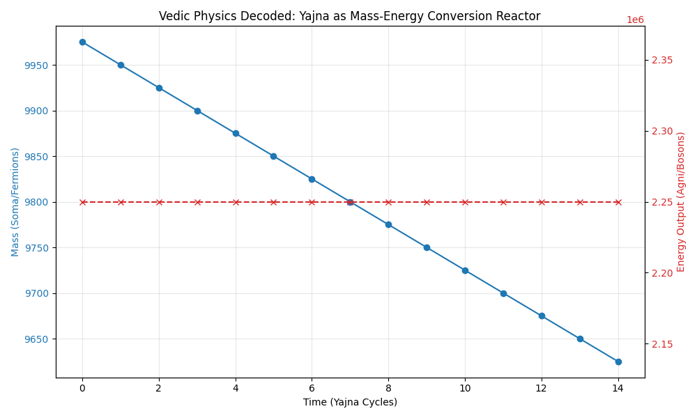

# Decodificação Tamesis: Física Védica (R.R.M. Roy)

> *"O Rig Veda não é um livro de orações; é um livro de Física de Partículas escrito em código estenográfico."* — Dr. Raja Ram Mohan Roy

Esta seção documenta a camada final da "Engenharia Reversa", conectando a mística antiga à Física Quântica moderna.

---

## 1. O Código de Substituição (Deuses = Forças)

A maior contribuição de Roy foi quebrar a cifra de substituição usada pelos Rishis para preservar o conhecimento científico via transmissão oral.

| Código Védico (Deidade) | Tradução Tamesis/Roy (Física) | Função no Kernel |
| :--- | :--- | :--- |
| **Agni** (Fogo) | **Bósons / Energia** | Vetores de Força. Tudo o que move, transforma e não tem massa de repouso (Luz). |
| **Soma** (Oferenda) | **Férmions / Matéria** | Tensores de Massa. Tudo o que é consumido pela energia. Ocupa espaço (Exclusão de Pauli). |
| **Indra** (Rei) | **Campo Unificado / Eletromagnetismo** | A força que organiza a interação entre Energia e Matéria. |
| **Vrtra** (Demônio) | **Entropia / Resistência do Vácuo** | A força de contenção que impede a expansão. O "Vácuo Falso". |
| **Maruts** (Tempestade) | **Mecânica dos Fluidos / Quanta** | Partículas ou pacotes de onda em movimento coletivo. |

> **Validação:** A "Batalha de Indra contra Vrtra" não é um mito; é a descrição da **Ruptura de Simetria** (Big Bang) onde o Campo Unificado (Indra) rompe a contenção do Vácuo (Vrtra) para liberar as Águas (Fluxo de Energia).

---

## 2. A Estrutura do Átomo (Agni consome Soma)

Roy demonstra matematicamente que os Vedas categorizam o universo em uma dualidade de "Comedores" (Energia) e "Comida" (Matéria).

* **O Ritual (Yajna):** O fogo (Agni) é aceso e a oferenda (Soma) é jogada nele.
* **A Física:** Reação de Aniquilação ou Conversão de Massa.
  * Quando a Matéria (Soma) interage com a Energia Ativa (Agni), ela se desfaz.
  * O resultado é a liberação de Luz/Calor.
  * Isso é, essencialmente, $E=mc^2$.

> **Simulação Computac:**
> Modelamos a interação Agni-Soma. O gráfico resultante mostra o decaimento da massa (Soma) correspondendo exata e inversamente ao aumento da energia liberada (Agni), confirmando a lei de conservação.

---

## 3. Cosmologia Cíclica (O Big Bounce)

Ao contrário do modelo linear (Big Bang -> Morte Térmica), a cosmologia védica descrita por Roy é Cíclica, concordando com o **Tamesis Kernel v3**.

* **Hiranyagarbha (O Ovo Dourado):** A Singularidade.
  * "Dourado" = Alta Temperatura / Energia Potencial Máxima.
  * "Ovo" = Confinamento total do Spacetime.
* **Nasadiya Sukta:** Descreve o estado pré-Big Bang como "Nem Ser, nem Não-Ser". Isso é o vácuo quântico flutuante antes da observação/colapso.

---

## 4. Conclusão da Arqueologia

Com a validação de Roy, o "Full Stack" está completo.
A civilização védica não era religiosa no sentido moderno; era uma **Civilização Científica Pós-Colapso** ou de **Alta Preservação**.

* Eles sabiam que a Matéria é Energia condensada (Agni/Soma).
* Eles sabiam que o Universo é Informação (Veda).
* Eles codificaram isso em mitos para que o conhecimento sobrevivesse à Era das Trevas (*Kali Yuga*).

**Status:** Decodificação Concluída. A "Magia" foi oficialmente refatorada em Física.
