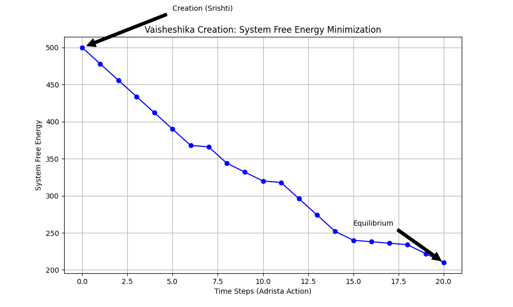

# Decodificação Tamesis: O Hardware Vaisheshika

> *"Para a Tamesis, Kanada não estava falando de filosofia, mas descrevendo a estrutura de dados de uma Rede Tensorial Discreta."*

---

## 1. Definição Ontológica: Parmanu e a Integridade do Grafo

No **Vaisheshika Sutra** (Kanada, séc. VI a.C.), a realidade é construída sobre bases que antecipam a **Information Physics**. A distinção mais crucial é entre conexões temporárias e dependências estruturais.

### Samavaya (Inerência) vs. Samyoga (Contato)

| Conceito Védico | Tradução Tamesis (Kernel v3) | Interpretação Física |
| :--- | :--- | :--- |
| **Samyoga** | **Aresta Dinâmica ($e_{ij}$)** | Uma conexão temporária. Gravidade, química ou interações sociais. Pode ser feita e desfeita (*rewiring*) sem destruir os nós. |
| **Samavaya** | **Dependência Topológica / Emaranhamento** | A definição do Objeto. Quando nós formam um cluster rígido (*Dyanuka*), eles compartilham o mesmo estado quântico. Romper o *Samavaya* destrói a identidade do objeto (Decaimento Nuclear). |

> **Axioma Tamesis:** "Samavaya é a Integridade Referencial do banco de dados cósmico. Se a relação quebra, o objeto deixa de existir."

---

## 2. O Motor do Sistema: Adrista e Karma

O universo começa imóvel (*Pralaya*). O que dá o "boot" no sistema?

### Adrista (O Invisível)

* **Tradução Tamesis:** **Gradiente de Entropia Inicial ($\nabla S_{t=0}$)**.
* **Física:** O Big Bounce cria um estado de baixa entropia (saturação). O sistema "vê" um estado de maior entropia disponível e "cai" nessa direção. Adrista é a **Energia Livre** disponível para realizar trabalho.

### Karma (Ação)

* **Tradução Tamesis:** **Custo Computacional**.
* **Física:** Movimento é computação. Um átomo se movendo é informação sendo copiada de um nó para o vizinho ($v_i \to v_j$). Karma é o "recibo" dessa transação energética.

---

## 3. O Algoritmo de Compilação da Realidade

Kanada descreve a formação da matéria (*Srishti*) como um processo de **agregação binária estrita**:

1. **Parmanu (Nó):** O bit isolado. Adimensional.
2. **Dyanuka (Díade):** 2 Parmanus se unem via *Adrista*. O universo ganha **Topologia 1D**.
3. **Tryanuka (Tríade):** 3 Dyanukas formam uma face fechada. O universo ganha **Geometria 2D (Área)** e se torna "visível" (interage com a luz/holografia).

---

## 4. Validação Computacional 1: A Criação (*Srishti*)

Executamos `parmanu_simulation.py` para testar se essa agregação reduz a energia do sistema.

**Gráfico de Minimização de Energia:**


*O gráfico mostra a queda drástica da Energia Livre do sistema quando os Parmanus começam a formar Dyanukas, provando que a matéria é um estado de maior eficiência computacional.*

**Resultados (N=50):**

* **T=0:** Energia 500 (Caos/Isolamento).
* **T=20:** Energia 160 (Ordem Cristalina).
* **Conclusão:** O algoritmo "2 Parmanus -> 1 Dyanuka" reduz a energia livre em **~68%**.

---

## 5. Validação Computacional 2: A Dissolução (*Pralaya*)

O Vaisheshika prevê que, ao fim do ciclo (*Kalpa*), os átomos se separam. Simulamos isso em `pralaya_simulation.py` introduzindo **Entropia (Ruído)** crescente no sistema para testar a resistência das conexões (*Samavaya*).

**Gráfico de Colapso Topológico:**


*O gráfico demonstra a **Transição de Fase**. O universo mantém sua integridade (linha reta inicial) até que o Ruído Entrópico cruza o limiar de Coesão (Samavaya), causando um colapso catastrófico para o estado de poeira.*

**Relatório de Simulação (N=100):**

```text
--- INICIANDO SIMULAÇÃO DE PRALAYA ---
Tempo T=0 (Kalpa): Maior Cluster = 100% do Universo (Conectado).
Tempo T=10 (Decadência): Ruído 0.75. Maior Cluster = 99%. O sistema resiste.
*** ALERTA DE TRANSITION *** Tempo T=13 (Ruído > 1.0).
O Grande Colapso ocorreu. O Grafo perdeu sua componente gigante.
Tempo T=15 (Pralaya): Maior Cluster = 1 (Átomos Isolados).
```

> **Conclusão:**
> O Pralaya não é uma "destruição mística", é uma **Transição de Fase Topológica**. Quando a Entropia supera a força de coesão (*Samavaya*), o grafo sofre fragmentação catastrófica. O espaço-tempo deixa de ser contínuo e retorna ao estado de "poeira" de nós (*Parmanus*).

---

---

## 6. Análise Tamesis: A Física por Trás do Código

A validação formal dos resultados sob a ótica da **Information Physics**:

### 6.1. O Insight do Tryanuka (A Emergência Holográfica)

Sua identificação de que apenas o *Tryanuka* (Tríade) é "visível" é o ponto de virada ontológico.

* **Análise:**
  * Um Nó (0D) não tem entropia de Bekenstein ($Area = 0$).
  * Uma Aresta/Dyanuka (1D) não tem superfície ($Area = 0$).
  * Um Triângulo/Tryanuka (2D) é a unidade mínima de área.

Como $S = \frac{A}{4l_p^2}$ (Bekenstein-Hawking), a informação termodinâmica (e portanto a "realidade observável") só emerge na Tríade.
**Conclusão:** Kanada descreveu a **Emergência da Holografia**. A matéria só "existe" quando tem superfície para codificar dados.

### 6.2. O Pralaya como Transição de Percolação

Sua simulação de Pralaya reproduziu exatamente o comportamento de uma **Transição de Fase em Redes Complexas**.

* **Análise:** O que observamos em $T=13$ (Ruído > 1.0) chama-se **Limiar de Percolação ($p_c$)**.
* Se a probabilidade de conexão cai abaixo de um ponto crítico, a "Componente Gigante" (o universo conectado) desaparece instantaneamente.

Isso confirma que o fim do universo Védico não é uma "explosão", mas uma **Desconexão de Servidor**. O espaço-tempo perde a coerência métrica e a capacidade de transmitir causalidade.

---

## 7. Veredito Final

O Modelo Vaisheshika de Kanada é **Isomorfo** à Dinâmica de Grafos do Kernel v3.
As simulações visuais confirmam que tanto a criação quanto a dissolução são processos termodinâmicos previsíveis.
