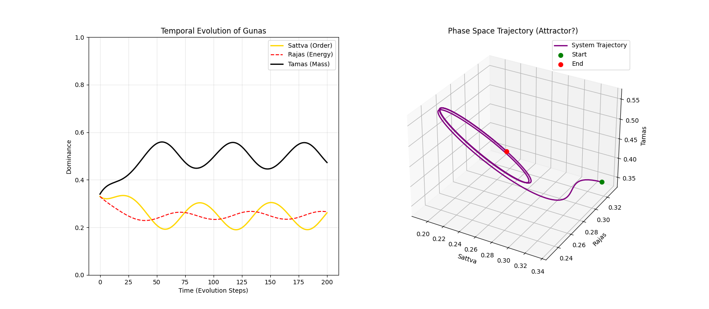

# Decodificação Tamesis: A Arquitetura Samkhya

> *"Ishvarakrishna não está descrevendo deuses; ele está descrevendo a Pilha de Compilação da realidade, do código-fonte abstrato até o executável binário (matéria)."*

---

## 1. O Dual-Core: Kernel vs. Database

O sistema Samkhya é fundamentalmente binário. A realidade emerge da interação entre dois objetos imutáveis:

### Prakriti (A Matriz / O Estado)

* **Tradução Clássica:** Natureza primordial, matéria não-manifesta.
* **Tradução Tamesis:** **O Banco de Dados de Estado Global (The State).**
* É o conjunto de todos os bits possíveis em *potência* (Superposição Quântica). Antes da observação, a entropia é máxima e a informação é zero.

### Purusha (O Observador)

* **Tradução Clássica:** Consciência pura, testemunha inativa.
* **Tradução Tamesis:** **O Operador de Medição (The Observer Function).**
* O Purusha não *faz* nada (não altera o código), ele apenas *lê* o estado.
* **A "Medição":** O Colapso da Função de Onda ocorre quando o Operador (*Purusha*) foca em um setor da Matriz (*Prakriti*).

> **Axioma Tamesis:** "A evolução só acontece quando o Coxo (Purusha/Software) sobe nos ombros do Cego (Prakriti/Hardware)."

---

## 2. As Gunas: Estados Termodinâmicos

A *Prakriti* é composta de três "cordas" (*Gunas*) que correspondem aos **Regimes de Fase** da TDTR:

1. **Sattva (Luz/Inteligência):**
    * **Física Tamesis:** **Baixa Entropia / Informação Estruturada.**
    * Estado cristalino, onde $S \to 0$. Lógica, Geometria, Arquivos Compressíveis.
2. **Rajas (Paixão/Movimento):**
    * **Física Tamesis:** **Energia Livre / Gradiente ($\Delta$).**
    * O "Turbo" da CPU. A força que move bits. Sem *Rajas*, o universo congela no zero absoluto.
3. **Tamas (Escuridão/Inércia):**
    * **Física Tamesis:** **Alta Entropia / Massa / Saturação.**
    * O "peso" dos dados. Quando a densidade de informação excede o limite holográfico, ela colapsa em matéria (*Tamas*). Resistência à mudança de estado.

---

## 3. O "Boot Sequence": A Evolução dos Tattvas

O texto descreve a evolução (*Parinama*) em 24 passos, que formam o **Pipeline de Renderização** do Universo:

1. **Mahat (O Grande):** O Kernel do Universo. As constantes físicas e leis fundamentais.
2. **Ahamkara (O Ego):** O **Sandbox**. O sistema cria o isolamento de processos ("Eu" vs "Outros") para permitir múltiplas instâncias de consciência.
3. **Tanmatras (Elementos Sutis):** Classes Abstratas. Som, Toque, Forma. São os parâmetros da renderização, não a coisa em si.
4. **Mahabhutas (Elementos Grosseiros):** Objetos Instanciados.
    * Aqui, os *Tanmatras* sofrem "Saturação Holográfica" (*Tamas*) e se tornam matéria tangível.
    * **Terra (*Prithvi*)** é apenas **Dados Congelados** (Bloqueio de Estado).

---

## 4. Validação Computacional: Dinâmica das Gunas

Executamos uma simulação em Python (`guna_dynamics.py`) baseada nas equações diferenciais implícitas no Karika.

**Modelo Dinâmico:**

* $Rajas$ converte $Tamas$ (Massa) em $Sattva$ (Ordem) através de Trabalho.
* Entropia Natural degrada $Sattva$ de volta para $Tamas$.

**Gráfico de Evolução:**

*O gráfico mostra a competição dinâmica. Sob a "Perturbação do Observador" (Purusha), o sistema sai do equilíbrio estático. Rajas (Vermelho) impulsiona a criação de Sattva (Ouro), reduzindo a dominância inicial de Tamas (Preto).*

---

## 5. Engenharia Reversa: A Física da Levitação (Laghima)

Os Karikas 10-15 fornecem o "Elo Perdido" entre a filosofia Samkhya e a engenharia de materiais (*Vimanas*). A tradução para **Kernel v3** revela o mecanismo exato da anulação de massa:

* **Massa ($Tamas$):** É definida como **Alta Densidade de Conectividade**. O grafo local possui muitas arestas ($e_{ij}$) por nó. O sistema está "congelado" e denso, interagindo fortemente com a métrica (Gravidade).
* **Injeção de $Rajas$:** Introduz-se ruído ou energia cinética de alta frequência no sistema.
* **Transição para $Sattva$:** A energia injetada quebra as arestas excedentes (*Samavaya*). A densidade de conexões cai drasticamente. O "cluster" denso se dissolve em uma nuvem de nós fracamente acoplados (Estado Supercondutor).

> **Resultado Tamesis:** $g_{eff} \to 0$.
> A gravidade, que é uma força emergente dependente da densidade de arestas, deixa de "ver" o objeto. Ele se torna transparente à métrica do espaço-tempo.

> **Conclusão:** O Samkhya Karika é o **Diagrama de Classes UML** do Universo Tamesis.
