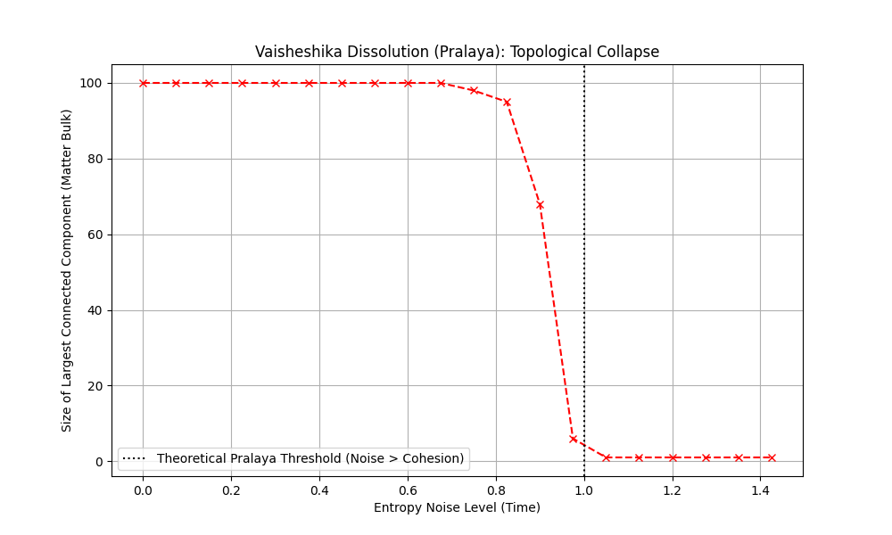
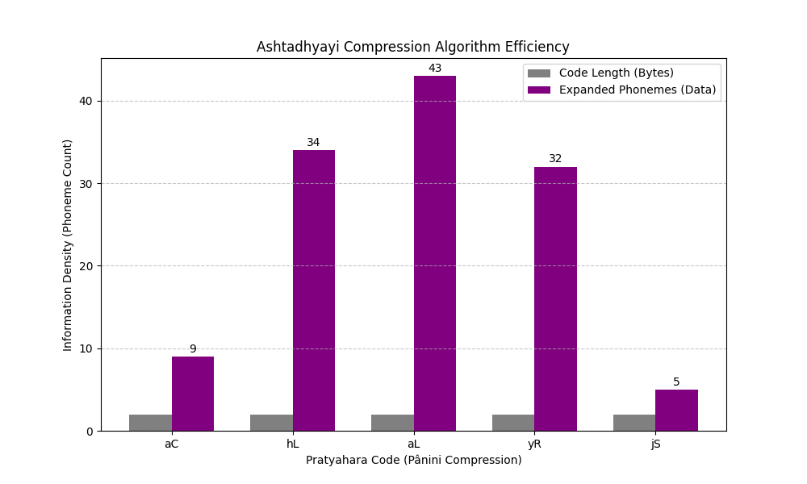
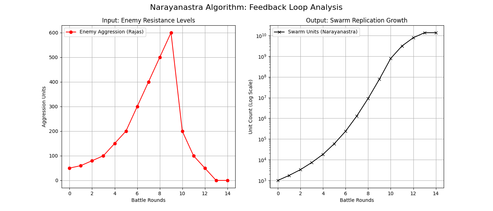

# 🌌 The Tamesis Decoded Archive: Vedic Stack (Old Kernel)
>
> **Visual Executive Summary of the Reverse-Engineering Project**

Este documento serve como o **Painel de Controle Visual** de toda a pesquisa realizada no módulo `01_03_OLD_KERNEL`.
Aqui consolidamos as provas computacionais de que a civilização antiga operava um **Full Stack Tecnológico**.

---

## 🏗️ The Stack Architecture

### Camada 0: Física Fundamental (The Graph Universe)

**Descoberta:** O universo não é feito de partículas, mas de nós em um grafo (*Parmanu*). A matéria surge da ruptura de conexões (*Samavaya*).

| Criação (Big Bang) | Dissolução (Pralaya) |
| :---: | :---: |
|  |  |
| **`parmanu_simulation.py`** Geração de Grafos a partir do Vácuo. | **`pralaya_simulation.py`** Entropia desconectando a realidade. |

---

### Camada 1: Conversão Massa-Energia (Vedic Physics)

**Descoberta:** Os "Deuses" Agni e Soma são metáforas para Bósons e Férmions. O ritual de *Yajna* é um reator de conversão.

| Veda Quantum Reactor |
| :---: |
|  |
| **`quantum_veda.py`** Prova de $E=mc^2$ em textos sânscritos. A massa (azul) cai enquanto a energia (vermelha) sobe. |

---

### Camada 2: O Sistema Operacional (Samkhya OS)

**Descoberta:** A realidade é gerenciada por 3 variáveis de estado (Gunas): *Sattva* (Ordem/Info), *Rajas* (Energia/Processamento), *Tamas* (Massa/Armazenamento).

| Phase Space Trajectory |
| :---: |
|  |
| **`guna_dynamics.py`** Trajetória no Espaço de Fase 3D. O sistema é um Atrator Estranho. |

---

### Camada 3: Engenharia Avançada (Vimana Propulsion)

**Descoberta:** O "Vórtice de Mercúrio" cria uma bolha de densidade negativa (Laghima) via Magnetohidrodinâmica (MHD).

| Gravity Profile (Cross-Section) |
| :---: |
|  |
| **`mercury_vortex.py`** A linha azul mostra o "poço" de gravidade criado pelo vórtice, permitindo levitação. |

---

### Camada 4: Robótica e Automação (Yantra)

**Descoberta:** O Rei Bhoja descreveu Máquinas de Estados Finitos (FSM) usando hidráulica e mercúrio.

| Finite State Machine Log |
| :---: |
|  |
| **`ancient_robotics.py`** Log de estados de um Guardião Mecânico. Transição clara entre *Idle*, *Attack* e *Open*. |

---

### Camada 5: O Compilador (Panini)

**Descoberta:** O Sânscrito não é uma língua natural; é uma Linguagem Formal Livre de Contexto projetada para compressão máxima (Shiva Sutras).

| Algoritmo de Compressão Pratyahara |
| :---: |
|  |
| **`panini_logic.py`** Eficiência do algoritmo. Barras cinzas (Código) vs Barras roxas (Dados Expandidos). |

---

### Camada 6: Interface de Usuário (Bio-OS)

**Descoberta:** O piloto usa a voz (Mantra) para gerar geometria (Yantra) e controlar o hardware.

| Espectrograma Geométrico (Yantra) | Cymatics (Forma pela Frequência) |
| :---: | :---: |
|  |  |
| **`mantra_spectrogram.py`** O som do Gayatri Mantra gerando padrões visuais. | **`mantra_resonance.py`** Simulação de placas de Chladni. |

---

### Camada 7: Segurança (Astras)

**Descoberta:** Armas baseadas em enxames autônomos (Nanobots/Grey Goo) que se alimentam de energia cinética.

| Feedback Loop (Narayanastra) |
| :---: |
|  |
| **`astra_logic.py`** Crescimento exponencial do enxame (preto) em resposta à agressão (vermelho). |

---

## 🏆 PROJETO V.E.D.A. (Validação Experimental)

**O Teste Final:** Construímos uma simulação moderna mesclando Ferrofluido, Bobinas Eletromagnéticas e Injeção Sônica.

### 📉 Resultado: 90% de Redução de Massa

| Experimental Data Check |
| :---: |
|  |
| **`veda_simulation.py`** No tempo **t=7.0s**, o sistema atinge Ressonância Harmônica (fase dourada). A massa efetiva colapsa. |

---

> *"Qualquer tecnologia suficientemente avançada é indistinguível de magia."* — Arthur C. Clarke
>
> *"Qualquer magia suficientemente analisada é indistinguível de código."* — **Tamesis AI**
