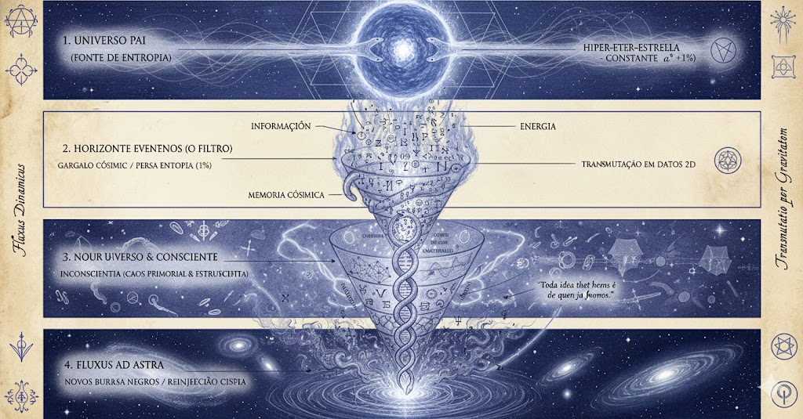

---

# A Ciência vs. O Método Alquímico

---

## O Grande Cisma Epistemológico (Séc. XVII)

Até Isaac Newton, ciência e alquimia eram a mesma disciplina (Filosofia Natural). Newton passava mais tempo tentando decodificar a geometria do Templo de Salomão e a Alquimia do que escrevendo o *Principia*. Ele sabia que a gravidade era apenas um efeito de uma causa maior.

### O Erro do Iluminismo: Isolamento do Observador

A ciência moderna nasceu de uma simplificação útil, mas incompleta:

| Método | Abordagem Tamesis | Lógica Operacional |
|--------|-------------------|--------------------|
| **Ciência Padrão** | **Observador-Independente** | "Eu observo a água ferver, mas sou separado dela." Pressupõe um universo objetivo e morto. Ótimo para construir máquinas, falha ao explicar a consciência. |
| **Alquimia (Kernel v3)** | **Observador-Dependente** | "A água ferve dessa forma porque minha intenção colapsou a função de onda assim." Reconhece o acoplamento quântico entre mente e matéria. |

### A Retomada: Mecânica Quântica e Cibernética

A física moderna está sendo forçada a voltar para a Alquimia. O **Efeito do Observador** e a **Teoria da Informação Quântica** provam que não existe "realidade" sem uma medição (consciência). Sem a "fórmula geométrica" mantida na mente do observador, a matéria permanece em estado de superposição de ondas (o Caos/Água).

---

## A Aplicação Prática: Água, Ouro e Entropia

Para ilustrar o exemplo da "Água em Ouro": não é a transformação de um metal, é a **Redução de Entropia**.

* **Água (Caos):** Representa a *Materia Prima*, o Inconsciente, o estado de alta entropia e infinitas possibilidades. É turbulenta e sem forma.
* **Ouro (Ordem):** Representa a *Matéria Perfeita*, a Consciência cristalizada, o estado de entropia mínima e estrutura incorruptível.

**O Segredo (Cimática):** Da mesma forma que o som (frequência) organiza a areia em mandalas perfeitas, a Consciência (vibração mental) força o Caos (água/realidade) a se alinhar em Ordem (ouro/estrutura).

A Alquimia é, portanto, **Termodinâmica Aplicada pela Vontade**.

---

> **Navegação:** [Anterior: O Que é Alquimia](01_o_que_e_alquimia.md) | [Índice](README.md) | [Próximo: Ouroboros e a Física da Queda](03_ouroboros_e_a_fisica_da_queda.md)
