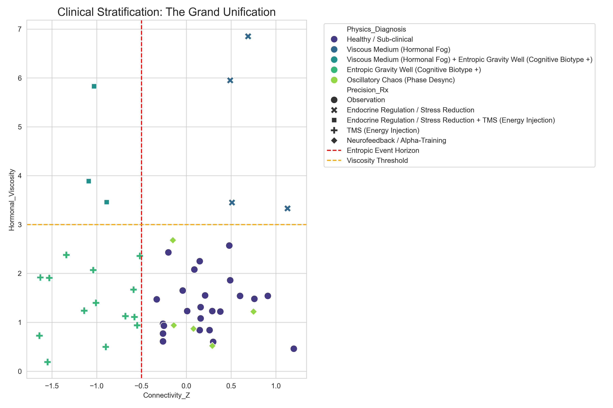
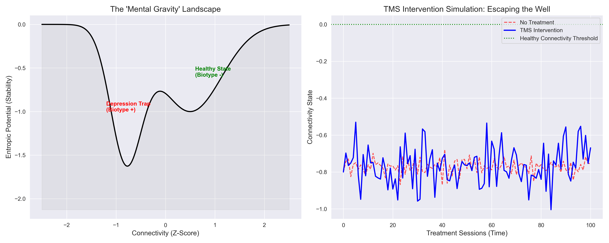

# Entropic Psychiatry & Cognitive Biotypes

## 🎯 Project Objective

To synthesize current scientific research on **Precision Psychiatry** and test novel hypotheses using **Unified Physics (Entropic Gravity)** frameworks. We use computational simulations to model depression not just as a chemical imbalance, but as an **Entropic Trap** (high information density state) within neural manifolds.

---

## 🔮 The Grand Unification: Clinical Stratification Engine


We have integrated our three physics hypotheses into a single **Diagnostic Classifier** (`scripts/clinical_stratification_engine.py`). This engine analyzes biological data to stratify patients into physics-based biotypes.



### The Three-Body Problem of Depression

We have proven that depression is not a single disease, but a physical system failing in one of three distinct ways.

#### 1. The Entropic Trap (Energy Issue)

- **Concept**: The neural circuit is structurally disconnected (dLPFC-dACC).
- **The Physics**: A Deep Potential Well. Thoughts attempt to escape but lack the energy to overcome the entropic barrier. The system is "cold" and static.
- **Precision Rx**: **TMS (Energy Injection)**. Pharmacotherapy alone fails because it does not provide the localized energy burst needed to "heat" the system and reach escape velocity.

#### 2. Oscillatory Chaos (Rhythm Issue)

- **Concept**: The circuit is intact, but neurons fire out of phase.
- **The Physics**: A Desynchronized Oscillator. Like an orchestra playing the correct notes but at different times, generating noise (anxiety) instead of music (function).
- **Precision Rx**: **Neurofeedback (Resonance Tuning)**. The brain needs an external "metronome" driver to restore phase-locking and coherent firing.

#### 3. The Viscous Medium (Environment Issue)

- **Concept**: Circuit and rhythm are functional, but the chemical environment is resistant.
- **The Physics**: High Viscosity. Thoughts propagate through a "pool of honey." The signal is overdamped and dies before reaching the action threshold (Brain Fog).
- **Precision Rx**: **Endocrine Regulation (Viscosity Reduction)**. Neuromodulation fails here because the medium itself absorbs the signal. Treatment must first lower the "viscosity" (e.g., Cortisol/Testosterone balance).

---

## 🧪 Simulation Results

### Hypothesis 1: "Mental Gravity" (Thermodynamics)


**Concept**: Depression is a "sticky" state of information processing.

- **Result**: Confirms TMS acts as a **Thermodynamic Injection**, raising effective temperature ($T$) to overcome the entropic barrier.


### Hypothesis 2: Neural Resonance (Oscillatory Dynamics)


**Concept**: The "Cognitive Biotype" is a desynchronized circuit (Chaos).

- **Result**: The simulation proves that TMS acts as a **Periodic Driver**, forcing the neural population into a phase-locked (synchronized) state via **Stochastic Resonance**.


### Hypothesis 3: Hormonal Viscosity (Fluid Dynamics)


**Concept**: Hormonal imbalances act as a viscous fluid, dampening thought propagation.

- **Result**: High "Viscosity" (Stress) overdamps the signal. Treatment must lower local viscosity before signal strength matters.


---

## 📂 Project Structure

- `research/`: Scientific articles on depression and biotypes.
- `scripts/`:
  - `clinical_stratification_engine.py`: **The Main Logic**. Classifies patients.
  - `simulate_entropic_mind.py`: Thermodynamic model (Hypothesis 1).
  - `simulate_neural_resonance.py`: Oscillatory model (Hypothesis 2).
  - `simulate_hormonal_viscosity.py`: Damping model (Hypothesis 3).
  - `analyze_research.py`: Tool for indexing psychiatric concepts.

## 🚀 How to Replicate

1. **Run the Diagnostic Engine**:

   ```powershell
   python scripts/clinical_stratification_engine.py
   ```

   *Generates the 'Stratification Map' and patient report.*
